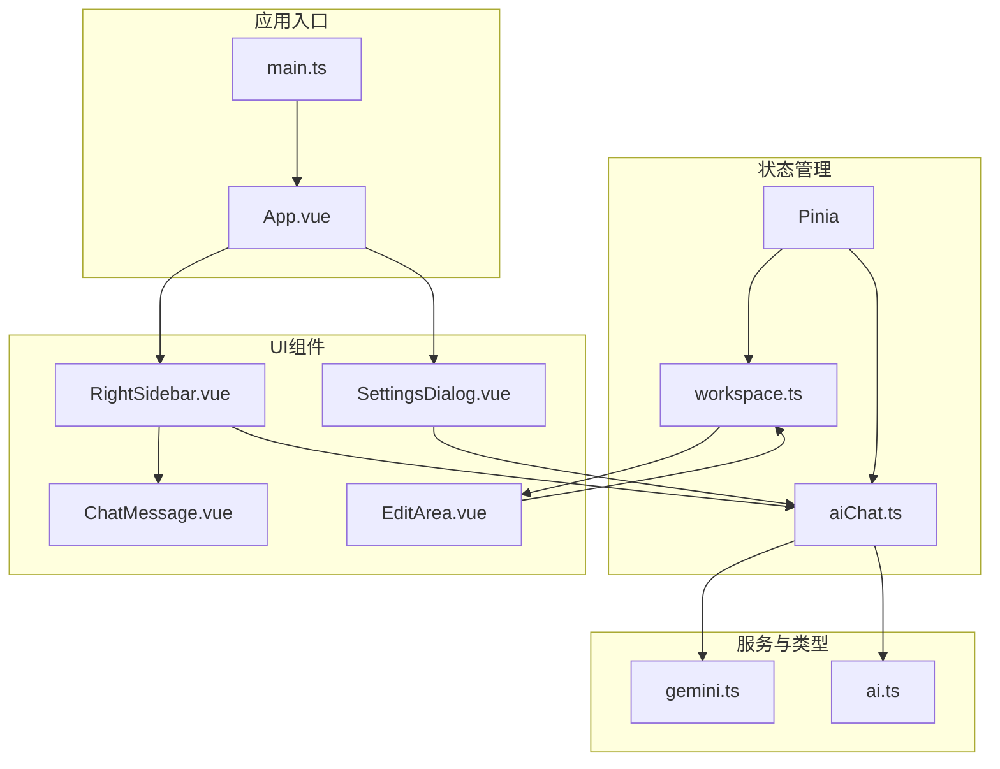
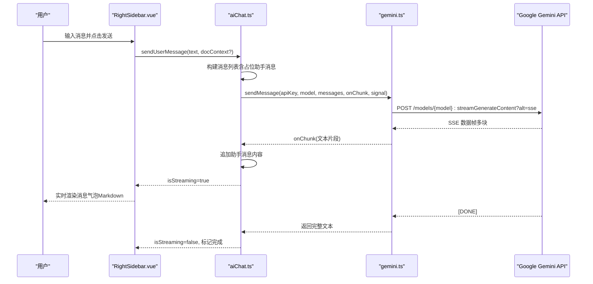
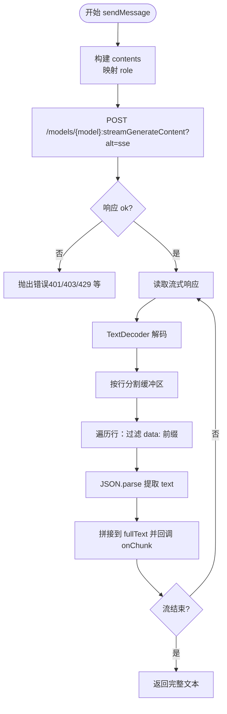
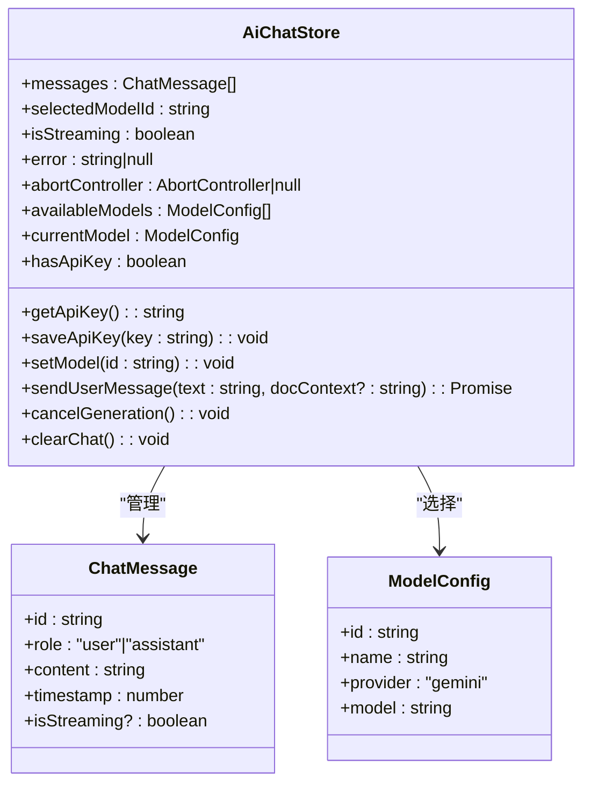
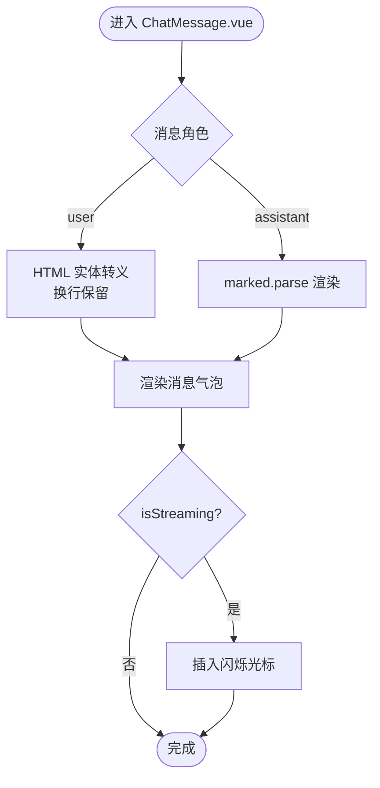
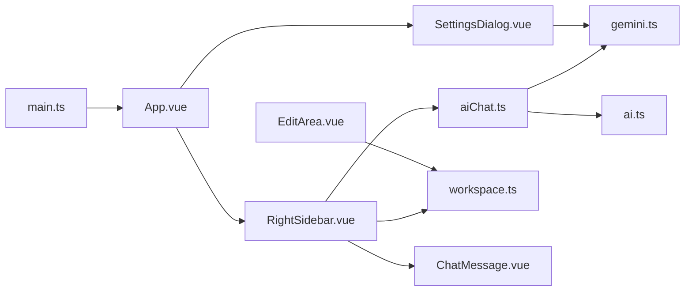

# AI助手集成

<cite>
**本文档引用的文件**
- [gemini.ts](file://app/src/services/gemini.ts)
- [aiChat.ts](file://app/src/stores/aiChat.ts)
- [ai.ts](file://app/src/types/ai.ts)
- [ChatMessage.vue](file://app/src/components/layout/ChatMessage.vue)
- [RightSidebar.vue](file://app/src/components/layout/RightSidebar.vue)
- [SettingsDialog.vue](file://app/src/components/layout/SettingsDialog.vue)
- [EditArea.vue](file://app/src/components/layout/EditArea.vue)
- [workspace.ts](file://app/src/stores/workspace.ts)
- [App.vue](file://app/src/App.vue)
- [main.ts](file://app/src/main.ts)
- [package.json](file://app/package.json)
</cite>

## 目录
1. [简介](#简介)
2. [项目结构](#项目结构)
3. [核心组件](#核心组件)
4. [架构总览](#架构总览)
5. [详细组件分析](#详细组件分析)
6. [依赖关系分析](#依赖关系分析)
7. [性能考量](#性能考量)
8. [故障排查指南](#故障排查指南)
9. [结论](#结论)
10. [附录](#附录)

## 简介
本文件面向Woo应用中的AI助手集成，聚焦于Google Gemini API的接入与使用，涵盖API Key配置、请求参数与响应处理、流式响应的实现原理（数据分块、实时渲染与交互优化）、聊天界面组件设计（ChatMessage组件的状态管理、消息历史与输入处理）、AI聊天状态管理（会话维护、上下文传递与错误处理）、与后端服务的集成方式与数据流向、以及用户体验设计（加载状态、消息气泡样式与键盘快捷键）。文档同时提供API调用示例路径、错误处理策略与性能优化建议。

## 项目结构
Woo采用前端单页应用（Vue 3 + Vite）与可选的Electron打包方案。AI助手相关代码主要位于app/src目录下，包括：
- 服务层：Google Gemini API封装与工具函数
- 状态层：基于Pinia的AI聊天状态管理
- 类型层：消息与模型配置的数据契约
- UI层：聊天侧边栏、消息气泡、设置对话框等组件
- 工作区：与编辑器联动，提供文档上下文

图表来源
- [main.ts:1-8](file://app/src/main.ts#L1-L8)
- [App.vue:1-111](file://app/src/App.vue#L1-L111)
- [RightSidebar.vue:1-432](file://app/src/components/layout/RightSidebar.vue#L1-L432)
- [SettingsDialog.vue:1-287](file://app/src/components/layout/SettingsDialog.vue#L1-L287)
- [ChatMessage.vue:1-93](file://app/src/components/layout/ChatMessage.vue#L1-L93)
- [EditArea.vue:1-463](file://app/src/components/layout/EditArea.vue#L1-L463)
- [aiChat.ts:1-199](file://app/src/stores/aiChat.ts#L1-L199)
- [workspace.ts:1-321](file://app/src/stores/workspace.ts#L1-L321)
- [gemini.ts:1-103](file://app/src/services/gemini.ts#L1-L103)
- [ai.ts:1-20](file://app/src/types/ai.ts#L1-L20)

章节来源
- [main.ts:1-8](file://app/src/main.ts#L1-L8)
- [App.vue:1-111](file://app/src/App.vue#L1-L111)

## 核心组件
- Google Gemini服务封装：提供API Key校验、HTML清理、流式消息发送与分块解析
- AI聊天状态管理：集中管理消息列表、模型选择、流式状态、错误信息与AbortController
- 聊天界面组件：消息气泡渲染（用户/助手）、Markdown渲染、光标闪烁与样式
- 设置对话框：API Key输入、可见性切换、在线验证与保存
- 右侧聊天侧边栏：模型选择、清空聊天、输入区域、快速按钮、滚动控制与错误展示
- 工作区状态：当前文档内容，作为AI上下文注入

章节来源
- [gemini.ts:1-103](file://app/src/services/gemini.ts#L1-L103)
- [aiChat.ts:1-199](file://app/src/stores/aiChat.ts#L1-L199)
- [ChatMessage.vue:1-93](file://app/src/components/layout/ChatMessage.vue#L1-L93)
- [SettingsDialog.vue:1-287](file://app/src/components/layout/SettingsDialog.vue#L1-L287)
- [RightSidebar.vue:1-432](file://app/src/components/layout/RightSidebar.vue#L1-L432)
- [workspace.ts:1-321](file://app/src/stores/workspace.ts#L1-L321)

## 架构总览
AI助手的端到端流程如下：
- 用户在右侧聊天侧边栏输入消息，触发状态管理派发
- 状态管理根据是否有文档上下文决定是否注入上下文
- 通过服务层调用Google Gemini流式接口，逐块接收响应
- 服务层解析SSE数据帧，回调上层追加消息内容
- UI层实时渲染消息气泡，支持Markdown与流式光标
- 错误统一由状态管理捕获并展示，支持取消生成与清空

图表来源
- [RightSidebar.vue:120-129](file://app/src/components/layout/RightSidebar.vue#L120-L129)
- [aiChat.ts:73-169](file://app/src/stores/aiChat.ts#L73-L169)
- [gemini.ts:29-102](file://app/src/services/gemini.ts#L29-L102)

## 详细组件分析

### Google Gemini服务封装（gemini.ts）
- API Key校验：通过列举模型接口进行有效性验证
- HTML清理：将富文本转换为纯文本，避免模型误解
- 流式发送：构建contents数组，映射角色（assistant→model），使用SSE alt=sse
- 响应解析：读取ReadableStream，按行解析SSE数据帧，跳过[DONE]，解析JSON提取文本片段
- 错误处理：针对401/403/429等状态抛出明确错误信息

图表来源
- [gemini.ts:29-102](file://app/src/services/gemini.ts#L29-L102)

章节来源
- [gemini.ts:1-103](file://app/src/services/gemini.ts#L1-L103)

### AI聊天状态管理（aiChat.ts）
- 状态：消息列表、当前模型、流式状态、错误信息、AbortController
- 计算属性：可用模型列表、当前模型、API Key存在性
- API Key管理：本地存储读写，变更触发hasApiKey响应式更新
- 发送消息：构建用户消息与占位助手消息；根据是否首次消息注入文档上下文；创建AbortController；调用服务层流式发送；在onChunk中增量更新助手消息；异常捕获与清理；结束时关闭流式状态
- 取消与清空：调用AbortController.abort；清空消息与错误

图表来源
- [aiChat.ts:1-199](file://app/src/stores/aiChat.ts#L1-L199)
- [ai.ts:1-20](file://app/src/types/ai.ts#L1-L20)

章节来源
- [aiChat.ts:1-199](file://app/src/stores/aiChat.ts#L1-L199)
- [ai.ts:1-20](file://app/src/types/ai.ts#L1-L20)

### 聊天界面组件（ChatMessage.vue）
- 渲染逻辑：用户消息进行HTML实体转义并保留换行；助手消息使用marked渲染Markdown
- 样式：区分用户/助手消息气泡，圆角与边框；流式状态下显示闪烁光标
- 可访问性：使用语义化结构与合适的颜色对比度

图表来源
- [ChatMessage.vue:10-39](file://app/src/components/layout/ChatMessage.vue#L10-L39)

章节来源
- [ChatMessage.vue:1-93](file://app/src/components/layout/ChatMessage.vue#L1-L93)

### 设置对话框（SettingsDialog.vue）
- 功能：输入API Key、切换可见性、在线验证、保存至本地存储、打开外部链接
- 交互：弹窗打开时加载已有Key；验证状态反馈；保存后关闭弹窗

章节来源
- [SettingsDialog.vue:1-287](file://app/src/components/layout/SettingsDialog.vue#L1-L287)
- [gemini.ts:8-15](file://app/src/services/gemini.ts#L8-L15)

### 右侧聊天侧边栏（RightSidebar.vue）
- 结构：头部模型选择与清空按钮、消息区域、错误提示、API Key提示、输入区域与快捷按钮
- 交互：快速按钮填充输入并发送；Enter发送；自动高度调整；滚动到底部；流式内容智能滚动；停止生成
- 上下文：从工作区状态读取当前文档内容，作为首次消息的上下文注入

章节来源
- [RightSidebar.vue:1-432](file://app/src/components/layout/RightSidebar.vue#L1-L432)
- [workspace.ts:148-151](file://app/src/stores/workspace.ts#L148-L151)

### 编辑区域（EditArea.vue）
- 编辑器：基于Tiptap，提供多种快捷键与扩展
- 状态：字数统计、行数统计、当前块类型、空状态提示
- 与AI：为AI提供文档上下文，作为首次消息的输入

章节来源
- [EditArea.vue:1-463](file://app/src/components/layout/EditArea.vue#L1-L463)
- [workspace.ts:148-151](file://app/src/stores/workspace.ts#L148-L151)

## 依赖关系分析
- 应用初始化：main.ts注册Pinia，App.vue组织布局与侧边栏
- 组件依赖：RightSidebar依赖aiChat与workspace；ChatMessage依赖ai类型；SettingsDialog依赖aiChat与gemini；EditArea依赖workspace
- 第三方库：marked用于Markdown渲染；@tiptap系列用于编辑器；pinia用于状态管理

图表来源
- [main.ts:1-8](file://app/src/main.ts#L1-L8)
- [App.vue:1-111](file://app/src/App.vue#L1-L111)
- [RightSidebar.vue:1-432](file://app/src/components/layout/RightSidebar.vue#L1-L432)
- [SettingsDialog.vue:1-287](file://app/src/components/layout/SettingsDialog.vue#L1-L287)
- [ChatMessage.vue:1-93](file://app/src/components/layout/ChatMessage.vue#L1-L93)
- [aiChat.ts:1-199](file://app/src/stores/aiChat.ts#L1-L199)
- [workspace.ts:1-321](file://app/src/stores/workspace.ts#L1-L321)
- [gemini.ts:1-103](file://app/src/services/gemini.ts#L1-L103)
- [ai.ts:1-20](file://app/src/types/ai.ts#L1-L20)
- [package.json:13-35](file://app/package.json#L13-L35)

章节来源
- [package.json:13-35](file://app/package.json#L13-L35)

## 性能考量
- 流式渲染：服务层按块推送，UI即时追加，避免一次性渲染大文本
- 滚动优化：仅在接近底部时滚动到底部，减少不必要的DOM操作
- 文本截断：上下文注入前对文档内容进行长度截断，降低请求体积
- 取消机制：AbortController及时中断请求，释放资源
- 本地存储：API Key持久化，减少重复输入与网络验证成本
- Markdown解析：marked按需渲染，避免在大量消息时造成卡顿

## 故障排查指南
- API Key无效/过期：服务层在401/403时抛出明确错误；设置对话框提供在线验证；状态管理捕获并展示错误
- 请求过于频繁：429状态被识别并提示稍后再试
- 网络异常：统一捕获异常并清理空的占位助手消息
- 取消生成：点击停止按钮触发AbortController.abort，避免残留流状态
- UI无响应：检查isStreaming状态与消息列表更新；确认onChunk回调正确追加内容

章节来源
- [gemini.ts:57-65](file://app/src/services/gemini.ts#L57-L65)
- [aiChat.ts:148-168](file://app/src/stores/aiChat.ts#L148-L168)
- [RightSidebar.vue:63-81](file://app/src/components/layout/RightSidebar.vue#L63-L81)

## 结论
Woo的AI助手集成为端到端的流式对话体验提供了清晰的架构与实现路径：以Pinia集中管理状态，以服务层封装Google Gemini API，以组件层负责渲染与交互。通过上下文注入、流式渲染与滚动优化，实现了良好的用户体验。配合设置对话框的Key管理与在线验证，降低了集成门槛。后续可在请求缓存、并发限制与更丰富的Markdown扩展方面进一步优化。

## 附录

### API Key配置与验证
- 在设置对话框中输入或粘贴API Key
- 点击“验证”调用服务层validateApiKey进行在线校验
- 点击“保存”将Key写入本地存储并在下次使用时自动加载

章节来源
- [SettingsDialog.vue:14-42](file://app/src/components/layout/SettingsDialog.vue#L14-L42)
- [gemini.ts:8-15](file://app/src/services/gemini.ts#L8-L15)
- [aiChat.ts:39-59](file://app/src/stores/aiChat.ts#L39-L59)

### 请求参数与响应处理要点
- 请求体：contents数组，角色映射；generationConfig包含temperature与maxOutputTokens
- 响应：SSE数据帧，逐行解析；跳过[DONE]；提取candidates[0].content.parts[0].text
- 错误：401/403/429分别抛出明确提示

章节来源
- [gemini.ts:42-55](file://app/src/services/gemini.ts#L42-L55)
- [gemini.ts:88-98](file://app/src/services/gemini.ts#L88-L98)

### 流式响应处理实现原理
- 使用ReadableStream与TextDecoder增量解码
- 按行缓冲，保留未完成行
- 过滤data:前缀，解析JSON，提取文本片段
- 回调驱动UI增量渲染，保持交互流畅

章节来源
- [gemini.ts:67-99](file://app/src/services/gemini.ts#L67-L99)

### 聊天界面组件设计
- ChatMessage：用户消息HTML转义，助手消息Markdown渲染，流式光标闪烁
- RightSidebar：模型选择、清空、快速按钮、输入区域、错误与Banner提示、智能滚动
- SettingsDialog：API Key输入、可见性切换、在线验证、保存与外部链接

章节来源
- [ChatMessage.vue:21-39](file://app/src/components/layout/ChatMessage.vue#L21-L39)
- [RightSidebar.vue:4-82](file://app/src/components/layout/RightSidebar.vue#L4-L82)
- [SettingsDialog.vue:14-42](file://app/src/components/layout/SettingsDialog.vue#L14-L42)

### AI聊天状态管理
- 会话维护：消息列表与占位助手消息
- 上下文传递：首次消息注入文档上下文，长度截断
- 错误处理：统一捕获与展示，空占位清理

章节来源
- [aiChat.ts:73-128](file://app/src/stores/aiChat.ts#L73-L128)
- [aiChat.ts:148-168](file://app/src/stores/aiChat.ts#L148-L168)

### 与后端服务的集成与数据流向
- 前端直接调用Google Gemini API，无需后端代理
- 文档上下文来自本地工作区状态，经HTML清理后注入
- 状态通过Pinia集中管理，组件通过store暴露的方法与计算属性进行数据绑定

章节来源
- [gemini.ts:3-15](file://app/src/services/gemini.ts#L3-L15)
- [workspace.ts:148-151](file://app/src/stores/workspace.ts#L148-L151)
- [aiChat.ts:104-128](file://app/src/stores/aiChat.ts#L104-L128)

### 用户体验设计考虑
- 加载状态：isStreaming控制发送/停止按钮与滚动行为
- 消息气泡样式：用户/助手不同配色与圆角，强调视觉区分
- 键盘快捷键：Enter发送，停止按钮支持取消生成
- 智能滚动：新消息与流式更新时自动滚动到底部

章节来源
- [RightSidebar.vue:63-81](file://app/src/components/layout/RightSidebar.vue#L63-L81)
- [RightSidebar.vue:151-184](file://app/src/components/layout/RightSidebar.vue#L151-L184)
- [ChatMessage.vue:79-91](file://app/src/components/layout/ChatMessage.vue#L79-L91)