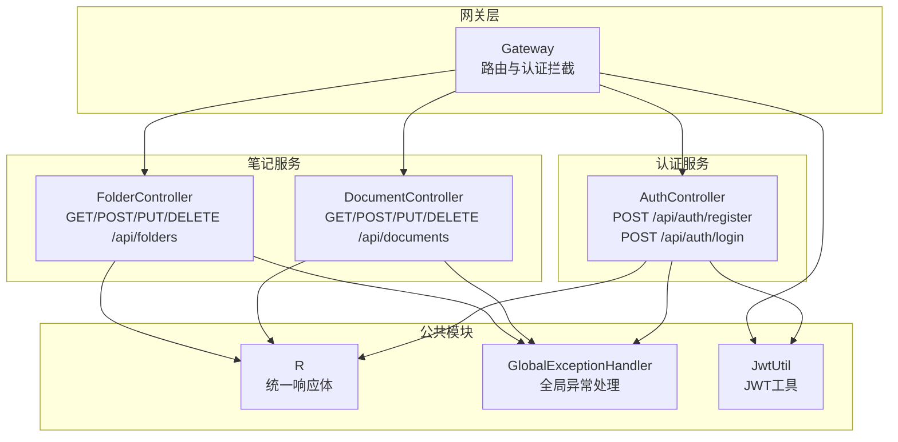
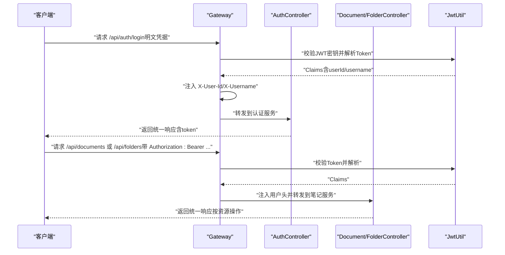
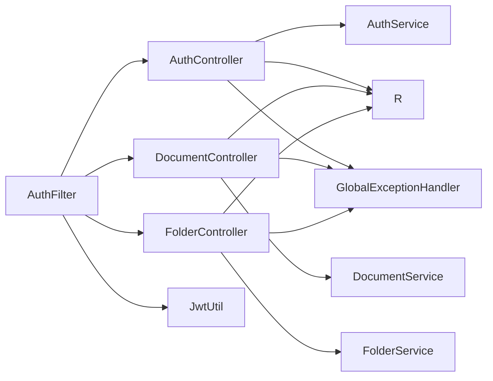

# API参考文档

<cite>
**本文档引用的文件**
- [AuthController.java](file://services/auth-service/src/main/java/com/nonegonotes/auth/controller/AuthController.java)
- [RegisterRequest.java](file://services/auth-service/src/main/java/com/nonegonotes/auth/dto/RegisterRequest.java)
- [LoginRequest.java](file://services/auth-service/src/main/java/com/nonegonotes/auth/dto/LoginRequest.java)
- [LoginResponse.java](file://services/auth-service/src/main/java/com/nonegonotes/auth/dto/LoginResponse.java)
- [DocumentController.java](file://services/note-service/src/main/java/com/nonegonotes/note/controller/DocumentController.java)
- [FolderController.java](file://services/note-service/src/main/java/com/nonegonotes/note/controller/FolderController.java)
- [DocumentRequest.java](file://services/note-service/src/main/java/com/nonegonotes/note/dto/DocumentRequest.java)
- [FolderRequest.java](file://services/note-service/src/main/java/com/nonegonotes/note/dto/FolderRequest.java)
- [R.java](file://services/common/src/main/java/com/nonegonotes/common/result/R.java)
- [GlobalExceptionHandler.java](file://services/common/src/main/java/com/nonegonotes/common/exception/GlobalExceptionHandler.java)
- [JwtUtil.java](file://services/common/src/main/java/com/nonegonotes/common/util/JwtUtil.java)
- [AuthFilter.java](file://services/gateway/src/main/java/com/nonegonotes/gateway/filter/AuthFilter.java)
- [application.yml（认证服务）](file://services/auth-service/src/main/resources/application.yml)
- [application.yml（网关）](file://services/gateway/src/main/resources/application.yml)
- [README.md](file://README.md)
</cite>

## 目录
1. [简介](#简介)
2. [项目结构](#项目结构)
3. [核心组件](#核心组件)
4. [架构总览](#架构总览)
5. [详细组件分析](#详细组件分析)
6. [依赖分析](#依赖分析)
7. [性能考虑](#性能考虑)
8. [故障排查指南](#故障排查指南)
9. [结论](#结论)
10. [附录](#附录)

## 简介
本文件为Woo（无我笔记）项目的API参考文档，覆盖认证与笔记两大模块的RESTful接口规范。认证模块提供用户注册与登录；笔记模块提供文档与目录的增删改查操作。文档遵循统一响应结构、JWT认证、请求头注入用户标识等约定，并给出请求/响应示例、错误码说明、安全与性能建议。

## 项目结构
后端采用微服务架构，通过Spring Cloud Gateway进行路由与全局认证拦截，认证服务与笔记服务分别提供独立的REST接口，公共模块提供统一响应体与异常处理。

图表来源
- [AuthController.java:12-30](file://services/auth-service/src/main/java/com/nonegonotes/auth/controller/AuthController.java#L12-L30)
- [DocumentController.java:13-48](file://services/note-service/src/main/java/com/nonegonotes/note/controller/DocumentController.java#L13-L48)
- [FolderController.java:13-47](file://services/note-service/src/main/java/com/nonegonotes/note/controller/FolderController.java#L13-L47)
- [R.java:10-41](file://services/common/src/main/java/com/nonegonotes/common/result/R.java#L10-L41)
- [GlobalExceptionHandler.java:11-26](file://services/common/src/main/java/com/nonegonotes/common/exception/GlobalExceptionHandler.java#L11-L26)
- [JwtUtil.java:15-56](file://services/common/src/main/java/com/nonegonotes/common/util/JwtUtil.java#L15-L56)
- [AuthFilter.java:26-90](file://services/gateway/src/main/java/com/nonegonotes/gateway/filter/AuthFilter.java#L26-L90)

章节来源
- [README.md: 48-63:48-63](file://README.md#L48-L63)
- [application.yml（网关）: 12-22:12-22](file://services/gateway/src/main/resources/application.yml#L12-L22)

## 核心组件
- 统一响应体：所有接口返回统一结构，包含状态码、消息与数据体。
- 全局异常处理：业务异常与未预期异常分别映射到不同响应。
- JWT认证：网关负责校验Authorization头中的Bearer Token，并将用户信息注入到后续请求头中。
- 请求头约定：笔记相关接口通过X-User-Id、X-Username识别当前用户身份。

章节来源
- [R.java: 10-41:10-41](file://services/common/src/main/java/com/nonegonotes/common/result/R.java#L10-L41)
- [GlobalExceptionHandler.java: 11-26:11-26](file://services/common/src/main/java/com/nonegonotes/common/exception/GlobalExceptionHandler.java#L11-L26)
- [AuthFilter.java: 26-90:26-90](file://services/gateway/src/main/java/com/nonegonotes/gateway/filter/AuthFilter.java#L26-L90)
- [DocumentController.java: 21-24:21-24](file://services/note-service/src/main/java/com/nonegonotes/note/controller/DocumentController.java#L21-L24)
- [FolderController.java: 21-23:21-23](file://services/note-service/src/main/java/com/nonegonotes/note/controller/FolderController.java#L21-L23)

## 架构总览
下图展示从客户端到服务端的调用链路与认证流程。

图表来源
- [AuthFilter.java: 39-84:39-84](file://services/gateway/src/main/java/com/nonegonotes/gateway/filter/AuthFilter.java#L39-L84)
- [AuthController.java: 19-29:19-29](file://services/auth-service/src/main/java/com/nonegonotes/auth/controller/AuthController.java#L19-L29)
- [DocumentController.java: 20-47:20-47](file://services/note-service/src/main/java/com/nonegonotes/note/controller/DocumentController.java#L20-L47)
- [FolderController.java: 20-46:20-46](file://services/note-service/src/main/java/com/nonegonotes/note/controller/FolderController.java#L20-L46)
- [JwtUtil.java: 15-56:15-56](file://services/common/src/main/java/com/nonegonotes/common/util/JwtUtil.java#L15-L56)

## 详细组件分析

### 认证API
- 接口列表
  - 用户注册：POST /api/auth/register
  - 用户登录：POST /api/auth/login

- 请求头
  - 无特殊要求（注册/登录阶段尚未有JWT）

- 请求体
  - 注册：用户名、密码、昵称（可选）、邮箱（可选）
  - 登录：用户名、密码

- 成功响应
  - 返回统一响应体，code为200，message为“success”，data根据接口而定

- 错误码
  - 200：成功
  - 500：服务器内部错误
  - 401：未授权（网关校验失败时）

- 示例
  - 成功注册/登录：返回统一响应体，data包含相应业务对象
  - 参数校验失败：返回统一响应体，code为500，message为具体校验提示
  - 未授权访问：返回401

章节来源
- [AuthController.java: 19-29:19-29](file://services/auth-service/src/main/java/com/nonegonotes/auth/controller/AuthController.java#L19-L29)
- [RegisterRequest.java: 10-24:10-24](file://services/auth-service/src/main/java/com/nonegonotes/auth/dto/RegisterRequest.java#L10-L24)
- [LoginRequest.java: 10-17:10-17](file://services/auth-service/src/main/java/com/nonegonotes/auth/dto/LoginRequest.java#L10-L17)
- [R.java: 19-40:19-40](file://services/common/src/main/java/com/nonegonotes/common/result/R.java#L19-L40)
- [GlobalExceptionHandler.java: 15-25:15-25](file://services/common/src/main/java/com/nonegonotes/common/exception/GlobalExceptionHandler.java#L15-L25)
- [AuthFilter.java: 34-37:34-37](file://services/gateway/src/main/java/com/nonegonotes/gateway/filter/AuthFilter.java#L34-L37)

### 文档API
- 接口列表
  - 获取文档列表：GET /api/documents
  - 创建文档：POST /api/documents
  - 重命名文档：PUT /api/documents/{documentId}/rename
  - 删除文档：DELETE /api/documents/{documentId}

- 请求头
  - Authorization：Bearer {token}
  - X-User-Id：由网关注入（Long）
  - X-Username：由网关注入（String）

- 查询参数
  - GET /api/documents：folderId（Long，必填）

- 路径参数
  - PUT/DELETE /api/documents/{documentId}：documentId（Long）

- 请求体
  - POST /api/documents：title（字符串，必填）、folderId（Long，必填）

- 成功响应
  - 返回统一响应体，code为200，message为“success”，data为对应资源对象或空

- 错误码
  - 200：成功
  - 500：服务器内部错误
  - 401：未授权

- 示例
  - 成功创建/重命名/删除：返回统一响应体，data为空
  - 参数缺失或无效：返回统一响应体，code为500，message为具体校验提示
  - 未授权访问：返回401

章节来源
- [DocumentController.java: 20-47:20-47](file://services/note-service/src/main/java/com/nonegonotes/note/controller/DocumentController.java#L20-L47)
- [DocumentRequest.java: 10-18:10-18](file://services/note-service/src/main/java/com/nonegonotes/note/dto/DocumentRequest.java#L10-L18)
- [R.java: 19-40:19-40](file://services/common/src/main/java/com/nonegonotes/common/result/R.java#L19-L40)
- [GlobalExceptionHandler.java: 15-25:15-25](file://services/common/src/main/java/com/nonegonotes/common/exception/GlobalExceptionHandler.java#L15-L25)

### 目录API
- 接口列表
  - 获取目录树：GET /api/folders
  - 创建目录：POST /api/folders
  - 重命名目录：PUT /api/folders/{folderId}/rename
  - 删除目录：DELETE /api/folders/{folderId}

- 请求头
  - Authorization：Bearer {token}
  - X-User-Id：由网关注入（Long）
  - X-Username：由网关注入（String）

- 路径参数
  - PUT/DELETE /api/folders/{folderId}：folderId（Long）

- 请求体
  - POST /api/folders：name（字符串，必填）、parentId（Long，可空，顶级目录传空）

- 成功响应
  - 返回统一响应体，code为200，message为“success”，data为对应资源对象或新建ID

- 错误码
  - 200：成功
  - 500：服务器内部错误
  - 401：未授权

- 示例
  - 成功创建：返回统一响应体，data为新建目录ID（Long）
  - 成功重命名/删除：返回统一响应体，data为空
  - 参数缺失或无效：返回统一响应体，code为500，message为具体校验提示
  - 未授权访问：返回401

章节来源
- [FolderController.java: 20-46:20-46](file://services/note-service/src/main/java/com/nonegonotes/note/controller/FolderController.java#L20-L46)
- [FolderRequest.java: 9-17:9-17](file://services/note-service/src/main/java/com/nonegonotes/note/dto/FolderRequest.java#L9-L17)
- [R.java: 19-40:19-40](file://services/common/src/main/java/com/nonegonotes/common/result/R.java#L19-L40)
- [GlobalExceptionHandler.java: 15-25:15-25](file://services/common/src/main/java/com/nonegonotes/common/exception/GlobalExceptionHandler.java#L15-L25)

### RESTful设计原则
- HTTP方法语义
  - GET：查询集合或单个资源
  - POST：创建资源
  - PUT：更新资源（部分接口使用自定义子路径表达动作）
  - DELETE：删除资源

- URL路径设计
  - 使用名词复数形式表示资源集合
  - 使用路径参数定位资源实例
  - 使用查询参数过滤集合（如文档按目录分页/筛选）

- 状态码规范
  - 200：成功
  - 401：未授权（网关校验失败）
  - 500：服务器内部错误（全局异常映射）

- 统一响应结构
  - 所有接口返回统一结构，便于前端一致处理

章节来源
- [DocumentController.java: 20-47:20-47](file://services/note-service/src/main/java/com/nonegonotes/note/controller/DocumentController.java#L20-L47)
- [FolderController.java: 20-46:20-46](file://services/note-service/src/main/java/com/nonegonotes/note/controller/FolderController.java#L20-L46)
- [R.java: 10-41:10-41](file://services/common/src/main/java/com/nonegonotes/common/result/R.java#L10-L41)

### 请求头与认证
- Authorization
  - 格式：Bearer {JWT Token}
  - 网关负责校验Token有效性，失败返回401

- 用户标识注入
  - 网关解析Token后，将userId与username注入到请求头：
    - X-User-Id: Long
    - X-Username: String

- JWT配置
  - 密钥与过期时间在认证服务与网关配置中保持一致

章节来源
- [AuthFilter.java: 50-77:50-77](file://services/gateway/src/main/java/com/nonegonotes/gateway/filter/AuthFilter.java#L50-L77)
- [application.yml（认证服务）: 30-33:30-33](file://services/auth-service/src/main/resources/application.yml#L30-L33)
- [application.yml（网关）: 24-26:24-26](file://services/gateway/src/main/resources/application.yml#L24-L26)

### 请求/响应示例
- 成功示例（注册/登录）
  - 请求：POST /api/auth/register 或 POST /api/auth/login
  - 响应：{
    "code": 200,
    "message": "success",
    "data": null 或 包含token的对象
  }

- 成功示例（创建文档）
  - 请求：POST /api/documents（携带Authorization与X-User-Id）
  - 响应：{
    "code": 200,
    "message": "success",
    "data": { "id": "...", "title": "...", "folderId": "...", ... }
  }

- 失败示例（参数校验）
  - 请求：POST /api/folders（name为空）
  - 响应：{
    "code": 500,
    "message": "具体校验错误信息",
    "data": null
  }

- 失败示例（未授权）
  - 请求：GET /api/documents（缺少或无效Authorization）
  - 响应：HTTP 401

章节来源
- [R.java: 19-40:19-40](file://services/common/src/main/java/com/nonegonotes/common/result/R.java#L19-L40)
- [GlobalExceptionHandler.java: 15-25:15-25](file://services/common/src/main/java/com/nonegonotes/common/exception/GlobalExceptionHandler.java#L15-L25)
- [AuthFilter.java: 52-57:52-57](file://services/gateway/src/main/java/com/nonegonotes/gateway/filter/AuthFilter.java#L52-L57)

### API版本控制与兼容性
- 当前实现未显式引入版本号路径（如/v1），建议未来演进时：
  - 在路径中加入版本段（如/api/v1/...）
  - 对于破坏性变更，保留旧版本接口一段时间并标注废弃
  - 通过Content Negotiation或自定义Header进行版本协商

[本节为通用指导，不直接分析具体文件]

### 安全措施
- 请求验证
  - DTO层使用注解进行参数校验（非空、长度范围等）
  - 控制器层开启校验并结合全局异常处理

- 权限检查
  - 网关对受保护路径进行Token校验
  - 服务侧通过X-User-Id识别用户并执行业务级权限判断（建议在服务内补充）

- 速率限制
  - 当前未实现，建议在网关层或服务层增加限流策略（如基于IP或用户ID）

- 传输安全
  - 建议仅在HTTPS环境下暴露API

章节来源
- [RegisterRequest.java: 13-23:13-23](file://services/auth-service/src/main/java/com/nonegonotes/auth/dto/RegisterRequest.java#L13-L23)
- [LoginRequest.java: 12-16:12-16](file://services/auth-service/src/main/java/com/nonegonotes/auth/dto/LoginRequest.java#L12-L16)
- [DocumentRequest.java: 13-17:13-17](file://services/note-service/src/main/java/com/nonegonotes/note/dto/DocumentRequest.java#L13-L17)
- [FolderRequest.java: 12-16:12-16](file://services/note-service/src/main/java/com/nonegonotes/note/dto/FolderRequest.java#L12-L16)
- [GlobalExceptionHandler.java: 15-25:15-25](file://services/common/src/main/java/com/nonegonotes/common/exception/GlobalExceptionHandler.java#L15-L25)
- [AuthFilter.java: 34-37:34-37](file://services/gateway/src/main/java/com/nonegonotes/gateway/filter/AuthFilter.java#L34-L37)

### 客户端集成指南
- 认证流程
  1) 注册：POST /api/auth/register，接收统一响应
  2) 登录：POST /api/auth/login，接收包含token的响应
  3) 后续请求：在Authorization头中携带Bearer {token}

- 资源操作
  - 在每个请求中携带Authorization头
  - 服务会自动注入X-User-Id与X-Username，无需手动添加

- 错误处理
  - 401：重新登录以获取新Token
  - 500：检查请求参数与网络状况，重试或联系管理员

章节来源
- [AuthController.java: 19-29:19-29](file://services/auth-service/src/main/java/com/nonegonotes/auth/controller/AuthController.java#L19-L29)
- [AuthFilter.java: 68-77:68-77](file://services/gateway/src/main/java/com/nonegonotes/gateway/filter/AuthFilter.java#L68-L77)
- [R.java: 19-40:19-40](file://services/common/src/main/java/com/nonegonotes/common/result/R.java#L19-L40)

## 依赖分析
- 组件耦合
  - 网关与服务通过Spring Cloud Gateway路由，网关承担认证与用户标识注入职责
  - 控制器依赖服务层，服务层依赖公共模块的统一响应与异常处理
  - JWT工具在网关与认证服务共享

- 外部依赖
  - Spring WebFlux（网关）、Spring MVC（服务）、MyBatis Plus（持久化）、Nacos（服务发现）

图表来源
- [AuthController.java: 17-28:17-28](file://services/auth-service/src/main/java/com/nonegonotes/auth/controller/AuthController.java#L17-L28)
- [DocumentController.java: 18-31:18-31](file://services/note-service/src/main/java/com/nonegonotes/note/controller/DocumentController.java#L18-L31)
- [FolderController.java: 18-31:18-31](file://services/note-service/src/main/java/com/nonegonotes/note/controller/FolderController.java#L18-L31)
- [R.java: 10-41:10-41](file://services/common/src/main/java/com/nonegonotes/common/result/R.java#L10-L41)
- [GlobalExceptionHandler.java: 11-26:11-26](file://services/common/src/main/java/com/nonegonotes/common/exception/GlobalExceptionHandler.java#L11-L26)
- [AuthFilter.java: 26-90:26-90](file://services/gateway/src/main/java/com/nonegonotes/gateway/filter/AuthFilter.java#L26-L90)
- [JwtUtil.java: 15-56:15-56](file://services/common/src/main/java/com/nonegonotes/common/util/JwtUtil.java#L15-L56)

## 性能考虑
- 连接池与超时
  - 建议在网关与服务间配置合理的连接池大小与超时时间
- 缓存
  - 对只读接口（如获取目录树）可考虑短期缓存
- 并发
  - 控制器层使用异步模型（WebFlux）可提升吞吐量（当前为同步MVC，建议评估迁移）

[本节为通用指导，不直接分析具体文件]

## 故障排查指南
- 401 未授权
  - 检查Authorization头是否为Bearer格式
  - 检查Token是否过期或被篡改
  - 确认网关与服务端JWT密钥一致

- 参数校验失败（500）
  - 检查必填字段与长度范围
  - 确认请求体JSON格式正确

- 业务异常
  - 查看全局异常处理器返回的code/message

章节来源
- [AuthFilter.java: 52-57:52-57](file://services/gateway/src/main/java/com/nonegonotes/gateway/filter/AuthFilter.java#L52-L57)
- [GlobalExceptionHandler.java: 15-25:15-25](file://services/common/src/main/java/com/nonegonotes/common/exception/GlobalExceptionHandler.java#L15-L25)

## 结论
本API文档基于现有代码实现了认证与笔记模块的完整接口规范，统一了响应结构与错误处理，明确了JWT认证流程与请求头约定。建议后续完善版本控制策略、服务端权限校验与速率限制，并在前端集成中严格遵循统一响应与错误处理规范。

## 附录
- 配置要点
  - JWT密钥与过期时间：认证服务与网关配置需保持一致
  - 路由规则：网关已配置对/auth与/notes相关路径的路由

章节来源
- [application.yml（认证服务）: 30-33:30-33](file://services/auth-service/src/main/resources/application.yml#L30-L33)
- [application.yml（网关）: 12-22:12-22](file://services/gateway/src/main/resources/application.yml#L12-L22)