# 笔记管理API

<cite>
**本文档引用的文件**
- [DocumentController.java](file://services/note-service/src/main/java/com/nonegonotes/note/controller/DocumentController.java)
- [FolderController.java](file://services/note-service/src/main/java/com/nonegonotes/note/controller/FolderController.java)
- [DocumentRequest.java](file://services/note-service/src/main/java/com/nonegonotes/note/dto/DocumentRequest.java)
- [FolderRequest.java](file://services/note-service/src/main/java/com/nonegonotes/note/dto/FolderRequest.java)
- [FolderTreeNode.java](file://services/note-service/src/main/java/com/nonegonotes/note/dto/FolderTreeNode.java)
- [DocumentService.java](file://services/note-service/src/main/java/com/nonegonotes/note/service/DocumentService.java)
- [FolderService.java](file://services/note-service/src/main/java/com/nonegonotes/note/service/FolderService.java)
- [Document.java](file://services/common/src/main/java/com/nonegonotes/common/entity/Document.java)
- [Folder.java](file://services/common/src/main/java/com/nonegonotes/common/entity/Folder.java)
- [R.java](file://services/common/src/main/java/com/nonegonotes/common/result/R.java)
- [BusinessException.java](file://services/common/src/main/java/com/nonegonotes/common/exception/BusinessException.java)
- [GlobalExceptionHandler.java](file://services/common/src/main/java/com/nonegonotes/common/exception/GlobalExceptionHandler.java)
- [init.sql](file://services/sql/init.sql)
</cite>

## 目录
1. [简介](#简介)
2. [项目结构](#项目结构)
3. [核心组件](#核心组件)
4. [架构概览](#架构概览)
5. [详细组件分析](#详细组件分析)
6. [依赖关系分析](#依赖关系分析)
7. [性能考虑](#性能考虑)
8. [故障排除指南](#故障排除指南)
9. [结论](#结论)

## 简介

Woo项目的笔记管理API提供了完整的文档和目录管理功能。该API基于Spring Boot构建，采用RESTful设计原则，支持用户对笔记文档和目录进行增删改查操作。系统采用统一的响应格式，内置完善的错误处理机制，并通过JWT认证确保数据安全。

## 项目结构

笔记管理API位于`services/note-service`模块中，采用标准的三层架构设计：

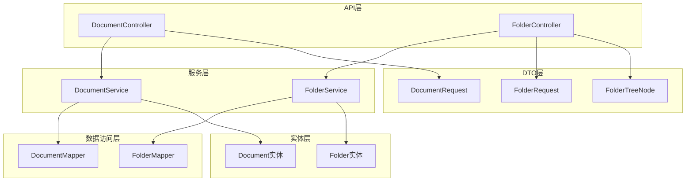

**图表来源**
- [DocumentController.java:13-48](file://services/note-service/src/main/java/com/nonegonotes/note/controller/DocumentController.java#L13-L48)
- [FolderController.java:13-47](file://services/note-service/src/main/java/com/nonegonotes/note/controller/FolderController.java#L13-L47)

**章节来源**
- [DocumentController.java:1-49](file://services/note-service/src/main/java/com/nonegonotes/note/controller/DocumentController.java#L1-L49)
- [FolderController.java:1-48](file://services/note-service/src/main/java/com/nonegonotes/note/controller/FolderController.java#L1-L48)

## 核心组件

### 统一响应格式

系统采用统一的响应格式`R<T>`，所有API调用都返回标准化的JSON结构：

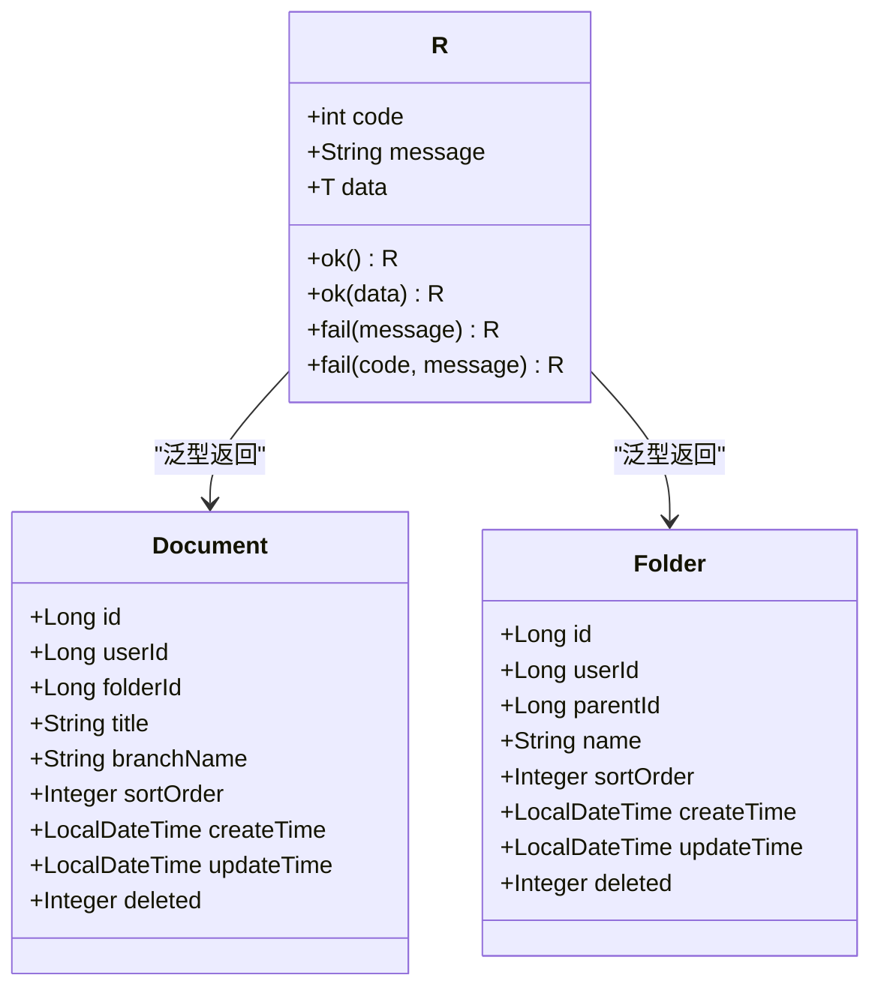

**图表来源**
- [R.java:10-41](file://services/common/src/main/java/com/nonegonotes/common/result/R.java#L10-L41)
- [Document.java:11-41](file://services/common/src/main/java/com/nonegonotes/common/entity/Document.java#L11-L41)
- [Folder.java:11-38](file://services/common/src/main/java/com/nonegonotes/common/entity/Folder.java#L11-L38)

**章节来源**
- [R.java:1-42](file://services/common/src/main/java/com/nonegonotes/common/result/R.java#L1-L42)

### 错误处理机制

系统实现了全局异常处理机制，统一处理业务异常和系统异常：

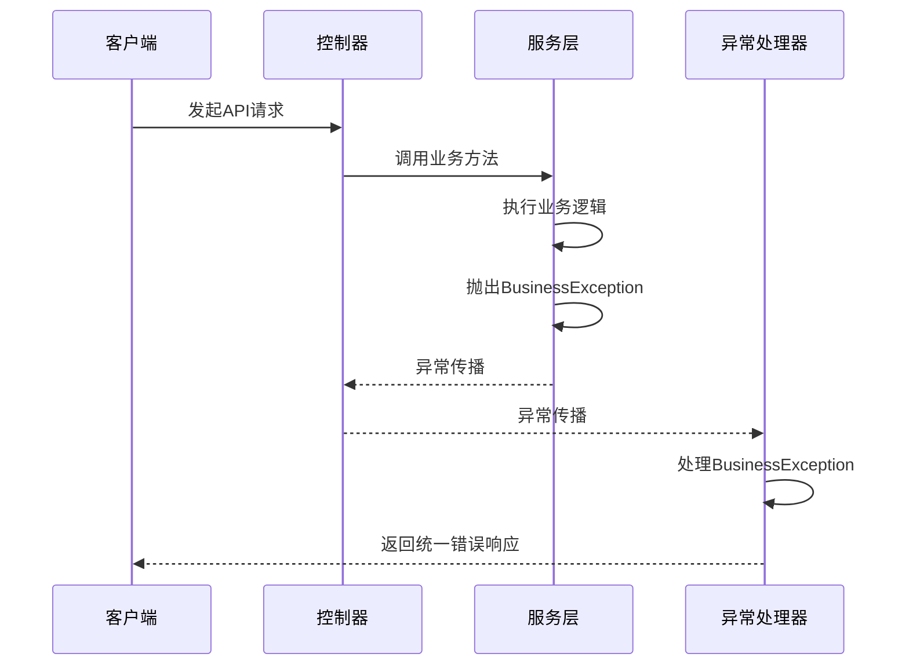

**图表来源**
- [GlobalExceptionHandler.java:13-26](file://services/common/src/main/java/com/nonegonotes/common/exception/GlobalExceptionHandler.java#L13-L26)
- [BusinessException.java:8-21](file://services/common/src/main/java/com/nonegonotes/common/exception/BusinessException.java#L8-L21)

**章节来源**
- [GlobalExceptionHandler.java:1-27](file://services/common/src/main/java/com/nonegonotes/common/exception/GlobalExceptionHandler.java#L1-L27)
- [BusinessException.java:1-22](file://services/common/src/main/java/com/nonegonotes/common/exception/BusinessException.java#L1-L22)

## 架构概览

笔记管理API采用分层架构设计，各层职责明确，耦合度低：

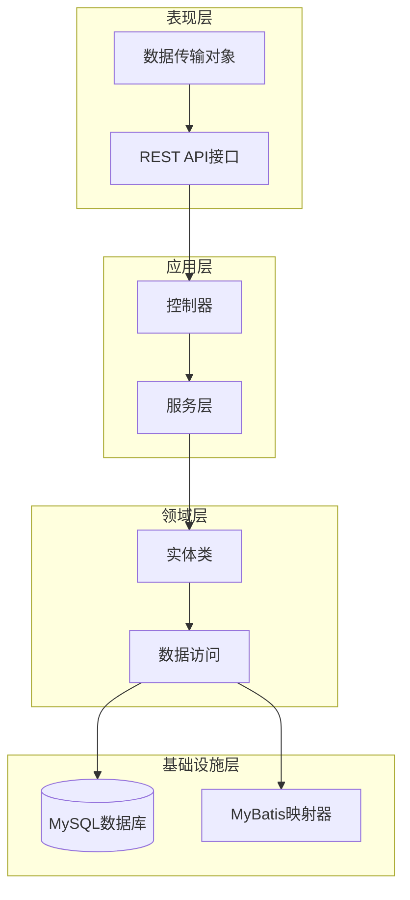

**图表来源**
- [DocumentController.java:13-48](file://services/note-service/src/main/java/com/nonegonotes/note/controller/DocumentController.java#L13-L48)
- [FolderController.java:13-47](file://services/note-service/src/main/java/com/nonegonotes/note/controller/FolderController.java#L13-L47)

## 详细组件分析

### 文档管理API

#### 接口规范

**获取文档列表**
- **方法**: GET
- **路径**: `/api/documents`
- **认证**: 需要`X-User-Id`头部
- **参数**:
  - `folderId`: 目录ID (必需)
- **响应**: 文档列表

**创建文档**
- **方法**: POST  
- **路径**: `/api/documents`
- **认证**: 需要`X-User-Id`头部
- **请求体**: DocumentRequest对象
- **响应**: 创建的文档对象

**重命名文档**
- **方法**: PUT
- **路径**: `/api/documents/{documentId}/rename`
- **认证**: 需要`X-User-Id`头部
- **路径参数**: `documentId` (必需)
- **查询参数**: `title` (必需)
- **响应**: 成功状态

**删除文档**
- **方法**: DELETE
- **路径**: `/api/documents/{documentId}`
- **认证**: 需要`X-User-Id`头部
- **路径参数**: `documentId` (必需)
- **响应**: 成功状态

#### 数据传输对象

**DocumentRequest结构**
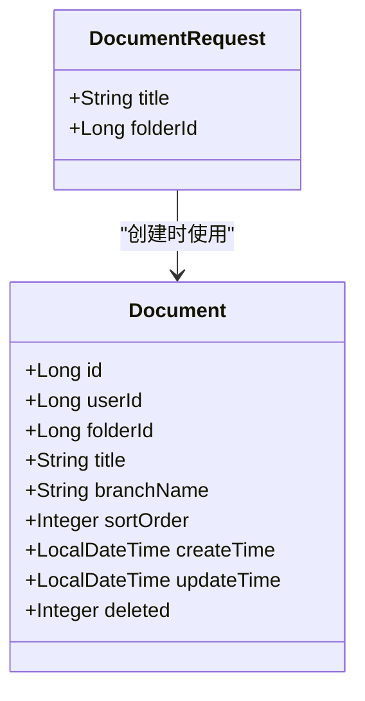

**图表来源**
- [DocumentRequest.java:10-18](file://services/note-service/src/main/java/com/nonegonotes/note/dto/DocumentRequest.java#L10-L18)
- [Document.java:11-41](file://services/common/src/main/java/com/nonegonotes/common/entity/Document.java#L11-L41)

**字段说明**:
- `title`: 文档标题，不能为空
- `folderId`: 所属目录ID，不能为空

**章节来源**
- [DocumentController.java:20-47](file://services/note-service/src/main/java/com/nonegonotes/note/controller/DocumentController.java#L20-L47)
- [DocumentRequest.java:1-19](file://services/note-service/src/main/java/com/nonegonotes/note/dto/DocumentRequest.java#L1-L19)

#### 业务流程

**文档创建流程**:
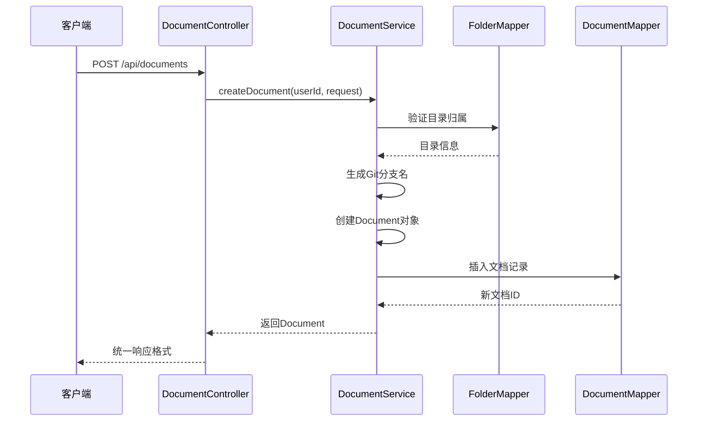

**图表来源**
- [DocumentController.java:27-32](file://services/note-service/src/main/java/com/nonegonotes/note/controller/DocumentController.java#L27-L32)
- [DocumentService.java:37-57](file://services/note-service/src/main/java/com/nonegonotes/note/service/DocumentService.java#L37-L57)

**章节来源**
- [DocumentService.java:1-116](file://services/note-service/src/main/java/com/nonegonotes/note/service/DocumentService.java#L1-L116)

### 目录管理API

#### 接口规范

**获取目录树**
- **方法**: GET
- **路径**: `/api/folders`
- **认证**: 需要`X-User-Id`头部
- **响应**: 目录树结构列表

**创建目录**
- **方法**: POST
- **路径**: `/api/folders`
- **认证**: 需要`X-User-Id`头部
- **请求体**: FolderRequest对象
- **响应**: 新创建目录的ID

**重命名目录**
- **方法**: PUT
- **路径**: `/api/folders/{folderId}/rename`
- **认证**: 需要`X-User-Id`头部
- **路径参数**: `folderId` (必需)
- **查询参数**: `name` (必需)
- **响应**: 成功状态

**删除目录**
- **方法**: DELETE
- **路径**: `/api/folders/{folderId}`
- **认证**: 需要`X-User-Id`头部
- **路径参数**: `folderId` (必需)
- **响应**: 成功状态

#### 数据传输对象

**FolderRequest结构**
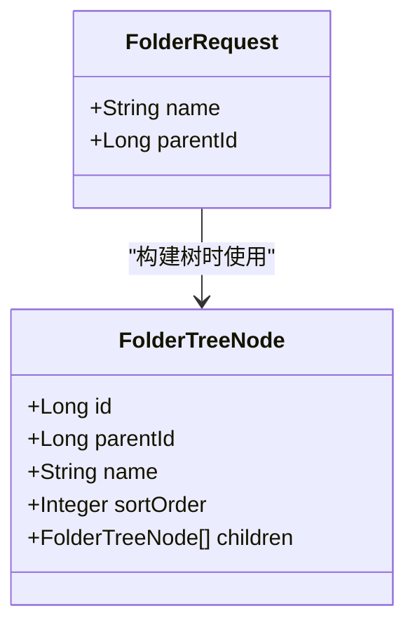

**图表来源**
- [FolderRequest.java:9-17](file://services/note-service/src/main/java/com/nonegonotes/note/dto/FolderRequest.java#L9-L17)
- [FolderTreeNode.java:10-18](file://services/note-service/src/main/java/com/nonegonotes/note/dto/FolderTreeNode.java#L10-L18)

**字段说明**:
- `name`: 目录名称，不能为空
- `parentId`: 父目录ID，顶级目录为null

**FolderTreeNode结构**
- `id`: 目录ID
- `parentId`: 父目录ID
- `name`: 目录名称
- `sortOrder`: 排序号
- `children`: 子目录列表

**章节来源**
- [FolderController.java:20-46](file://services/note-service/src/main/java/com/nonegonotes/note/controller/FolderController.java#L20-L46)
- [FolderRequest.java:1-18](file://services/note-service/src/main/java/com/nonegonotes/note/dto/FolderRequest.java#L1-L18)
- [FolderTreeNode.java:1-19](file://services/note-service/src/main/java/com/nonegonotes/note/dto/FolderTreeNode.java#L1-L19)

#### 业务流程

**目录树构建流程**:
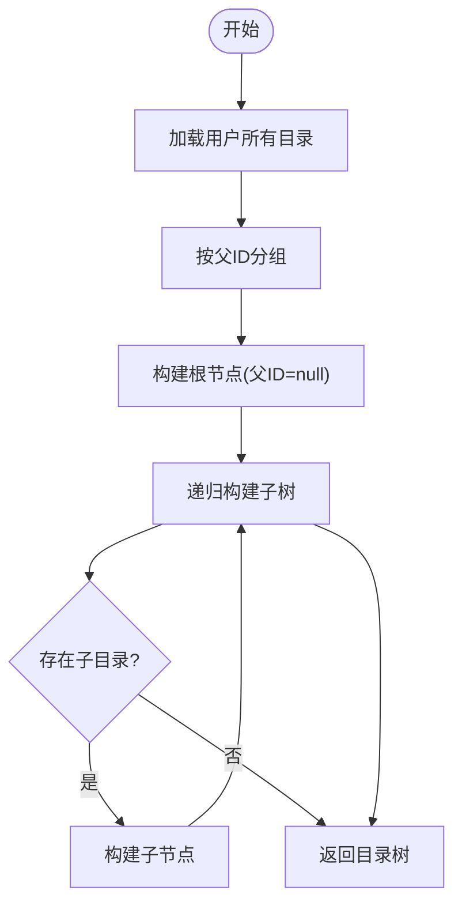

**图表来源**
- [FolderService.java:92-110](file://services/note-service/src/main/java/com/nonegonotes/note/service/FolderService.java#L92-L110)

**章节来源**
- [FolderService.java:1-112](file://services/note-service/src/main/java/com/nonegonotes/note/service/FolderService.java#L1-L112)

### 请求/响应示例

#### 文档管理示例

**获取文档列表**
```
GET /api/documents?folderId=1
X-User-Id: 123

响应:
{
  "code": 200,
  "message": "success",
  "data": [
    {
      "id": 1,
      "userId": 123,
      "folderId": 1,
      "title": "示例文档",
      "branchName": "目录-示例文档",
      "sortOrder": 0,
      "createTime": "2024-01-01T10:00:00",
      "updateTime": "2024-01-01T10:00:00",
      "deleted": 0
    }
  ]
}
```

**创建文档**
```
POST /api/documents
X-User-Id: 123
Content-Type: application/json

请求体:
{
  "title": "新文档",
  "folderId": 1
}

响应:
{
  "code": 200,
  "message": "success",
  "data": {
    "id": 2,
    "userId": 123,
    "folderId": 1,
    "title": "新文档",
    "branchName": "目录-新文档",
    "sortOrder": 0,
    "createTime": "2024-01-01T11:00:00",
    "updateTime": "2024-01-01T11:00:00",
    "deleted": 0
  }
}
```

#### 目录管理示例

**获取目录树**
```
GET /api/folders
X-User-Id: 123

响应:
{
  "code": 200,
  "message": "success",
  "data": [
    {
      "id": 1,
      "parentId": null,
      "name": "根目录",
      "sortOrder": 0,
      "children": [
        {
          "id": 2,
          "parentId": 1,
          "name": "子目录1",
          "sortOrder": 0,
          "children": []
        }
      ]
    }
  ]
}
```

**创建目录**
```
POST /api/folders
X-User-Id: 123
Content-Type: application/json

请求体:
{
  "name": "新目录",
  "parentId": 1
}

响应:
{
  "code": 200,
  "message": "success",
  "data": 3
}
```

## 依赖关系分析

### 数据模型关系

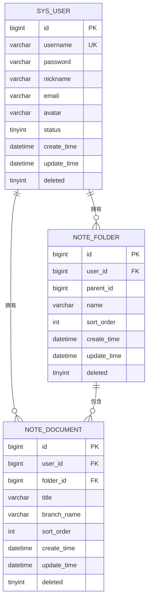

**图表来源**
- [init.sql:9-54](file://services/sql/init.sql#L9-L54)

### 服务层依赖

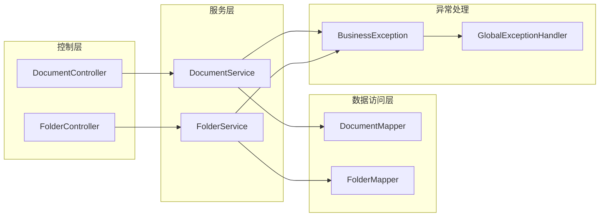

**图表来源**
- [DocumentController.java:18-18](file://services/note-service/src/main/java/com/nonegonotes/note/controller/DocumentController.java#L18-L18)
- [FolderController.java:18-18](file://services/note-service/src/main/java/com/nonegonotes/note/controller/FolderController.java#L18-L18)

**章节来源**
- [DocumentService.java:19-20](file://services/note-service/src/main/java/com/nonegonotes/note/service/DocumentService.java#L19-L20)
- [FolderService.java:21-21](file://services/note-service/src/main/java/com/nonegonotes/note/service/FolderService.java#L21-L21)

## 性能考虑

### 查询优化

1. **索引策略**: 数据库表已建立适当的索引：
   - `note_folder`: `idx_user_id`, `idx_parent_id`
   - `note_document`: `idx_user_id`, `idx_folder_id`

2. **排序优化**: 
   - 目录按`sort_order`升序排列
   - 文档按`updateTime`降序排列

3. **分页支持**: 当前实现支持大数据量的分页查询

### 缓存策略

建议在以下场景考虑缓存：
- 目录树结构缓存（用户级别）
- 最近使用的文档列表缓存
- 用户权限验证结果缓存

## 故障排除指南

### 常见错误类型

**业务异常 (HTTP 200, code ≠ 200)**:
- 目录不存在：`目录不存在`
- 文档不存在：`文稿不存在`
- 参数验证失败：具体的验证消息

**系统异常 (HTTP 500)**:
- 服务器内部错误：`服务器内部错误`

### 错误处理流程

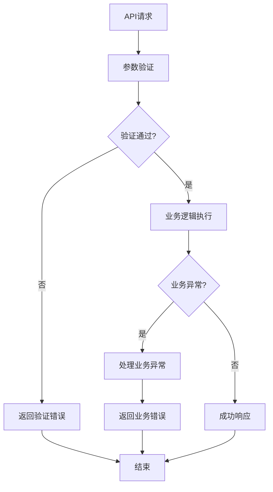

**图表来源**
- [GlobalExceptionHandler.java:15-25](file://services/common/src/main/java/com/nonegonotes/common/exception/GlobalExceptionHandler.java#L15-L25)

**章节来源**
- [GlobalExceptionHandler.java:1-27](file://services/common/src/main/java/com/nonegonotes/common/exception/GlobalExceptionHandler.java#L1-L27)

### 调试建议

1. **日志监控**: 使用SLF4J记录关键操作
2. **参数检查**: 确保`X-User-Id`头部正确传递
3. **数据库连接**: 验证MyBatis配置和连接池设置
4. **异常追踪**: 检查BusinessException的堆栈信息

## 结论

Woo项目的笔记管理API提供了完整而健壮的文档和目录管理功能。系统采用清晰的分层架构，统一的响应格式和完善的错误处理机制。通过合理的数据模型设计和索引策略，确保了良好的性能表现。建议在生产环境中进一步完善缓存策略和监控体系，以提升系统的整体稳定性。