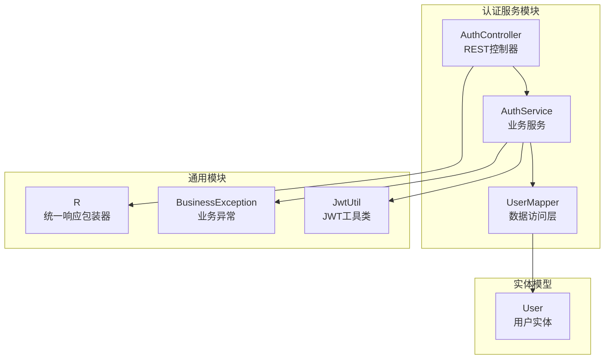
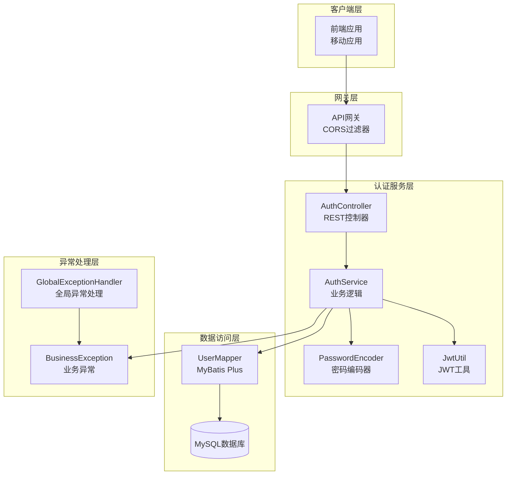
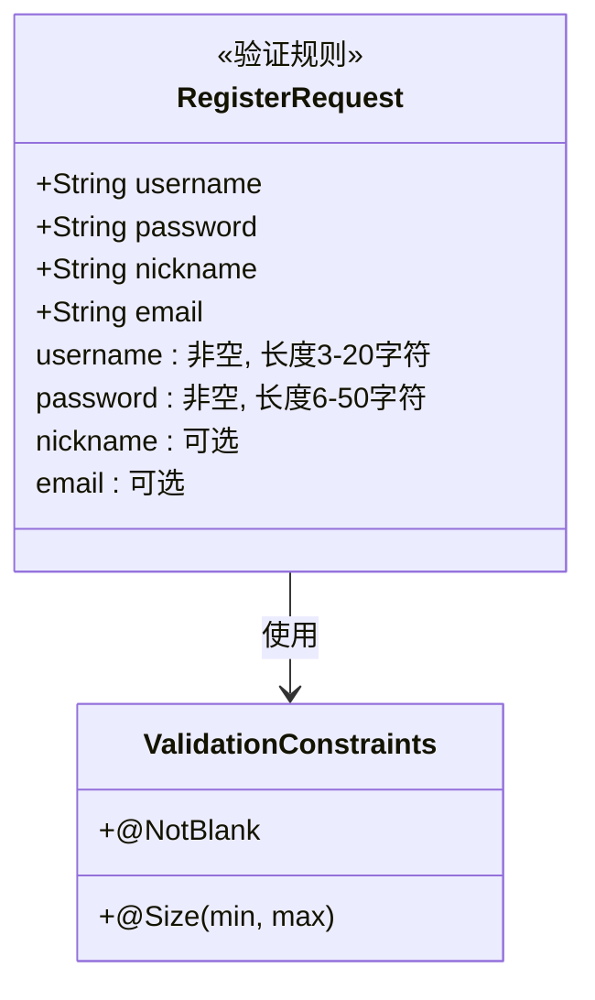
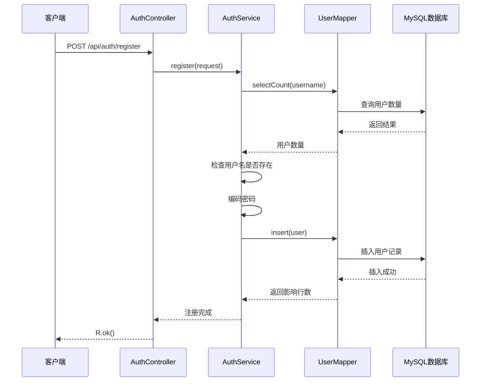
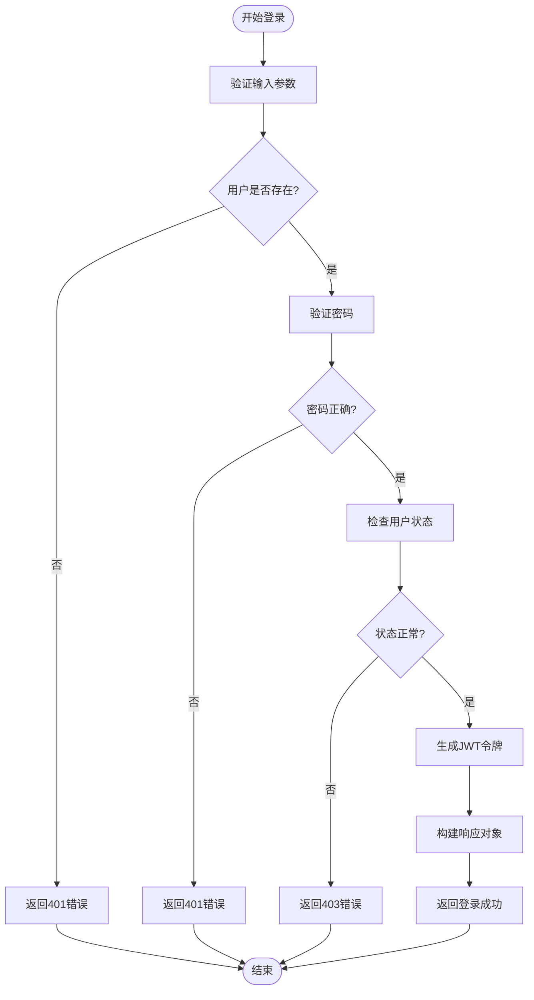
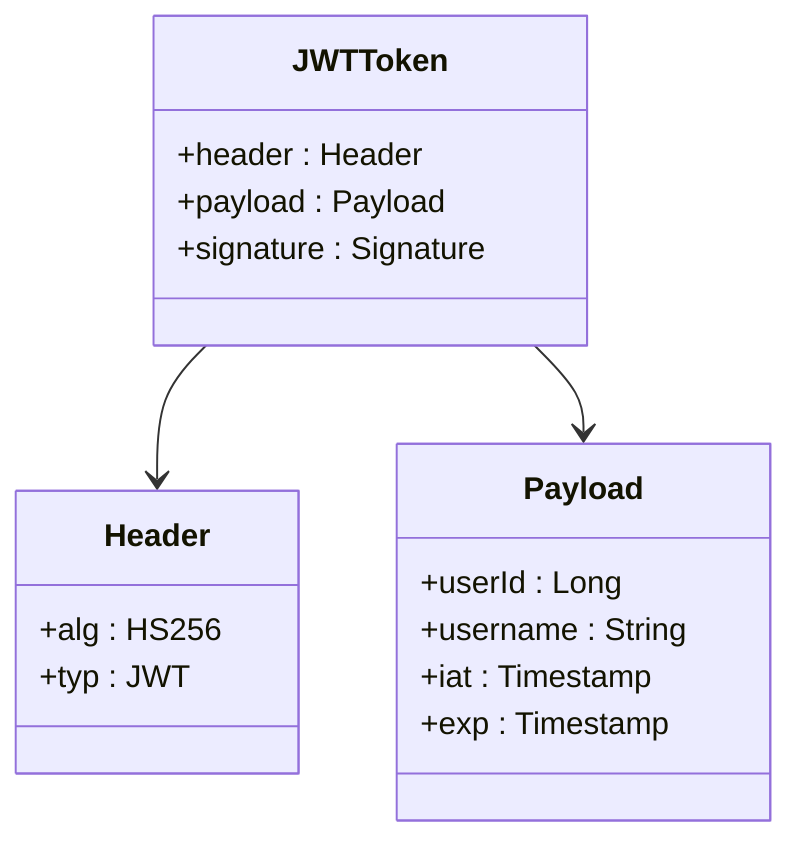
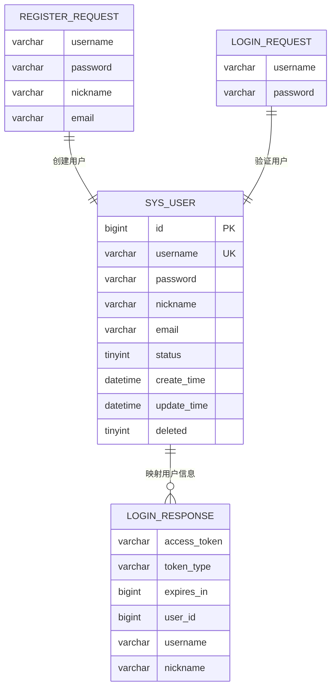
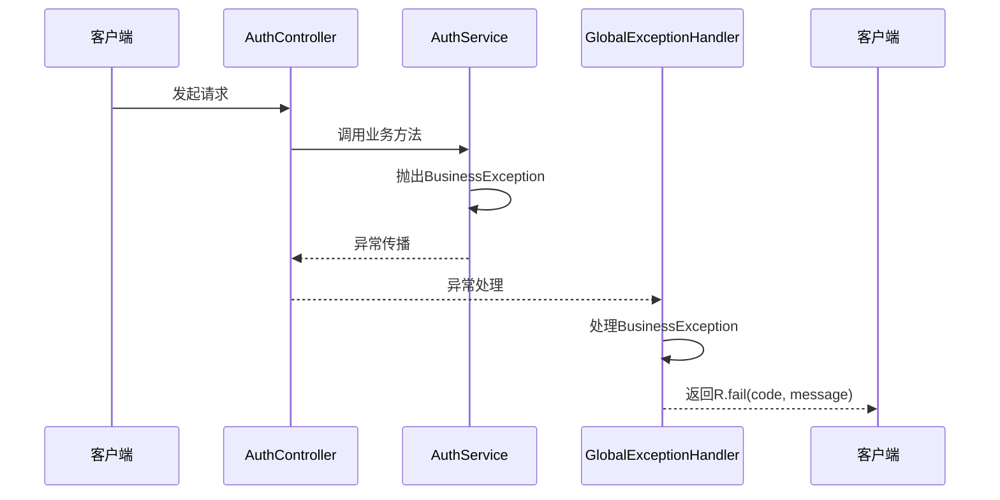

# 认证API

<cite>
**本文档引用的文件**
- [AuthController.java](file://services/auth-service/src/main/java/com/nonegonotes/auth/controller/AuthController.java)
- [AuthService.java](file://services/auth-service/src/main/java/com/nonegonotes/auth/service/AuthService.java)
- [RegisterRequest.java](file://services/auth-service/src/main/java/com/nonegonotes/auth/dto/RegisterRequest.java)
- [LoginRequest.java](file://services/auth-service/src/main/java/com/nonegonotes/auth/dto/LoginRequest.java)
- [LoginResponse.java](file://services/auth-service/src/main/java/com/nonegonotes/auth/dto/LoginResponse.java)
- [R.java](file://services/common/src/main/java/com/nonegonotes/common/result/R.java)
- [JwtUtil.java](file://services/common/src/main/java/com/nonegonotes/common/util/JwtUtil.java)
- [GlobalExceptionHandler.java](file://services/common/src/main/java/com/nonegonotes/common/exception/GlobalExceptionHandler.java)
- [BusinessException.java](file://services/common/src/main/java/com/nonegonotes/common/exception/BusinessException.java)
- [User.java](file://services/common/src/main/java/com/nonegonotes/common/entity/User.java)
- [UserMapper.java](file://services/auth-service/src/main/java/com/nonegonotes/auth/mapper/UserMapper.java)
- [application.yml](file://services/auth-service/src/main/resources/application.yml)
- [init.sql](file://services/sql/init.sql)
</cite>

## 目录
1. [简介](#简介)
2. [项目结构](#项目结构)
3. [核心组件](#核心组件)
4. [架构概览](#架构概览)
5. [详细组件分析](#详细组件分析)
6. [依赖关系分析](#依赖关系分析)
7. [性能考虑](#性能考虑)
8. [故障排除指南](#故障排除指南)
9. [结论](#结论)

## 简介

Woo项目的认证API提供了用户注册和登录功能，采用Spring Boot微服务架构实现。系统使用JWT（JSON Web Token）进行身份认证，通过统一的响应包装器R<T>提供标准化的API响应格式。该认证服务独立运行在8081端口，与Nacos服务发现集成，并配置了Knife4j文档工具。

## 项目结构

认证API位于多模块Maven项目中，主要包含以下模块：



**图表来源**
- [AuthController.java:12-30](file://services/auth-service/src/main/java/com/nonegonotes/auth/controller/AuthController.java#L12-L30)
- [AuthService.java:19-94](file://services/auth-service/src/main/java/com/nonegonotes/auth/service/AuthService.java#L19-L94)
- [R.java:10-41](file://services/common/src/main/java/com/nonegonotes/common/result/R.java#L10-L41)

**章节来源**
- [AuthController.java:1-31](file://services/auth-service/src/main/java/com/nonegonotes/auth/controller/AuthController.java#L1-L31)
- [AuthService.java:1-95](file://services/auth-service/src/main/java/com/nonegonotes/auth/service/AuthService.java#L1-L95)

## 核心组件

### 统一响应包装器 R<T>

R<T>是整个系统的统一响应包装器，提供标准化的API响应格式：

- **响应结构**：包含code（状态码）、message（消息）、data（数据）
- **成功响应**：默认code=200，message="success"
- **失败响应**：支持自定义code和message
- **泛型支持**：支持任意类型的数据封装

### 认证控制器

AuthController提供两个核心API：
- `POST /api/auth/register`：用户注册
- `POST /api/auth/login`：用户登录

**章节来源**
- [R.java:10-41](file://services/common/src/main/java/com/nonegonotes/common/result/R.java#L10-L41)
- [AuthController.java:19-29](file://services/auth-service/src/main/java/com/nonegonotes/auth/controller/AuthController.java#L19-L29)

## 架构概览

认证系统的整体架构采用分层设计：



**图表来源**
- [AuthController.java:12-30](file://services/auth-service/src/main/java/com/nonegonotes/auth/controller/AuthController.java#L12-L30)
- [AuthService.java:21-94](file://services/auth-service/src/main/java/com/nonegonotes/auth/service/AuthService.java#L21-L94)
- [GlobalExceptionHandler.java:11-26](file://services/common/src/main/java/com/nonegonotes/common/exception/GlobalExceptionHandler.java#L11-L26)

## 详细组件分析

### 用户注册接口

#### 接口定义
- **URL**: `POST /api/auth/register`
- **功能**: 创建新用户账户
- **请求体**: RegisterRequest对象
- **响应**: R<Void>统一响应包装器

#### RegisterRequest 参数验证规则



**图表来源**
- [RegisterRequest.java:10-24](file://services/auth-service/src/main/java/com/nonegonotes/auth/dto/RegisterRequest.java#L10-L24)

#### 注册业务流程



**图表来源**
- [AuthController.java:19-23](file://services/auth-service/src/main/java/com/nonegonotes/auth/controller/AuthController.java#L19-L23)
- [AuthService.java:35-54](file://services/auth-service/src/main/java/com/nonegonotes/auth/service/AuthService.java#L35-L54)

#### 注册成功响应示例

```json
{
  "code": 200,
  "message": "success",
  "data": null
}
```

**章节来源**
- [RegisterRequest.java:13-19](file://services/auth-service/src/main/java/com/nonegonotes/auth/dto/RegisterRequest.java#L13-L19)
- [AuthService.java:35-54](file://services/auth-service/src/main/java/com/nonegonotes/auth/service/AuthService.java#L35-L54)

### 用户登录接口

#### 接口定义
- **URL**: `POST /api/auth/login`
- **功能**: 用户身份验证并获取访问令牌
- **请求体**: LoginRequest对象
- **响应**: R<LoginResponse>统一响应包装器

#### LoginRequest 参数

| 字段名 | 类型 | 必填 | 说明 |
|--------|------|------|------|
| username | String | 是 | 用户名 |
| password | String | 是 | 密码 |

#### LoginResponse 响应格式

| 字段名 | 类型 | 说明 |
|--------|------|------|
| accessToken | String | JWT访问令牌 |
| tokenType | String | 令牌类型（固定为"Bearer"） |
| expiresIn | Long | 过期时间（秒） |
| userId | Long | 用户ID |
| username | String | 用户名 |
| nickname | String | 昵称 |

#### 登录业务流程



**图表来源**
- [AuthService.java:59-93](file://services/auth-service/src/main/java/com/nonegonotes/auth/service/AuthService.java#L59-L93)

#### 登录成功响应示例

```json
{
  "code": 200,
  "message": "success",
  "data": {
    "accessToken": "eyJhbGciOiJIUzI1NiIsInR5cCI6IkpXVCJ9...",
    "tokenType": "Bearer",
    "expiresIn": 86400,
    "userId": 1,
    "username": "john_doe",
    "nickname": "John Doe"
  }
}
```

**章节来源**
- [LoginRequest.java:10-17](file://services/auth-service/src/main/java/com/nonegonotes/auth/dto/LoginRequest.java#L10-L17)
- [LoginResponse.java:11-19](file://services/auth-service/src/main/java/com/nonegonotes/auth/dto/LoginResponse.java#L11-L19)
- [AuthService.java:59-93](file://services/auth-service/src/main/java/com/nonegonotes/auth/service/AuthService.java#L59-L93)

### JWT令牌结构

系统使用JWT（JSON Web Token）进行身份认证，令牌包含以下信息：



**图表来源**
- [JwtUtil.java:20-31](file://services/common/src/main/java/com/nonegonotes/common/util/JwtUtil.java#L20-L31)

**章节来源**
- [JwtUtil.java:15-56](file://services/common/src/main/java/com/nonegonotes/common/util/JwtUtil.java#L15-L56)

## 依赖关系分析

### 数据模型关系



**图表来源**
- [User.java:12-39](file://services/common/src/main/java/com/nonegonotes/common/entity/User.java#L12-L39)
- [LoginResponse.java:11-19](file://services/auth-service/src/main/java/com/nonegonotes/auth/dto/LoginResponse.java#L11-L19)
- [RegisterRequest.java:11-24](file://services/auth-service/src/main/java/com/nonegonotes/auth/dto/RegisterRequest.java#L11-L24)
- [LoginRequest.java:10-17](file://services/auth-service/src/main/java/com/nonegonotes/auth/dto/LoginRequest.java#L10-L17)

### 异常处理机制



**图表来源**
- [GlobalExceptionHandler.java:15-19](file://services/common/src/main/java/com/nonegonotes/common/exception/GlobalExceptionHandler.java#L15-L19)
- [BusinessException.java:9-21](file://services/common/src/main/java/com/nonegonotes/common/exception/BusinessException.java#L9-L21)

**章节来源**
- [GlobalExceptionHandler.java:11-26](file://services/common/src/main/java/com/nonegonotes/common/exception/GlobalExceptionHandler.java#L11-L26)
- [BusinessException.java:1-22](file://services/common/src/main/java/com/nonegonotes/common/exception/BusinessException.java#L1-L22)

## 性能考虑

### JWT配置优化

系统配置了以下JWT参数：
- **密钥**: NonEgoNotesSecretKey2024ThisMustBeAtLeast32BytesLong（32字节以上）
- **过期时间**: 86400000毫秒（24小时）

### 数据库优化

- **唯一索引**: 用户名字段设置唯一索引，确保用户名唯一性
- **查询优化**: 使用MyBatis Plus的Lambda表达式进行高效查询
- **逻辑删除**: 支持软删除，避免物理删除造成的数据丢失

### 安全性考虑

- **密码加密**: 使用BCrypt算法对密码进行加密存储
- **输入验证**: 严格的参数验证规则
- **异常处理**: 统一的异常处理机制，避免敏感信息泄露

## 故障排除指南

### 常见错误及解决方案

| 错误代码 | 错误类型 | 可能原因 | 解决方案 |
|----------|----------|----------|----------|
| 400 | 参数验证失败 | 用户名或密码格式不正确 | 检查用户名长度（3-20字符）和密码长度（6-50字符） |
| 401 | 认证失败 | 用户名或密码错误 | 确认用户名是否存在，密码是否正确 |
| 403 | 权限拒绝 | 账号被禁用 | 检查用户状态是否为正常（1） |
| 500 | 服务器错误 | 系统内部异常 | 查看服务器日志，检查数据库连接 |

### 调试建议

1. **启用详细日志**: 在application.yml中配置日志级别为DEBUG
2. **检查数据库连接**: 确保MySQL数据库正常运行
3. **验证JWT配置**: 确认JWT密钥和过期时间配置正确
4. **测试接口**: 使用Postman或curl测试API接口

**章节来源**
- [GlobalExceptionHandler.java:15-25](file://services/common/src/main/java/com/nonegonotes/common/exception/GlobalExceptionHandler.java#L15-L25)
- [AuthService.java:64-76](file://services/auth-service/src/main/java/com/nonegonotes/auth/service/AuthService.java#L64-L76)

## 结论

Woo项目的认证API采用现代化的微服务架构，具有以下特点：

1. **标准化设计**: 使用R<T>统一响应包装器，提供一致的API体验
2. **安全性强**: 采用JWT令牌和BCrypt密码加密，确保用户信息安全
3. **易于扩展**: 分层架构设计，便于功能扩展和维护
4. **健壮性好**: 完善的异常处理机制和参数验证规则

该认证系统为整个Woo项目提供了可靠的身份认证基础，支持用户注册、登录等核心功能，为后续的功能开发奠定了坚实的基础。