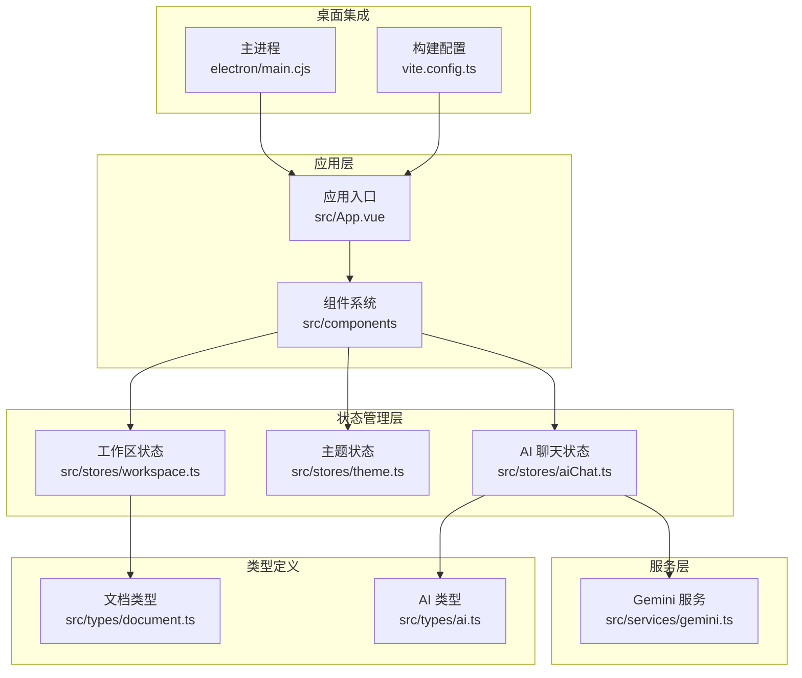
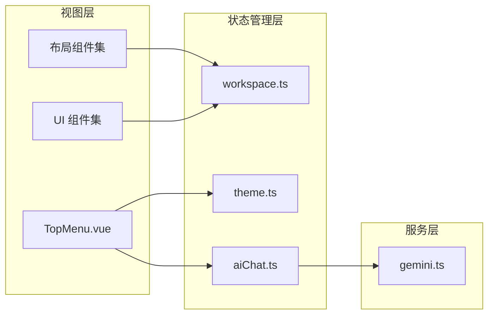
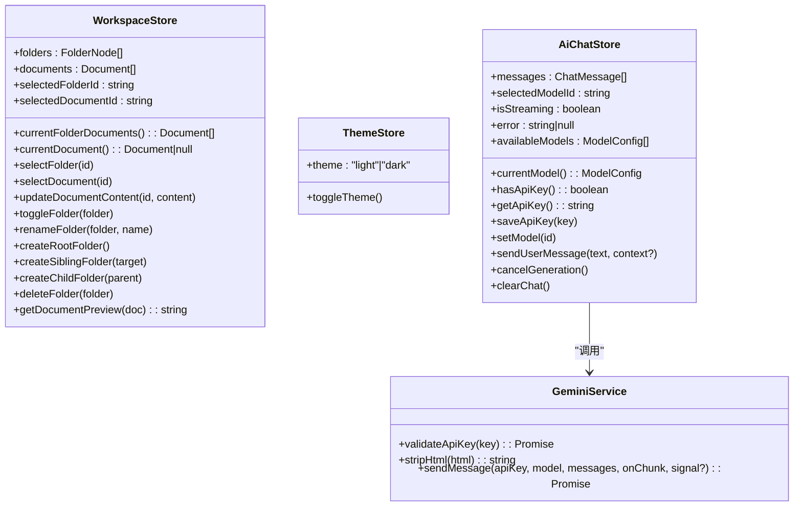
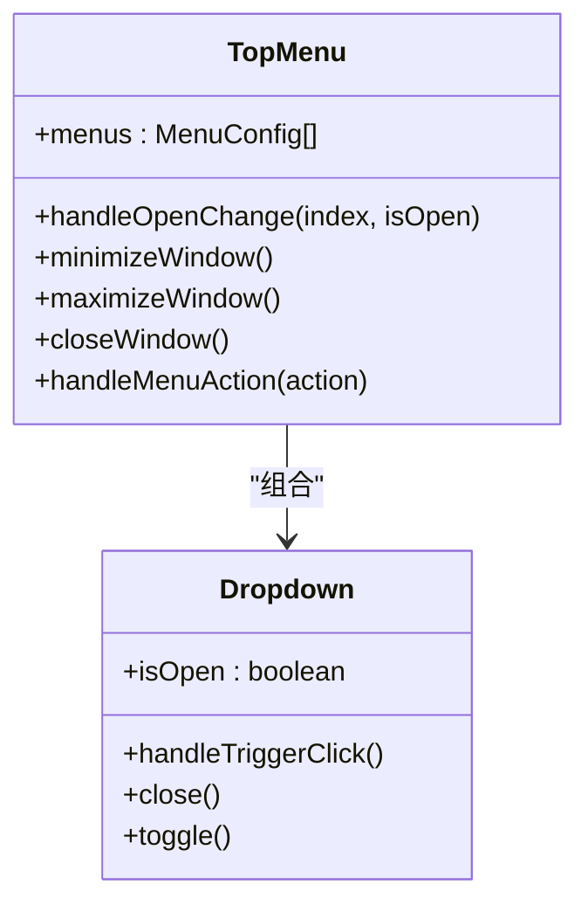
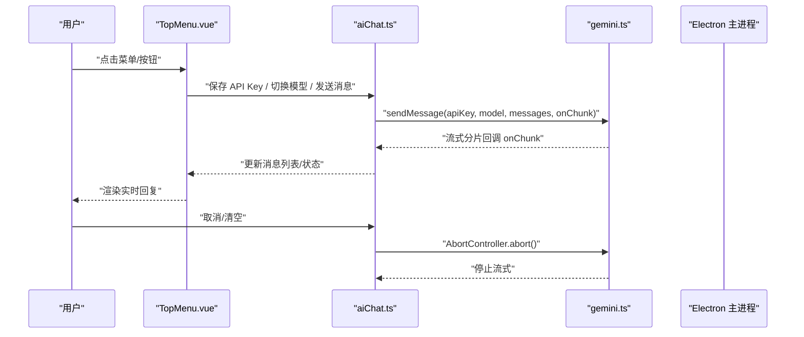
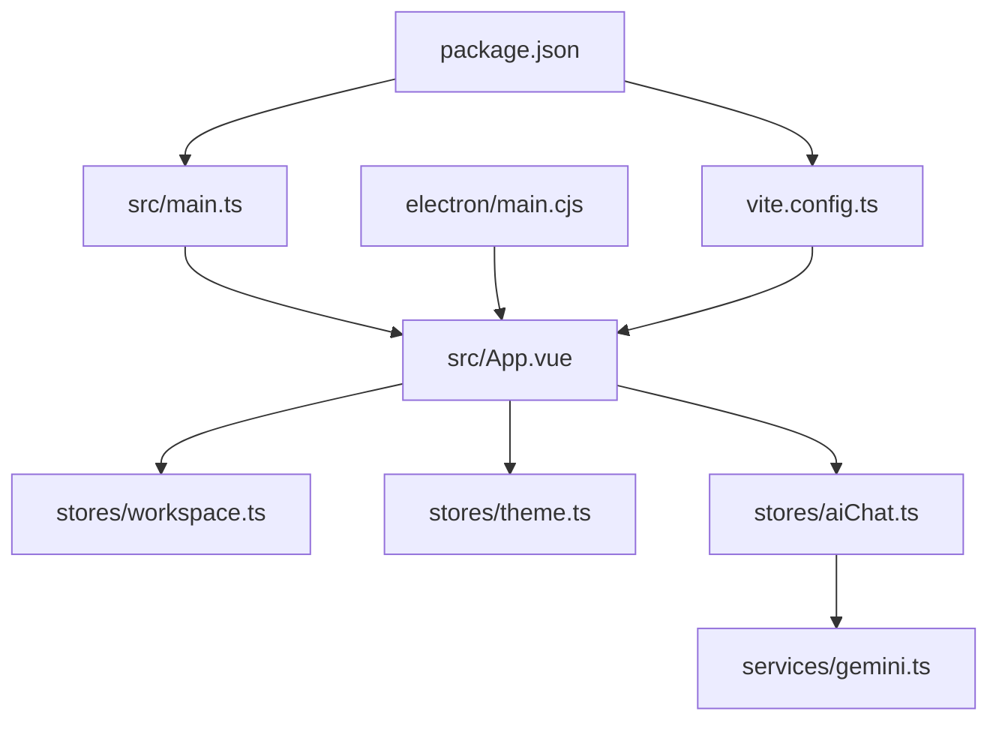

# 前端应用架构

<cite>
**本文档引用的文件**
- [package.json](file://app/package.json)
- [vite.config.ts](file://app/vite.config.ts)
- [main.ts](file://app/src/main.ts)
- [App.vue](file://app/src/App.vue)
- [workspace.ts](file://app/src/stores/workspace.ts)
- [theme.ts](file://app/src/stores/theme.ts)
- [aiChat.ts](file://app/src/stores/aiChat.ts)
- [gemini.ts](file://app/src/services/gemini.ts)
- [TopMenu.vue](file://app/src/components/layout/TopMenu.vue)
- [Dropdown.vue](file://app/src/components/ui/Dropdown.vue)
- [document.ts](file://app/src/types/document.ts)
- [ai.ts](file://app/src/types/ai.ts)
- [tsconfig.json](file://app/tsconfig.json)
- [tsconfig.node.json](file://app/tsconfig.node.json)
- [main.cjs](file://app/electron/main.cjs)
</cite>

## 目录
1. [简介](#简介)
2. [项目结构](#项目结构)
3. [核心组件](#核心组件)
4. [架构总览](#架构总览)
5. [详细组件分析](#详细组件分析)
6. [依赖关系分析](#依赖关系分析)
7. [性能考虑](#性能考虑)
8. [故障排查指南](#故障排查指南)
9. [结论](#结论)
10. [附录](#附录)

## 简介
本项目是一个基于 Vue 3 + TypeScript + Pinia 的现代化桌面笔记应用，采用 Electron + Vite 进行桌面端打包与开发。整体采用 MVVM 架构与 Pinia 状态管理模式，通过清晰的目录划分实现组件化、可维护的状态管理与服务层抽象。应用支持多侧栏布局、富文本编辑、主题切换以及 AI 对话能力，并通过 Electron 提供原生桌面体验。

## 项目结构
项目采用“功能域 + 层次化”的组织方式：
- src/components：组件系统，包含布局组件、UI 组件与图标组件
- src/stores：状态管理，使用 Pinia 管理 workspace、theme、aiChat 等领域状态
- src/services：服务层，封装外部 API（如 Gemini）调用
- src/types：类型定义，统一管理接口与模型类型
- electron：主进程配置与预加载脚本，负责窗口生命周期与 IPC 通信
- 根目录配置：Vite、TypeScript、包管理脚本

图表来源
- [main.ts:1-8](file://app/src/main.ts#L1-L8)
- [App.vue:1-111](file://app/src/App.vue#L1-L111)
- [workspace.ts:1-321](file://app/src/stores/workspace.ts#L1-L321)
- [theme.ts:1-31](file://app/src/stores/theme.ts#L1-L31)
- [aiChat.ts:1-199](file://app/src/stores/aiChat.ts#L1-L199)
- [gemini.ts:1-103](file://app/src/services/gemini.ts#L1-L103)
- [document.ts:1-9](file://app/src/types/document.ts#L1-L9)
- [ai.ts:1-20](file://app/src/types/ai.ts#L1-L20)
- [main.cjs:1-71](file://app/electron/main.cjs#L1-L71)
- [vite.config.ts:1-19](file://app/vite.config.ts#L1-L19)

章节来源
- [package.json:1-38](file://app/package.json#L1-L38)
- [vite.config.ts:1-19](file://app/vite.config.ts#L1-L19)
- [main.ts:1-8](file://app/src/main.ts#L1-L8)
- [main.cjs:1-71](file://app/electron/main.cjs#L1-L71)

## 核心组件
- 应用入口与挂载：在应用入口创建 Vue 实例并注册 Pinia，随后挂载到 DOM 容器。
- 应用根组件：负责顶层布局（顶部菜单、左右侧栏、中间编辑区、右侧 AI 聊天区）与全局状态初始化。
- 主题初始化：在应用启动时即初始化主题状态，保证 data-theme 属性在首帧渲染前就绪。
- 键盘快捷键：支持 Ctrl+1/2/3 快速切换侧栏，提升操作效率。

章节来源
- [main.ts:1-8](file://app/src/main.ts#L1-L8)
- [App.vue:1-111](file://app/src/App.vue#L1-L111)
- [theme.ts:1-31](file://app/src/stores/theme.ts#L1-L31)

## 架构总览
应用采用 MVVM 架构与 Pinia 状态管理模式：
- Model：由 Pinia Store 提供，包含响应式状态、计算属性与动作
- View：Vue 组件树，负责渲染与用户交互
- ViewModel：通过组合式 API 将组件逻辑与 Store 解耦，保持视图简洁

图表来源
- [TopMenu.vue:1-223](file://app/src/components/layout/TopMenu.vue#L1-L223)
- [workspace.ts:1-321](file://app/src/stores/workspace.ts#L1-L321)
- [theme.ts:1-31](file://app/src/stores/theme.ts#L1-L31)
- [aiChat.ts:1-199](file://app/src/stores/aiChat.ts#L1-L199)
- [gemini.ts:1-103](file://app/src/services/gemini.ts#L1-L103)

## 详细组件分析

### 状态管理策略
- workspace：管理目录树、文档集合、当前选中项与文档内容更新；提供目录增删改、自动选中、文档预览等功能
- theme：管理主题模式（亮/暗），持久化至本地存储并通过 DOM 属性同步
- aiChat：管理聊天消息、模型选择、API Key 存取、流式生成与取消；封装与 Gemini 的交互

图表来源
- [workspace.ts:1-321](file://app/src/stores/workspace.ts#L1-L321)
- [theme.ts:1-31](file://app/src/stores/theme.ts#L1-L31)
- [aiChat.ts:1-199](file://app/src/stores/aiChat.ts#L1-L199)
- [gemini.ts:1-103](file://app/src/services/gemini.ts#L1-L103)

章节来源
- [workspace.ts:1-321](file://app/src/stores/workspace.ts#L1-L321)
- [theme.ts:1-31](file://app/src/stores/theme.ts#L1-L31)
- [aiChat.ts:1-199](file://app/src/stores/aiChat.ts#L1-L199)
- [gemini.ts:1-103](file://app/src/services/gemini.ts#L1-L103)

### 组件化设计原则
- 布局组件：负责页面骨架与区域划分，如顶部菜单、左右侧栏、中间编辑区与右侧 AI 聊天区
- 图标组件：语义化图标封装，统一尺寸与主题色，便于复用
- UI 组件：通用控件如下拉菜单、上下文菜单等，提供可复用的交互与样式

图表来源
- [TopMenu.vue:1-223](file://app/src/components/layout/TopMenu.vue#L1-L223)
- [Dropdown.vue:1-88](file://app/src/components/ui/Dropdown.vue#L1-L88)

章节来源
- [TopMenu.vue:1-223](file://app/src/components/layout/TopMenu.vue#L1-L223)
- [Dropdown.vue:1-88](file://app/src/components/ui/Dropdown.vue#L1-L88)

### 状态流转序列（AI 聊天）

图表来源
- [TopMenu.vue:1-223](file://app/src/components/layout/TopMenu.vue#L1-L223)
- [aiChat.ts:1-199](file://app/src/stores/aiChat.ts#L1-L199)
- [gemini.ts:1-103](file://app/src/services/gemini.ts#L1-L103)
- [main.cjs:1-71](file://app/electron/main.cjs#L1-L71)

## 依赖关系分析
- 构建与运行：Vite 提供开发服务器与打包能力，Electron 插件桥接主进程；package.json 定义脚本与依赖
- 类型系统：双 tsconfig 配置分别服务于应用与 Vite 配置文件，严格启用编译选项以提升类型安全
- 组件与状态：组件通过组合式 API 使用 Store，避免直接耦合；服务层独立于 UI，便于替换与测试

图表来源
- [package.json:1-38](file://app/package.json#L1-L38)
- [vite.config.ts:1-19](file://app/vite.config.ts#L1-L19)
- [main.ts:1-8](file://app/src/main.ts#L1-L8)
- [App.vue:1-111](file://app/src/App.vue#L1-L111)
- [workspace.ts:1-321](file://app/src/stores/workspace.ts#L1-L321)
- [theme.ts:1-31](file://app/src/stores/theme.ts#L1-L31)
- [aiChat.ts:1-199](file://app/src/stores/aiChat.ts#L1-L199)
- [gemini.ts:1-103](file://app/src/services/gemini.ts#L1-L103)
- [main.cjs:1-71](file://app/electron/main.cjs#L1-L71)

章节来源
- [package.json:1-38](file://app/package.json#L1-L38)
- [vite.config.ts:1-19](file://app/vite.config.ts#L1-L19)
- [tsconfig.json:1-25](file://app/tsconfig.json#L1-L25)
- [tsconfig.node.json:1-11](file://app/tsconfig.node.json#L1-L11)

## 性能考虑
- 响应式粒度：Store 中将计算属性与动作分离，减少不必要的重渲染
- 流式渲染：AI 回复采用流式分片渲染，降低首屏延迟
- 本地存储：主题与 AI 设置持久化，避免每次启动重复读取
- 懒加载与拆分：组件按需引入，避免一次性加载过多资源

## 故障排查指南
- 开发/生产环境差异
  - 开发：Electron 主进程加载 Vite 开发服务器地址，自动打开调试工具
  - 生产：Electron 主进程加载构建产物 index.html
- 常见问题定位
  - API Key 未配置：AI 聊天会提示需要在设置中配置，检查本地存储键值
  - 流式中断：若出现网络异常或手动取消，Store 会清理空的占位消息并恢复非流式状态
  - 主题不生效：确认 data-theme 属性已在 <html> 上正确设置，且本地存储键存在

章节来源
- [main.cjs:26-31](file://app/electron/main.cjs#L26-L31)
- [aiChat.ts:74-78](file://app/src/stores/aiChat.ts#L74-L78)
- [theme.ts:21-24](file://app/src/stores/theme.ts#L21-L24)

## 结论
本项目通过清晰的目录划分与 MVVM + Pinia 的架构设计，实现了高内聚、低耦合的前端应用。Electron + Vite 的组合提供了良好的开发体验与稳定的桌面端打包能力。组件化与类型系统的引入进一步提升了可维护性与扩展性。后续可在服务层增加缓存策略、完善错误边界与国际化支持，以进一步增强用户体验。

## 附录
- 最佳实践建议
  - 将 UI 组件与业务逻辑解耦，尽量通过 Store 传递状态
  - 对外服务调用统一收敛到服务层，便于替换与测试
  - 使用 TypeScript 严格模式，配合双 tsconfig 提升类型安全
  - 对长列表与富文本渲染进行虚拟化或节流优化
  - 为关键路径增加错误提示与降级策略，提升健壮性