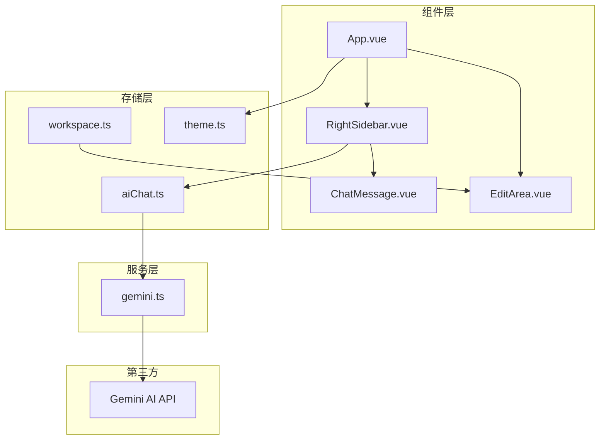
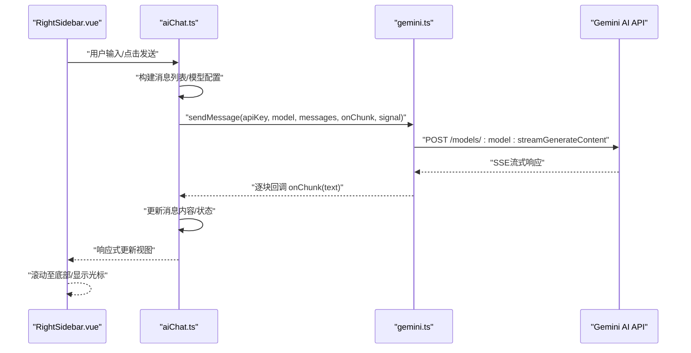
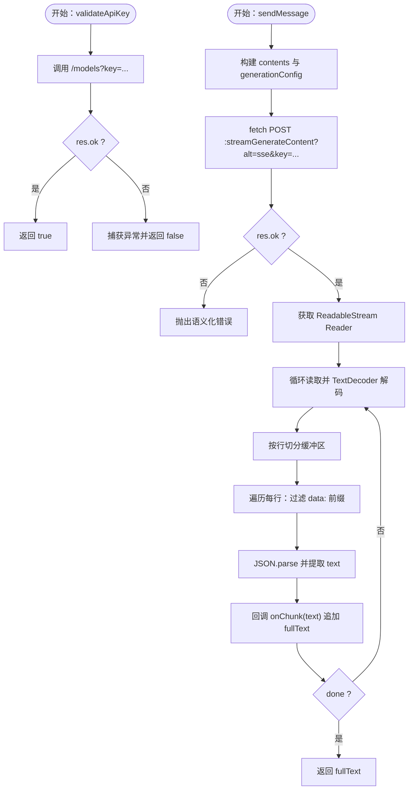
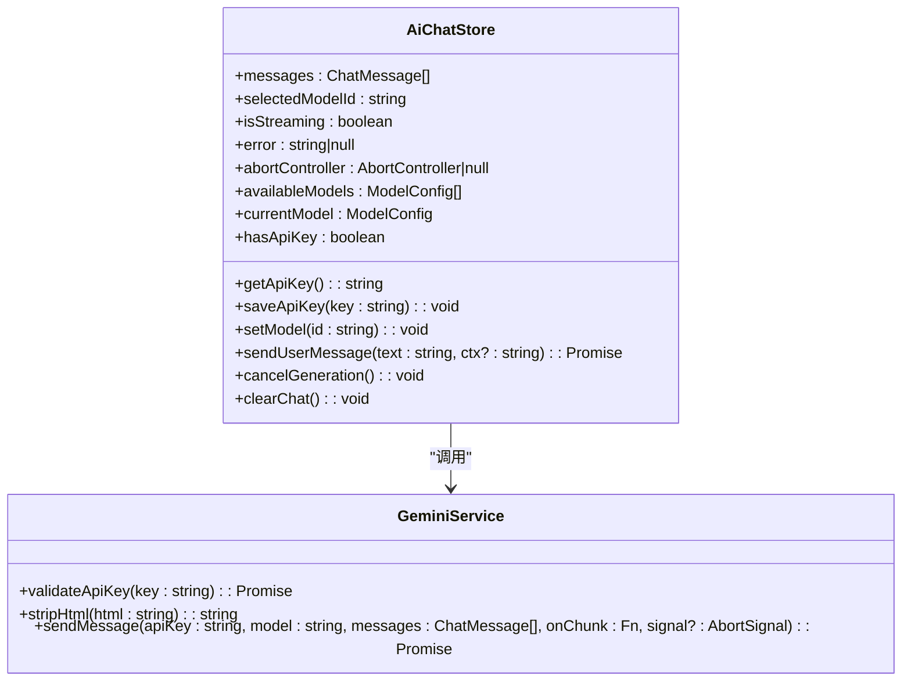
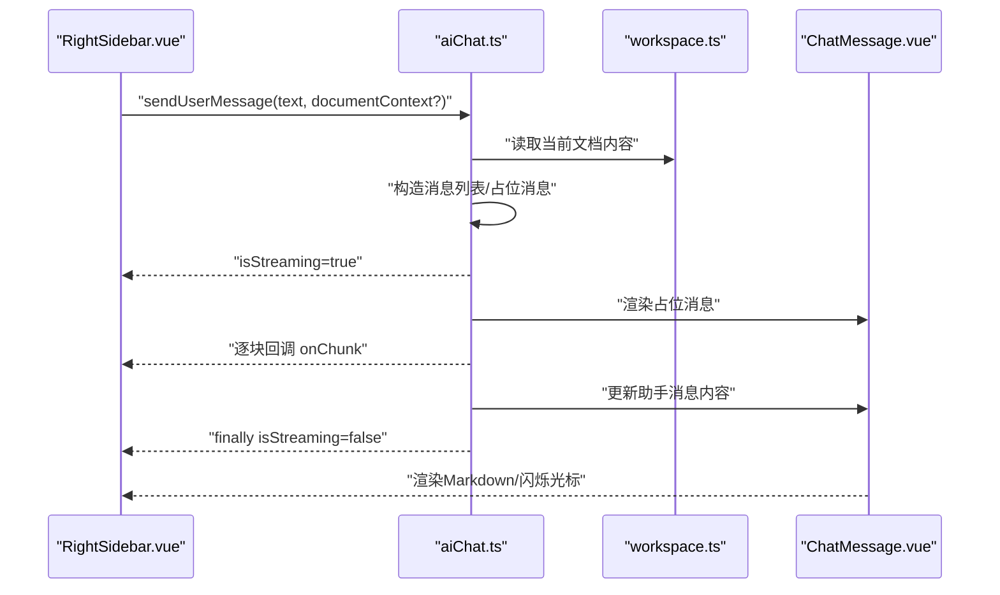
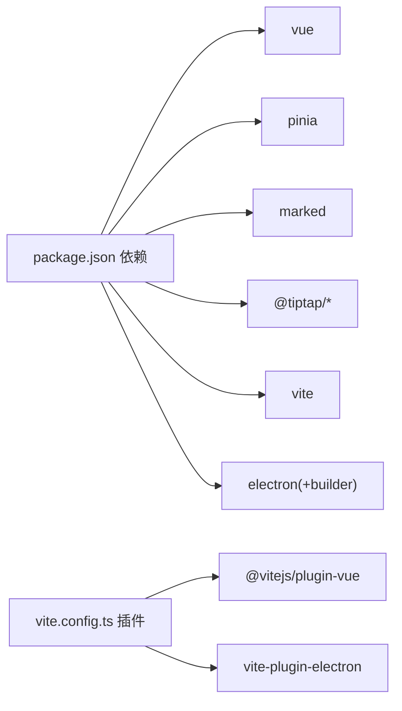

# 服务层架构

<cite>
**本文引用的文件**
- [gemini.ts](file://app/src/services/gemini.ts)
- [aiChat.ts](file://app/src/stores/aiChat.ts)
- [ai.ts](file://app/src/types/ai.ts)
- [RightSidebar.vue](file://app/src/components/layout/RightSidebar.vue)
- [ChatMessage.vue](file://app/src/components/layout/ChatMessage.vue)
- [EditArea.vue](file://app/src/components/layout/EditArea.vue)
- [App.vue](file://app/src/App.vue)
- [workspace.ts](file://app/src/stores/workspace.ts)
- [theme.ts](file://app/src/stores/theme.ts)
- [package.json](file://app/package.json)
- [vite.config.ts](file://app/vite.config.ts)
</cite>

## 目录
1. [简介](#简介)
2. [项目结构](#项目结构)
3. [核心组件](#核心组件)
4. [架构总览](#架构总览)
5. [详细组件分析](#详细组件分析)
6. [依赖分析](#依赖分析)
7. [性能考虑](#性能考虑)
8. [故障排查指南](#故障排查指南)
9. [结论](#结论)
10. [附录](#附录)

## 简介
本文件面向Woo前端服务层架构，聚焦于服务层的设计模式与职责划分，涵盖API服务、第三方服务集成（以Gemini AI为例）、业务逻辑封装、HTTP客户端配置、请求/响应处理与网络错误处理、可测试性与Mock支持、以及扩展与性能优化最佳实践。本文以实际源码为依据，配合可视化图表，帮助开发者快速理解并高效维护服务层。

## 项目结构
Woo前端采用“组件 + 存储（Pinia）+ 类型定义”的分层组织方式：
- 服务层：封装第三方API调用与数据处理，例如Gemini服务。
- 存储层：使用Pinia集中管理应用状态，如AI聊天会话、模型选择、主题与工作区等。
- 组件层：UI交互与视图渲染，负责触发存储层动作与展示状态。
- 类型层：统一的数据结构定义，保证跨模块一致性。

**图表来源**
- [RightSidebar.vue](file://app/src/components/layout/RightSidebar.vue)
- [aiChat.ts](file://app/src/stores/aiChat.ts)
- [gemini.ts](file://app/src/services/gemini.ts)
- [ChatMessage.vue](file://app/src/components/layout/ChatMessage.vue)
- [EditArea.vue](file://app/src/components/layout/EditArea.vue)
- [App.vue](file://app/src/App.vue)
- [workspace.ts](file://app/src/stores/workspace.ts)
- [theme.ts](file://app/src/stores/theme.ts)

**章节来源**
- [package.json](file://app/package.json)
- [vite.config.ts](file://app/vite.config.ts)

## 核心组件
- 服务层（Gemini集成）
  - 提供API Key校验、HTML清理、流式消息发送与SSE解析、错误分类与抛出。
- 存储层（AI聊天）
  - 负责消息生命周期、模型选择、AbortController控制、本地持久化、错误状态管理。
- 组件层（右侧AI侧栏）
  - 负责输入、发送、停止、滚动、快捷操作与错误提示，驱动存储层执行业务。
- 类型层（AI相关）
  - 统一ChatMessage与ModelConfig结构，约束服务与存储的数据契约。

**章节来源**
- [gemini.ts](file://app/src/services/gemini.ts)
- [aiChat.ts](file://app/src/stores/aiChat.ts)
- [ai.ts](file://app/src/types/ai.ts)
- [RightSidebar.vue](file://app/src/components/layout/RightSidebar.vue)

## 架构总览
服务层通过独立模块封装第三方API，存储层作为业务中枢协调UI与服务层，组件层仅负责交互与状态展示。整体遵循“关注点分离”与“单向数据流”，便于测试与扩展。

**图表来源**
- [RightSidebar.vue](file://app/src/components/layout/RightSidebar.vue)
- [aiChat.ts](file://app/src/stores/aiChat.ts)
- [gemini.ts](file://app/src/services/gemini.ts)

## 详细组件分析

### 服务层：Gemini集成
- 设计要点
  - 将外部API调用封装为纯函数，便于单元测试与替换。
  - 使用AbortSignal实现请求取消，避免内存泄漏与竞态。
  - SSE流式解析，逐块解码并回调，提升用户体验。
  - 对常见HTTP错误进行语义化抛错，便于上层统一处理。
- 关键流程
  - API Key校验：GET /models?key=...
  - 消息发送：POST /models/{model}:streamGenerateContent?alt=sse&key=...
  - 流式解析：逐行解析"data: ..."，跳过[DONE]，提取text字段。
- 错误处理
  - 401/403：提示Key无效或过期。
  - 429：提示请求过于频繁。
  - 其他错误：统一包装为带状态码的错误信息。

**图表来源**
- [gemini.ts](file://app/src/services/gemini.ts)

**章节来源**
- [gemini.ts](file://app/src/services/gemini.ts)

### 存储层：AI聊天状态管理
- 职责边界
  - 维护消息列表、模型选择、流式状态、错误状态与AbortController。
  - 从localStorage读取/保存API Key，触发hasApiKey响应式更新。
  - 构造发送给服务层的消息数组，注入文档上下文。
- 关键流程
  - 发送消息：创建用户消息与占位助手消息；构建API消息列表；调用服务层sendMessage；逐块更新助手消息；finally清理状态。
  - 取消生成：通过AbortController.abort中断请求。
  - 清空聊天：重置消息与错误状态。
- 数据契约
  - ChatMessage：id、role、content、timestamp、isStreaming。
  - ModelConfig：provider限定为gemini，包含模型标识。

**图表来源**
- [aiChat.ts](file://app/src/stores/aiChat.ts)
- [gemini.ts](file://app/src/services/gemini.ts)
- [ai.ts](file://app/src/types/ai.ts)

**章节来源**
- [aiChat.ts](file://app/src/stores/aiChat.ts)
- [ai.ts](file://app/src/types/ai.ts)

### 组件层：右侧AI侧栏与消息渲染
- 右侧AI侧栏
  - 负责模型选择、清空聊天、输入框、快捷按钮、错误提示与API Key提示。
  - 监听消息长度与最后一条消息内容，自动滚动至底部。
  - 调用存储层的发送/取消/清空方法。
- 消息渲染
  - 用户消息：简单转义与换行处理。
  - 助手消息：使用marked渲染Markdown，流式生成时显示闪烁光标。

**图表来源**
- [RightSidebar.vue](file://app/src/components/layout/RightSidebar.vue)
- [aiChat.ts](file://app/src/stores/aiChat.ts)
- [workspace.ts](file://app/src/stores/workspace.ts)
- [ChatMessage.vue](file://app/src/components/layout/ChatMessage.vue)

**章节来源**
- [RightSidebar.vue](file://app/src/components/layout/RightSidebar.vue)
- [ChatMessage.vue](file://app/src/components/layout/ChatMessage.vue)
- [workspace.ts](file://app/src/stores/workspace.ts)

### 应用入口与主题
- App.vue负责布局装配与全局主题初始化。
- theme.ts通过Pinia持久化主题并在DOM上应用data-theme属性。

**章节来源**
- [App.vue](file://app/src/App.vue)
- [theme.ts](file://app/src/stores/theme.ts)

## 依赖分析
- 运行时依赖
  - Vue 3、Pinia、marked、@tiptap等，支撑组件系统、状态管理与富文本编辑。
- 构建与开发
  - Vite + Vue插件 + Electron插件，提供开发服务器与打包能力。
- 第三方服务
  - Gemini AI API：通过HTTP客户端（原生fetch）直接访问，无需额外SDK。

**图表来源**
- [package.json](file://app/package.json)
- [vite.config.ts](file://app/vite.config.ts)

**章节来源**
- [package.json](file://app/package.json)
- [vite.config.ts](file://app/vite.config.ts)

## 性能考虑
- 流式渲染
  - 服务层按块回调，组件层增量更新，避免大字符串拼接带来的主线程阻塞。
- 滚动优化
  - 仅在接近底部时滚动至底部，减少不必要的DOM操作。
- 内容截断
  - 上下文注入前对HTML进行清理与截断，降低请求体积与延迟。
- 取消与防抖
  - 使用AbortController及时中断无用请求；编辑器内容变更防抖写回，避免反向写回。
- 构建优化
  - 使用Vite按需编译与热更新，生产环境Tree-shaking与压缩。

[本节为通用性能建议，不直接分析具体文件，故无“章节来源”]

## 故障排查指南
- API Key无效/过期
  - 现象：401/403错误，提示Key无效或过期。
  - 排查：检查设置面板是否保存Key；调用validateApiKey验证。
- 请求过于频繁
  - 现象：429错误，提示稍后再试。
  - 排查：降低请求频率；增加退避策略（可在服务层扩展）。
- 网络异常/超时
  - 现象：网络错误或超时导致异常。
  - 排查：检查网络连通性；为fetch增加timeout与重试（可在服务层扩展）。
- 流式解析异常
  - 现象：部分SSE行解析失败导致丢字。
  - 排查：服务层已跳过不可解析行，若仍异常，检查上游响应格式。
- 取消生成无效
  - 现象：点击停止后仍继续渲染。
  - 排查：确认AbortController正确传递至fetch；finally中重置状态。

**章节来源**
- [gemini.ts](file://app/src/services/gemini.ts)
- [aiChat.ts](file://app/src/stores/aiChat.ts)

## 结论
Woo前端服务层以简洁的纯函数服务与Pinia存储为核心，实现了清晰的职责划分与良好的可测试性。通过AbortController与SSE流式处理，提供了流畅的交互体验。建议后续在服务层增加超时与重试、统一错误码、Mock数据支持与更细粒度的单元测试，以进一步提升稳定性与可维护性。

[本节为总结性内容，不直接分析具体文件，故无“章节来源”]

## 附录

### 可测试性设计与Mock建议
- 服务层测试
  - 以纯函数形式导出，便于传入假fetch与假AbortSignal，覆盖成功/失败/取消/超时场景。
  - Mock SSE响应：构造多行"data: ..."与[DONE]，验证逐块回调与最终结果。
- 存储层测试
  - 使用测试框架的Pinia mock，注入假服务层，验证消息构建、错误处理与状态变更。
- 组件层测试
  - 使用Vue Test Utils渲染组件，触发输入与发送事件，断言存储层调用与UI更新。

[本节为通用测试建议，不直接分析具体文件，故无“章节来源”]

### 开发调试技巧
- 在服务层增加日志：记录请求URL、关键参数与SSE解析进度。
- 在存储层暴露调试开关：打印消息列表与流式回调次数。
- 在组件层启用开发者工具：观察响应式更新与滚动行为。

[本节为通用调试建议，不直接分析具体文件，故无“章节来源”]

### 扩展最佳实践
- 服务层扩展
  - 抽象HTTP客户端：统一headers、超时、重试与拦截器（可选）。
  - 错误码标准化：定义统一错误对象，便于UI层一致展示。
- 存储层扩展
  - 引入中间件：记录动作与状态快照，辅助调试。
  - 会话持久化：将消息与模型选择持久化至IndexedDB或localStorage。
- 组件层扩展
  - 将渲染逻辑抽离为可复用组件，支持不同消息类型（代码、图片、公式等）。

[本节为通用扩展建议，不直接分析具体文件，故无“章节来源”]