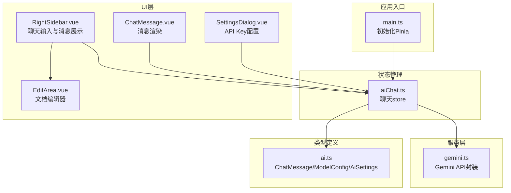
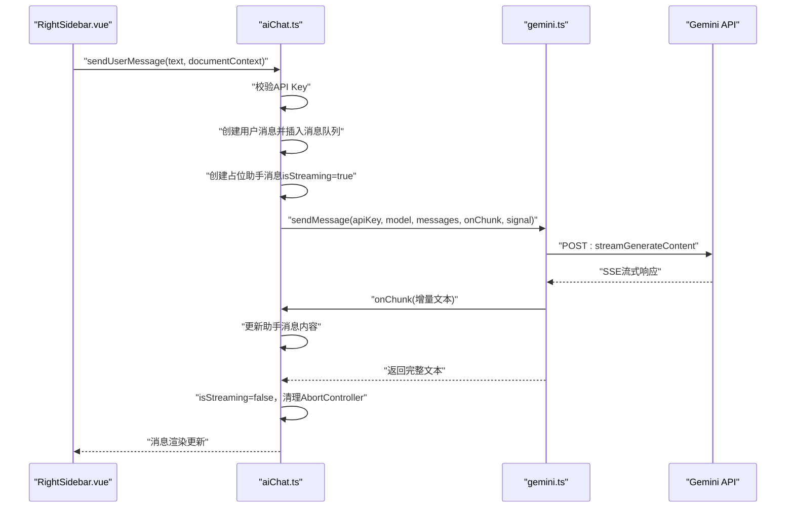
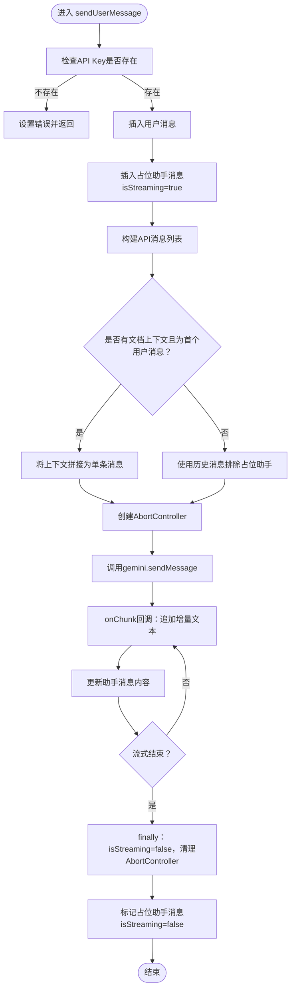
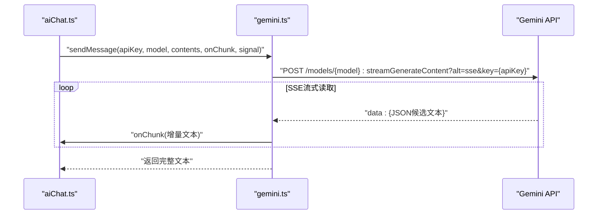
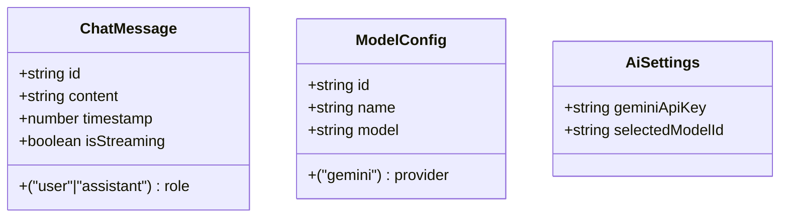
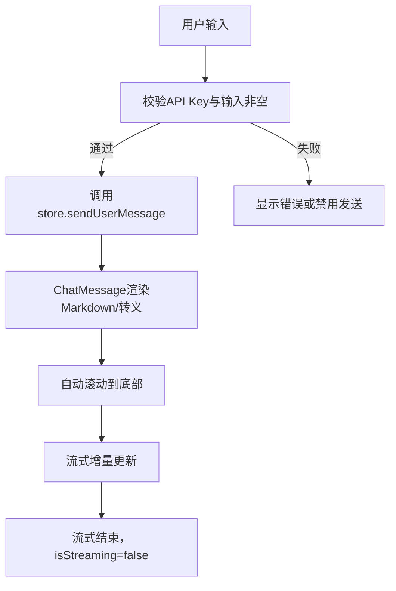
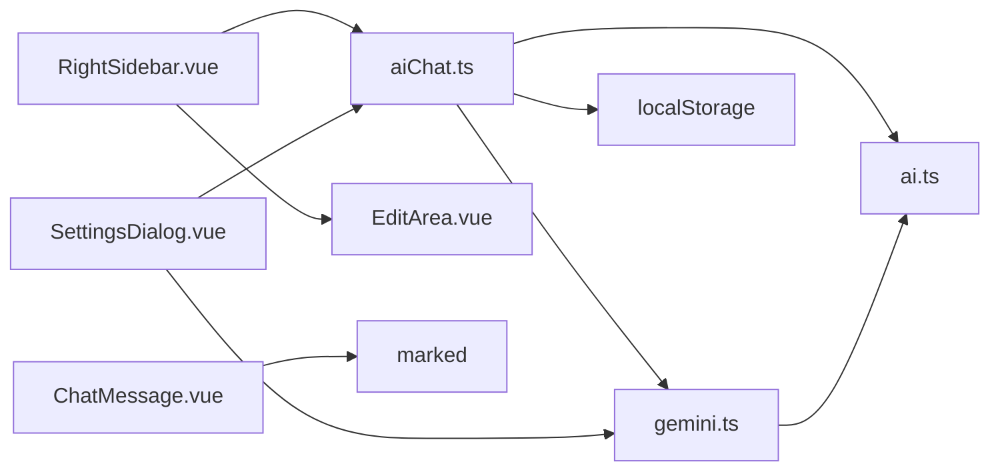

# AI聊天状态管理

<cite>
**本文档引用的文件**
- [aiChat.ts](file://app/src/stores/aiChat.ts)
- [gemini.ts](file://app/src/services/gemini.ts)
- [ai.ts](file://app/src/types/ai.ts)
- [ChatMessage.vue](file://app/src/components/layout/ChatMessage.vue)
- [RightSidebar.vue](file://app/src/components/layout/RightSidebar.vue)
- [SettingsDialog.vue](file://app/src/components/layout/SettingsDialog.vue)
- [EditArea.vue](file://app/src/components/layout/EditArea.vue)
- [main.ts](file://app/src/main.ts)
</cite>

## 目录
1. [简介](#简介)
2. [项目结构](#项目结构)
3. [核心组件](#核心组件)
4. [架构概览](#架构概览)
5. [详细组件分析](#详细组件分析)
6. [依赖关系分析](#依赖关系分析)
7. [性能考量](#性能考量)
8. [故障排查指南](#故障排查指南)
9. [结论](#结论)
10. [附录](#附录)

## 简介
本文件为Woo项目中AI聊天状态管理store的技术文档，重点阐述aiChat store的聊天状态管理机制，包括：
- 消息历史的存储与维护
- 对话上下文的构建与传递
- 流式响应的处理与渲染
- 聊天消息的数据结构与状态管理
- 用户输入处理流程
- 与Gemini API的集成方式、API Key管理策略与错误处理机制
- 聊天功能扩展建议（消息类型扩展、会话管理优化、性能监控）
- 聊天体验优化、数据安全与用户体验改进建议

## 项目结构
Woo采用Vue 3 + Pinia的状态管理方案，AI聊天功能位于前端应用层，通过独立的store管理状态，服务层封装与Gemini API的交互，UI层负责消息渲染与用户交互。

图表来源
- [main.ts:1-8](file://app/src/main.ts#L1-L8)
- [aiChat.ts:1-199](file://app/src/stores/aiChat.ts#L1-L199)
- [gemini.ts:1-103](file://app/src/services/gemini.ts#L1-L103)
- [ai.ts:1-20](file://app/src/types/ai.ts#L1-L20)
- [RightSidebar.vue:1-432](file://app/src/components/layout/RightSidebar.vue#L1-L432)
- [ChatMessage.vue:1-93](file://app/src/components/layout/ChatMessage.vue#L1-L93)
- [SettingsDialog.vue:1-287](file://app/src/components/layout/SettingsDialog.vue#L1-L287)
- [EditArea.vue:1-463](file://app/src/components/layout/EditArea.vue#L1-L463)

章节来源
- [main.ts:1-8](file://app/src/main.ts#L1-L8)
- [aiChat.ts:1-199](file://app/src/stores/aiChat.ts#L1-L199)
- [gemini.ts:1-103](file://app/src/services/gemini.ts#L1-L103)
- [ai.ts:1-20](file://app/src/types/ai.ts#L1-L20)
- [RightSidebar.vue:1-432](file://app/src/components/layout/RightSidebar.vue#L1-L432)
- [ChatMessage.vue:1-93](file://app/src/components/layout/ChatMessage.vue#L1-L93)
- [SettingsDialog.vue:1-287](file://app/src/components/layout/SettingsDialog.vue#L1-L287)
- [EditArea.vue:1-463](file://app/src/components/layout/EditArea.vue#L1-L463)

## 核心组件
- aiChat store：负责消息历史、模型选择、流式状态、错误状态、AbortController、API Key管理等。
- gemini服务：封装Gemini API的请求、流式读取、错误码映射与API Key校验。
- 类型系统：定义ChatMessage、ModelConfig、AiSettings接口，统一数据结构。
- UI组件：RightSidebar负责输入与消息展示；ChatMessage负责消息渲染；SettingsDialog负责API Key配置；EditArea提供文档上下文。

章节来源
- [aiChat.ts:8-199](file://app/src/stores/aiChat.ts#L8-L199)
- [gemini.ts:1-103](file://app/src/services/gemini.ts#L1-L103)
- [ai.ts:1-20](file://app/src/types/ai.ts#L1-L20)
- [RightSidebar.vue:85-185](file://app/src/components/layout/RightSidebar.vue#L85-L185)
- [ChatMessage.vue:10-40](file://app/src/components/layout/ChatMessage.vue#L10-L40)
- [SettingsDialog.vue:50-103](file://app/src/components/layout/SettingsDialog.vue#L50-L103)
- [EditArea.vue:28-174](file://app/src/components/layout/EditArea.vue#L28-L174)

## 架构概览
aiChat store作为核心状态中心，协调UI层与服务层：
- UI层通过store暴露的方法进行交互（发送消息、取消生成、清空会话、设置模型、保存/读取API Key）。
- store内部通过AbortController控制流式生成的生命周期，避免竞态与资源泄露。
- 服务层负责与Gemini API通信，解析SSE流式响应，将增量文本通过回调注入到store的消息队列中。
- 类型系统保证消息结构一致性，便于扩展新的消息类型与上下文字段。

图表来源
- [RightSidebar.vue:120-129](file://app/src/components/layout/RightSidebar.vue#L120-L129)
- [aiChat.ts:73-169](file://app/src/stores/aiChat.ts#L73-L169)
- [gemini.ts:29-102](file://app/src/services/gemini.ts#L29-L102)

## 详细组件分析

### aiChat store：聊天状态管理核心
- 状态管理
  - messages：聊天消息数组，包含用户消息与助手消息，支持流式增量更新。
  - selectedModelId：当前模型ID，支持自动选择与手动切换。
  - isStreaming：流式生成状态，驱动UI按钮与滚动行为。
  - error：错误信息，用于提示用户。
  - abortController：用于取消流式生成。
  - _apiKeyVersion：API Key变更的版本号，用于触发hasApiKey响应式更新。
- 计算属性
  - availableModels：可用模型列表（当前包含自动与Gemini Flash）。
  - currentModel：根据selectedModelId计算当前使用的模型配置。
  - hasApiKey：基于本地存储的API Key存在性判断。
- API Key管理
  - getApiKey：从localStorage读取AiSettings并返回geminiApiKey。
  - saveApiKey：合并现有设置，写入新API Key并递增版本号以触发响应式更新。
- 模型选择
  - setModel：更新selectedModelId。
- 聊天操作
  - generateId：生成唯一消息ID。
  - sendUserMessage：核心流程
    - 校验API Key，若缺失则设置错误并返回。
    - 插入用户消息与占位助手消息（isStreaming=true）。
    - 构建发送给API的消息列表：
      - 若存在文档上下文且为首个用户消息，则将上下文拼接到用户消息中，形成单条消息。
      - 否则排除占位助手消息，将所有非空内容消息加入API消息列表。
    - 创建AbortController并传入服务层。
    - 调用gemini.sendMessage，通过onChunk回调实时更新助手消息内容。
    - 捕获异常：AbortError视为用户取消；其他错误设置error并清理空助手消息。
    - finally：关闭流式状态，清理AbortController，标记占位助手消息isStreaming=false。
  - cancelGeneration：调用abortController.abort()中断流式生成。
  - clearChat：清空消息与错误状态。

图表来源
- [aiChat.ts:73-169](file://app/src/stores/aiChat.ts#L73-L169)

章节来源
- [aiChat.ts:8-199](file://app/src/stores/aiChat.ts#L8-L199)

### gemini服务：与Gemini API的集成
- validateApiKey：向/models端点发起请求，判断API Key有效性。
- stripHtml：去除HTML标签，提取纯文本，用于文档上下文注入。
- sendMessage：
  - 将ChatMessage映射为Gemini的contents，assistant角色映射为model。
  - 使用SSE流式接口：/models/{model}:streamGenerateContent?alt=sse&key={apiKey}。
  - 解析SSE响应：按行读取，过滤"data: "前缀，解析JSON，提取candidates[0].content.parts[0].text。
  - onChunk回调：将增量文本注入到UI层。
  - 错误处理：401/403抛出“API Key无效或已过期”；429抛出“请求过于频繁”；其他HTTP错误抛出通用错误信息。
  - 返回完整文本，供后续使用。

图表来源
- [gemini.ts:29-102](file://app/src/services/gemini.ts#L29-L102)

章节来源
- [gemini.ts:1-103](file://app/src/services/gemini.ts#L1-L103)

### 类型系统：消息与模型配置
- ChatMessage：包含id、role、content、timestamp、isStreaming可选字段。
- ModelConfig：包含id、name、provider、model。
- AiSettings：包含geminiApiKey、selectedModelId。

图表来源
- [ai.ts:1-20](file://app/src/types/ai.ts#L1-L20)

章节来源
- [ai.ts:1-20](file://app/src/types/ai.ts#L1-L20)

### UI组件：消息渲染与输入处理
- ChatMessage.vue
  - 用户消息：对内容进行HTML实体转义并保留换行。
  - 助手消息：使用marked渲染Markdown，支持换行与GitHub风格。
  - 流式状态：当isStreaming为true时显示闪烁光标。
- RightSidebar.vue
  - 输入区域：textarea绑定inputText，Enter（不带Shift）触发发送。
  - 快捷操作：预设问题模板，点击即发送。
  - 滚动行为：新消息与流式更新时自动滚动到底部。
  - 模型选择：下拉框绑定selectedModelId，支持清空聊天。
  - 错误与API Key提示：显示error与未配置API Key的横幅。
  - 停止生成：isStreaming为true时显示停止按钮，调用store.cancelGeneration()。
- SettingsDialog.vue
  - API Key输入与显示/隐藏切换。
  - 验证按钮：调用validateApiKey，显示成功/失败状态。
  - 保存按钮：调用store.saveApiKey并关闭弹窗。
  - 打开Google AI Studio链接。
- EditArea.vue
  - 提供文档编辑器，内容变化时同步到工作区store，为AI上下文注入提供HTML内容。

图表来源
- [RightSidebar.vue:120-185](file://app/src/components/layout/RightSidebar.vue#L120-L185)
- [ChatMessage.vue:27-39](file://app/src/components/layout/ChatMessage.vue#L27-L39)
- [SettingsDialog.vue:78-94](file://app/src/components/layout/SettingsDialog.vue#L78-L94)
- [EditArea.vue:110-116](file://app/src/components/layout/EditArea.vue#L110-L116)

章节来源
- [ChatMessage.vue:1-93](file://app/src/components/layout/ChatMessage.vue#L1-L93)
- [RightSidebar.vue:1-432](file://app/src/components/layout/RightSidebar.vue#L1-L432)
- [SettingsDialog.vue:1-287](file://app/src/components/layout/SettingsDialog.vue#L1-L287)
- [EditArea.vue:1-463](file://app/src/components/layout/EditArea.vue#L1-L463)

## 依赖关系分析
- aiChat.ts依赖：
  - 类型定义：ChatMessage、ModelConfig、AiSettings。
  - 服务层：sendMessage、stripHtml。
  - 本地存储：localStorage读写AiSettings。
- gemini.ts依赖：
  - 类型定义：ChatMessage。
  - 浏览器fetch与ReadableStream Reader。
- UI层依赖：
  - ChatMessage.vue依赖marked进行Markdown渲染。
  - RightSidebar.vue依赖aiChat store与workspace store（文档上下文）。
  - SettingsDialog.vue依赖aiChat store与validateApiKey。

图表来源
- [aiChat.ts:1-5](file://app/src/stores/aiChat.ts#L1-L5)
- [gemini.ts:1](file://app/src/services/gemini.ts#L1)
- [RightSidebar.vue:87-90](file://app/src/components/layout/RightSidebar.vue#L87-L90)
- [ChatMessage.vue:12](file://app/src/components/layout/ChatMessage.vue#L12)
- [SettingsDialog.vue:53-54](file://app/src/components/layout/SettingsDialog.vue#L53-L54)
- [EditArea.vue:39](file://app/src/components/layout/EditArea.vue#L39)

章节来源
- [aiChat.ts:1-5](file://app/src/stores/aiChat.ts#L1-L5)
- [gemini.ts:1](file://app/src/services/gemini.ts#L1)
- [RightSidebar.vue:87-90](file://app/src/components/layout/RightSidebar.vue#L87-L90)
- [ChatMessage.vue:12](file://app/src/components/layout/ChatMessage.vue#L12)
- [SettingsDialog.vue:53-54](file://app/src/components/layout/SettingsDialog.vue#L53-L54)
- [EditArea.vue:39](file://app/src/components/layout/EditArea.vue#L39)

## 性能考量
- 流式渲染优化
  - 仅在onChunk回调中追加增量文本，避免全量重渲染。
  - 使用nextTick与智能滚动阈值，减少不必要的DOM操作。
- 消息构建优化
  - 非首条消息时复用历史消息，避免重复拼接。
  - 文档上下文截断长度限制，防止消息体过大影响性能。
- 网络与并发
  - 使用AbortController避免多个流式请求相互干扰。
  - 错误快速返回，减少无效等待。
- 存储与响应式
  - API Key变更通过版本号触发hasApiKey更新，避免深层依赖追踪成本过高。

[本节为通用性能建议，无需特定文件引用]

## 故障排查指南
- API Key相关
  - 无效或过期：服务层返回明确错误，UI显示“API Key无效或已过期”，可在设置中重新配置。
  - 未配置：UI显示API Key横幅，引导前往设置。
  - 验证失败：设置弹窗显示“无效”，可重新输入或点击链接获取。
- 请求频率过高
  - 服务层返回“请求过于频繁”，建议降低请求频率或升级配额。
- 流式生成中断
  - 用户主动取消：AbortError被捕获但不视为错误，UI保持干净状态。
  - 其他网络错误：设置error并清理空助手消息，避免占位消息残留。
- 渲染问题
  - 助手消息Markdown渲染：确保marked正确初始化，避免未定义内容导致空白。
  - 用户消息转义：确保HTML实体转义与换行保留逻辑生效。

章节来源
- [gemini.ts:57-65](file://app/src/services/gemini.ts#L57-L65)
- [aiChat.ts:148-168](file://app/src/stores/aiChat.ts#L148-L168)
- [RightSidebar.vue:44-48](file://app/src/components/layout/RightSidebar.vue#L44-L48)
- [SettingsDialog.vue:78-94](file://app/src/components/layout/SettingsDialog.vue#L78-L94)
- [ChatMessage.vue:27-39](file://app/src/components/layout/ChatMessage.vue#L27-L39)

## 结论
aiChat store通过Pinia实现了清晰的聊天状态管理，结合gemini服务的SSE流式处理，提供了流畅的AI对话体验。其设计具备良好的扩展性：可通过新增ModelConfig扩展模型、通过扩展ChatMessage字段增强上下文与状态、通过引入工作区store进一步丰富文档上下文。同时，完善的错误处理与用户引导提升了系统的健壮性与可用性。

[本节为总结性内容，无需特定文件引用]

## 附录

### 数据结构与状态管理要点
- ChatMessage字段
  - id：唯一标识，用于定位与更新。
  - role：区分用户与助手。
  - content：消息内容，助手消息支持Markdown。
  - timestamp：时间戳，用于排序与调试。
  - isStreaming：流式状态，驱动UI闪烁光标与滚动行为。
- 状态流转
  - 用户发送消息 → 插入用户消息 → 插入占位助手消息 → 流式增量更新 → 完成后标记isStreaming=false → 自动滚动。

章节来源
- [ai.ts:1-7](file://app/src/types/ai.ts#L1-L7)
- [aiChat.ts:83-99](file://app/src/stores/aiChat.ts#L83-L99)
- [RightSidebar.vue:164-184](file://app/src/components/layout/RightSidebar.vue#L164-L184)

### 扩展方法与最佳实践
- 消息类型扩展
  - 在ChatMessage中增加枚举类型（如system、function等），并在服务层映射为Gemini支持的角色。
  - 在UI层为不同角色提供差异化渲染与交互。
- 会话管理优化
  - 引入会话列表与持久化，支持多会话切换与导出。
  - 增加消息分组与标签，便于检索与回顾。
- 性能监控
  - 记录每次请求耗时、流式增量到达时间、错误率，上报至遥测系统。
  - 限制消息历史长度与上下文大小，避免超长请求。
- 聊天体验优化
  - 提供“继续生成”、“重新生成”等操作按钮。
  - 支持消息复制、收藏与分享。
- 数据安全
  - API Key仅存储于localStorage，避免明文传输。
  - 在Electron环境下可考虑使用更安全的密钥存储方案。
  - 对敏感上下文进行脱敏处理（如邮箱、电话号码）。
- 用户体验改进
  - 提供“写作助手”等快捷模板，降低用户输入门槛。
  - 增加“停止生成”按钮，提升交互可控性。
  - 优化移动端输入体验（软键盘遮挡、高度自适应）。

[本节为概念性建议，无需特定文件引用]