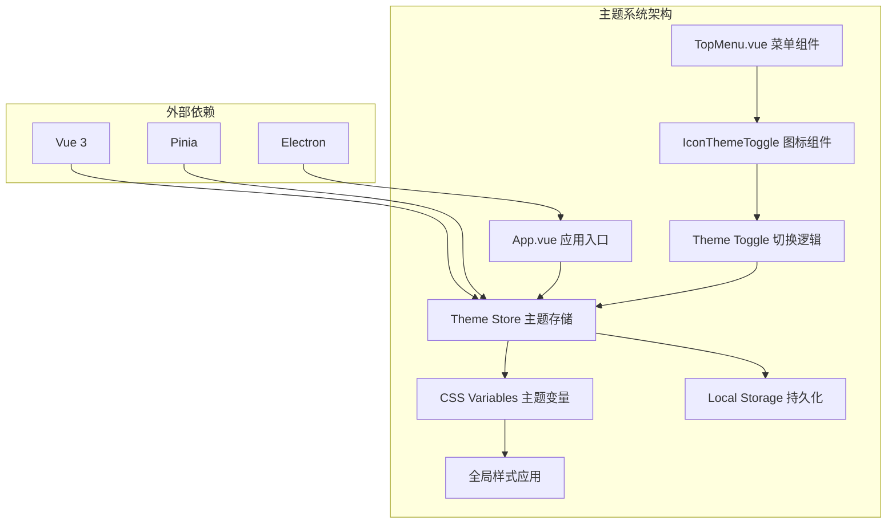
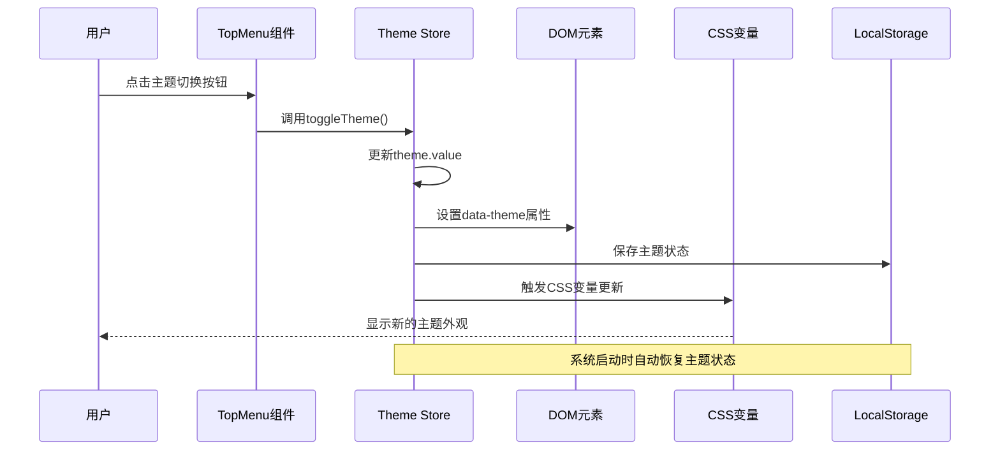
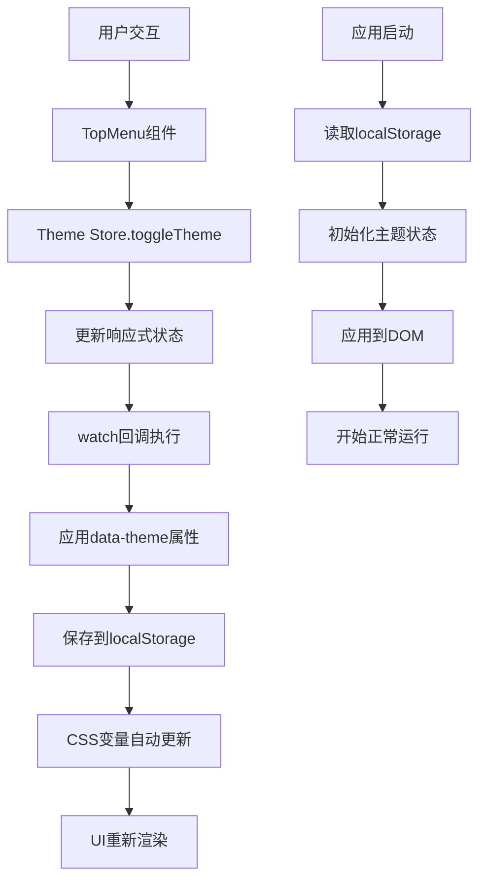
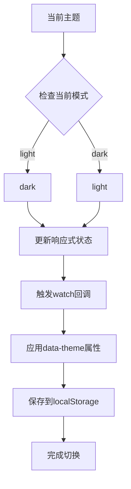
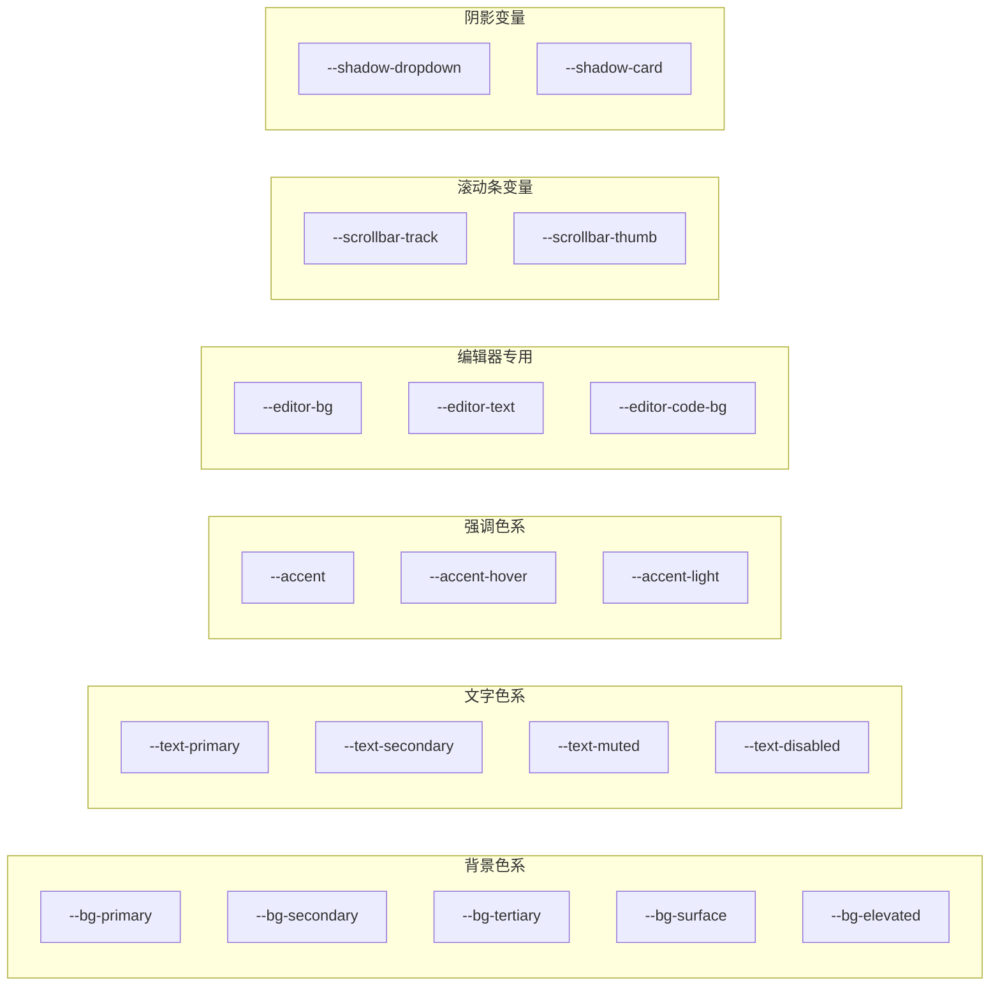
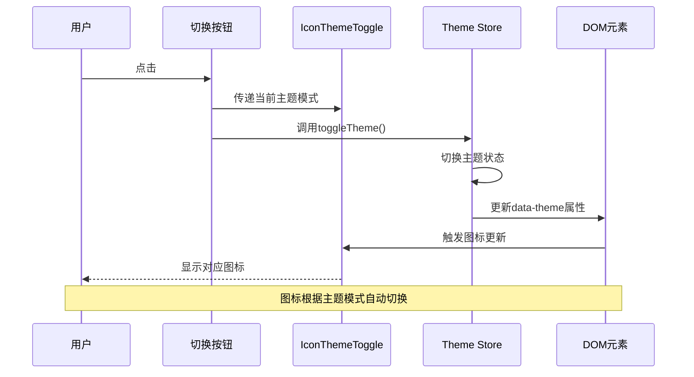
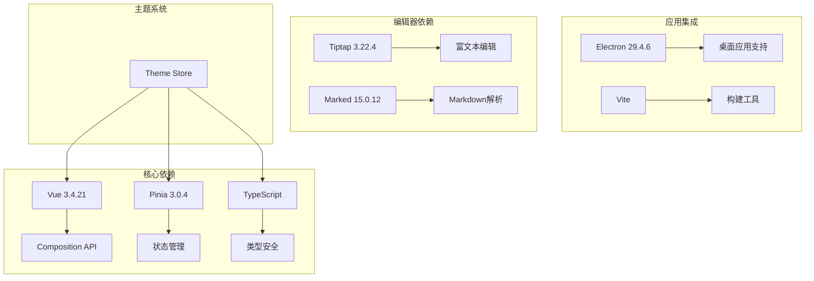
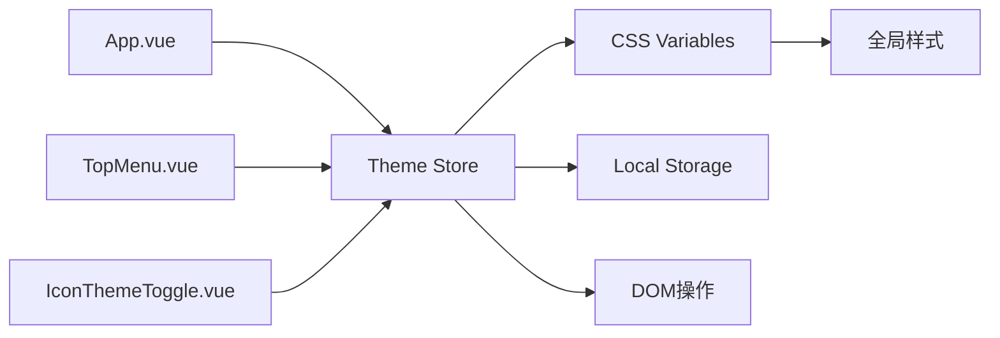

# 主题状态管理

<cite>
**本文档引用的文件**
- [theme.ts](file://app/src/stores/theme.ts)
- [style.css](file://app/src/style.css)
- [App.vue](file://app/src/App.vue)
- [TopMenu.vue](file://app/src/components/layout/TopMenu.vue)
- [IconThemeToggle.vue](file://app/src/components/icons/IconThemeToggle.vue)
- [main.ts](file://app/src/main.ts)
- [package.json](file://app/package.json)
</cite>

## 目录
1. [简介](#简介)
2. [项目结构](#项目结构)
3. [核心组件](#核心组件)
4. [架构概览](#架构概览)
5. [详细组件分析](#详细组件分析)
6. [依赖关系分析](#依赖关系分析)
7. [性能考虑](#性能考虑)
8. [故障排除指南](#故障排除指南)
9. [结论](#结论)
10. [附录](#附录)

## 简介

Woo主题状态管理系统是一个基于Vue 3和Pinia的状态管理解决方案，专门用于管理应用程序的主题切换功能。该系统实现了深色模式和浅色模式之间的无缝切换，通过CSS自定义属性实现动态主题更新，并提供了持久化的用户偏好存储。

该系统的核心特点包括：
- 基于CSS自定义属性的主题变量系统
- Pinia状态管理的响应式主题切换
- 本地存储的用户偏好持久化
- 即时的主题同步到DOM元素
- 完整的深色/浅色主题支持

## 项目结构

Woo主题系统采用模块化设计，主要由以下组件构成：



**图表来源**
- [App.vue:48-49](file://app/src/App.vue#L48-L49)
- [theme.ts:1-31](file://app/src/stores/theme.ts#L1-L31)
- [style.css:1-286](file://app/src/style.css#L1-L286)

**章节来源**
- [main.ts:1-8](file://app/src/main.ts#L1-L8)
- [package.json:13-26](file://app/package.json#L13-L26)

## 核心组件

### 主题存储（Theme Store）

主题存储是整个系统的核心，负责管理主题状态、提供切换功能并处理持久化。

**关键特性：**
- 类型安全的主题模式定义
- 自动从localStorage恢复主题状态
- 响应式的主题切换机制
- 即时的DOM属性更新

**章节来源**
- [theme.ts:8-30](file://app/src/stores/theme.ts#L8-L30)

### CSS主题变量系统

系统使用CSS自定义属性实现主题变量的动态更新，支持深色和浅色两种模式。

**变量组织结构：**
- 背景色系：`--bg-primary`, `--bg-secondary`, `--bg-tertiary`
- 文字色系：`--text-primary`, `--text-secondary`, `--text-muted`
- 强调色系：`--accent`, `--accent-hover`, `--accent-light`
- 编辑器专用：`--editor-*`系列变量
- 滚动条变量：`--scrollbar-track`, `--scrollbar-thumb`
- 阴影变量：`--shadow-dropdown`, `--shadow-card`

**章节来源**
- [style.css:6-142](file://app/src/style.css#L6-L142)

### 主题切换组件

主题切换组件提供用户界面交互，允许用户手动切换主题模式。

**组件特性：**
- 响应式图标显示（太阳/月亮图标）
- 即时的主题状态反馈
- 键盘快捷键支持
- Electron窗口控制集成

**章节来源**
- [TopMenu.vue:30-32](file://app/src/components/layout/TopMenu.vue#L30-L32)
- [IconThemeToggle.vue:1-45](file://app/src/components/icons/IconThemeToggle.vue#L1-L45)

## 架构概览

Woo主题系统的整体架构采用分层设计，确保了良好的可维护性和扩展性：



**图表来源**
- [theme.ts:16-24](file://app/src/stores/theme.ts#L16-L24)
- [App.vue:48-49](file://app/src/App.vue#L48-L49)

### 数据流分析

主题系统遵循单向数据流原则，确保状态管理的可预测性和可追踪性：



**图表来源**
- [theme.ts:21-24](file://app/src/stores/theme.ts#L21-L24)
- [style.css:158](file://app/src/style.css#L158)

## 详细组件分析

### Theme Store 实现分析

主题存储使用Vue 3的Composition API和Pinia实现，具有以下设计特点：

#### 状态管理架构

```mermaid
classDiagram
class ThemeStore {
+ThemeMode theme
+ThemeMode saved
+applyTheme(mode) void
+toggleTheme() void
}
class ThemeMode {
<<enumeration>>
"light"
"dark"
}
class StorageManager {
+STORAGE_KEY string
+getItem(key) ThemeMode
+setItem(key, value) void
}
ThemeStore --> ThemeMode : 使用
ThemeStore --> StorageManager : 依赖
ThemeStore --> DocumentElement : 操作
```

**图表来源**
- [theme.ts:4](file://app/src/stores/theme.ts#L4)
- [theme.ts:6](file://app/src/stores/theme.ts#L6)

#### 主题切换算法

主题切换过程采用简单的状态翻转算法：



**图表来源**
- [theme.ts:16-18](file://app/src/stores/theme.ts#L16-L18)
- [theme.ts:21-24](file://app/src/stores/theme.ts#L21-L24)

**章节来源**
- [theme.ts:1-31](file://app/src/stores/theme.ts#L1-L31)

### CSS变量系统设计

CSS变量系统采用层次化组织方式，确保主题切换的完整性和一致性：

#### 变量分类体系



**图表来源**
- [style.css:9-141](file://app/src/style.css#L9-L141)

#### 主题切换动画

系统通过CSS过渡属性实现平滑的主题切换动画：

**章节来源**
- [style.css:72](file://app/src/style.css#L72)
- [style.css:141](file://app/src/style.css#L141)

### 主题切换组件实现

主题切换组件采用组合式API实现，提供直观的用户交互体验：

#### 组件交互流程



**图表来源**
- [TopMenu.vue:30-32](file://app/src/components/layout/TopMenu.vue#L30-L32)
- [IconThemeToggle.vue:13-27](file://app/src/components/icons/IconThemeToggle.vue#L13-L27)

**章节来源**
- [TopMenu.vue:1-262](file://app/src/components/layout/TopMenu.vue#L1-L262)
- [IconThemeToggle.vue:1-45](file://app/src/components/icons/IconThemeToggle.vue#L1-L45)

## 依赖关系分析

### 外部依赖关系

Woo主题系统依赖以下关键库和框架：



**图表来源**
- [package.json:13-35](file://app/package.json#L13-L35)

### 内部模块依赖

主题系统内部模块之间的依赖关系清晰且低耦合：



**图表来源**
- [App.vue:46](file://app/src/App.vue#L46)
- [TopMenu.vue:63](file://app/src/components/layout/TopMenu.vue#L63)

**章节来源**
- [package.json:1-38](file://app/package.json#L1-L38)

## 性能考虑

### 内存管理

主题系统采用响应式状态管理，避免了不必要的DOM操作：

- 使用Vue的响应式ref确保只在状态变化时触发更新
- watch回调仅在主题状态改变时执行
- localStorage访问采用异步模式，避免阻塞主线程

### 渲染优化

系统通过CSS变量实现高效的主题切换：

- CSS变量更新比DOM属性切换更快
- 使用transform和opacity属性实现平滑动画
- 避免强制同步布局操作

### 存储策略

主题偏好存储采用localStorage实现：

- 异步存储避免阻塞用户交互
- 类型安全的存储键名防止冲突
- 默认值处理确保首次使用体验

## 故障排除指南

### 常见问题及解决方案

#### 主题状态不同步

**问题描述：** 用户切换主题后，部分组件未正确更新。

**可能原因：**
- 组件未正确使用主题存储
- CSS变量未正确应用到目标元素
- 浏览器缓存导致样式未更新

**解决方案：**
- 确保所有组件都通过`useThemeStore()`获取主题状态
- 检查目标元素是否正确使用CSS变量
- 清除浏览器缓存或强制刷新页面

#### 主题切换无响应

**问题描述：** 点击主题切换按钮后，主题未发生变化。

**可能原因：**
- Theme Store实例未正确初始化
- watch回调被意外阻止
- localStorage访问权限问题

**解决方案：**
- 在应用入口处调用`useThemeStore()`进行初始化
- 检查watch回调函数的执行情况
- 确认浏览器允许localStorage访问

#### 重启后主题丢失

**问题描述：** 应用重启后，上次选择的主题未被记住。

**可能原因：**
- localStorage存储失败
- 存储键名不匹配
- 浏览器隐私模式限制存储

**解决方案：**
- 检查localStorage的可用性
- 确认存储键名的一致性
- 在隐私模式下测试应用的降级行为

**章节来源**
- [theme.ts:9-10](file://app/src/stores/theme.ts#L9-L10)
- [theme.ts:23](file://app/src/stores/theme.ts#L23)

## 结论

Woo主题状态管理系统是一个设计精良、实现简洁的主题切换解决方案。其核心优势包括：

1. **类型安全**：完整的TypeScript支持确保编译时类型检查
2. **响应式更新**：基于Vue 3 Composition API的实时状态管理
3. **持久化存储**：自动保存用户偏好，提供一致的用户体验
4. **性能优化**：CSS变量驱动的高效主题切换
5. **易于扩展**：模块化设计便于添加新主题和功能

该系统为Woo应用提供了稳定可靠的主题管理基础，为未来的功能扩展和定制化需求奠定了良好基础。

## 附录

### 主题定制化指南

#### 添加新主题

要添加新的主题变体，需要进行以下步骤：

1. **定义CSS变量**：在style.css中添加新的主题块
2. **更新TypeScript类型**：在theme.ts中扩展ThemeMode枚举
3. **更新组件逻辑**：修改主题切换逻辑以支持新主题
4. **测试兼容性**：确保新主题在所有组件中正确显示

#### 自定义颜色变量

颜色变量的修改应该遵循以下原则：

- 保持颜色对比度符合无障碍标准
- 确保在深色和浅色模式下都有合适的对比度
- 考虑不同文化背景下的颜色含义
- 测试在各种设备和显示器上的显示效果

#### 性能优化建议

- 使用CSS变量而非内联样式减少DOM操作
- 避免在主题切换时触发布局计算
- 考虑使用requestAnimationFrame优化动画
- 实施主题预加载策略提升切换速度