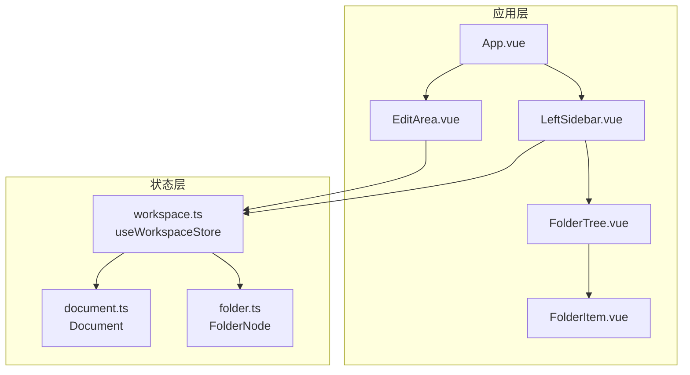
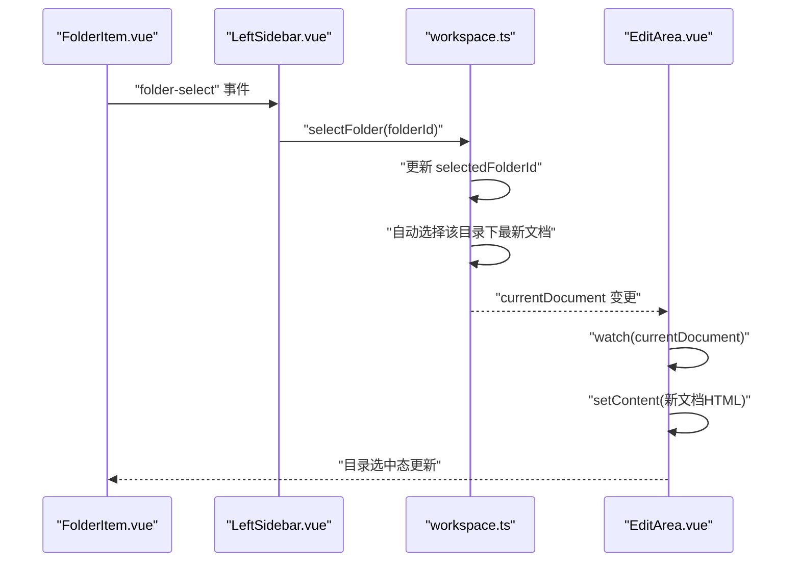
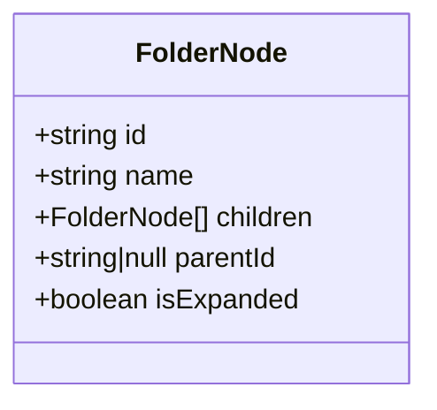
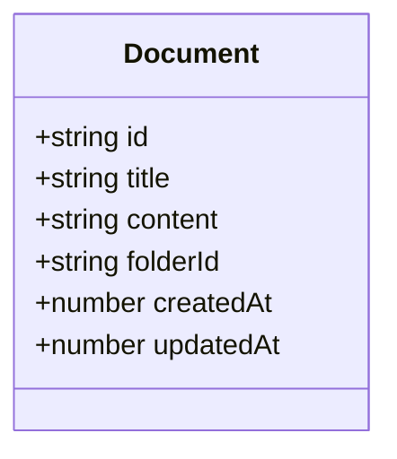
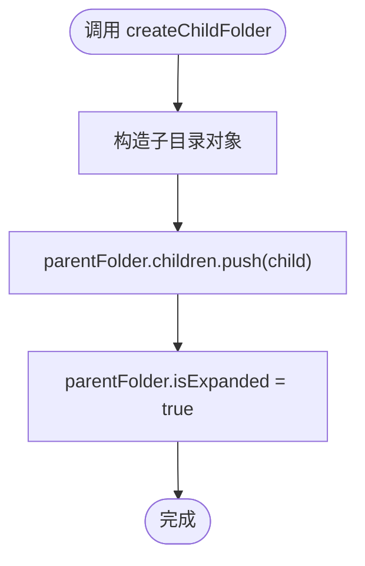
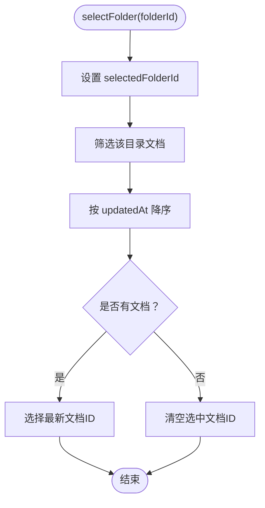
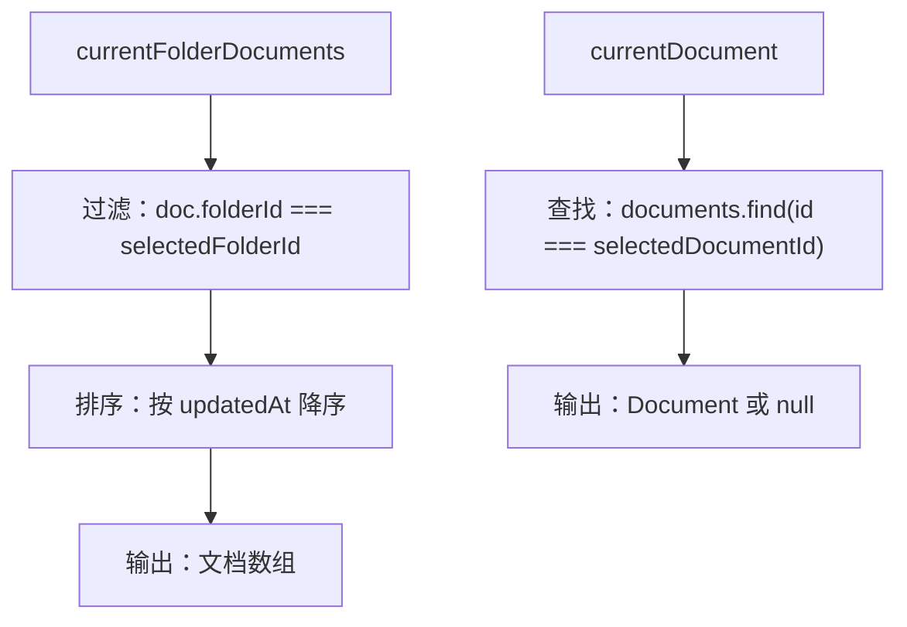
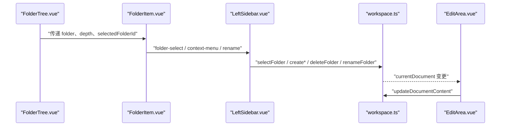
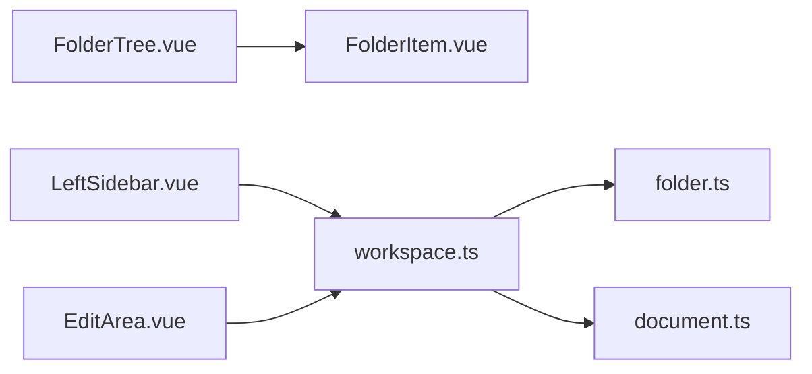

# 工作空间状态管理

<cite>
**本文档引用的文件**
- [workspace.ts](file://app/src/stores/workspace.ts)
- [folder.ts](file://app/src/types/folder.ts)
- [document.ts](file://app/src/types/document.ts)
- [FolderTree.vue](file://app/src/components/layout/FolderTree.vue)
- [FolderItem.vue](file://app/src/components/layout/FolderItem.vue)
- [LeftSidebar.vue](file://app/src/components/layout/LeftSidebar.vue)
- [EditArea.vue](file://app/src/components/layout/EditArea.vue)
- [App.vue](file://app/src/App.vue)
</cite>

## 目录
1. [简介](#简介)
2. [项目结构](#项目结构)
3. [核心组件](#核心组件)
4. [架构总览](#架构总览)
5. [详细组件分析](#详细组件分析)
6. [依赖关系分析](#依赖关系分析)
7. [性能考虑](#性能考虑)
8. [故障排除指南](#故障排除指南)
9. [结论](#结论)
10. [附录](#附录)

## 简介
本文件面向Woo项目的“工作空间状态管理”模块，系统性解析Pinia Store设计与实现，涵盖：
- 目录树数据结构（FolderNode）与文档数据模型（Document）
- 状态管理机制与计算属性（currentFolderDocuments、currentDocument）
- 目录操作API（创建根目录、同级/子级目录、删除目录、重命名、展开/折叠）
- 选中状态维护与自动选中文档逻辑
- 状态持久化策略建议、性能优化技巧与错误处理机制
- 实际使用示例与最佳实践

## 项目结构
工作空间状态管理位于前端应用层，采用Pinia进行状态集中管理，并通过Vue组件驱动UI交互。核心文件组织如下：
- 状态定义与业务逻辑：app/src/stores/workspace.ts
- 类型定义：app/src/types/folder.ts、app/src/types/document.ts
- UI组件：app/src/components/layout/LeftSidebar.vue、FolderTree.vue、FolderItem.vue、EditArea.vue
- 应用入口：app/src/App.vue

图表来源
- [App.vue:1-131](file://app/src/App.vue#L1-L131)
- [LeftSidebar.vue:1-204](file://app/src/components/layout/LeftSidebar.vue#L1-L204)
- [FolderTree.vue:1-49](file://app/src/components/layout/FolderTree.vue#L1-L49)
- [FolderItem.vue:1-195](file://app/src/components/layout/FolderItem.vue#L1-L195)
- [EditArea.vue:1-463](file://app/src/components/layout/EditArea.vue#L1-L463)
- [workspace.ts:1-321](file://app/src/stores/workspace.ts#L1-L321)
- [folder.ts:1-19](file://app/src/types/folder.ts#L1-L19)
- [document.ts:1-9](file://app/src/types/document.ts#L1-L9)

章节来源
- [App.vue:1-131](file://app/src/App.vue#L1-L131)
- [workspace.ts:1-321](file://app/src/stores/workspace.ts#L1-L321)

## 核心组件
- 状态容器：useWorkspaceStore（Pinia Store）
- 数据模型：
  - FolderNode：目录节点，包含id、name、children、parentId、isExpanded
  - Document：文档，包含id、title、content、folderId、createdAt、updatedAt
- 计算属性：
  - currentFolderDocuments：基于选中目录筛选并按更新时间排序的文档列表
  - currentDocument：当前选中文档
- 操作API：
  - 选中/切换：selectFolder、selectDocument、toggleFolder
  - 文档内容：updateDocumentContent
  - 目录操作：createRootFolder、createSiblingFolder、createChildFolder、deleteFolder、renameFolder
  - 辅助：getDocumentPreview

章节来源
- [workspace.ts:6-321](file://app/src/stores/workspace.ts#L6-L321)
- [folder.ts:1-19](file://app/src/types/folder.ts#L1-L19)
- [document.ts:1-9](file://app/src/types/document.ts#L1-L9)

## 架构总览
工作空间状态管理采用“单向数据流”模式：
- UI通过组件事件触发Store操作
- Store更新响应式状态（folders、documents、选中状态）
- 计算属性根据选中状态派生视图数据
- 编辑器监听currentDocument变化，双向同步内容

图表来源
- [FolderItem.vue:76-84](file://app/src/components/layout/FolderItem.vue#L76-L84)
- [LeftSidebar.vue:70-73](file://app/src/components/layout/LeftSidebar.vue#L70-L73)
- [workspace.ts:155-174](file://app/src/stores/workspace.ts#L155-L174)
- [EditArea.vue:151-164](file://app/src/components/layout/EditArea.vue#L151-L164)

## 详细组件分析

### 目录树数据结构（FolderNode）
- 结构字段：id、name、children（递归）、parentId、isExpanded
- 层级管理：通过parentId与children构建N叉树；支持递归渲染
- 展开/折叠：isExpanded控制子节点渲染与图标切换

图表来源
- [folder.ts:1-19](file://app/src/types/folder.ts#L1-L19)

章节来源
- [folder.ts:1-19](file://app/src/types/folder.ts#L1-L19)

### 文档数据模型（Document）
- 字段：id、title、content（HTML）、folderId、createdAt、updatedAt
- 用途：承载编辑器内容与元信息，支持按目录分组与排序

图表来源
- [document.ts:1-9](file://app/src/types/document.ts#L1-L9)

章节来源
- [document.ts:1-9](file://app/src/types/document.ts#L1-L9)

### 状态管理机制
- 响应式状态：
  - folders：目录树数组
  - documents：文档数组
  - selectedFolderId：当前选中目录ID
  - selectedDocumentId：当前选中文档ID
- 计算属性：
  - currentFolderDocuments：按updatedAt降序返回当前目录文档
  - currentDocument：返回当前选中文档或null
- 选中状态维护：
  - 选中目录时自动选择该目录下最新文档
  - 删除目录时若为当前选中则清空选中状态

章节来源
- [workspace.ts:9-151](file://app/src/stores/workspace.ts#L9-L151)
- [workspace.ts:155-174](file://app/src/stores/workspace.ts#L155-L174)
- [workspace.ts:237-253](file://app/src/stores/workspace.ts#L237-L253)

### 目录操作API
- 创建根级目录：createRootFolder
- 创建同级目录：createSiblingFolder
- 创建子目录：createChildFolder
- 删除目录：deleteFolder
- 重命名目录：renameFolder
- 切换展开/折叠：toggleFolder
- 选中目录/文档：selectFolder、selectDocument
- 更新文档内容：updateDocumentContent
- 预览文本：getDocumentPreview

图表来源
- [workspace.ts:224-235](file://app/src/stores/workspace.ts#L224-L235)

章节来源
- [workspace.ts:195-253](file://app/src/stores/workspace.ts#L195-L253)

### 选中状态与自动选择逻辑
- 选中目录：selectFolder
  - 更新selectedFolderId
  - 自动选择该目录下最新文档（按updatedAt降序）
  - 若无文档则清空选中
- 选中文档：selectDocument仅更新selectedDocumentId
- 删除目录：若删除的是当前选中目录，则同时清空选中

图表来源
- [workspace.ts:155-169](file://app/src/stores/workspace.ts#L155-L169)

章节来源
- [workspace.ts:155-169](file://app/src/stores/workspace.ts#L155-L169)
- [workspace.ts:248-252](file://app/src/stores/workspace.ts#L248-L252)

### 计算属性设计模式
- currentFolderDocuments
  - 输入：selectedFolderId
  - 过滤：documents中folderId匹配
  - 排序：updatedAt降序
  - 输出：文档数组
- currentDocument
  - 输入：selectedDocumentId
  - 查找：documents中id匹配
  - 输出：Document或null

图表来源
- [workspace.ts:139-151](file://app/src/stores/workspace.ts#L139-L151)

章节来源
- [workspace.ts:139-151](file://app/src/stores/workspace.ts#L139-L151)

### UI组件与Store交互
- LeftSidebar
  - 接收store.folders与selectedFolderId
  - 处理目录选中、右键菜单、重命名
  - 调用store的目录操作API
- FolderTree/FolderItem
  - 递归渲染目录树
  - 支持双击重命名、右键上下文菜单
  - 向父组件转发事件
- EditArea
  - 监听store.currentDocument变化
  - 使用防抖标记避免setContent触发onUpdate反向写回
  - 将编辑器HTML同步到store.updateDocumentContent

图表来源
- [FolderTree.vue:1-49](file://app/src/components/layout/FolderTree.vue#L1-L49)
- [FolderItem.vue:1-195](file://app/src/components/layout/FolderItem.vue#L1-L195)
- [LeftSidebar.vue:1-204](file://app/src/components/layout/LeftSidebar.vue#L1-L204)
- [workspace.ts:155-318](file://app/src/stores/workspace.ts#L155-L318)
- [EditArea.vue:110-164](file://app/src/components/layout/EditArea.vue#L110-L164)

章节来源
- [LeftSidebar.vue:69-132](file://app/src/components/layout/LeftSidebar.vue#L69-L132)
- [FolderTree.vue:16-44](file://app/src/components/layout/FolderTree.vue#L16-L44)
- [FolderItem.vue:66-121](file://app/src/components/layout/FolderItem.vue#L66-L121)
- [EditArea.vue:110-164](file://app/src/components/layout/EditArea.vue#L110-L164)

## 依赖关系分析
- 组件依赖Store：
  - LeftSidebar、EditArea直接导入并使用useWorkspaceStore
  - FolderTree、FolderItem通过props接收数据与事件
- Store依赖类型：
  - workspace.ts依赖folder.ts与document.ts定义
- 事件链路：
  - UI事件（点击/双击/右键）→ LeftSidebar处理 → 调用Store API → 更新响应式状态 → 计算属性派生视图 → EditArea监听并同步编辑器

图表来源
- [LeftSidebar.vue:51](file://app/src/components/layout/LeftSidebar.vue#L51)
- [EditArea.vue:39](file://app/src/components/layout/EditArea.vue#L39)
- [workspace.ts:3-4](file://app/src/stores/workspace.ts#L3-L4)
- [folder.ts:1-19](file://app/src/types/folder.ts#L1-L19)
- [document.ts:1-9](file://app/src/types/document.ts#L1-L9)

章节来源
- [LeftSidebar.vue:51](file://app/src/components/layout/LeftSidebar.vue#L51)
- [EditArea.vue:39](file://app/src/components/layout/EditArea.vue#L39)
- [workspace.ts:3-4](file://app/src/stores/workspace.ts#L3-L4)

## 性能考虑
- 计算属性缓存：
  - currentFolderDocuments与currentDocument基于响应式状态，Vue会自动缓存结果，减少重复计算
- 过滤与排序：
  - 文档过滤与排序在小规模数据下开销可忽略；若数据量增大，建议：
    - 对documents建立索引（如Map<folderId, Document[]>）
    - 在Store内部维护按folderId分组的映射，避免每次过滤
- 防抖写回：
  - EditArea通过isSettingContent防抖，避免setContent触发onUpdate反向写回，降低写入抖动
- 渲染优化：
  - FolderTree/FolderItem使用深度控制与条件渲染（仅在展开且有子节点时渲染）
  - 递归组件需注意大数据量时的渲染成本，必要时引入虚拟滚动或懒加载

章节来源
- [workspace.ts:139-151](file://app/src/stores/workspace.ts#L139-L151)
- [EditArea.vue:43-44](file://app/src/components/layout/EditArea.vue#L43-L44)
- [EditArea.vue:151-164](file://app/src/components/layout/EditArea.vue#L151-L164)
- [FolderTree.vue:25-37](file://app/src/components/layout/FolderTree.vue#L25-L37)
- [FolderItem.vue:25-37](file://app/src/components/layout/FolderItem.vue#L25-L37)

## 故障排除指南
- 选中目录后未自动选中文档
  - 检查selectFolder是否正确筛选并排序文档
  - 确认存在文档且updatedAt有效
- 删除目录后界面仍显示选中态
  - 确认deleteFolder是否清空selectedFolderId与selectedDocumentId
- 重命名无效
  - 确认FolderItem的重命名流程已将新名称传回LeftSidebar并调用renameFolder
- 编辑器内容不更新
  - 检查watch(currentDocument)是否触发setContent
  - 确保isSettingContent在设置内容期间为true，避免onUpdate写回
- 目录展开/折叠异常
  - 确认toggleFolder直接修改folder.isExpanded
  - 检查FolderTree/FolderItem的条件渲染逻辑

章节来源
- [workspace.ts:155-169](file://app/src/stores/workspace.ts#L155-L169)
- [workspace.ts:237-253](file://app/src/stores/workspace.ts#L237-L253)
- [LeftSidebar.vue:129-132](file://app/src/components/layout/LeftSidebar.vue#L129-L132)
- [EditArea.vue:151-164](file://app/src/components/layout/EditArea.vue#L151-L164)
- [FolderItem.vue:82-109](file://app/src/components/layout/FolderItem.vue#L82-L109)

## 结论
本工作空间状态管理以Pinia为核心，结合Vue响应式系统与计算属性，实现了目录树与文档的高效管理。通过清晰的事件链路与防抖写回机制，保证了UI与状态的一致性与性能。建议在后续迭代中引入索引与虚拟化渲染，进一步提升大规模数据场景下的体验。

## 附录

### 目录操作API速查
- 创建根级目录：createRootFolder()
- 创建同级目录：createSiblingFolder(targetFolder)
- 创建子目录：createChildFolder(parentFolder)
- 删除目录：deleteFolder(folder)
- 重命名目录：renameFolder(folder, newName)
- 切换展开/折叠：toggleFolder(folder)
- 选中目录：selectFolder(folderId)
- 选中文档：selectDocument(documentId)
- 更新文档内容：updateDocumentContent(documentId, content)
- 预览文本：getDocumentPreview(document)

章节来源
- [workspace.ts:195-318](file://app/src/stores/workspace.ts#L195-L318)

### 最佳实践
- 使用计算属性派生视图，避免在模板中重复过滤/排序
- 在Store中统一处理业务逻辑，组件仅负责事件转发与渲染
- 对于大文档内容，考虑分片存储或懒加载策略
- 为目录与文档建立唯一索引，提高查询效率
- 使用防抖与节流控制高频事件（如实时搜索、滚动）