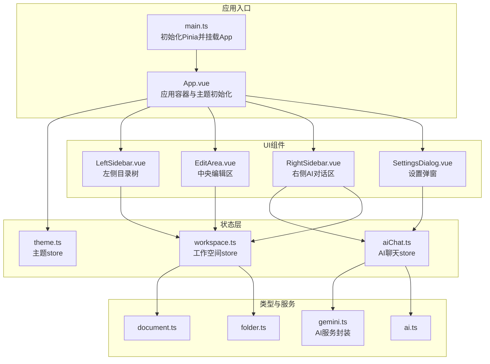
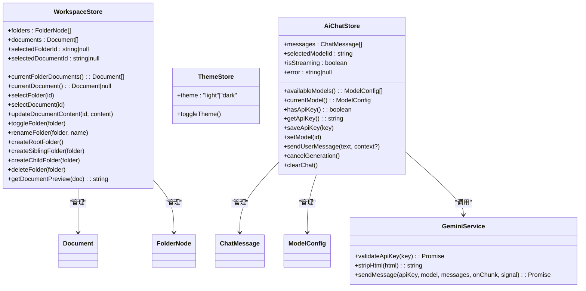
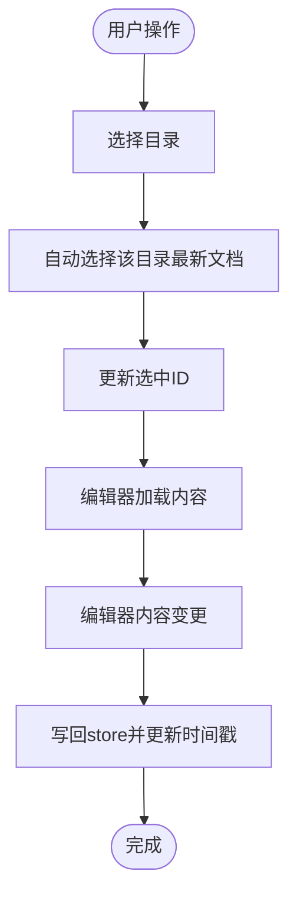
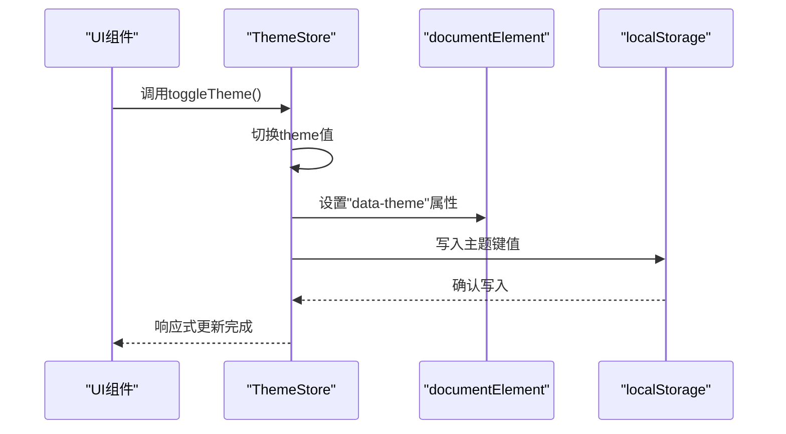
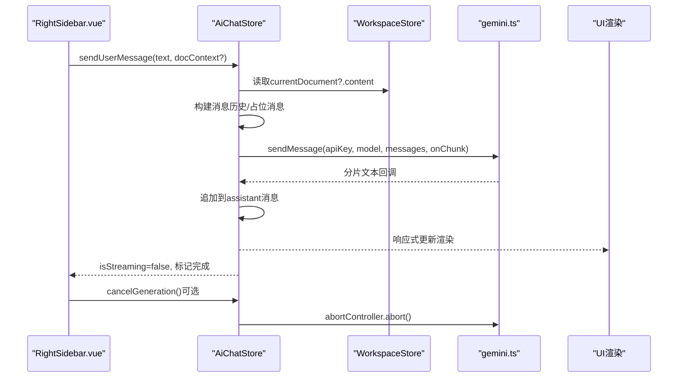
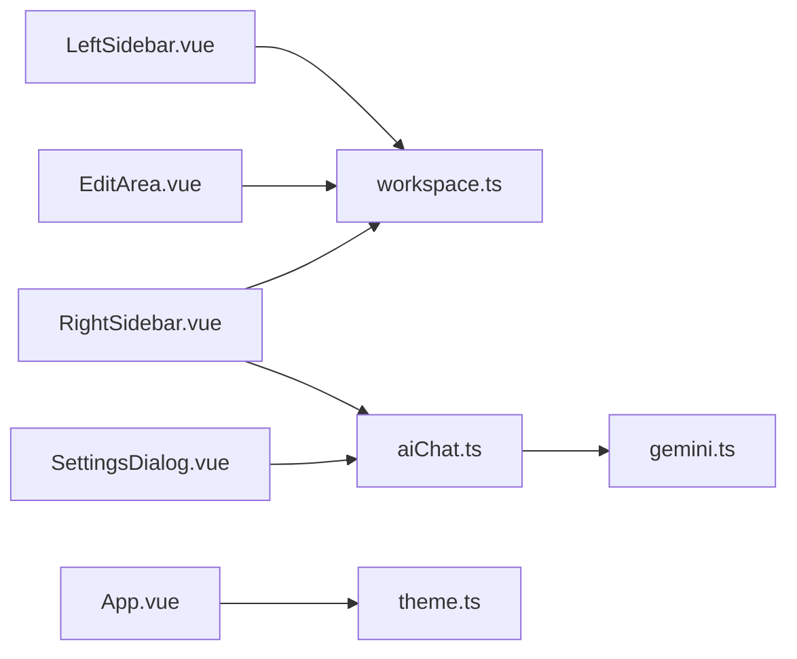

# 状态管理系统

<cite>
**本文引用的文件**
- [workspace.ts](file://app/src/stores/workspace.ts)
- [theme.ts](file://app/src/stores/theme.ts)
- [aiChat.ts](file://app/src/stores/aiChat.ts)
- [document.ts](file://app/src/types/document.ts)
- [folder.ts](file://app/src/types/folder.ts)
- [ai.ts](file://app/src/types/ai.ts)
- [gemini.ts](file://app/src/services/gemini.ts)
- [main.ts](file://app/src/main.ts)
- [App.vue](file://app/src/App.vue)
- [LeftSidebar.vue](file://app/src/components/layout/LeftSidebar.vue)
- [RightSidebar.vue](file://app/src/components/layout/RightSidebar.vue)
- [EditArea.vue](file://app/src/components/layout/EditArea.vue)
- [SettingsDialog.vue](file://app/src/components/layout/SettingsDialog.vue)
</cite>

## 目录
1. [简介](#简介)
2. [项目结构](#项目结构)
3. [核心组件](#核心组件)
4. [架构总览](#架构总览)
5. [详细组件分析](#详细组件分析)
6. [依赖关系分析](#依赖关系分析)
7. [性能考量](#性能考量)
8. [故障排查指南](#故障排查指南)
9. [结论](#结论)
10. [附录](#附录)

## 简介
本文件面向Woo前端状态管理系统，系统性阐述基于Pinia的状态管理架构与实现细节，覆盖三个核心store：工作空间（workspace）、主题（theme）、AI聊天（aiChat）。文档从store设计模式、状态结构、数据流、响应式更新机制、异步action处理、getter计算属性、持久化策略、跨组件共享与调试技巧等方面进行深入分析，并给出最佳实践与性能优化建议，帮助开发者高效理解与维护状态层。

## 项目结构
Woo采用Pinia作为状态管理库，store位于app/src/stores目录，类型定义位于app/src/types，服务层封装在app/src/services，UI组件位于app/src/components/layout。应用入口在app/src/main.ts中初始化Pinia并挂载根组件。

图表来源
- [main.ts:1-8](file://app/src/main.ts#L1-L8)
- [App.vue:1-131](file://app/src/App.vue#L1-L131)
- [workspace.ts:1-321](file://app/src/stores/workspace.ts#L1-L321)
- [theme.ts:1-31](file://app/src/stores/theme.ts#L1-L31)
- [aiChat.ts:1-199](file://app/src/stores/aiChat.ts#L1-L199)
- [gemini.ts:1-103](file://app/src/services/gemini.ts#L1-L103)
- [LeftSidebar.vue:1-204](file://app/src/components/layout/LeftSidebar.vue#L1-L204)
- [RightSidebar.vue:1-432](file://app/src/components/layout/RightSidebar.vue#L1-L432)
- [EditArea.vue:1-463](file://app/src/components/layout/EditArea.vue#L1-L463)
- [SettingsDialog.vue:1-287](file://app/src/components/layout/SettingsDialog.vue#L1-L287)

章节来源
- [main.ts:1-8](file://app/src/main.ts#L1-L8)
- [App.vue:1-131](file://app/src/App.vue#L1-L131)

## 核心组件
本节概述三个核心store的设计目标与职责边界：
- workspace：负责文档与目录树的本地状态管理，提供选中状态、文档列表与内容更新能力，支撑编辑器与目录树交互。
- theme：负责主题模式的切换与持久化，通过DOM属性与localStorage实现跨会话保持。
- aiChat：负责AI对话的会话状态、模型选择、API Key管理与流式响应处理，连接外部Gemini服务。

章节来源
- [workspace.ts:1-321](file://app/src/stores/workspace.ts#L1-L321)
- [theme.ts:1-31](file://app/src/stores/theme.ts#L1-L31)
- [aiChat.ts:1-199](file://app/src/stores/aiChat.ts#L1-L199)

## 架构总览
Pinia采用组合式API风格定义store，以ref/readonly/ref作为状态源，computed作为派生状态，函数作为action。三个store分别服务于不同业务域，彼此通过组件通信共享状态，避免直接耦合。

图表来源
- [workspace.ts:1-321](file://app/src/stores/workspace.ts#L1-L321)
- [theme.ts:1-31](file://app/src/stores/theme.ts#L1-L31)
- [aiChat.ts:1-199](file://app/src/stores/aiChat.ts#L1-L199)
- [gemini.ts:1-103](file://app/src/services/gemini.ts#L1-L103)
- [document.ts:1-9](file://app/src/types/document.ts#L1-L9)
- [folder.ts:1-19](file://app/src/types/folder.ts#L1-L19)
- [ai.ts:1-20](file://app/src/types/ai.ts#L1-L20)

## 详细组件分析

### 工作空间store（workspace）
- 设计模式：组合式store（defineStore返回函数形式），内部使用ref/readonly/computed/stateless action，便于在单文件中集中管理状态与逻辑。
- 状态结构：
  - 目录树：FolderNode数组，支持父子关系与展开状态。
  - 文档集合：Document数组，包含HTML内容与时间戳。
  - 选中状态：当前选中目录与当前选中文档的ID。
- 数据流：
  - 选中目录时自动选择该目录下最新文档；选中文档时更新编辑器内容。
  - 编辑器内容变更通过onUpdate回调写回store，防抖避免反向写回。
- 计算属性：
  - currentFolderDocuments：按更新时间倒序筛选当前目录文档。
  - currentDocument：根据选中ID查找当前文档。
- 异步与副作用：
  - 无异步副作用，所有操作为本地状态变更。
- 持久化：
  - 本地内存状态，未实现持久化；可扩展为localStorage或IndexedDB。
- 典型使用场景：
  - 目录树右键菜单创建/删除/重命名目录。
  - 编辑器内容变更同步至文档集合。
  - 右侧AI区域在首次消息时注入当前文档上下文。

图表来源
- [workspace.ts:155-183](file://app/src/stores/workspace.ts#L155-L183)
- [EditArea.vue:110-116](file://app/src/components/layout/EditArea.vue#L110-L116)

章节来源
- [workspace.ts:1-321](file://app/src/stores/workspace.ts#L1-L321)
- [document.ts:1-9](file://app/src/types/document.ts#L1-L9)
- [folder.ts:1-19](file://app/src/types/folder.ts#L1-L19)
- [LeftSidebar.vue:69-132](file://app/src/components/layout/LeftSidebar.vue#L69-L132)
- [EditArea.vue:151-164](file://app/src/components/layout/EditArea.vue#L151-L164)

### 主题store（theme）
- 设计模式：组合式store，使用ref与watch实现响应式主题切换与持久化。
- 状态结构：仅包含当前主题模式（light/dark）。
- 数据流：
  - 读取localStorage恢复主题；watch监听主题变化，同步到<html>元素的data-theme属性并持久化。
- 计算属性：无。
- 异步与副作用：watch同步DOM与存储，无网络请求。
- 持久化：localStorage键值对，保证刷新后主题一致。
- 典型使用场景：顶部菜单切换主题；应用启动时初始化主题。

图表来源
- [theme.ts:16-24](file://app/src/stores/theme.ts#L16-L24)
- [App.vue:48-49](file://app/src/App.vue#L48-L49)

章节来源
- [theme.ts:1-31](file://app/src/stores/theme.ts#L1-L31)
- [App.vue:1-131](file://app/src/App.vue#L1-L131)

### AI聊天store（aiChat）
- 设计模式：组合式store，包含状态、计算属性与异步action。
- 状态结构：
  - messages：对话消息数组（含占位消息与流式标记）。
  - selectedModelId：当前模型ID（支持“自动”模式）。
  - isStreaming：流式生成状态。
  - error：错误信息。
  - abortController：用于取消请求。
- 计算属性：
  - availableModels：可用模型列表。
  - currentModel：根据selectedModelId解析当前模型。
  - hasApiKey：基于localStorage解析API Key存在性。
- 异步与副作用：
  - sendUserMessage：构建消息历史，调用gemini.sendMessage进行流式生成，分片回调追加到assistant消息。
  - 支持取消生成（AbortController）与错误处理（区分主动取消与异常）。
  - API Key管理：读取/保存到localStorage，版本号触发hasApiKey更新。
- 数据流：
  - 右侧AI区域收集输入，读取当前文档上下文注入首次消息；发送后实时渲染流式内容。
- 持久化：
  - API Key与模型选择持久化于localStorage。
- 典型使用场景：设置弹窗配置API Key；右侧AI区域发起对话；停止生成；清空会话。

图表来源
- [aiChat.ts:73-169](file://app/src/stores/aiChat.ts#L73-L169)
- [gemini.ts:29-102](file://app/src/services/gemini.ts#L29-L102)
- [RightSidebar.vue:120-129](file://app/src/components/layout/RightSidebar.vue#L120-L129)
- [workspace.ts:148-151](file://app/src/stores/workspace.ts#L148-L151)

章节来源
- [aiChat.ts:1-199](file://app/src/stores/aiChat.ts#L1-L199)
- [gemini.ts:1-103](file://app/src/services/gemini.ts#L1-L103)
- [RightSidebar.vue:1-432](file://app/src/components/layout/RightSidebar.vue#L1-L432)
- [SettingsDialog.vue:1-287](file://app/src/components/layout/SettingsDialog.vue#L1-L287)

## 依赖关系分析
- store之间无直接依赖，通过组件消费各自store实现跨组件状态共享。
- aiChat依赖gemini服务进行外部API调用，依赖workspace在首次消息时注入文档上下文。
- theme依赖浏览器环境的localStorage与DOM属性，无外部依赖。
- 类型定义统一于types目录，确保store与组件之间的契约清晰。

图表来源
- [LeftSidebar.vue:51-132](file://app/src/components/layout/LeftSidebar.vue#L51-L132)
- [EditArea.vue:39-164](file://app/src/components/layout/EditArea.vue#L39-L164)
- [RightSidebar.vue:89-184](file://app/src/components/layout/RightSidebar.vue#L89-L184)
- [SettingsDialog.vue:53-102](file://app/src/components/layout/SettingsDialog.vue#L53-L102)
- [workspace.ts:1-321](file://app/src/stores/workspace.ts#L1-L321)
- [aiChat.ts:1-199](file://app/src/stores/aiChat.ts#L1-L199)
- [gemini.ts:1-103](file://app/src/services/gemini.ts#L1-L103)
- [App.vue:46-49](file://app/src/App.vue#L46-L49)
- [theme.ts:1-31](file://app/src/stores/theme.ts#L1-L31)

章节来源
- [LeftSidebar.vue:1-204](file://app/src/components/layout/LeftSidebar.vue#L1-L204)
- [EditArea.vue:1-463](file://app/src/components/layout/EditArea.vue#L1-L463)
- [RightSidebar.vue:1-432](file://app/src/components/layout/RightSidebar.vue#L1-L432)
- [SettingsDialog.vue:1-287](file://app/src/components/layout/SettingsDialog.vue#L1-L287)
- [workspace.ts:1-321](file://app/src/stores/workspace.ts#L1-L321)
- [aiChat.ts:1-199](file://app/src/stores/aiChat.ts#L1-L199)
- [gemini.ts:1-103](file://app/src/services/gemini.ts#L1-L103)
- [App.vue:1-131](file://app/src/App.vue#L1-L131)
- [theme.ts:1-31](file://app/src/stores/theme.ts#L1-L31)

## 性能考量
- 响应式粒度控制
  - workspace的currentFolderDocuments与currentDocument为轻量计算属性，依赖少量过滤与排序，复杂度可控。
  - aiChat的流式渲染通过分片回调增量更新，避免一次性大对象渲染。
- 防抖与双向绑定
  - EditArea在编辑器onUpdate中设置isSettingContent防抖，避免setContent触发onUpdate导致的反向写回。
- DOM与存储同步
  - theme使用watch同步data-theme与localStorage，避免重复写入；immediate确保启动即同步。
- 模型选择与API Key
  - aiChat通过版本号触发hasApiKey更新，避免不必要的重渲染。
- 优化建议
  - 对大型目录树可考虑虚拟滚动与懒加载children。
  - 对大量文档列表可引入分页或索引字段减少排序成本。
  - 对流式响应可增加节流/去抖策略，平衡流畅度与资源占用。
  - 将workspace与aiChat的部分状态持久化到localStorage，提升用户体验一致性。

[本节为通用性能指导，无需特定文件来源]

## 故障排查指南
- API Key无效或过期
  - 现象：发送消息时报错，assistant消息为空。
  - 排查：检查设置弹窗中的API Key有效性；确认网络请求状态码（401/403）。
  - 处理：重新配置API Key并保存。
- 请求过于频繁
  - 现象：429错误提示。
  - 排查：降低请求频率或等待冷却。
- 主动取消生成
  - 现象：点击停止按钮后无报错但消息未追加。
  - 排查：确认AbortController是否正确abort。
- 编辑器内容未更新
  - 现象：修改后未写回store。
  - 排查：确认isSettingContent防抖逻辑未阻止onUpdate写回。
- 主题切换不生效
  - 现象：切换主题后页面未变色。
  - 排查：确认data-theme属性已设置且localStorage写入成功。

章节来源
- [gemini.ts:57-65](file://app/src/services/gemini.ts#L57-L65)
- [aiChat.ts:148-168](file://app/src/stores/aiChat.ts#L148-L168)
- [EditArea.vue:110-116](file://app/src/components/layout/EditArea.vue#L110-L116)
- [theme.ts:21-24](file://app/src/stores/theme.ts#L21-L24)
- [SettingsDialog.vue:78-94](file://app/src/components/layout/SettingsDialog.vue#L78-L94)

## 结论
Woo的状态管理以Pinia为核心，采用组合式store将状态、计算属性与action集中管理，配合类型系统与服务封装，实现了清晰的职责划分与良好的可维护性。workspace提供文档与目录的本地状态管理，theme实现主题的持久化与DOM同步，aiChat完成AI对话的会话与流式渲染。通过组件消费store的方式实现跨组件共享，遵循单一事实来源原则。建议后续在workspace与aiChat层面引入持久化策略，并对大规模数据场景进行性能优化。

[本节为总结性内容，无需特定文件来源]

## 附录
- 最佳实践
  - 使用组合式store集中管理状态与逻辑，避免在组件中分散状态。
  - 为复杂计算属性添加缓存与最小化依赖，避免昂贵的重复计算。
  - 在action中统一处理异步流程与错误，提供明确的错误标识与清理逻辑。
  - 对需要跨会话保持的状态使用localStorage或IndexedDB持久化。
  - 通过类型定义约束store接口，确保组件与store契约清晰。
- 调试技巧
  - 使用Vue DevTools观察store状态与action调用轨迹。
  - 在watch中输出关键状态变化，定位异常更新路径。
  - 对流式响应使用分片回调逐步打印，定位首包/断流问题。
  - 对主题切换使用浏览器开发者工具检查data-theme属性与CSS变量。

[本节为通用指导，无需特定文件来源]