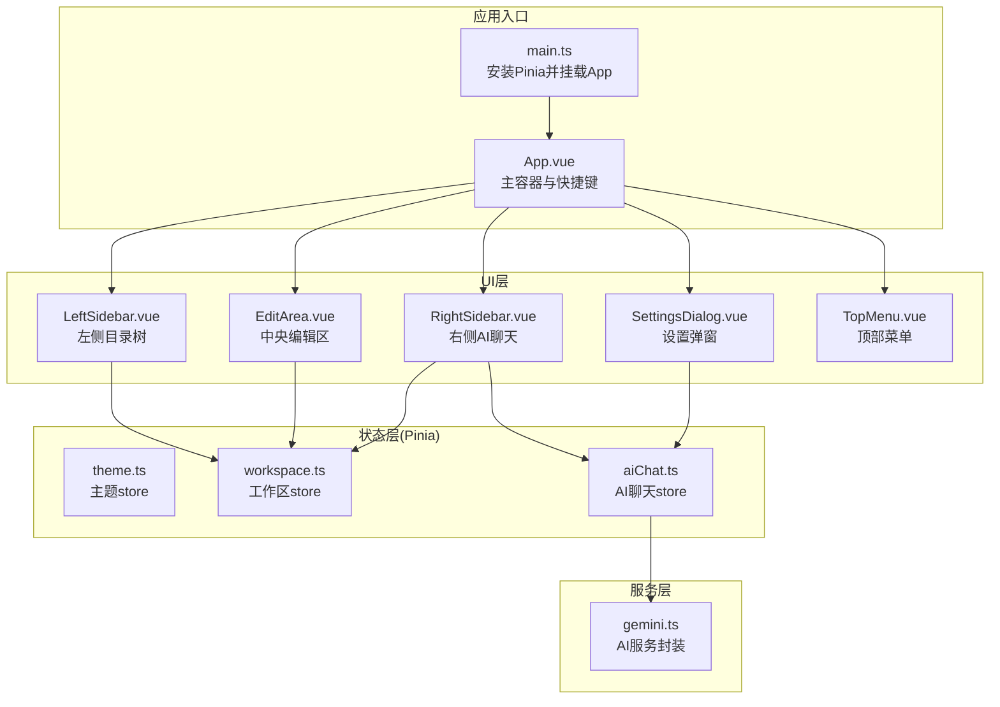
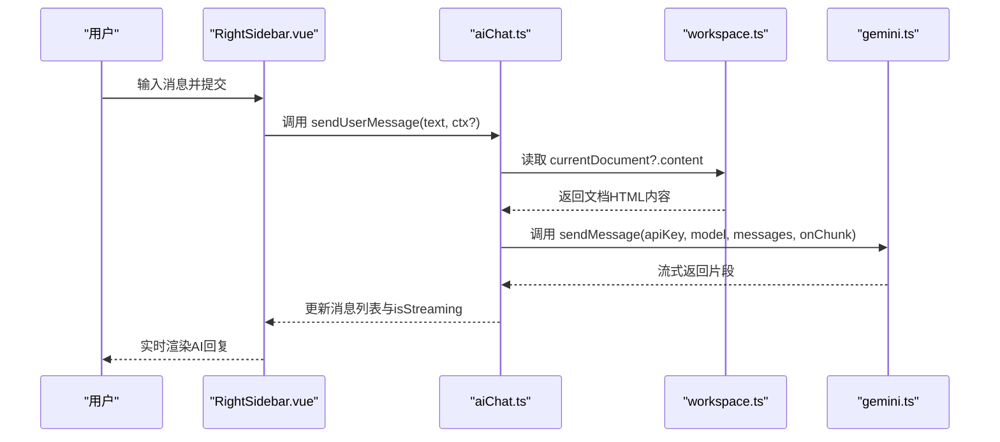
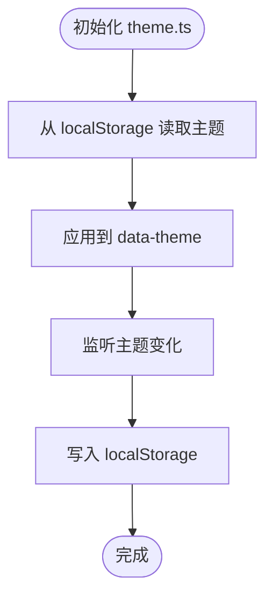
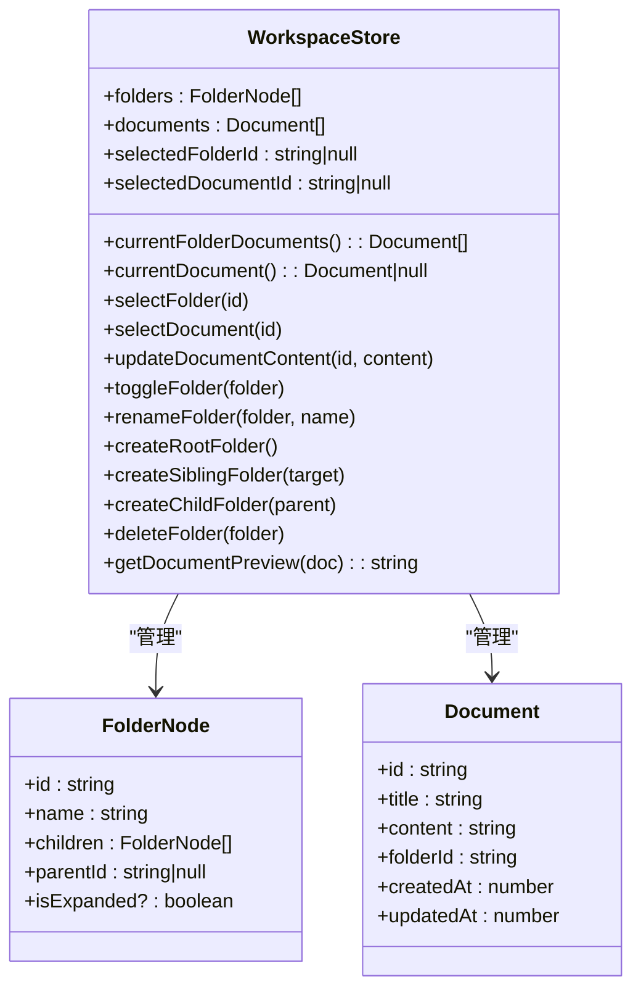
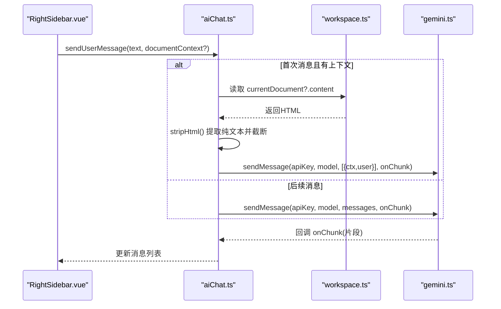
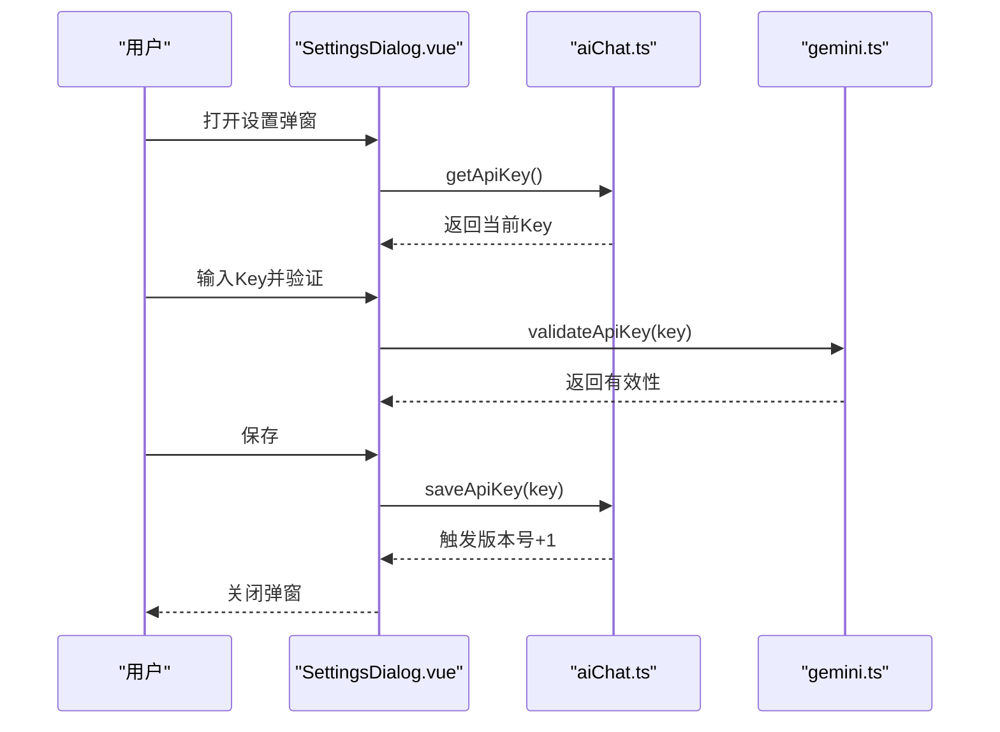
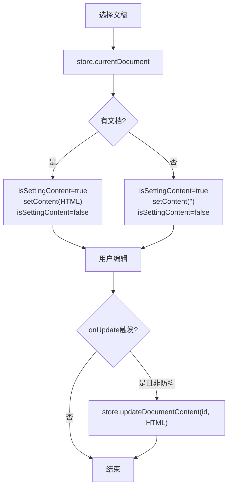
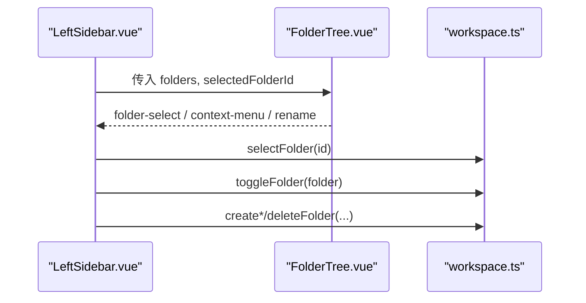
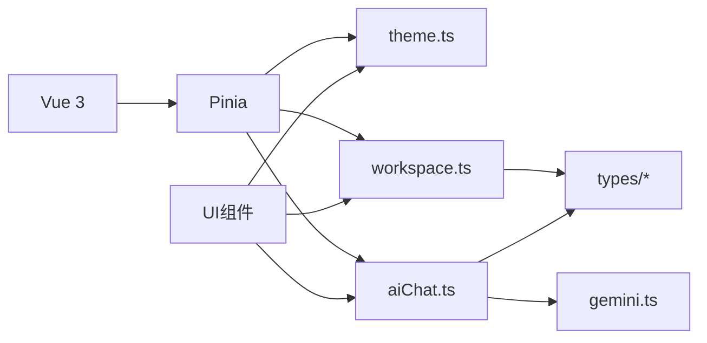

# 状态管理集成与最佳实践

<cite>
**本文档引用的文件**
- [main.ts](file://app/src/main.ts)
- [App.vue](file://app/src/App.vue)
- [theme.ts](file://app/src/stores/theme.ts)
- [workspace.ts](file://app/src/stores/workspace.ts)
- [aiChat.ts](file://app/src/stores/aiChat.ts)
- [gemini.ts](file://app/src/services/gemini.ts)
- [ai.ts](file://app/src/types/ai.ts)
- [document.ts](file://app/src/types/document.ts)
- [folder.ts](file://app/src/types/folder.ts)
- [LeftSidebar.vue](file://app/src/components/layout/LeftSidebar.vue)
- [RightSidebar.vue](file://app/src/components/layout/RightSidebar.vue)
- [EditArea.vue](file://app/src/components/layout/EditArea.vue)
- [SettingsDialog.vue](file://app/src/components/layout/SettingsDialog.vue)
- [TopMenu.vue](file://app/src/components/layout/TopMenu.vue)
- [FolderTree.vue](file://app/src/components/layout/FolderTree.vue)
- [package.json](file://app/package.json)
</cite>

## 目录
1. [简介](#简介)
2. [项目结构](#项目结构)
3. [核心组件](#核心组件)
4. [架构总览](#架构总览)
5. [详细组件分析](#详细组件分析)
6. [依赖关系分析](#依赖关系分析)
7. [性能考量](#性能考量)
8. [故障排查指南](#故障排查指南)
9. [结论](#结论)
10. [附录](#附录)

## 简介
本文件面向Woo应用的状态管理集成架构，系统性阐述多store协作机制、状态传递与事件通信模式；详解store初始化流程、全局状态访问方式与跨组件共享策略；总结状态设计模式、拆分原则与性能优化技巧；提供调试方法、开发工具使用与常见问题解决方案；并给出扩展性设计、测试策略与维护指南，辅以真实场景的应用示例与可视化图示。

## 项目结构
Woo采用基于Vue 3 + Pinia的前端架构，状态集中在app/src/stores目录，UI组件位于app/src/components/layout与app/src/components/ui等目录，服务层封装外部API调用（如AI服务）。应用入口通过main.ts安装Pinia并挂载根组件App.vue，后者协调多个布局组件与侧边栏、编辑区、AI聊天区等。

图表来源
- [main.ts:1-8](file://app/src/main.ts#L1-L8)
- [App.vue:1-131](file://app/src/App.vue#L1-L131)
- [theme.ts:1-31](file://app/src/stores/theme.ts#L1-L31)
- [workspace.ts:1-321](file://app/src/stores/workspace.ts#L1-L321)
- [aiChat.ts:1-199](file://app/src/stores/aiChat.ts#L1-L199)
- [gemini.ts:1-103](file://app/src/services/gemini.ts#L1-L103)
- [LeftSidebar.vue:1-204](file://app/src/components/layout/LeftSidebar.vue#L1-L204)
- [RightSidebar.vue:1-432](file://app/src/components/layout/RightSidebar.vue#L1-L432)
- [EditArea.vue:1-463](file://app/src/components/layout/EditArea.vue#L1-L463)
- [SettingsDialog.vue:1-287](file://app/src/components/layout/SettingsDialog.vue#L1-L287)
- [TopMenu.vue:1-262](file://app/src/components/layout/TopMenu.vue#L1-L262)

章节来源
- [main.ts:1-8](file://app/src/main.ts#L1-L8)
- [App.vue:1-131](file://app/src/App.vue#L1-L131)

## 核心组件
- 主题store（theme.ts）：负责主题模式持久化与DOM同步，提供切换主题能力。
- 工作区store（workspace.ts）：管理目录树、文档集合、当前选中项及计算属性，提供目录/文档操作API。
- AI聊天store（aiChat.ts）：管理聊天消息、模型选择、流式生成、错误处理与API Key存储。
- 服务层（gemini.ts）：封装AI接口调用、流式读取与错误映射。
- UI组件：左侧目录树（LeftSidebar.vue）、中央编辑区（EditArea.vue）、右侧AI聊天（RightSidebar.vue）、设置弹窗（SettingsDialog.vue）、顶部菜单（TopMenu.vue）等。

章节来源
- [theme.ts:1-31](file://app/src/stores/theme.ts#L1-L31)
- [workspace.ts:1-321](file://app/src/stores/workspace.ts#L1-L321)
- [aiChat.ts:1-199](file://app/src/stores/aiChat.ts#L1-L199)
- [gemini.ts:1-103](file://app/src/services/gemini.ts#L1-L103)

## 架构总览
Woo的状态管理采用Pinia函数式store设计，遵循“单一职责”和“按领域拆分”的原则。store之间通过直接导入与调用实现协作：AI聊天store依赖工作区store提供的当前文档内容作为上下文；设置弹窗通过AI聊天store存取API Key；编辑区通过工作区store同步内容变更；主题store独立运行并影响全局DOM属性。

图表来源
- [RightSidebar.vue:120-129](file://app/src/components/layout/RightSidebar.vue#L120-L129)
- [aiChat.ts:73-169](file://app/src/stores/aiChat.ts#L73-L169)
- [workspace.ts:148-151](file://app/src/stores/workspace.ts#L148-L151)
- [gemini.ts:29-102](file://app/src/services/gemini.ts#L29-L102)

## 详细组件分析

### 主题store（theme.ts）
- 设计要点
  - 使用localStorage持久化主题模式，并在初始化时立即应用到<html>元素的data-theme属性。
  - 通过watch响应式监听主题变化，自动同步DOM与本地存储。
- 状态与行为
  - 状态：当前主题模式（light/dark）。
  - 行为：切换主题、应用主题到DOM、持久化主题。
- 最佳实践
  - 将主题切换作为独立store，避免与业务store耦合。
  - 在应用入口尽早初始化，确保首屏即具备正确的主题属性。

图表来源
- [theme.ts:8-24](file://app/src/stores/theme.ts#L8-L24)

章节来源
- [theme.ts:1-31](file://app/src/stores/theme.ts#L1-L31)
- [App.vue:48-49](file://app/src/App.vue#L48-L49)

### 工作区store（workspace.ts）
- 设计要点
  - 以领域驱动拆分：目录树、文档集合、当前选中项。
  - 计算属性：根据选中目录过滤文档、根据选中ID定位当前文档。
  - 操作API：目录增删改、文档内容更新、自动选中逻辑。
- 状态与行为
  - 状态：folders、documents、selectedFolderId、selectedDocumentId。
  - 行为：selectFolder、selectDocument、updateDocumentContent、目录树操作、预览文本生成。
- 性能与复杂度
  - 目录树遍历与插入/删除采用递归辅助函数，时间复杂度与树高相关；文档筛选为O(n)。
  - 计算属性按需缓存，减少重复计算。

图表来源
- [workspace.ts:6-320](file://app/src/stores/workspace.ts#L6-L320)
- [folder.ts:1-19](file://app/src/types/folder.ts#L1-L19)
- [document.ts:1-9](file://app/src/types/document.ts#L1-L9)

章节来源
- [workspace.ts:1-321](file://app/src/stores/workspace.ts#L1-L321)
- [folder.ts:1-19](file://app/src/types/folder.ts#L1-L19)
- [document.ts:1-9](file://app/src/types/document.ts#L1-L9)

### AI聊天store（aiChat.ts）
- 设计要点
  - 状态：消息列表、当前模型、流式状态、错误信息、AbortController。
  - 计算属性：可用模型列表、当前模型、API Key存在性。
  - API Key管理：本地存储、版本号触发响应式更新。
  - 流式生成：基于fetch SSE，逐片回调更新消息内容。
- 状态传递与事件通信
  - 通过store实例方法直接调用，无需事件总线。
  - 与工作区store协作：在首次消息时注入文档上下文。
- 错误处理
  - 对AbortError进行特殊处理；对HTTP错误映射为用户可读提示。

图表来源
- [RightSidebar.vue:120-129](file://app/src/components/layout/RightSidebar.vue#L120-L129)
- [aiChat.ts:73-169](file://app/src/stores/aiChat.ts#L73-L169)
- [workspace.ts:148-151](file://app/src/stores/workspace.ts#L148-L151)
- [gemini.ts:29-102](file://app/src/services/gemini.ts#L29-L102)

章节来源
- [aiChat.ts:1-199](file://app/src/stores/aiChat.ts#L1-L199)
- [ai.ts:1-20](file://app/src/types/ai.ts#L1-L20)

### 设置弹窗与API Key管理（SettingsDialog.vue）
- 设计要点
  - 通过watch监听visible，打开时读取store中的API Key。
  - 支持在线验证API Key有效性，再保存至store。
- 与AI聊天store协作
  - 保存成功后，store内部通过版本号触发hasApiKey响应式更新，UI即时生效。

图表来源
- [SettingsDialog.vue:70-94](file://app/src/components/layout/SettingsDialog.vue#L70-L94)
- [aiChat.ts:39-59](file://app/src/stores/aiChat.ts#L39-L59)
- [gemini.ts:8-15](file://app/src/services/gemini.ts#L8-L15)

章节来源
- [SettingsDialog.vue:1-287](file://app/src/components/layout/SettingsDialog.vue#L1-L287)
- [aiChat.ts:1-199](file://app/src/stores/aiChat.ts#L1-L199)
- [gemini.ts:1-103](file://app/src/services/gemini.ts#L1-L103)

### 编辑区与工作区协作（EditArea.vue）
- 设计要点
  - 使用Tiptap编辑器，双向绑定store中的HTML内容。
  - 通过防抖标记避免setContent触发onUpdate反向写回。
  - 监听store.currentDocument变化，动态加载/清空内容。
- 性能优化
  - 防抖标记isSettingContent避免循环更新。
  - 仅在必要时setContent，减少编辑器重绘。

图表来源
- [EditArea.vue:43-116](file://app/src/components/layout/EditArea.vue#L43-L116)
- [workspace.ts:177-183](file://app/src/stores/workspace.ts#L177-L183)

章节来源
- [EditArea.vue:1-463](file://app/src/components/layout/EditArea.vue#L1-L463)
- [workspace.ts:1-321](file://app/src/stores/workspace.ts#L1-L321)

### 侧边栏与目录树（LeftSidebar.vue、FolderTree.vue）
- 设计要点
  - 左侧目录树通过props接收folders与选中ID，事件向上冒泡。
  - 通过store.selectFolder与store.toggleFolder实现选中与展开/折叠。
  - 右键菜单支持根级/同级/子级目录创建与删除。
- 事件通信
  - FolderTree.vue仅转发事件，不持有状态，保持低耦合。

图表来源
- [LeftSidebar.vue:69-132](file://app/src/components/layout/LeftSidebar.vue#L69-L132)
- [FolderTree.vue:34-44](file://app/src/components/layout/FolderTree.vue#L34-L44)
- [workspace.ts:155-253](file://app/src/stores/workspace.ts#L155-L253)

章节来源
- [LeftSidebar.vue:1-204](file://app/src/components/layout/LeftSidebar.vue#L1-L204)
- [FolderTree.vue:1-49](file://app/src/components/layout/FolderTree.vue#L1-L49)
- [workspace.ts:1-321](file://app/src/stores/workspace.ts#L1-L321)

### 顶部菜单与窗口控制（TopMenu.vue）
- 设计要点
  - 集成菜单配置与Dropdown组件，统一处理菜单项动作。
  - 通过emit事件与App.vue交互，实现侧边栏开关、设置弹窗、登录弹窗等。
  - 集成主题切换按钮，直接调用theme.ts的toggleTheme。

章节来源
- [TopMenu.vue:1-262](file://app/src/components/layout/TopMenu.vue#L1-L262)
- [theme.ts:16-18](file://app/src/stores/theme.ts#L16-L18)

## 依赖关系分析
- 应用入口依赖Pinia与Vue，Pinia在main.ts中全局安装。
- UI组件通过组合式API使用各store实例，形成“组件-Store”单向数据流。
- 服务层（gemini.ts）被AI聊天store调用，封装网络细节。
- 类型定义（types/*）为store与组件提供强类型约束。

图表来源
- [main.ts:1-8](file://app/src/main.ts#L1-L8)
- [package.json:13-26](file://app/package.json#L13-L26)
- [theme.ts:1-31](file://app/src/stores/theme.ts#L1-L31)
- [workspace.ts:1-321](file://app/src/stores/workspace.ts#L1-L321)
- [aiChat.ts:1-199](file://app/src/stores/aiChat.ts#L1-L199)
- [gemini.ts:1-103](file://app/src/services/gemini.ts#L1-L103)

章节来源
- [package.json:1-38](file://app/package.json#L1-L38)

## 性能考量
- 响应式与计算属性
  - 使用computed缓存派生数据，避免重复计算（如currentFolderDocuments、currentDocument）。
- 防抖与节流
  - 编辑区通过isSettingContent防抖，避免onUpdate反向写回。
- 流式渲染
  - AI聊天采用增量更新消息片段，提升交互流畅度。
- 存储与持久化
  - 主题与API Key使用localStorage，减少网络请求与初始化成本。
- 组件卸载清理
  - 编辑器在卸载时销毁，避免内存泄漏。

[本节为通用性能建议，不直接分析具体文件]

## 故障排查指南
- API Key无效或过期
  - 现象：发送消息时报错，提示Key无效或401/403。
  - 排查：在设置弹窗中验证Key，确认网络连通性。
  - 参考路径：[gemini.ts:58-64](file://app/src/services/gemini.ts#L58-L64)，[SettingsDialog.vue:78-89](file://app/src/components/layout/SettingsDialog.vue#L78-L89)
- 请求过于频繁
  - 现象：429错误。
  - 排查：降低请求频率，或升级配额。
  - 参考路径：[gemini.ts:61-63](file://app/src/services/gemini.ts#L61-L63)
- 流式生成中断
  - 现象：用户取消后仍出现错误提示。
  - 排查：确认AbortController正确调用，检查finally分支。
  - 参考路径：[aiChat.ts:148-168](file://app/src/stores/aiChat.ts#L148-L168)
- 编辑器内容不同步
  - 现象：修改后未保存到store或反复覆盖。
  - 排查：检查isSettingContent防抖逻辑，确保onUpdate条件判断。
  - 参考路径：[EditArea.vue:43-116](file://app/src/components/layout/EditArea.vue#L43-L116)
- 目录树操作异常
  - 现象：删除/重命名无效或选中状态错乱。
  - 排查：核对parent/child关系与selectedFolderId同步。
  - 参考路径：[workspace.ts:257-286](file://app/src/stores/workspace.ts#L257-L286)

章节来源
- [gemini.ts:1-103](file://app/src/services/gemini.ts#L1-L103)
- [SettingsDialog.vue:1-287](file://app/src/components/layout/SettingsDialog.vue#L1-L287)
- [aiChat.ts:1-199](file://app/src/stores/aiChat.ts#L1-L199)
- [EditArea.vue:1-463](file://app/src/components/layout/EditArea.vue#L1-L463)
- [workspace.ts:1-321](file://app/src/stores/workspace.ts#L1-L321)

## 结论
Woo的状态管理以Pinia为核心，采用函数式store与组合式API，实现了清晰的领域拆分与低耦合协作。通过store间的直接调用与计算属性缓存，兼顾了可维护性与性能。建议在后续迭代中进一步引入模块化测试、更细粒度的边界划分与统一的错误边界处理，以增强可扩展性与稳定性。

[本节为总结性内容，不直接分析具体文件]

## 附录

### 状态管理最佳实践清单
- 拆分原则
  - 按业务域拆分store，避免“上帝store”。
  - 将UI状态与业务状态分离（如布局开关 vs 数据状态）。
- 状态设计
  - 使用computed缓存派生数据；避免在模板中执行复杂计算。
  - 通过版本号或watch触发响应式更新，确保UI及时反映。
- 性能优化
  - 防抖/节流处理高频事件；延迟加载与懒初始化。
  - 流式渲染与增量更新，减少大对象重绘。
- 调试与可观测性
  - 使用浏览器Vue DevTools与Pinia插件观察状态变化。
  - 为关键流程添加日志与错误上报。
- 扩展性与测试
  - 为store导出纯函数与副作用抽象，便于单元测试。
  - 通过类型定义约束API，保证跨组件一致性。

[本节为通用指导，不直接分析具体文件]