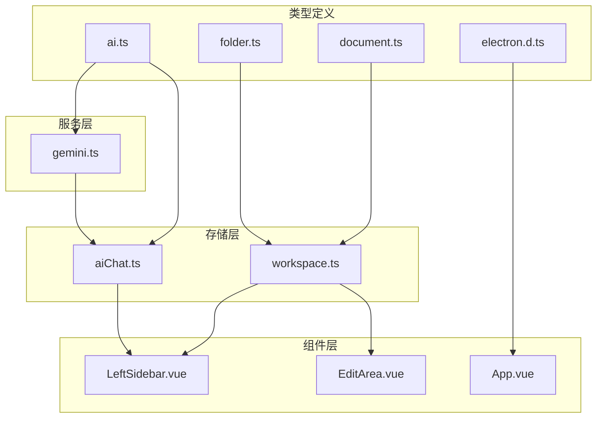
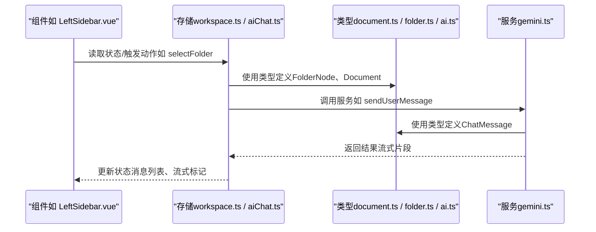
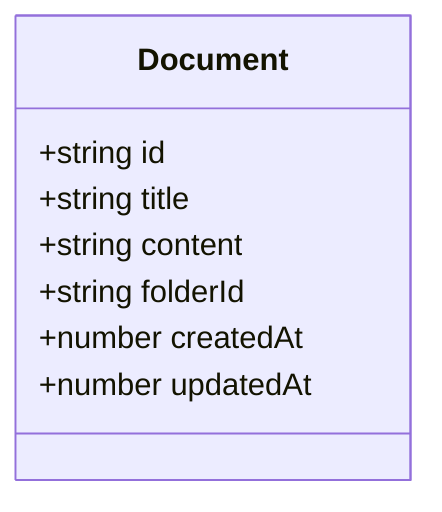
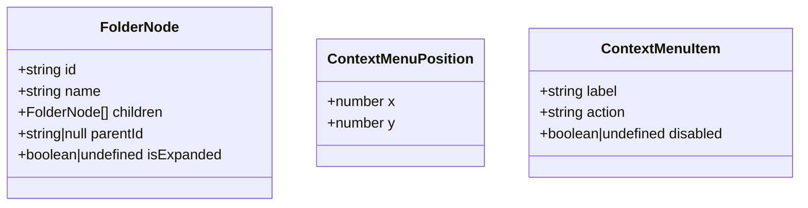
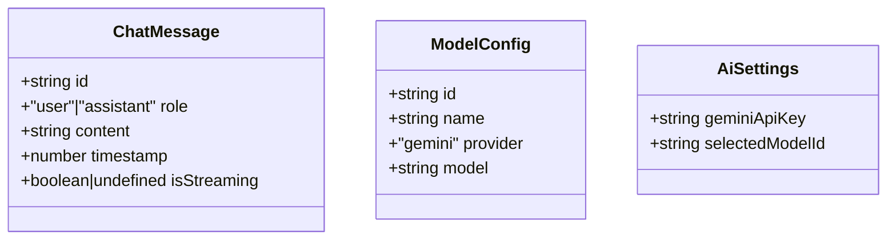
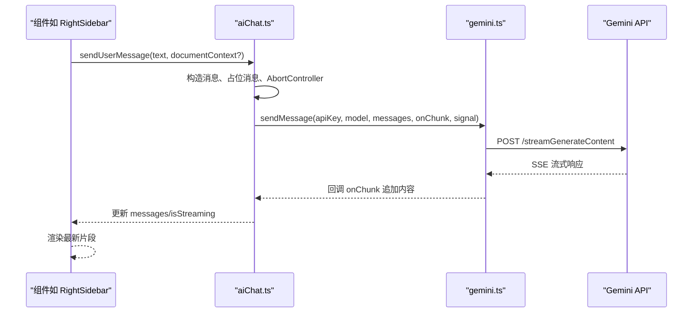
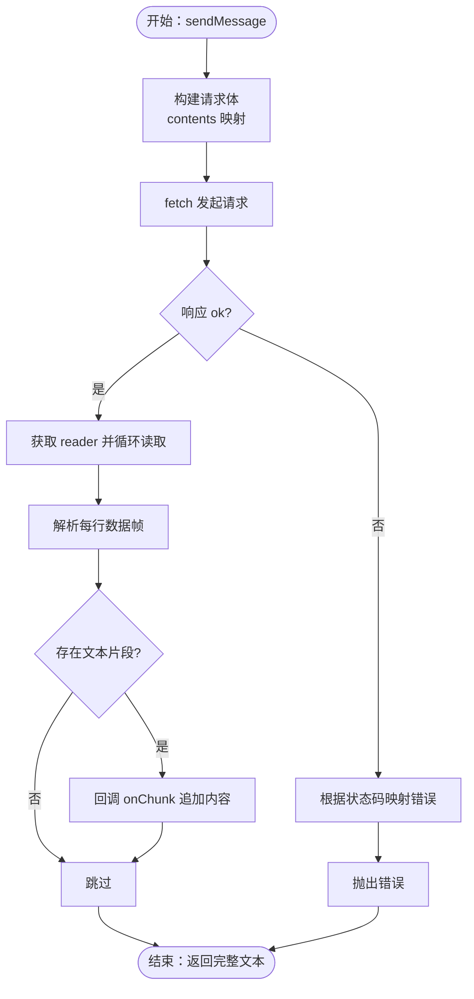
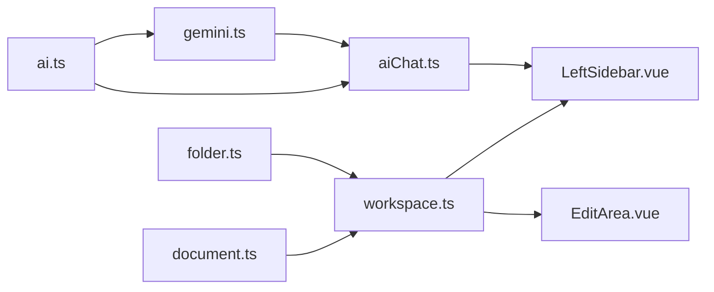

# 类型系统设计

<cite>
**本文档引用的文件**
- [document.ts](file://app/src/types/document.ts)
- [folder.ts](file://app/src/types/folder.ts)
- [ai.ts](file://app/src/types/ai.ts)
- [electron.d.ts](file://app/src/electron.d.ts)
- [tsconfig.json](file://app/tsconfig.json)
- [tsconfig.node.json](file://app/tsconfig.node.json)
- [vite.config.ts](file://app/vite.config.ts)
- [workspace.ts](file://app/src/stores/workspace.ts)
- [aiChat.ts](file://app/src/stores/aiChat.ts)
- [gemini.ts](file://app/src/services/gemini.ts)
- [LeftSidebar.vue](file://app/src/components/layout/LeftSidebar.vue)
- [EditArea.vue](file://app/src/components/layout/EditArea.vue)
- [App.vue](file://app/src/App.vue)
</cite>

## 目录
1. [引言](#引言)
2. [项目结构](#项目结构)
3. [核心组件](#核心组件)
4. [架构总览](#架构总览)
5. [详细组件分析](#详细组件分析)
6. [依赖分析](#依赖分析)
7. [性能考虑](#性能考虑)
8. [故障排查指南](#故障排查指南)
9. [结论](#结论)
10. [附录](#附录)

## 引言
本设计文档围绕Woo前端的类型系统进行系统化梳理与规范，目标是：
- 明确类型定义的设计原则与组织结构
- 解释文档类型、目录类型、AI相关类型等核心接口
- 阐述类型的安全性保证、编译时检查与运行时验证机制
- 展示接口继承、泛型、条件类型等高级类型的使用场景
- 提供类型扩展与自定义的最佳实践（声明合并、模块声明、全局类型）
- 给出具体类型使用示例与常见类型错误的解决方案

## 项目结构
Woo前端采用Vue 3 + TypeScript + Pinia + Vite的组合，类型系统主要分布在以下位置：
- 类型定义：app/src/types/*.ts
- 存储层（Pinia）：app/src/stores/*.ts
- 服务层：app/src/services/*.ts
- 组件层：app/src/components/**/*.vue
- 全局声明：app/src/electron.d.ts
- 编译配置：app/tsconfig*.json、vite.config.ts

**图表来源**
- [document.ts:1-9](file://app/src/types/document.ts#L1-L9)
- [folder.ts:1-19](file://app/src/types/folder.ts#L1-L19)
- [ai.ts:1-20](file://app/src/types/ai.ts#L1-L20)
- [electron.d.ts:1-9](file://app/src/electron.d.ts#L1-L9)
- [workspace.ts:1-321](file://app/src/stores/workspace.ts#L1-L321)
- [aiChat.ts:1-199](file://app/src/stores/aiChat.ts#L1-L199)
- [gemini.ts:1-103](file://app/src/services/gemini.ts#L1-L103)
- [LeftSidebar.vue:1-204](file://app/src/components/layout/LeftSidebar.vue#L1-L204)
- [EditArea.vue:1-463](file://app/src/components/layout/EditArea.vue#L1-L463)
- [App.vue:1-131](file://app/src/App.vue#L1-L131)

**章节来源**
- [tsconfig.json:1-25](file://app/tsconfig.json#L1-L25)
- [tsconfig.node.json:1-11](file://app/tsconfig.node.json#L1-L11)
- [vite.config.ts:1-19](file://app/vite.config.ts#L1-L19)

## 核心组件
本节聚焦于三大核心类型域：文档、目录、AI。

- 文档类型（Document）
  - 字段：id、title、content（HTML字符串）、folderId、createdAt、updatedAt
  - 设计要点：以最小必要字段表达“文档”概念；content采用HTML字符串，便于与编辑器集成
  - 使用场景：工作区存储、编辑器内容同步、预览生成

- 目录类型（FolderNode）
  - 字段：id、name、children（递归）、parentId（可空）、isExpanded（可选）
  - 上下文菜单类型：ContextMenuPosition、ContextMenuItem
  - 设计要点：支持层级目录树；可选展开状态；上下文菜单参数明确

- AI类型（ChatMessage、ModelConfig、AiSettings）
  - ChatMessage：id、role（字面量联合类型）、content、timestamp、isStreaming（可选）
  - ModelConfig：id、name、provider（字面量联合类型）、model
  - AiSettings：geminiApiKey、selectedModelId
  - 设计要点：通过字面量联合类型约束角色与提供商；可选字段用于流式渲染状态

**章节来源**
- [document.ts:1-9](file://app/src/types/document.ts#L1-L9)
- [folder.ts:1-19](file://app/src/types/folder.ts#L1-L19)
- [ai.ts:1-20](file://app/src/types/ai.ts#L1-L20)

## 架构总览
类型系统贯穿“类型定义 → 存储层（Pinia）→ 服务层 → 组件层”的数据流，形成从编译期到运行时的多层保障。

**图表来源**
- [LeftSidebar.vue:60-132](file://app/src/components/layout/LeftSidebar.vue#L60-L132)
- [workspace.ts:131-174](file://app/src/stores/workspace.ts#L131-L174)
- [aiChat.ts:73-168](file://app/src/stores/aiChat.ts#L73-L168)
- [gemini.ts:29-102](file://app/src/services/gemini.ts#L29-L102)
- [document.ts:1-9](file://app/src/types/document.ts#L1-L9)
- [folder.ts:1-19](file://app/src/types/folder.ts#L1-L19)
- [ai.ts:1-20](file://app/src/types/ai.ts#L1-L20)

## 详细组件分析

### 文档类型（Document）
- 设计原则
  - 最小可用字段：仅包含与“文档”强相关的核心属性
  - 时间戳统一为毫秒级数值，便于排序与计算
  - content采用HTML字符串，与编辑器生态无缝衔接
- 数据结构与复杂度
  - 结构：对象字典
  - 排序与过滤：基于folderId与updatedAt的时间复杂度为O(n)
- 依赖关系
  - 被工作区存储引用，作为文档集合的基础元素
  - 在编辑器组件中被读取与写回

**图表来源**
- [document.ts:1-9](file://app/src/types/document.ts#L1-L9)

**章节来源**
- [document.ts:1-9](file://app/src/types/document.ts#L1-L9)
- [workspace.ts:64-129](file://app/src/stores/workspace.ts#L64-L129)

### 目录类型（FolderNode 与上下文菜单）
- 设计原则
  - 支持嵌套树形结构，children为递归类型
  - parentId可空，表示根节点
  - 可选字段isExpanded用于UI状态持久化
  - 上下文菜单位置与菜单项采用独立类型，职责清晰
- 数据结构与复杂度
  - 树遍历：查找/插入/删除的平均复杂度取决于树高h，最坏O(n)
- 依赖关系
  - 工作区存储维护目录树与选中状态
  - 组件通过类型约束传递事件参数与状态

**图表来源**
- [folder.ts:1-19](file://app/src/types/folder.ts#L1-L19)

**章节来源**
- [folder.ts:1-19](file://app/src/types/folder.ts#L1-L19)
- [workspace.ts:10-61](file://app/src/stores/workspace.ts#L10-L61)
- [LeftSidebar.vue:62-132](file://app/src/components/layout/LeftSidebar.vue#L62-L132)

### AI类型（ChatMessage、ModelConfig、AiSettings）
- 设计原则
  - ChatMessage使用字面量联合类型约束role，避免非法值
  - ModelConfig以provider为字面量限定，便于后续扩展其他提供商
  - AiSettings集中管理模型与密钥，便于持久化与跨模块共享
- 数据流与状态
  - 流式生成通过isStreaming标记，辅助UI即时反馈
  - 通过AbortController实现取消，避免竞态与资源泄露
- 依赖关系
  - 存储层负责状态管理与副作用（本地存储、流式回调）
  - 服务层负责与外部API交互与错误处理

**图表来源**
- [ai.ts:1-20](file://app/src/types/ai.ts#L1-L20)

**图表来源**
- [aiChat.ts:73-168](file://app/src/stores/aiChat.ts#L73-L168)
- [gemini.ts:29-102](file://app/src/services/gemini.ts#L29-L102)
- [ai.ts:1-20](file://app/src/types/ai.ts#L1-L20)

**章节来源**
- [ai.ts:1-20](file://app/src/types/ai.ts#L1-L20)
- [aiChat.ts:1-199](file://app/src/stores/aiChat.ts#L1-L199)
- [gemini.ts:1-103](file://app/src/services/gemini.ts#L1-L103)

### 类型安全性与编译时检查
- 严格模式与未使用检测
  - tsconfig启用严格模式、未使用局部变量与参数、switch穷举检查
- 模块解析与打包
  - 使用bundler解析、禁用emit、JSX保留，配合Vite构建
- Electron全局声明
  - 通过electron.d.ts声明window.electronAPI，避免TS报错

**章节来源**
- [tsconfig.json:18-21](file://app/tsconfig.json#L18-L21)
- [tsconfig.node.json:2-9](file://app/tsconfig.node.json#L2-L9)
- [vite.config.ts:1-19](file://app/vite.config.ts#L1-L19)
- [electron.d.ts:1-9](file://app/src/electron.d.ts#L1-L9)

### 运行时验证与错误处理
- API Key有效性验证
  - 服务层提供validateApiKey，返回布尔值
- 流式响应解析
  - 服务层解析SSE数据帧，提取文本片段并回调
- 错误分类与提示
  - 401/403：提示Key无效或过期
  - 429：提示请求过于频繁
  - 其他：通用错误提示并清理空的占位消息

**图表来源**
- [gemini.ts:29-102](file://app/src/services/gemini.ts#L29-L102)

**章节来源**
- [gemini.ts:8-15](file://app/src/services/gemini.ts#L8-L15)
- [gemini.ts:29-102](file://app/src/services/gemini.ts#L29-L102)
- [aiChat.ts:148-168](file://app/src/stores/aiChat.ts#L148-L168)

### 高级类型特性与应用场景
- 字面量联合类型
  - ChatMessage.role、ModelConfig.provider使用字面量联合类型，编译期阻止非法值
- 可选字段与可空类型
  - FolderNode.parentId为string|null；isExpanded为boolean|undefined，用于UI状态
- 泛型与条件类型（建议）
  - 可引入泛型工具类型（如DeepRequired、PartialDeep）对复杂状态进行条件约束
  - 条件类型可用于根据provider动态推导模型配置的字段集合

**章节来源**
- [ai.ts:1-20](file://app/src/types/ai.ts#L1-L20)
- [folder.ts:1-19](file://app/src/types/folder.ts#L1-L19)

### 类型扩展与自定义最佳实践
- 声明合并
  - 在electron.d.ts中对Window接口进行扩展，声明electronAPI
- 模块声明
  - 将类型定义置于src/types下，组件与存储通过相对路径导入
- 全局类型定义
  - 通过tsconfig的include范围纳入全局.d.ts文件
- 类型声明与组件通信
  - 组件通过defineProps与defineExpose显式声明输入输出类型，确保父子组件契约清晰

**章节来源**
- [electron.d.ts:1-9](file://app/src/electron.d.ts#L1-L9)
- [LeftSidebar.vue:52-67](file://app/src/components/layout/LeftSidebar.vue#L52-L67)
- [EditArea.vue:28-41](file://app/src/components/layout/EditArea.vue#L28-L41)
- [App.vue:37-46](file://app/src/App.vue#L37-L46)

## 依赖分析
类型系统在各层之间的耦合与内聚如下：

**图表来源**
- [document.ts:1-9](file://app/src/types/document.ts#L1-L9)
- [folder.ts:1-19](file://app/src/types/folder.ts#L1-L19)
- [ai.ts:1-20](file://app/src/types/ai.ts#L1-L20)
- [workspace.ts:1-321](file://app/src/stores/workspace.ts#L1-L321)
- [aiChat.ts:1-199](file://app/src/stores/aiChat.ts#L1-L199)
- [gemini.ts:1-103](file://app/src/services/gemini.ts#L1-L103)
- [LeftSidebar.vue:50-67](file://app/src/components/layout/LeftSidebar.vue#L50-L67)
- [EditArea.vue:39-41](file://app/src/components/layout/EditArea.vue#L39-L41)

**章节来源**
- [workspace.ts:1-321](file://app/src/stores/workspace.ts#L1-L321)
- [aiChat.ts:1-199](file://app/src/stores/aiChat.ts#L1-L199)
- [gemini.ts:1-103](file://app/src/services/gemini.ts#L1-L103)

## 性能考虑
- 类型层面
  - 使用字面量联合类型减少分支判断开销
  - 对复杂对象采用浅拷贝策略，避免深层复制
- 运行时
  - 流式处理避免一次性拼接大字符串
  - 使用AbortController及时中断请求，释放资源
- 存储层
  - 计算属性缓存派生状态，减少重复计算

## 故障排查指南
- 常见类型错误
  - 将非字面量赋给ChatMessage.role：编译期报错
  - 将number赋给Document.createdAt：编译期报错
  - 未处理的Promise异常：在aiChat.ts中捕获并清理空消息
- 运行时错误
  - API 401/403：提示Key无效或过期，需重新配置
  - API 429：提示请求过于频繁，降低频率或等待
  - 网络异常：统一错误提示并允许重试

**章节来源**
- [ai.ts:1-20](file://app/src/types/ai.ts#L1-L20)
- [document.ts:1-9](file://app/src/types/document.ts#L1-L9)
- [gemini.ts:57-65](file://app/src/services/gemini.ts#L57-L65)
- [aiChat.ts:148-168](file://app/src/stores/aiChat.ts#L148-L168)

## 结论
Woo前端类型系统以简洁、明确为核心设计原则，通过字面量联合类型、可选字段与独立上下文菜单类型，实现了良好的可读性与可维护性。结合严格编译配置与运行时错误处理，形成了从编译期到运行时的多层安全保障。未来可在高级类型特性（泛型、条件类型）与声明合并方面进一步增强，以支撑更复杂的业务场景。

## 附录
- 类型使用示例（路径指引）
  - 目录树渲染：[LeftSidebar.vue:22-30](file://app/src/components/layout/LeftSidebar.vue#L22-L30)
  - 文档内容加载：[EditArea.vue:151-164](file://app/src/components/layout/EditArea.vue#L151-L164)
  - AI消息发送：[aiChat.ts:73-168](file://app/src/stores/aiChat.ts#L73-L168)
  - API Key校验：[gemini.ts:8-15](file://app/src/services/gemini.ts#L8-L15)
- 最佳实践清单
  - 优先使用字面量联合类型约束枚举值
  - 对UI状态使用可选字段，避免污染核心数据
  - 将全局声明集中于electron.d.ts，保持入口清晰
  - 在服务层统一处理网络错误，向上抛出语义化错误