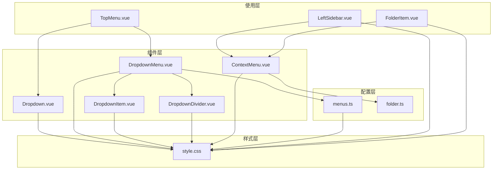
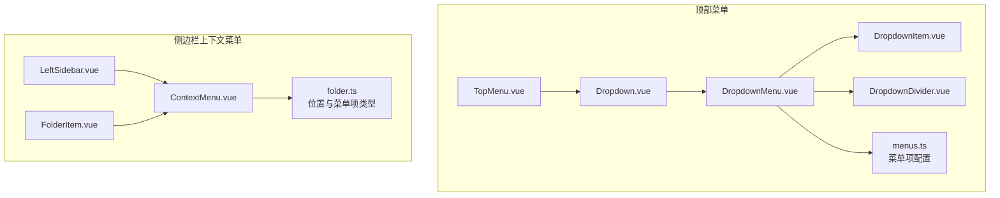
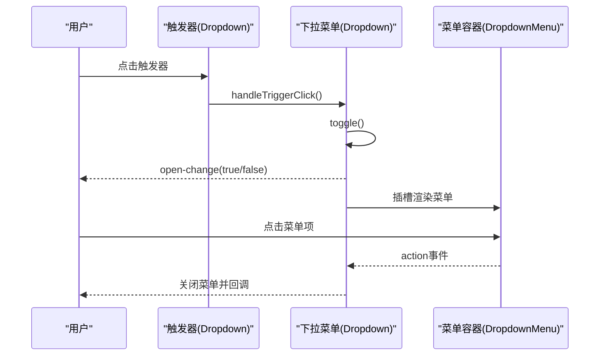
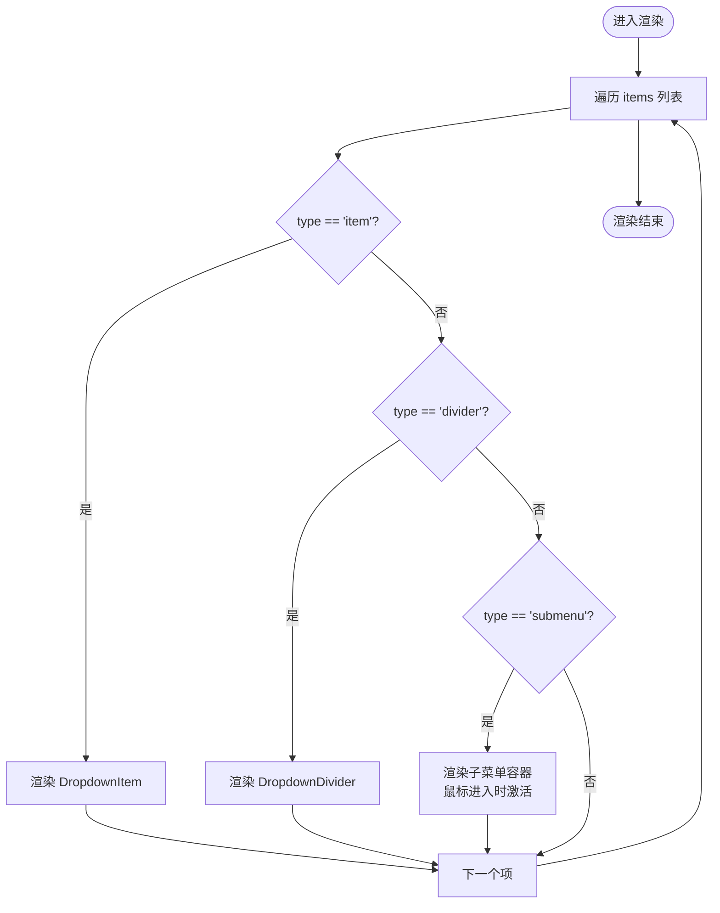
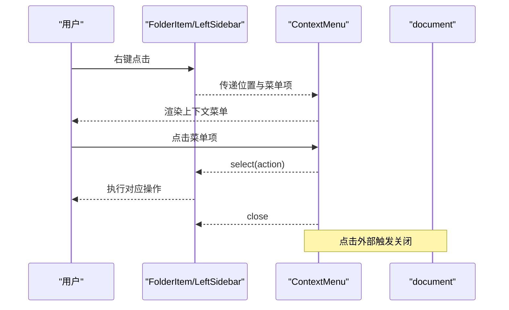
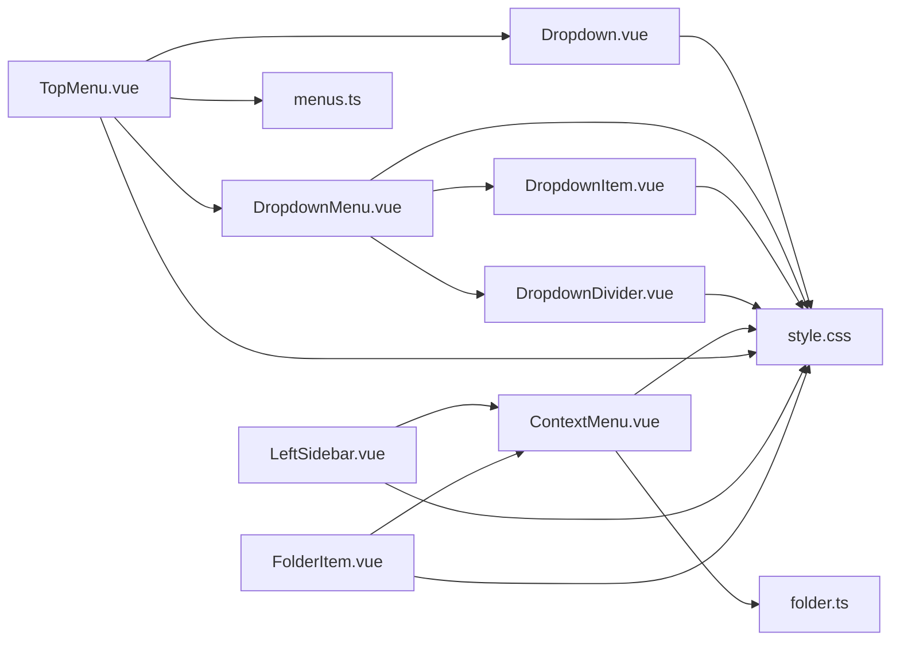

# UI基础组件库

<cite>
**本文档引用的文件**
- [Dropdown.vue](file://app/src/components/ui/Dropdown.vue)
- [DropdownMenu.vue](file://app/src/components/ui/DropdownMenu.vue)
- [DropdownItem.vue](file://app/src/components/ui/DropdownItem.vue)
- [DropdownDivider.vue](file://app/src/components/ui/DropdownDivider.vue)
- [ContextMenu.vue](file://app/src/components/ui/ContextMenu.vue)
- [menus.ts](file://app/src/config/menus.ts)
- [folder.ts](file://app/src/types/folder.ts)
- [style.css](file://app/src/style.css)
- [TopMenu.vue](file://app/src/components/layout/TopMenu.vue)
- [LeftSidebar.vue](file://app/src/components/layout/LeftSidebar.vue)
- [FolderItem.vue](file://app/src/components/layout/FolderItem.vue)
- [IconClose.vue](file://app/src/components/icons/IconClose.vue)
- [IconLeftSidebar.vue](file://app/src/components/icons/IconLeftSidebar.vue)
</cite>

## 目录
1. [简介](#简介)
2. [项目结构](#项目结构)
3. [核心组件](#核心组件)
4. [架构总览](#架构总览)
5. [详细组件分析](#详细组件分析)
6. [依赖关系分析](#依赖关系分析)
7. [性能考量](#性能考量)
8. [故障排查指南](#故障排查指南)
9. [结论](#结论)
10. [附录](#附录)

## 简介
本文件面向Woo UI基础组件库，聚焦以下组件的架构与交互设计：Dropdown下拉菜单、DropdownMenu菜单容器、DropdownItem菜单项、DropdownDivider分割线，以及ContextMenu上下文菜单。文档从系统架构、组件关系、数据流与处理逻辑、可访问性与键盘导航、主题适配与样式定制、响应式设计原则等方面进行深入解析，并提供API接口说明、使用示例与集成指南，帮助开发者理解与扩展UI组件库。

## 项目结构
UI基础组件位于应用前端源码的组件层，采用按功能分组的组织方式：
- 组件层：app/src/components/ui 下存放基础UI组件（Dropdown系列、ContextMenu）
- 配置层：app/src/config/menus.ts 定义菜单项数据结构与各菜单集合
- 类型层：app/src/types/folder.ts 定义上下文菜单位置与菜单项类型
- 样式层：app/src/style.css 提供主题变量与全局样式
- 使用层：app/src/components/layout 下的布局组件（如TopMenu、LeftSidebar）演示组件的实际使用场景

图表来源
- [Dropdown.vue:1-88](file://app/src/components/ui/Dropdown.vue#L1-L88)
- [DropdownMenu.vue:1-115](file://app/src/components/ui/DropdownMenu.vue#L1-L115)
- [DropdownItem.vue:1-26](file://app/src/components/ui/DropdownItem.vue#L1-L26)
- [DropdownDivider.vue:1-12](file://app/src/components/ui/DropdownDivider.vue#L1-L12)
- [ContextMenu.vue:1-111](file://app/src/components/ui/ContextMenu.vue#L1-L111)
- [menus.ts:1-103](file://app/src/config/menus.ts#L1-L103)
- [folder.ts:1-19](file://app/src/types/folder.ts#L1-L19)
- [style.css:1-286](file://app/src/style.css#L1-L286)
- [TopMenu.vue:1-262](file://app/src/components/layout/TopMenu.vue#L1-L262)
- [LeftSidebar.vue:1-204](file://app/src/components/layout/LeftSidebar.vue#L1-L204)
- [FolderItem.vue:1-195](file://app/src/components/layout/FolderItem.vue#L1-L195)

章节来源
- [Dropdown.vue:1-88](file://app/src/components/ui/Dropdown.vue#L1-L88)
- [DropdownMenu.vue:1-115](file://app/src/components/ui/DropdownMenu.vue#L1-L115)
- [DropdownItem.vue:1-26](file://app/src/components/ui/DropdownItem.vue#L1-L26)
- [DropdownDivider.vue:1-12](file://app/src/components/ui/DropdownDivider.vue#L1-L12)
- [ContextMenu.vue:1-111](file://app/src/components/ui/ContextMenu.vue#L1-L111)
- [menus.ts:1-103](file://app/src/config/menus.ts#L1-L103)
- [folder.ts:1-19](file://app/src/types/folder.ts#L1-L19)
- [style.css:1-286](file://app/src/style.css#L1-L286)
- [TopMenu.vue:1-262](file://app/src/components/layout/TopMenu.vue#L1-L262)
- [LeftSidebar.vue:1-204](file://app/src/components/layout/LeftSidebar.vue#L1-L204)
- [FolderItem.vue:1-195](file://app/src/components/layout/FolderItem.vue#L1-L195)

## 核心组件
本节对四个基础组件进行要点梳理，便于快速掌握其职责与协作方式。

- Dropdown（下拉菜单容器）
  - 职责：管理下拉菜单的显隐状态，提供触发器插槽，封装点击外部关闭逻辑，暴露编程式控制方法（关闭、切换）
  - 关键点：内部通过过渡动画控制显隐；通过事件向父组件广播open-change；通过expose暴露编程式API
  - 适用场景：顶部菜单、工具栏按钮、面板触发器等

- DropdownMenu（菜单容器）
  - 职责：根据菜单项配置渲染菜单内容，支持普通菜单项、分割线与子菜单
  - 关键点：通过props接收菜单项数组；根据type分支渲染；子菜单通过递归渲染实现；透传action事件
  - 适用场景：文件、编辑、视图等主菜单的下拉内容

- DropdownItem（菜单项）
  - 职责：渲染单个菜单项，处理点击事件并向上冒泡
  - 关键点：hover态样式；点击事件透传；支持插槽自定义内容
  - 适用场景：所有可点击的菜单条目

- DropdownDivider（分割线）
  - 职责：渲染菜单项之间的视觉分割线
  - 关键点：基于主题变量的边框颜色；上下留白间距
  - 适用场景：分组或功能区间的分隔

- ContextMenu（上下文菜单）
  - 职责：在指定坐标渲染上下文菜单，处理点击外部关闭、禁用项、边界检测
  - 关键点：计算位置避免越界；点击项触发select事件；关闭时触发close事件
  - 适用场景：右键菜单、树形节点菜单、空白区域菜单

章节来源
- [Dropdown.vue:1-88](file://app/src/components/ui/Dropdown.vue#L1-L88)
- [DropdownMenu.vue:1-115](file://app/src/components/ui/DropdownMenu.vue#L1-L115)
- [DropdownItem.vue:1-26](file://app/src/components/ui/DropdownItem.vue#L1-L26)
- [DropdownDivider.vue:1-12](file://app/src/components/ui/DropdownDivider.vue#L1-L12)
- [ContextMenu.vue:1-111](file://app/src/components/ui/ContextMenu.vue#L1-L111)

## 架构总览
下图展示Dropdown与DropdownMenu的组合关系，以及它们在TopMenu中的使用方式；同时展示ContextMenu在LeftSidebar与FolderItem中的使用方式。

图表来源
- [TopMenu.vue:1-262](file://app/src/components/layout/TopMenu.vue#L1-L262)
- [Dropdown.vue:1-88](file://app/src/components/ui/Dropdown.vue#L1-L88)
- [DropdownMenu.vue:1-115](file://app/src/components/ui/DropdownMenu.vue#L1-L115)
- [DropdownItem.vue:1-26](file://app/src/components/ui/DropdownItem.vue#L1-L26)
- [DropdownDivider.vue:1-12](file://app/src/components/ui/DropdownDivider.vue#L1-L12)
- [menus.ts:1-103](file://app/src/config/menus.ts#L1-L103)
- [LeftSidebar.vue:1-204](file://app/src/components/layout/LeftSidebar.vue#L1-L204)
- [FolderItem.vue:1-195](file://app/src/components/layout/FolderItem.vue#L1-L195)
- [ContextMenu.vue:1-111](file://app/src/components/ui/ContextMenu.vue#L1-L111)
- [folder.ts:1-19](file://app/src/types/folder.ts#L1-L19)

## 详细组件分析

### Dropdown 下拉菜单
- 设计要点
  - 触发器插槽：通过具名插槽提供自定义触发器
  - 显隐控制：内部状态管理isOpen；toggle与close方法通过expose暴露
  - 外部点击关闭：在挂载时监听document点击，若点击目标不在组件范围内则关闭
  - 事件传播：click.stop阻止事件冒泡；open-change事件向上通知状态变化
  - 样式：基于CSS变量的主题适配；过渡动画提升交互体验

- 交互流程（序列图）

图表来源
- [Dropdown.vue:1-88](file://app/src/components/ui/Dropdown.vue#L1-L88)
- [DropdownMenu.vue:1-115](file://app/src/components/ui/DropdownMenu.vue#L1-L115)

章节来源
- [Dropdown.vue:1-88](file://app/src/components/ui/Dropdown.vue#L1-L88)

### DropdownMenu 菜单容器
- 设计要点
  - 数据驱动：通过items属性接收菜单项数组，支持item/divider/submenu三种类型
  - 子菜单递归：submenu类型通过递归渲染DropdownMenu实现多级菜单
  - 事件透传：将子菜单的action事件原样向上抛出
  - 样式适配：is-submenu类控制子菜单定位；hover态与箭头指示增强可用性

- 渲染流程（流程图）

图表来源
- [DropdownMenu.vue:1-115](file://app/src/components/ui/DropdownMenu.vue#L1-L115)
- [DropdownItem.vue:1-26](file://app/src/components/ui/DropdownItem.vue#L1-L26)
- [DropdownDivider.vue:1-12](file://app/src/components/ui/DropdownDivider.vue#L1-L12)

章节来源
- [DropdownMenu.vue:1-115](file://app/src/components/ui/DropdownMenu.vue#L1-L115)

### DropdownItem 菜单项
- 设计要点
  - 点击事件：直接透传click事件，便于上层处理业务动作
  - hover态：统一的背景色过渡，提升交互反馈
  - 插槽：支持自定义内容，满足多样化菜单项需求

章节来源
- [DropdownItem.vue:1-26](file://app/src/components/ui/DropdownItem.vue#L1-L26)

### DropdownDivider 分割线
- 设计要点
  - 单纯的视觉分割元素，基于主题变量控制颜色与间距
  - 无交互行为，保持菜单的层次清晰

章节来源
- [DropdownDivider.vue:1-12](file://app/src/components/ui/DropdownDivider.vue#L1-L12)

### ContextMenu 上下文菜单
- 设计要点
  - 位置计算：根据窗口尺寸与菜单高度宽度动态调整，避免越界
  - 点击外部关闭：在mounted后延迟监听document点击，触发close事件
  - 禁用项：支持disabled字段，禁用项不可点击且样式区分
  - 事件模型：select(action)用于执行业务动作；close用于关闭菜单

- 交互流程（序列图）

图表来源
- [ContextMenu.vue:1-111](file://app/src/components/ui/ContextMenu.vue#L1-L111)
- [LeftSidebar.vue:1-204](file://app/src/components/layout/LeftSidebar.vue#L1-L204)
- [FolderItem.vue:1-195](file://app/src/components/layout/FolderItem.vue#L1-L195)

章节来源
- [ContextMenu.vue:1-111](file://app/src/components/ui/ContextMenu.vue#L1-L111)
- [LeftSidebar.vue:1-204](file://app/src/components/layout/LeftSidebar.vue#L1-L204)
- [FolderItem.vue:1-195](file://app/src/components/layout/FolderItem.vue#L1-L195)

## 依赖关系分析
- 组件耦合
  - DropdownMenu依赖DropdownItem与DropdownDivider进行组合渲染
  - TopMenu通过Dropdown与DropdownMenu构建顶部菜单，依赖menus.ts提供的菜单配置
  - LeftSidebar与FolderItem通过ContextMenu实现右键菜单，依赖folder.ts定义的类型
- 外部依赖
  - 所有组件共享style.css中的CSS变量，实现主题一致的视觉表现
  - 图标组件（如IconClose、IconLeftSidebar）在布局组件中被复用，体现组件生态的一致性

图表来源
- [DropdownMenu.vue:1-115](file://app/src/components/ui/DropdownMenu.vue#L1-L115)
- [DropdownItem.vue:1-26](file://app/src/components/ui/DropdownItem.vue#L1-L26)
- [DropdownDivider.vue:1-12](file://app/src/components/ui/DropdownDivider.vue#L1-L12)
- [Dropdown.vue:1-88](file://app/src/components/ui/Dropdown.vue#L1-L88)
- [TopMenu.vue:1-262](file://app/src/components/layout/TopMenu.vue#L1-L262)
- [LeftSidebar.vue:1-204](file://app/src/components/layout/LeftSidebar.vue#L1-L204)
- [FolderItem.vue:1-195](file://app/src/components/layout/FolderItem.vue#L1-L195)
- [ContextMenu.vue:1-111](file://app/src/components/ui/ContextMenu.vue#L1-L111)
- [menus.ts:1-103](file://app/src/config/menus.ts#L1-L103)
- [folder.ts:1-19](file://app/src/types/folder.ts#L1-L19)
- [style.css:1-286](file://app/src/style.css#L1-L286)

章节来源
- [TopMenu.vue:1-262](file://app/src/components/layout/TopMenu.vue#L1-L262)
- [LeftSidebar.vue:1-204](file://app/src/components/layout/LeftSidebar.vue#L1-L204)
- [FolderItem.vue:1-195](file://app/src/components/layout/FolderItem.vue#L1-L195)
- [ContextMenu.vue:1-111](file://app/src/components/ui/ContextMenu.vue#L1-L111)
- [Dropdown.vue:1-88](file://app/src/components/ui/Dropdown.vue#L1-L88)
- [DropdownMenu.vue:1-115](file://app/src/components/ui/DropdownMenu.vue#L1-L115)
- [DropdownItem.vue:1-26](file://app/src/components/ui/DropdownItem.vue#L1-L26)
- [DropdownDivider.vue:1-12](file://app/src/components/ui/DropdownDivider.vue#L1-L12)
- [menus.ts:1-103](file://app/src/config/menus.ts#L1-L103)
- [folder.ts:1-19](file://app/src/types/folder.ts#L1-L19)
- [style.css:1-286](file://app/src/style.css#L1-L286)

## 性能考量
- 渲染优化
  - Dropdown与DropdownMenu均使用条件渲染与过渡动画，减少不必要的DOM更新
  - 子菜单采用mouseenter/mouseleave控制激活状态，避免频繁重渲染
- 事件处理
  - Dropdown与ContextMenu在挂载/卸载阶段注册/移除document事件，防止内存泄漏
  - 使用computed计算上下文菜单位置，避免每次渲染都重复计算
- 主题与样式
  - 通过CSS变量统一主题色，减少样式切换成本
  - scoped样式配合全局样式（如消息内容的Markdown样式）平衡作用域与覆盖需求

[本节为通用性能建议，无需特定文件来源]

## 故障排查指南
- 下拉菜单无法关闭
  - 检查是否正确调用exposed的close/toggle方法
  - 确认外部点击关闭逻辑是否生效（document事件监听）
- 子菜单不显示
  - 确认items中submenu项的children存在且格式正确
  - 检查is-submenu类是否正确应用，确保定位偏移
- 上下文菜单越界
  - 检查menuStyle计算逻辑，确认窗口尺寸与菜单尺寸
  - 确认点击外部关闭事件是否在mounted后延迟注册
- 禁用项仍可点击
  - 确认handleSelect中对disabled的判断逻辑
- 样式异常
  - 检查CSS变量是否正确设置，主题切换是否生效

章节来源
- [Dropdown.vue:1-88](file://app/src/components/ui/Dropdown.vue#L1-L88)
- [DropdownMenu.vue:1-115](file://app/src/components/ui/DropdownMenu.vue#L1-L115)
- [ContextMenu.vue:1-111](file://app/src/components/ui/ContextMenu.vue#L1-L111)

## 结论
Woo UI基础组件库通过轻量的组合组件实现了丰富的菜单交互能力：Dropdown系列负责触发与容器渲染，ContextMenu负责上下文场景的菜单展示。组件均遵循数据驱动与事件透传的设计原则，结合CSS变量主题系统，具备良好的可扩展性与一致性。开发者可在现有基础上扩展更多菜单类型、增强键盘导航与可访问性支持，并进一步完善响应式布局与跨平台兼容性。

[本节为总结性内容，无需特定文件来源]

## 附录

### API 接口文档

- Dropdown
  - 属性：无（通过具名插槽提供触发器）
  - 事件：open-change(boolean)
  - 暴露：close(), toggle()

- DropdownMenu
  - 属性：items(MenuItem[]), isSubmenu(boolean)
  - 事件：action(string)

- DropdownItem
  - 事件：click()

- DropdownDivider
  - 无

- ContextMenu
  - 属性：position(ContextMenuPosition), items(ContextMenuItem[])
  - 事件：select(string), close()

- 类型定义
  - MenuItemType: 'item' | 'divider' | 'submenu'
  - MenuItem: { type, label?, action?, isHtml?, children? }
  - ContextMenuPosition: { x: number, y: number }
  - ContextMenuItem: { label: string, action: string, disabled?: boolean }

章节来源
- [Dropdown.vue:1-88](file://app/src/components/ui/Dropdown.vue#L1-L88)
- [DropdownMenu.vue:1-115](file://app/src/components/ui/DropdownMenu.vue#L1-L115)
- [DropdownItem.vue:1-26](file://app/src/components/ui/DropdownItem.vue#L1-L26)
- [DropdownDivider.vue:1-12](file://app/src/components/ui/DropdownDivider.vue#L1-L12)
- [ContextMenu.vue:1-111](file://app/src/components/ui/ContextMenu.vue#L1-L111)
- [menus.ts:1-103](file://app/src/config/menus.ts#L1-L103)
- [folder.ts:1-19](file://app/src/types/folder.ts#L1-L19)

### 使用示例与集成指南

- 在顶部菜单中集成Dropdown与DropdownMenu
  - 在TopMenu中使用Dropdown包裹DropdownMenu，并通过menus.ts提供的配置数据填充
  - 监听open-change事件，确保同一时间仅有一个下拉菜单处于打开状态
  - 监听action事件，根据action字符串执行相应业务逻辑

- 在侧边栏中集成ContextMenu
  - 在LeftSidebar中监听空白区域与FolderItem的右键事件，构造ContextMenu的position与items
  - 监听select事件执行具体操作（如创建/删除目录），并在完成后调用close事件关闭菜单

- 自定义菜单项
  - 使用DropdownItem的插槽自定义菜单项内容
  - 通过DropdownMenu的isHtml字段支持富文本标签（谨慎使用，注意XSS风险）

- 主题适配与样式定制
  - 通过修改style.css中的CSS变量实现主题切换
  - 如需覆盖组件样式，建议使用深度选择器或在组件外层容器添加作用域类名

- 响应式设计
  - 菜单宽度与间距采用固定值，结合边界检测逻辑保证在小屏设备上的可用性
  - 子菜单定位使用绝对定位，确保在窄屏环境下不会遮挡主要内容

章节来源
- [TopMenu.vue:1-262](file://app/src/components/layout/TopMenu.vue#L1-L262)
- [LeftSidebar.vue:1-204](file://app/src/components/layout/LeftSidebar.vue#L1-L204)
- [FolderItem.vue:1-195](file://app/src/components/layout/FolderItem.vue#L1-L195)
- [menus.ts:1-103](file://app/src/config/menus.ts#L1-L103)
- [style.css:1-286](file://app/src/style.css#L1-L286)