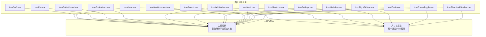
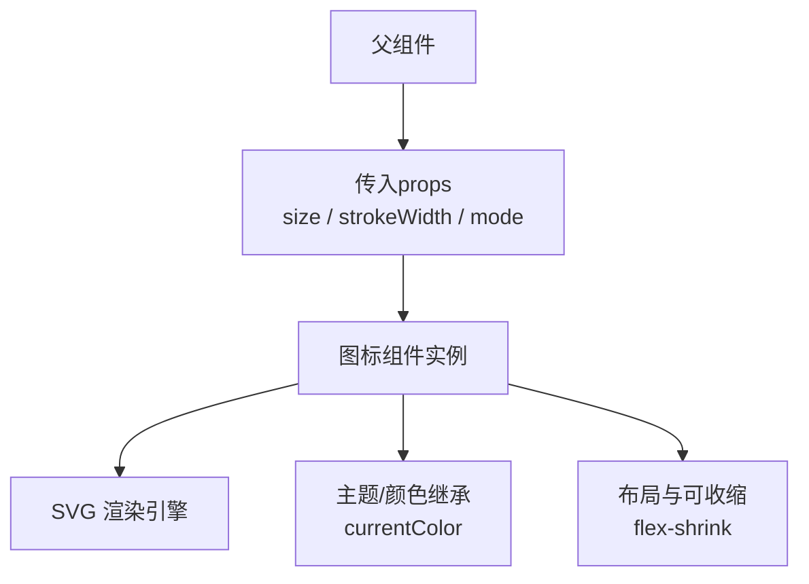
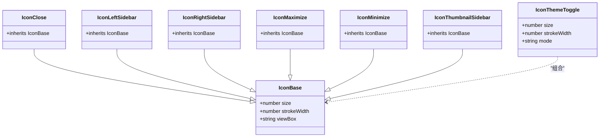
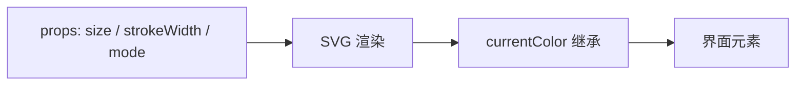

# 图标组件系统

<cite>
**本文引用的文件**
- [IconClose.vue](file://app/src/components/icons/IconClose.vue)
- [IconDraft.vue](file://app/src/components/icons/IconDraft.vue)
- [IconFile.vue](file://app/src/components/icons/IconFile.vue)
- [IconFolderClosed.vue](file://app/src/components/icons/IconFolderClosed.vue)
- [IconFolderOpen.vue](file://app/src/components/icons/IconFolderOpen.vue)
- [IconLeftSidebar.vue](file://app/src/components/icons/IconLeftSidebar.vue)
- [IconMaximize.vue](file://app/src/components/icons/IconMaximize.vue)
- [IconMinimize.vue](file://app/src/components/icons/IconMinimize.vue)
- [IconNewDocument.vue](file://app/src/components/icons/IconNewDocument.vue)
- [IconRightSidebar.vue](file://app/src/components/icons/IconRightSidebar.vue)
- [IconSearch.vue](file://app/src/components/icons/IconSearch.vue)
- [IconSend.vue](file://app/src/components/icons/IconSend.vue)
- [IconSettings.vue](file://app/src/components/icons/IconSettings.vue)
- [IconThemeToggle.vue](file://app/src/components/icons/IconThemeToggle.vue)
- [IconThumbnailSidebar.vue](file://app/src/components/icons/IconThumbnailSidebar.vue)
- [IconTrash.vue](file://app/src/components/icons/IconTrash.vue)
</cite>

## 目录
1. [简介](#简介)
2. [项目结构](#项目结构)
3. [核心组件](#核心组件)
4. [架构总览](#架构总览)
5. [详细组件分析](#详细组件分析)
6. [依赖分析](#依赖分析)
7. [性能考虑](#性能考虑)
8. [故障排查指南](#故障排查指南)
9. [结论](#结论)
10. [附录](#附录)

## 简介
本设计文档面向Woo应用中的图标组件系统，目标是建立统一的图标设计规范与组件化实现方式，涵盖SVG图标资源管理、组件props参数设计、颜色主题适配、尺寸规格控制以及交互反馈机制。文档同时提供扩展指南、使用示例与最佳实践，帮助开发者在不同界面场景中正确选择与使用图标组件。

## 项目结构
图标组件集中位于前端工程的组件目录下，采用按功能分组的组织方式，便于维护与复用。每个图标均为独立的Vue单文件组件，内部以SVG矢量图形表达，通过props控制尺寸与描边宽度，并继承全局文本色以实现主题一致的视觉效果。

图表来源
- [IconClose.vue:1-28](file://app/src/components/icons/IconClose.vue#L1-L28)
- [IconLeftSidebar.vue:1-28](file://app/src/components/icons/IconLeftSidebar.vue#L1-L28)
- [IconMaximize.vue:1-27](file://app/src/components/icons/IconMaximize.vue#L1-L27)
- [IconMinimize.vue:1-27](file://app/src/components/icons/IconMinimize.vue#L1-L27)
- [IconRightSidebar.vue:1-28](file://app/src/components/icons/IconRightSidebar.vue#L1-L28)
- [IconThemeToggle.vue:1-45](file://app/src/components/icons/IconThemeToggle.vue#L1-L45)
- [IconThumbnailSidebar.vue:1-29](file://app/src/components/icons/IconThumbnailSidebar.vue#L1-L29)

章节来源
- [IconClose.vue:1-28](file://app/src/components/icons/IconClose.vue#L1-L28)
- [IconLeftSidebar.vue:1-28](file://app/src/components/icons/IconLeftSidebar.vue#L1-L28)
- [IconMaximize.vue:1-27](file://app/src/components/icons/IconMaximize.vue#L1-L27)
- [IconMinimize.vue:1-27](file://app/src/components/icons/IconMinimize.vue#L1-L27)
- [IconRightSidebar.vue:1-28](file://app/src/components/icons/IconRightSidebar.vue#L1-L28)
- [IconThemeToggle.vue:1-45](file://app/src/components/icons/IconThemeToggle.vue#L1-L45)
- [IconThumbnailSidebar.vue:1-29](file://app/src/components/icons/IconThumbnailSidebar.vue#L1-L29)

## 核心组件
本系统的核心为一组基于SVG的Vue图标组件，遵循以下统一设计原则：
- 统一的视口与颜色策略：所有图标使用固定视口，颜色通过“当前文本色”继承，确保与主题一致。
- 可配置的尺寸与描边：通过props控制宽高与描边宽度，满足不同密度与层级的布局需求。
- 语义化命名与职责单一：每个图标组件仅负责一种视觉符号，便于理解与复用。
- 响应式与可收缩：部分图标为UI元素提供紧凑布局能力，避免溢出或破坏栅格。

章节来源
- [IconClose.vue:15-27](file://app/src/components/icons/IconClose.vue#L15-L27)
- [IconLeftSidebar.vue:15-27](file://app/src/components/icons/IconLeftSidebar.vue#L15-L27)
- [IconMaximize.vue:14-26](file://app/src/components/icons/IconMaximize.vue#L14-L26)
- [IconMinimize.vue:14-26](file://app/src/components/icons/IconMinimize.vue#L14-L26)
- [IconRightSidebar.vue:15-27](file://app/src/components/icons/IconRightSidebar.vue#L15-L27)
- [IconThemeToggle.vue:31-44](file://app/src/components/icons/IconThemeToggle.vue#L31-L44)
- [IconThumbnailSidebar.vue:16-28](file://app/src/components/icons/IconThumbnailSidebar.vue#L16-L28)

## 架构总览
图标组件的运行时架构围绕“属性驱动渲染”的模式展开：父组件传入尺寸与描边等参数，组件内部以SVG路径与线条组合形成最终视觉；颜色由CSS变量或主题系统决定，无需硬编码。

图表来源
- [IconClose.vue:15-27](file://app/src/components/icons/IconClose.vue#L15-L27)
- [IconThemeToggle.vue:31-44](file://app/src/components/icons/IconThemeToggle.vue#L31-L44)
- [IconDraft.vue:22-26](file://app/src/components/icons/IconDraft.vue#L22-L26)

## 详细组件分析

### 操作类图标
操作类图标用于触发用户行为，如关闭、发送、新建文档、搜索、设置等。这些图标通常与按钮或菜单项结合使用，强调明确的交互意图。

- 关闭（IconClose）
  - 设计要点：简洁的交叉线，适合小尺寸与高对比度场景。
  - 使用场景：模态框关闭、标签页关闭、侧栏折叠等。
  - 参数：size、strokeWidth。
  - 颜色：继承当前文本色，确保与背景对比度符合无障碍要求。

- 发送（IconSend）
  - 设计要点：箭头与多边形组合，传达“提交/发送”的动作。
  - 使用场景：消息输入区、表单提交按钮、快捷操作入口。
  - 参数：size、strokeWidth。

- 新建文档（IconNewDocument）
  - 设计要点：笔触与纸张结合，直观表达“创建新内容”。
  - 使用场景：工作区工具栏、上下文菜单、引导提示。
  - 参数：size、strokeWidth。

- 搜索（IconSearch）
  - 设计要点：圆形与十字线，清晰表达“查找”语义。
  - 使用场景：搜索框、过滤器、导航入口。
  - 参数：size、strokeWidth。

- 设置（IconSettings）
  - 设计要点：齿轮与内圆，体现“配置/偏好”含义。
  - 使用场景：用户菜单、侧栏设置入口、设置面板标题。
  - 参数：size、strokeWidth。

- 垃圾桶（IconTrash）
  - 设计要点：垃圾桶轮廓与顶部横线，明确“删除/清空”语义。
  - 使用场景：列表项操作、确认对话框、批量删除入口。
  - 参数：size、strokeWidth。

章节来源
- [IconClose.vue:15-27](file://app/src/components/icons/IconClose.vue#L15-L27)
- [IconSend.vue:8-16](file://app/src/components/icons/IconSend.vue#L8-L16)
- [IconNewDocument.vue:8-23](file://app/src/components/icons/IconNewDocument.vue#L8-L23)
- [IconSearch.vue:15-23](file://app/src/components/icons/IconSearch.vue#L15-L23)
- [IconSettings.vue:8-16](file://app/src/components/icons/IconSettings.vue#L8-L16)
- [IconTrash.vue:21-25](file://app/src/components/icons/IconTrash.vue#L21-L25)

### 状态类图标
状态类图标用于指示系统或对象的当前状态，如主题模式切换、文件/文件夹状态等。

- 主题切换（IconThemeToggle）
  - 设计要点：根据mode切换太阳/月亮形状，直观表达明暗主题。
  - 使用场景：顶部菜单、设置面板、用户偏好入口。
  - 参数：size、strokeWidth、mode（light/dark）。

- 文件（IconFile）
  - 设计要点：纸片与右上角折角，表达“文档/文件”概念。
  - 使用场景：文件列表、面包屑、资源卡片。
  - 参数：size、strokeWidth。

- 文件夹（IconFolderClosed / IconFolderOpen）
  - 设计要点：闭合/打开两种状态，配合层级缩进与展开动画。
  - 使用场景：目录树、文件浏览器、导航树。
  - 参数：size、strokeWidth。

章节来源
- [IconThemeToggle.vue:31-44](file://app/src/components/icons/IconThemeToggle.vue#L31-L44)
- [IconFile.vue:19-23](file://app/src/components/icons/IconFile.vue#L19-L23)
- [IconFolderClosed.vue:18-22](file://app/src/components/icons/IconFolderClosed.vue#L18-L22)
- [IconFolderOpen.vue:19-23](file://app/src/components/icons/IconFolderOpen.vue#L19-L23)

### 导航类图标
导航类图标用于指示页面或区域的切换与位置关系，如侧栏开关、最大化/最小化等。

- 左侧边栏（IconLeftSidebar）
  - 设计要点：双列矩形，强调“左侧区域可见性”。
  - 使用场景：顶部菜单、布局切换按钮。
  - 参数：size、strokeWidth。

- 右侧边栏（IconRightSidebar）
  - 设计要点：镜像布局，表达右侧区域控制。
  - 使用场景：编辑器右侧工具栏、预览面板。
  - 参数：size、strokeWidth。

- 缩略图侧栏（IconThumbnailSidebar）
  - 设计要点：三列矩形，突出“缩略图/预览”功能。
  - 使用场景：媒体浏览、画廊视图、资源面板。
  - 参数：size、strokeWidth。

- 最大化（IconMaximize）
  - 设计要点：外框矩形，表达“全屏/扩大”。
  - 使用场景：窗口控制、视图切换。
  - 参数：size、strokeWidth。

- 最小化（IconMinimize）
  - 设计要点：水平线，表达“收起/缩小”。
  - 使用场景：窗口控制、面板折叠。
  - 参数：size、strokeWidth。

章节来源
- [IconLeftSidebar.vue:15-27](file://app/src/components/icons/IconLeftSidebar.vue#L15-L27)
- [IconRightSidebar.vue:15-27](file://app/src/components/icons/IconRightSidebar.vue#L15-L27)
- [IconThumbnailSidebar.vue:16-28](file://app/src/components/icons/IconThumbnailSidebar.vue#L16-L28)
- [IconMaximize.vue:14-26](file://app/src/components/icons/IconMaximize.vue#L14-L26)
- [IconMinimize.vue:14-26](file://app/src/components/icons/IconMinimize.vue#L14-L26)

### 功能类图标
功能类图标用于表达特定功能或服务，如草稿、存档、模板等。这类图标通常出现在工具栏、菜单或上下文操作中。

- 草稿（IconDraft）
  - 设计要点：纸张与笔触，传达“未完成/草稿”语义。
  - 使用场景：文档状态指示、草稿箱入口。
  - 参数：size、strokeWidth。

章节来源
- [IconDraft.vue:22-26](file://app/src/components/icons/IconDraft.vue#L22-L26)

### 组件类图（代码级）

图表来源
- [IconClose.vue:15-27](file://app/src/components/icons/IconClose.vue#L15-L27)
- [IconLeftSidebar.vue:15-27](file://app/src/components/icons/IconLeftSidebar.vue#L15-L27)
- [IconRightSidebar.vue:15-27](file://app/src/components/icons/IconRightSidebar.vue#L15-L27)
- [IconMaximize.vue:14-26](file://app/src/components/icons/IconMaximize.vue#L14-L26)
- [IconMinimize.vue:14-26](file://app/src/components/icons/IconMinimize.vue#L14-L26)
- [IconThumbnailSidebar.vue:16-28](file://app/src/components/icons/IconThumbnailSidebar.vue#L16-L28)
- [IconThemeToggle.vue:31-44](file://app/src/components/icons/IconThemeToggle.vue#L31-L44)

## 依赖分析
- 组件间耦合：各图标组件彼此独立，无直接相互依赖，降低维护成本。
- 外部依赖：依赖Vue单文件组件生态与浏览器SVG渲染能力；颜色与尺寸通过props与CSS继承实现，不依赖外部库。
- 视觉一致性：通过统一的视口、描边与颜色策略，保证跨组件的一致性。

图表来源
- [IconClose.vue:15-27](file://app/src/components/icons/IconClose.vue#L15-L27)
- [IconThemeToggle.vue:31-44](file://app/src/components/icons/IconThemeToggle.vue#L31-L44)

## 性能考虑
- 矢量优势：SVG为矢量格式，缩放不失真，适合多分辨率屏幕与高DPI显示。
- 渲染开销：单个图标为轻量SVG，渲染开销极低；大量图标在同一页面时，建议使用虚拟滚动或懒加载减少DOM数量。
- 样式开销：通过CSS类控制可收缩与布局，避免频繁重排；尽量避免在运行时动态修改复杂路径。
- 主题切换：使用currentColor与主题系统联动，避免在运行时计算颜色值，减少不必要的重绘。

## 故障排查指南
- 图标颜色异常
  - 现象：图标颜色与预期不符。
  - 排查：检查父容器是否覆盖了文本色；确认主题系统是否正确注入颜色变量。
  - 参考：所有图标均使用“currentColor”，无需硬编码颜色。

- 尺寸与比例失真
  - 现象：图标在某些尺寸下变形或模糊。
  - 排查：确认传入的size与strokeWidth比例合理；避免在父容器中强制改变宽高比。
  - 参考：所有图标使用固定视口，尺寸通过props控制。

- 明暗主题切换不生效
  - 现象：主题切换后图标未更新。
  - 排查：确认mode参数传入正确；检查主题系统是否正确传递到图标组件。
  - 参考：IconThemeToggle通过mode区分light/dark两种形态。

章节来源
- [IconThemeToggle.vue:31-44](file://app/src/components/icons/IconThemeToggle.vue#L31-L44)

## 结论
Woo图标组件系统以“统一规范、组件化实现、主题适配”为核心设计理念，通过props驱动的尺寸与描边控制、currentColor继承的颜色策略，以及语义化的图标命名与职责划分，实现了高一致性与强可维护性的图标体系。建议在后续迭代中持续完善主题系统、引入图标库管理工具与自动化测试，进一步提升开发效率与用户体验。

## 附录

### props参数设计
- size：图标宽高，单位为px，默认值见各组件默认值。
- strokeWidth：描边宽度，单位为px，默认值见各组件默认值。
- mode（仅IconThemeToggle）：主题模式，取值为light或dark。

章节来源
- [IconClose.vue:16-24](file://app/src/components/icons/IconClose.vue#L16-L24)
- [IconLeftSidebar.vue:16-24](file://app/src/components/icons/IconLeftSidebar.vue#L16-L24)
- [IconMaximize.vue:15-23](file://app/src/components/icons/IconMaximize.vue#L15-L23)
- [IconMinimize.vue:15-23](file://app/src/components/icons/IconMinimize.vue#L15-L23)
- [IconRightSidebar.vue:16-24](file://app/src/components/icons/IconRightSidebar.vue#L16-L24)
- [IconThemeToggle.vue:32-41](file://app/src/components/icons/IconThemeToggle.vue#L32-L41)
- [IconThumbnailSidebar.vue:17-25](file://app/src/components/icons/IconThumbnailSidebar.vue#L17-L25)

### 颜色主题适配
- 所有图标使用“currentColor”，随主题自动切换。
- 建议在根节点或布局容器中设置合适的文本色，确保图标在不同背景下具备足够对比度。

章节来源
- [IconClose.vue:7](file://app/src/components/icons/IconClose.vue#L7)
- [IconThemeToggle.vue:6-10](file://app/src/components/icons/IconThemeToggle.vue#L6-L10)

### 尺寸规格控制
- 建议在常用场景中统一使用一套尺寸档位（如16、18、20、24），并在主题系统中集中管理。
- 对于密集列表或紧凑布局，优先使用较小尺寸并保持strokeWidth与size的比例协调。

### 交互反馈机制
- 在按钮或菜单中使用图标时，建议提供hover与active状态下的颜色或透明度变化，增强可点击性。
- 对于可切换状态（如主题切换），建议在切换前后提供过渡动画，提升感知质量。

### 扩展指南
- 新增图标类型
  - 在icons目录下新增一个.vue文件，遵循现有命名与结构；使用固定视口与currentColor策略。
  - 如需支持多态（如主题切换），在props中增加对应枚举值。
- 自定义样式
  - 通过CSS类控制布局与可收缩行为；避免直接修改SVG路径，保持可维护性。
- 性能优化
  - 合理使用虚拟滚动与懒加载；避免在运行时频繁创建与销毁图标实例。
  - 在主题切换时尽量减少重绘范围，优先使用CSS变量与currentColor。