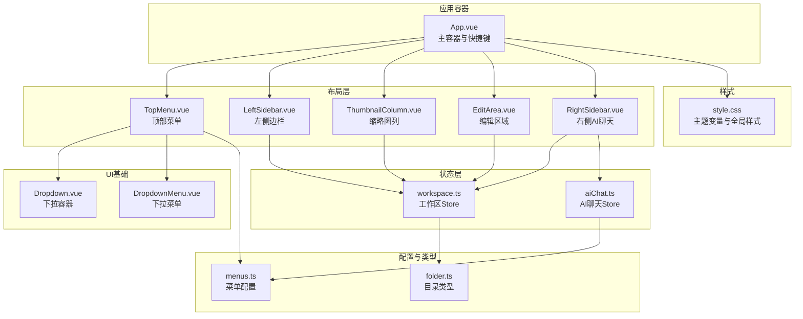
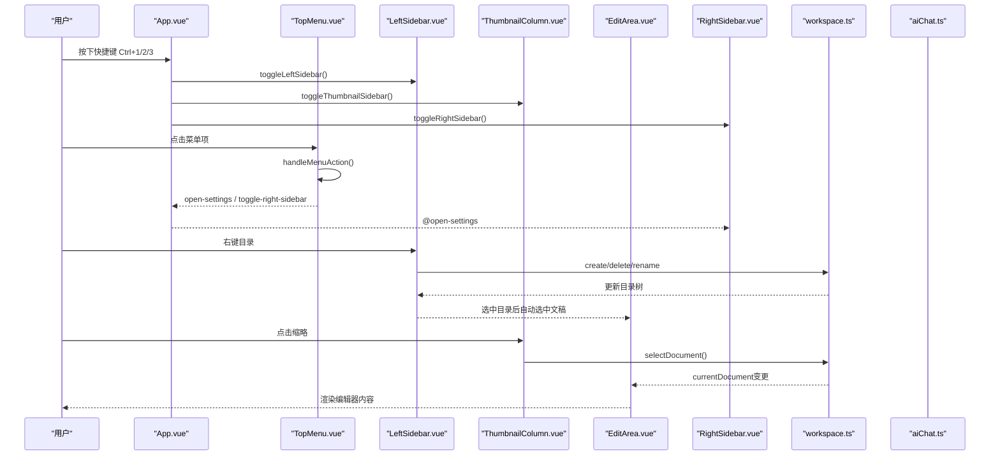
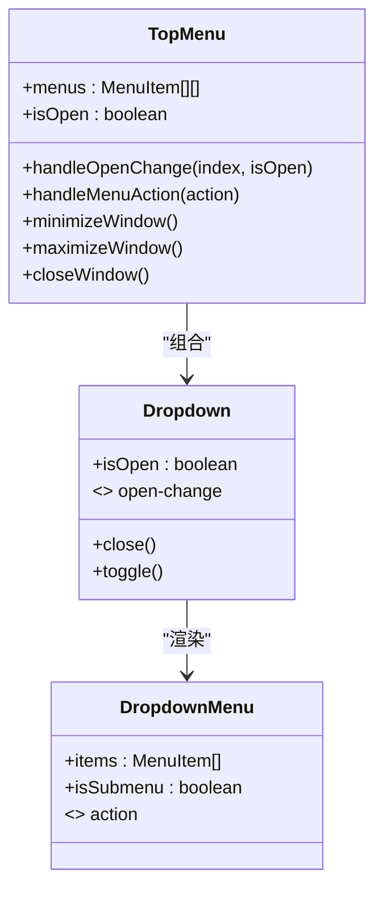
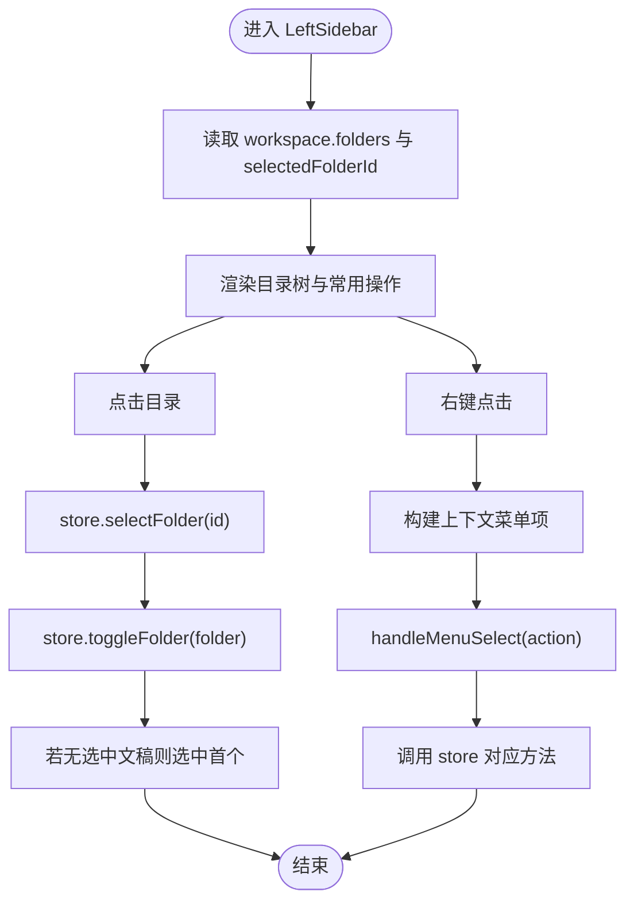
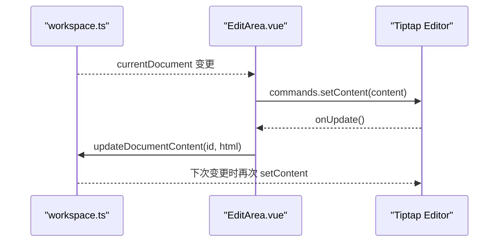
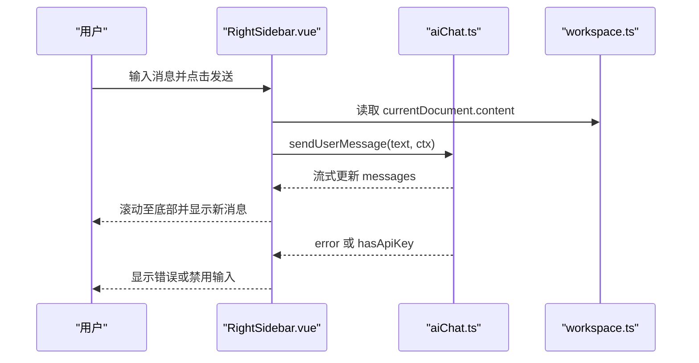
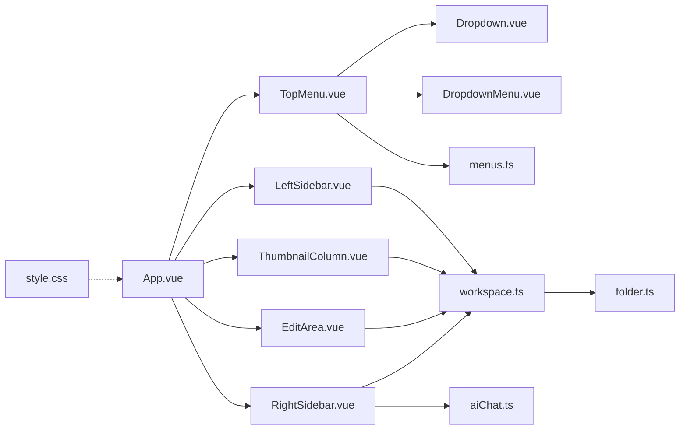

# 布局组件系统

<cite>
**本文档引用的文件**
- [App.vue](file://app/src/App.vue)
- [TopMenu.vue](file://app/src/components/layout/TopMenu.vue)
- [LeftSidebar.vue](file://app/src/components/layout/LeftSidebar.vue)
- [ThumbnailColumn.vue](file://app/src/components/layout/ThumbnailColumn.vue)
- [EditArea.vue](file://app/src/components/layout/EditArea.vue)
- [RightSidebar.vue](file://app/src/components/layout/RightSidebar.vue)
- [Dropdown.vue](file://app/src/components/ui/Dropdown.vue)
- [DropdownMenu.vue](file://app/src/components/ui/DropdownMenu.vue)
- [workspace.ts](file://app/src/stores/workspace.ts)
- [aiChat.ts](file://app/src/stores/aiChat.ts)
- [menus.ts](file://app/src/config/menus.ts)
- [folder.ts](file://app/src/types/folder.ts)
- [style.css](file://app/src/style.css)
</cite>

## 目录
1. [简介](#简介)
2. [项目结构](#项目结构)
3. [核心组件](#核心组件)
4. [架构总览](#架构总览)
5. [详细组件分析](#详细组件分析)
6. [依赖关系分析](#依赖关系分析)
7. [性能考虑](#性能考虑)
8. [故障排查指南](#故障排查指南)
9. [结论](#结论)
10. [附录](#附录)

## 简介
本文件面向Woo应用的布局组件系统，围绕三栏布局（左侧边栏、中央编辑区、右侧边栏）与顶部菜单进行深入技术解析。文档覆盖组件职责、数据流、事件处理、组件协作、响应式设计与主题适配、可扩展性与定制化方案，并提供使用示例与集成指南，帮助开发者快速理解与高效扩展这些布局组件。

## 项目结构
Woo采用基于功能域的组件组织方式，布局相关组件集中在 app/src/components/layout 目录，通用UI组件位于 app/src/components/ui，状态管理通过 Pinia Store 实现，主题与全局样式位于 app/src/style.css。

图表来源
- [App.vue:1-131](file://app/src/App.vue#L1-L131)
- [TopMenu.vue:1-262](file://app/src/components/layout/TopMenu.vue#L1-L262)
- [LeftSidebar.vue:1-204](file://app/src/components/layout/LeftSidebar.vue#L1-L204)
- [ThumbnailColumn.vue:1-128](file://app/src/components/layout/ThumbnailColumn.vue#L1-L128)
- [EditArea.vue:1-463](file://app/src/components/layout/EditArea.vue#L1-L463)
- [RightSidebar.vue:1-432](file://app/src/components/layout/RightSidebar.vue#L1-L432)
- [Dropdown.vue:1-88](file://app/src/components/ui/Dropdown.vue#L1-L88)
- [DropdownMenu.vue:1-115](file://app/src/components/ui/DropdownMenu.vue#L1-L115)
- [workspace.ts:1-321](file://app/src/stores/workspace.ts#L1-L321)
- [aiChat.ts:1-199](file://app/src/stores/aiChat.ts#L1-L199)
- [menus.ts:1-103](file://app/src/config/menus.ts#L1-L103)
- [folder.ts:1-19](file://app/src/types/folder.ts#L1-L19)
- [style.css:1-286](file://app/src/style.css#L1-L286)

章节来源
- [App.vue:1-131](file://app/src/App.vue#L1-L131)

## 核心组件
- 顶部菜单 TopMenu：提供应用级菜单、窗口控制按钮、主题切换与快捷键入口，负责与左右侧栏的开关联动。
- 左侧边栏 LeftSidebar：文件夹树导航与目录右键菜单，支持创建/删除/重命名目录，驱动工作区Store。
- 缩略图列 ThumbnailColumn：展示当前目录下的文稿缩略，支持选中切换至编辑区。
- 编辑区域 EditArea：基于 Tiptap 的富文本编辑器，负责内容渲染、快捷键、字数/行数统计与与Store双向同步。
- 右侧边栏 RightSidebar：AI聊天交互区，支持模型选择、消息流式输出、输入自动高度、错误提示与快捷操作。

章节来源
- [TopMenu.vue:1-262](file://app/src/components/layout/TopMenu.vue#L1-L262)
- [LeftSidebar.vue:1-204](file://app/src/components/layout/LeftSidebar.vue#L1-L204)
- [ThumbnailColumn.vue:1-128](file://app/src/components/layout/ThumbnailColumn.vue#L1-L128)
- [EditArea.vue:1-463](file://app/src/components/layout/EditArea.vue#L1-L463)
- [RightSidebar.vue:1-432](file://app/src/components/layout/RightSidebar.vue#L1-L432)

## 架构总览
整体采用“容器-组件-Store”的分层架构：
- 容器层：App.vue 负责布局容器、快捷键与侧栏状态管理。
- 组件层：TopMenu、LeftSidebar、ThumbnailColumn、EditArea、RightSidebar 各司其职，通过事件与Store进行解耦协作。
- 状态层：Pinia Store 提供工作区与AI聊天的状态与业务逻辑。
- UI基础层：Dropdown/DropdownMenu 提供菜单体系的基础能力。
- 配置与类型：menus.ts 定义菜单结构；folder.ts 定义目录树类型。
- 样式层：style.css 提供主题变量与全局样式，支持明暗主题切换。

图表来源
- [App.vue:79-114](file://app/src/App.vue#L79-L114)
- [TopMenu.vue:153-169](file://app/src/components/layout/TopMenu.vue#L153-L169)
- [LeftSidebar.vue:69-132](file://app/src/components/layout/LeftSidebar.vue#L69-L132)
- [ThumbnailColumn.vue:41-54](file://app/src/components/layout/ThumbnailColumn.vue#L41-L54)
- [EditArea.vue:151-164](file://app/src/components/layout/EditArea.vue#L151-L164)
- [RightSidebar.vue:120-129](file://app/src/components/layout/RightSidebar.vue#L120-L129)
- [workspace.ts:155-183](file://app/src/stores/workspace.ts#L155-L183)
- [workspace.ts:171-174](file://app/src/stores/workspace.ts#L171-L174)
- [aiChat.ts:73-169](file://app/src/stores/aiChat.ts#L73-L169)

## 详细组件分析

### TopMenu 顶部菜单
- 功能职责
  - 渲染多级菜单（文件、编辑、AI、标记、查看、帮助），使用 Dropdown/DropdownMenu 组合实现。
  - 提供窗口控制按钮（最小化、最大化、关闭）、主题切换、账户入口。
  - 通过事件向上抛出侧栏开关、设置打开、登录打开、顶部菜单开关等信号。
  - 通过 Electron API 实现窗口控制与外部链接打开。
- 数据流
  - 菜单配置来自 menus.ts，运行时组合为 TopMenu.menus。
  - Dropdown 组件维护 isOpen 状态并通过 open-change 事件通知父组件，实现“同一时间仅一个下拉打开”。
- 事件处理
  - handleMenuAction 根据 action 分发 open-settings、toggle-right-sidebar 或打开外部链接。
  - toggle-* 事件用于控制侧栏与顶部菜单显隐。
- 响应式与主题
  - 使用 CSS 变量实现主题切换，折叠时通过过渡动画隐藏。
- 插槽与样式
  - 通过具名插槽承载菜单触发器与菜单项内容。
  - 样式使用 scoped 与全局样式结合，支持拖拽区域与按钮悬停态。

图表来源
- [TopMenu.vue:76-169](file://app/src/components/layout/TopMenu.vue#L76-L169)
- [Dropdown.vue:17-34](file://app/src/components/ui/Dropdown.vue#L17-L34)
- [DropdownMenu.vue:48-61](file://app/src/components/ui/DropdownMenu.vue#L48-L61)

章节来源
- [TopMenu.vue:1-262](file://app/src/components/layout/TopMenu.vue#L1-L262)
- [Dropdown.vue:1-88](file://app/src/components/ui/Dropdown.vue#L1-L88)
- [DropdownMenu.vue:1-115](file://app/src/components/ui/DropdownMenu.vue#L1-L115)
- [menus.ts:1-103](file://app/src/config/menus.ts#L1-L103)

### LeftSidebar 左侧边栏
- 功能职责
  - 提供常用操作（新建文档、搜索、草稿箱、废纸篓）与目录树导航。
  - 支持目录右键菜单：创建同级/子级目录、删除、重命名。
  - 与工作区Store交互，实现目录选中、展开/折叠、文稿自动选中。
- 数据流
  - 从 workspace.ts 读取 folders 与 selectedFolderId，渲染目录树。
  - 通过事件（folder-select、rename、context-menu）与父组件通信。
- 事件处理
  - handleFolderSelect：选中目录并切换展开状态。
  - handleContextMenu/handleFolderContextMenu：根据目标类型生成上下文菜单项。
  - handleMenuSelect：根据 action 调用 workspace.ts 的相应方法。
- 响应式与主题
  - 通过 CSS 变量与过渡动画实现宽度与透明度的平滑切换。
- 插槽与样式
  - 使用 :deep 选择器统一图标尺寸与颜色。
  - 分隔线与悬浮态提升可读性。

图表来源
- [LeftSidebar.vue:69-132](file://app/src/components/layout/LeftSidebar.vue#L69-L132)
- [workspace.ts:155-188](file://app/src/stores/workspace.ts#L155-L188)

章节来源
- [LeftSidebar.vue:1-204](file://app/src/components/layout/LeftSidebar.vue#L1-L204)
- [workspace.ts:1-321](file://app/src/stores/workspace.ts#L1-L321)
- [folder.ts:1-19](file://app/src/types/folder.ts#L1-L19)

### ThumbnailColumn 缩略图列
- 功能职责
  - 展示当前目录下的文稿列表，提供预览文本与选中态高亮。
  - 根据是否有目录/文稿显示不同空状态提示。
- 数据流
  - 从 workspace.ts 读取 currentFolderDocuments 并排序。
  - 通过点击事件触发 selectDocument，进而驱动 EditArea 内容更新。
- 事件处理
  - handleSelectDocument：调用 store.selectDocument(docId)。
- 响应式与主题
  - 与 LeftSidebar 一致的主题变量与过渡动画。
- 插槽与样式
  - 使用 -webkit-line-clamp 控制预览文本行数，提升信息密度。

章节来源
- [ThumbnailColumn.vue:1-128](file://app/src/components/layout/ThumbnailColumn.vue#L1-L128)
- [workspace.ts:139-151](file://app/src/stores/workspace.ts#L139-L151)

### EditArea 编辑区域
- 功能职责
  - 基于 Tiptap 的富文本编辑器，支持标题、列表、任务列表、引用、代码块、高亮、分割线等 Markdown 扩展。
  - 提供状态栏：当前块类型、字数统计、行数统计与快捷键提示。
  - 与 workspace.ts 双向同步：监听 currentDocument 变化加载内容，监听编辑器更新写回 Store。
- 数据流
  - 初始化编辑器并注册自定义快捷键扩展。
  - 监听 store.currentDocument，使用防抖标记避免 setContent 导致 onUpdate 循环写回。
- 事件处理
  - onUpdate：当 isSettingContent 为 false 时，将 HTML 内容写回 Store。
  - 键盘快捷键：Shift+Alt+1~6 设置标题、Ctrl+0 正文、Ctrl+Shift+H/O/L/T/Q/C/X 等。
- 性能与体验
  - 防抖标记 isSettingContent：在 watch 中设置内容时临时设为 true，onUpdate 时跳过写回。
  - 状态栏实时计算：currentBlock、wordCount、lineCount。
- 插槽与样式
  - 使用全局样式定义编辑器内容的排版与高亮，保证 v-html 内容一致性。

图表来源
- [EditArea.vue:46-116](file://app/src/components/layout/EditArea.vue#L46-L116)
- [EditArea.vue:151-164](file://app/src/components/layout/EditArea.vue#L151-L164)
- [workspace.ts:176-183](file://app/src/stores/workspace.ts#L176-L183)

章节来源
- [EditArea.vue:1-463](file://app/src/components/layout/EditArea.vue#L1-L463)
- [workspace.ts:1-321](file://app/src/stores/workspace.ts#L1-L321)

### RightSidebar 右侧边栏
- 功能职责
  - AI 聊天交互区：模型选择、消息列表、输入区域、快捷操作、错误提示与 API Key 未配置提示。
  - 支持流式输出与取消生成，自动滚动至底部。
- 数据流
  - 从 aiChat.ts 读取 messages、selectedModelId、isStreaming、error。
  - 将当前文档内容作为上下文注入首次消息，后续保持对话历史。
- 事件处理
  - handleSend：收集输入文本与文档上下文，调用 aiChat.sendUserMessage。
  - handleKeyDown：Enter 发送，Shift+Enter 换行。
  - autoResize/resetTextareaHeight：输入框自适应高度。
  - watch(messages.length) 与 watch(lastMessage.content)：智能滚动至底部。
- 响应式与主题
  - 与编辑器一致的主题变量，支持明暗主题下的错误与高亮提示。
- 插槽与样式
  - 使用全局样式定义消息内容的 Markdown 渲染样式。

图表来源
- [RightSidebar.vue:120-184](file://app/src/components/layout/RightSidebar.vue#L120-L184)
- [aiChat.ts:73-169](file://app/src/stores/aiChat.ts#L73-L169)
- [workspace.ts:147-151](file://app/src/stores/workspace.ts#L147-L151)

章节来源
- [RightSidebar.vue:1-432](file://app/src/components/layout/RightSidebar.vue#L1-L432)
- [aiChat.ts:1-199](file://app/src/stores/aiChat.ts#L1-L199)
- [workspace.ts:1-321](file://app/src/stores/workspace.ts#L1-L321)

## 依赖关系分析
- 组件耦合
  - App.vue 作为布局容器，直接持有各侧栏状态与快捷键处理，耦合度较低，便于扩展。
  - TopMenu 依赖 Dropdown/DropdownMenu 与 menus.ts，形成菜单体系。
  - LeftSidebar/ThumbnailColumn/EditArea/RightSidebar 通过 Pinia Store 解耦，降低相互依赖。
- 外部依赖
  - Tiptap：富文本编辑器与扩展生态。
  - Electron API：窗口控制与外部链接打开。
  - localStorage：AI API Key 存储。
- 潜在循环依赖
  - 未发现循环依赖，组件间通过事件与Store单向流动。

图表来源
- [App.vue:1-131](file://app/src/App.vue#L1-L131)
- [TopMenu.vue:1-262](file://app/src/components/layout/TopMenu.vue#L1-L262)
- [LeftSidebar.vue:1-204](file://app/src/components/layout/LeftSidebar.vue#L1-L204)
- [ThumbnailColumn.vue:1-128](file://app/src/components/layout/ThumbnailColumn.vue#L1-L128)
- [EditArea.vue:1-463](file://app/src/components/layout/EditArea.vue#L1-L463)
- [RightSidebar.vue:1-432](file://app/src/components/layout/RightSidebar.vue#L1-L432)
- [Dropdown.vue:1-88](file://app/src/components/ui/Dropdown.vue#L1-L88)
- [DropdownMenu.vue:1-115](file://app/src/components/ui/DropdownMenu.vue#L1-L115)
- [workspace.ts:1-321](file://app/src/stores/workspace.ts#L1-L321)
- [aiChat.ts:1-199](file://app/src/stores/aiChat.ts#L1-L199)
- [menus.ts:1-103](file://app/src/config/menus.ts#L1-L103)
- [folder.ts:1-19](file://app/src/types/folder.ts#L1-L19)
- [style.css:1-286](file://app/src/style.css#L1-L286)

章节来源
- [App.vue:1-131](file://app/src/App.vue#L1-L131)

## 性能考虑
- 防抖写回：EditArea 在 watch 中设置 isSettingContent 防止 setContent 触发 onUpdate 写回，避免死循环。
- 滚动优化：RightSidebar 使用阈值判断与 nextTick 优化滚动至底部，减少不必要的 DOM 操作。
- 主题切换：CSS 变量驱动主题切换，避免频繁重绘。
- 列表渲染：ThumbnailColumn 使用 -webkit-line-clamp 控制预览文本，减少 DOM 节点数量。
- 事件监听：App.vue 在卸载时移除键盘事件监听，防止内存泄漏。

## 故障排查指南
- 编辑器内容不更新
  - 检查 EditArea 的 isSettingContent 防抖标记是否被正确设置与复位。
  - 确认 store.currentDocument 是否存在且内容已变更。
- 右侧AI聊天无法发送
  - 检查 aiChat.hasApiKey 是否为真，确认 API Key 已保存。
  - 查看 error 是否存在，关注 AbortError 场景。
- 目录右键菜单无效
  - 确认 handleContextMenu/handleFolderContextMenu 的事件绑定与位置计算。
  - 检查 ContextMenu 组件的 position 与 items 是否正确传入。
- 主题切换异常
  - 确认 data-theme 属性是否正确设置到 <html>，检查 style.css 中的主题变量是否生效。

章节来源
- [EditArea.vue:43-44](file://app/src/components/layout/EditArea.vue#L43-L44)
- [EditArea.vue:110-115](file://app/src/components/layout/EditArea.vue#L110-L115)
- [RightSidebar.vue:120-129](file://app/src/components/layout/RightSidebar.vue#L120-L129)
- [aiChat.ts:33-35](file://app/src/stores/aiChat.ts#L33-L35)
- [LeftSidebar.vue:76-102](file://app/src/components/layout/LeftSidebar.vue#L76-L102)
- [style.css:6-142](file://app/src/style.css#L6-L142)

## 结论
Woo布局组件系统以清晰的职责划分与Pinia状态管理实现了高内聚低耦合的三栏布局。组件通过事件与Store解耦协作，配合Dropdown菜单体系与主题变量，提供了良好的可扩展性与用户体验。建议在扩展新功能时遵循现有事件与Store契约，保持组件单一职责与样式变量化。

## 附录

### 组件 Props 接口定义
- TopMenu
  - isOpen?: boolean
- LeftSidebar
  - isOpen: boolean
- ThumbnailColumn
  - isOpen: boolean
- RightSidebar
  - isOpen: boolean

章节来源
- [TopMenu.vue:91-96](file://app/src/components/layout/TopMenu.vue#L91-L96)
- [LeftSidebar.vue:54-58](file://app/src/components/layout/LeftSidebar.vue#L54-L58)
- [ThumbnailColumn.vue:33-37](file://app/src/components/layout/ThumbnailColumn.vue#L33-L37)
- [RightSidebar.vue:92-96](file://app/src/components/layout/RightSidebar.vue#L92-L96)

### 事件发射规范
- TopMenu
  - toggle-left-sidebar
  - toggle-thumbnail-sidebar
  - toggle-right-sidebar
  - open-settings
  - open-login
  - toggle-top-menu
- LeftSidebar
  - context-menu
  - folder-select
  - rename
- RightSidebar
  - open-settings

章节来源
- [TopMenu.vue:124-131](file://app/src/components/layout/TopMenu.vue#L124-L131)
- [LeftSidebar.vue:26-29](file://app/src/components/layout/LeftSidebar.vue#L26-L29)
- [RightSidebar.vue:97](file://app/src/components/layout/RightSidebar.vue#L97)

### 插槽使用方式
- TopMenu/Dropdown/DropdownMenu
  - 通过具名插槽承载触发器与菜单项内容，支持 HTML 内容注入。
- EditArea
  - 使用 EditorContent 渲染编辑器内容，无需额外插槽。

章节来源
- [Dropdown.vue:3-11](file://app/src/components/ui/Dropdown.vue#L3-L11)
- [DropdownMenu.vue:1-40](file://app/src/components/ui/DropdownMenu.vue#L1-L40)
- [EditArea.vue:4-11](file://app/src/components/layout/EditArea.vue#L4-L11)

### 样式定制选项
- 主题变量：通过 style.css 的 :root 与 [data-theme="dark"/"light"] 定义，覆盖背景、文字、强调色、编辑器与滚动条等。
- 组件样式：各组件使用 scoped CSS，必要时通过 :deep 选择器穿透图标与内部元素。
- 全局样式：编辑器与消息内容的 Markdown 渲染样式位于全局样式中。

章节来源
- [style.css:6-142](file://app/src/style.css#L6-L142)
- [LeftSidebar.vue:183-188](file://app/src/components/layout/LeftSidebar.vue#L183-L188)
- [EditArea.vue:257-462](file://app/src/components/layout/EditArea.vue#L257-L462)
- [RightSidebar.vue:187-431](file://app/src/components/layout/RightSidebar.vue#L187-L431)

### 使用示例与集成指南
- 在 App.vue 中引入并渲染各布局组件，初始化主题与侧栏状态。
- 通过 App.vue 的 toggle 方法控制侧栏显隐，并绑定键盘快捷键。
- 在 TopMenu 中通过事件与 App.vue 通信，实现侧栏与设置打开。
- 在 LeftSidebar 中通过 store 与 EditArea 协作，实现目录与文稿的联动。
- 在 RightSidebar 中通过 aiChat.store 与 workspace.store 协作，实现上下文注入与流式输出。

章节来源
- [App.vue:1-131](file://app/src/App.vue#L1-L131)
- [TopMenu.vue:153-169](file://app/src/components/layout/TopMenu.vue#L153-L169)
- [LeftSidebar.vue:69-132](file://app/src/components/layout/LeftSidebar.vue#L69-L132)
- [EditArea.vue:151-164](file://app/src/components/layout/EditArea.vue#L151-L164)
- [RightSidebar.vue:120-129](file://app/src/components/layout/RightSidebar.vue#L120-L129)