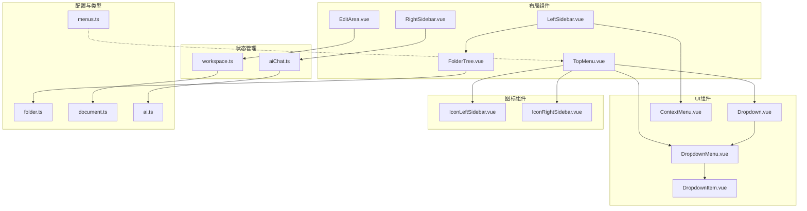
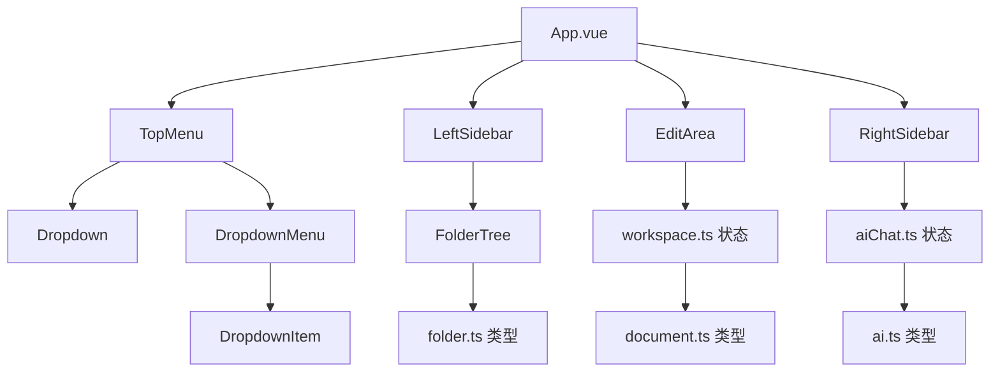
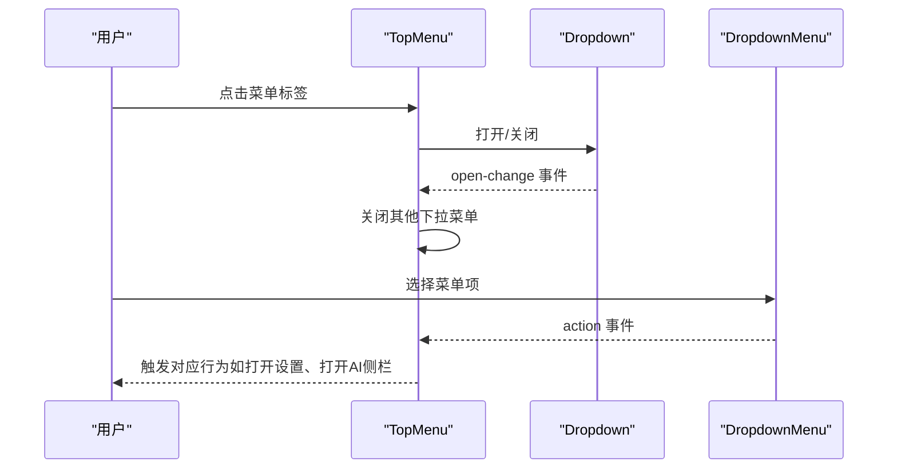
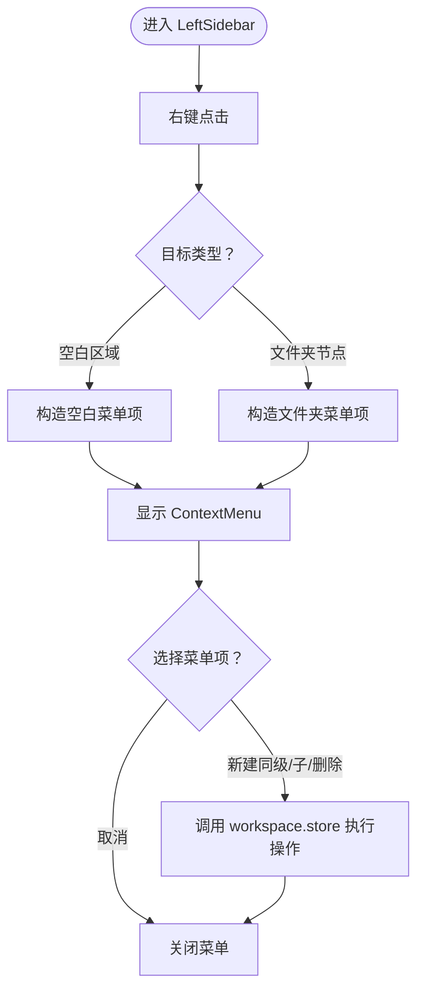
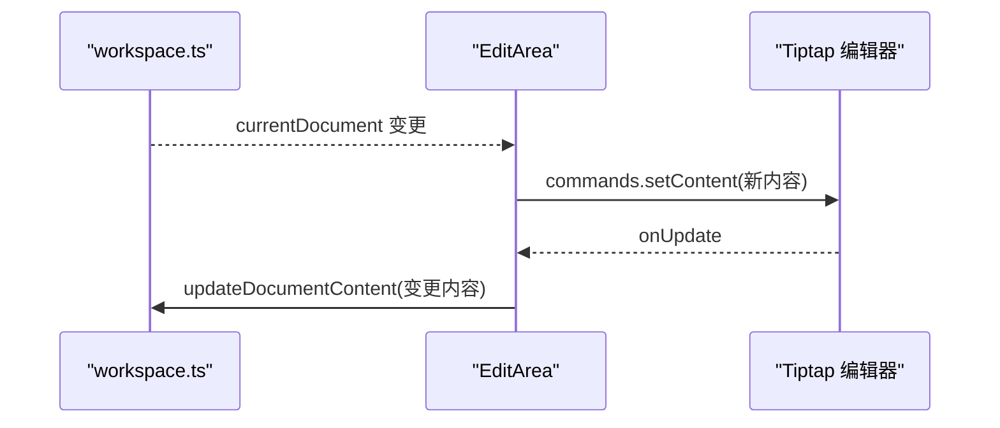
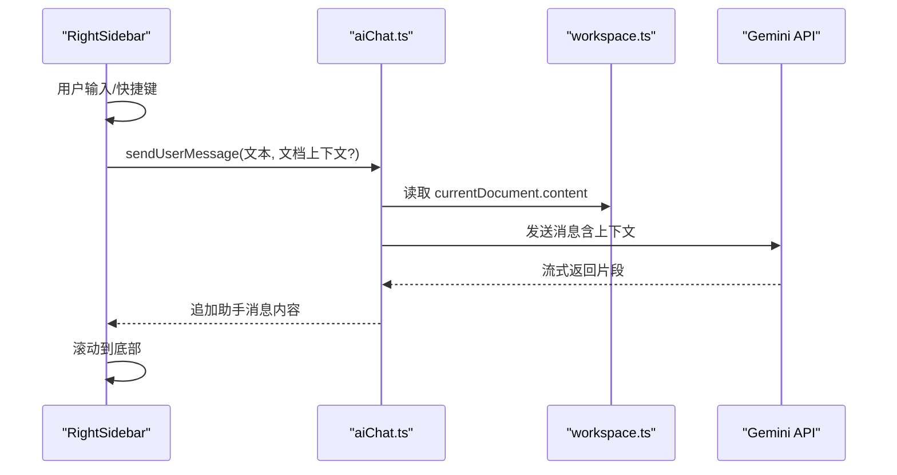
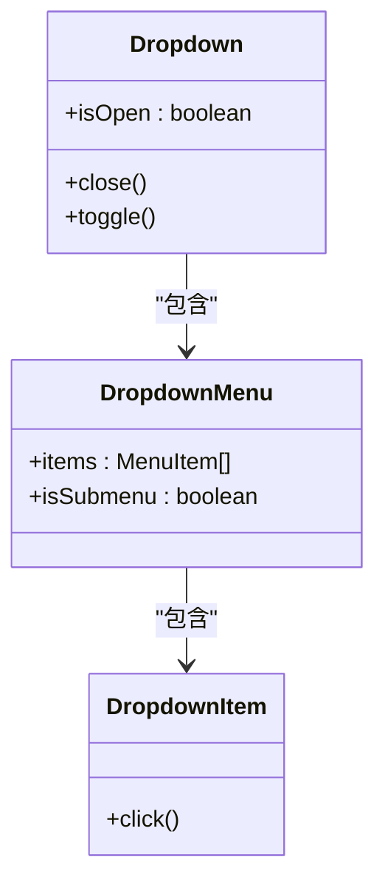
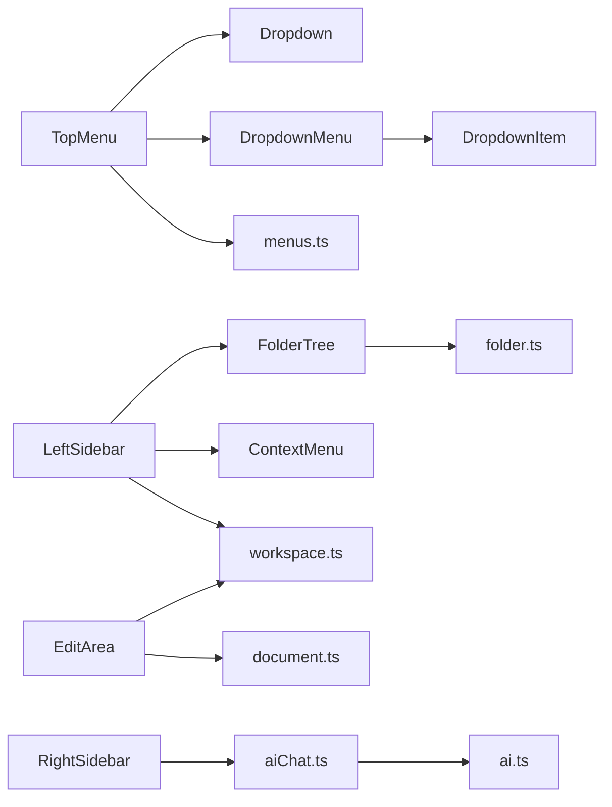

# 组件系统设计

<cite>
**本文档引用的文件**
- [TopMenu.vue](file://app/src/components/layout/TopMenu.vue)
- [LeftSidebar.vue](file://app/src/components/layout/LeftSidebar.vue)
- [EditArea.vue](file://app/src/components/layout/EditArea.vue)
- [RightSidebar.vue](file://app/src/components/layout/RightSidebar.vue)
- [FolderTree.vue](file://app/src/components/layout/FolderTree.vue)
- [Dropdown.vue](file://app/src/components/ui/Dropdown.vue)
- [DropdownMenu.vue](file://app/src/components/ui/DropdownMenu.vue)
- [DropdownItem.vue](file://app/src/components/ui/DropdownItem.vue)
- [ContextMenu.vue](file://app/src/components/ui/ContextMenu.vue)
- [menus.ts](file://app/src/config/menus.ts)
- [workspace.ts](file://app/src/stores/workspace.ts)
- [aiChat.ts](file://app/src/stores/aiChat.ts)
- [folder.ts](file://app/src/types/folder.ts)
- [document.ts](file://app/src/types/document.ts)
- [ai.ts](file://app/src/types/ai.ts)
- [IconLeftSidebar.vue](file://app/src/components/icons/IconLeftSidebar.vue)
- [IconRightSidebar.vue](file://app/src/components/icons/IconRightSidebar.vue)
</cite>

## 目录
1. [简介](#简介)
2. [项目结构](#项目结构)
3. [核心组件](#核心组件)
4. [架构总览](#架构总览)
5. [组件详解](#组件详解)
6. [依赖关系分析](#依赖关系分析)
7. [性能考量](#性能考量)
8. [故障排查指南](#故障排查指南)
9. [结论](#结论)
10. [附录](#附录)

## 简介
本设计文档面向Woo前端组件系统，聚焦于组件化架构与实现细节，覆盖布局组件（TopMenu、LeftSidebar、EditArea、RightSidebar）的功能职责与交互模式；统一的图标组件系统设计规范与使用方法；UI组件库（Dropdown、ContextMenu等）的设计原则与扩展机制；组件间通信模式（props传递、事件处理、插槽使用）、最佳实践（命名规范、样式组织、可复用性设计），以及具体使用示例与集成指南。

## 项目结构
Woo采用按功能域分层的组件组织方式：
- 布局组件位于 layout 目录，负责页面骨架与区域划分
- UI 组件位于 ui 目录，提供通用交互控件
- 图标组件位于 icons 目录，统一视觉语言
- 配置与类型定义分别位于 config 与 types 目录
- 状态管理位于 stores 目录，通过 Pinia 提供跨组件状态共享

**图表来源**
- [TopMenu.vue:1-264](file://app/src/components/layout/TopMenu.vue#L1-L264)
- [LeftSidebar.vue:1-204](file://app/src/components/layout/LeftSidebar.vue#L1-L204)
- [EditArea.vue:1-463](file://app/src/components/layout/EditArea.vue#L1-L463)
- [RightSidebar.vue:1-432](file://app/src/components/layout/RightSidebar.vue#L1-L432)
- [FolderTree.vue:1-49](file://app/src/components/layout/FolderTree.vue#L1-L49)
- [Dropdown.vue:1-88](file://app/src/components/ui/Dropdown.vue#L1-L88)
- [DropdownMenu.vue:1-115](file://app/src/components/ui/DropdownMenu.vue#L1-L115)
- [DropdownItem.vue:1-26](file://app/src/components/ui/DropdownItem.vue#L1-L26)
- [ContextMenu.vue:1-111](file://app/src/components/ui/ContextMenu.vue#L1-L111)
- [menus.ts:1-103](file://app/src/config/menus.ts#L1-L103)
- [workspace.ts:1-321](file://app/src/stores/workspace.ts#L1-L321)
- [aiChat.ts:1-199](file://app/src/stores/aiChat.ts#L1-L199)
- [folder.ts:1-19](file://app/src/types/folder.ts#L1-L19)
- [document.ts:1-9](file://app/src/types/document.ts#L1-L9)
- [ai.ts:1-20](file://app/src/types/ai.ts#L1-L20)
- [IconLeftSidebar.vue:1-28](file://app/src/components/icons/IconLeftSidebar.vue#L1-L28)
- [IconRightSidebar.vue:1-28](file://app/src/components/icons/IconRightSidebar.vue#L1-L28)

**章节来源**
- [TopMenu.vue:1-264](file://app/src/components/layout/TopMenu.vue#L1-L264)
- [LeftSidebar.vue:1-204](file://app/src/components/layout/LeftSidebar.vue#L1-L204)
- [EditArea.vue:1-463](file://app/src/components/layout/EditArea.vue#L1-L463)
- [RightSidebar.vue:1-432](file://app/src/components/layout/RightSidebar.vue#L1-L432)
- [FolderTree.vue:1-49](file://app/src/components/layout/FolderTree.vue#L1-L49)
- [Dropdown.vue:1-88](file://app/src/components/ui/Dropdown.vue#L1-L88)
- [DropdownMenu.vue:1-115](file://app/src/components/ui/DropdownMenu.vue#L1-L115)
- [DropdownItem.vue:1-26](file://app/src/components/ui/DropdownItem.vue#L1-L26)
- [ContextMenu.vue:1-111](file://app/src/components/ui/ContextMenu.vue#L1-L111)
- [menus.ts:1-103](file://app/src/config/menus.ts#L1-L103)
- [workspace.ts:1-321](file://app/src/stores/workspace.ts#L1-L321)
- [aiChat.ts:1-199](file://app/src/stores/aiChat.ts#L1-L199)
- [folder.ts:1-19](file://app/src/types/folder.ts#L1-L19)
- [document.ts:1-9](file://app/src/types/document.ts#L1-L9)
- [ai.ts:1-20](file://app/src/types/ai.ts#L1-L20)
- [IconLeftSidebar.vue:1-28](file://app/src/components/icons/IconLeftSidebar.vue#L1-L28)
- [IconRightSidebar.vue:1-28](file://app/src/components/icons/IconRightSidebar.vue#L1-L28)

## 核心组件
- 布局组件：TopMenu（顶部菜单栏）、LeftSidebar（左侧边栏）、EditArea（编辑区）、RightSidebar（右侧AI聊天）
- UI组件：Dropdown（下拉容器）、DropdownMenu（菜单容器）、DropdownItem（菜单项）、ContextMenu（上下文菜单）
- 图标组件：IconLeftSidebar、IconRightSidebar 等，统一尺寸与描边规范
- 配置与类型：menus.ts 定义菜单项结构，folder.ts/document.ts/ai.ts 定义领域类型
- 状态管理：workspace.ts 管理工作区数据与操作，aiChat.ts 管理AI聊天会话

**章节来源**
- [TopMenu.vue:50-184](file://app/src/components/layout/TopMenu.vue#L50-L184)
- [LeftSidebar.vue:43-133](file://app/src/components/layout/LeftSidebar.vue#L43-L133)
- [EditArea.vue:28-174](file://app/src/components/layout/EditArea.vue#L28-L174)
- [RightSidebar.vue:85-185](file://app/src/components/layout/RightSidebar.vue#L85-L185)
- [Dropdown.vue:14-53](file://app/src/components/ui/Dropdown.vue#L14-L53)
- [DropdownMenu.vue:42-62](file://app/src/components/ui/DropdownMenu.vue#L42-L62)
- [DropdownItem.vue:7-11](file://app/src/components/ui/DropdownItem.vue#L7-L11)
- [ContextMenu.vue:19-80](file://app/src/components/ui/ContextMenu.vue#L19-L80)
- [menus.ts:1-103](file://app/src/config/menus.ts#L1-L103)
- [workspace.ts:6-321](file://app/src/stores/workspace.ts#L6-L321)
- [aiChat.ts:8-199](file://app/src/stores/aiChat.ts#L8-L199)
- [folder.ts:1-19](file://app/src/types/folder.ts#L1-L19)
- [document.ts:1-9](file://app/src/types/document.ts#L1-L9)
- [ai.ts:1-20](file://app/src/types/ai.ts#L1-L20)

## 架构总览
整体采用“布局组件承载区域、UI组件提供交互、状态管理集中维护”的分层架构。布局组件通过事件与插槽与UI组件协作，状态管理通过Pinia在组件间共享数据与行为。

**图表来源**
- [TopMenu.vue:1-264](file://app/src/components/layout/TopMenu.vue#L1-L264)
- [LeftSidebar.vue:1-204](file://app/src/components/layout/LeftSidebar.vue#L1-L204)
- [EditArea.vue:1-463](file://app/src/components/layout/EditArea.vue#L1-L463)
- [RightSidebar.vue:1-432](file://app/src/components/layout/RightSidebar.vue#L1-L432)
- [FolderTree.vue:1-49](file://app/src/components/layout/FolderTree.vue#L1-L49)
- [Dropdown.vue:1-88](file://app/src/components/ui/Dropdown.vue#L1-L88)
- [DropdownMenu.vue:1-115](file://app/src/components/ui/DropdownMenu.vue#L1-L115)
- [DropdownItem.vue:1-26](file://app/src/components/ui/DropdownItem.vue#L1-L26)
- [workspace.ts:1-321](file://app/src/stores/workspace.ts#L1-L321)
- [aiChat.ts:1-199](file://app/src/stores/aiChat.ts#L1-L199)
- [folder.ts:1-19](file://app/src/types/folder.ts#L1-L19)
- [document.ts:1-9](file://app/src/types/document.ts#L1-L9)
- [ai.ts:1-20](file://app/src/types/ai.ts#L1-L20)

## 组件详解

### 布局组件：TopMenu（顶部菜单栏）
- 功能职责
  - 左侧：文件、编辑、AI、标记、查看、帮助等菜单，使用 Dropdown + DropdownMenu 实现
  - 右侧：窗口控制按钮（最小化、最大化、关闭）、主题切换、账户入口、侧栏开关
  - 快捷键支持：Ctrl+` 切换菜单栏显隐
- 交互模式
  - 通过 open-change 事件保证同一时刻仅有一个下拉菜单处于打开状态
  - 通过 emit 向父组件传递侧栏开关、设置打开、登录打开等事件
- 设计要点
  - 使用 Electron API 控制窗口行为
  - 菜单项来源于 menus.ts 的配置，支持子菜单与分隔线

**图表来源**
- [TopMenu.vue:113-184](file://app/src/components/layout/TopMenu.vue#L113-L184)
- [Dropdown.vue:18-35](file://app/src/components/ui/Dropdown.vue#L18-L35)
- [DropdownMenu.vue:59-62](file://app/src/components/ui/DropdownMenu.vue#L59-L62)

**章节来源**
- [TopMenu.vue:50-184](file://app/src/components/layout/TopMenu.vue#L50-L184)
- [menus.ts:1-103](file://app/src/config/menus.ts#L1-L103)
- [Dropdown.vue:14-53](file://app/src/components/ui/Dropdown.vue#L14-L53)
- [DropdownMenu.vue:42-62](file://app/src/components/ui/DropdownMenu.vue#L42-L62)

### 布局组件：LeftSidebar（左侧边栏）
- 功能职责
  - 顶部常用操作（新建文档、搜索、草稿、回收站）
  - 目录树展示与交互：FolderTree
  - 右键菜单：针对空白区域与文件夹节点的不同上下文菜单
- 交互模式
  - 通过 contextmenu 事件计算位置与上下文，渲染 ContextMenu
  - 通过 emit 将 folder-select/rename 等事件向上冒泡
  - 通过 workspace.ts 管理目录树与选中状态

**图表来源**
- [LeftSidebar.vue:62-127](file://app/src/components/layout/LeftSidebar.vue#L62-L127)
- [ContextMenu.vue:36-79](file://app/src/components/ui/ContextMenu.vue#L36-L79)
- [FolderTree.vue:34-44](file://app/src/components/layout/FolderTree.vue#L34-L44)
- [workspace.ts:155-253](file://app/src/stores/workspace.ts#L155-L253)

**章节来源**
- [LeftSidebar.vue:43-133](file://app/src/components/layout/LeftSidebar.vue#L43-L133)
- [FolderTree.vue:16-45](file://app/src/components/layout/FolderTree.vue#L16-L45)
- [ContextMenu.vue:19-80](file://app/src/components/ui/ContextMenu.vue#L19-L80)
- [workspace.ts:6-321](file://app/src/stores/workspace.ts#L6-L321)
- [folder.ts:1-19](file://app/src/types/folder.ts#L1-L19)

### 布局组件：EditArea（编辑区）
- 功能职责
  - 集成 Tiptap 富文本编辑器，支持 Markdown 语法与扩展
  - 状态栏：显示当前块类型、字数统计、行数统计、快捷键提示
  - 内容双向绑定：监听 store 中当前文档变化，写入编辑器；编辑器变更同步回 store
- 交互模式
  - 自定义快捷键扩展：标题、高亮、列表、任务列表、引用、代码块、删除线、分割线等
  - 防抖写回：通过 isSettingContent 标志避免 setContent 触发 onUpdate 造成反向写回
  - 暴露 editor 实例给父组件使用

**图表来源**
- [EditArea.vue:151-164](file://app/src/components/layout/EditArea.vue#L151-L164)
- [EditArea.vue:110-115](file://app/src/components/layout/EditArea.vue#L110-L115)
- [workspace.ts:176-183](file://app/src/stores/workspace.ts#L176-L183)

**章节来源**
- [EditArea.vue:28-174](file://app/src/components/layout/EditArea.vue#L28-L174)
- [workspace.ts:147-183](file://app/src/stores/workspace.ts#L147-L183)
- [document.ts:1-9](file://app/src/types/document.ts#L1-L9)

### 布局组件：RightSidebar（右侧AI聊天）
- 功能职责
  - 模型选择：从 aiChat.store.availableModels 中读取并切换
  - 聊天消息展示：ChatMessage 列表
  - 输入区域：文本框自动增高、快捷键发送、停止生成
  - 空状态与快捷操作：引导用户快速开始
  - 错误提示与 API Key 未配置提示
- 交互模式
  - 发送消息时携带当前文档上下文（首条消息注入）
  - 流式响应：实时追加助手消息内容
  - 智能滚动：新消息与流式更新时滚动到底部

**图表来源**
- [RightSidebar.vue:120-129](file://app/src/components/layout/RightSidebar.vue#L120-L129)
- [aiChat.ts:73-169](file://app/src/stores/aiChat.ts#L73-L169)
- [workspace.ts:147-151](file://app/src/stores/workspace.ts#L147-L151)

**章节来源**
- [RightSidebar.vue:85-185](file://app/src/components/layout/RightSidebar.vue#L85-L185)
- [aiChat.ts:8-199](file://app/src/stores/aiChat.ts#L8-L199)
- [workspace.ts:147-151](file://app/src/stores/workspace.ts#L147-L151)
- [ai.ts:1-20](file://app/src/types/ai.ts#L1-L20)

### UI组件库：Dropdown 与 DropdownMenu
- 设计原则
  - Dropdown 作为容器，负责触发与外部点击关闭逻辑，并暴露 close/toggle 方法
  - DropdownMenu 支持普通项、分隔线、子菜单，子菜单通过绝对定位在右侧展开
  - DropdownItem 提供统一的悬停态样式
- 扩展机制
  - 通过插槽与事件组合，支持任意内容与动作分发
  - 子菜单通过递归渲染实现多级菜单

**图表来源**
- [Dropdown.vue:14-53](file://app/src/components/ui/Dropdown.vue#L14-L53)
- [DropdownMenu.vue:42-62](file://app/src/components/ui/DropdownMenu.vue#L42-L62)
- [DropdownItem.vue:7-11](file://app/src/components/ui/DropdownItem.vue#L7-L11)

**章节来源**
- [Dropdown.vue:14-53](file://app/src/components/ui/Dropdown.vue#L14-L53)
- [DropdownMenu.vue:42-62](file://app/src/components/ui/DropdownMenu.vue#L42-L62)
- [DropdownItem.vue:7-11](file://app/src/components/ui/DropdownItem.vue#L7-L11)
- [menus.ts:1-103](file://app/src/config/menus.ts#L1-L103)

### UI组件：ContextMenu（上下文菜单）
- 设计原则
  - 接收 position 与 items，计算不越界的位置
  - 点击外部自动关闭
  - 支持禁用项与选择事件回调
- 扩展机制
  - 通过 props 传入任意菜单项集合
  - 通过 select/close 事件与父组件解耦

**章节来源**
- [ContextMenu.vue:19-80](file://app/src/components/ui/ContextMenu.vue#L19-L80)
- [folder.ts:9-19](file://app/src/types/folder.ts#L9-L19)

### 图标组件系统
- 统一规范
  - 所有图标基于 SVG，支持 size 与 strokeWidth 默认值
  - 通过 viewBox="0 0 24 24" 保持一致画布
- 使用方法
  - 在布局组件中直接引入图标组件，作为按钮或列表项的视觉元素
  - 通过 props 调整尺寸与描边，满足不同场景需求

**章节来源**
- [IconLeftSidebar.vue:15-27](file://app/src/components/icons/IconLeftSidebar.vue#L15-L27)
- [IconRightSidebar.vue:15-27](file://app/src/components/icons/IconRightSidebar.vue#L15-L27)
- [TopMenu.vue:52-60](file://app/src/components/layout/TopMenu.vue#L52-L60)

## 依赖关系分析
- 组件耦合
  - TopMenu 依赖 Dropdown/DropdownMenu 与 menus.ts 配置
  - LeftSidebar 依赖 FolderTree 与 ContextMenu，数据来自 workspace.ts
  - EditArea 依赖 workspace.ts 的 currentDocument 与 Pinia 状态
  - RightSidebar 依赖 aiChat.ts 的消息与模型配置
- 外部依赖
  - Tiptap 编辑器与扩展
  - Electron API（窗口控制）
  - Gemini API（AI 聊天）

**图表来源**
- [TopMenu.vue:61-71](file://app/src/components/layout/TopMenu.vue#L61-L71)
- [DropdownMenu.vue:44-46](file://app/src/components/ui/DropdownMenu.vue#L44-L46)
- [LeftSidebar.vue:46-52](file://app/src/components/layout/LeftSidebar.vue#L46-L52)
- [FolderTree.vue:17-18](file://app/src/components/layout/FolderTree.vue#L17-L18)
- [EditArea.vue:39-41](file://app/src/components/layout/EditArea.vue#L39-L41)
- [RightSidebar.vue:89-91](file://app/src/components/layout/RightSidebar.vue#L89-L91)

**章节来源**
- [TopMenu.vue:61-71](file://app/src/components/layout/TopMenu.vue#L61-L71)
- [DropdownMenu.vue:44-46](file://app/src/components/ui/DropdownMenu.vue#L44-L46)
- [LeftSidebar.vue:46-52](file://app/src/components/layout/LeftSidebar.vue#L46-L52)
- [FolderTree.vue:17-18](file://app/src/components/layout/FolderTree.vue#L17-L18)
- [EditArea.vue:39-41](file://app/src/components/layout/EditArea.vue#L39-L41)
- [RightSidebar.vue:89-91](file://app/src/components/layout/RightSidebar.vue#L89-L91)

## 性能考量
- 编辑器性能
  - 防抖写回：通过 isSettingContent 标志避免 setContent 触发 onUpdate 造成反向写回，降低不必要的状态更新
  - 内容同步：仅在存在选中文档时进行同步，减少空闲状态下的写入
- 滚动与渲染
  - 右侧聊天区域使用 nextTick 与阈值判断，仅在接近底部时滚动，避免频繁滚动导致的重排
  - 下拉与子菜单使用过渡动画，但层级有限，避免过度嵌套
- 状态管理
  - Pinia store 将数据与操作集中管理，减少跨组件重复逻辑
  - 计算属性按需更新，避免全量重算

**章节来源**
- [EditArea.vue:43-44](file://app/src/components/layout/EditArea.vue#L43-L44)
- [EditArea.vue:151-164](file://app/src/components/layout/EditArea.vue#L151-L164)
- [RightSidebar.vue:151-184](file://app/src/components/layout/RightSidebar.vue#L151-L184)

## 故障排查指南
- 编辑器内容未更新
  - 检查 isSettingContent 标志是否被正确设置与清除
  - 确认 currentDocument 是否存在且内容已变更
- 右键菜单不显示或越界
  - 检查 position 传入值与菜单尺寸计算
  - 确认点击外部关闭逻辑是否生效
- AI 聊天无法发送
  - 检查 hasApiKey 计算属性与本地存储中的 API Key
  - 确认流式响应回调是否正常执行
- 窗口控制无效
  - 检查 Electron API 注入与权限配置

**章节来源**
- [EditArea.vue:110-115](file://app/src/components/layout/EditArea.vue#L110-L115)
- [ContextMenu.vue:36-79](file://app/src/components/ui/ContextMenu.vue#L36-L79)
- [aiChat.ts:33-35](file://app/src/stores/aiChat.ts#L33-L35)
- [RightSidebar.vue:120-129](file://app/src/components/layout/RightSidebar.vue#L120-L129)

## 结论
Woo组件系统以布局组件为核心，配合统一的UI组件库与图标体系，形成清晰的职责边界与可扩展的交互模式。通过 Pinia 管理跨组件状态，结合 Tiptap 与 Electron 等外部能力，实现了高效、可维护的桌面端笔记应用界面。建议在后续迭代中持续完善类型约束与单元测试，进一步提升可维护性与可扩展性。

## 附录
- 组件使用示例与集成指南
  - 在 App.vue 中引入 TopMenu、LeftSidebar、EditArea、RightSidebar 并通过 props 与事件进行集成
  - 在需要的地方使用 Dropdown/DropdownMenu/ContextMenu 组合实现菜单与上下文操作
  - 通过 workspace.ts 与 aiChat.ts 的公开方法与计算属性，实现数据驱动的视图更新
- 最佳实践
  - 命名规范：组件文件名采用 PascalCase，图标组件以 Icon 前缀
  - 样式组织：优先使用 CSS 变量与 scoped 样式，避免全局污染
  - 可复用性设计：通过插槽与事件解耦，尽量将交互逻辑下沉至 store 或工具函数