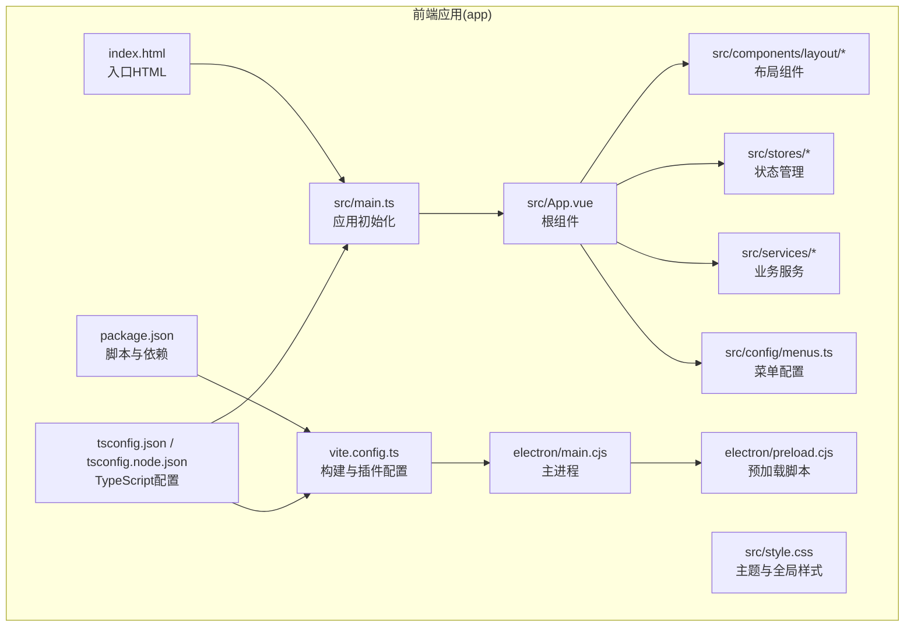
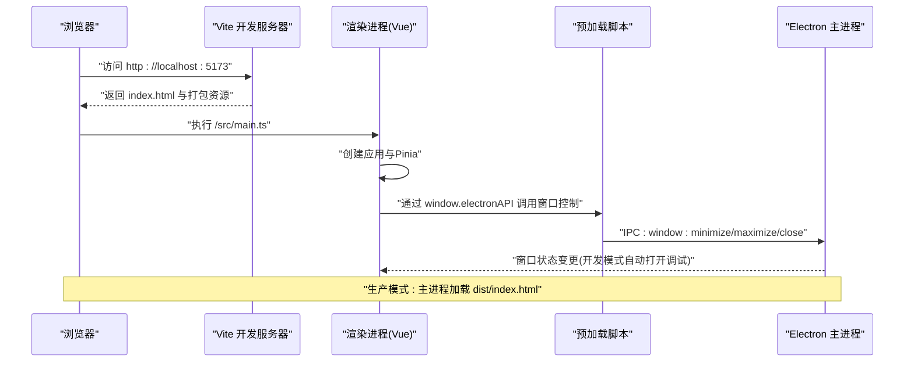
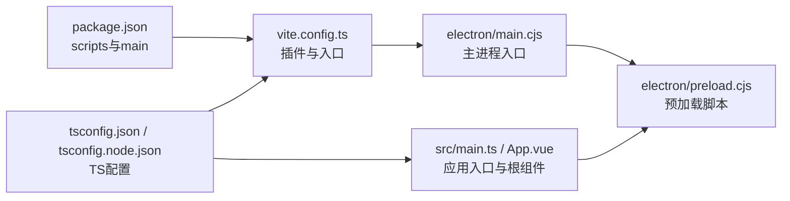

# 项目结构与配置

<cite>
**本文档引用的文件**
- [main.ts](file://app/src/main.ts)
- [App.vue](file://app/src/App.vue)
- [vite.config.ts](file://app/vite.config.ts)
- [package.json](file://app/package.json)
- [tsconfig.json](file://app/tsconfig.json)
- [tsconfig.node.json](file://app/tsconfig.node.json)
- [electron/main.cjs](file://app/electron/main.cjs)
- [electron/preload.cjs](file://app/electron/preload.cjs)
- [src/style.css](file://app/src/style.css)
- [src/components/layout/TopMenu.vue](file://app/src/components/layout/TopMenu.vue)
- [src/stores/theme.ts](file://app/src/stores/theme.ts)
- [src/config/menus.ts](file://app/src/config/menus.ts)
- [src/electron.d.ts](file://app/src/electron.d.ts)
- [index.html](file://app/index.html)
- [README.md](file://README.md)
</cite>

## 目录
1. [简介](#简介)
2. [项目结构](#项目结构)
3. [核心组件](#核心组件)
4. [架构总览](#架构总览)
5. [详细组件分析](#详细组件分析)
6. [依赖关系分析](#依赖关系分析)
7. [性能考虑](#性能考虑)
8. [故障排查指南](#故障排查指南)
9. [结论](#结论)
10. [附录](#附录)

## 简介
本文件面向Woo前端项目（app目录），系统梳理其目录结构与配置，重点覆盖以下方面：
- 整体目录组织原则与职责划分（src、electron、docs等）
- 核心配置文件：应用初始化流程（main.ts）、根组件设计（App.vue）、Vite构建与Electron集成（vite.config.ts）
- TypeScript与Node编译配置（tsconfig.json、tsconfig.node.json）
- 包管理与脚本命令（package.json）
- 开发与生产环境差异、启动流程与构建命令
- 实际配置参数说明与最佳实践建议

## 项目结构
app目录作为前端主体，采用“功能域+层次化”的组织方式：
- electron：Electron主进程与预加载脚本，负责窗口生命周期、IPC通信与外部链接打开
- src：Vue 3 + TypeScript源码，按功能域划分为components（布局、UI、图标）、stores（状态）、types（类型）、services（业务服务）、config（菜单配置）、style.css（主题与全局样式）
- docs：前端设计文档（概念性内容，不涉及具体代码）
- 根级配置：index.html、package.json、tsconfig.json、tsconfig.node.json、vite.config.ts

图表来源
- [index.html:1-13](file://app/index.html#L1-L13)
- [main.ts:1-8](file://app/src/main.ts#L1-L8)
- [App.vue:1-117](file://app/src/App.vue#L1-L117)
- [style.css:1-286](file://app/src/style.css#L1-L286)
- [TopMenu.vue:1-228](file://app/src/components/layout/TopMenu.vue#L1-L228)
- [theme.ts:1-31](file://app/src/stores/theme.ts#L1-L31)
- [menus.ts:1-103](file://app/src/config/menus.ts#L1-L103)
- [main.cjs:1-71](file://app/electron/main.cjs#L1-L71)
- [preload.cjs:1-18](file://app/electron/preload.cjs#L1-L18)
- [vite.config.ts:1-19](file://app/vite.config.ts#L1-L19)
- [package.json:1-38](file://app/package.json#L1-L38)
- [tsconfig.json:1-25](file://app/tsconfig.json#L1-L25)
- [tsconfig.node.json:1-11](file://app/tsconfig.node.json#L1-L11)

章节来源
- [README.md:47-63](file://README.md#L47-L63)

## 核心组件
本节聚焦三个关键配置与入口文件，阐明其职责与协作关系。

- 应用初始化（main.ts）
  - 创建Vue应用实例，挂载Pinia状态管理，并将应用挂载至DOM节点
  - 作用：统一注入依赖、建立运行时上下文
  - 参考路径：[main.ts:1-8](file://app/src/main.ts#L1-L8)

- 根组件（App.vue）
  - 组织顶部菜单、左右侧边栏、缩略图列与中央编辑区
  - 提供主题初始化、侧边栏开关与键盘快捷键处理
  - 参考路径：[App.vue:1-117](file://app/src/App.vue#L1-L117)

- 构建与Electron集成（vite.config.ts）
  - 配置Vue插件、Electron插件入口、开发服务器端口与输出目录
  - 参考路径：[vite.config.ts:1-19](file://app/vite.config.ts#L1-L19)

章节来源
- [main.ts:1-8](file://app/src/main.ts#L1-L8)
- [App.vue:1-117](file://app/src/App.vue#L1-L117)
- [vite.config.ts:1-19](file://app/vite.config.ts#L1-L19)

## 架构总览
下图展示从浏览器到Electron主进程的关键交互路径，以及开发/生产两种运行模式：

图表来源
- [index.html:1-13](file://app/index.html#L1-L13)
- [main.cjs:26-31](file://app/electron/main.cjs#L26-L31)
- [preload.cjs:4-13](file://app/electron/preload.cjs#L4-L13)
- [main.ts:1-8](file://app/src/main.ts#L1-L8)

## 详细组件分析

### 应用初始化流程（main.ts）
- 关键步骤
  - 导入Vue与Pinia，引入全局样式与根组件
  - 创建应用实例，注册Pinia插件
  - 将应用挂载到DOM容器
- 设计要点
  - 保持初始化逻辑简洁，避免在入口处进行复杂逻辑
  - 保证样式与组件在应用挂载前完成解析
- 参考路径：[main.ts:1-8](file://app/src/main.ts#L1-L8)

章节来源
- [main.ts:1-8](file://app/src/main.ts#L1-L8)

### 根组件（App.vue）
- 结构组成
  - 顶部菜单、左侧/缩略图/右侧三列布局、设置与登录弹窗
- 功能特性
  - 主题初始化：在组件挂载前确保<html>元素具备data-theme属性
  - 侧边栏状态：使用响应式引用控制三列可见性
  - 快捷键：Ctrl+1/2/3分别切换三列显示
  - 生命周期：挂载时绑定键盘事件，卸载时解绑，防止内存泄漏
- 参考路径：[App.vue:1-117](file://app/src/App.vue#L1-L117)

章节来源
- [App.vue:1-117](file://app/src/App.vue#L1-L117)

### Vite构建与Electron集成（vite.config.ts）
- 插件配置
  - @vitejs/plugin-vue：支持Vue SFC
  - vite-plugin-electron：指定主进程入口electron/main.cjs
- 开发服务器
  - 端口：5173
- 构建输出
  - 输出目录：dist
- 参考路径：[vite.config.ts:1-19](file://app/vite.config.ts#L1-L19)

章节来源
- [vite.config.ts:1-19](file://app/vite.config.ts#L1-L19)

### Electron主进程（electron/main.cjs）
- 窗口配置
  - 固定尺寸与最小尺寸、无边框标题栏、自定义背景色
  - webPreferences：启用上下文隔离、禁用Node集成
- 资源加载
  - 开发：加载本地Vite开发服务器地址
  - 生产：加载dist/index.html
- IPC处理
  - 窗口控制：最小化、最大化/还原、关闭
  - 版本查询：通过handle暴露异步接口
  - 外部链接：通过shell.openExternal打开
- 应用生命周期
  - ready：创建窗口；activate：多窗口平台恢复；all-closed：非macOS退出
- 参考路径：[main.cjs:1-71](file://app/electron/main.cjs#L1-L71)

章节来源
- [main.cjs:1-71](file://app/electron/main.cjs#L1-L71)

### 预加载脚本（electron/preload.cjs）
- 暴露API
  - 窗口控制：minimize、maximize、close
  - 外部链接：openExternalLink
  - 应用版本：getAppVersion（异步）
- 安全策略
  - 使用contextBridge.exposeInMainWorld限制暴露范围
  - 通过ipcRenderer与主进程通信
- 参考路径：[preload.cjs:1-18](file://app/electron/preload.cjs#L1-L18)

章节来源
- [preload.cjs:1-18](file://app/electron/preload.cjs#L1-L18)

### 类型声明（src/electron.d.ts）
- 目的
  - 为window.electronAPI提供类型提示，便于在渲染进程中安全使用
- 参考路径：[src/electron.d.ts:1-9](file://app/src/electron.d.ts#L1-L9)

章节来源
- [src/electron.d.ts:1-9](file://app/src/electron.d.ts#L1-L9)

### 菜单配置（src/config/menus.ts）
- 菜单项类型与结构
  - item、divider、submenu三种类型
  - action字段用于标识菜单动作
- 菜单分组
  - 文件、编辑、AI、标记、查看、帮助
- 参考路径：[menus.ts:1-103](file://app/src/config/menus.ts#L1-L103)

章节来源
- [menus.ts:1-103](file://app/src/config/menus.ts#L1-L103)

### 主题存储（src/stores/theme.ts）
- 功能
  - 读取localStorage中的主题偏好，初始化当前主题
  - 提供toggleTheme方法切换主题
  - 通过watch同步DOM属性与本地存储
- 参考路径：[theme.ts:1-31](file://app/src/stores/theme.ts#L1-L31)

章节来源
- [theme.ts:1-31](file://app/src/stores/theme.ts#L1-L31)

### 顶部菜单组件（src/components/layout/TopMenu.vue）
- 交互
  - 下拉菜单：确保同一时间仅有一个菜单展开
  - 窗口控制：通过window.electronAPI调用主进程
  - 菜单动作：打开设置、打开AI聊天、打开外部链接等
- 参考路径：[TopMenu.vue:1-228](file://app/src/components/layout/TopMenu.vue#L1-L228)

章节来源
- [TopMenu.vue:1-228](file://app/src/components/layout/TopMenu.vue#L1-L228)

### 全局样式（src/style.css）
- 主题变量
  - light/dark两套变量，通过:data-theme切换
  - 编辑器相关变量、滚动条、阴影与过渡效果
- 全局重置与滚动条
- AI消息内容的Markdown样式（v-html不受scoped影响，需置于全局）
- 参考路径：[style.css:1-286](file://app/src/style.css#L1-L286)

章节来源
- [style.css:1-286](file://app/src/style.css#L1-L286)

### 入口HTML（index.html）
- 作用
  - 提供挂载点
与应用入口脚本
- 参考路径：[index.html:1-13](file://app/index.html#L1-L13)

章节来源
- [index.html:1-13](file://app/index.html#L1-L13)

## 依赖关系分析
- 包管理与脚本
  - 开发：vite（dev）
  - 构建：vue-tsc + vite build（build）
  - 预览：vite preview（preview）
  - Electron开发：electron .（electron:dev）
  - Electron打包：vue-tsc + vite build + electron-builder（electron:build）
- 依赖关系
  - 前端：vue、@vueuse/core、@tiptap等
  - 构建：vite、@vitejs/plugin-vue、vite-plugin-electron
  - 打包：electron、electron-builder
- 参考路径：[package.json:1-38](file://app/package.json#L1-L38)

图表来源
- [package.json:1-38](file://app/package.json#L1-L38)
- [vite.config.ts:1-19](file://app/vite.config.ts#L1-L19)
- [main.cjs:1-71](file://app/electron/main.cjs#L1-L71)
- [preload.cjs:1-18](file://app/electron/preload.cjs#L1-L18)
- [main.ts:1-8](file://app/src/main.ts#L1-L8)
- [App.vue:1-117](file://app/src/App.vue#L1-L117)
- [tsconfig.json:1-25](file://app/tsconfig.json#L1-L25)
- [tsconfig.node.json:1-11](file://app/tsconfig.node.json#L1-L11)

章节来源
- [package.json:1-38](file://app/package.json#L1-L38)

## 性能考虑
- 构建优化
  - 使用Vite的原生ESM与按需编译，减少冷启动时间
  - Pinia作为轻量状态管理，避免过度拆分store导致的通信成本
- 渲染性能
  - App.vue中对键盘事件采用onMounted/onBeforeUnmount成对绑定/解绑，避免内存泄漏
  - 主题切换通过CSS变量与watch同步，避免频繁重排
- Electron性能
  - 预加载脚本仅暴露必要API，降低攻击面
  - 开发模式自动打开DevTools，便于定位问题
- 最佳实践
  - 将大体积资源放入public或按需加载
  - 对高频组件使用浅层响应式与计算属性缓存
  - 在Electron主进程合理设置窗口大小与webPreferences，平衡性能与安全

## 故障排查指南
- 开发服务器无法访问
  - 确认Vite端口未被占用，默认端口为5173
  - 参考路径：[vite.config.ts:13-15](file://app/vite.config.ts#L13-L15)
- Electron开发模式白屏
  - 检查主进程是否正确加载开发服务器地址
  - 参考路径：[main.cjs:26-28](file://app/electron/main.cjs#L26-L28)
- 渲染进程无法调用窗口控制
  - 确认预加载脚本已正确暴露window.electronAPI
  - 参考路径：[preload.cjs:4-13](file://app/electron/preload.cjs#L4-L13)
  - 确认类型声明存在且未被忽略
  - 参考路径：[src/electron.d.ts:1-9](file://app/src/electron.d.ts#L1-L9)
- 主题切换无效
  - 检查<html>元素是否具备data-theme属性
  - 参考路径：[App.vue:46-47](file://app/src/App.vue#L46-L47)、[theme.ts:21-24](file://app/src/stores/theme.ts#L21-L24)
- 构建失败
  - 确保先执行vue-tsc再执行vite build
  - 参考路径：[package.json:8-11](file://app/package.json#L8-L11)

章节来源
- [vite.config.ts:13-15](file://app/vite.config.ts#L13-L15)
- [main.cjs:26-28](file://app/electron/main.cjs#L26-L28)
- [preload.cjs:4-13](file://app/electron/preload.cjs#L4-L13)
- [src/electron.d.ts:1-9](file://app/src/electron.d.ts#L1-L9)
- [App.vue:46-47](file://app/src/App.vue#L46-L47)
- [theme.ts:21-24](file://app/src/stores/theme.ts#L21-L24)
- [package.json:8-11](file://app/package.json#L8-L11)

## 结论
本项目以清晰的目录结构与明确的职责边界实现“前端+桌面端”一体化方案。通过Vite与Electron的组合，既保证了开发效率，又实现了跨平台桌面应用的稳定运行。核心配置文件分工明确：main.ts负责应用初始化，App.vue承载界面与交互，vite.config.ts协调构建与Electron集成。配合TypeScript与Pinia，项目具备良好的可维护性与扩展性。

## 附录

### 开发与生产环境差异
- 开发环境
  - Vite开发服务器：端口5173，热更新与源码映射
  - Electron加载开发地址，自动打开DevTools
  - 参考路径：[vite.config.ts:13-15](file://app/vite.config.ts#L13-L15)、[main.cjs:26-28](file://app/electron/main.cjs#L26-L28)
- 生产环境
  - 构建输出至dist，Electron加载dist/index.html
  - 参考路径：[vite.config.ts:16-18](file://app/vite.config.ts#L16-L18)、[main.cjs:29-31](file://app/electron/main.cjs#L29-L31)

章节来源
- [vite.config.ts:13-18](file://app/vite.config.ts#L13-L18)
- [main.cjs:26-31](file://app/electron/main.cjs#L26-L31)

### 启动流程与构建命令
- 启动开发服务器
  - npm run dev
  - 参考路径：[package.json](file://app/package.json#L7)
- 预览生产构建
  - npm run preview
  - 参考路径：[package.json](file://app/package.json#L9)
- 构建生产包
  - npm run build（先类型检查，再构建）
  - 参考路径：[package.json](file://app/package.json#L8)
- Electron开发
  - npm run electron:dev（启动Electron）
  - 参考路径：[package.json](file://app/package.json#L10)
- Electron打包
  - npm run electron:build（构建+打包）
  - 参考路径：[package.json](file://app/package.json#L11)

章节来源
- [package.json:1-38](file://app/package.json#L1-L38)

### TypeScript配置要点
- tsconfig.json
  - 目标与模块：ES2020 + ESNext
  - Bundler模式：bundler + allowImportingTsExtensions
  - 严格性：strict、noUnusedLocals、noUnusedParameters、noFallthroughCasesInSwitch
  - include范围：src/**/*.ts/.d.ts/.tsx/.vue
  - 引用：tsconfig.node.json
  - 参考路径：[tsconfig.json:1-25](file://app/tsconfig.json#L1-L25)
- tsconfig.node.json
  - 仅包含vite.config.ts
  - 参考路径：[tsconfig.node.json:1-11](file://app/tsconfig.node.json#L1-L11)

章节来源
- [tsconfig.json:1-25](file://app/tsconfig.json#L1-L25)
- [tsconfig.node.json:1-11](file://app/tsconfig.node.json#L1-L11)

### 配置参数速查
- Vite
  - plugins：@vitejs/plugin-vue、vite-plugin-electron
  - server.port：5173
  - build.outDir：dist
  - 参考路径：[vite.config.ts:7-18](file://app/vite.config.ts#L7-L18)
- Electron
  - main：electron/main.cjs
  - preload：electron/preload.cjs
  - webPreferences：contextIsolation=true、nodeIntegration=false
  - 参考路径：[main.cjs:18-22](file://app/electron/main.cjs#L18-L22)、[package.json](file://app/package.json#L36)
- 入口与模板
  - index.html：挂载点与入口脚本
  - 参考路径：[index.html:10-11](file://app/index.html#L10-L11)

章节来源
- [vite.config.ts:7-18](file://app/vite.config.ts#L7-L18)
- [main.cjs:18-22](file://app/electron/main.cjs#L18-L22)
- [package.json](file://app/package.json#L36)
- [index.html:10-11](file://app/index.html#L10-L11)