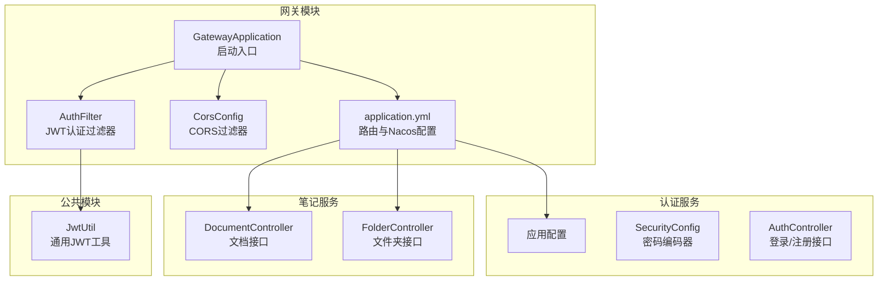
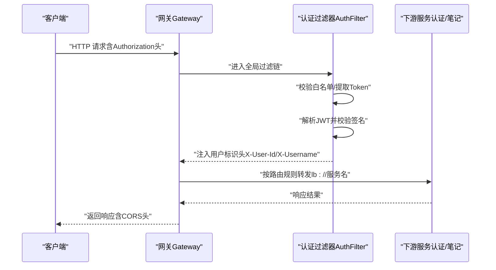
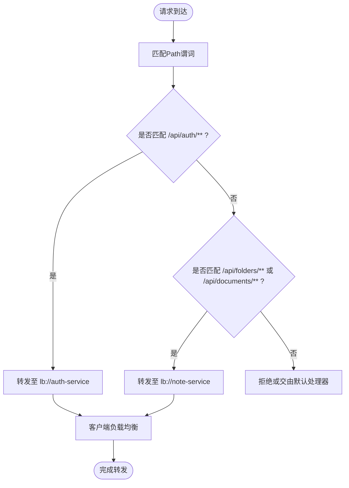
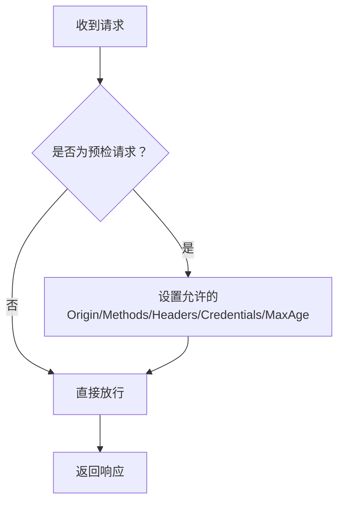
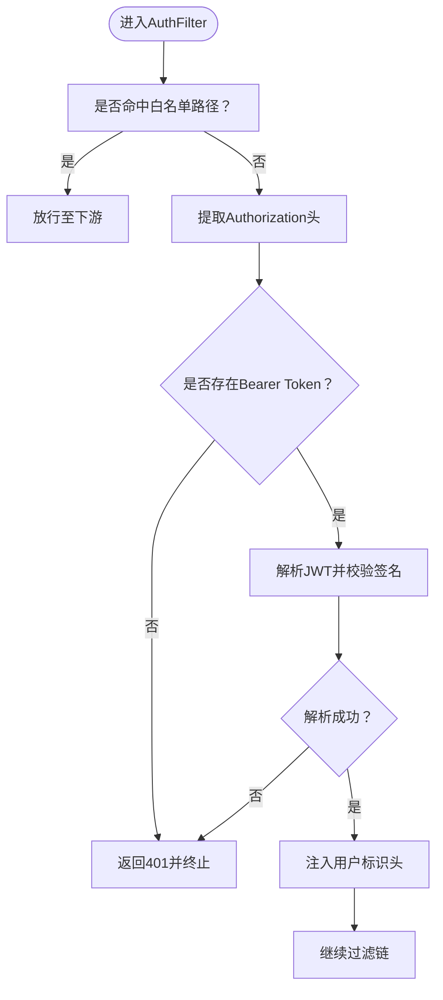
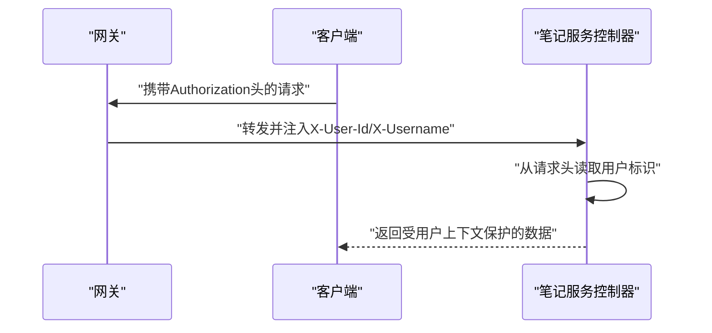
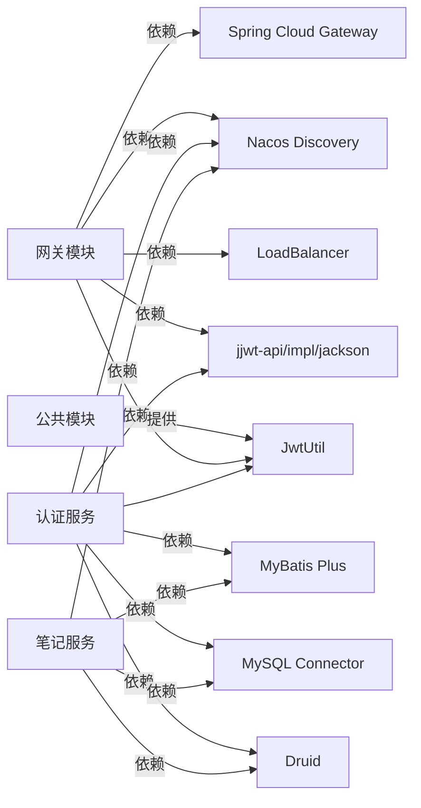

# API网关服务

<cite>
**本文引用的文件**
- [GatewayApplication.java](file://services/gateway/src/main/java/com/nonegonotes/gateway/GatewayApplication.java)
- [application.yml（网关）](file://services/gateway/src/main/resources/application.yml)
- [CorsConfig.java](file://services/gateway/src/main/java/com/nonegonotes/gateway/config/CorsConfig.java)
- [AuthFilter.java](file://services/gateway/src/main/java/com/nonegonotes/gateway/filter/AuthFilter.java)
- [JwtUtil.java](file://services/common/src/main/java/com/nonegonotes/common/util/JwtUtil.java)
- [SecurityConfig.java（认证服务）](file://services/auth-service/src/main/java/com/nonegonotes/auth/config/SecurityConfig.java)
- [LoginRequest.java](file://services/auth-service/src/main/java/com/nonegonotes/auth/dto/LoginRequest.java)
- [application.yml（认证服务）](file://services/auth-service/src/main/resources/application.yml)
- [DocumentController.java](file://services/note-service/src/main/java/com/nonegonotes/note/controller/DocumentController.java)
- [FolderController.java](file://services/note-service/src/main/java/com/nonegonotes/note/controller/FolderController.java)
- [application.yml（笔记服务）](file://services/note-service/src/main/resources/application.yml)
- [pom.xml（聚合工程）](file://services/pom.xml)
- [pom.xml（网关模块）](file://services/gateway/pom.xml)
</cite>

## 目录
1. [简介](#简介)
2. [项目结构](#项目结构)
3. [核心组件](#核心组件)
4. [架构总览](#架构总览)
5. [详细组件分析](#详细组件分析)
6. [依赖分析](#依赖分析)
7. [性能考虑](#性能考虑)
8. [故障排查指南](#故障排查指南)
9. [结论](#结论)
10. [附录](#附录)

## 简介
本文件为Woo项目的API网关服务技术文档，聚焦于Spring Cloud Gateway在本项目中的路由配置与请求转发机制、动态路由规则、负载均衡策略、熔断器配置现状与建议、CORS跨域资源共享策略、AuthFilter认证过滤器的实现细节（JWT令牌解析、用户身份验证与注入）、安全策略（请求限流、IP白名单、API版本控制）以及监控、日志与性能优化建议。文档同时提供配置示例、路由规则定义与故障转移机制说明，帮助开发者快速理解并维护网关。

## 项目结构
本项目采用多模块Maven聚合工程组织，网关模块位于services/gateway，认证服务位于services/auth-service，笔记服务位于services/note-service，公共模块位于services/common。网关通过Nacos进行服务发现，并基于Path谓词进行动态路由，结合全局过滤器实现JWT认证与CORS支持。

图表来源
- [GatewayApplication.java:1-15](file://services/gateway/src/main/java/com/nonegonotes/gateway/GatewayApplication.java#L1-L15)
- [application.yml（网关）:1-27](file://services/gateway/src/main/resources/application.yml#L1-L27)
- [CorsConfig.java:1-32](file://services/gateway/src/main/java/com/nonegonotes/gateway/config/CorsConfig.java#L1-L32)
- [AuthFilter.java:1-91](file://services/gateway/src/main/java/com/nonegonotes/gateway/filter/AuthFilter.java#L1-L91)
- [JwtUtil.java:1-57](file://services/common/src/main/java/com/nonegonotes/common/util/JwtUtil.java#L1-L57)
- [SecurityConfig.java（认证服务）:1-16](file://services/auth-service/src/main/java/com/nonegonotes/auth/config/SecurityConfig.java#L1-L16)
- [DocumentController.java:1-49](file://services/note-service/src/main/java/com/nonegonotes/note/controller/DocumentController.java#L1-L49)
- [FolderController.java:1-48](file://services/note-service/src/main/java/com/nonegonotes/note/controller/FolderController.java#L1-L48)

章节来源
- [pom.xml（聚合工程）:1-141](file://services/pom.xml#L1-L141)
- [pom.xml（网关模块）:1-71](file://services/gateway/pom.xml#L1-L71)

## 核心组件
- 启动与服务发现：网关应用启用Spring Boot与Nacos服务发现，负责将请求路由至下游服务。
- 动态路由：基于Path谓词匹配，将/api/auth/**路由到认证服务，将/api/folders/**与/api/documents/**路由到笔记服务。
- 负载均衡：路由目标使用lb://协议，结合Spring Cloud LoadBalancer实现客户端侧负载均衡。
- 全局过滤器：AuthFilter在请求进入时校验JWT，成功则将用户标识注入请求头；CORS过滤器统一处理跨域。
- 安全与配置：认证服务使用BCrypt密码编码器；公共模块提供JWT工具类；网关配置JWT密钥与CORS参数。

章节来源
- [GatewayApplication.java:1-15](file://services/gateway/src/main/java/com/nonegonotes/gateway/GatewayApplication.java#L1-L15)
- [application.yml（网关）:1-27](file://services/gateway/src/main/resources/application.yml#L1-L27)
- [CorsConfig.java:1-32](file://services/gateway/src/main/java/com/nonegonotes/gateway/config/CorsConfig.java#L1-L32)
- [AuthFilter.java:1-91](file://services/gateway/src/main/java/com/nonegonotes/gateway/filter/AuthFilter.java#L1-L91)
- [JwtUtil.java:1-57](file://services/common/src/main/java/com/nonegonotes/common/util/JwtUtil.java#L1-L57)
- [SecurityConfig.java（认证服务）:1-16](file://services/auth-service/src/main/java/com/nonegonotes/auth/config/SecurityConfig.java#L1-L16)

## 架构总览
下图展示从客户端到网关再到下游服务的整体调用链路，包括认证过滤与CORS处理的关键节点。

图表来源
- [AuthFilter.java:39-84](file://services/gateway/src/main/java/com/nonegonotes/gateway/filter/AuthFilter.java#L39-L84)
- [application.yml（网关）:11-22](file://services/gateway/src/main/resources/application.yml#L11-L22)
- [CorsConfig.java:17-30](file://services/gateway/src/main/java/com/nonegonotes/gateway/config/CorsConfig.java#L17-L30)

## 详细组件分析

### 路由与请求转发机制
- 路由定义：网关通过application.yml中的routes段落定义两条路由，分别指向认证服务与笔记服务，均使用lb://协议以启用负载均衡。
- 谓词匹配：Path谓词用于匹配请求路径前缀，确保/api/auth/**交由认证服务处理，/api/folders/**与/api/documents/**交由笔记服务处理。
- 负载均衡：路由目标使用lb://协议，结合Spring Cloud LoadBalancer实现客户端侧负载均衡；若需更细粒度控制或熔断能力，可引入Resilience4j或Sentinel。
- 故障转移：当前未显式配置重试与熔断策略，建议在路由层或服务层增加重试与熔断配置以提升可用性。

图表来源
- [application.yml（网关）:11-22](file://services/gateway/src/main/resources/application.yml#L11-L22)

章节来源
- [application.yml（网关）:1-27](file://services/gateway/src/main/resources/application.yml#L1-L27)
- [pom.xml（网关模块）:19-38](file://services/gateway/pom.xml#L19-L38)

### CORS跨域资源共享配置
- 允许来源：使用通配模式，支持任意Origin。
- 允许方法：GET、POST、PUT、DELETE、OPTIONS。
- 允许头：通配，便于前端携带自定义头。
- 凭据：允许携带Cookie与Authorization等凭据。
- 缓存时间：预检请求缓存1小时。

图表来源
- [CorsConfig.java:17-30](file://services/gateway/src/main/java/com/nonegonotes/gateway/config/CorsConfig.java#L17-L30)

章节来源
- [CorsConfig.java:1-32](file://services/gateway/src/main/java/com/nonegonotes/gateway/config/CorsConfig.java#L1-L32)

### AuthFilter认证过滤器实现
- 白名单放行：对登录与注册接口直接放行，避免循环认证。
- Token提取：从Authorization头中提取Bearer Token。
- JWT解析：使用对称密钥（来自配置）解析并校验签名，获取用户标识与用户名。
- 头注入：将userId与username注入到请求头（X-User-Id、X-Username），供下游服务使用。
- 异常处理：解析失败或缺少Token时返回未授权状态。

图表来源
- [AuthFilter.java:39-84](file://services/gateway/src/main/java/com/nonegonotes/gateway/filter/AuthFilter.java#L39-L84)
- [JwtUtil.java:36-43](file://services/common/src/main/java/com/nonegonotes/common/util/JwtUtil.java#L36-L43)

章节来源
- [AuthFilter.java:1-91](file://services/gateway/src/main/java/com/nonegonotes/gateway/filter/AuthFilter.java#L1-L91)
- [JwtUtil.java:1-57](file://services/common/src/main/java/com/nonegonotes/common/util/JwtUtil.java#L1-L57)

### 下游服务对接与用户标识使用
- 笔记服务控制器通过请求头读取用户标识，实现基于用户上下文的业务操作（如查询、创建、删除文档与文件夹）。
- 控制器方法明确声明了对X-User-Id与X-Username的依赖，确保网关正确注入。

图表来源
- [DocumentController.java:20-31](file://services/note-service/src/main/java/com/nonegonotes/note/controller/DocumentController.java#L20-L31)
- [FolderController.java:20-30](file://services/note-service/src/main/java/com/nonegonotes/note/controller/FolderController.java#L20-L30)

章节来源
- [DocumentController.java:1-49](file://services/note-service/src/main/java/com/nonegonotes/note/controller/DocumentController.java#L1-L49)
- [FolderController.java:1-48](file://services/note-service/src/main/java/com/nonegonotes/note/controller/FolderController.java#L1-L48)

### 安全策略与配置建议
- 请求限流：当前未配置限流策略。建议在网关层或服务层引入限流组件（如Resilience4j、Sentinel或Spring Cloud Gateway内置限流），按IP或用户维度限制QPS。
- IP白名单：当前未实现IP白名单。可在网关层增加IP访问控制过滤器，仅允许白名单内的来源访问特定路由。
- API版本控制：当前未体现版本号。建议在路由中加入版本前缀（如/api/v1/...），并通过路由谓词或请求头实现版本隔离。
- 密钥管理：JWT密钥应从环境变量或配置中心安全加载，避免硬编码。

章节来源
- [application.yml（网关）:24-27](file://services/gateway/src/main/resources/application.yml#L24-L27)
- [application.yml（认证服务）:30-33](file://services/auth-service/src/main/resources/application.yml#L30-L33)

### 监控、日志与性能优化建议
- 指标采集：建议集成Actuator与Prometheus，暴露网关请求耗时、路由命中率、异常数等指标。
- 日志记录：在AuthFilter中记录Token解析失败原因与用户标识注入情况，便于审计与排错。
- 性能优化：开启GZIP压缩、合理设置连接池与超时时间；对静态资源与非关键接口启用缓存；减少不必要的请求头注入与字符串拼接。

## 依赖分析
- 网关模块依赖Spring Cloud Gateway、Nacos服务发现与LoadBalancer，以及JWT相关依赖。
- 认证服务依赖Nacos、MyBatis Plus、MySQL与Druid，使用BCrypt进行密码编码。
- 笔记服务依赖Nacos、MyBatis Plus、MySQL与Druid，提供文档与文件夹的REST接口。
- 公共模块提供JWT工具类，被网关与认证服务复用。

图表来源
- [pom.xml（网关模块）:19-60](file://services/gateway/pom.xml#L19-L60)
- [pom.xml（聚合工程）:41-112](file://services/pom.xml#L41-L112)

章节来源
- [pom.xml（网关模块）:1-71](file://services/gateway/pom.xml#L1-L71)
- [pom.xml（聚合工程）:1-141](file://services/pom.xml#L1-L141)

## 性能考虑
- 路由与过滤链：尽量减少过滤器数量与复杂度，避免在过滤器中执行阻塞操作。
- 负载均衡：结合下游实例健康状态与权重，必要时启用重试与熔断。
- 缓存与压缩：对只读接口启用缓存，开启GZIP压缩降低带宽占用。
- 连接与超时：合理设置连接超时、读超时与空闲超时，防止资源泄露。

## 故障排查指南
- 401未授权：检查Authorization头格式与Token有效性；确认网关与认证服务的JWT密钥一致。
- 跨域失败：检查CORS配置是否覆盖目标路径；确认浏览器预检请求已正确响应。
- 路由不生效：核对Path谓词与请求URL是否匹配；确认服务已在Nacos注册且名称与lb://后缀一致。
- 用户标识缺失：确认AuthFilter已注入X-User-Id与X-Username；下游控制器是否正确读取请求头。

章节来源
- [AuthFilter.java:50-83](file://services/gateway/src/main/java/com/nonegonotes/gateway/filter/AuthFilter.java#L50-L83)
- [CorsConfig.java:17-30](file://services/gateway/src/main/java/com/nonegonotes/gateway/config/CorsConfig.java#L17-L30)
- [application.yml（网关）:11-22](file://services/gateway/src/main/resources/application.yml#L11-L22)

## 结论
本项目基于Spring Cloud Gateway构建了简洁高效的API网关，通过动态路由与负载均衡实现对认证与笔记服务的统一接入，并以全局过滤器实现JWT认证与CORS支持。建议后续补充限流、熔断、IP白名单与API版本控制等安全与治理能力，并完善监控与日志体系，以进一步提升系统的稳定性与可观测性。

## 附录

### 配置示例与最佳实践
- 路由规则定义：参考application.yml中的routes段落，按Path前缀划分服务域。
- JWT密钥：建议从环境变量或配置中心读取，避免硬编码。
- CORS策略：根据生产环境需求收紧允许来源与方法，谨慎开启凭据。
- 安全加固：在网关层增加限流与IP白名单；对敏感接口启用更严格的鉴权与审计。

章节来源
- [application.yml（网关）:1-27](file://services/gateway/src/main/resources/application.yml#L1-L27)
- [CorsConfig.java:17-30](file://services/gateway/src/main/java/com/nonegonotes/gateway/config/CorsConfig.java#L17-L30)
- [AuthFilter.java:30-37](file://services/gateway/src/main/java/com/nonegonotes/gateway/filter/AuthFilter.java#L30-L37)