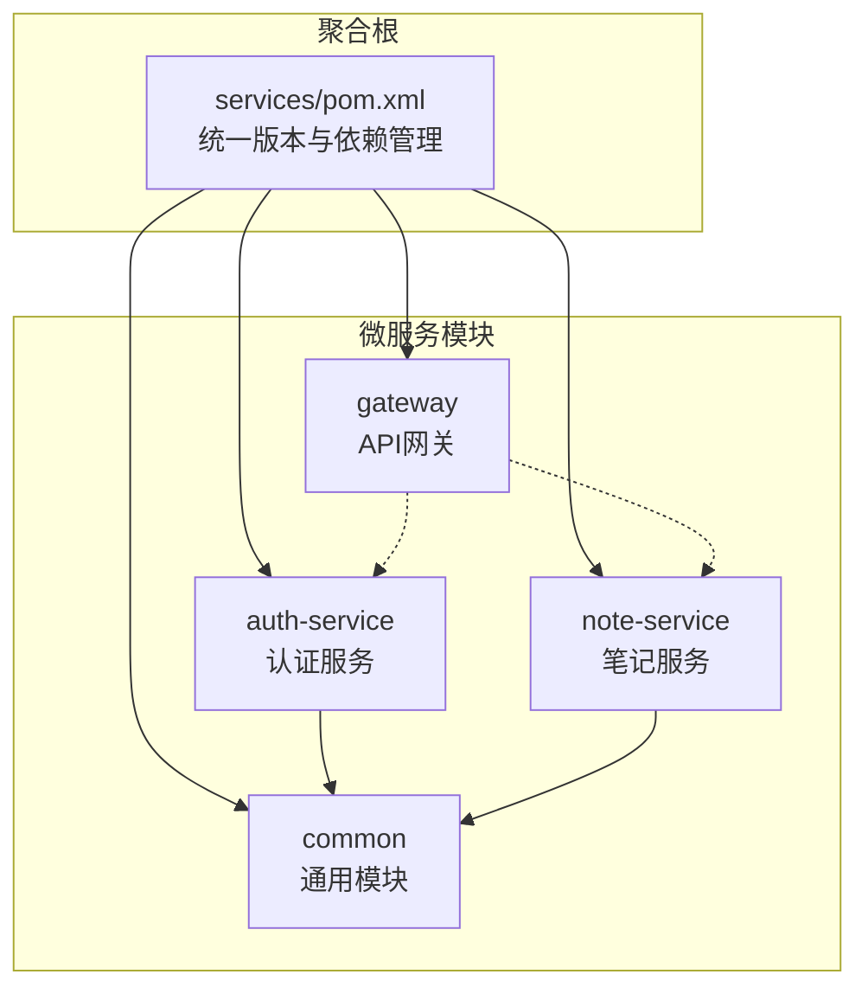
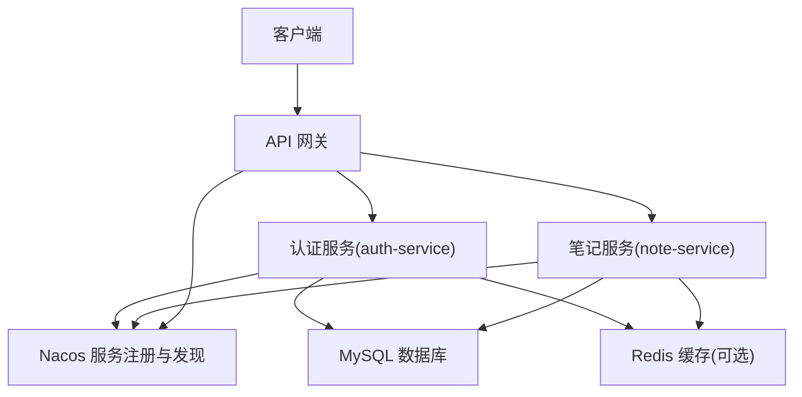
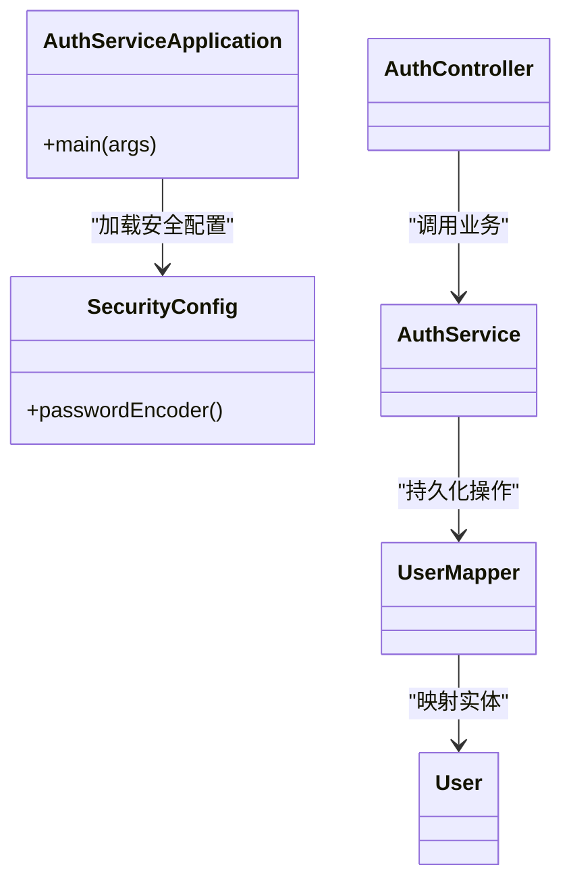
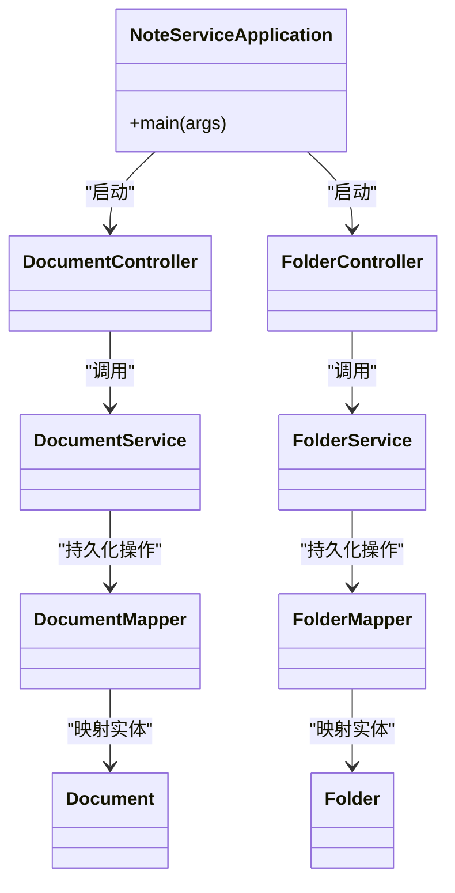
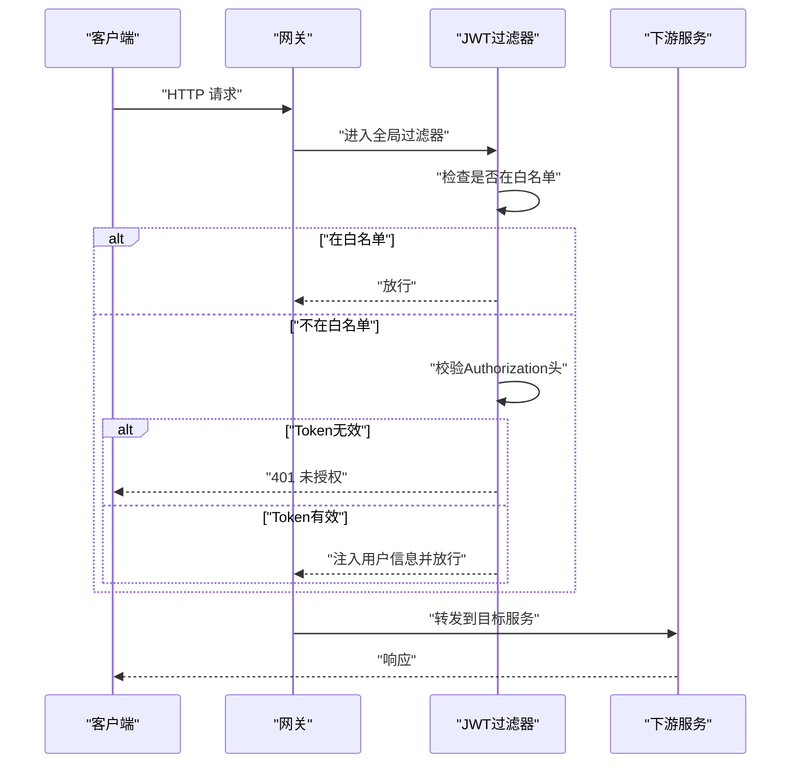
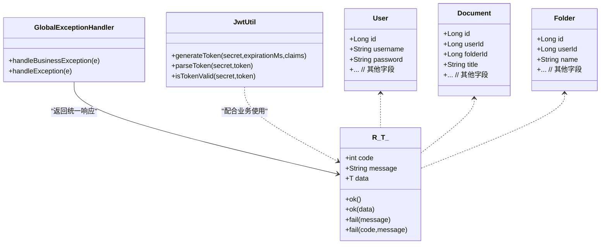
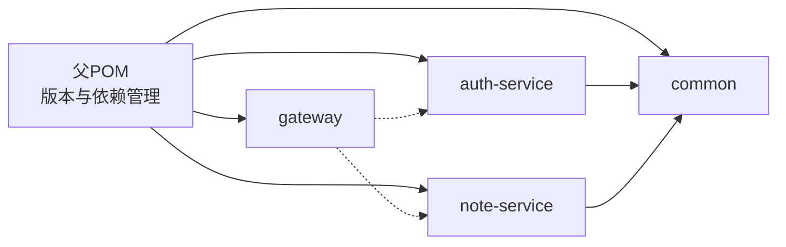

# 后端微服务架构

<cite>
**本文引用的文件**
- [services/pom.xml](file://services/pom.xml)
- [auth-service/pom.xml](file://services/auth-service/pom.xml)
- [note-service/pom.xml](file://services/note-service/pom.xml)
- [gateway/pom.xml](file://services/gateway/pom.xml)
- [common/pom.xml](file://services/common/pom.xml)
- [AuthServiceApplication.java](file://services/auth-service/src/main/java/com/nonegonotes/auth/AuthServiceApplication.java)
- [NoteServiceApplication.java](file://services/note-service/src/main/java/com/nonegonotes/note/NoteServiceApplication.java)
- [GatewayApplication.java](file://services/gateway/src/main/java/com/nonegonotes/gateway/GatewayApplication.java)
- [SecurityConfig.java](file://services/auth-service/src/main/java/com/nonegonotes/auth/config/SecurityConfig.java)
- [AuthFilter.java](file://services/gateway/src/main/java/com/nonegonotes/gateway/filter/AuthFilter.java)
- [R.java](file://services/common/src/main/java/com/nonegonotes/common/result/R.java)
- [GlobalExceptionHandler.java](file://services/common/src/main/java/com/nonegonotes/common/exception/GlobalExceptionHandler.java)
- [JwtUtil.java](file://services/common/src/main/java/com/nonegonotes/common/util/JwtUtil.java)
- [User.java](file://services/common/src/main/java/com/nonegonotes/common/entity/User.java)
- [Document.java](file://services/common/src/main/java/com/nonegonotes/common/entity/Document.java)
- [Folder.java](file://services/common/src/main/java/com/nonegonotes/common/entity/Folder.java)
- [application.yml（auth-service）](file://services/auth-service/src/main/resources/application.yml)
- [application.yml（note-service）](file://services/note-service/src/main/resources/application.yml)
- [application.yml（gateway）](file://services/gateway/src/main/resources/application.yml)
- [init.sql](file://services/sql/init.sql)
</cite>

## 目录
1. [简介](#简介)
2. [项目结构](#项目结构)
3. [核心组件](#核心组件)
4. [架构总览](#架构总览)
5. [详细组件分析](#详细组件分析)
6. [依赖分析](#依赖分析)
7. [性能考虑](#性能考虑)
8. [故障排查指南](#故障排查指南)
9. [结论](#结论)
10. [附录](#附录)

## 简介
本项目采用基于 Spring Boot 3 与 Spring Cloud 的微服务架构，通过 Maven 多模块统一管理，构建认证、笔记管理与网关三层能力。核心微服务包括：
- auth-service：用户认证与授权服务，负责登录注册、密码加密与令牌签发。
- note-service：笔记元数据管理服务，负责文稿与目录的增删改查。
- gateway：API 网关，负责路由转发、跨域与全局 JWT 认证过滤。
- common：通用模块，提供实体模型、统一响应体、全局异常处理与工具类。

系统以 Nacos 作为服务注册与发现中心，结合 Spring Cloud LoadBalancer 实现客户端侧负载均衡；数据持久层采用 MyBatis Plus，配合 Druid 连接池与 MySQL；接口文档通过 Knife4j 提供 OpenAPI 支持。

## 项目结构
项目采用多模块聚合工程，父 POM 统一版本与依赖管理，子模块按功能拆分，确保高内聚低耦合。

图表来源
- [services/pom.xml:15-20](file://services/pom.xml#L15-L20)
- [auth-service/pom.xml:20-24](file://services/auth-service/pom.xml#L20-L24)
- [note-service/pom.xml:20-24](file://services/note-service/pom.xml#L20-L24)
- [gateway/pom.xml:20-37](file://services/gateway/pom.xml#L20-L37)
- [common/pom.xml:19-39](file://services/common/pom.xml#L19-L39)

章节来源
- [services/pom.xml:15-20](file://services/pom.xml#L15-L20)
- [services/pom.xml:41-120](file://services/pom.xml#L41-L120)

## 核心组件
- 认证服务（auth-service）
  - 职责：用户登录、注册、密码加密、JWT 签发与校验。
  - 关键点：启用服务发现、集成 MyBatis Plus、Druid 连接池、Knife4j 文档、Lombok。
- 笔记服务（note-service）
  - 职责：文稿与目录的元数据管理，提供 REST 接口。
  - 关键点：服务发现、MyBatis Plus、Druid、Knife4j、Lombok。
- API 网关（gateway）
  - 职责：统一入口、路由转发、CORS、全局 JWT 认证过滤。
  - 关键点：Spring Cloud Gateway、Nacos 发现、LoadBalancer、JWT 校验。
- 通用模块（common）
  - 职责：共享实体、统一响应体、全局异常处理、JWT 工具类。
  - 关键点：被各服务复用，提供基础能力。

章节来源
- [auth-service/pom.xml:19-99](file://services/auth-service/pom.xml#L19-L99)
- [note-service/pom.xml:19-82](file://services/note-service/pom.xml#L19-L82)
- [gateway/pom.xml:19-61](file://services/gateway/pom.xml#L19-L61)
- [common/pom.xml:19-58](file://services/common/pom.xml#L19-L58)

## 架构总览
系统采用“网关 + 微服务 + 通用模块”的分层架构，服务间通过 Nacos 进行注册与发现，网关承担统一鉴权与路由。

图表来源
- [GatewayApplication.java:7-14](file://services/gateway/src/main/java/com/nonegonotes/gateway/GatewayApplication.java#L7-L14)
- [AuthServiceApplication.java:7-14](file://services/auth-service/src/main/java/com/nonegonotes/auth/AuthServiceApplication.java#L7-L14)
- [NoteServiceApplication.java:7-14](file://services/note-service/src/main/java/com/nonegonotes/note/NoteServiceApplication.java#L7-L14)
- [AuthFilter.java:26-91](file://services/gateway/src/main/java/com/nonegonotes/gateway/filter/AuthFilter.java#L26-L91)

## 详细组件分析

### 认证服务（auth-service）
- 应用入口与发现
  - 启动类启用服务发现，接入 Nacos。
- 安全配置
  - 提供密码编码器 Bean，用于密码加密存储。
- 控制器与服务
  - 提供登录、注册等接口（控制器与服务位于该模块源码中）。
- 数据访问
  - 使用 MyBatis Plus 操作用户表，Druid 连接池，MySQL 驱动。
- 文档与测试
  - Knife4j 提供接口文档；Lombok 简化实体与 DTO。

图表来源
- [AuthServiceApplication.java:7-14](file://services/auth-service/src/main/java/com/nonegonotes/auth/AuthServiceApplication.java#L7-L14)
- [SecurityConfig.java:8-15](file://services/auth-service/src/main/java/com/nonegonotes/auth/config/SecurityConfig.java#L8-L15)

章节来源
- [auth-service/pom.xml:19-99](file://services/auth-service/pom.xml#L19-L99)
- [AuthServiceApplication.java:7-14](file://services/auth-service/src/main/java/com/nonegonotes/auth/AuthServiceApplication.java#L7-L14)
- [SecurityConfig.java:8-15](file://services/auth-service/src/main/java/com/nonegonotes/auth/config/SecurityConfig.java#L8-L15)

### 笔记服务（note-service）
- 应用入口与发现
  - 启动类启用服务发现，接入 Nacos。
- 控制器与服务
  - 提供文稿与目录相关接口（控制器与服务位于该模块源码中）。
- 数据访问
  - 使用 MyBatis Plus 操作文稿与目录表，Druid 连接池，MySQL 驱动。
- 文档与测试
  - Knife4j 提供接口文档；Lombok 简化实体与 DTO。

图表来源
- [NoteServiceApplication.java:7-14](file://services/note-service/src/main/java/com/nonegonotes/note/NoteServiceApplication.java#L7-L14)

章节来源
- [note-service/pom.xml:19-82](file://services/note-service/pom.xml#L19-L82)
- [NoteServiceApplication.java:7-14](file://services/note-service/src/main/java/com/nonegonotes/note/NoteServiceApplication.java#L7-L14)

### API 网关（gateway）
- 全局过滤器
  - JWT 认证过滤器：对未在白名单中的请求校验 Authorization 头中的 JWT，解析失败返回 401；成功则将用户信息注入请求头供下游服务使用。
  - 白名单路径：登录与注册接口免鉴权。
- 路由与负载均衡
  - 借助 Nacos 与 LoadBalancer 实现服务发现与客户端侧负载均衡。
- CORS 配置
  - 提供跨域配置（位于该模块源码中）。

图表来源
- [AuthFilter.java:34-84](file://services/gateway/src/main/java/com/nonegonotes/gateway/filter/AuthFilter.java#L34-L84)

章节来源
- [gateway/pom.xml:19-61](file://services/gateway/pom.xml#L19-L61)
- [AuthFilter.java:26-91](file://services/gateway/src/main/java/com/nonegonotes/gateway/filter/AuthFilter.java#L26-L91)

### 通用模块（common）
- 统一响应体
  - R<T>：统一封装响应码、消息与数据，提供成功与失败便捷方法。
- 全局异常处理
  - 全局捕获业务异常与未知异常，返回统一响应体。
- 实体模型
  - User、Document、Folder：基于 MyBatis Plus 注解定义表结构与字段填充策略。
- JWT 工具类
  - 提供生成、解析与校验 Token 的静态方法。

图表来源
- [R.java:10-41](file://services/common/src/main/java/com/nonegonotes/common/result/R.java#L10-L41)
- [GlobalExceptionHandler.java:13-26](file://services/common/src/main/java/com/nonegonotes/common/exception/GlobalExceptionHandler.java#L13-L26)
- [JwtUtil.java:15-56](file://services/common/src/main/java/com/nonegonotes/common/util/JwtUtil.java#L15-L56)
- [User.java:11-39](file://services/common/src/main/java/com/nonegonotes/common/entity/User.java#L11-L39)
- [Document.java:11-41](file://services/common/src/main/java/com/nonegonotes/common/entity/Document.java#L11-L41)
- [Folder.java:实体定义位于 common 模块源码中](file://services/common/src/main/java/com/nonegonotes/common/entity/Folder.java)

章节来源
- [common/pom.xml:19-58](file://services/common/pom.xml#L19-L58)
- [R.java:10-41](file://services/common/src/main/java/com/nonegonotes/common/result/R.java#L10-L41)
- [GlobalExceptionHandler.java:13-26](file://services/common/src/main/java/com/nonegonotes/common/exception/GlobalExceptionHandler.java#L13-L26)
- [JwtUtil.java:15-56](file://services/common/src/main/java/com/nonegonotes/common/util/JwtUtil.java#L15-L56)
- [User.java:11-39](file://services/common/src/main/java/com/nonegonotes/common/entity/User.java#L11-L39)
- [Document.java:11-41](file://services/common/src/main/java/com/nonegonotes/common/entity/Document.java#L11-L41)

## 依赖分析
- 版本与依赖管理
  - 父 POM 使用 Spring Boot 3 与 Spring Cloud 2023 版本坐标，集中管理 MyBatis Plus、JWT、MySQL、Druid、Knife4j、Hutool 等依赖。
- 子模块依赖
  - auth-service 与 note-service 引入 common、Web、Validation、Nacos Discovery、MyBatis Plus、MySQL、Druid、Knife4j、Lombok。
  - gateway 引入 Spring Cloud Gateway、Nacos Discovery、LoadBalancer、JWT、Lombok。
  - common 作为提供者，被其他模块复用。

图表来源
- [services/pom.xml:41-120](file://services/pom.xml#L41-L120)
- [auth-service/pom.xml:19-99](file://services/auth-service/pom.xml#L19-L99)
- [note-service/pom.xml:19-82](file://services/note-service/pom.xml#L19-L82)
- [gateway/pom.xml:19-61](file://services/gateway/pom.xml#L19-L61)
- [common/pom.xml:19-58](file://services/common/pom.xml#L19-L58)

章节来源
- [services/pom.xml:22-39](file://services/pom.xml#L22-L39)
- [services/pom.xml:41-120](file://services/pom.xml#L41-L120)

## 性能考虑
- 连接池与数据库
  - 使用 Druid 连接池，建议结合业务并发与慢查询监控进行参数调优（最大连接数、空闲阈值、获取超时等）。
- ORM 与 SQL
  - MyBatis Plus 提供通用 CRUD 与逻辑删除，建议为高频查询建立合适索引，避免 N+1 查询。
- 网关与负载均衡
  - 客户端侧 LoadBalancer 降低网关压力；建议结合限流与熔断策略（如 Sentinel 或 Resilience4j）。
- 缓存
  - 对热点数据引入 Redis 缓存，减少数据库压力。
- 并发与线程
  - Spring WebFlux（网关）与 WebMVC（服务）的线程模型需匹配，避免阻塞操作影响吞吐。

## 故障排查指南
- 认证失败（401）
  - 检查网关 JWT 过滤器是否正确读取 Authorization 头，确认密钥配置与签名算法一致。
- 业务异常
  - 业务异常会被全局异常处理器捕获并返回统一响应体，查看日志定位具体异常类型与消息。
- 数据库连接问题
  - 检查 Druid 连接池配置与 MySQL 可达性，关注连接泄漏与慢查询。
- 服务发现
  - 确认 Nacos 地址与服务名一致，检查实例健康状态与端口暴露。

章节来源
- [AuthFilter.java:50-84](file://services/gateway/src/main/java/com/nonegonotes/gateway/filter/AuthFilter.java#L50-L84)
- [GlobalExceptionHandler.java:15-25](file://services/common/src/main/java/com/nonegonotes/common/exception/GlobalExceptionHandler.java#L15-L25)

## 结论
本项目以 Spring Boot 3 + Spring Cloud 为基础，通过 Maven 多模块实现清晰的职责划分与依赖管理。认证、笔记与网关三大能力协同工作，配合通用模块提供一致的响应与异常处理体验。建议在生产环境中完善监控、日志与缓存策略，并结合限流与熔断提升整体稳定性。

## 附录

### RESTful 设计与状态码使用规范
- 统一响应体
  - 成功：code=200，message="success"，data 为业务数据。
  - 失败：code=500，message 为错误信息；业务异常可自定义 code。
- 状态码建议
  - 200：成功
  - 400：请求参数错误
  - 401：未授权或 Token 无效
  - 403：禁止访问
  - 404：资源不存在
  - 500：服务器内部错误

章节来源
- [R.java:19-40](file://services/common/src/main/java/com/nonegonotes/common/result/R.java#L19-L40)
- [GlobalExceptionHandler.java:15-25](file://services/common/src/main/java/com/nonegonotes/common/exception/GlobalExceptionHandler.java#L15-L25)

### 数据访问层设计（MyBatis Plus + Druid + 事务）
- 实体注解
  - 表名与字段填充：通过注解定义表名、主键策略、逻辑删除与自动填充时间字段。
- Mapper 与 Service
  - 通用 CRUD 与条件构造器组合使用，简化 SQL 编写。
- 事务管理
  - 默认声明式事务，建议在 Service 层标注事务，保证一致性。
- 连接池
  - Druid 提供连接池监控与慢查询统计，便于性能优化。

章节来源
- [User.java:12-39](file://services/common/src/main/java/com/nonegonotes/common/entity/User.java#L12-L39)
- [Document.java:12-41](file://services/common/src/main/java/com/nonegonotes/common/entity/Document.java#L12-L41)
- [Folder.java:实体定义位于 common 模块源码中](file://services/common/src/main/java/com/nonegonotes/common/entity/Folder.java)

### 服务启动顺序与最佳实践
- 启动顺序
  - 先启动 Nacos（服务注册中心），再启动 auth-service 与 note-service，最后启动 gateway。
- 配置管理
  - 各服务通过 application.yml 配置端口、数据库与 Nacos 地址；敏感信息建议使用环境变量或配置中心。
- 监控与日志
  - 开启 Knife4j 文档便于联调；统一异常处理与日志记录，便于问题定位。

章节来源
- [AuthServiceApplication.java:7-14](file://services/auth-service/src/main/java/com/nonegonotes/auth/AuthServiceApplication.java#L7-L14)
- [NoteServiceApplication.java:7-14](file://services/note-service/src/main/java/com/nonegonotes/note/NoteServiceApplication.java#L7-L14)
- [GatewayApplication.java:7-14](file://services/gateway/src/main/java/com/nonegonotes/gateway/GatewayApplication.java#L7-L14)

### 数据库初始化脚本
- 初始化 SQL 文件位于 services/sql/init.sql，包含用户、文稿与目录等表结构与示例数据。

章节来源
- [init.sql](file://services/sql/init.sql)