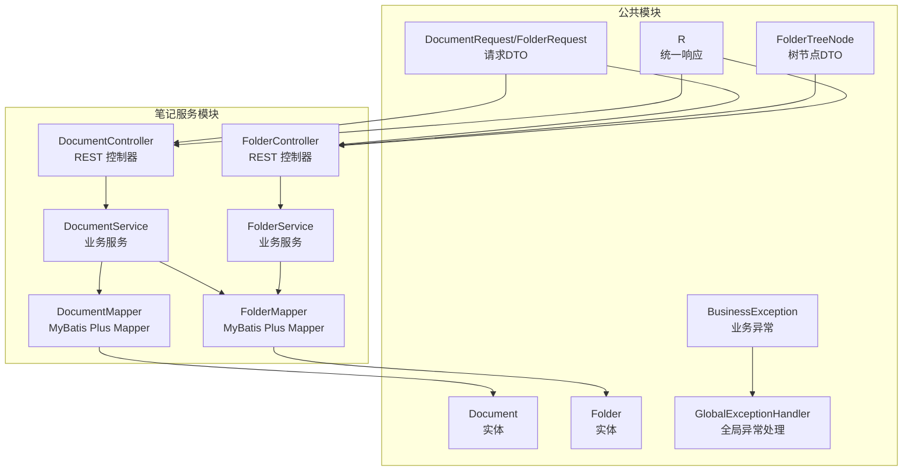
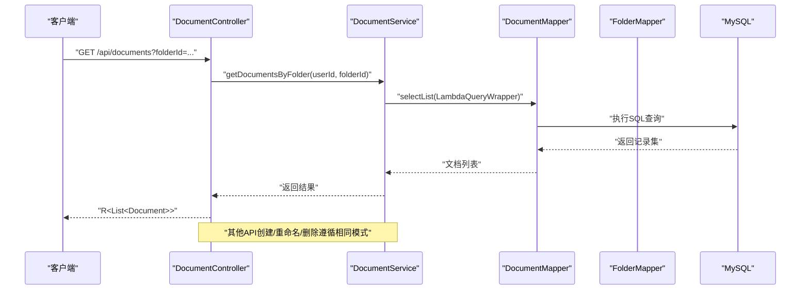
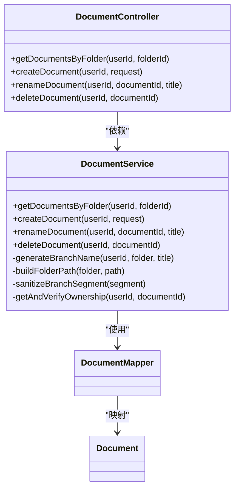
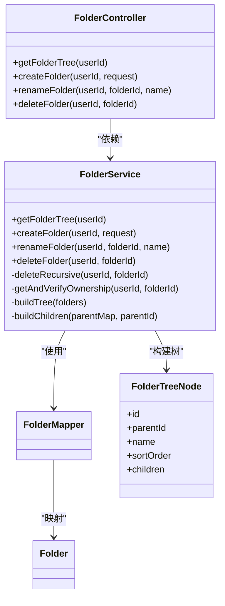
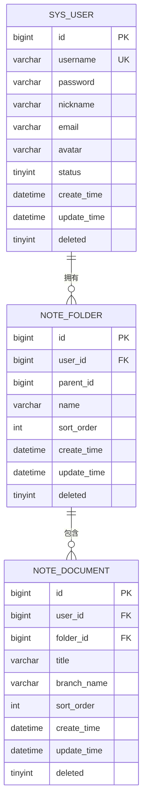
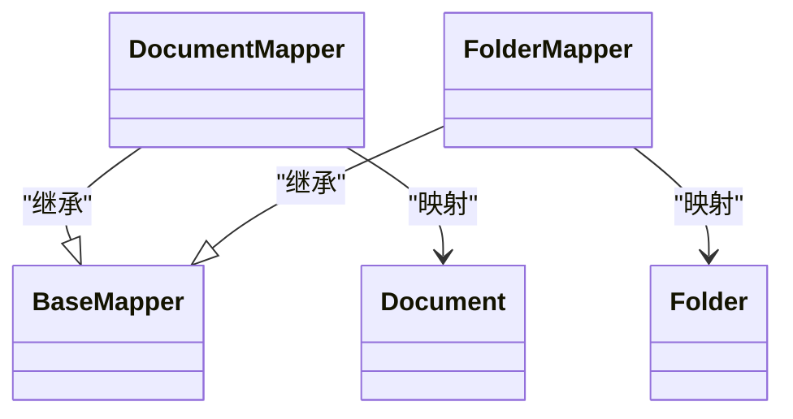
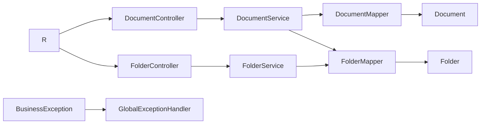

# 笔记服务

<cite>
**本文引用的文件**
- [DocumentController.java](file://services/note-service/src/main/java/com/nonegonotes/note/controller/DocumentController.java)
- [FolderController.java](file://services/note-service/src/main/java/com/nonegonotes/note/controller/FolderController.java)
- [DocumentService.java](file://services/note-service/src/main/java/com/nonegonotes/note/service/DocumentService.java)
- [FolderService.java](file://services/note-service/src/main/java/com/nonegonotes/note/service/FolderService.java)
- [DocumentMapper.java](file://services/note-service/src/main/java/com/nonegonotes/note/mapper/DocumentMapper.java)
- [FolderMapper.java](file://services/note-service/src/main/java/com/nonegonotes/note/mapper/FolderMapper.java)
- [Document.java](file://services/common/src/main/java/com/nonegonotes/common/entity/Document.java)
- [Folder.java](file://services/common/src/main/java/com/nonegonotes/common/entity/Folder.java)
- [DocumentRequest.java](file://services/note-service/src/main/java/com/nonegonotes/note/dto/DocumentRequest.java)
- [FolderRequest.java](file://services/note-service/src/main/java/com/nonegonotes/note/dto/FolderRequest.java)
- [FolderTreeNode.java](file://services/note-service/src/main/java/com/nonegonotes/note/dto/FolderTreeNode.java)
- [R.java](file://services/common/src/main/java/com/nonegonotes/common/result/R.java)
- [BusinessException.java](file://services/common/src/main/java/com/nonegonotes/common/exception/BusinessException.java)
- [GlobalExceptionHandler.java](file://services/common/src/main/java/com/nonegonotes/common/exception/GlobalExceptionHandler.java)
- [init.sql](file://services/sql/init.sql)
</cite>

## 目录
1. [简介](#简介)
2. [项目结构](#项目结构)
3. [核心组件](#核心组件)
4. [架构总览](#架构总览)
5. [详细组件分析](#详细组件分析)
6. [依赖分析](#依赖分析)
7. [性能考虑](#性能考虑)
8. [故障排查指南](#故障排查指南)
9. [结论](#结论)
10. [附录](#附录)

## 简介
本技术文档面向Woo笔记服务的“文档管理与目录组织”核心业务，系统性梳理REST API设计、业务规则实现、数据模型与MyBatis Plus数据访问层，并提供性能优化与一致性保障建议。重点覆盖以下方面：
- 文档与目录的CRUD与树形结构管理
- 文档搜索能力与分支命名策略
- 数据访问层的Entity映射、Mapper接口与查询优化
- 统一响应与异常处理机制
- 完整的API调用示例与最佳实践

## 项目结构
笔记服务位于多模块Maven工程中，核心模块与职责如下：
- note-service：提供文档与目录的控制器、服务与数据访问层
- common：共享实体、统一响应与异常处理
- sql：数据库初始化脚本

图表来源
- [DocumentController.java:1-49](file://services/note-service/src/main/java/com/nonegonotes/note/controller/DocumentController.java#L1-L49)
- [FolderController.java:1-48](file://services/note-service/src/main/java/com/nonegonotes/note/controller/FolderController.java#L1-L48)
- [DocumentService.java:1-116](file://services/note-service/src/main/java/com/nonegonotes/note/service/DocumentService.java#L1-L116)
- [FolderService.java:1-112](file://services/note-service/src/main/java/com/nonegonotes/note/service/FolderService.java#L1-L112)
- [DocumentMapper.java:1-10](file://services/note-service/src/main/java/com/nonegonotes/note/mapper/DocumentMapper.java#L1-L10)
- [FolderMapper.java:1-10](file://services/note-service/src/main/java/com/nonegonotes/note/mapper/FolderMapper.java#L1-L10)
- [Document.java:1-42](file://services/common/src/main/java/com/nonegonotes/common/entity/Document.java#L1-L42)
- [Folder.java:1-39](file://services/common/src/main/java/com/nonegonotes/common/entity/Folder.java#L1-L39)
- [DocumentRequest.java:1-19](file://services/note-service/src/main/java/com/nonegonotes/note/dto/DocumentRequest.java#L1-L19)
- [FolderRequest.java:1-18](file://services/note-service/src/main/java/com/nonegonotes/note/dto/FolderRequest.java#L1-L18)
- [FolderTreeNode.java:1-19](file://services/note-service/src/main/java/com/nonegonotes/note/dto/FolderTreeNode.java#L1-L19)
- [R.java:1-42](file://services/common/src/main/java/com/nonegonotes/common/result/R.java#L1-L42)
- [BusinessException.java:1-22](file://services/common/src/main/java/com/nonegonotes/common/exception/BusinessException.java#L1-L22)
- [GlobalExceptionHandler.java:1-27](file://services/common/src/main/java/com/nonegonotes/common/exception/GlobalExceptionHandler.java#L1-L27)

章节来源
- [DocumentController.java:1-49](file://services/note-service/src/main/java/com/nonegonotes/note/controller/DocumentController.java#L1-L49)
- [FolderController.java:1-48](file://services/note-service/src/main/java/com/nonegonotes/note/controller/FolderController.java#L1-L48)
- [DocumentService.java:1-116](file://services/note-service/src/main/java/com/nonegonotes/note/service/DocumentService.java#L1-L116)
- [FolderService.java:1-112](file://services/note-service/src/main/java/com/nonegonotes/note/service/FolderService.java#L1-L112)
- [DocumentMapper.java:1-10](file://services/note-service/src/main/java/com/nonegonotes/note/mapper/DocumentMapper.java#L1-L10)
- [FolderMapper.java:1-10](file://services/note-service/src/main/java/com/nonegonotes/note/mapper/FolderMapper.java#L1-L10)
- [Document.java:1-42](file://services/common/src/main/java/com/nonegonotes/common/entity/Document.java#L1-L42)
- [Folder.java:1-39](file://services/common/src/main/java/com/nonegonotes/common/entity/Folder.java#L1-L39)
- [DocumentRequest.java:1-19](file://services/note-service/src/main/java/com/nonegonotes/note/dto/DocumentRequest.java#L1-L19)
- [FolderRequest.java:1-18](file://services/note-service/src/main/java/com/nonegonotes/note/dto/FolderRequest.java#L1-L18)
- [FolderTreeNode.java:1-19](file://services/note-service/src/main/java/com/nonegonotes/note/dto/FolderTreeNode.java#L1-L19)
- [R.java:1-42](file://services/common/src/main/java/com/nonegonotes/common/result/R.java#L1-L42)
- [BusinessException.java:1-22](file://services/common/src/main/java/com/nonegonotes/common/exception/BusinessException.java#L1-L22)
- [GlobalExceptionHandler.java:1-27](file://services/common/src/main/java/com/nonegonotes/common/exception/GlobalExceptionHandler.java#L1-L27)

## 核心组件
- REST控制器：提供文档与目录的HTTP接口，统一通过请求头携带用户标识进行鉴权
- 业务服务：实现文档与目录的业务规则，包括所有权校验、树构建、分支命名等
- 数据访问层：基于MyBatis Plus的Mapper接口，提供基础CRUD与条件查询
- 实体与DTO：定义持久化字段与对外传输结构，确保数据一致性与可扩展性
- 统一响应与异常：统一封装返回结构，集中处理业务异常与未知异常

章节来源
- [DocumentController.java:1-49](file://services/note-service/src/main/java/com/nonegonotes/note/controller/DocumentController.java#L1-L49)
- [FolderController.java:1-48](file://services/note-service/src/main/java/com/nonegonotes/note/controller/FolderController.java#L1-L48)
- [DocumentService.java:1-116](file://services/note-service/src/main/java/com/nonegonotes/note/service/DocumentService.java#L1-L116)
- [FolderService.java:1-112](file://services/note-service/src/main/java/com/nonegonotes/note/service/FolderService.java#L1-L112)
- [DocumentMapper.java:1-10](file://services/note-service/src/main/java/com/nonegonotes/note/mapper/DocumentMapper.java#L1-L10)
- [FolderMapper.java:1-10](file://services/note-service/src/main/java/com/nonegonotes/note/mapper/FolderMapper.java#L1-L10)
- [Document.java:1-42](file://services/common/src/main/java/com/nonegonotes/common/entity/Document.java#L1-L42)
- [Folder.java:1-39](file://services/common/src/main/java/com/nonegonotes/common/entity/Folder.java#L1-L39)
- [DocumentRequest.java:1-19](file://services/note-service/src/main/java/com/nonegonotes/note/dto/DocumentRequest.java#L1-L19)
- [FolderRequest.java:1-18](file://services/note-service/src/main/java/com/nonegonotes/note/dto/FolderRequest.java#L1-L18)
- [FolderTreeNode.java:1-19](file://services/note-service/src/main/java/com/nonegonotes/note/dto/FolderTreeNode.java#L1-L19)
- [R.java:1-42](file://services/common/src/main/java/com/nonegonotes/common/result/R.java#L1-L42)
- [BusinessException.java:1-22](file://services/common/src/main/java/com/nonegonotes/common/exception/BusinessException.java#L1-L22)
- [GlobalExceptionHandler.java:1-27](file://services/common/src/main/java/com/nonegonotes/common/exception/GlobalExceptionHandler.java#L1-L27)

## 架构总览
下图展示从客户端到数据库的端到端调用链路与关键组件交互。

图表来源
- [DocumentController.java:20-25](file://services/note-service/src/main/java/com/nonegonotes/note/controller/DocumentController.java#L20-L25)
- [DocumentService.java:25-32](file://services/note-service/src/main/java/com/nonegonotes/note/service/DocumentService.java#L25-L32)
- [DocumentMapper.java:1-10](file://services/note-service/src/main/java/com/nonegonotes/note/mapper/DocumentMapper.java#L1-L10)

## 详细组件分析

### 文档管理（DocumentController 与 DocumentService）
- REST API设计
  - 列表查询：按目录与用户过滤，按更新时间倒序
  - 创建：接收标题与目录ID，生成Git分支名并落库
  - 重命名：按用户权限校验后更新标题
  - 删除：按用户权限校验后删除
- 业务规则
  - 目录归属校验：创建时验证目录存在且属于当前用户
  - 分支命名策略：由“祖先目录名-...-当前目录名-文稿标题”构成，非法字符清理
  - 权限校验：读写删均需确认文档属于当前用户
- 数据访问
  - 使用LambdaQueryWrapper构造条件，支持逻辑删除字段参与过滤
- 错误处理
  - 业务异常统一包装为R.fail(code, message)，由全局异常处理器拦截

图表来源
- [DocumentController.java:1-49](file://services/note-service/src/main/java/com/nonegonotes/note/controller/DocumentController.java#L1-L49)
- [DocumentService.java:1-116](file://services/note-service/src/main/java/com/nonegonotes/note/service/DocumentService.java#L1-L116)
- [DocumentMapper.java:1-10](file://services/note-service/src/main/java/com/nonegonotes/note/mapper/DocumentMapper.java#L1-L10)
- [Document.java:1-42](file://services/common/src/main/java/com/nonegonotes/common/entity/Document.java#L1-L42)

章节来源
- [DocumentController.java:20-47](file://services/note-service/src/main/java/com/nonegonotes/note/controller/DocumentController.java#L20-L47)
- [DocumentService.java:25-114](file://services/note-service/src/main/java/com/nonegonotes/note/service/DocumentService.java#L25-L114)
- [DocumentMapper.java:1-10](file://services/note-service/src/main/java/com/nonegonotes/note/mapper/DocumentMapper.java#L1-L10)
- [Document.java:1-42](file://services/common/src/main/java/com/nonegonotes/common/entity/Document.java#L1-L42)
- [DocumentRequest.java:1-19](file://services/note-service/src/main/java/com/nonegonotes/note/dto/DocumentRequest.java#L1-L19)
- [R.java:1-42](file://services/common/src/main/java/com/nonegonotes/common/result/R.java#L1-L42)
- [BusinessException.java:1-22](file://services/common/src/main/java/com/nonegonotes/common/exception/BusinessException.java#L1-L22)
- [GlobalExceptionHandler.java:1-27](file://services/common/src/main/java/com/nonegonotes/common/exception/GlobalExceptionHandler.java#L1-L27)

### 目录管理（FolderController 与 FolderService）
- REST API设计
  - 目录树：按用户返回树形结构，支持排序
  - 创建：接收名称与父目录ID
  - 重命名：按用户权限校验后更新名称
  - 删除：级联删除子目录与自身
- 业务规则
  - 树构建：先按parentId分组，再递归组装children
  - 权限校验：读写删均需确认目录属于当前用户
  - 级联删除：先递归删除所有子节点，再删除自身
- 数据访问
  - 使用LambdaQueryWrapper按用户与父子关系查询
- 错误处理
  - 业务异常统一包装为R.fail(code, message)，由全局异常处理器拦截

图表来源
- [FolderController.java:1-48](file://services/note-service/src/main/java/com/nonegonotes/note/controller/FolderController.java#L1-L48)
- [FolderService.java:1-112](file://services/note-service/src/main/java/com/nonegonotes/note/service/FolderService.java#L1-L112)
- [FolderMapper.java:1-10](file://services/note-service/src/main/java/com/nonegonotes/note/mapper/FolderMapper.java#L1-L10)
- [Folder.java:1-39](file://services/common/src/main/java/com/nonegonotes/common/entity/Folder.java#L1-L39)
- [FolderTreeNode.java:1-19](file://services/note-service/src/main/java/com/nonegonotes/note/dto/FolderTreeNode.java#L1-L19)

章节来源
- [FolderController.java:20-46](file://services/note-service/src/main/java/com/nonegonotes/note/controller/FolderController.java#L20-L46)
- [FolderService.java:26-87](file://services/note-service/src/main/java/com/nonegonotes/note/service/FolderService.java#L26-L87)
- [FolderMapper.java:1-10](file://services/note-service/src/main/java/com/nonegonotes/note/mapper/FolderMapper.java#L1-L10)
- [Folder.java:1-39](file://services/common/src/main/java/com/nonegonotes/common/entity/Folder.java#L1-L39)
- [FolderRequest.java:1-18](file://services/note-service/src/main/java/com/nonegonotes/note/dto/FolderRequest.java#L1-L18)
- [FolderTreeNode.java:1-19](file://services/note-service/src/main/java/com/nonegonotes/note/dto/FolderTreeNode.java#L1-L19)
- [R.java:1-42](file://services/common/src/main/java/com/nonegonotes/common/result/R.java#L1-L42)
- [BusinessException.java:1-22](file://services/common/src/main/java/com/nonegonotes/common/exception/BusinessException.java#L1-L22)
- [GlobalExceptionHandler.java:1-27](file://services/common/src/main/java/com/nonegonotes/common/exception/GlobalExceptionHandler.java#L1-L27)

### 数据模型与搜索能力
- 数据模型
  - 文档：包含用户ID、目录ID、标题、Git分支名、排序号与时间戳；支持逻辑删除
  - 目录：包含用户ID、父目录ID、名称、排序号与时间戳；支持逻辑删除
- 搜索与过滤
  - 文档列表按用户与目录过滤，按更新时间倒序
  - 目录树按用户过滤并按排序号升序
- 分支命名与搜索
  - 分支名由“祖先-父级-当前目录-标题”拼接而成，便于在版本控制系统中检索
  - 建议在应用层或数据库层对branch_name建立索引以提升搜索效率

图表来源
- [init.sql:9-54](file://services/sql/init.sql#L9-L54)
- [Document.java:1-42](file://services/common/src/main/java/com/nonegonotes/common/entity/Document.java#L1-L42)
- [Folder.java:1-39](file://services/common/src/main/java/com/nonegonotes/common/entity/Folder.java#L1-L39)

章节来源
- [Document.java:18-40](file://services/common/src/main/java/com/nonegonotes/common/entity/Document.java#L18-L40)
- [Folder.java:18-37](file://services/common/src/main/java/com/nonegonotes/common/entity/Folder.java#L18-L37)
- [init.sql:25-54](file://services/sql/init.sql#L25-L54)

### MyBatis Plus数据访问层
- Mapper接口
  - DocumentMapper/FolderMapper继承BaseMapper，天然具备通用CRUD能力
- Entity映射
  - 使用注解标注表名、主键策略、字段填充与逻辑删除
- 查询优化
  - 使用LambdaQueryWrapper构造条件，避免硬编码字符串
  - 在用户ID与父子关系字段上建立索引，提升查询性能
  - 对于树构建场景，先一次性拉取全部节点，再在内存中组装，减少多次往返

图表来源
- [DocumentMapper.java:1-10](file://services/note-service/src/main/java/com/nonegonotes/note/mapper/DocumentMapper.java#L1-L10)
- [FolderMapper.java:1-10](file://services/note-service/src/main/java/com/nonegonotes/note/mapper/FolderMapper.java#L1-L10)
- [Document.java:1-42](file://services/common/src/main/java/com/nonegonotes/common/entity/Document.java#L1-L42)
- [Folder.java:1-39](file://services/common/src/main/java/com/nonegonotes/common/entity/Folder.java#L1-L39)

章节来源
- [DocumentMapper.java:1-10](file://services/note-service/src/main/java/com/nonegonotes/note/mapper/DocumentMapper.java#L1-L10)
- [FolderMapper.java:1-10](file://services/note-service/src/main/java/com/nonegonotes/note/mapper/FolderMapper.java#L1-L10)
- [Document.java:12-41](file://services/common/src/main/java/com/nonegonotes/common/entity/Document.java#L12-L41)
- [Folder.java:12-38](file://services/common/src/main/java/com/nonegonotes/common/entity/Folder.java#L12-L38)

### API调用示例与数据模型说明
- 请求头
  - X-User-Id：标识当前用户ID（Long）
- 文档相关
  - GET /api/documents?folderId={folderId}：返回该目录下的文档列表（按更新时间倒序）
  - POST /api/documents：创建文档（请求体包含title与folderId）
  - PUT /api/documents/{documentId}/rename?title={title}：重命名文档
  - DELETE /api/documents/{documentId}：删除文档
- 目录相关
  - GET /api/folders：返回用户目录树
  - POST /api/folders：创建目录（请求体包含name与parentId）
  - PUT /api/folders/{folderId}/rename?name={name}：重命名目录
  - DELETE /api/folders/{folderId}：删除目录（级联删除子目录）

章节来源
- [DocumentController.java:20-47](file://services/note-service/src/main/java/com/nonegonotes/note/controller/DocumentController.java#L20-L47)
- [FolderController.java:20-46](file://services/note-service/src/main/java/com/nonegonotes/note/controller/FolderController.java#L20-L46)
- [DocumentRequest.java:13-17](file://services/note-service/src/main/java/com/nonegonotes/note/dto/DocumentRequest.java#L13-L17)
- [FolderRequest.java:12-16](file://services/note-service/src/main/java/com/nonegonotes/note/dto/FolderRequest.java#L12-L16)

## 依赖分析
- 控制器依赖服务：控制器仅负责参数解析与结果封装，业务逻辑集中在服务层
- 服务依赖Mapper：服务层通过Mapper访问数据库，保持清晰的分层
- DTO与Entity：DTO用于接口契约，Entity用于持久化映射，避免直接暴露数据库字段
- 异常处理：全局异常处理器统一捕获业务异常与未知异常，保证响应格式一致

图表来源
- [DocumentController.java:1-49](file://services/note-service/src/main/java/com/nonegonotes/note/controller/DocumentController.java#L1-L49)
- [FolderController.java:1-48](file://services/note-service/src/main/java/com/nonegonotes/note/controller/FolderController.java#L1-L48)
- [DocumentService.java:1-116](file://services/note-service/src/main/java/com/nonegonotes/note/service/DocumentService.java#L1-L116)
- [FolderService.java:1-112](file://services/note-service/src/main/java/com/nonegonotes/note/service/FolderService.java#L1-L112)
- [DocumentMapper.java:1-10](file://services/note-service/src/main/java/com/nonegonotes/note/mapper/DocumentMapper.java#L1-L10)
- [FolderMapper.java:1-10](file://services/note-service/src/main/java/com/nonegonotes/note/mapper/FolderMapper.java#L1-L10)
- [Document.java:1-42](file://services/common/src/main/java/com/nonegonotes/common/entity/Document.java#L1-L42)
- [Folder.java:1-39](file://services/common/src/main/java/com/nonegonotes/common/entity/Folder.java#L1-L39)
- [R.java:1-42](file://services/common/src/main/java/com/nonegonotes/common/result/R.java#L1-L42)
- [BusinessException.java:1-22](file://services/common/src/main/java/com/nonegonotes/common/exception/BusinessException.java#L1-L22)
- [GlobalExceptionHandler.java:1-27](file://services/common/src/main/java/com/nonegonotes/common/exception/GlobalExceptionHandler.java#L1-L27)

章节来源
- [DocumentController.java:1-49](file://services/note-service/src/main/java/com/nonegonotes/note/controller/DocumentController.java#L1-L49)
- [FolderController.java:1-48](file://services/note-service/src/main/java/com/nonegonotes/note/controller/FolderController.java#L1-L48)
- [DocumentService.java:1-116](file://services/note-service/src/main/java/com/nonegonotes/note/service/DocumentService.java#L1-L116)
- [FolderService.java:1-112](file://services/note-service/src/main/java/com/nonegonotes/note/service/FolderService.java#L1-L112)
- [DocumentMapper.java:1-10](file://services/note-service/src/main/java/com/nonegonotes/note/mapper/DocumentMapper.java#L1-L10)
- [FolderMapper.java:1-10](file://services/note-service/src/main/java/com/nonegonotes/note/mapper/FolderMapper.java#L1-L10)
- [R.java:1-42](file://services/common/src/main/java/com/nonegonotes/common/result/R.java#L1-L42)
- [BusinessException.java:1-22](file://services/common/src/main/java/com/nonegonotes/common/exception/BusinessException.java#L1-L22)
- [GlobalExceptionHandler.java:1-27](file://services/common/src/main/java/com/nonegonotes/common/exception/GlobalExceptionHandler.java#L1-L27)

## 性能考虑
- 索引策略
  - 目录表：user_id、parent_id
  - 文档表：user_id、folder_id
  - 可选：为branch_name建立索引以支持快速搜索
- 查询优化
  - 使用LambdaQueryWrapper避免字符串拼接错误
  - 树构建采用一次性拉取+内存组装，减少数据库往返
- 逻辑删除
  - 通过@TableLogic统一处理软删除，避免全表扫描
- 缓存建议
  - 目录树可短期缓存，结合事件或定时刷新策略
- 并发控制
  - 对重命名与删除操作增加幂等校验，防止重复提交

[本节为通用性能指导，不直接分析具体文件]

## 故障排查指南
- 常见问题
  - 目录不存在或不属于当前用户：抛出业务异常，返回统一错误码
  - 服务器内部错误：由全局异常处理器捕获并返回标准失败响应
- 调试建议
  - 检查请求头X-User-Id是否正确传递
  - 核对folderId与documentId是否存在且归属当前用户
  - 关注分支名生成规则，避免非法字符导致的版本控制问题

章节来源
- [BusinessException.java:13-20](file://services/common/src/main/java/com/nonegonotes/common/exception/BusinessException.java#L13-L20)
- [GlobalExceptionHandler.java:15-25](file://services/common/src/main/java/com/nonegonotes/common/exception/GlobalExceptionHandler.java#L15-L25)
- [DocumentService.java:108-114](file://services/note-service/src/main/java/com/nonegonotes/note/service/DocumentService.java#L108-L114)
- [FolderService.java:81-87](file://services/note-service/src/main/java/com/nonegonotes/note/service/FolderService.java#L81-L87)

## 结论
本方案通过清晰的分层设计与统一的响应/异常机制，实现了文档与目录的完整生命周期管理。结合MyBatis Plus的高效数据访问与合理的索引策略，可在保证数据一致性的同时满足性能需求。后续可进一步完善搜索能力与缓存策略，持续优化用户体验。

[本节为总结性内容，不直接分析具体文件]

## 附录
- 统一响应结构
  - 成功：code=200，message="success"，data为实际结果
  - 失败：code为业务码或默认500，message为错误信息
- 业务异常
  - BusinessException提供自定义错误码与消息
- 数据库初始化
  - 提供完整的DDL脚本，包含用户、目录与文档表结构与索引

章节来源
- [R.java:19-40](file://services/common/src/main/java/com/nonegonotes/common/result/R.java#L19-L40)
- [BusinessException.java:13-20](file://services/common/src/main/java/com/nonegonotes/common/exception/BusinessException.java#L13-L20)
- [init.sql:25-54](file://services/sql/init.sql#L25-L54)