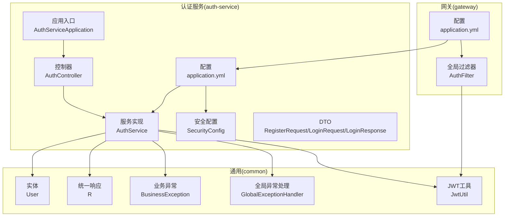
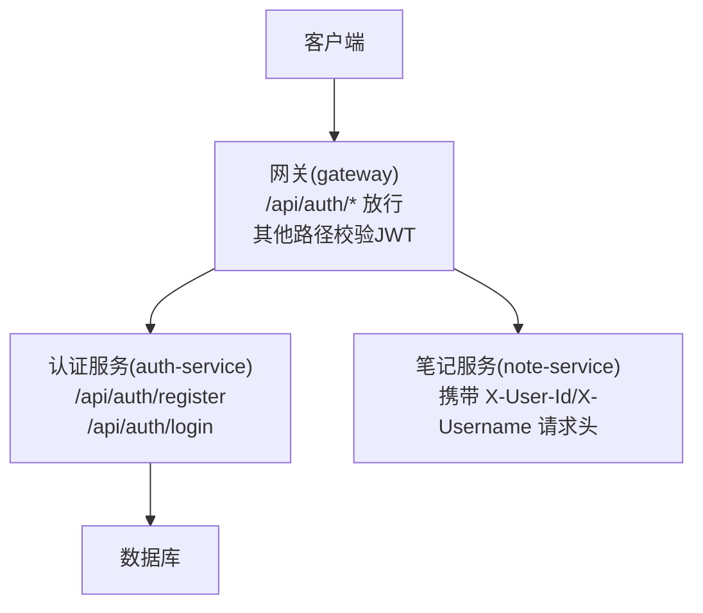
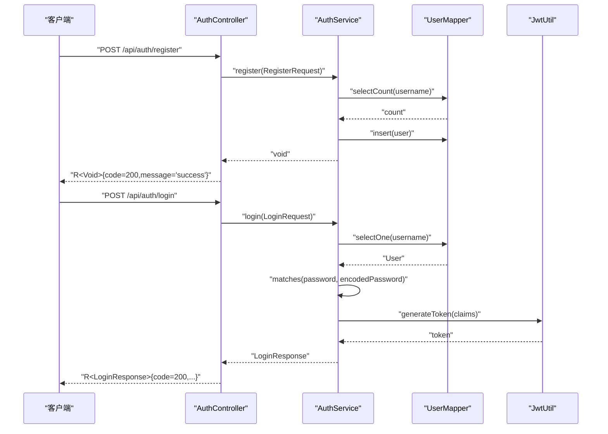
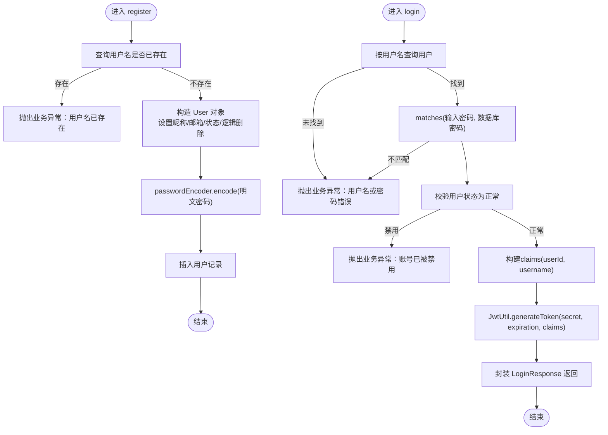
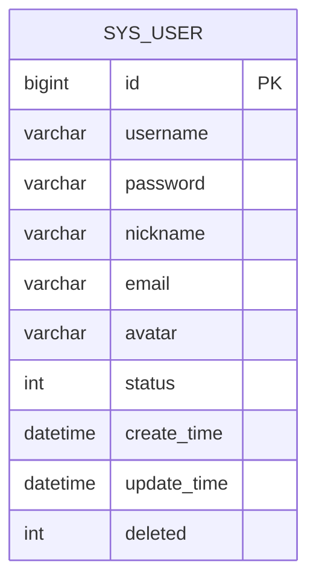
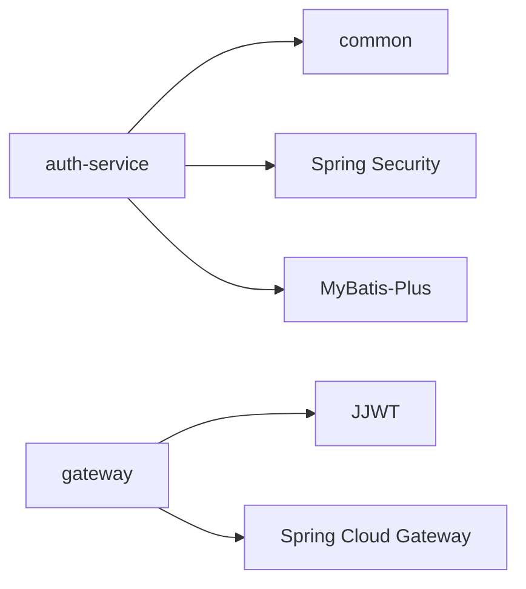

# 认证服务

<cite>
**本文引用的文件**
- [AuthServiceApplication.java](file://services/auth-service/src/main/java/com/nonegonotes/auth/AuthServiceApplication.java)
- [SecurityConfig.java](file://services/auth-service/src/main/java/com/nonegonotes/auth/config/SecurityConfig.java)
- [AuthController.java](file://services/auth-service/src/main/java/com/nonegonotes/auth/controller/AuthController.java)
- [AuthService.java](file://services/auth-service/src/main/java/com/nonegonotes/auth/service/AuthService.java)
- [LoginRequest.java](file://services/auth-service/src/main/java/com/nonegonotes/auth/dto/LoginRequest.java)
- [LoginResponse.java](file://services/auth-service/src/main/java/com/nonegonotes/auth/dto/LoginResponse.java)
- [RegisterRequest.java](file://services/auth-service/src/main/java/com/nonegonotes/auth/dto/RegisterRequest.java)
- [application.yml（认证服务）](file://services/auth-service/src/main/resources/application.yml)
- [User.java](file://services/common/src/main/java/com/nonegonotes/common/entity/User.java)
- [R.java](file://services/common/src/main/java/com/nonegonotes/common/result/R.java)
- [BusinessException.java](file://services/common/src/main/java/com/nonegonotes/common/exception/BusinessException.java)
- [GlobalExceptionHandler.java](file://services/common/src/main/java/com/nonegonotes/common/exception/GlobalExceptionHandler.java)
- [JwtUtil.java](file://services/common/src/main/java/com/nonegonotes/common/util/JwtUtil.java)
- [AuthFilter.java](file://services/gateway/filter/AuthFilter.java)
- [application.yml（网关）](file://services/gateway/src/main/resources/application.yml)
</cite>

## 目录
1. [简介](#简介)
2. [项目结构](#项目结构)
3. [核心组件](#核心组件)
4. [架构总览](#架构总览)
5. [详细组件分析](#详细组件分析)
6. [依赖分析](#依赖分析)
7. [性能考虑](#性能考虑)
8. [故障排查指南](#故障排查指南)
9. [结论](#结论)
10. [附录](#附录)

## 简介
本文件为 Woo 认证服务的技术文档，聚焦于基于 JWT 的用户认证与授权机制，覆盖用户注册、登录、令牌生成与验证的完整流程；解释 Spring Security 密码加密策略、全局异常处理与统一响应模型；阐述 AuthController 的 REST API 设计；详解 AuthService 的业务逻辑实现（用户名唯一性校验、密码哈希处理、JWT 令牌签发）；并提供 API 调用示例、错误处理机制、权限控制、会话管理与安全最佳实践。

## 项目结构
认证服务采用多模块分层组织：
- 认证服务模块（auth-service）：负责用户注册与登录、密码编码、JWT 生成与校验、统一响应与异常处理集成。
- 通用模块（common）：定义用户实体、统一响应体、业务异常、JWT 工具类等跨服务共享能力。
- 网关模块（gateway）：负责路由转发与全局 JWT 校验，将用户标识注入下游服务请求头。



图表来源
- [AuthServiceApplication.java:1-15](file://services/auth-service/src/main/java/com/nonegonotes/auth/AuthServiceApplication.java#L1-L15)
- [AuthController.java:1-31](file://services/auth-service/src/main/java/com/nonegonotes/auth/controller/AuthController.java#L1-L31)
- [AuthService.java:1-95](file://services/auth-service/src/main/java/com/nonegonotes/auth/service/AuthService.java#L1-L95)
- [SecurityConfig.java:1-16](file://services/auth-service/src/main/java/com/nonegonotes/auth/config/SecurityConfig.java#L1-L16)
- [application.yml（认证服务）:1-40](file://services/auth-service/src/main/resources/application.yml#L1-L40)
- [User.java:1-40](file://services/common/src/main/java/com/nonegonotes/common/entity/User.java#L1-L40)
- [R.java:1-42](file://services/common/src/main/java/com/nonegonotes/common/result/R.java#L1-L42)
- [BusinessException.java:1-22](file://services/common/src/main/java/com/nonegonotes/common/exception/BusinessException.java#L1-L22)
- [GlobalExceptionHandler.java:1-27](file://services/common/src/main/java/com/nonegonotes/common/exception/GlobalExceptionHandler.java#L1-L27)
- [JwtUtil.java:1-57](file://services/common/src/main/java/com/nonegonotes/common/util/JwtUtil.java#L1-L57)
- [AuthFilter.java:1-91](file://services/gateway/filter/AuthFilter.java#L1-L91)
- [application.yml（网关）:1-27](file://services/gateway/src/main/resources/application.yml#L1-L27)

章节来源
- [AuthServiceApplication.java:1-15](file://services/auth-service/src/main/java/com/nonegonotes/auth/AuthServiceApplication.java#L1-L15)
- [application.yml（认证服务）:1-40](file://services/auth-service/src/main/resources/application.yml#L1-L40)
- [application.yml（网关）:1-27](file://services/gateway/src/main/resources/application.yml#L1-L27)

## 核心组件
- 认证控制器（AuthController）
  - 提供注册与登录接口，返回统一响应体。
  - 接口路径前缀为 /api/auth。
- 认证服务（AuthService）
  - 实现注册与登录业务逻辑，包含用户名唯一性检查、密码哈希、状态校验与 JWT 生成。
- 安全配置（SecurityConfig）
  - 提供 BCrypt 密码编码器 Bean，用于密码加密策略。
- DTO 层
  - RegisterRequest、LoginRequest、LoginResponse，承载请求与响应数据结构。
- 统一响应与异常
  - R 统一响应体、BusinessException 业务异常、GlobalExceptionHandler 全局异常处理。
- JWT 工具（JwtUtil）
  - 提供令牌生成、解析与有效性校验。
- 网关过滤器（AuthFilter）
  - 全局校验 Authorization 头中的 Bearer Token，并将用户标识注入请求头。

章节来源
- [AuthController.java:1-31](file://services/auth-service/src/main/java/com/nonegonotes/auth/controller/AuthController.java#L1-L31)
- [AuthService.java:1-95](file://services/auth-service/src/main/java/com/nonegonotes/auth/service/AuthService.java#L1-L95)
- [SecurityConfig.java:1-16](file://services/auth-service/src/main/java/com/nonegonotes/auth/config/SecurityConfig.java#L1-L16)
- [LoginRequest.java:1-18](file://services/auth-service/src/main/java/com/nonegonotes/auth/dto/LoginRequest.java#L1-L18)
- [LoginResponse.java:1-20](file://services/auth-service/src/main/java/com/nonegonotes/auth/dto/LoginResponse.java#L1-L20)
- [RegisterRequest.java:1-25](file://services/auth-service/src/main/java/com/nonegonotes/auth/dto/RegisterRequest.java#L1-L25)
- [R.java:1-42](file://services/common/src/main/java/com/nonegonotes/common/result/R.java#L1-L42)
- [BusinessException.java:1-22](file://services/common/src/main/java/com/nonegonotes/common/exception/BusinessException.java#L1-L22)
- [GlobalExceptionHandler.java:1-27](file://services/common/src/main/java/com/nonegonotes/common/exception/GlobalExceptionHandler.java#L1-L27)
- [JwtUtil.java:1-57](file://services/common/src/main/java/com/nonegonotes/common/util/JwtUtil.java#L1-L57)
- [AuthFilter.java:1-91](file://services/gateway/filter/AuthFilter.java#L1-L91)

## 架构总览
认证服务通过网关进行统一入口访问，网关对 /api/auth/* 路径放行，其他路径进行 JWT 校验并将用户标识透传至下游服务。



图表来源
- [application.yml（网关）:11-22](file://services/gateway/src/main/resources/application.yml#L11-L22)
- [AuthFilter.java:34-37](file://services/gateway/filter/AuthFilter.java#L34-L37)
- [AuthController.java:19-29](file://services/auth-service/src/main/java/com/nonegonotes/auth/controller/AuthController.java#L19-L29)

## 详细组件分析

### 控制器层：AuthController
- 功能职责
  - 注册：接收 RegisterRequest，调用 AuthService.register 并返回 R.ok()。
  - 登录：接收 LoginRequest，调用 AuthService.login，返回包含 LoginResponse 的 R.ok(...)。
- 请求与响应
  - 注册：POST /api/auth/register，请求体为 RegisterRequest。
  - 登录：POST /api/auth/login，请求体为 LoginRequest。
  - 响应：统一使用 R<T>，成功时 code=200，message="success"。
- 参数校验
  - 使用 Jakarta Validation 注解对用户名、密码长度与非空进行约束。



图表来源
- [AuthController.java:19-29](file://services/auth-service/src/main/java/com/nonegonotes/auth/controller/AuthController.java#L19-L29)
- [AuthService.java:35-93](file://services/auth-service/src/main/java/com/nonegonotes/auth/service/AuthService.java#L35-L93)
- [RegisterRequest.java:10-24](file://services/auth-service/src/main/java/com/nonegonotes/auth/dto/RegisterRequest.java#L10-L24)
- [LoginRequest.java:9-17](file://services/auth-service/src/main/java/com/nonegonotes/auth/dto/LoginRequest.java#L9-L17)
- [LoginResponse.java:9-19](file://services/auth-service/src/main/java/com/nonegonotes/auth/dto/LoginResponse.java#L9-L19)
- [JwtUtil.java:20-31](file://services/common/src/main/java/com/nonegonotes/common/util/JwtUtil.java#L20-L31)

章节来源
- [AuthController.java:1-31](file://services/auth-service/src/main/java/com/nonegonotes/auth/controller/AuthController.java#L1-L31)
- [R.java:19-29](file://services/common/src/main/java/com/nonegonotes/common/result/R.java#L19-L29)

### 服务层：AuthService
- 注册流程
  - 校验用户名唯一性，若重复抛出业务异常。
  - 构造 User 对象，设置昵称、邮箱、状态与逻辑删除字段。
  - 使用 PasswordEncoder 进行密码哈希后入库。
- 登录流程
  - 查询用户并校验是否存在。
  - 使用 PasswordEncoder.matches 校验密码。
  - 校验用户状态为正常。
  - 以 userId 与 username 作为声明生成 JWT，返回包含 token、类型、过期时间与用户信息的 LoginResponse。
- 配置项
  - jwt.secret 与 jwt.expiration 从配置文件读取。



图表来源
- [AuthService.java:35-93](file://services/auth-service/src/main/java/com/nonegonotes/auth/service/AuthService.java#L35-L93)
- [User.java:11-39](file://services/common/src/main/java/com/nonegonotes/common/entity/User.java#L11-L39)
- [JwtUtil.java:20-31](file://services/common/src/main/java/com/nonegonotes/common/util/JwtUtil.java#L20-L31)

章节来源
- [AuthService.java:1-95](file://services/auth-service/src/main/java/com/nonegonotes/auth/service/AuthService.java#L1-L95)
- [application.yml（认证服务）:30-33](file://services/auth-service/src/main/resources/application.yml#L30-L33)

### 安全与配置
- 密码加密策略
  - 通过 SecurityConfig 提供 BCryptPasswordEncoder Bean，确保密码以 BCrypt 方式存储。
- CORS 与安全过滤器链
  - 当前认证服务未显式配置 WebMvcConfigurer/CorsConfigurationSource，亦未自定义 SecurityFilterChain；默认行为由 Spring Boot Starter Web 与 Spring Security 默认规则决定。建议在生产环境明确配置 CORS 与安全过滤器链以满足具体需求。
- 统一响应与异常处理
  - R<T> 统一返回 code/message/data；GlobalExceptionHandler 捕获 BusinessException 返回其 code，捕获其他异常返回服务器内部错误。

章节来源
- [SecurityConfig.java:1-16](file://services/auth-service/src/main/java/com/nonegonotes/auth/config/SecurityConfig.java#L1-L16)
- [R.java:11-41](file://services/common/src/main/java/com/nonegonotes/common/result/R.java#L11-L41)
- [GlobalExceptionHandler.java:14-25](file://services/common/src/main/java/com/nonegonotes/common/exception/GlobalExceptionHandler.java#L14-L25)

### 网关与权限控制
- 路由配置
  - 认证服务路由：/api/auth/**。
  - 笔记服务路由：/api/folders/**,/api/documents/**。
- 全局过滤器 AuthFilter
  - 白名单：/api/auth/login、/api/auth/register 直接放行。
  - 其他路径：校验 Authorization 头是否为 Bearer Token，解析失败或签名无效则返回 401。
  - 成功解析后，将 userId 与 username 注入请求头（X-User-Id、X-Username），供下游服务使用。

```mermaid
sequenceDiagram
participant C as "客户端"
participant GW as "网关AuthFilter"
participant AUTH as "认证服务"
participant NOTE as "笔记服务"
C->>GW : "GET /api/folders/..."
GW->>GW : "检查白名单"
GW->>GW : "提取Authorization头"
GW->>GW : "解析并验证JWT"
alt "失败"
GW-->>C : "401 Unauthorized"
else "成功"
GW->>NOTE : "转发请求并注入X-User-Id/X-Username"
NOTE-->>C : "业务响应"
end
```

图表来源
- [AuthFilter.java:34-83](file://services/gateway/filter/AuthFilter.java#L34-L83)
- [application.yml（网关）:12-22](file://services/gateway/src/main/resources/application.yml#L12-L22)

章节来源
- [AuthFilter.java:1-91](file://services/gateway/filter/AuthFilter.java#L1-L91)
- [application.yml（网关）:1-27](file://services/gateway/src/main/resources/application.yml#L1-L27)

### DTO 与实体模型
- RegisterRequest
  - 字段：username（3-20）、password（6-50）、nickname、email。
- LoginRequest
  - 字段：username、password。
- LoginResponse
  - 字段：accessToken、tokenType、expiresIn、userId、username、nickname。
- User
  - 字段：id、username、password、nickname、email、avatar、status、createTime、updateTime、deleted。



图表来源
- [User.java:11-39](file://services/common/src/main/java/com/nonegonotes/common/entity/User.java#L11-L39)

章节来源
- [RegisterRequest.java:10-24](file://services/auth-service/src/main/java/com/nonegonotes/auth/dto/RegisterRequest.java#L10-L24)
- [LoginRequest.java:9-17](file://services/auth-service/src/main/java/com/nonegonotes/auth/dto/LoginRequest.java#L9-L17)
- [LoginResponse.java:9-19](file://services/auth-service/src/main/java/com/nonegonotes/auth/dto/LoginResponse.java#L9-L19)
- [User.java:11-39](file://services/common/src/main/java/com/nonegonotes/common/entity/User.java#L11-L39)

## 依赖分析
- 认证服务依赖
  - common 模块：User 实体、R 统一响应、BusinessException、JwtUtil。
  - Spring Security：BCryptPasswordEncoder。
  - MyBatis-Plus：LambdaQueryWrapper 查询。
- 网关依赖
  - Spring Cloud Gateway：全局过滤器链。
  - JWT 库：Jwts 解析与校验。



图表来源
- [AuthService.java:3-14](file://services/auth-service/src/main/java/com/nonegonotes/auth/service/AuthService.java#L3-L14)
- [AuthFilter.java:3-18](file://services/gateway/filter/AuthFilter.java#L3-L18)

章节来源
- [AuthService.java:1-95](file://services/auth-service/src/main/java/com/nonegonotes/auth/service/AuthService.java#L1-L95)
- [AuthFilter.java:1-91](file://services/gateway/filter/AuthFilter.java#L1-L91)

## 性能考虑
- 密码哈希成本
  - BCrypt 默认迭代次数较高，建议结合压测评估 CPU 开销，必要时调整编码器配置或使用更高效的硬件。
- JWT 过期时间
  - 当前默认 24 小时，建议根据业务场景调整，避免过短导致频繁刷新、过长带来风险。
- 数据库查询
  - 注册前的用户名唯一性查询与登录时的用户名查询均使用等值条件，建议在 username 上建立索引以提升命中率。
- 网关过滤器
  - 每次请求都会解析 JWT，建议在网关层启用缓存或限流策略，防止高并发下的解析压力。

## 故障排查指南
- 常见错误与处理
  - 用户名已存在：注册阶段重复用户名触发业务异常，返回统一响应。
  - 用户名或密码错误：登录阶段用户不存在或密码不匹配触发业务异常。
  - 账号被禁用：状态非正常触发业务异常。
  - 未提供或无效 Bearer Token：网关返回 401。
- 日志与可观测性
  - 全局异常处理器记录警告与错误日志，便于定位问题。
- 建议
  - 在开发环境开启 Knife4j 文档以便调试接口。
  - 对外暴露的接口建议增加限流与防刷策略。

章节来源
- [BusinessException.java:8-21](file://services/common/src/main/java/com/nonegonotes/common/exception/BusinessException.java#L8-L21)
- [GlobalExceptionHandler.java:15-25](file://services/common/src/main/java/com/nonegonotes/common/exception/GlobalExceptionHandler.java#L15-L25)
- [AuthFilter.java:52-55](file://services/gateway/filter/AuthFilter.java#L52-L55)

## 结论
本认证服务通过 DTO 明确请求/响应结构、Service 承载业务逻辑、Gateway 实现统一鉴权与用户标识透传，配合 BCrypt 密码哈希与 JWT 令牌机制，形成一套清晰、可扩展的认证授权方案。建议在生产环境中完善 CORS 与安全过滤器链配置、优化数据库索引与 JWT 过期策略，并引入限流与监控以增强稳定性与安全性。

## 附录

### API 设计与调用示例
- 注册
  - 方法与路径：POST /api/auth/register
  - 请求体字段：username、password、nickname、email
  - 成功响应：code=200，message="success"
- 登录
  - 方法与路径：POST /api/auth/login
  - 请求体字段：username、password
  - 成功响应字段：accessToken、tokenType、expiresIn、userId、username、nickname
- 错误响应
  - 业务异常：code 来源于 BusinessException，message 为错误描述
  - 服务器内部错误：统一返回 code=500，message="服务器内部错误"

章节来源
- [AuthController.java:19-29](file://services/auth-service/src/main/java/com/nonegonotes/auth/controller/AuthController.java#L19-L29)
- [R.java:19-40](file://services/common/src/main/java/com/nonegonotes/common/result/R.java#L19-L40)
- [BusinessException.java:13-20](file://services/common/src/main/java/com/nonegonotes/common/exception/BusinessException.java#L13-L20)
- [GlobalExceptionHandler.java:15-25](file://services/common/src/main/java/com/nonegonotes/common/exception/GlobalExceptionHandler.java#L15-L25)