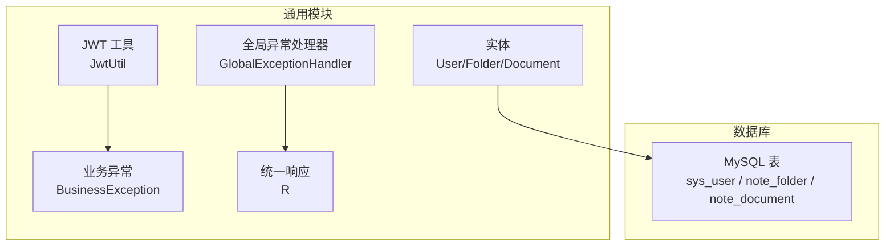
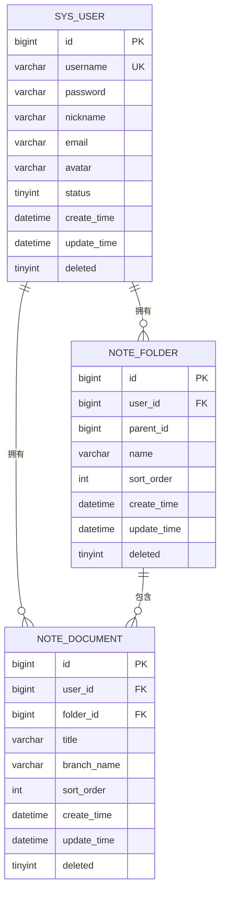
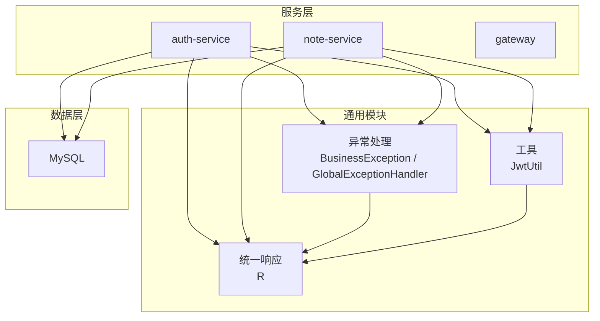
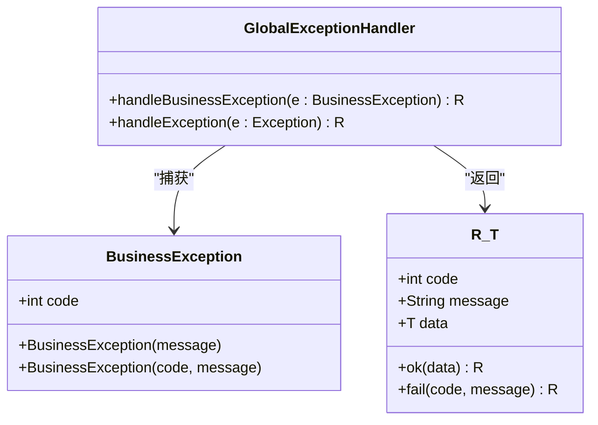
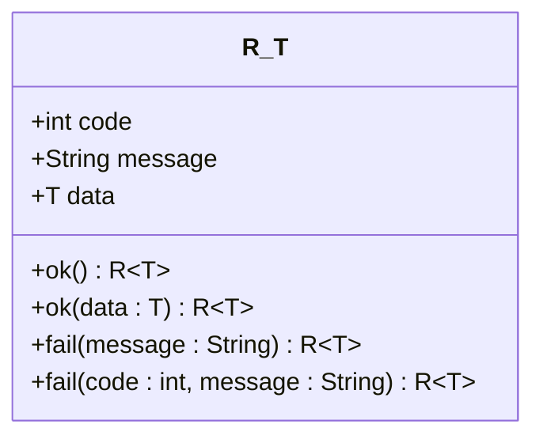
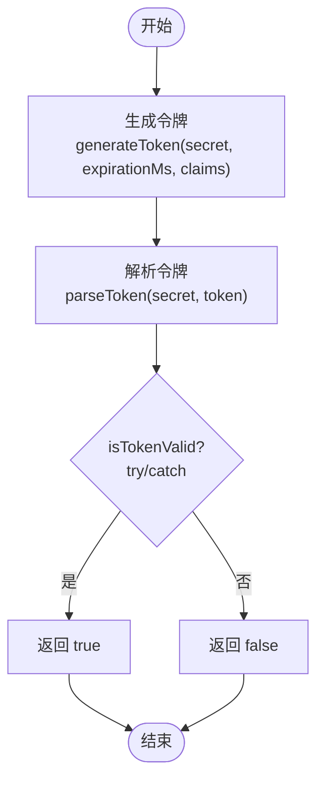
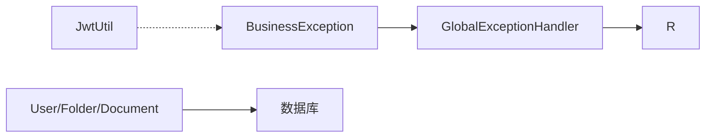

# 通用模块

<cite>
**本文引用的文件**
- [User.java](file://services/common/src/main/java/com/nonegonotes/common/entity/User.java)
- [Folder.java](file://services/common/src/main/java/com/nonegonotes/common/entity/Folder.java)
- [Document.java](file://services/common/src/main/java/com/nonegonotes/common/entity/Document.java)
- [BusinessException.java](file://services/common/src/main/java/com/nonegonotes/common/exception/BusinessException.java)
- [GlobalExceptionHandler.java](file://services/common/src/main/java/com/nonegonotes/common/exception/GlobalExceptionHandler.java)
- [R.java](file://services/common/src/main/java/com/nonegonotes/common/result/R.java)
- [JwtUtil.java](file://services/common/src/main/java/com/nonegonotes/common/util/JwtUtil.java)
- [init.sql](file://services/sql/init.sql)
</cite>

## 目录
1. [简介](#简介)
2. [项目结构](#项目结构)
3. [核心组件](#核心组件)
4. [架构总览](#架构总览)
5. [详细组件分析](#详细组件分析)
6. [依赖分析](#依赖分析)
7. [性能考虑](#性能考虑)
8. [故障排查指南](#故障排查指南)
9. [结论](#结论)
10. [附录](#附录)

## 简介
本文件面向Woo项目的“通用模块”，系统性梳理并说明以下内容：
- 共享实体类的设计与实现：User、Folder、Document 的字段定义、关系映射与业务规则
- 异常处理机制：BusinessException 业务异常类、GlobalExceptionHandler 全局异常处理器与标准化错误响应格式
- 统一响应包装类 R 的设计理念：成功/失败/分页统一格式
- JWT 工具类 JwtUtil 的实现：令牌生成、解析与验证
- 实体类使用示例、异常处理最佳实践与工具类调用指南
- 代码复用策略与模块间接口设计原则

## 项目结构
通用模块位于后端服务层，提供跨服务共享的基础设施能力，包括：
- 实体层：User、Folder、Document
- 异常层：BusinessException、GlobalExceptionHandler
- 响应层：R
- 工具层：JwtUtil
- 数据库初始化脚本：init.sql

图表来源
- [User.java:1-42](file://services/common/src/main/java/com/nonegonotes/common/entity/User.java#L1-L42)
- [Folder.java:1-39](file://services/common/src/main/java/com/nonegonotes/common/entity/Folder.java#L1-L39)
- [Document.java:1-42](file://services/common/src/main/java/com/nonegonotes/common/entity/Document.java#L1-L42)
- [BusinessException.java:1-22](file://services/common/src/main/java/com/nonegonotes/common/exception/BusinessException.java#L1-L22)
- [GlobalExceptionHandler.java:1-27](file://services/common/src/main/java/com/nonegonotes/common/exception/GlobalExceptionHandler.java#L1-L27)
- [R.java:1-42](file://services/common/src/main/java/com/nonegonotes/common/result/R.java#L1-L42)
- [JwtUtil.java:1-57](file://services/common/src/main/java/com/nonegonotes/common/util/JwtUtil.java#L1-L57)
- [init.sql:1-55](file://services/sql/init.sql#L1-L55)

章节来源
- [User.java:1-42](file://services/common/src/main/java/com/nonegonotes/common/entity/User.java#L1-L42)
- [Folder.java:1-39](file://services/common/src/main/java/com/nonegonotes/common/entity/Folder.java#L1-L39)
- [Document.java:1-42](file://services/common/src/main/java/com/nonegonotes/common/entity/Document.java#L1-L42)
- [BusinessException.java:1-22](file://services/common/src/main/java/com/nonegonotes/common/exception/BusinessException.java#L1-L22)
- [GlobalExceptionHandler.java:1-27](file://services/common/src/main/java/com/nonegonotes/common/exception/GlobalExceptionHandler.java#L1-L27)
- [R.java:1-42](file://services/common/src/main/java/com/nonegonotes/common/result/R.java#L1-L42)
- [JwtUtil.java:1-57](file://services/common/src/main/java/com/nonegonotes/common/util/JwtUtil.java#L1-L57)
- [init.sql:1-55](file://services/sql/init.sql#L1-L55)

## 核心组件
本节从“字段定义、关系映射、业务规则”三方面对共享实体进行深入剖析，并结合数据库脚本验证。

- User（用户）
  - 关键字段：id、username、password、nickname、email、avatar、status、createTime、updateTime、deleted
  - 业务规则：username 唯一；状态 0/1 表示禁用/正常；支持逻辑删除
  - 映射关系：与 Folder、Document 通过 userId 建立一对多关系

- Folder（目录）
  - 关键字段：id、userId、parentId（顶级为空）、name、sortOrder、createTime、updateTime、deleted
  - 业务规则：parentId 指向父节点，形成树形层级；sortOrder 控制同级顺序
  - 映射关系：属于某用户；与 Document 通过 folderId 建立一对多关系

- Document（文稿）
  - 关键字段：id、userId、folderId、title、branchName、sortOrder、createTime、updateTime、deleted
  - 业务规则：title 必填；branchName 可选用于关联 Git 分支；sortOrder 控制同级顺序
  - 映射关系：属于某用户与某目录

图表来源
- [init.sql:9-23](file://services/sql/init.sql#L9-L23)
- [init.sql:25-38](file://services/sql/init.sql#L25-L38)
- [init.sql:40-54](file://services/sql/init.sql#L40-L54)

章节来源
- [User.java:1-42](file://services/common/src/main/java/com/nonegonotes/common/entity/User.java#L1-L42)
- [Folder.java:1-39](file://services/common/src/main/java/com/nonegonotes/common/entity/Folder.java#L1-L39)
- [Document.java:1-42](file://services/common/src/main/java/com/nonegonotes/common/entity/Document.java#L1-L42)
- [init.sql:9-54](file://services/sql/init.sql#L9-L54)

## 架构总览
通用模块在系统中的定位如下：
- 作为“共享基础设施”，被多个业务服务（如 note-service）复用
- 提供统一的异常处理与响应封装，保证各服务对外一致的错误语义
- 提供 JWT 工具，支撑认证与授权流程

图表来源
- [BusinessException.java:1-22](file://services/common/src/main/java/com/nonegonotes/common/exception/BusinessException.java#L1-L22)
- [GlobalExceptionHandler.java:1-27](file://services/common/src/main/java/com/nonegonotes/common/exception/GlobalExceptionHandler.java#L1-L27)
- [R.java:1-42](file://services/common/src/main/java/com/nonegonotes/common/result/R.java#L1-L42)
- [JwtUtil.java:1-57](file://services/common/src/main/java/com/nonegonotes/common/util/JwtUtil.java#L1-L57)

## 详细组件分析

### 异常处理机制
- BusinessException：业务异常基类，携带业务码与消息
- GlobalExceptionHandler：全局异常处理器，分别处理业务异常与未预期异常，统一返回 R 包装的响应

图表来源
- [BusinessException.java:1-22](file://services/common/src/main/java/com/nonegonotes/common/exception/BusinessException.java#L1-L22)
- [GlobalExceptionHandler.java:1-27](file://services/common/src/main/java/com/nonegonotes/common/exception/GlobalExceptionHandler.java#L1-L27)
- [R.java:1-42](file://services/common/src/main/java/com/nonegonotes/common/result/R.java#L1-L42)

章节来源
- [BusinessException.java:1-22](file://services/common/src/main/java/com/nonegonotes/common/exception/BusinessException.java#L1-L22)
- [GlobalExceptionHandler.java:1-27](file://services/common/src/main/java/com/nonegonotes/common/exception/GlobalExceptionHandler.java#L1-L27)
- [R.java:1-42](file://services/common/src/main/java/com/nonegonotes/common/result/R.java#L1-L42)

### 统一响应包装类 R
- 设计理念：以泛型承载任意数据类型，提供 ok/fail 两类静态工厂方法，确保前后端交互的一致性
- 成功响应：默认 code=200，message="success"
- 失败响应：支持传入业务码与消息，或默认“服务器内部错误”
- 分页场景：data 字段可承载分页对象（如 Page）

图表来源
- [R.java:1-42](file://services/common/src/main/java/com/nonegonotes/common/result/R.java#L1-L42)

章节来源
- [R.java:1-42](file://services/common/src/main/java/com/nonegonotes/common/result/R.java#L1-L42)

### JWT 工具类 JwtUtil
- 令牌生成：基于密钥与过期时间构建签名令牌，支持附加声明
- 令牌解析：使用相同密钥验证并解析载荷
- 有效性校验：封装解析过程，返回布尔值表示是否有效

图表来源
- [JwtUtil.java:1-57](file://services/common/src/main/java/com/nonegonotes/common/util/JwtUtil.java#L1-L57)

章节来源
- [JwtUtil.java:1-57](file://services/common/src/main/java/com/nonegonotes/common/util/JwtUtil.java#L1-L57)

### 实体类使用示例与最佳实践
- User
  - 使用场景：登录、注册、权限校验
  - 最佳实践：密码必须经安全算法加密存储；状态字段用于快速禁用用户
- Folder
  - 使用场景：目录树构建、移动/重命名、排序
  - 最佳实践：parentId 为空时视为根节点；排序字段用于前端展示
- Document
  - 使用场景：文稿列表、详情、归档
  - 最佳实践：title 必填；branchName 用于与版本控制集成

章节来源
- [User.java:1-42](file://services/common/src/main/java/com/nonegonotes/common/entity/User.java#L1-L42)
- [Folder.java:1-39](file://services/common/src/main/java/com/nonegonotes/common/entity/Folder.java#L1-L39)
- [Document.java:1-42](file://services/common/src/main/java/com/nonegonotes/common/entity/Document.java#L1-L42)

### 模块间接口设计原则
- 单一职责：实体仅描述数据与映射；异常与响应负责横切关注点；工具负责纯函数
- 低耦合：通过 R 统一输出，避免服务直接暴露异常细节
- 可测试性：JwtUtil 与 R 均为无状态工具类，便于单元测试
- 版本兼容：字段与表结构变更需同步迁移脚本

## 依赖分析
通用模块内部组件之间的依赖关系清晰，均为单向依赖，无循环依赖风险。

图表来源
- [BusinessException.java:1-22](file://services/common/src/main/java/com/nonegonotes/common/exception/BusinessException.java#L1-L22)
- [GlobalExceptionHandler.java:1-27](file://services/common/src/main/java/com/nonegonotes/common/exception/GlobalExceptionHandler.java#L1-L27)
- [R.java:1-42](file://services/common/src/main/java/com/nonegonotes/common/result/R.java#L1-L42)
- [JwtUtil.java:1-57](file://services/common/src/main/java/com/nonegonotes/common/util/JwtUtil.java#L1-L57)
- [User.java:1-42](file://services/common/src/main/java/com/nonegonotes/common/entity/User.java#L1-L42)
- [Folder.java:1-39](file://services/common/src/main/java/com/nonegonotes/common/entity/Folder.java#L1-L39)
- [Document.java:1-42](file://services/common/src/main/java/com/nonegonotes/common/entity/Document.java#L1-L42)

章节来源
- [BusinessException.java:1-22](file://services/common/src/main/java/com/nonegonotes/common/exception/BusinessException.java#L1-L22)
- [GlobalExceptionHandler.java:1-27](file://services/common/src/main/java/com/nonegonotes/common/exception/GlobalExceptionHandler.java#L1-L27)
- [R.java:1-42](file://services/common/src/main/java/com/nonegonotes/common/result/R.java#L1-L42)
- [JwtUtil.java:1-57](file://services/common/src/main/java/com/nonegonotes/common/util/JwtUtil.java#L1-L57)
- [User.java:1-42](file://services/common/src/main/java/com/nonegonotes/common/entity/User.java#L1-L42)
- [Folder.java:1-39](file://services/common/src/main/java/com/nonegonotes/common/entity/Folder.java#L1-L39)
- [Document.java:1-42](file://services/common/src/main/java/com/nonegonotes/common/entity/Document.java#L1-L42)

## 性能考虑
- 实体持久化：MyBatis-Plus 自动填充字段（创建/更新时间）减少重复代码，降低出错概率
- 逻辑删除：deleted 字段支持软删除，避免全表扫描与数据丢失风险
- 分页查询：建议在服务层使用分页参数，配合 R 的分页数据承载能力
- JWT 密钥管理：生产环境应使用安全的密钥存储与轮换策略，避免硬编码

## 故障排查指南
- 业务异常未被捕获
  - 检查是否抛出了 BusinessException 或其子类
  - 确认 GlobalExceptionHandler 生效范围（@RestControllerAdvice）
- 统一响应未按预期返回
  - 核对 R.ok()/R.fail() 的调用位置与参数
  - 确保控制器返回值由 Spring MVC 正确序列化
- JWT 校验失败
  - 核对密钥是否一致
  - 检查过期时间设置与当前时间偏差
  - 确认令牌签名算法与解析流程一致

章节来源
- [GlobalExceptionHandler.java:1-27](file://services/common/src/main/java/com/nonegonotes/common/exception/GlobalExceptionHandler.java#L1-L27)
- [R.java:1-42](file://services/common/src/main/java/com/nonegonotes/common/result/R.java#L1-L42)
- [JwtUtil.java:1-57](file://services/common/src/main/java/com/nonegonotes/common/util/JwtUtil.java#L1-L57)

## 结论
通用模块通过简洁而稳健的设计，提供了跨服务复用的实体、异常、响应与工具能力。遵循本文的使用规范与最佳实践，可在保证一致性的同时提升开发效率与系统稳定性。

## 附录
- 数据库初始化脚本要点
  - sys_user：唯一索引 username，逻辑删除字段
  - note_folder：用户索引 user_id、父子索引 parent_id，逻辑删除字段
  - note_document：用户索引 user_id、目录索引 folder_id，逻辑删除字段

章节来源
- [init.sql:1-55](file://services/sql/init.sql#L1-L55)