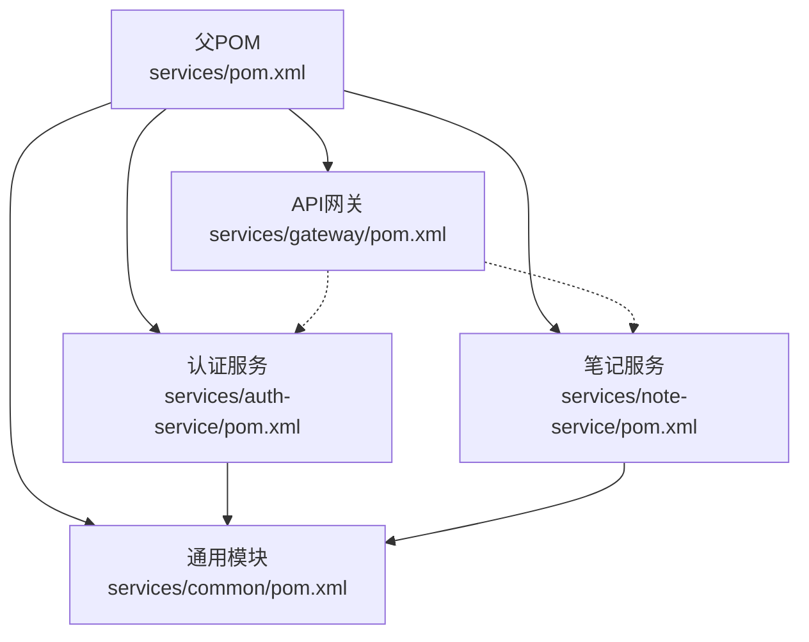
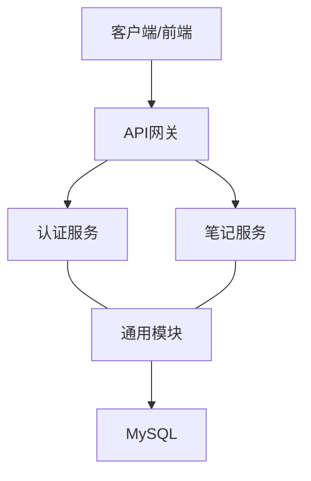
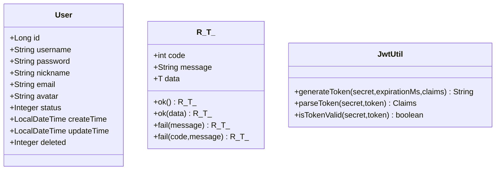
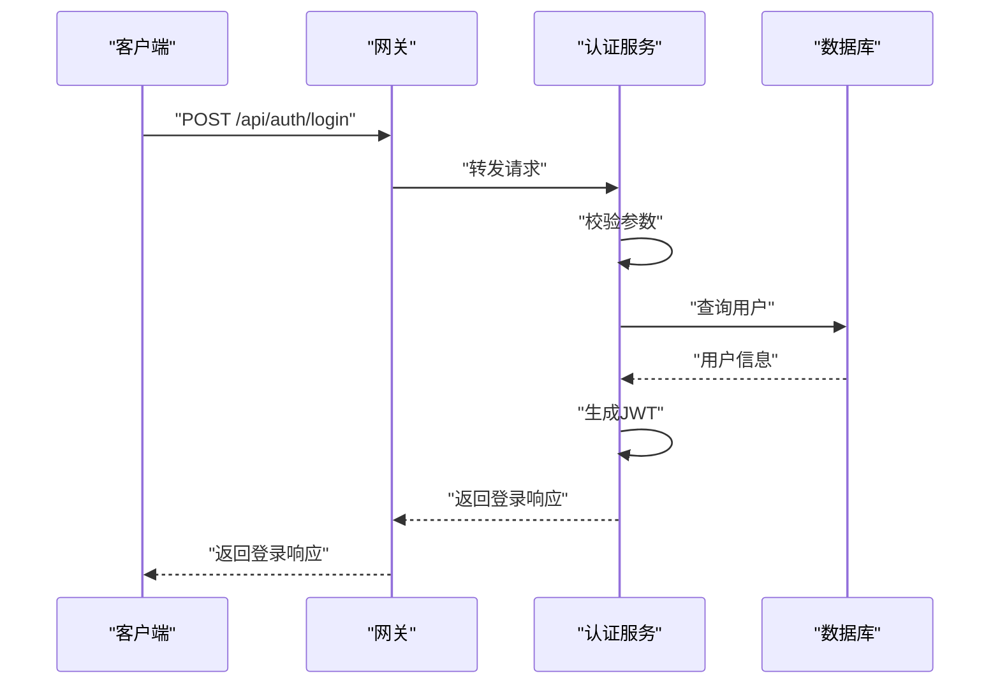
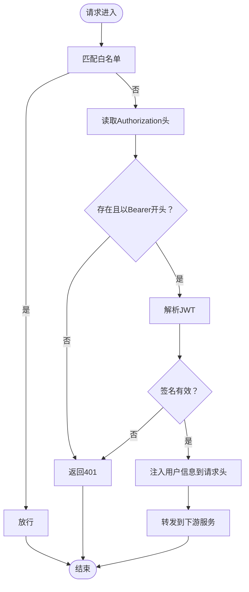
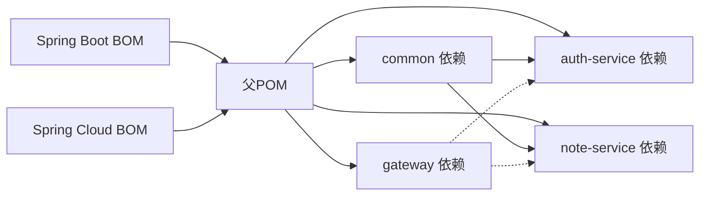

# 项目结构与模块管理

<cite>
**本文引用的文件**
- [根POM（services/pom.xml）](file://services/pom.xml)
- [认证服务POM（services/auth-service/pom.xml）](file://services/auth-service/pom.xml)
- [笔记服务POM（services/note-service/pom.xml）](file://services/note-service/pom.xml)
- [网关POM（services/gateway/pom.xml）](file://services/gateway/pom.xml)
- [通用模块POM（services/common/pom.xml）](file://services/common/pom.xml)
- [认证服务入口（AuthServiceApplication.java）](file://services/auth-service/src/main/java/com/nonegonotes/auth/AuthServiceApplication.java)
- [笔记服务入口（NoteServiceApplication.java）](file://services/note-service/src/main/java/com/nonegonotes/note/NoteServiceApplication.java)
- [网关入口（GatewayApplication.java）](file://services/gateway/src/main/java/com/nonegonotes/gateway/GatewayApplication.java)
- [用户实体（User.java）](file://services/common/src/main/java/com/nonegonotes/common/entity/User.java)
- [统一响应（R.java）](file://services/common/src/main/java/com/nonegonotes/common/result/R.java)
- [登录请求DTO（LoginRequest.java）](file://services/auth-service/src/main/java/com/nonegonotes/auth/dto/LoginRequest.java)
- [登录响应DTO（LoginResponse.java）](file://services/auth-service/src/main/java/com/nonegonotes/auth/dto/LoginResponse.java)
- [JWT工具（JwtUtil.java）](file://services/common/src/main/java/com/nonegonotes/common/util/JwtUtil.java)
- [网关认证过滤器（AuthFilter.java）](file://services/gateway/src/main/java/com/nonegonotes/gateway/filter/AuthFilter.java)
- [项目说明（README.md）](file://README.md)
</cite>

## 目录
1. [简介](#简介)
2. [项目结构](#项目结构)
3. [核心组件](#核心组件)
4. [架构总览](#架构总览)
5. [详细组件分析](#详细组件分析)
6. [依赖分析](#依赖分析)
7. [性能考虑](#性能考虑)
8. [故障排查指南](#故障排查指南)
9. [结论](#结论)
10. [附录](#附录)

## 简介
本项目为基于 Spring Boot 3 与 Spring Cloud 的多模块后端架构，采用 Maven 进行模块化管理。四大核心模块职责清晰：auth-service 提供用户认证与授权；note-service 提供笔记元数据管理；gateway 作为 API 网关负责路由与鉴权；common 作为通用模块沉淀共享实体、工具与异常处理。通过 dependencyManagement 统一版本管理，确保依赖一致性与可维护性。

## 项目结构
后端位于 services 目录下，采用父子 POM 的层次化结构：
- 父 POM 定义版本属性、依赖管理、插件管理与模块清单
- 子模块按功能拆分，各自声明对父 POM 的继承与对内部/外部依赖的引用

图表来源
- [根POM（services/pom.xml）:15-20](file://services/pom.xml#L15-L20)
- [认证服务POM（services/auth-service/pom.xml）:7-11](file://services/auth-service/pom.xml#L7-L11)
- [笔记服务POM（services/note-service/pom.xml）:7-11](file://services/note-service/pom.xml#L7-L11)
- [网关POM（services/gateway/pom.xml）:7-11](file://services/gateway/pom.xml#L7-L11)
- [通用模块POM（services/common/pom.xml）:7-11](file://services/common/pom.xml#L7-L11)

章节来源
- [根POM（services/pom.xml）:1-141](file://services/pom.xml#L1-L141)
- [项目说明（README.md）:47-63](file://README.md#L47-L63)

## 核心组件
- 通用模块（common）
  - 职责：提供共享实体（如用户）、统一响应封装、异常处理基类、JWT工具等
  - 关键点：以 provided 方式声明对 Spring Boot/Web、MyBatis Plus、Jackson 等依赖，避免污染子模块 classpath
- 认证服务（auth-service）
  - 职责：用户注册/登录、令牌签发、与数据库交互
  - 关键点：依赖 common，集成 Spring Web、Validation、Nacos、MyBatis Plus、MySQL、Druid、Knife4j、Lombok
- 笔记服务（note-service）
  - 职责：文件夹与文档元数据管理
  - 关键点：依赖 common，结构与认证服务一致，便于统一治理
- API 网关（gateway）
  - 职责：统一入口、路由转发、负载均衡、全局鉴权过滤
  - 关键点：依赖 Spring Cloud Gateway、LoadBalancer、Nacos、JWT，内置 AuthFilter 校验 Token 并注入用户上下文

章节来源
- [通用模块POM（services/common/pom.xml）:19-58](file://services/common/pom.xml#L19-L58)
- [认证服务POM（services/auth-service/pom.xml）:19-99](file://services/auth-service/pom.xml#L19-L99)
- [笔记服务POM（services/note-service/pom.xml）:19-83](file://services/note-service/pom.xml#L19-L83)
- [网关POM（services/gateway/pom.xml）:19-61](file://services/gateway/pom.xml#L19-L61)

## 架构总览
系统采用“网关 + 多微服务”的分布式架构：
- 网关层：集中处理跨域、鉴权、路由与负载均衡
- 业务层：认证服务与笔记服务分别提供领域能力
- 共享层：通用模块沉淀公共资产，降低重复与耦合

图表来源
- [网关入口（GatewayApplication.java）:1-15](file://services/gateway/src/main/java/com/nonegonotes/gateway/GatewayApplication.java#L1-L15)
- [认证服务入口（AuthServiceApplication.java）:1-15](file://services/auth-service/src/main/java/com/nonegonotes/auth/AuthServiceApplication.java#L1-L15)
- [笔记服务入口（NoteServiceApplication.java）:1-15](file://services/note-service/src/main/java/com/nonegonotes/note/NoteServiceApplication.java#L1-L15)
- [用户实体（User.java）:1-40](file://services/common/src/main/java/com/nonegonotes/common/entity/User.java#L1-L40)

## 详细组件分析

### 通用模块（common）
- 数据模型与注解
  - 使用 MyBatis Plus 注解映射表字段与逻辑删除
  - 提供统一响应包装类，规范接口返回格式
- 工具与异常
  - JWT 工具类封装生成、解析与校验
  - 全局异常处理器基类，便于扩展
- 依赖策略
  - 对外提供能力，内部依赖以 provided 形式声明，避免传递到业务模块

图表来源
- [用户实体（User.java）:1-40](file://services/common/src/main/java/com/nonegonotes/common/entity/User.java#L1-L40)
- [统一响应（R.java）:1-42](file://services/common/src/main/java/com/nonegonotes/common/result/R.java#L1-L42)
- [JWT工具（JwtUtil.java）:1-57](file://services/common/src/main/java/com/nonegonotes/common/util/JwtUtil.java#L1-L57)

章节来源
- [通用模块POM（services/common/pom.xml）:1-60](file://services/common/pom.xml#L1-L60)
- [用户实体（User.java）:1-40](file://services/common/src/main/java/com/nonegonotes/common/entity/User.java#L1-L40)
- [统一响应（R.java）:1-42](file://services/common/src/main/java/com/nonegonotes/common/result/R.java#L1-L42)
- [JWT工具（JwtUtil.java）:1-57](file://services/common/src/main/java/com/nonegonotes/common/util/JwtUtil.java#L1-L57)

### 认证服务（auth-service）
- 入口与发现
  - Spring Boot 启动类启用服务注册与发现
- DTO 设计
  - LoginRequest：登录输入参数，包含必填校验
  - LoginResponse：登录输出参数，包含访问令牌与用户信息
- 依赖与技术栈
  - 集成 Spring Web、Validation、Nacos、MyBatis Plus、MySQL、Druid、Knife4j、Lombok

图表来源
- [登录请求DTO（LoginRequest.java）:1-18](file://services/auth-service/src/main/java/com/nonegonotes/auth/dto/LoginRequest.java#L1-L18)
- [登录响应DTO（LoginResponse.java）:1-20](file://services/auth-service/src/main/java/com/nonegonotes/auth/dto/LoginResponse.java#L1-L20)
- [认证服务入口（AuthServiceApplication.java）:1-15](file://services/auth-service/src/main/java/com/nonegonotes/auth/AuthServiceApplication.java#L1-L15)

章节来源
- [认证服务POM（services/auth-service/pom.xml）:1-110](file://services/auth-service/pom.xml#L1-L110)
- [登录请求DTO（LoginRequest.java）:1-18](file://services/auth-service/src/main/java/com/nonegonotes/auth/dto/LoginRequest.java#L1-L18)
- [登录响应DTO（LoginResponse.java）:1-20](file://services/auth-service/src/main/java/com/nonegonotes/auth/dto/LoginResponse.java#L1-L20)
- [认证服务入口（AuthServiceApplication.java）:1-15](file://services/auth-service/src/main/java/com/nonegonotes/auth/AuthServiceApplication.java#L1-L15)

### 笔记服务（note-service）
- 功能定位
  - 文件夹与文档元数据管理，复用 common 实体与工具
- 依赖与技术栈
  - 结构与认证服务一致，便于统一治理与部署

章节来源
- [笔记服务POM（services/note-service/pom.xml）:1-94](file://services/note-service/pom.xml#L1-L94)

### API 网关（gateway）
- 全局过滤器
  - AuthFilter：校验 Authorization 头中的 Bearer Token，支持白名单放行，失败返回 401
  - 将用户标识注入请求头，供下游服务使用
- 依赖与技术栈
  - Spring Cloud Gateway、LoadBalancer、Nacos、JWT、Lombok

图表来源
- [网关认证过滤器（AuthFilter.java）:34-84](file://services/gateway/src/main/java/com/nonegonotes/gateway/filter/AuthFilter.java#L34-L84)

章节来源
- [网关POM（services/gateway/pom.xml）:1-72](file://services/gateway/pom.xml#L1-L72)
- [网关认证过滤器（AuthFilter.java）:1-91](file://services/gateway/src/main/java/com/nonegonotes/gateway/filter/AuthFilter.java#L1-L91)

## 依赖分析
- 版本管理
  - 父 POM 使用 dependencyManagement 统一管理 Spring Boot、Spring Cloud、MyBatis Plus、JWT、MySQL、Druid、Knife4j、Hutool 等版本
  - 子模块仅需引入坐标，无需指定版本，确保全工程一致性
- 依赖传递
  - 认证与笔记服务均依赖 common，形成“服务 -> common -> 基础框架”链路
  - 网关依赖服务模块，但不直接依赖数据库驱动，通过服务暴露接口
- 导入顺序
  - 父 POM 先于子模块构建，子模块按 common -> auth-service -> note-service -> gateway 的顺序进行模块内依赖解析

图表来源
- [根POM（services/pom.xml）:41-120](file://services/pom.xml#L41-L120)

章节来源
- [根POM（services/pom.xml）:22-120](file://services/pom.xml#L22-L120)

## 性能考虑
- 依赖瘦身
  - common 中对非必要依赖采用 provided，避免在业务模块重复打包
- 过滤器链路
  - 网关白名单快速放行，减少不必要的 Token 校验开销
- 数据访问
  - 使用 MyBatis Plus 减少样板代码，配合 Druid 监控 SQL 与连接池
- 文档与调试
  - Knife4j 提供在线接口文档，便于联调与问题定位

## 故障排查指南
- 网关 401 未授权
  - 检查请求头是否包含有效的 Bearer Token
  - 确认网关配置的密钥与服务端一致
  - 排查白名单路径是否正确
- Token 校验失败
  - 使用 JWT 工具类验证签名与过期时间
  - 检查网关与服务端的密钥配置是否一致
- 服务无法启动
  - 确认服务注册中心可用，Nacos 地址配置正确
  - 检查 common 依赖是否正确传递至业务模块

章节来源
- [网关认证过滤器（AuthFilter.java）:34-84](file://services/gateway/src/main/java/com/nonegonotes/gateway/filter/AuthFilter.java#L34-L84)
- [JWT工具（JwtUtil.java）:48-55](file://services/common/src/main/java/com/nonegonotes/common/util/JwtUtil.java#L48-L55)

## 结论
本项目通过清晰的模块划分与统一的版本管理，实现了高内聚、低耦合的后端架构。common 模块沉淀了共享资产，auth-service 与 note-service 各司其职，gateway 提供统一入口与安全控制。建议在后续迭代中持续完善接口契约与数据传输对象设计，保持模块边界清晰，提升可维护性与扩展性。

## 附录
- 模块开发最佳实践
  - 在 common 中沉淀实体与工具，避免重复造轮子
  - DTO 与 VO 分离，明确接口输入输出
  - 使用统一响应包装类，保证接口风格一致
- 测试与打包
  - 子模块保留 spring-boot-starter-test，便于单元测试
  - 使用 spring-boot-maven-plugin 打包，支持独立运行
- 配置与部署
  - 父 POM 中统一版本与插件，子模块仅声明依赖
  - 网关与服务通过 Nacos 进行注册与发现

章节来源
- [根POM（services/pom.xml）:122-139](file://services/pom.xml#L122-L139)
- [认证服务POM（services/auth-service/pom.xml）:101-108](file://services/auth-service/pom.xml#L101-L108)
- [笔记服务POM（services/note-service/pom.xml）:85-92](file://services/note-service/pom.xml#L85-L92)
- [网关POM（services/gateway/pom.xml）:63-70](file://services/gateway/pom.xml#L63-L70)