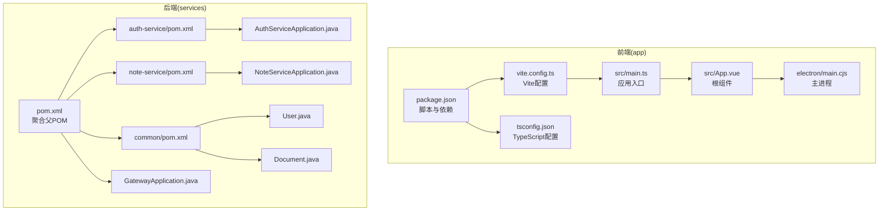
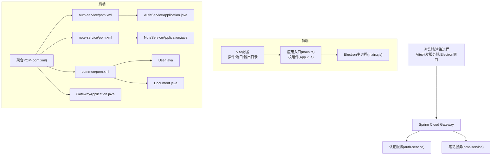
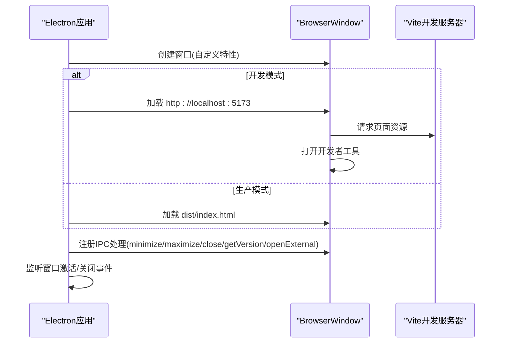
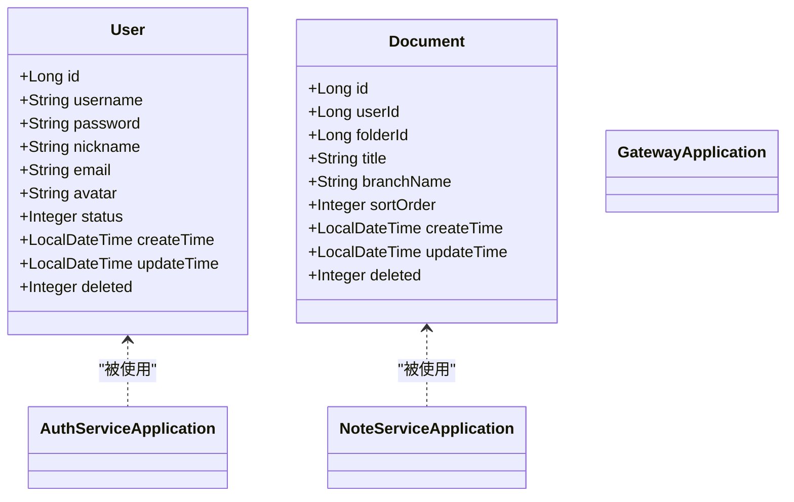
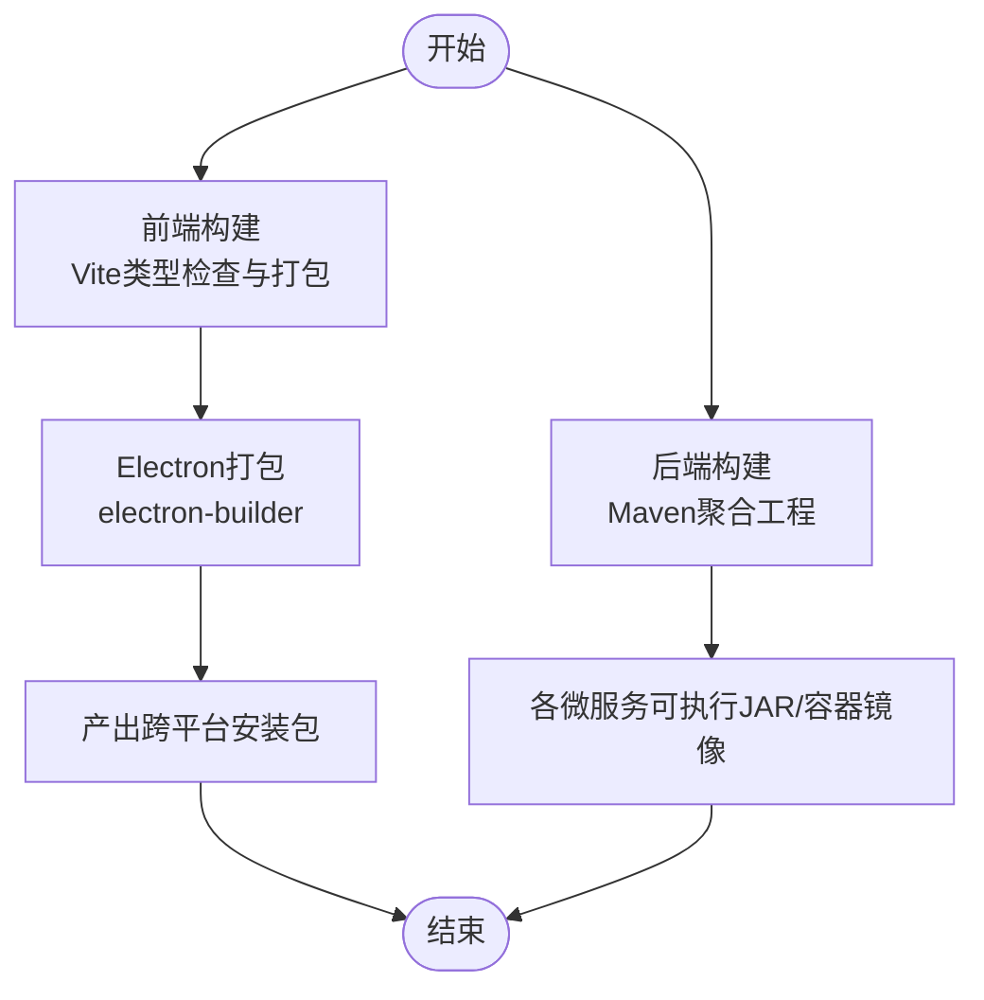
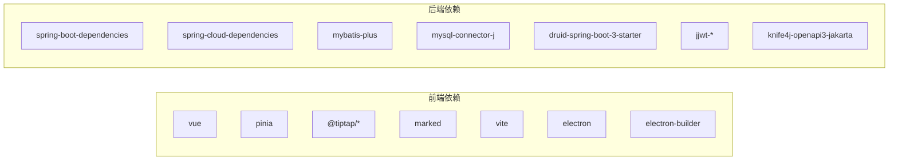

# 开发者指南

<cite>
**本文引用的文件**
- [README.md](file://README.md)
- [package.json](file://app/package.json)
- [vite.config.ts](file://app/vite.config.ts)
- [tsconfig.json](file://app/tsconfig.json)
- [main.cjs](file://app/electron/main.cjs)
- [main.ts](file://app/src/main.ts)
- [App.vue](file://app/src/App.vue)
- [pom.xml](file://services/pom.xml)
- [auth-service/pom.xml](file://services/auth-service/pom.xml)
- [note-service/pom.xml](file://services/note-service/pom.xml)
- [common/pom.xml](file://services/common/pom.xml)
- [AuthServiceApplication.java](file://services/auth-service/src/main/java/com/nonegonotes/auth/AuthServiceApplication.java)
- [NoteServiceApplication.java](file://services/note-service/src/main/java/com/nonegonotes/note/NoteServiceApplication.java)
- [GatewayApplication.java](file://services/gateway/src/main/java/com/nonegonotes/gateway/GatewayApplication.java)
- [User.java](file://services/common/src/main/java/com/nonegonotes/common/entity/User.java)
- [Document.java](file://services/common/src/main/java/com/nonegonotes/common/entity/Document.java)
</cite>

## 目录
1. [简介](#简介)
2. [项目结构](#项目结构)
3. [核心组件](#核心组件)
4. [架构总览](#架构总览)
5. [详细组件分析](#详细组件分析)
6. [依赖分析](#依赖分析)
7. [性能考虑](#性能考虑)
8. [故障排除指南](#故障排除指南)
9. [结论](#结论)
10. [附录](#附录)

## 简介
本指南面向Woo项目的开发者，系统阐述前端与后端的开发规范、构建流程、测试策略、调试技巧、性能优化、代码审查与分支管理、常见问题排查以及CI/CD建议。Woo是一个基于Vue 3 + Electron + Spring Boot的桌面笔记应用，提供Markdown编辑、Git集成、思维导图与大纲视图，并计划引入AI辅助写作。

## 项目结构
项目采用前后端分离的多模块布局：
- app：前端应用（Vue 3 + TypeScript + Pinia），通过Vite构建，集成Electron用于桌面端打包与运行。
- services：后端微服务（Spring Boot + Spring Cloud），包含网关、认证服务、笔记服务与公共模块，统一使用Maven管理依赖与构建。

图表来源
- [package.json:1-38](file://app/package.json#L1-L38)
- [vite.config.ts:1-19](file://app/vite.config.ts#L1-L19)
- [tsconfig.json:1-25](file://app/tsconfig.json#L1-L25)
- [main.ts:1-8](file://app/src/main.ts#L1-L8)
- [App.vue:1-117](file://app/src/App.vue#L1-L117)
- [main.cjs:1-71](file://app/electron/main.cjs#L1-L71)
- [pom.xml:1-141](file://services/pom.xml#L1-L141)
- [auth-service/pom.xml:1-110](file://services/auth-service/pom.xml#L1-L110)
- [note-service/pom.xml:1-94](file://services/note-service/pom.xml#L1-L94)
- [common/pom.xml:1-60](file://services/common/pom.xml#L1-L60)
- [AuthServiceApplication.java:1-15](file://services/auth-service/src/main/java/com/nonegonotes/auth/AuthServiceApplication.java#L1-L15)
- [NoteServiceApplication.java:1-15](file://services/note-service/src/main/java/com/nonegonotes/note/NoteServiceApplication.java#L1-L15)
- [GatewayApplication.java:1-15](file://services/gateway/src/main/java/com/nonegonotes/gateway/GatewayApplication.java#L1-L15)
- [User.java:1-40](file://services/common/src/main/java/com/nonegonotes/common/entity/User.java#L1-L40)
- [Document.java:1-42](file://services/common/src/main/java/com/nonegonotes/common/entity/Document.java#L1-L42)

章节来源
- [README.md:47-63](file://README.md#L47-L63)
- [pom.xml:15-20](file://services/pom.xml#L15-L20)

## 核心组件
- 前端应用入口与状态管理：应用在入口文件中创建Vue实例并挂载Pinia；根组件负责布局与全局交互。
- Electron主进程：负责窗口创建、开发/生产模式加载、IPC通信与外部链接打开。
- 后端微服务：认证服务、笔记服务与网关分别提供用户认证、文档/目录管理与统一入口；公共模块提供实体与通用工具。

章节来源
- [main.ts:1-8](file://app/src/main.ts#L1-L8)
- [App.vue:1-117](file://app/src/App.vue#L1-L117)
- [main.cjs:1-71](file://app/electron/main.cjs#L1-L71)
- [AuthServiceApplication.java:1-15](file://services/auth-service/src/main/java/com/nonegonotes/auth/AuthServiceApplication.java#L1-L15)
- [NoteServiceApplication.java:1-15](file://services/note-service/src/main/java/com/nonegonotes/note/NoteServiceApplication.java#L1-L15)
- [GatewayApplication.java:1-15](file://services/gateway/src/main/java/com/nonegonotes/gateway/GatewayApplication.java#L1-L15)

## 架构总览
Woo采用前后端分离架构：前端通过Vite开发服务器提供页面，Electron在开发与生产环境下分别加载本地开发地址或打包产物；后端通过Spring Cloud服务发现与网关统一对外暴露REST接口，认证与笔记服务各自提供领域能力，公共模块沉淀共享实体与工具。

图表来源
- [vite.config.ts:1-19](file://app/vite.config.ts#L1-L19)
- [main.ts:1-8](file://app/src/main.ts#L1-L8)
- [App.vue:1-117](file://app/src/App.vue#L1-L117)
- [main.cjs:1-71](file://app/electron/main.cjs#L1-L71)
- [pom.xml:1-141](file://services/pom.xml#L1-L141)
- [auth-service/pom.xml:1-110](file://services/auth-service/pom.xml#L1-L110)
- [note-service/pom.xml:1-94](file://services/note-service/pom.xml#L1-L94)
- [common/pom.xml:1-60](file://services/common/pom.xml#L1-L60)
- [AuthServiceApplication.java:1-15](file://services/auth-service/src/main/java/com/nonegonotes/auth/AuthServiceApplication.java#L1-L15)
- [NoteServiceApplication.java:1-15](file://services/note-service/src/main/java/com/nonegonotes/note/NoteServiceApplication.java#L1-L15)
- [GatewayApplication.java:1-15](file://services/gateway/src/main/java/com/nonegonotes/gateway/GatewayApplication.java#L1-L15)
- [User.java:1-40](file://services/common/src/main/java/com/nonegonotes/common/entity/User.java#L1-L40)
- [Document.java:1-42](file://services/common/src/main/java/com/nonegonotes/common/entity/Document.java#L1-L42)

## 详细组件分析

### 前端开发规范与文件组织
- JavaScript/TypeScript编码风格
  - 使用严格模式与未使用变量/参数检查，避免switch漏掉case。
  - 模块解析采用bundler模式，配合TS编译器与类型检查。
- Vue组件命名约定
  - 组件文件名采用帕斯卡命名法；图标组件统一放置于icons目录下，便于识别与复用。
- 文件组织结构
  - 组件按功能分层：layout、ui、menus；类型定义集中于types；状态管理位于stores；服务封装于services。
- 注释规范
  - 类型与实体使用JavaDoc式注释描述字段含义与业务约束。
- 关键实现路径
  - 应用入口与状态注入：[main.ts:1-8](file://app/src/main.ts#L1-L8)
  - 根组件布局与快捷键：[App.vue:1-117](file://app/src/App.vue#L1-L117)
  - Vite配置与Electron集成：[vite.config.ts:1-19](file://app/vite.config.ts#L1-L19)
  - TypeScript编译选项与严格性：[tsconfig.json:1-25](file://app/tsconfig.json#L1-L25)

章节来源
- [tsconfig.json:17-22](file://app/tsconfig.json#L17-L22)
- [App.vue:35-101](file://app/src/App.vue#L35-L101)
- [vite.config.ts:1-19](file://app/vite.config.ts#L1-L19)
- [main.ts:1-8](file://app/src/main.ts#L1-L8)

### Electron主进程与窗口生命周期
- 窗口特性：自定义标题栏、最小尺寸限制、背景色、隔离上下文。
- IPC通信：最小化、最大化/还原、关闭窗口、获取应用版本、打开外部链接。
- 开发/生产模式：开发模式加载本地Vite地址并开启调试工具；生产模式加载打包后的index.html。
- 生命周期：应用就绪后创建窗口；macOS激活时重建窗口；所有窗口关闭时退出。

图表来源
- [main.cjs:9-59](file://app/electron/main.cjs#L9-L59)

章节来源
- [main.cjs:1-71](file://app/electron/main.cjs#L1-L71)

### 后端微服务与公共模块
- 微服务职责
  - 认证服务：用户认证与授权相关接口。
  - 笔记服务：文档与目录的增删改查与树形结构。
  - 网关：统一入口与跨域配置。
- 公共模块
  - 实体：用户、文档、目录等基础模型。
  - 异常与响应：统一异常处理与返回包装。
  - 工具：JWT工具、常用工具类。
- 关键实现路径
  - 聚合POM与依赖管理：[pom.xml:1-141](file://services/pom.xml#L1-L141)
  - 认证服务依赖与插件：[auth-service/pom.xml:1-110](file://services/auth-service/pom.xml#L1-L110)
  - 笔记服务依赖与插件：[note-service/pom.xml:1-94](file://services/note-service/pom.xml#L1-L94)
  - 公共模块依赖：[common/pom.xml:1-60](file://services/common/pom.xml#L1-L60)
  - 应用启动入口：[AuthServiceApplication.java:1-15](file://services/auth-service/src/main/java/com/nonegonotes/auth/AuthServiceApplication.java#L1-L15)、[NoteServiceApplication.java:1-15](file://services/note-service/src/main/java/com/nonegonotes/note/NoteServiceApplication.java#L1-L15)、[GatewayApplication.java:1-15](file://services/gateway/src/main/java/com/nonegonotes/gateway/GatewayApplication.java#L1-L15)
  - 实体定义：[User.java:1-40](file://services/common/src/main/java/com/nonegonotes/common/entity/User.java#L1-L40)、[Document.java:1-42](file://services/common/src/main/java/com/nonegonotes/common/entity/Document.java#L1-L42)

图表来源
- [User.java:1-40](file://services/common/src/main/java/com/nonegonotes/common/entity/User.java#L1-L40)
- [Document.java:1-42](file://services/common/src/main/java/com/nonegonotes/common/entity/Document.java#L1-L42)
- [AuthServiceApplication.java:1-15](file://services/auth-service/src/main/java/com/nonegonotes/auth/AuthServiceApplication.java#L1-L15)
- [NoteServiceApplication.java:1-15](file://services/note-service/src/main/java/com/nonegonotes/note/NoteServiceApplication.java#L1-L15)

章节来源
- [pom.xml:1-141](file://services/pom.xml#L1-L141)
- [auth-service/pom.xml:1-110](file://services/auth-service/pom.xml#L1-L110)
- [note-service/pom.xml:1-94](file://services/note-service/pom.xml#L1-L94)
- [common/pom.xml:1-60](file://services/common/pom.xml#L1-L60)
- [AuthServiceApplication.java:1-15](file://services/auth-service/src/main/java/com/nonegonotes/auth/AuthServiceApplication.java#L1-L15)
- [NoteServiceApplication.java:1-15](file://services/note-service/src/main/java/com/nonegonotes/note/NoteServiceApplication.java#L1-L15)
- [GatewayApplication.java:1-15](file://services/gateway/src/main/java/com/nonegonotes/gateway/GatewayApplication.java#L1-L15)
- [User.java:1-40](file://services/common/src/main/java/com/nonegonotes/common/entity/User.java#L1-L40)
- [Document.java:1-42](file://services/common/src/main/java/com/nonegonotes/common/entity/Document.java#L1-L42)

### 构建流程与跨平台打包
- 前端Vite构建
  - 开发：vite命令启动开发服务器。
  - 生产：先进行类型检查，再执行Vite构建生成静态资源。
  - Electron：在生产构建后调用electron-builder进行跨平台打包。
- 后端Maven构建
  - 聚合工程统一管理版本与插件，子模块按需引入依赖与插件。
- 跨平台打包策略
  - Electron Builder负责生成多平台安装包，结合Vite构建产物。

图表来源
- [package.json:6-12](file://app/package.json#L6-L12)
- [vite.config.ts:16-18](file://app/vite.config.ts#L16-L18)
- [pom.xml:122-139](file://services/pom.xml#L122-L139)

章节来源
- [README.md:20-45](file://README.md#L20-L45)
- [package.json:6-12](file://app/package.json#L6-L12)
- [vite.config.ts:16-18](file://app/vite.config.ts#L16-L18)
- [pom.xml:122-139](file://services/pom.xml#L122-L139)

### 测试策略
- 单元测试
  - 后端：Spring Boot Starter Test已引入，可在对应模块中编写控制器与服务层单元测试。
- 集成测试
  - 后端：可利用Testcontainers或嵌入式数据库进行集成测试；前端可使用Vitest进行组件与工具函数测试。
- 端到端测试
  - 建议使用Cypress或Playwright对Electron应用的关键工作流进行端到端验证。

[本节为通用实践建议，不直接分析具体文件，故无章节来源]

### 调试技巧
- 浏览器/前端调试
  - 开发模式下Electron会自动打开开发者工具；可结合Vite的热更新与断点调试。
- 后端日志分析
  - 使用Spring Boot Actuator与日志框架输出请求链路与错误堆栈；结合网关日志定位上游服务。
- 数据库查询优化
  - 使用Druid监控SQL执行情况；MyBatis Plus合理分页与索引覆盖；避免N+1查询。

章节来源
- [main.cjs:26-28](file://app/electron/main.cjs#L26-L28)
- [auth-service/pom.xml:58-62](file://services/auth-service/pom.xml#L58-L62)
- [note-service/pom.xml:58-62](file://services/note-service/pom.xml#L58-L62)

### 性能优化建议
- 前端Bundle分析
  - 使用Vite内置分析或第三方可视化工具评估包体积与依赖关系，拆分动态导入与懒加载非关键模块。
- 后端数据库查询优化
  - 基于实体字段建立必要索引；使用分页查询与投影查询减少数据传输；缓存热点数据。
- 内存使用监控
  - 后端启用JVM内存与GC监控；前端关注事件监听清理与组件销毁，避免内存泄漏。

[本节为通用指导，不直接分析具体文件，故无章节来源]

### 代码审查流程、提交信息规范与分支管理策略
- 代码审查
  - 提交PR前完成本地测试与格式校验；至少一名维护者审查并通过。
- 提交信息规范
  - 建议采用“类型(scope): 描述”的格式，如feat(auth): 添加登录接口。
- 分支管理
  - 主分支仅合并稳定变更；功能在feature/*分支开发；修复hotfix/*分支；使用Pull Request进行合并。

[本节为通用流程建议，不直接分析具体文件，故无章节来源]

### 常见开发问题与故障排除
- 前端无法加载开发资源
  - 确认Vite端口未被占用，开发模式下Electron指向正确地址。
- Electron窗口空白
  - 检查生产构建是否完成，确认dist/index.html存在。
- 后端服务无法启动
  - 检查依赖版本与数据库连接配置；确认服务注册中心可用。
- 数据库初始化失败
  - 确认初始化脚本路径与权限，确保数据库字符集与驱动版本匹配。

章节来源
- [main.cjs:26-31](file://app/electron/main.cjs#L26-L31)
- [README.md:45-45](file://README.md#L45-L45)

### CI/CD配置建议
- 前端
  - 安装依赖 → 类型检查 → 构建 → 打包 → 上传制品。
- 后端
  - 安装依赖 → 单元测试 → 构建JAR/容器镜像 → 推送制品库。
- 部署
  - 使用容器编排或云平台部署网关与微服务；数据库迁移与初始化脚本自动化。

[本节为通用建议，不直接分析具体文件，故无章节来源]

## 依赖分析
- 前端依赖
  - Vue 3、Pinia、Tiptap、Marked等；开发期依赖Vite、Electron与构建工具。
- 后端依赖
  - Spring Boot 3、Spring Cloud、MyBatis Plus、MySQL、Druid、JWT、Knife4j等；通过聚合POM统一版本与插件。

图表来源
- [package.json:13-35](file://app/package.json#L13-L35)
- [pom.xml:41-120](file://services/pom.xml#L41-L120)

章节来源
- [package.json:13-35](file://app/package.json#L13-L35)
- [pom.xml:41-120](file://services/pom.xml#L41-L120)

## 性能考虑
- 前端
  - 通过拆分路由与组件实现按需加载；减少不必要的响应式层级；使用生产环境压缩与缓存策略。
- 后端
  - 合理使用连接池与缓存；对高频接口进行限流与熔断；数据库层面建立索引与优化慢查询。
- Electron
  - 控制窗口数量与渲染进程资源占用；避免在渲染进程中执行重任务；使用预加载脚本隔离Node能力。

[本节为通用指导，不直接分析具体文件，故无章节来源]

## 故障排除指南
- 前端
  - 端口冲突：调整Vite端口；开发工具无法打开：检查开发服务器是否启动。
  - 打包失败：确认类型检查通过且构建脚本正确。
- 后端
  - 依赖冲突：统一版本由聚合POM管理；数据库连接失败：核对驱动与连接串。
- Electron
  - 窗口无法显示：确认加载地址与dist目录；IPC异常：检查主进程事件注册。

章节来源
- [vite.config.ts:13-18](file://app/vite.config.ts#L13-L18)
- [main.cjs:26-31](file://app/electron/main.cjs#L26-L31)
- [pom.xml:22-39](file://services/pom.xml#L22-L39)

## 结论
本指南从开发规范、构建流程、测试策略、调试与性能优化、代码审查与分支管理、问题排查与CI/CD建议等方面为Woo项目提供了系统化的实践指引。建议团队在日常协作中遵循上述规范，持续提升开发效率与质量。

## 附录
- 快速启动
  - 前端：进入app目录安装依赖并启动开发服务器；生产构建与打包通过脚本完成。
  - 后端：进入services目录执行Maven安装，各微服务可独立启动。
- 项目结构参考：详见README中的项目结构图示。

章节来源
- [README.md:20-45](file://README.md#L20-L45)
- [README.md:47-63](file://README.md#L47-L63)