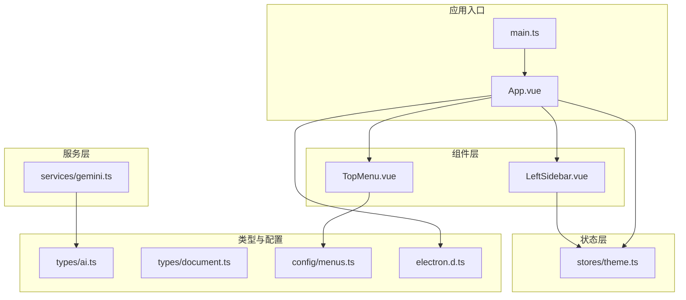
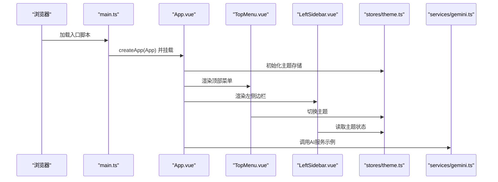
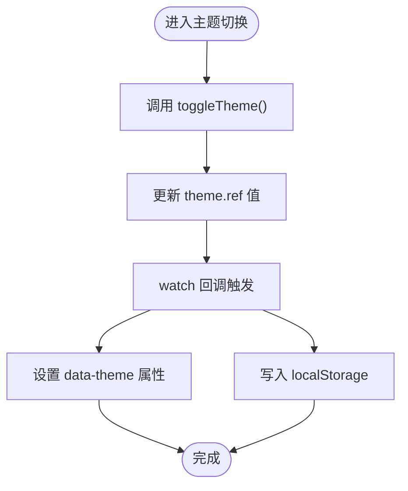
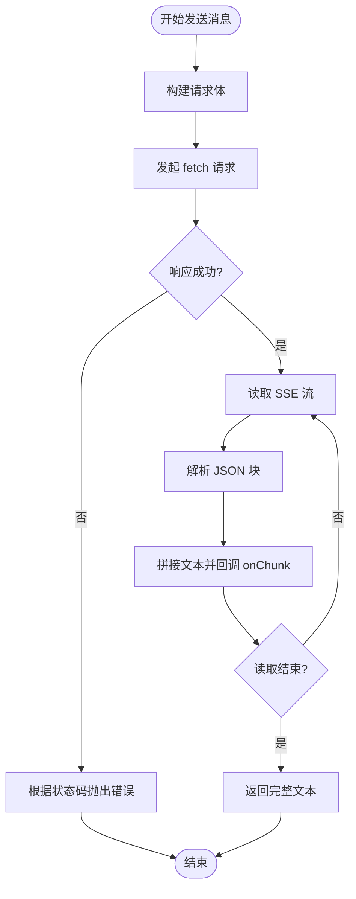
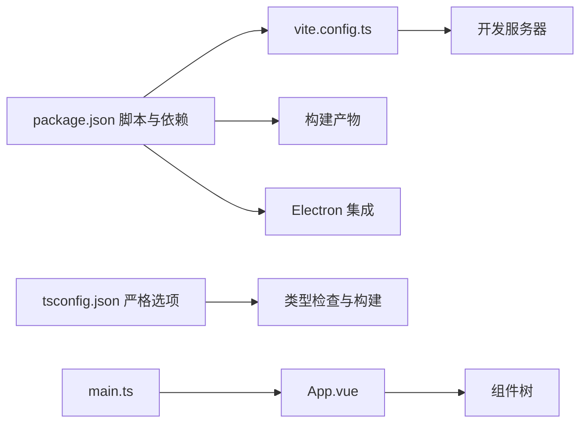

# 开发规范

<cite>
**本文引用的文件**
- [README.md](file://README.md)
- [package.json](file://app/package.json)
- [tsconfig.json](file://app/tsconfig.json)
- [vite.config.ts](file://app/vite.config.ts)
- [App.vue](file://app/src/App.vue)
- [main.ts](file://app/src/main.ts)
- [electron.d.ts](file://app/src/electron.d.ts)
- [TopMenu.vue](file://app/src/components/layout/TopMenu.vue)
- [LeftSidebar.vue](file://app/src/components/layout/LeftSidebar.vue)
- [theme.ts](file://app/src/stores/theme.ts)
- [gemini.ts](file://app/src/services/gemini.ts)
- [menus.ts](file://app/src/config/menus.ts)
- [ai.ts](file://app/src/types/ai.ts)
- [document.ts](file://app/src/types/document.ts)
</cite>

## 目录
1. [简介](#简介)
2. [项目结构](#项目结构)
3. [核心组件](#核心组件)
4. [架构总览](#架构总览)
5. [详细组件分析](#详细组件分析)
6. [依赖关系分析](#依赖关系分析)
7. [性能考量](#性能考量)
8. [故障排查指南](#故障排查指南)
9. [结论](#结论)
10. [附录](#附录)

## 简介
本规范面向Woo（无我笔记）项目，旨在统一前端（Vue 3 + TypeScript + Pinia + Electron + Vite）的开发标准，覆盖以下方面：
- JavaScript/TypeScript编码风格与类型注解最佳实践
- Vue 3组件开发规范（命名、Props、事件、生命周期）
- 文件组织结构与模块导入导出规则
- 注释与JSDoc规范，以及API文档生成建议
- 代码格式化工具链（ESLint、Prettier、TypeScript编译器）
- Git提交信息与分支管理策略
- 提供正反例路径指引，便于团队落地执行

## 项目结构
前端应用位于 app/ 目录，采用按功能域分层的组织方式：
- src/components：UI组件与布局组件
- src/stores：状态管理（Pinia）
- src/types：全局类型定义
- src/services：业务服务（如AI相关）
- src/config：配置数据（如菜单）
- src/electron.*：Electron主进程与类型声明
- 根目录配置：package.json、tsconfig.json、vite.config.ts

图表来源
- [main.ts:1-8](file://app/src/main.ts#L1-L8)
- [App.vue:1-117](file://app/src/App.vue#L1-L117)
- [TopMenu.vue:1-264](file://app/src/components/layout/TopMenu.vue#L1-L264)
- [LeftSidebar.vue:1-204](file://app/src/components/layout/LeftSidebar.vue#L1-L204)
- [theme.ts:1-31](file://app/src/stores/theme.ts#L1-L31)
- [gemini.ts:1-103](file://app/src/services/gemini.ts#L1-L103)
- [menus.ts:1-103](file://app/src/config/menus.ts#L1-L103)
- [ai.ts:1-20](file://app/src/types/ai.ts#L1-L20)
- [document.ts:1-9](file://app/src/types/document.ts#L1-L9)
- [electron.d.ts:1-9](file://app/src/electron.d.ts#L1-L9)

章节来源
- [README.md:47-63](file://README.md#L47-L63)
- [package.json:1-38](file://app/package.json#L1-L38)
- [tsconfig.json:1-25](file://app/tsconfig.json#L1-L25)
- [vite.config.ts:1-19](file://app/vite.config.ts#L1-L19)

## 核心组件
本节从编码规范角度审视现有核心文件，提炼可复用的模式与改进建议。

- 类型系统与接口声明
  - 使用明确的接口与联合类型表达领域模型，例如聊天消息、模型配置与AI设置。
  - 推荐：为每个领域对象提供独立的类型文件，避免在组件内重复定义。
  - 参考路径
    - [ai.ts:1-20](file://app/src/types/ai.ts#L1-L20)
    - [document.ts:1-9](file://app/src/types/document.ts#L1-L9)

- 组件Props与事件
  - Props使用接口显式声明，事件通过 defineEmits 明确签名，保证父子通信契约清晰。
  - 参考路径
    - [LeftSidebar.vue:54-58](file://app/src/components/layout/LeftSidebar.vue#L54-L58)
    - [TopMenu.vue:139-145](file://app/src/components/layout/TopMenu.vue#L139-L145)

- 生命周期与副作用
  - 在 onMounted/onBeforeUnmount 中注册/注销全局事件，避免内存泄漏。
  - 参考路径
    - [App.vue:92-100](file://app/src/App.vue#L92-L100)
    - [TopMenu.vue:105-111](file://app/src/components/layout/TopMenu.vue#L105-L111)

- 状态管理
  - Pinia Store 使用组合式API风格，配合 watch 实现本地存储同步与DOM主题注入。
  - 参考路径
    - [theme.ts:8-30](file://app/src/stores/theme.ts#L8-L30)

- 服务层与错误处理
  - 服务函数对网络错误进行分类处理，抛出语义化错误，便于上层捕获与提示。
  - 参考路径
    - [gemini.ts:57-65](file://app/src/services/gemini.ts#L57-L65)

- 配置与菜单
  - 菜单项类型通过接口约束，支持子菜单与分隔符，利于扩展与维护。
  - 参考路径
    - [menus.ts:1-103](file://app/src/config/menus.ts#L1-L103)

章节来源
- [ai.ts:1-20](file://app/src/types/ai.ts#L1-L20)
- [document.ts:1-9](file://app/src/types/document.ts#L1-L9)
- [LeftSidebar.vue:54-58](file://app/src/components/layout/LeftSidebar.vue#L54-L58)
- [TopMenu.vue:139-145](file://app/src/components/layout/TopMenu.vue#L139-L145)
- [App.vue:92-100](file://app/src/App.vue#L92-L100)
- [theme.ts:8-30](file://app/src/stores/theme.ts#L8-L30)
- [gemini.ts:57-65](file://app/src/services/gemini.ts#L57-L65)
- [menus.ts:1-103](file://app/src/config/menus.ts#L1-L103)

## 架构总览
下图展示应用启动、组件渲染、状态与服务交互的整体流程。

图表来源
- [main.ts:1-8](file://app/src/main.ts#L1-L8)
- [App.vue:1-117](file://app/src/App.vue#L1-L117)
- [TopMenu.vue:1-264](file://app/src/components/layout/TopMenu.vue#L1-L264)
- [LeftSidebar.vue:1-204](file://app/src/components/layout/LeftSidebar.vue#L1-L204)
- [theme.ts:1-31](file://app/src/stores/theme.ts#L1-L31)
- [gemini.ts:1-103](file://app/src/services/gemini.ts#L1-L103)

## 详细组件分析

### 组件命名与职责边界
- 命名规范
  - 组件文件采用帕斯卡命名（如 TopMenu.vue），便于在模板中直接引用且具可读性。
  - 参考路径
    - [TopMenu.vue:1-264](file://app/src/components/layout/TopMenu.vue#L1-L264)
    - [LeftSidebar.vue:1-204](file://app/src/components/layout/LeftSidebar.vue#L1-L204)

- 职责边界
  - 布局组件仅负责容器与交互编排，具体业务逻辑下沉至服务或Store。
  - 参考路径
    - [App.vue:1-117](file://app/src/App.vue#L1-L117)

章节来源
- [TopMenu.vue:1-264](file://app/src/components/layout/TopMenu.vue#L1-L264)
- [LeftSidebar.vue:1-204](file://app/src/components/layout/LeftSidebar.vue#L1-L204)
- [App.vue:1-117](file://app/src/App.vue#L1-L117)

### Props 定义与校验
- 显式接口声明 Props，避免动态属性污染。
- 参考路径
  - [LeftSidebar.vue:54-58](file://app/src/components/layout/LeftSidebar.vue#L54-L58)

章节来源
- [LeftSidebar.vue:54-58](file://app/src/components/layout/LeftSidebar.vue#L54-L58)

### 事件处理与自定义事件
- 使用 defineEmits 明确事件签名，确保父子通信契约清晰。
- 参考路径
  - [TopMenu.vue:139-145](file://app/src/components/layout/TopMenu.vue#L139-L145)

章节来源
- [TopMenu.vue:139-145](file://app/src/components/layout/TopMenu.vue#L139-L145)

### 生命周期管理
- 在 onMounted 注册事件，在 onBeforeUnmount 对应清理，防止内存泄漏。
- 参考路径
  - [App.vue:92-100](file://app/src/App.vue#L92-L100)
  - [TopMenu.vue:105-111](file://app/src/components/layout/TopMenu.vue#L105-L111)

章节来源
- [App.vue:92-100](file://app/src/App.vue#L92-L100)
- [TopMenu.vue:105-111](file://app/src/components/layout/TopMenu.vue#L105-L111)

### 状态管理（Pinia）
- 使用组合式 Store，集中管理主题状态，并通过 watch 同步到DOM与本地存储。
- 参考路径
  - [theme.ts:8-30](file://app/src/stores/theme.ts#L8-L30)

图表来源
- [theme.ts:16-24](file://app/src/stores/theme.ts#L16-L24)

章节来源
- [theme.ts:8-30](file://app/src/stores/theme.ts#L8-L30)

### 服务层与错误处理
- 对外部API调用进行状态码分类与错误抛出，便于上层统一处理。
- 参考路径
  - [gemini.ts:57-65](file://app/src/services/gemini.ts#L57-L65)

图表来源
- [gemini.ts:29-102](file://app/src/services/gemini.ts#L29-L102)

章节来源
- [gemini.ts:1-103](file://app/src/services/gemini.ts#L1-L103)

### 配置与菜单
- 菜单项通过接口约束，支持子菜单与分隔符，便于扩展。
- 参考路径
  - [menus.ts:1-103](file://app/src/config/menus.ts#L1-L103)

章节来源
- [menus.ts:1-103](file://app/src/config/menus.ts#L1-L103)

## 依赖关系分析
- 构建与运行
  - Vite 提供开发服务器与打包能力；Electron 插件用于桌面端集成。
  - 参考路径
    - [vite.config.ts:1-19](file://app/vite.config.ts#L1-L19)
    - [package.json:6-12](file://app/package.json#L6-L12)

- 类型与严格性
  - TypeScript 严格模式开启，启用未使用局部变量/参数检测与switch穷举检查。
  - 参考路径
    - [tsconfig.json:17-21](file://app/tsconfig.json#L17-L21)

- 应用入口
  - main.ts 创建应用实例、安装Pinia并挂载根组件。
  - 参考路径
    - [main.ts:1-8](file://app/src/main.ts#L1-L8)

图表来源
- [package.json:1-38](file://app/package.json#L1-L38)
- [vite.config.ts:1-19](file://app/vite.config.ts#L1-L19)
- [tsconfig.json:1-25](file://app/tsconfig.json#L1-L25)
- [main.ts:1-8](file://app/src/main.ts#L1-L8)

章节来源
- [package.json:1-38](file://app/package.json#L1-L38)
- [vite.config.ts:1-19](file://app/vite.config.ts#L1-L19)
- [tsconfig.json:1-25](file://app/tsconfig.json#L1-L25)
- [main.ts:1-8](file://app/src/main.ts#L1-L8)

## 性能考量
- 组件渲染
  - 合理拆分组件，避免不必要的重渲染；利用响应式引用与计算属性减少开销。
- 事件绑定
  - 在组件卸载时及时移除全局事件监听，避免内存泄漏与多余回调。
- 状态管理
  - 将跨组件共享的状态收敛到Pinia Store，避免深层props传递与重复订阅。
- 构建优化
  - 使用Vite的按需编译与Tree Shaking；在生产构建中启用压缩与资源分割。

## 故障排查指南
- 常见问题定位
  - 事件未触发：检查父组件是否正确声明 defineEmits 与事件名大小写。
    - 参考路径
      - [TopMenu.vue:139-145](file://app/src/components/layout/TopMenu.vue#L139-L145)
  - 主题不生效：确认 data-theme 属性是否被设置，localStorage 是否保存成功。
    - 参考路径
      - [theme.ts:12-24](file://app/src/stores/theme.ts#L12-L24)
  - AI请求失败：根据状态码判断是否为密钥无效、频率限制或网络异常。
    - 参考路径
      - [gemini.ts:57-65](file://app/src/services/gemini.ts#L57-L65)
- 调试建议
  - 在开发阶段开启严格类型检查与未使用变量告警，尽早暴露潜在问题。
    - 参考路径
      - [tsconfig.json:17-21](file://app/tsconfig.json#L17-L21)

章节来源
- [TopMenu.vue:139-145](file://app/src/components/layout/TopMenu.vue#L139-L145)
- [theme.ts:12-24](file://app/src/stores/theme.ts#L12-L24)
- [gemini.ts:57-65](file://app/src/services/gemini.ts#L57-L65)
- [tsconfig.json:17-21](file://app/tsconfig.json#L17-L21)

## 结论
本规范基于现有代码库提炼出可执行的开发标准，涵盖类型系统、组件开发、状态管理、服务层与配置等关键环节。建议团队在评审与迭代中持续对照规范，逐步完善工具链与文档，以保障代码质量与协作效率。

## 附录

### JavaScript/TypeScript 编码风格指南
- 命名
  - 变量与函数使用小驼峰；类与接口首字母大写；常量全大写加下划线。
  - 导出模块使用稳定名称，避免匿名导出。
- 函数与类型
  - 优先使用类型别名与接口表达结构；为异步函数提供明确的返回值类型。
  - 使用联合类型表达可枚举值，避免字符串字面量散落各处。
- 错误处理
  - 对外部调用进行状态码分类与语义化错误抛出；在调用方捕获并提示用户。
- 正反例路径
  - 正例：接口与类型定义清晰，事件签名明确
    - [ai.ts:1-20](file://app/src/types/ai.ts#L1-L20)
    - [TopMenu.vue:139-145](file://app/src/components/layout/TopMenu.vue#L139-L145)
  - 反例：未声明Props接口、未清理全局事件
    - [LeftSidebar.vue:54-58](file://app/src/components/layout/LeftSidebar.vue#L54-L58)
    - [App.vue:92-100](file://app/src/App.vue#L92-L100)

章节来源
- [ai.ts:1-20](file://app/src/types/ai.ts#L1-L20)
- [TopMenu.vue:139-145](file://app/src/components/layout/TopMenu.vue#L139-L145)
- [LeftSidebar.vue:54-58](file://app/src/components/layout/LeftSidebar.vue#L54-L58)
- [App.vue:92-100](file://app/src/App.vue#L92-L100)

### Vue 3 组件开发规范
- 命名
  - 组件文件采用帕斯卡命名；模板中直接使用组件名，无需额外别名。
- Props
  - 使用接口显式声明，避免动态属性；必要时提供默认值与校验。
- 事件
  - 使用 defineEmits 声明事件签名，保持事件名一致与语义化。
- 生命周期
  - 在 onMounted 注册事件，在 onBeforeUnmount 对应清理。
- 正反例路径
  - 正例：明确的Props与事件签名
    - [LeftSidebar.vue:54-58](file://app/src/components/layout/LeftSidebar.vue#L54-L58)
    - [TopMenu.vue:139-145](file://app/src/components/layout/TopMenu.vue#L139-L145)
  - 反例：未声明事件签名
    - [App.vue:4-32](file://app/src/App.vue#L4-L32)

章节来源
- [LeftSidebar.vue:54-58](file://app/src/components/layout/LeftSidebar.vue#L54-L58)
- [TopMenu.vue:139-145](file://app/src/components/layout/TopMenu.vue#L139-L145)
- [App.vue:4-32](file://app/src/App.vue#L4-L32)

### 文件组织结构规范
- 目录结构
  - 按功能域分层：components、stores、types、services、config。
- 文件命名
  - 组件文件：PascalCase.vue；类型文件：camelCase.ts；服务文件：camelCase.ts。
- 模块导入导出
  - 优先使用相对路径；避免循环依赖；统一导出入口，减少深层相对路径。
- 正反例路径
  - 正例：组件导入与类型引用
    - [TopMenu.vue:50-71](file://app/src/components/layout/TopMenu.vue#L50-L71)
    - [LeftSidebar.vue:43-52](file://app/src/components/layout/LeftSidebar.vue#L43-L52)
  - 反例：相对路径混乱
    - [App.vue:36-43](file://app/src/App.vue#L36-L43)

章节来源
- [TopMenu.vue:50-71](file://app/src/components/layout/TopMenu.vue#L50-L71)
- [LeftSidebar.vue:43-52](file://app/src/components/layout/LeftSidebar.vue#L43-L52)
- [App.vue:36-43](file://app/src/App.vue#L36-L43)

### 注释规范与API文档
- JSDoc
  - 为公共函数、接口与复杂逻辑补充简要描述与参数说明；对外暴露的服务函数必须包含错误处理说明。
- API文档生成
  - 建议结合TSDoc与工具生成API文档，确保类型与注释一致。
- 正反例路径
  - 正例：服务函数包含摘要与错误说明
    - [gemini.ts:5-15](file://app/src/services/gemini.ts#L5-L15)
    - [gemini.ts:26-35](file://app/src/services/gemini.ts#L26-L35)

章节来源
- [gemini.ts:5-15](file://app/src/services/gemini.ts#L5-L15)
- [gemini.ts:26-35](file://app/src/services/gemini.ts#L26-L35)

### 代码格式化工具配置
- ESLint
  - 建议启用TypeScript解析与Vue插件，结合prettier规则形成统一风格。
- Prettier
  - 统一缩进、引号与尾逗号；与ESLint冲突时以ESLint为准。
- TypeScript 编译器
  - 保持严格模式与未使用检测；在构建阶段开启noEmit以避免产出JS。
- 正反例路径
  - 正例：严格类型检查与未使用变量检测
    - [tsconfig.json:17-21](file://app/tsconfig.json#L17-L21)

章节来源
- [tsconfig.json:17-21](file://app/tsconfig.json#L17-L21)

### Git 提交信息与分支管理策略
- 提交信息
  - 类型：feat/fix/docs/style/refactor/test/build/chore等；范围：模块或组件；描述：简洁明确。
- 分支管理
  - 主分支：保护，仅允许合并请求；特性分支：按功能命名；修复分支：hotfix/*。
- 正反例路径
  - 无特定文件可直接引用，建议在团队内形成共识并纳入CI检查。

### 代码示例与反例对比（路径指引）
- 变量命名与函数定义
  - 正例：明确的类型注解与返回值
    - [gemini.ts:29-35](file://app/src/services/gemini.ts#L29-L35)
  - 反例：缺少类型注解与错误处理
    - [gemini.ts:57-65](file://app/src/services/gemini.ts#L57-L65)
- Props 定义
  - 正例：接口声明与类型安全
    - [LeftSidebar.vue:54-58](file://app/src/components/layout/LeftSidebar.vue#L54-L58)
  - 反例：未声明Props接口
    - [LeftSidebar.vue:54-58](file://app/src/components/layout/LeftSidebar.vue#L54-L58)
- 事件处理
  - 正例：defineEmits 明确签名
    - [TopMenu.vue:139-145](file://app/src/components/layout/TopMenu.vue#L139-L145)
  - 反例：未声明事件签名
    - [App.vue:4-32](file://app/src/App.vue#L4-L32)
- 生命周期
  - 正例：onMounted/onBeforeUnmount 成对出现
    - [App.vue:92-100](file://app/src/App.vue#L92-L100)
  - 反例：未清理全局事件
    - [App.vue:92-100](file://app/src/App.vue#L92-L100)

章节来源
- [gemini.ts:29-35](file://app/src/services/gemini.ts#L29-L35)
- [gemini.ts:57-65](file://app/src/services/gemini.ts#L57-L65)
- [LeftSidebar.vue:54-58](file://app/src/components/layout/LeftSidebar.vue#L54-L58)
- [TopMenu.vue:139-145](file://app/src/components/layout/TopMenu.vue#L139-L145)
- [App.vue:4-32](file://app/src/App.vue#L4-L32)
- [App.vue:92-100](file://app/src/App.vue#L92-L100)