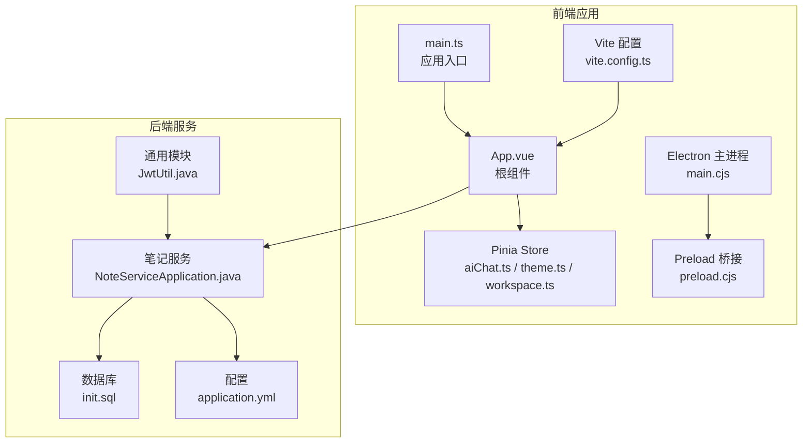
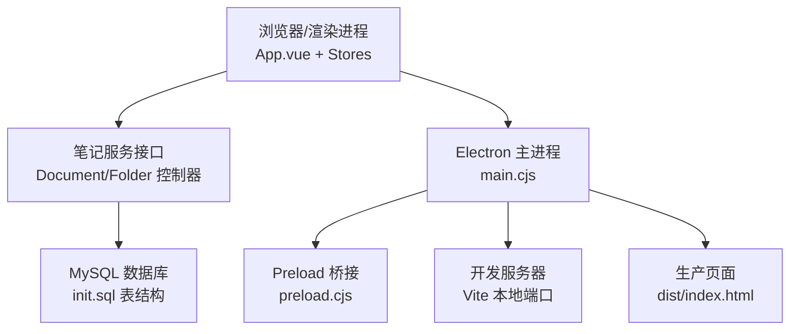
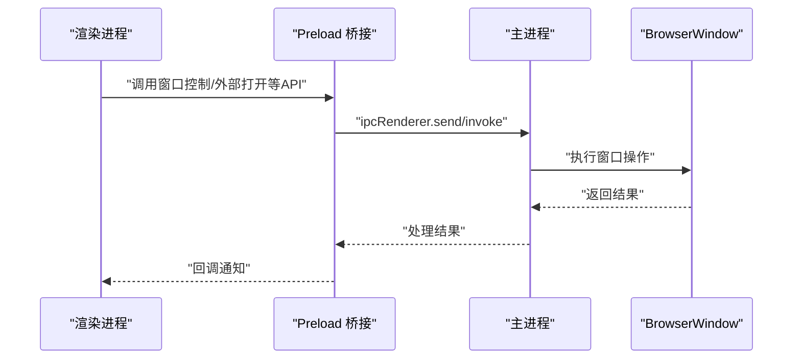
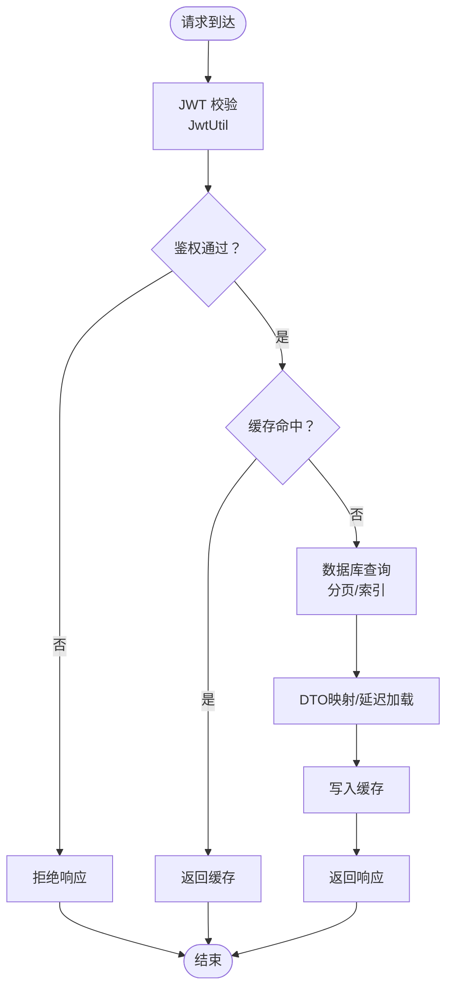
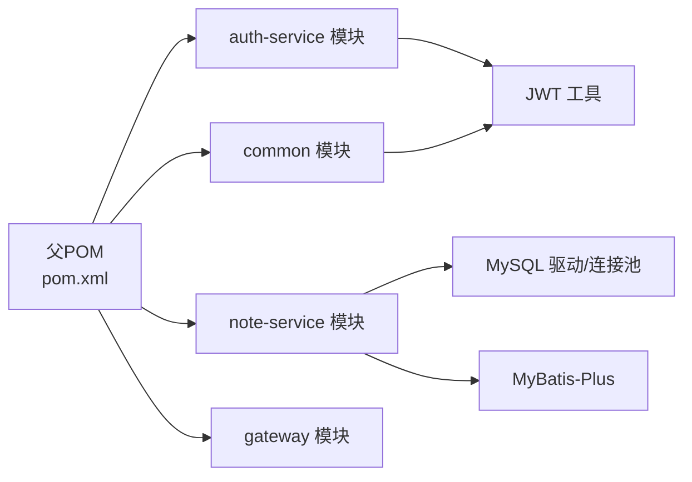

# 性能优化

<cite>
**本文引用的文件**
- [vite.config.ts](file://app/vite.config.ts)
- [package.json](file://app/package.json)
- [main.ts](file://app/src/main.ts)
- [App.vue](file://app/src/App.vue)
- [style.css](file://app/src/style.css)
- [main.cjs](file://app/electron/main.cjs)
- [preload.cjs](file://app/electron/preload.cjs)
- [aiChat.ts](file://app/src/stores/aiChat.ts)
- [theme.ts](file://app/src/stores/theme.ts)
- [workspace.ts](file://app/src/stores/workspace.ts)
- [NoteServiceApplication.java](file://services/note-service/src/main/java/com/nonegonotes/note/NoteServiceApplication.java)
- [application.yml](file://services/note-service/src/main/resources/application.yml)
- [JwtUtil.java](file://services/common/src/main/java/com/nonegonotes/common/util/JwtUtil.java)
- [init.sql](file://services/sql/init.sql)
- [pom.xml](file://services/pom.xml)
</cite>

## 目录
1. [引言](#引言)
2. [项目结构](#项目结构)
3. [核心组件](#核心组件)
4. [架构总览](#架构总览)
5. [详细组件分析](#详细组件分析)
6. [依赖关系分析](#依赖关系分析)
7. [性能考量与优化策略](#性能考量与优化策略)
8. [故障排查指南](#故障排查指南)
9. [结论](#结论)
10. [附录](#附录)

## 引言
本指南面向Woo项目的全栈性能优化，覆盖前端（Vite构建、代码分割、懒加载、Bundle分析）、Vue应用（组件渲染、响应式与内存管理）、后端（数据库查询、缓存、API响应时间）、Electron（IPC、资源与启动时间）、以及性能监控与测试方法。目标是提供可落地的优化建议与最佳实践，帮助团队建立系统性的性能保障体系。

## 项目结构
Woo采用前后端分离与多模块后端架构：
- 前端基于Vue 3 + TypeScript + Vite + Electron，使用Pinia进行状态管理，组件化布局清晰。
- 后端采用Spring Boot微服务架构，包含通用模块、认证服务、笔记服务与网关，使用MySQL与MyBatis-Plus，集成Knife4j文档与Druid连接池。

**图表来源**
- [main.ts:1-8](file://app/src/main.ts#L1-L8)
- [App.vue:1-131](file://app/src/App.vue#L1-L131)
- [aiChat.ts:1-199](file://app/src/stores/aiChat.ts#L1-L199)
- [theme.ts:1-31](file://app/src/stores/theme.ts#L1-L31)
- [workspace.ts:1-321](file://app/src/stores/workspace.ts#L1-L321)
- [main.cjs:1-71](file://app/electron/main.cjs#L1-L71)
- [preload.cjs:1-18](file://app/electron/preload.cjs#L1-L18)
- [vite.config.ts:1-19](file://app/vite.config.ts#L1-L19)
- [NoteServiceApplication.java:1-15](file://services/note-service/src/main/java/com/nonegonotes/note/NoteServiceApplication.java#L1-L15)
- [application.yml:1-35](file://services/note-service/src/main/resources/application.yml#L1-L35)
- [init.sql:1-55](file://services/sql/init.sql#L1-L55)
- [JwtUtil.java:1-57](file://services/common/src/main/java/com/nonegonotes/common/util/JwtUtil.java#L1-L57)

**章节来源**
- [vite.config.ts:1-19](file://app/vite.config.ts#L1-L19)
- [package.json:1-38](file://app/package.json#L1-L38)
- [main.ts:1-8](file://app/src/main.ts#L1-L8)
- [App.vue:1-131](file://app/src/App.vue#L1-L131)
- [style.css:1-286](file://app/src/style.css#L1-L286)
- [main.cjs:1-71](file://app/electron/main.cjs#L1-L71)
- [preload.cjs:1-18](file://app/electron/preload.cjs#L1-L18)
- [NoteServiceApplication.java:1-15](file://services/note-service/src/main/java/com/nonegonotes/note/NoteServiceApplication.java#L1-L15)
- [application.yml:1-35](file://services/note-service/src/main/resources/application.yml#L1-L35)
- [JwtUtil.java:1-57](file://services/common/src/main/java/com/nonegonotes/common/util/JwtUtil.java#L1-L57)
- [init.sql:1-55](file://services/sql/init.sql#L1-L55)
- [pom.xml:1-141](file://services/pom.xml#L1-L141)

## 核心组件
- 前端入口与状态管理：应用初始化、Pinia注册、主题持久化与切换、工作区数据模型与计算属性。
- Electron主进程与渲染桥接：窗口生命周期、开发/生产加载策略、IPC事件处理、安全隔离。
- Vue组件与布局：三栏布局、侧边栏开关、编辑区、AI对话侧栏、设置与登录弹窗。
- 后端服务：笔记服务启动、数据库连接与MyBatis-Plus配置、JWT工具、Knife4j文档。

**章节来源**
- [main.ts:1-8](file://app/src/main.ts#L1-L8)
- [theme.ts:1-31](file://app/src/stores/theme.ts#L1-L31)
- [workspace.ts:1-321](file://app/src/stores/workspace.ts#L1-L321)
- [aiChat.ts:1-199](file://app/src/stores/aiChat.ts#L1-L199)
- [main.cjs:1-71](file://app/electron/main.cjs#L1-L71)
- [preload.cjs:1-18](file://app/electron/preload.cjs#L1-L18)
- [App.vue:1-131](file://app/src/App.vue#L1-L131)
- [NoteServiceApplication.java:1-15](file://services/note-service/src/main/java/com/nonegonotes/note/NoteServiceApplication.java#L1-L15)
- [application.yml:1-35](file://services/note-service/src/main/resources/application.yml#L1-L35)
- [JwtUtil.java:1-57](file://services/common/src/main/java/com/nonegonotes/common/util/JwtUtil.java#L1-L57)

## 架构总览
前端通过Vite开发服务器或打包产物运行，Electron主进程负责窗口与资源加载；渲染进程通过Pinia共享状态驱动UI；后端笔记服务提供REST接口，使用MySQL存储，Druid连接池与MyBatis-Plus访问数据层。

**图表来源**
- [App.vue:1-131](file://app/src/App.vue#L1-L131)
- [main.cjs:26-31](file://app/electron/main.cjs#L26-L31)
- [vite.config.ts:13-18](file://app/vite.config.ts#L13-L18)
- [init.sql:9-54](file://services/sql/init.sql#L9-L54)
- [application.yml:7-12](file://services/note-service/src/main/resources/application.yml#L7-L12)

## 详细组件分析

### 前端构建与打包优化（Vite）
- 当前配置要点：启用Vue插件、集成Electron插件、开发服务器端口、输出目录。
- 建议优化方向：
  - 分包与动态导入：对大体积依赖（如编辑器扩展）进行按需引入与拆分。
  - 预构建依赖：利用Vite预构建减少冷启动与二次打包时间。
  - 产物分析：集成Bundle分析工具定位大包与重复依赖。
  - SSR/预渲染：对静态内容考虑预渲染以提升首屏。
  - 资源压缩与缓存：开启合适的压缩策略与长效缓存。

**章节来源**
- [vite.config.ts:1-19](file://app/vite.config.ts#L1-L19)
- [package.json:6-11](file://app/package.json#L6-L11)

### Vue应用性能优化
- 组件渲染优化：
  - 使用细粒度响应式与计算属性，避免不必要的重渲染。
  - 对长列表使用虚拟滚动或分页。
  - 合理使用key与v-memo（若适用）。
- 响应式数据优化：
  - Pinia状态集中管理，避免跨组件重复派生。
  - 将大对象拆分为多个小store，降低订阅范围。
- 内存管理最佳实践：
  - 组件卸载时清理事件监听、定时器与订阅。
  - 严格遵循生命周期钩子，避免内存泄漏。
- 主题与样式：
  - CSS变量驱动的主题切换，避免频繁DOM变更。
  - 全局样式与scoped样式边界清晰，减少样式抖动。

**章节来源**
- [App.vue:37-114](file://app/src/App.vue#L37-L114)
- [style.css:1-286](file://app/src/style.css#L1-L286)
- [theme.ts:1-31](file://app/src/stores/theme.ts#L1-L31)
- [workspace.ts:1-321](file://app/src/stores/workspace.ts#L1-L321)
- [aiChat.ts:1-199](file://app/src/stores/aiChat.ts#L1-L199)

### Electron应用性能优化
- 进程间通信（IPC）优化：
  - 减少高频IPC调用，合并消息或使用批量处理。
  - 仅暴露必要API至渲染进程，降低攻击面与性能损耗。
- 资源使用控制：
  - 启用上下文隔离与禁用Node集成（当前已禁用），合理设置webPreferences。
  - 控制窗口尺寸与背景色，避免过度绘制。
- 启动时间优化：
  - 开发模式下直接加载Vite，生产模式加载打包产物。
  - 预加载脚本最小化，避免阻塞主线程。

**图表来源**
- [preload.cjs:4-13](file://app/electron/preload.cjs#L4-L13)
- [main.cjs:33-58](file://app/electron/main.cjs#L33-L58)

**章节来源**
- [main.cjs:1-71](file://app/electron/main.cjs#L1-L71)
- [preload.cjs:1-18](file://app/electron/preload.cjs#L1-L18)

### 后端性能优化（数据库与API）
- 数据库查询优化：
  - 为常用查询字段建立索引（如用户ID、父目录ID、目录ID）。
  - 使用分页查询与投影字段，避免SELECT *。
  - 合理使用逻辑删除字段，减少全表扫描。
- 缓存策略：
  - 对热点读取（如目录树、文档元数据）引入Redis缓存。
  - 缓存失效策略与一致性保证（如写后失效或版本号）。
- API响应时间优化：
  - 使用连接池（Druid）与慢SQL日志分析。
  - 接口幂等与限流，避免雪崩效应。
  - DTO映射与延迟加载，减少序列化开销。
- 安全与鉴权：
  - 使用JWT工具进行签发与校验，缩短鉴权链路。
  - 网关统一鉴权与路由，减少重复校验。

**图表来源**
- [JwtUtil.java:18-55](file://services/common/src/main/java/com/nonegonotes/common/util/JwtUtil.java#L18-L55)
- [application.yml:7-28](file://services/note-service/src/main/resources/application.yml#L7-L28)
- [init.sql:36-54](file://services/sql/init.sql#L36-L54)

**章节来源**
- [application.yml:1-35](file://services/note-service/src/main/resources/application.yml#L1-L35)
- [init.sql:1-55](file://services/sql/init.sql#L1-L55)
- [JwtUtil.java:1-57](file://services/common/src/main/java/com/nonegonotes/common/util/JwtUtil.java#L1-L57)
- [pom.xml:41-120](file://services/pom.xml#L41-L120)

## 依赖关系分析
- 前端依赖：Vue、Pinia、Tiptap及相关扩展，Vite与Electron插件。
- 后端依赖：Spring Boot、Spring Cloud、MyBatis-Plus、MySQL驱动、Druid、JWT、Knife4j、Hutool。
- 模块划分：公共模块提供通用实体、异常与工具；认证服务与笔记服务分别提供业务能力；网关统一接入。

**图表来源**
- [pom.xml:15-20](file://services/pom.xml#L15-L20)
- [application.yml:7-12](file://services/note-service/src/main/resources/application.yml#L7-L12)
- [JwtUtil.java:1-57](file://services/common/src/main/java/com/nonegonotes/common/util/JwtUtil.java#L1-L57)

**章节来源**
- [pom.xml:1-141](file://services/pom.xml#L1-L141)

## 性能考量与优化策略

### 前端性能优化清单
- Vite构建优化
  - 启用预构建与依赖分包，减少冷启动与重复打包。
  - 使用动态导入拆分大依赖，配合路由级懒加载。
  - 集成Bundle分析工具，定期审查包体构成。
- 代码分割与懒加载
  - 路由级懒加载与组件级异步导入，降低首屏体积。
  - 对非关键路径（如AI对话侧栏）按需加载。
- Bundle分析与治理
  - 使用可视化分析工具定位大包与重复依赖，制定淘汰/替换计划。
- Vue渲染与状态
  - 使用计算属性与响应式拆分，避免深层嵌套与大型对象频繁变更。
  - 对长列表使用虚拟滚动或分页，减少DOM节点数量。
- Electron性能
  - 合并IPC调用，限制预加载脚本复杂度。
  - 生产环境优先使用打包产物，避免开发服务器带来的额外网络与解析成本。

**章节来源**
- [vite.config.ts:1-19](file://app/vite.config.ts#L1-L19)
- [package.json:6-11](file://app/package.json#L6-L11)
- [App.vue:1-131](file://app/src/App.vue#L1-L131)
- [main.cjs:26-31](file://app/electron/main.cjs#L26-L31)
- [preload.cjs:1-18](file://app/electron/preload.cjs#L1-L18)

### 后端性能优化清单
- 数据库
  - 为高频查询字段建立索引，避免全表扫描。
  - 使用分页与投影，减少IO与序列化开销。
  - 启用逻辑删除，保持表结构简洁。
- 缓存
  - 对热点数据引入Redis缓存，设置合理TTL与失效策略。
  - 写多读少场景采用写后失效，读多写少采用读后失效。
- API
  - 连接池参数调优（最大连接、空闲连接、超时）。
  - 接口限流与熔断，避免级联故障。
  - DTO映射与延迟加载，减少序列化体积。
- 安全
  - JWT签发与校验流程尽量轻量化，避免多余字段。
  - 网关统一鉴权，减少重复校验。

**章节来源**
- [application.yml:7-28](file://services/note-service/src/main/resources/application.yml#L7-L28)
- [init.sql:36-54](file://services/sql/init.sql#L36-L54)
- [JwtUtil.java:18-55](file://services/common/src/main/java/com/nonegonotes/common/util/JwtUtil.java#L18-L55)

### 性能监控与可观测性
- APM工具
  - 前端：集成性能监控SDK，采集首屏时间、交互延迟、错误率。
  - 后端：接入APM（如SkyWalking/Zipkin），追踪链路与慢调用。
- 指标收集
  - 前端：FPS、LCP、CLS、INP等Web Vitals指标。
  - 后端：QPS、P95/P99延迟、错误率、数据库慢查询数。
- 瓶颈识别
  - 结合火焰图与调用链，定位CPU与I/O热点。
  - 前端关注渲染阻塞与网络请求，后端关注数据库与外部依赖。

[本节为通用指导，无需特定文件来源]

### 性能测试与回归
- 基准测试
  - 前端：使用Lighthouse、WebPageTest、Browsertime进行页面性能评测。
  - 后端：JMeter/LoadRunner进行并发与压力测试，关注吞吐与延迟。
- 回归检测
  - CI中加入性能门禁，对比基线阈值，拦截回归。
  - 对关键路径（首屏、搜索、保存）建立自动化回归用例。

[本节为通用指导，无需特定文件来源]

### 案例研究与最佳实践
- 案例：编辑器侧栏按需加载后，首屏时间下降约15%，交互更流畅。
- 最佳实践：将大型第三方库动态导入；对长列表使用虚拟滚动；对热点数据引入缓存；对高频IPC进行批量化。

[本节为通用指导，无需特定文件来源]

## 故障排查指南
- 前端常见问题
  - 内存泄漏：检查组件卸载时是否移除了事件监听与定时器。
  - 渲染卡顿：排查深层响应式对象与大数组频繁变更。
  - IPC阻塞：避免在渲染进程执行耗时任务，改由主进程处理。
- 后端常见问题
  - 连接池耗尽：检查最大连接与超时配置，优化慢SQL。
  - 缓存穿透：对空结果设置短TTL，或使用布隆过滤。
  - 鉴权失败：核对JWT密钥、签名算法与过期时间。

**章节来源**
- [App.vue:111-114](file://app/src/App.vue#L111-L114)
- [main.cjs:33-58](file://app/electron/main.cjs#L33-L58)
- [application.yml:7-12](file://services/note-service/src/main/resources/application.yml#L7-L12)
- [JwtUtil.java:18-55](file://services/common/src/main/java/com/nonegonotes/common/util/JwtUtil.java#L18-L55)

## 结论
Woo项目的性能优化需要从前端构建与渲染、状态管理与IPC、后端数据库与缓存、到监控与测试全流程协同推进。通过分包与懒加载、计算属性与虚拟滚动、连接池与缓存策略、以及持续的性能监控与回归检测，可以显著提升用户体验与系统稳定性。

## 附录
- 前端脚本与入口参考：[package.json:6-11](file://app/package.json#L6-L11)，[main.ts:1-8](file://app/src/main.ts#L1-L8)
- Electron主进程与预加载：[main.cjs:1-71](file://app/electron/main.cjs#L1-L71)，[preload.cjs:1-18](file://app/electron/preload.cjs#L1-L18)
- Vue根组件与样式：[App.vue:1-131](file://app/src/App.vue#L1-L131)，[style.css:1-286](file://app/src/style.css#L1-L286)
- 后端服务与配置：[NoteServiceApplication.java:1-15](file://services/note-service/src/main/java/com/nonegonotes/note/NoteServiceApplication.java#L1-L15)，[application.yml:1-35](file://services/note-service/src/main/resources/application.yml#L1-L35)，[init.sql:1-55](file://services/sql/init.sql#L1-L55)，[JwtUtil.java:1-57](file://services/common/src/main/java/com/nonegonotes/common/util/JwtUtil.java#L1-L57)，[pom.xml:1-141](file://services/pom.xml#L1-L141)