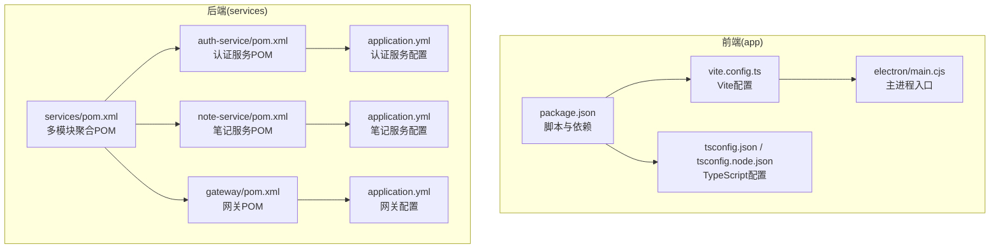
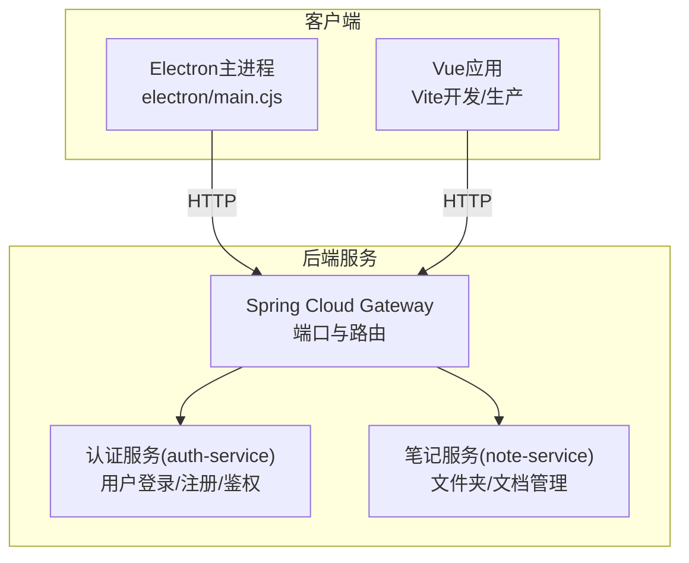
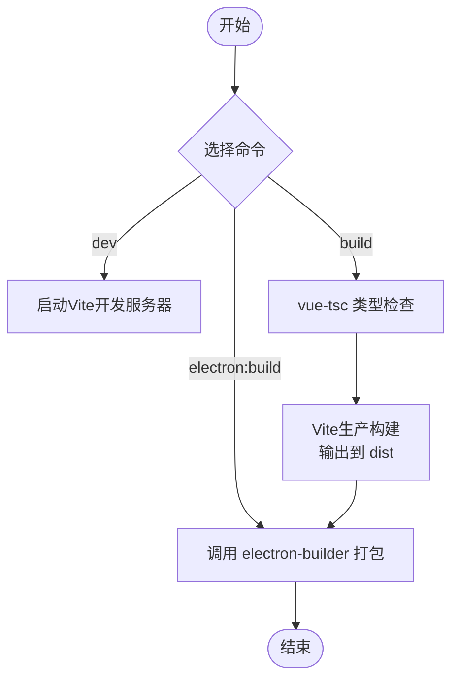
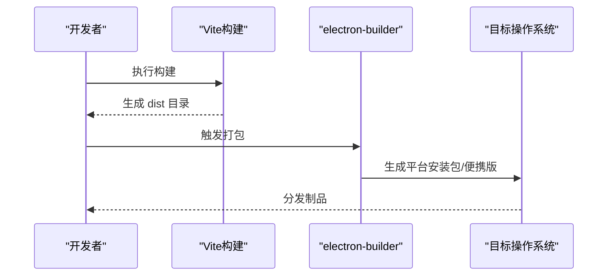
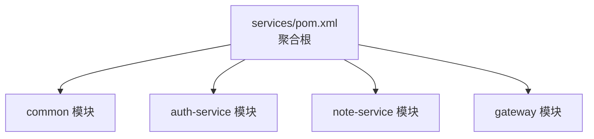
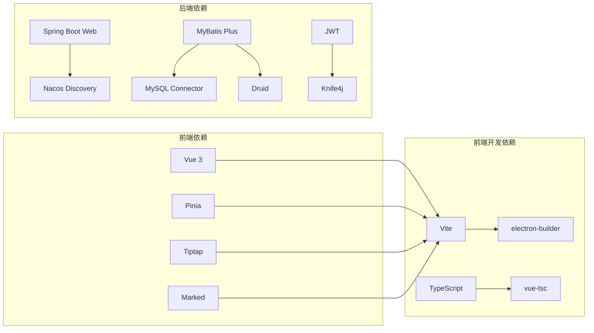

# 构建与部署

<cite>
**本文引用的文件**
- [app/package.json](file://app/package.json)
- [app/vite.config.ts](file://app/vite.config.ts)
- [app/tsconfig.json](file://app/tsconfig.json)
- [app/tsconfig.node.json](file://app/tsconfig.node.json)
- [app/electron/main.cjs](file://app/electron/main.cjs)
- [services/pom.xml](file://services/pom.xml)
- [services/auth-service/pom.xml](file://services/auth-service/pom.xml)
- [services/note-service/pom.xml](file://services/note-service/pom.xml)
- [services/gateway/pom.xml](file://services/gateway/pom.xml)
- [services/auth-service/src/main/resources/application.yml](file://services/auth-service/src/main/resources/application.yml)
- [services/note-service/src/main/resources/application.yml](file://services/note-service/src/main/resources/application.yml)
- [services/gateway/src/main/resources/application.yml](file://services/gateway/src/main/resources/application.yml)
</cite>

## 目录
1. [简介](#简介)
2. [项目结构](#项目结构)
3. [核心组件](#核心组件)
4. [架构总览](#架构总览)
5. [详细组件分析](#详细组件分析)
6. [依赖分析](#依赖分析)
7. [性能考虑](#性能考虑)
8. [故障排除指南](#故障排除指南)
9. [结论](#结论)
10. [附录](#附录)

## 简介
本指南面向Woo项目的构建与部署，覆盖以下方面：
- 前端构建：Vite配置、TypeScript编译、生产构建参数与打包策略
- Electron应用打包：跨平台构建、签名与分发准备
- 后端构建：Maven多模块聚合、依赖管理、插件执行与可运行包生成
- 容器化与云部署：Docker镜像构建与云平台部署要点（基于现有配置进行说明）
- CI/CD流水线：GitHub Actions参考思路、自动化测试与发布流程
- 环境配置管理：开发/测试/生产差异配置
- 版本管理与回滚：发布标签规范与回滚策略建议
- 部署脚本示例与故障排除

## 项目结构
Woo采用前后端分离架构：
- 前端位于 app 目录，使用 Vue 3 + TypeScript + Vite + Electron
- 后端位于 services 目录，采用 Maven 多模块（Spring Boot + Spring Cloud），包含网关、认证服务、笔记服务与公共模块

图表来源
- [app/package.json:1-38](file://app/package.json#L1-L38)
- [app/vite.config.ts:1-19](file://app/vite.config.ts#L1-L19)
- [app/tsconfig.json:1-25](file://app/tsconfig.json#L1-L25)
- [app/tsconfig.node.json:1-11](file://app/tsconfig.node.json#L1-L11)
- [app/electron/main.cjs:1-71](file://app/electron/main.cjs#L1-L71)
- [services/pom.xml:1-141](file://services/pom.xml#L1-L141)
- [services/auth-service/pom.xml:1-110](file://services/auth-service/pom.xml#L1-L110)
- [services/note-service/pom.xml:1-94](file://services/note-service/pom.xml#L1-L94)
- [services/gateway/pom.xml:1-72](file://services/gateway/pom.xml#L1-L72)
- [services/auth-service/src/main/resources/application.yml:1-40](file://services/auth-service/src/main/resources/application.yml#L1-L40)
- [services/note-service/src/main/resources/application.yml:1-35](file://services/note-service/src/main/resources/application.yml#L1-L35)
- [services/gateway/src/main/resources/application.yml:1-27](file://services/gateway/src/main/resources/application.yml#L1-L27)

章节来源
- [app/package.json:1-38](file://app/package.json#L1-L38)
- [services/pom.xml:1-141](file://services/pom.xml#L1-L141)

## 核心组件
- 前端构建与打包
  - 使用 Vite 进行开发服务器与生产构建，集成 Electron 插件以支持主进程入口
  - TypeScript 编译通过 vue-tsc 与 Vite 共同完成，严格类型检查
  - 生产构建输出至 dist 目录，Electron 打包使用 electron-builder
- Electron 应用
  - 主进程负责窗口创建、IPC通信与外部链接打开；开发模式加载本地Vite地址，生产模式加载打包后的页面
  - 用户数据路径自定义，避免系统默认路径带来的兼容性问题
- 后端多模块
  - services/pom.xml 聚合 common、auth-service、note-service、gateway 四个模块
  - 每个模块独立打包为可运行的 JAR，并由 spring-boot-maven-plugin 重打包
  - 网关通过路由规则将 /api/auth/** 转发到认证服务，将 /api/folders/**,/api/documents/** 转发到笔记服务
  - 认证与笔记服务均配置数据库连接、Nacos注册中心、MyBatis Plus、Knife4j等

章节来源
- [app/vite.config.ts:1-19](file://app/vite.config.ts#L1-L19)
- [app/tsconfig.json:1-25](file://app/tsconfig.json#L1-L25)
- [app/tsconfig.node.json:1-11](file://app/tsconfig.node.json#L1-L11)
- [app/electron/main.cjs:1-71](file://app/electron/main.cjs#L1-L71)
- [services/pom.xml:1-141](file://services/pom.xml#L1-L141)
- [services/gateway/src/main/resources/application.yml:1-27](file://services/gateway/src/main/resources/application.yml#L1-L27)

## 架构总览
下图展示前端 Electron 应用与后端微服务之间的交互关系。

图表来源
- [app/electron/main.cjs:1-71](file://app/electron/main.cjs#L1-L71)
- [services/gateway/src/main/resources/application.yml:1-27](file://services/gateway/src/main/resources/application.yml#L1-L27)
- [services/auth-service/src/main/resources/application.yml:1-40](file://services/auth-service/src/main/resources/application.yml#L1-L40)
- [services/note-service/src/main/resources/application.yml:1-35](file://services/note-service/src/main/resources/application.yml#L1-L35)

## 详细组件分析

### 前端构建与打包（Vite + Electron）
- 开发与构建脚本
  - dev：启动 Vite 开发服务器
  - build：先执行类型检查，再进行生产构建
  - preview：预览生产构建产物
  - electron:dev：以 Electron 运行时调试
  - electron:build：前端构建 + Electron 打包（需配合 electron-builder）
- Vite 配置要点
  - 集成 @vitejs/plugin-vue 与 vite-plugin-electron
  - 指定 Electron 主进程入口
  - 开发服务器端口与输出目录
- TypeScript 配置
  - 目标与模块解析采用 bundler 模式
  - 严格模式与未使用变量/参数检查
  - 引用 tsconfig.node.json 以支持 Vite 配置文件
- Electron 主进程
  - 自定义用户数据目录
  - 开发模式加载本地 Vite 地址，生产模式加载 dist/index.html
  - 提供窗口最小化/最大化/关闭与版本查询、外部链接打开等 IPC 接口

图表来源
- [app/package.json:6-12](file://app/package.json#L6-L12)
- [app/vite.config.ts:6-19](file://app/vite.config.ts#L6-L19)
- [app/tsconfig.json:2-22](file://app/tsconfig.json#L2-L22)
- [app/tsconfig.node.json:2-10](file://app/tsconfig.node.json#L2-L10)
- [app/electron/main.cjs:26-31](file://app/electron/main.cjs#L26-L31)

章节来源
- [app/package.json:1-38](file://app/package.json#L1-L38)
- [app/vite.config.ts:1-19](file://app/vite.config.ts#L1-L19)
- [app/tsconfig.json:1-25](file://app/tsconfig.json#L1-L25)
- [app/tsconfig.node.json:1-11](file://app/tsconfig.node.json#L1-L11)
- [app/electron/main.cjs:1-71](file://app/electron/main.cjs#L1-L71)

### Electron 应用打包策略
- 跨平台构建
  - electron-builder 支持 Windows/macOS/Linux 三端打包
  - 可在 CI 中按平台分别构建并上传制品
- 签名与公证
  - Windows：使用 PFX 证书签名安装包与更新程序
  - macOS：使用 Apple Developer ID 对应用与安装包签名，并进行公证
  - Linux：可选对 AppImage/Snap 等格式签名
- 应用分发准备
  - 生成更新元数据（如 Squirrel.Windows 或 NSIS 更新通道）
  - 准备安装包与便携版（Portable）分发渠道
- 开发与生产差异
  - 开发模式加载本地 Vite 地址
  - 生产模式加载 dist/index.html 并禁用开发者工具

图表来源
- [app/package.json:10-11](file://app/package.json#L10-L11)
- [app/vite.config.ts:16-18](file://app/vite.config.ts#L16-L18)
- [app/electron/main.cjs:26-31](file://app/electron/main.cjs#L26-L31)

章节来源
- [app/package.json:1-38](file://app/package.json#L1-L38)
- [app/electron/main.cjs:1-71](file://app/electron/main.cjs#L1-L71)

### 后端构建（Maven 多模块）
- 聚合工程
  - services/pom.xml 定义 Java 版本、Spring Boot 与 Spring Cloud 版本属性
  - 管理依赖版本（MyBatis Plus、JWT、MySQL、Druid、Knife4j、Hutool）
  - 统一插件管理（spring-boot-maven-plugin）
- 模块划分
  - common：实体、异常、通用工具与DTO
  - auth-service：用户认证与授权，依赖 common
  - note-service：文件夹与文档管理，依赖 common
  - gateway：Spring Cloud Gateway + Nacos发现 + JWT过滤
- 构建与运行
  - 每个模块使用 spring-boot-maven-plugin 生成可执行 JAR
  - 网关通过 application.yml 配置路由规则与 Nacos 地址
  - 认证/笔记服务通过 application.yml 配置数据库、MyBatis Plus、Knife4j与JWT

图表来源
- [services/pom.xml:15-20](file://services/pom.xml#L15-L20)
- [services/pom.xml:41-120](file://services/pom.xml#L41-L120)
- [services/auth-service/pom.xml:19-99](file://services/auth-service/pom.xml#L19-L99)
- [services/note-service/pom.xml:19-83](file://services/note-service/pom.xml#L19-L83)
- [services/gateway/pom.xml:19-61](file://services/gateway/pom.xml#L19-L61)

章节来源
- [services/pom.xml:1-141](file://services/pom.xml#L1-L141)
- [services/auth-service/pom.xml:1-110](file://services/auth-service/pom.xml#L1-L110)
- [services/note-service/pom.xml:1-94](file://services/note-service/pom.xml#L1-L94)
- [services/gateway/pom.xml:1-72](file://services/gateway/pom.xml#L1-L72)

### 环境配置管理（开发/测试/生产）
- 端口与服务名
  - gateway：端口 8080
  - auth-service：端口 8081
  - note-service：端口 8082
- 数据源与注册中心
  - 默认指向本地 MySQL 与 Nacos（localhost:8848）
- MyBatis Plus 与 Knife4j
  - Mapper 文件位置、驼峰映射、日志输出、逻辑删除字段
  - Knife4j 开启并设置语言
- JWT
  - 密钥与过期时间在各服务中配置

章节来源
- [services/gateway/src/main/resources/application.yml:1-27](file://services/gateway/src/main/resources/application.yml#L1-L27)
- [services/auth-service/src/main/resources/application.yml:1-40](file://services/auth-service/src/main/resources/application.yml#L1-L40)
- [services/note-service/src/main/resources/application.yml:1-35](file://services/note-service/src/main/resources/application.yml#L1-L35)

### 版本管理与发布标签规范
- 版本号来源
  - 前端 package.json 的 version 字段
  - 后端 services/pom.xml 的 version 与各模块 version
- 发布标签建议
  - 前端：vX.Y.Z 或 X.Y.Z
  - 后端：vx.y.z 或 x.y.z
- 回滚策略
  - 后端：保留最近 N 个版本的 Docker 镜像与二进制包
  - 前端：保留最近 N 个 Electron 安装包与 dist 压缩包
  - 网关与服务：通过配置中心或环境变量快速切换

章节来源
- [app/package.json:4](file://app/package.json#L4)
- [services/pom.xml:9](file://services/pom.xml#L9)

### CI/CD 流水线（GitHub Actions 参考）
- 触发条件
  - push 到 main 分支触发构建与测试
  - 创建标签触发发布与制品上传
- 步骤建议
  - 前端
    - 安装 Node.js 与 pnpm/yarn/npm
    - 安装依赖并执行类型检查与构建
    - 使用 electron-builder 生成多平台安装包
    - 上传制品到 Release 或 Artifacts
  - 后端
    - 安装 JDK 17
    - 使用 Maven 清理并构建多模块
    - 运行单元测试
    - 生成可执行 JAR
- 发布
  - 基于 Git 标签创建 GitHub Release
  - 上传前端安装包与后端 JAR 包

章节来源
- [app/package.json:6-12](file://app/package.json#L6-L12)
- [services/pom.xml:122-139](file://services/pom.xml#L122-L139)

### 容器化与云部署（基于现有配置说明）
- Docker 镜像构建
  - 建议为每个服务提供 Dockerfile，复制对应模块的可执行 JAR 至镜像
  - 指定 JAVA_OPTS 与 JVM 参数（内存、GC、时区）
  - 暴露服务端口（gateway:8080, auth-service:8081, note-service:8082）
- 云平台部署
  - Kubernetes：Deployment + Service + ConfigMap/Secret
  - 容器编排：通过环境变量覆盖 application.yml 中的数据库与注册中心地址
  - 注册中心：Nacos 与 MySQL 需单独部署或使用托管服务

章节来源
- [services/gateway/src/main/resources/application.yml:1-27](file://services/gateway/src/main/resources/application.yml#L1-L27)
- [services/auth-service/src/main/resources/application.yml:1-40](file://services/auth-service/src/main/resources/application.yml#L1-L40)
- [services/note-service/src/main/resources/application.yml:1-35](file://services/note-service/src/main/resources/application.yml#L1-L35)

## 依赖分析
- 前端
  - 依赖 Vue 3、Pinia、Tiptap、Marked 等
  - 开发依赖 Vite、TypeScript、electron、electron-builder、vue-tsc
- 后端
  - Spring Boot Starter Web/Validation
  - Spring Cloud Alibaba Nacos Discovery
  - MyBatis Plus、MySQL Connector、Druid
  - JWT、Knife4j、Lombok
- 构建插件
  - spring-boot-maven-plugin：生成可执行 JAR 并重打包

图表来源
- [app/package.json:13-35](file://app/package.json#L13-L35)
- [services/auth-service/pom.xml:19-99](file://services/auth-service/pom.xml#L19-L99)
- [services/note-service/pom.xml:19-83](file://services/note-service/pom.xml#L19-L83)
- [services/gateway/pom.xml:19-61](file://services/gateway/pom.xml#L19-L61)

章节来源
- [app/package.json:1-38](file://app/package.json#L1-L38)
- [services/auth-service/pom.xml:1-110](file://services/auth-service/pom.xml#L1-L110)
- [services/note-service/pom.xml:1-94](file://services/note-service/pom.xml#L1-L94)
- [services/gateway/pom.xml:1-72](file://services/gateway/pom.xml#L1-L72)

## 性能考虑
- 前端
  - 合理拆分包体，启用代码分割与懒加载
  - 生产构建开启压缩与 Tree-shaking
  - Electron 主进程尽量减少阻塞操作，使用 Worker 或异步 I/O
- 后端
  - 数据库连接池参数（最大连接数、空闲超时）需结合业务量调整
  - MyBatis Plus 分页与日志级别在生产关闭或降级
  - 网关路由规则避免过度匹配导致转发开销

## 故障排除指南
- 前端
  - 类型检查失败：优先修复类型错误，确保 vue-tsc 通过后再构建
  - 开发模式无法热更新：检查 Vite 端口占用与代理配置
  - Electron 打包失败：确认 electron-builder 配置与平台依赖已安装
- 后端
  - 启动失败（端口占用）：修改 application.yml 中的 server.port
  - Nacos 连接失败：确认 Nacos 地址与网络连通性
  - 数据库连接失败：核对 JDBC URL、用户名与密码
  - JWT 校验失败：确认密钥一致且未被篡改
- 通用
  - 清理缓存与重新安装依赖：删除 node_modules/.vite 与 .m2 缓存后重试

章节来源
- [app/package.json:6-12](file://app/package.json#L6-L12)
- [services/auth-service/src/main/resources/application.yml:1-40](file://services/auth-service/src/main/resources/application.yml#L1-L40)
- [services/note-service/src/main/resources/application.yml:1-35](file://services/note-service/src/main/resources/application.yml#L1-L35)
- [services/gateway/src/main/resources/application.yml:1-27](file://services/gateway/src/main/resources/application.yml#L1-L27)

## 结论
本指南提供了从前端到后端、从本地开发到跨平台打包与云部署的完整实践路径。建议在实际落地时结合团队规范补充 CI/CD 任务、监控告警与灰度发布策略，持续迭代构建与部署流程。

## 附录
- 部署脚本示例（概念性说明）
  - 前端：执行类型检查与构建，生成 dist；使用 electron-builder 生成安装包
  - 后端：Maven 清理构建，运行测试，生成可执行 JAR
- 环境变量建议
  - 数据库：DB_URL、DB_USER、DB_PASSWORD
  - 注册中心：NACOS_SERVER_ADDR
  - JWT：JWT_SECRET、JWT_EXPIRATION
- 回滚步骤
  - 停止当前服务，回滚到上一个稳定版本的镜像或安装包，重启并验证