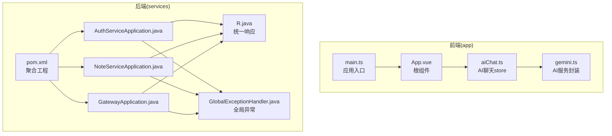
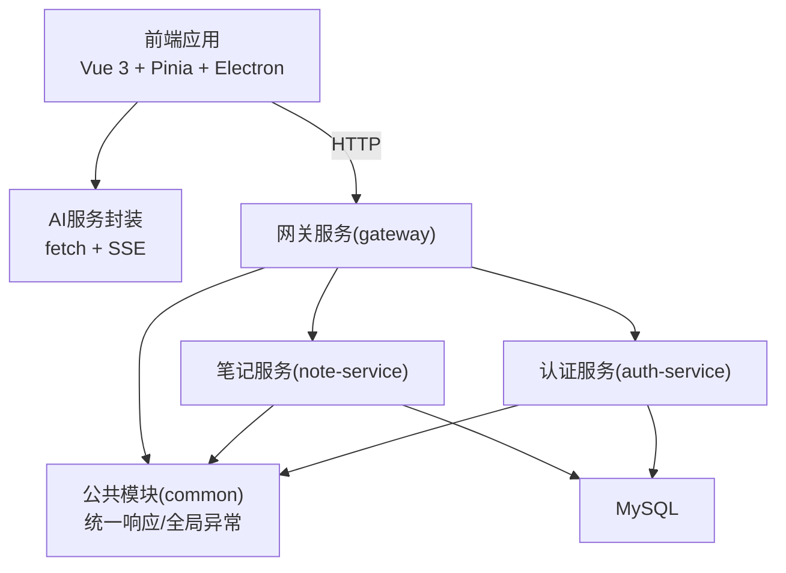
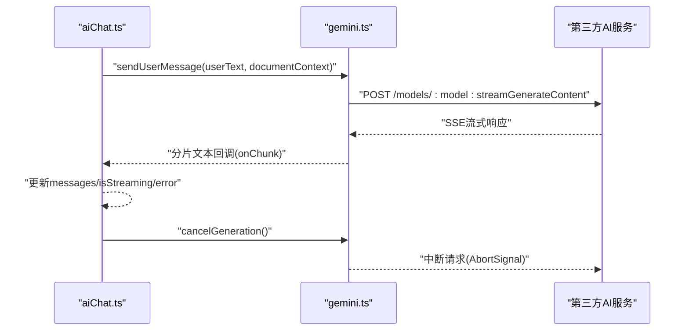
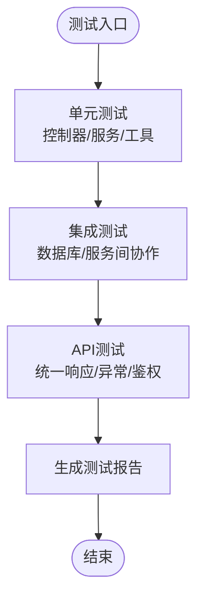
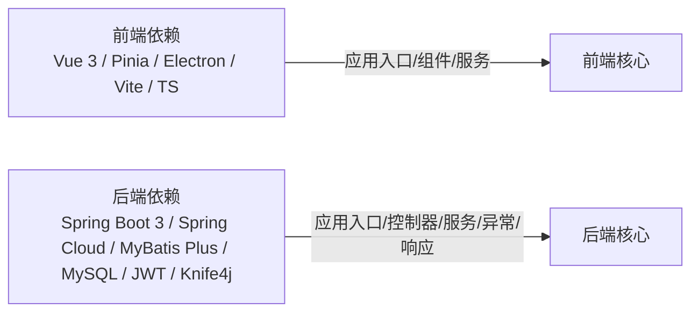

# 测试策略

<cite>
**本文引用的文件**
- [README.md](file://README.md)
- [package.json](file://app/package.json)
- [vite.config.ts](file://app/vite.config.ts)
- [tsconfig.json](file://app/tsconfig.json)
- [tsconfig.node.json](file://app/tsconfig.node.json)
- [main.ts](file://app/src/main.ts)
- [App.vue](file://app/src/App.vue)
- [aiChat.ts](file://app/src/stores/aiChat.ts)
- [gemini.ts](file://app/src/services/gemini.ts)
- [AuthServiceApplication.java](file://services/auth-service/src/main/java/com/nonegonotes/auth/AuthServiceApplication.java)
- [NoteServiceApplication.java](file://services/note-service/src/main/java/com/nonegonotes/note/NoteServiceApplication.java)
- [GatewayApplication.java](file://services/gateway/src/main/java/com/nonegonotes/gateway/GatewayApplication.java)
- [R.java](file://services/common/src/main/java/com/nonegonotes/common/result/R.java)
- [GlobalExceptionHandler.java](file://services/common/src/main/java/com/nonegonotes/common/exception/GlobalExceptionHandler.java)
- [pom.xml](file://services/pom.xml)
</cite>

## 目录
1. [引言](#引言)
2. [项目结构](#项目结构)
3. [核心组件](#核心组件)
4. [架构总览](#架构总览)
5. [详细组件分析](#详细组件分析)
6. [依赖分析](#依赖分析)
7. [性能考量](#性能考量)
8. [故障排查指南](#故障排查指南)
9. [结论](#结论)
10. [附录](#附录)

## 引言
本测试策略文档面向Woo项目（一个基于Vue 3 + Electron + Spring Boot微服务的桌面笔记应用），系统化地制定前后端测试方案，覆盖单元测试、组件测试、集成测试与API测试，并明确测试用例设计原则、覆盖率与质量门禁、Mock与测试数据管理、测试环境配置以及持续集成中的自动化测试流程与报告生成建议。

## 项目结构
- 前端（app）：Vue 3 + TypeScript + Pinia + Vite + Electron，入口为main.ts，根组件为App.vue；AI聊天相关逻辑集中在store与service模块。
- 后端（services）：多模块Maven聚合工程，包含common（统一响应与全局异常）、auth-service（认证）、note-service（笔记）、gateway（网关），均以Spring Boot应用形式运行。

图表来源
- [main.ts:1-8](file://app/src/main.ts#L1-L8)
- [App.vue:1-117](file://app/src/App.vue#L1-L117)
- [aiChat.ts:1-199](file://app/src/stores/aiChat.ts#L1-L199)
- [gemini.ts:1-103](file://app/src/services/gemini.ts#L1-L103)
- [AuthServiceApplication.java:1-15](file://services/auth-service/src/main/java/com/nonegonotes/auth/AuthServiceApplication.java#L1-L15)
- [NoteServiceApplication.java:1-15](file://services/note-service/src/main/java/com/nonegonotes/note/NoteServiceApplication.java#L1-L15)
- [GatewayApplication.java:1-15](file://services/gateway/src/main/java/com/nonegonotes/gateway/GatewayApplication.java#L1-L15)
- [R.java:1-42](file://services/common/src/main/java/com/nonegonotes/common/result/R.java#L1-L42)
- [GlobalExceptionHandler.java:1-27](file://services/common/src/main/java/com/nonegonotes/common/exception/GlobalExceptionHandler.java#L1-L27)
- [pom.xml:1-141](file://services/pom.xml#L1-L141)

章节来源
- [README.md:1-72](file://README.md#L1-L72)
- [pom.xml:1-141](file://services/pom.xml#L1-L141)

## 核心组件
- 前端应用入口与根组件：负责应用初始化、Pinia注册与全局挂载；根组件组织布局与事件绑定。
- AI聊天store：封装消息状态、模型选择、API Key管理、流式生成与取消控制。
- AI服务封装：封装对第三方AI服务的调用、参数构建、错误处理与流式读取。
- 后端统一响应与全局异常：规范所有接口返回格式与异常兜底。
- 微服务应用入口：认证、笔记与网关服务均以Spring Boot应用启动。

章节来源
- [main.ts:1-8](file://app/src/main.ts#L1-L8)
- [App.vue:1-117](file://app/src/App.vue#L1-L117)
- [aiChat.ts:1-199](file://app/src/stores/aiChat.ts#L1-L199)
- [gemini.ts:1-103](file://app/src/services/gemini.ts#L1-L103)
- [R.java:1-42](file://services/common/src/main/java/com/nonegonotes/common/result/R.java#L1-L42)
- [GlobalExceptionHandler.java:1-27](file://services/common/src/main/java/com/nonegonotes/common/exception/GlobalExceptionHandler.java#L1-L27)
- [AuthServiceApplication.java:1-15](file://services/auth-service/src/main/java/com/nonegonotes/auth/AuthServiceApplication.java#L1-L15)
- [NoteServiceApplication.java:1-15](file://services/note-service/src/main/java/com/nonegonotes/note/NoteServiceApplication.java#L1-L15)
- [GatewayApplication.java:1-15](file://services/gateway/src/main/java/com/nonegonotes/gateway/GatewayApplication.java#L1-L15)

## 架构总览
前端通过Electron运行，核心业务逻辑位于Vue应用内；AI能力通过封装的服务调用外部API；后端采用Spring Boot微服务，统一响应与异常处理，网关负责路由与鉴权过滤。

图表来源
- [gemini.ts:1-103](file://app/src/services/gemini.ts#L1-L103)
- [AuthServiceApplication.java:1-15](file://services/auth-service/src/main/java/com/nonegonotes/auth/AuthServiceApplication.java#L1-L15)
- [NoteServiceApplication.java:1-15](file://services/note-service/src/main/java/com/nonegonotes/note/NoteServiceApplication.java#L1-L15)
- [GatewayApplication.java:1-15](file://services/gateway/src/main/java/com/nonegonotes/gateway/GatewayApplication.java#L1-L15)
- [R.java:1-42](file://services/common/src/main/java/com/nonegonotes/common/result/R.java#L1-L42)
- [GlobalExceptionHandler.java:1-27](file://services/common/src/main/java/com/nonegonotes/common/exception/GlobalExceptionHandler.java#L1-L27)

## 详细组件分析

### 前端测试策略
- 单元测试（Jest/Vitest）
  - 目标：验证store逻辑（消息状态、模型选择、API Key管理、取消与清理）、工具函数（HTML去除、ID生成）与服务封装（fetch参数、SSE解析、错误分支）。
  - 推荐：使用Vitest作为替代方案，利用现有TypeScript与Vite配置，减少迁移成本；对异步与流式处理使用Promise与AbortController的合理断言。
  - 关键点：mock fetch与ReadableStream，模拟SSE分片与不同HTTP状态码；断言状态变更、错误信息与副作用（localStorage）。
- 组件测试（Vue Test Utils）
  - 目标：验证布局组件（TopMenu、LeftSidebar、RightSidebar、EditArea等）在交互事件下的渲染与状态变化。
  - 推荐：使用createApp挂载App.vue，结合Pinia的测试实例；对键盘事件与弹窗可见性进行断言。
  - 关键点：模拟window事件、Pinia store、Electron上下文；避免真实DOM副作用。
- 端到端测试（Cypress/Puppeteer）
  - 目标：验证从启动到典型工作流（打开设置、登录弹窗、切换侧栏、AI对话）的端到端路径。
  - 推荐：优先Cypress（更适合Web交互），或Puppeteer（适合Electron窗口场景）；结合Vite开发服务器与Electron主进程。
  - 关键点：隔离真实网络请求，使用Mock服务或拦截器；确保跨平台窗口尺寸与事件稳定性。

图表来源
- [aiChat.ts:73-169](file://app/src/stores/aiChat.ts#L73-L169)
- [gemini.ts:29-102](file://app/src/services/gemini.ts#L29-L102)

章节来源
- [aiChat.ts:1-199](file://app/src/stores/aiChat.ts#L1-L199)
- [gemini.ts:1-103](file://app/src/services/gemini.ts#L1-L103)
- [App.vue:1-117](file://app/src/App.vue#L1-L117)
- [main.ts:1-8](file://app/src/main.ts#L1-L8)
- [vite.config.ts:1-19](file://app/vite.config.ts#L1-L19)
- [tsconfig.json:1-25](file://app/tsconfig.json#L1-L25)
- [tsconfig.node.json:1-11](file://app/tsconfig.node.json#L1-L11)

### 后端测试策略
- 单元测试
  - 目标：验证控制器、服务层与工具类的业务逻辑与边界条件；对DTO转换、异常抛出与返回值进行断言。
  - 推荐：使用JUnit 5 + Spring Boot Test；对控制器使用@WebMvcTest，对服务层使用@TestConfiguration或@MockBean。
- 集成测试
  - 目标：验证服务间协作、数据库访问与事务一致性；使用Testcontainers启动MySQL与必要依赖。
  - 推荐：基于@SpringBootTest，使用@AutoConfigureTestDatabase与@Import导入测试配置。
- API测试
  - 目标：验证统一响应格式与全局异常处理；对鉴权、限流与跨域策略进行端到端校验。
  - 推荐：使用REST Assured或Spring REST Docs；对Knife4j生成的OpenAPI进行契约测试。

图表来源
- [R.java:1-42](file://services/common/src/main/java/com/nonegonotes/common/result/R.java#L1-L42)
- [GlobalExceptionHandler.java:1-27](file://services/common/src/main/java/com/nonegonotes/common/exception/GlobalExceptionHandler.java#L1-L27)
- [AuthServiceApplication.java:1-15](file://services/auth-service/src/main/java/com/nonegonotes/auth/AuthServiceApplication.java#L1-L15)
- [NoteServiceApplication.java:1-15](file://services/note-service/src/main/java/com/nonegonotes/note/NoteServiceApplication.java#L1-L15)
- [GatewayApplication.java:1-15](file://services/gateway/src/main/java/com/nonegonotes/gateway/GatewayApplication.java#L1-L15)

章节来源
- [R.java:1-42](file://services/common/src/main/java/com/nonegonotes/common/result/R.java#L1-L42)
- [GlobalExceptionHandler.java:1-27](file://services/common/src/main/java/com/nonegonotes/common/exception/GlobalExceptionHandler.java#L1-L27)
- [pom.xml:1-141](file://services/pom.xml#L1-L141)

### 测试用例设计原则
- 边界条件测试
  - 输入长度、空值、非法字符、超长字符串；API Key为空、无效、过期；SSE流截断与解析异常。
- 异常情况处理
  - 401/403/429等HTTP错误码；网络中断；AbortController取消；UI错误提示与状态回滚。
- 性能测试考虑
  - 流式响应吞吐量、并发请求上限、内存占用与事件循环阻塞；前端组件渲染性能与事件节流。
- 可重复性与隔离性
  - 使用Mock与Fake服务；测试数据最小化与可恢复；环境变量与端口随机化。

章节来源
- [gemini.ts:57-65](file://app/src/services/gemini.ts#L57-L65)
- [aiChat.ts:148-168](file://app/src/stores/aiChat.ts#L148-L168)

### 测试覆盖率与质量门禁
- 前端覆盖率
  - 行覆盖率≥80%，分支覆盖率≥70%，函数与指令覆盖率≥80%；对关键store与service模块提升至90%。
- 后端覆盖率
  - 行覆盖率≥80%，分支覆盖率≥70%，对控制器与服务层重点模块≥90%。
- 质量门禁
  - 未达覆盖率阈值禁止合并；存在失败用例或高危缺陷阻塞发布；报告需包含失败详情与修复建议。

章节来源
- [tsconfig.json:1-25](file://app/tsconfig.json#L1-L25)
- [tsconfig.node.json:1-11](file://app/tsconfig.node.json#L1-L11)

### Mock对象使用与测试数据管理
- 前端
  - 使用Vitest的mock函数与全局fetch拦截；对ReadableStream进行自定义实现；对localStorage进行代理或替换。
- 后端
  - 使用@MockBean/@SpyBean替换真实依赖；使用@AutoConfigureTestDatabase与Flyway/Hibernate测试脚本初始化；使用Testcontainers管理外部依赖容器。
- 测试数据
  - 使用最小化种子数据；通过SQL脚本或Builder模式构造；保证幂等与可清理。

章节来源
- [gemini.ts:1-103](file://app/src/services/gemini.ts#L1-L103)
- [aiChat.ts:1-199](file://app/src/stores/aiChat.ts#L1-L199)
- [pom.xml:1-141](file://services/pom.xml#L1-L141)

### 测试环境配置
- 前端
  - Vite开发服务器端口5173；构建输出dist；Electron主进程入口electron/main.cjs；TypeScript严格模式与bundler解析。
- 后端
  - Maven聚合工程；Spring Boot与Spring Cloud版本管理；Knife4j OpenAPI文档；Druid监控与MySQL连接；JWT工具类。

章节来源
- [vite.config.ts:1-19](file://app/vite.config.ts#L1-L19)
- [package.json:1-38](file://app/package.json#L1-L38)
- [pom.xml:1-141](file://services/pom.xml#L1-L141)

### 持续集成与自动化测试
- 前端流水线
  - 安装依赖 → 类型检查 → 单元测试（Vitest） → 组件测试（Vue Test Utils） → E2E测试（Cypress/Puppeteer） → 代码覆盖率收集 → 报告生成。
- 后端流水线
  - 安装依赖 → 单元测试 → 集成测试（含Testcontainers） → API测试（REST Assured/OpenAPI） → 覆盖率收集 → 报告生成。
- 报告与门禁
  - 使用JUnit XML、Cypress报告与JaCoCo覆盖率报告；质量门禁通过CI插件或质量门控工具实现。

章节来源
- [README.md:1-72](file://README.md#L1-L72)
- [pom.xml:1-141](file://services/pom.xml#L1-L141)

## 依赖分析
- 前端
  - Vue 3 + Pinia用于状态管理；Electron + Vite用于桌面端打包；TypeScript严格模式保障类型安全。
- 后端
  - Spring Boot 3 + Spring Cloud；MyBatis Plus + MySQL；JWT鉴权；Knife4j OpenAPI；全局异常与统一响应。

图表来源
- [package.json:1-38](file://app/package.json#L1-L38)
- [pom.xml:1-141](file://services/pom.xml#L1-L141)

章节来源
- [package.json:1-38](file://app/package.json#L1-L38)
- [pom.xml:1-141](file://services/pom.xml#L1-L141)

## 性能考量
- 前端
  - 流式渲染优化：按块更新UI，避免大文本一次性渲染；对滚动与事件进行节流/防抖。
  - 状态管理：Pinia响应式粒度控制，避免不必要的重渲染。
- 后端
  - 连接池与查询优化：Druid监控与MySQL索引；分页与缓存策略。
  - 并发与限流：网关层限流与熔断；服务间调用超时与重试。

## 故障排查指南
- 前端常见问题
  - fetch拦截失败：确认Vitest mock顺序与作用域；SSE解析异常：检查分片与JSON解析容错。
  - 事件未解绑：确保组件卸载时移除window事件监听。
- 后端常见问题
  - 统一响应缺失：检查@RestControllerAdvice与异常处理器；数据库初始化失败：核对Testcontainers与SQL脚本。
  - 鉴权失败：核对JWT签名与过期时间；跨域问题：核对网关CORS配置。

章节来源
- [gemini.ts:72-99](file://app/src/services/gemini.ts#L72-L99)
- [App.vue:92-100](file://app/src/App.vue#L92-L100)
- [GlobalExceptionHandler.java:15-25](file://services/common/src/main/java/com/nonegonotes/common/exception/GlobalExceptionHandler.java#L15-L25)

## 结论
本测试策略围绕Woo项目的前端与后端特性，制定了从单元到端到端的全链路测试方案，并明确了覆盖率与质量门禁、Mock与数据管理、环境配置及CI自动化流程。建议在实际落地中逐步完善测试用例与报告体系，持续提升质量与交付效率。

## 附录
- 快速参考
  - 前端入口与配置：[main.ts:1-8](file://app/src/main.ts#L1-L8)、[vite.config.ts:1-19](file://app/vite.config.ts#L1-L19)、[tsconfig.json:1-25](file://app/tsconfig.json#L1-L25)
  - AI聊天与服务：[aiChat.ts:1-199](file://app/src/stores/aiChat.ts#L1-L199)、[gemini.ts:1-103](file://app/src/services/gemini.ts#L1-L103)
  - 后端统一响应与异常：[R.java:1-42](file://services/common/src/main/java/com/nonegonotes/common/result/R.java#L1-L42)、[GlobalExceptionHandler.java:1-27](file://services/common/src/main/java/com/nonegonotes/common/exception/GlobalExceptionHandler.java#L1-L27)
  - 微服务应用入口：[AuthServiceApplication.java:1-15](file://services/auth-service/src/main/java/com/nonegonotes/auth/AuthServiceApplication.java#L1-L15)、[NoteServiceApplication.java:1-15](file://services/note-service/src/main/java/com/nonegonotes/note/NoteServiceApplication.java#L1-L15)、[GatewayApplication.java:1-15](file://services/gateway/src/main/java/com/nonegonotes/gateway/GatewayApplication.java#L1-L15)
  - 后端聚合工程：[pom.xml:1-141](file://services/pom.xml#L1-L141)