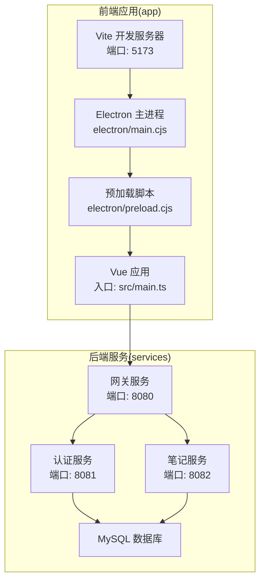
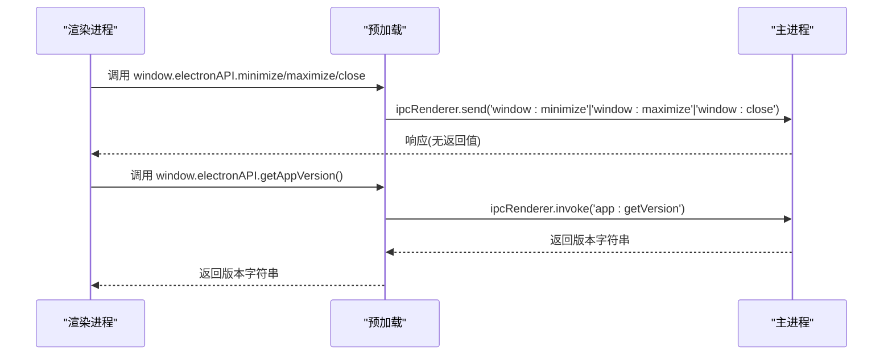
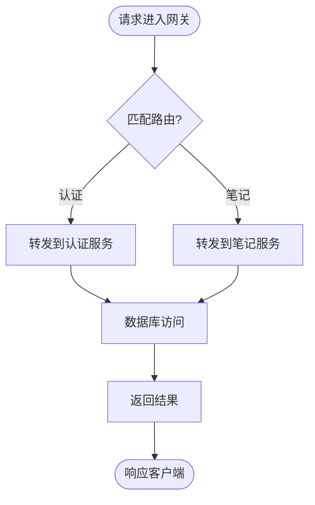
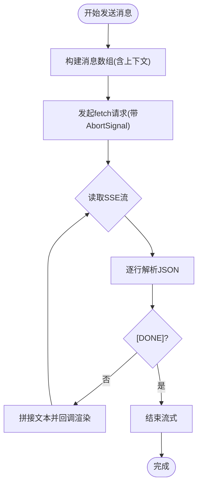
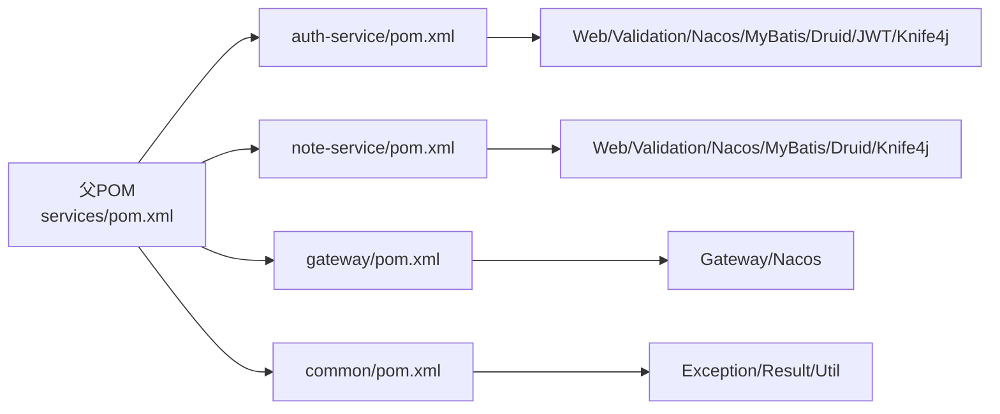

# 调试技巧

<cite>
**本文引用的文件**
- [app/package.json](file://app/package.json)
- [app/vite.config.ts](file://app/vite.config.ts)
- [app/src/main.ts](file://app/src/main.ts)
- [app/src/App.vue](file://app/src/App.vue)
- [app/src/services/gemini.ts](file://app/src/services/gemini.ts)
- [app/src/stores/aiChat.ts](file://app/src/stores/aiChat.ts)
- [app/electron/main.cjs](file://app/electron/main.cjs)
- [app/electron/preload.cjs](file://app/electron/preload.cjs)
- [services/pom.xml](file://services/pom.xml)
- [services/auth-service/pom.xml](file://services/auth-service/pom.xml)
- [services/auth-service/src/main/resources/application.yml](file://services/auth-service/src/main/resources/application.yml)
- [services/note-service/src/main/resources/application.yml](file://services/note-service/src/main/resources/application.yml)
- [services/gateway/src/main/resources/application.yml](file://services/gateway/src/main/resources/application.yml)
- [services/common/src/main/java/com/nonegonotes/common/exception/GlobalExceptionHandler.java](file://services/common/src/main/java/com/nonegonotes/common/exception/GlobalExceptionHandler.java)
- [services/auth-service/src/main/java/com/nonegonotes/auth/controller/AuthController.java](file://services/auth-service/src/main/java/com/nonegonotes/auth/controller/AuthController.java)
</cite>

## 目录
1. [简介](#简介)
2. [项目结构](#项目结构)
3. [核心组件](#核心组件)
4. [架构总览](#架构总览)
5. [详细组件分析](#详细组件分析)
6. [依赖分析](#依赖分析)
7. [性能考虑](#性能考虑)
8. [故障排查指南](#故障排查指南)
9. [结论](#结论)
10. [附录](#附录)

## 简介
本指南面向Woo项目的多端开发与调试，覆盖前端（浏览器与Vue生态）、Electron主/渲染进程、后端（Spring Boot微服务）三大层面。内容包括：
- 前端调试：浏览器开发者工具、Vue DevTools、网络请求监控、性能分析
- Electron调试：主进程与渲染进程、IPC通信、原生模块问题排查
- 后端调试：日志配置、数据库查询优化、API接口调试
- 常见问题：内存泄漏检测、性能瓶颈分析、并发问题排查
- 断点调试、条件断点、异步代码调试技巧
- 具体场景案例与解决方案

## 项目结构
Woo采用前后端分离架构：
- 前端：基于Vite + Vue 3 + Pinia + Tiptap，打包为静态资源，开发时由Electron加载
- Electron：主进程负责窗口生命周期与系统交互；预加载脚本暴露安全API给渲染进程
- 后端：Maven多模块，包含通用模块、认证服务、笔记服务与网关，使用Spring Boot 3 + MyBatis Plus + Druid + Knife4j



图表来源
- [app/vite.config.ts:1-19](file://app/vite.config.ts#L1-L19)
- [app/src/main.ts:1-8](file://app/src/main.ts#L1-L8)
- [app/electron/main.cjs:1-71](file://app/electron/main.cjs#L1-L71)
- [app/electron/preload.cjs:1-18](file://app/electron/preload.cjs#L1-L18)
- [services/gateway/src/main/resources/application.yml:1-27](file://services/gateway/src/main/resources/application.yml#L1-L27)
- [services/auth-service/src/main/resources/application.yml:1-40](file://services/auth-service/src/main/resources/application.yml#L1-L40)
- [services/note-service/src/main/resources/application.yml:1-35](file://services/note-service/src/main/resources/application.yml#L1-L35)

章节来源
- [app/package.json:1-38](file://app/package.json#L1-L38)
- [app/vite.config.ts:1-19](file://app/vite.config.ts#L1-L19)
- [services/pom.xml:1-141](file://services/pom.xml#L1-L141)

## 核心组件
- 前端应用入口与状态管理
  - 应用入口：创建Vue实例、注册Pinia并挂载根组件
  - AI聊天状态：封装模型选择、消息流式接收、AbortController取消机制
  - Gemini服务：封装API Key校验、HTML清理、流式SSE接收
- Electron集成
  - 主进程：创建窗口、加载开发/生产页面、注册IPC事件、打开外部链接
  - 预加载：通过contextBridge暴露受控API给渲染进程，并监听主进程消息
- 后端服务
  - 网关：路由转发至认证/笔记服务
  - 认证服务：登录/注册接口，配合JWT与数据库
  - 笔记服务：文档/文件夹相关接口
  - 公共异常处理：统一业务异常与未捕获异常返回

章节来源
- [app/src/main.ts:1-8](file://app/src/main.ts#L1-L8)
- [app/src/App.vue:1-131](file://app/src/App.vue#L1-L131)
- [app/src/stores/aiChat.ts:1-199](file://app/src/stores/aiChat.ts#L1-L199)
- [app/src/services/gemini.ts:1-103](file://app/src/services/gemini.ts#L1-L103)
- [app/electron/main.cjs:1-71](file://app/electron/main.cjs#L1-L71)
- [app/electron/preload.cjs:1-18](file://app/electron/preload.cjs#L1-L18)
- [services/gateway/src/main/resources/application.yml:1-27](file://services/gateway/src/main/resources/application.yml#L1-L27)
- [services/auth-service/src/main/resources/application.yml:1-40](file://services/auth-service/src/main/resources/application.yml#L1-L40)
- [services/note-service/src/main/resources/application.yml:1-35](file://services/note-service/src/main/resources/application.yml#L1-L35)
- [services/common/src/main/java/com/nonegonotes/common/exception/GlobalExceptionHandler.java:1-27](file://services/common/src/main/java/com/nonegonotes/common/exception/GlobalExceptionHandler.java#L1-L27)

## 架构总览
下图展示从浏览器到后端的典型调用链路，以及Electron主/渲染进程间的IPC交互。

```mermaid
sequenceDiagram
participant Browser as "浏览器"
participant Renderer as "渲染进程(Vue)"
participant Preload as "预加载(preload.cjs)"
participant Main as "主进程(main.cjs)"
participant GW as "网关(gateway)"
participant Auth as "认证(auth-service)"
participant Note as "笔记(note-service)"
participant DB as "MySQL"
Browser->>Main : 启动应用
Main->>Renderer : 加载开发/生产页面
Renderer->>Preload : 调用暴露API(窗口控制/版本等)
Preload-->>Renderer : IPC响应
Renderer->>GW : 发起HTTP请求(/api/auth,/api/documents)
GW->>Auth : 路由转发(认证)
GW->>Note : 路由转发(笔记)
Auth->>DB : 查询/写入
Note->>DB : 查询/写入
DB-->>Note : 结果
Note-->>GW : 结果
Auth-->>GW : 结果
GW-->>Renderer : 响应
Renderer-->>Browser : 渲染UI
```

图表来源
- [app/electron/main.cjs:26-31](file://app/electron/main.cjs#L26-L31)
- [app/electron/preload.cjs:4-13](file://app/electron/preload.cjs#L4-L13)
- [services/gateway/src/main/resources/application.yml:12-22](file://services/gateway/src/main/resources/application.yml#L12-L22)
- [services/auth-service/src/main/resources/application.yml:8-12](file://services/auth-service/src/main/resources/application.yml#L8-L12)
- [services/note-service/src/main/resources/application.yml:8-12](file://services/note-service/src/main/resources/application.yml#L8-L12)

## 详细组件分析

### 前端调试：浏览器与Vue生态
- 浏览器开发者工具
  - 打开方式：开发模式下Electron会自动打开开发者工具；也可手动打开
  - 关注点：Elements（DOM树与样式）、Console（日志与错误）、Sources（断点与调用栈）、Network（请求与响应）、Performance/Memory（性能与内存）
- Vue DevTools
  - 安装与启用：在浏览器扩展商店安装Vue DevTools；开发环境下可直接使用
  - 使用场景：检查组件层级、响应式数据、状态变更、组件渲染次数
- 网络请求监控
  - 目标：观察API请求路径、参数、响应体、耗时、错误码
  - 建议：结合后端日志与浏览器Network面板交叉验证
- 性能分析
  - Performance：记录帧率、长任务、布局抖动
  - Memory：快照对比，识别泄漏对象类型与持有者

章节来源
- [app/electron/main.cjs:26-28](file://app/electron/main.cjs#L26-L28)
- [app/src/services/gemini.ts:29-102](file://app/src/services/gemini.ts#L29-L102)
- [app/src/stores/aiChat.ts:134-168](file://app/src/stores/aiChat.ts#L134-L168)

### Electron调试：主进程与渲染进程
- 开发模式下的自动调试
  - 主进程：开发时自动打开开发者工具，便于查看日志与断点
  - 渲染进程：通过预加载脚本暴露API，便于在渲染层进行断点与日志输出
- IPC通信调试
  - 主进程注册事件与handle处理器，渲染进程通过ipcRenderer发送/调用
  - 建议：在主进程与渲染进程分别打印消息，确认消息到达与处理顺序
- 原生模块问题排查
  - 确认Node集成与上下文隔离配置；避免在渲染进程直接使用Node能力
  - 如需原生模块，确保与Electron版本匹配并正确打包



图表来源
- [app/electron/preload.cjs:4-13](file://app/electron/preload.cjs#L4-L13)
- [app/electron/main.cjs:34-53](file://app/electron/main.cjs#L34-L53)

章节来源
- [app/electron/main.cjs:1-71](file://app/electron/main.cjs#L1-L71)
- [app/electron/preload.cjs:1-18](file://app/electron/preload.cjs#L1-L18)

### 后端调试：Spring Boot应用
- 日志配置
  - 全局异常处理：统一捕获业务异常与未预期异常，输出日志并返回标准响应
  - Knife4j：开启在线文档，便于接口调试与联调
- 数据库查询优化
  - MyBatis Plus：开启SQL日志输出，定位慢查询与重复查询
  - Druid：连接池监控，观察活跃/空闲连接数与SQL执行时间
- API接口调试
  - 网关路由：确认路径匹配与负载均衡
  - 控制器：使用Swagger/Knife4j测试接口，关注鉴权与参数校验



图表来源
- [services/gateway/src/main/resources/application.yml:12-22](file://services/gateway/src/main/resources/application.yml#L12-L22)
- [services/common/src/main/java/com/nonegonotes/common/exception/GlobalExceptionHandler.java:15-25](file://services/common/src/main/java/com/nonegonotes/common/exception/GlobalExceptionHandler.java#L15-L25)

章节来源
- [services/common/src/main/java/com/nonegonotes/common/exception/GlobalExceptionHandler.java:1-27](file://services/common/src/main/java/com/nonegonotes/common/exception/GlobalExceptionHandler.java#L1-L27)
- [services/auth-service/src/main/resources/application.yml:18-23](file://services/auth-service/src/main/resources/application.yml#L18-L23)
- [services/note-service/src/main/resources/application.yml:18-23](file://services/note-service/src/main/resources/application.yml#L18-L23)
- [services/gateway/src/main/resources/application.yml:1-27](file://services/gateway/src/main/resources/application.yml#L1-L27)
- [services/auth-service/src/main/java/com/nonegonotes/auth/controller/AuthController.java:1-31](file://services/auth-service/src/main/java/com/nonegonotes/auth/controller/AuthController.java#L1-L31)

### AI聊天与流式响应调试要点
- 流式SSE解析：逐行解析data: JSON片段，注意[DONE]标记与异常行跳过
- 取消机制：使用AbortController取消请求，避免渲染层残留回调
- 文档上下文注入：首次消息携带文档上下文，注意长度截断与HTML清理



图表来源
- [app/src/services/gemini.ts:29-102](file://app/src/services/gemini.ts#L29-L102)
- [app/src/stores/aiChat.ts:134-168](file://app/src/stores/aiChat.ts#L134-L168)

章节来源
- [app/src/services/gemini.ts:1-103](file://app/src/services/gemini.ts#L1-L103)
- [app/src/stores/aiChat.ts:1-199](file://app/src/stores/aiChat.ts#L1-L199)

## 依赖分析
- 前端依赖
  - Vue 3、Pinia、Tiptap、marked、Electron等
  - Vite插件集成Electron入口，开发服务器端口5173
- 后端依赖
  - Spring Boot 3、MyBatis Plus、Druid、Knife4j、Nacos Discovery
  - Maven聚合工程，模块化拆分清晰



图表来源
- [services/pom.xml:15-20](file://services/pom.xml#L15-L20)
- [services/auth-service/pom.xml:19-98](file://services/auth-service/pom.xml#L19-L98)
- [services/auth-service/src/main/resources/application.yml:1-40](file://services/auth-service/src/main/resources/application.yml#L1-L40)

章节来源
- [app/package.json:13-35](file://app/package.json#L13-L35)
- [app/vite.config.ts:1-19](file://app/vite.config.ts#L1-L19)
- [services/pom.xml:1-141](file://services/pom.xml#L1-L141)
- [services/auth-service/pom.xml:1-110](file://services/auth-service/pom.xml#L1-L110)

## 性能考虑
- 前端
  - 避免不必要的响应式更新；对高频渲染组件使用浅比较与memo
  - 图片/富文本渲染时注意节流与虚拟滚动
  - 使用浏览器性能面板识别长任务与内存峰值
- Electron
  - 将重计算移至主进程或预加载；渲染进程仅做UI与IPC交互
  - 合理关闭窗口与释放资源，避免进程常驻占用
- 后端
  - SQL日志与慢查询分析；索引优化与批量操作
  - 连接池参数调优；线程池与限流策略
  - 缓存热点数据，减少数据库压力

## 故障排查指南

### 内存泄漏检测
- 前端
  - 使用浏览器Memory面板进行堆快照对比，定位未释放的DOM、事件监听器、定时器与闭包
  - 检查组件卸载逻辑，确保移除全局事件与清理定时器
- Electron
  - 渲染进程卸载时，确保移除所有事件监听与定时器
  - 主进程避免持有渲染进程对象的强引用

章节来源
- [app/src/App.vue:107-114](file://app/src/App.vue#L107-L114)
- [app/src/stores/aiChat.ts:171-173](file://app/src/stores/aiChat.ts#L171-L173)

### 性能瓶颈分析
- 前端
  - Performance面板：识别主线程阻塞、布局抖动、重绘
  - Network面板：识别大体积响应、重复请求、跨域预检
- 后端
  - SQL日志与慢查询：定位低效查询与缺失索引
  - 连接池与线程池：观察阻塞与超时

章节来源
- [services/auth-service/src/main/resources/application.yml:22-23](file://services/auth-service/src/main/resources/application.yml#L22-L23)
- [services/note-service/src/main/resources/application.yml:21-23](file://services/note-service/src/main/resources/application.yml#L21-L23)

### 并发问题排查
- 前端
  - 多处同时发起请求时，使用AbortController统一取消，避免竞态
  - Pinia状态更新需幂等，避免重复渲染
- Electron
  - IPC消息处理需保证顺序与幂等；避免在多个事件中同时修改同一共享状态
- 后端
  - 接口幂等性设计；分布式锁与重试策略
  - 数据库事务边界明确，避免死锁

章节来源
- [app/src/stores/aiChat.ts:131-132](file://app/src/stores/aiChat.ts#L131-L132)
- [app/electron/main.cjs:34-53](file://app/electron/main.cjs#L34-L53)

### 断点调试、条件断点与异步代码调试
- 前端
  - 条件断点：在消息流式处理中按“收到新片段”设置断点
  - 异步：在fetch与reader循环中分段断点，观察buffer与line解析过程
- Electron
  - 主进程：在IPC事件处理处设置断点，观察消息到达与处理
  - 渲染进程：在预加载暴露API处设置断点，验证调用链
- 后端
  - 控制器与服务层分别设置断点，结合日志定位异常抛出位置
  - 使用IDE远程调试（JVM参数与端口配置）

章节来源
- [app/src/services/gemini.ts:67-99](file://app/src/services/gemini.ts#L67-L99)
- [app/electron/preload.cjs:15-18](file://app/electron/preload.cjs#L15-L18)
- [services/common/src/main/java/com/nonegonotes/common/exception/GlobalExceptionHandler.java:15-25](file://services/common/src/main/java/com/nonegonotes/common/exception/GlobalExceptionHandler.java#L15-L25)

### 常见问题与场景案例

- 场景一：渲染进程无法调用窗口控制API
  - 现象：点击最小化/最大化按钮无响应
  - 排查：确认预加载脚本已暴露API；主进程已注册对应IPC事件
  - 解决：检查预加载与主进程的IPC名称一致性与调用时机

- 场景二：AI聊天无响应或报错
  - 现象：点击发送后无输出，或出现“API Key无效”
  - 排查：检查API Key存储与读取；网络面板确认请求状态码；后端日志定位鉴权/配额限制
  - 解决：在设置中重新配置Key；必要时增加请求频率限制提示

- 场景三：Electron开发时白屏或空白页面
  - 现象：开发服务器正常但窗口显示空白
  - 排查：确认主进程加载的是开发服务器地址；检查CORS与跨域策略
  - 解决：确保开发服务器端口与配置一致；关闭跨域限制或正确配置代理

- 场景四：后端接口返回500
  - 现象：接口调用失败，返回服务器内部错误
  - 排查：查看全局异常处理器日志；确认业务异常是否被正确捕获
  - 解决：补充业务异常类型与提示；完善控制器参数校验

章节来源
- [app/electron/preload.cjs:4-13](file://app/electron/preload.cjs#L4-L13)
- [app/electron/main.cjs:26-31](file://app/electron/main.cjs#L26-L31)
- [app/src/services/gemini.ts:57-65](file://app/src/services/gemini.ts#L57-L65)
- [services/common/src/main/java/com/nonegonotes/common/exception/GlobalExceptionHandler.java:21-25](file://services/common/src/main/java/com/nonegonotes/common/exception/GlobalExceptionHandler.java#L21-L25)

## 结论
通过本指南，开发者可在Woo项目中系统地开展前端、Electron与后端的调试工作。建议以“浏览器工具 + Electron IPC + Spring Boot日志”三位一体的方式进行问题定位，并结合性能分析与内存快照持续优化用户体验与稳定性。

## 附录
- 开发命令参考
  - 前端开发：npm run dev 或 yarn dev
  - Electron开发：npm run electron:dev 或 yarn electron:dev
  - 构建：npm run build / npm run electron:build
- 关键端口
  - 前端开发服务器：5173
  - 网关服务：8080
  - 认证服务：8081
  - 笔记服务：8082

章节来源
- [app/package.json:6-11](file://app/package.json#L6-L11)
- [app/vite.config.ts:13-15](file://app/vite.config.ts#L13-L15)
- [services/gateway/src/main/resources/application.yml:1-2](file://services/gateway/src/main/resources/application.yml#L1-L2)
- [services/auth-service/src/main/resources/application.yml:1-2](file://services/auth-service/src/main/resources/application.yml#L1-L2)
- [services/note-service/src/main/resources/application.yml:1-2](file://services/note-service/src/main/resources/application.yml#L1-L2)