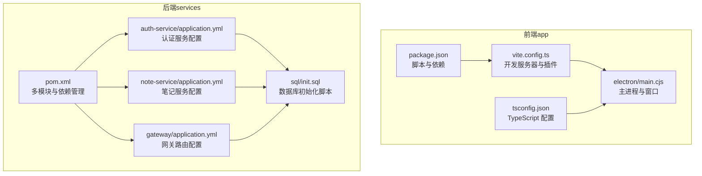
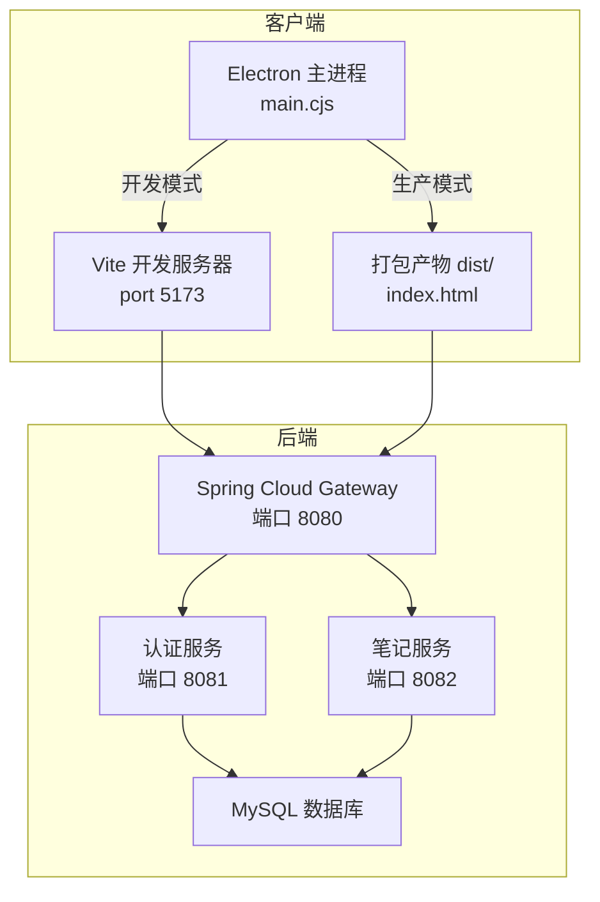
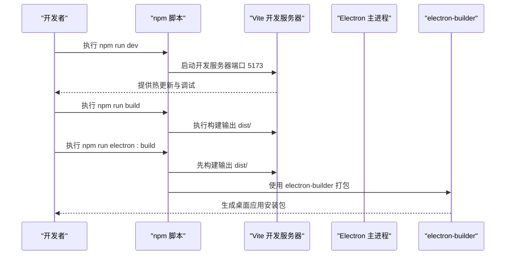
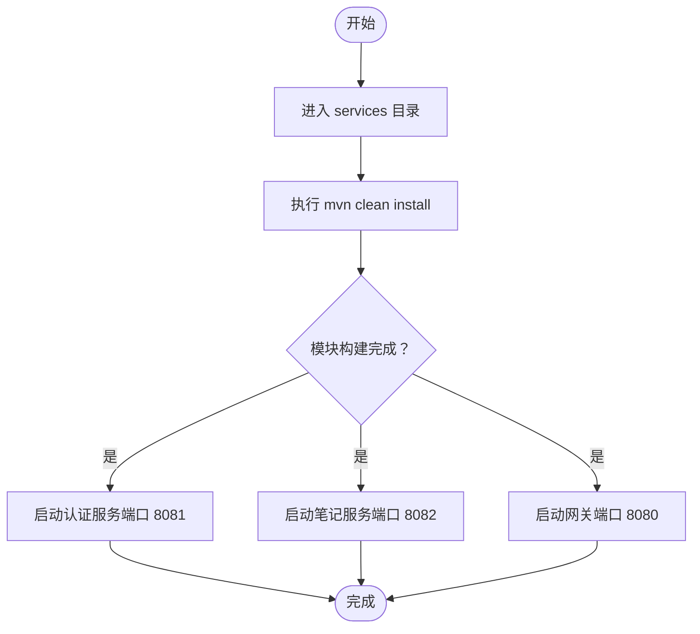
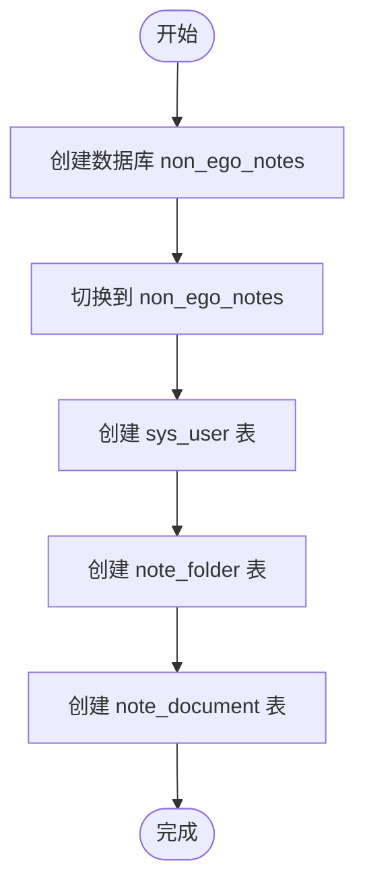
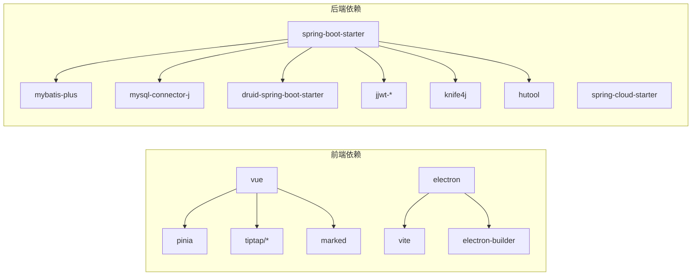

# 快速开始

<cite>
**本文引用的文件**
- [README.md](file://README.md)
- [package.json](file://app/package.json)
- [vite.config.ts](file://app/vite.config.ts)
- [main.cjs](file://app/electron/main.cjs)
- [tsconfig.json](file://app/tsconfig.json)
- [pom.xml](file://services/pom.xml)
- [init.sql](file://services/sql/init.sql)
- [application.yml（认证服务）](file://services/auth-service/src/main/resources/application.yml)
- [application.yml（笔记服务）](file://services/note-service/src/main/resources/application.yml)
- [application.yml（网关）](file://services/gateway/src/main/resources/application.yml)
- [AuthServiceApplication.java](file://services/auth-service/src/main/java/com/nonegonotes/auth/AuthServiceApplication.java)
- [User.java（公共实体）](file://services/common/src/main/java/com/nonegonotes/common/entity/User.java)
- [Folder.java（公共实体）](file://services/common/src/main/java/com/nonegonotes/common/entity/Folder.java)
- [Document.java（公共实体）](file://services/common/src/main/java/com/nonegonotes/common/entity/Document.java)
</cite>

## 目录
1. [简介](#简介)
2. [项目结构](#项目结构)
3. [核心组件](#核心组件)
4. [架构总览](#架构总览)
5. [详细组件分析](#详细组件分析)
6. [依赖关系分析](#依赖关系分析)
7. [性能考虑](#性能考虑)
8. [故障排查指南](#故障排查指南)
9. [结论](#结论)
10. [附录](#附录)

## 简介
本指南面向首次接触 Woo（无我笔记）项目的开发者，帮助你在本地快速搭建完整的开发环境，涵盖前端（Vue 3 + Electron）、后端（Spring Boot 3 + Spring Cloud）以及数据库（MySQL）的安装与配置，并提供从零到一的运行步骤、常见问题排查与验证方法。

## 项目结构
Woo 采用前后端分离的多模块架构：
- 前端（app）：基于 Vue 3 + TypeScript + Pinia，使用 Vite 构建，通过 Electron 打包为桌面应用。
- 后端（services）：基于 Spring Boot 3 + Spring Cloud，采用 Maven 多模块组织，包含网关、认证服务、笔记服务与公共模块。
- 数据库（services/sql）：提供初始化 SQL 脚本，包含用户、目录、文稿三张核心表。

图表来源
- [package.json:1-38](file://app/package.json#L1-L38)
- [vite.config.ts:1-19](file://app/vite.config.ts#L1-L19)
- [main.cjs:1-71](file://app/electron/main.cjs#L1-L71)
- [tsconfig.json:1-25](file://app/tsconfig.json#L1-L25)
- [pom.xml:1-141](file://services/pom.xml#L1-L141)
- [application.yml（认证服务）:1-40](file://services/auth-service/src/main/resources/application.yml#L1-L40)
- [application.yml（笔记服务）:1-35](file://services/note-service/src/main/resources/application.yml#L1-L35)
- [application.yml（网关）:1-27](file://services/gateway/src/main/resources/application.yml#L1-L27)
- [init.sql:1-55](file://services/sql/init.sql#L1-L55)

章节来源
- [README.md:47-63](file://README.md#L47-L63)
- [pom.xml:15-20](file://services/pom.xml#L15-L20)

## 核心组件
- 前端开发工具链：Vite 提供开发服务器与构建，Electron 将 Web 应用包装为桌面应用；脚本命令集中在 package.json 的 scripts 字段。
- 后端技术栈：Spring Boot 3 + Spring Cloud，使用 Maven 管理多模块；数据库连接、MyBatis Plus、JWT、Knife4j 等在后端配置中集中声明。
- 数据库：MySQL 8，使用 init.sql 初始化非逻辑删除的用户、目录、文稿三张表。

章节来源
- [README.md:20-45](file://README.md#L20-L45)
- [package.json:6-12](file://app/package.json#L6-L12)
- [pom.xml:22-39](file://services/pom.xml#L22-L39)
- [init.sql:5-55](file://services/sql/init.sql#L5-L55)

## 架构总览
下图展示了前后端交互与数据库的关系：前端通过 Electron 加载 Vite 开发服务器或打包产物；后端通过网关统一对外暴露 API，认证与笔记服务分别提供用户与文档相关能力；数据库提供持久化存储。

图表来源
- [main.cjs:26-31](file://app/electron/main.cjs#L26-L31)
- [vite.config.ts:13-18](file://app/vite.config.ts#L13-L18)
- [application.yml（网关）:1-27](file://services/gateway/src/main/resources/application.yml#L1-L27)
- [application.yml（认证服务）:1-40](file://services/auth-service/src/main/resources/application.yml#L1-L40)
- [application.yml（笔记服务）:1-35](file://services/note-service/src/main/resources/application.yml#L1-L35)

## 详细组件分析

### 前端开发环境配置
- 进入 app 目录，安装依赖：npm install
- 启动开发服务器：npm run dev（默认开发服务器端口为 5173）
- 构建生产版本：npm run build（输出至 dist 目录）
- 构建 Electron 应用：npm run electron:build（先编译 TypeScript/Vite，再使用 electron-builder 打包）

图表来源
- [package.json:6-12](file://app/package.json#L6-L12)
- [vite.config.ts:13-18](file://app/vite.config.ts#L13-L18)
- [main.cjs:26-31](file://app/electron/main.cjs#L26-L31)

章节来源
- [README.md:22-36](file://README.md#L22-L36)
- [package.json:6-12](file://app/package.json#L6-L12)
- [vite.config.ts:1-19](file://app/vite.config.ts#L1-L19)
- [main.cjs:1-71](file://app/electron/main.cjs#L1-L71)

### 后端开发环境配置
- 进入 services 目录，执行 mvn clean install 构建所有微服务（common、auth-service、note-service、gateway）
- 各微服务可独立启动，入口类位于对应模块的 main 包内
- 认证服务与笔记服务通过 application.yml 配置数据源、MyBatis Plus、JWT、Knife4j 等参数

图表来源
- [README.md:38-45](file://README.md#L38-L45)
- [pom.xml:15-20](file://services/pom.xml#L15-L20)
- [AuthServiceApplication.java:1-15](file://services/auth-service/src/main/java/com/nonegonotes/auth/AuthServiceApplication.java#L1-L15)

章节来源
- [README.md:38-45](file://README.md#L38-L45)
- [pom.xml:15-20](file://services/pom.xml#L15-L20)
- [AuthServiceApplication.java:1-15](file://services/auth-service/src/main/java/com/nonegonotes/auth/AuthServiceApplication.java#L1-L15)

### 数据库初始化步骤
- 创建数据库：使用 init.sql 中的 CREATE DATABASE 语句创建 non_ego_notes
- 初始化表结构：执行 init.sql 中的 CREATE TABLE 语句，创建 sys_user、note_folder、note_document 三张表
- 基础数据：根据需要手动插入初始用户、目录或文稿数据（如需）

图表来源
- [init.sql:5-55](file://services/sql/init.sql#L5-L55)

章节来源
- [init.sql:5-55](file://services/sql/init.sql#L5-L55)

### 关键配置要点
- 前端开发服务器端口：5173（vite.config.ts server.port）
- Electron 开发模式加载地址：http://localhost:5173（main.cjs）
- 后端网关端口：8080（gateway application.yml），认证服务 8081，笔记服务 8082
- 数据源连接：MySQL 8，默认用户名/密码与 URL 在各服务 application.yml 中配置
- MyBatis Plus：mapper 映射路径、驼峰命名、逻辑删除字段等在 common 实体与 yml 中统一配置

章节来源
- [vite.config.ts:13-15](file://app/vite.config.ts#L13-L15)
- [main.cjs:26-31](file://app/electron/main.cjs#L26-L31)
- [application.yml（网关）:1-27](file://services/gateway/src/main/resources/application.yml#L1-L27)
- [application.yml（认证服务）:8-12](file://services/auth-service/src/main/resources/application.yml#L8-L12)
- [application.yml（笔记服务）:8-12](file://services/note-service/src/main/resources/application.yml#L8-L12)
- [User.java:12-39](file://services/common/src/main/java/com/nonegonotes/common/entity/User.java#L12-L39)
- [Folder.java:12-38](file://services/common/src/main/java/com/nonegonotes/common/entity/Folder.java#L12-L38)
- [Document.java:12-41](file://services/common/src/main/java/com/nonegonotes/common/entity/Document.java#L12-L41)

## 依赖关系分析
- 前端依赖：Vue 3、Pinia、Tiptap、Marked、Electron、Vite、electron-builder 等
- 后端依赖：Spring Boot 3、Spring Cloud、MyBatis Plus、MySQL Connector、Druid、JWT、Knife4j、Hutool 等
- 模块耦合：services/pom.xml 管理多模块聚合，common 模块被其他服务复用

图表来源
- [package.json:13-35](file://app/package.json#L13-L35)
- [pom.xml:41-119](file://services/pom.xml#L41-L119)

章节来源
- [package.json:13-35](file://app/package.json#L13-L35)
- [pom.xml:41-119](file://services/pom.xml#L41-L119)

## 性能考虑
- 前端开发阶段建议启用 Vite 的热更新与按需加载，避免一次性引入过多重型依赖。
- Electron 打包时注意仅包含必要资源，合理配置 electron-builder 输出，减少安装包体积。
- 后端数据库连接池使用 Druid，建议结合业务并发调优连接数与超时策略。
- API 文档使用 Knife4j，便于联调与问题定位。

## 故障排查指南
- 前端无法访问开发服务器
  - 检查 Vite 端口占用与防火墙设置（默认 5173）
  - 确认 Electron 开发模式加载地址与 Vite 一致
- Electron 打包失败
  - 确保已成功执行 npm run build，再执行 npm run electron:build
  - 检查 package.json 中 main 字段与 electron 入口路径
- 后端服务启动失败
  - 检查数据库连接参数（URL、用户名、密码）与网络连通性
  - 确认各服务端口未被占用（8080、8081、8082）
- 数据库初始化异常
  - 确认 MySQL 版本兼容性与字符集设置
  - 按顺序执行 init.sql，确保数据库与表不存在冲突

章节来源
- [vite.config.ts:13-18](file://app/vite.config.ts#L13-L18)
- [main.cjs:26-31](file://app/electron/main.cjs#L26-L31)
- [package.json:36-37](file://app/package.json#L36-L37)
- [application.yml（认证服务）:8-12](file://services/auth-service/src/main/resources/application.yml#L8-L12)
- [application.yml（笔记服务）:8-12](file://services/note-service/src/main/resources/application.yml#L8-L12)
- [application.yml（网关）:11-22](file://services/gateway/src/main/resources/application.yml#L11-L22)
- [init.sql:5-55](file://services/sql/init.sql#L5-L55)

## 结论
按照本指南完成环境准备与初始化后，你可以在本地同时运行前端开发服务器与后端微服务，并通过网关访问认证与笔记服务。若遇到问题，请优先检查端口占用、数据库连接与脚本执行顺序。

## 附录

### 安装与环境要求
- Node.js 与 npm：用于前端依赖安装与构建
- Java 17 与 Maven：用于后端多模块构建
- MySQL 8：用于持久化存储
- 可选：Nacos（服务注册发现）与 IDE（如 IntelliJ IDEA）

章节来源
- [README.md:12-18](file://README.md#L12-L18)
- [pom.xml:22-26](file://services/pom.xml#L22-L26)

### 验证安装成功的测试步骤
- 前端
  - 访问 http://localhost:5173，确认页面渲染正常
  - 执行 npm run build，检查 dist 目录生成
  - 执行 npm run electron:build，确认打包产物生成
- 后端
  - 启动网关、认证与笔记服务，访问 http://localhost:8080 查看路由
  - 访问 http://localhost:8081 与 http://localhost:8082 的 Knife4j 文档确认接口可用
- 数据库
  - 登录 MySQL，确认 non_ego_notes 数据库存在且包含 sys_user、note_folder、note_document 表

章节来源
- [README.md:22-45](file://README.md#L22-L45)
- [application.yml（网关）:11-22](file://services/gateway/src/main/resources/application.yml#L11-L22)
- [application.yml（认证服务）:35-40](file://services/auth-service/src/main/resources/application.yml#L35-L40)
- [application.yml（笔记服务）:30-35](file://services/note-service/src/main/resources/application.yml#L30-L35)
- [init.sql:5-55](file://services/sql/init.sql#L5-L55)