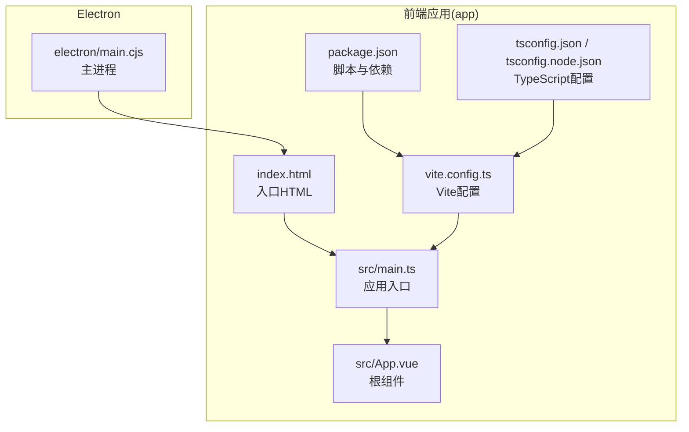
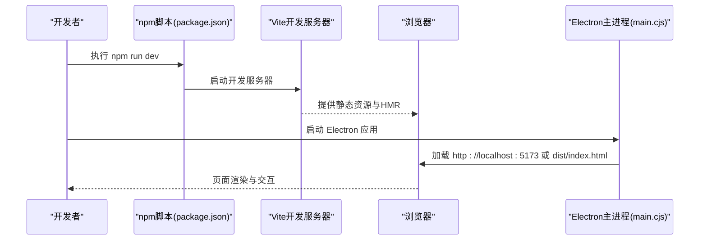
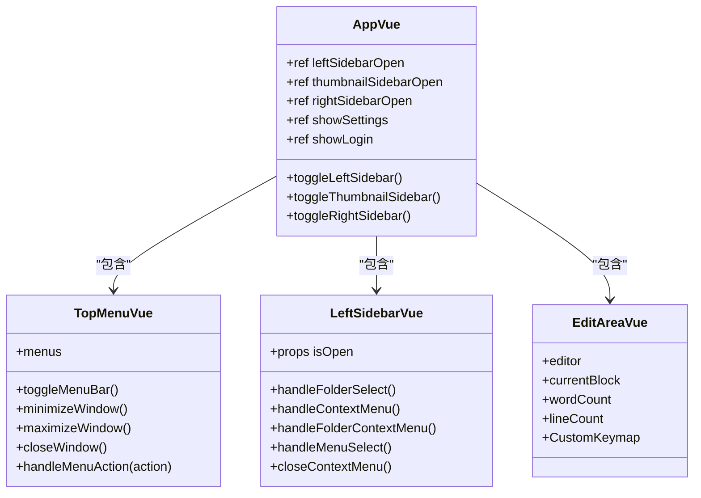
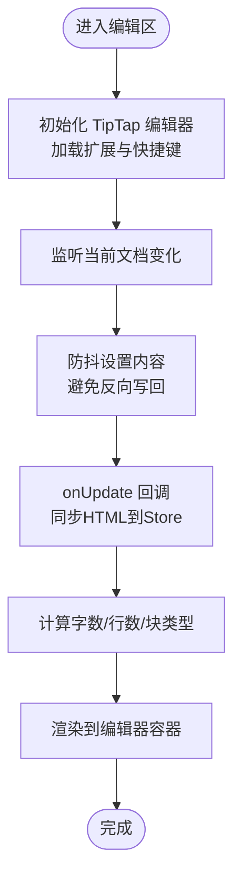
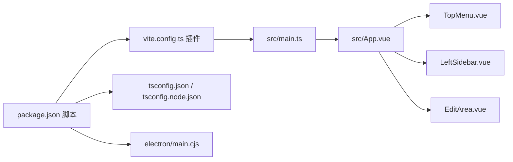

# 前端问题排查

<cite>
**本文引用的文件**
- [package.json](file://app/package.json)
- [vite.config.ts](file://app/vite.config.ts)
- [tsconfig.json](file://app/tsconfig.json)
- [tsconfig.node.json](file://app/tsconfig.node.json)
- [main.cjs](file://app/electron/main.cjs)
- [index.html](file://app/index.html)
- [main.ts](file://app/src/main.ts)
- [App.vue](file://app/src/App.vue)
- [TopMenu.vue](file://app/src/components/layout/TopMenu.vue)
- [LeftSidebar.vue](file://app/src/components/layout/LeftSidebar.vue)
- [EditArea.vue](file://app/src/components/layout/EditArea.vue)
- [theme.ts](file://app/src/stores/theme.ts)
- [README.md](file://README.md)
</cite>

## 目录
1. [简介](#简介)
2. [项目结构](#项目结构)
3. [核心组件](#核心组件)
4. [架构总览](#架构总览)
5. [详细组件分析](#详细组件分析)
6. [依赖关系分析](#依赖关系分析)
7. [性能考虑](#性能考虑)
8. [故障排除指南](#故障排除指南)
9. [结论](#结论)
10. [附录](#附录)

## 简介
本指南聚焦于Woo前端（Vue 3 + TypeScript + Vite + Electron）在开发与构建过程中常见的问题，覆盖以下主题：
- Vite构建失败与TypeScript编译错误
- Electron应用启动问题与热重载失效
- 浏览器控制台错误分析与Vue组件渲染异常
- Node.js版本兼容性与npm包安装失败
- 开发服务器启动失败（端口占用、代理与跨域）
- 性能问题排查（Bundle大小、内存泄漏、渲染性能）

本指南提供具体定位思路、错误代码示例路径与修复步骤，并结合项目实际配置进行说明。

## 项目结构
Woo前端位于 app/ 目录，采用Vue 3 + TypeScript + Vite + Electron的组合：
- 构建与运行通过Vite配置与脚本驱动
- Electron主进程负责窗口生命周期与开发/生产加载策略
- 应用入口与主题系统通过Pinia与Vue组件组织

**图表来源**
- [index.html](file://app/index.html)
- [main.ts](file://app/src/main.ts)
- [App.vue](file://app/src/App.vue)
- [vite.config.ts](file://app/vite.config.ts)
- [package.json](file://app/package.json)
- [tsconfig.json](file://app/tsconfig.json)
- [tsconfig.node.json](file://app/tsconfig.node.json)
- [main.cjs](file://app/electron/main.cjs)

**章节来源**
- [README.md](file://README.md)
- [package.json](file://app/package.json)
- [vite.config.ts](file://app/vite.config.ts)
- [tsconfig.json](file://app/tsconfig.json)
- [tsconfig.node.json](file://app/tsconfig.node.json)
- [index.html](file://app/index.html)
- [main.ts](file://app/src/main.ts)
- [main.cjs](file://app/electron/main.cjs)

## 核心组件
- 应用入口与挂载：在入口文件中创建Vue应用、注册Pinia并挂载根组件。
- 根组件：组织顶部菜单、左右侧栏、编辑区与设置/登录弹窗。
- 主题系统：基于Pinia持久化主题并在DOM上应用data-theme属性。
- 编辑器：使用TipTap实现富文本编辑，包含自定义快捷键与扩展。
- Electron主进程：根据NODE_ENV决定加载开发服务器或打包产物；提供窗口控制与外部链接打开。

**章节来源**
- [main.ts](file://app/src/main.ts)
- [App.vue](file://app/src/App.vue)
- [theme.ts](file://app/src/stores/theme.ts)
- [EditArea.vue](file://app/src/components/layout/EditArea.vue)
- [main.cjs](file://app/electron/main.cjs)

## 架构总览
下图展示从用户启动到页面渲染的关键流程，以及Electron在开发与生产阶段的差异。

**图表来源**
- [package.json](file://app/package.json)
- [vite.config.ts](file://app/vite.config.ts)
- [main.cjs](file://app/electron/main.cjs)

## 详细组件分析

### 组件类图（核心UI与状态）

**图表来源**
- [App.vue](file://app/src/App.vue)
- [TopMenu.vue](file://app/src/components/layout/TopMenu.vue)
- [LeftSidebar.vue](file://app/src/components/layout/LeftSidebar.vue)
- [EditArea.vue](file://app/src/components/layout/EditArea.vue)

**章节来源**
- [App.vue](file://app/src/App.vue)
- [TopMenu.vue](file://app/src/components/layout/TopMenu.vue)
- [LeftSidebar.vue](file://app/src/components/layout/LeftSidebar.vue)
- [EditArea.vue](file://app/src/components/layout/EditArea.vue)

### 编辑器工作流（TipTap）

**图表来源**
- [EditArea.vue](file://app/src/components/layout/EditArea.vue)

**章节来源**
- [EditArea.vue](file://app/src/components/layout/EditArea.vue)

## 依赖关系分析
- 构建与运行：npm脚本驱动Vite开发与构建；Electron通过插件集成主进程入口。
- 类型系统：双tsconfig分别面向浏览器与Vite Node侧配置。
- 组件通信：根组件通过事件与状态管理协调子组件；主题通过Pinia持久化。

**图表来源**
- [package.json](file://app/package.json)
- [vite.config.ts](file://app/vite.config.ts)
- [main.ts](file://app/src/main.ts)
- [App.vue](file://app/src/App.vue)
- [TopMenu.vue](file://app/src/components/layout/TopMenu.vue)
- [LeftSidebar.vue](file://app/src/components/layout/LeftSidebar.vue)
- [EditArea.vue](file://app/src/components/layout/EditArea.vue)
- [tsconfig.json](file://app/tsconfig.json)
- [tsconfig.node.json](file://app/tsconfig.node.json)
- [main.cjs](file://app/electron/main.cjs)

**章节来源**
- [package.json](file://app/package.json)
- [vite.config.ts](file://app/vite.config.ts)
- [tsconfig.json](file://app/tsconfig.json)
- [tsconfig.node.json](file://app/tsconfig.node.json)
- [main.cjs](file://app/electron/main.cjs)

## 性能考虑
- Bundle大小分析：使用Vite内置分析或第三方可视化工具检查依赖体积，识别大体积依赖与重复引入。
- 内存泄漏检测：在组件卸载钩子中确保移除事件监听与销毁编辑器实例；对全局事件监听进行统一管理。
- 渲染性能优化：减少不必要的响应式对象嵌套、避免在模板中执行复杂计算、拆分大型组件为更小粒度。

[本节为通用指导，无需特定文件引用]

## 故障排除指南

### 一、Vite构建失败
常见症状
- 构建命令执行中断，输出包含语法或类型错误
- 无法生成dist产物

排查步骤
1. 确认TypeScript配置正确
   - 参考路径：[tsconfig.json](file://app/tsconfig.json)、[tsconfig.node.json](file://app/tsconfig.node.json)
   - 关注moduleResolution、bundler模式与noEmit设置
2. 检查Vite配置
   - 参考路径：[vite.config.ts](file://app/vite.config.ts)
   - 确认插件顺序与入口路径一致
3. 清理缓存并重新安装依赖
   - 删除node_modules与lock文件后重装
4. 查看构建脚本
   - 参考路径：[package.json](file://app/package.json) scripts段落
   - 确保先执行类型检查再构建

修复要点
- 若出现“找不到模块”或“解析失败”，优先检查tsconfig.moduleResolution与bundler一致性
- 若出现“无法emit产物”，确认noEmit与构建目标配置匹配

**章节来源**
- [tsconfig.json](file://app/tsconfig.json)
- [tsconfig.node.json](file://app/tsconfig.node.json)
- [vite.config.ts](file://app/vite.config.ts)
- [package.json](file://app/package.json)

### 二、TypeScript编译错误
常见症状
- 编辑器提示或命令行报错，涉及类型不匹配或未解析的模块

排查步骤
1. 使用vue-tsc先行验证类型
   - 参考路径：[package.json](file://app/package.json) scripts
2. 检查严格模式相关选项
   - 参考路径：[tsconfig.json](file://app/tsconfig.json)，关注strict、noUnused等
3. 确认Vue文件与类型声明
   - 确保.vue文件被包含在tsconfig.include中
   - 对于非模块化资源，确认resolveJsonModule或允许TS扩展

修复要点
- 若出现“缺少声明文件”，为相关模块补充.d.ts或调整moduleResolution
- 若出现“未使用变量/参数”，按规则清理或调整noUnused策略

**章节来源**
- [package.json](file://app/package.json)
- [tsconfig.json](file://app/tsconfig.json)

### 三、Electron应用启动问题
常见症状
- Electron无法启动或白屏
- 开发环境下无法加载本地开发服务器

排查步骤
1. 确认主进程入口与Vite端口一致
   - 参考路径：[main.cjs](file://app/electron/main.cjs) 与 [vite.config.ts](file://app/vite.config.ts)
   - 开发模式下加载 http://localhost:5173，生产模式加载dist/index.html
2. 检查preload与webPreferences
   - 参考路径：[main.cjs](file://app/electron/main.cjs)
   - 确保contextIsolation与nodeIntegration配置符合预期
3. 校验入口HTML与入口脚本
   - 参考路径：[index.html](file://app/index.html)、[main.ts](file://app/src/main.ts)
   - 确保index.html中script指向/src/main.ts且id="app"存在
4. 校验package.json主字段
   - 参考路径：[package.json](file://app/package.json) main字段

修复要点
- 若加载失败，优先检查主进程日志与网络连通性
- 若窗口无内容，检查index.html与main.ts是否正确挂载

**章节来源**
- [main.cjs](file://app/electron/main.cjs)
- [vite.config.ts](file://app/vite.config.ts)
- [index.html](file://app/index.html)
- [main.ts](file://app/src/main.ts)
- [package.json](file://app/package.json)

### 四、Vue组件渲染异常
常见症状
- 组件不显示、事件不触发、主题不生效

排查步骤
1. 根组件与状态
   - 参考路径：[App.vue](file://app/src/App.vue)
   - 检查事件绑定与响应式状态是否正确更新
2. 主题系统
   - 参考路径：[theme.ts](file://app/src/stores/theme.ts)
   - 确认data-theme已写入<html>且localStorage持久化正常
3. 子组件通信
   - 参考路径：[TopMenu.vue](file://app/src/components/layout/TopMenu.vue)、[LeftSidebar.vue](file://app/src/components/layout/LeftSidebar.vue)
   - 检查事件发射与接收、props传递
4. 编辑器初始化
   - 参考路径：[EditArea.vue](file://app/src/components/layout/EditArea.vue)
   - 确认编辑器实例在卸载时销毁，避免内存泄漏

修复要点
- 若主题不生效，检查DOM属性与CSS变量是否正确应用
- 若事件无效，核对事件名大小写与参数传递

**章节来源**
- [App.vue](file://app/src/App.vue)
- [theme.ts](file://app/src/stores/theme.ts)
- [TopMenu.vue](file://app/src/components/layout/TopMenu.vue)
- [LeftSidebar.vue](file://app/src/components/layout/LeftSidebar.vue)
- [EditArea.vue](file://app/src/components/layout/EditArea.vue)

### 五、浏览器控制台错误分析
常见症状
- 控制台报错（模块解析、类型、运行时异常）

排查步骤
1. 从错误堆栈定位文件与行号，参考对应源文件路径
2. 检查模块导入路径是否正确
3. 检查类型断言与可选链使用是否合理
4. 若为运行时异常，结合组件生命周期与事件处理逻辑定位

修复要点
- 对于“找不到模块”的错误，优先检查tsconfig与bundler解析
- 对于“未捕获异常”，在组件卸载时清理事件监听

**章节来源**
- [tsconfig.json](file://app/tsconfig.json)
- [EditArea.vue](file://app/src/components/layout/EditArea.vue)

### 六、热重载功能失效
常见症状
- 修改代码后页面不刷新或HMR报错

排查步骤
1. 确认开发服务器端口未被占用
   - 参考路径：[vite.config.ts](file://app/vite.config.ts) server.port
2. 检查网络连通性与代理设置
3. 清理浏览器缓存或尝试隐身模式
4. 检查Vite插件与配置是否冲突

修复要点
- 若端口冲突，修改vite.config.ts中的port或释放占用端口
- 若代理导致跨域，检查代理配置与CORS头

**章节来源**
- [vite.config.ts](file://app/vite.config.ts)

### 七、Node.js版本兼容性问题
常见症状
- 安装依赖时报错或运行时报“不支持的特性”

排查步骤
1. 查阅依赖的最低Node版本要求
2. 使用版本管理工具（如nvm）切换至推荐版本
3. 清理缓存后重装依赖

修复要点
- 若出现“语法不支持”，优先升级Node版本
- 若出现“平台不匹配”，检查预编译二进制的Node ABI

**章节来源**
- [package.json](file://app/package.json)

### 八、npm包安装失败
常见症状
- npm install报错（权限、网络、缓存）

排查步骤
1. 清理npm缓存与临时文件
2. 更换镜像源或使用yarn/pnpm
3. 检查package-lock.json与node_modules冲突
4. 以管理员权限运行或修正权限

修复要点
- 若网络超时，更换镜像源或使用代理
- 若权限不足，修正目录权限或使用非root用户

**章节来源**
- [package.json](file://app/package.json)

### 九、开发服务器启动失败（端口占用/代理/CORS）
常见症状
- 启动失败或页面无法访问

排查步骤
1. 端口占用
   - 参考路径：[vite.config.ts](file://app/vite.config.ts) server.port
   - 释放5173或修改端口
2. 代理与跨域
   - 如需代理后端API，配置vite.server.proxy
   - 确保后端返回正确的CORS头
3. Electron加载策略
   - 参考路径：[main.cjs](file://app/electron/main.cjs)
   - 开发模式加载本地地址，生产模式加载dist

修复要点
- 端口冲突优先改端口或释放占用
- 代理与CORS需前后端协同配置

**章节来源**
- [vite.config.ts](file://app/vite.config.ts)
- [main.cjs](file://app/electron/main.cjs)

### 十、性能问题排查（Bundle大小/内存泄漏/渲染性能）
- Bundle大小
  - 使用分析工具查看vendor与业务代码占比，识别重复依赖与大体积库
- 内存泄漏
  - 在组件卸载钩子中移除事件监听与销毁编辑器实例
  - 参考路径：[EditArea.vue](file://app/src/components/layout/EditArea.vue)
- 渲染性能
  - 减少深层响应式嵌套、避免在模板中做复杂计算、拆分大组件

**章节来源**
- [EditArea.vue](file://app/src/components/layout/EditArea.vue)

## 结论
本指南围绕Woo前端的构建、运行与调试提供了系统化的排查路径。建议在遇到问题时按“配置—依赖—运行—渲染—性能”的顺序逐层定位，并结合项目实际配置文件进行核对与修复。对于Electron与Vite的联动场景，重点检查主进程加载策略与开发服务器端口一致性。

[本节为总结性内容，无需特定文件引用]

## 附录
- 快速检查清单
  - 构建：先类型检查，再构建
  - Electron：确认main字段、preload配置与加载地址
  - Vite：确认端口、插件与入口
  - TypeScript：确认moduleResolution与include范围
  - 性能：分析bundle、清理内存、优化渲染

[本节为通用指导，无需特定文件引用]