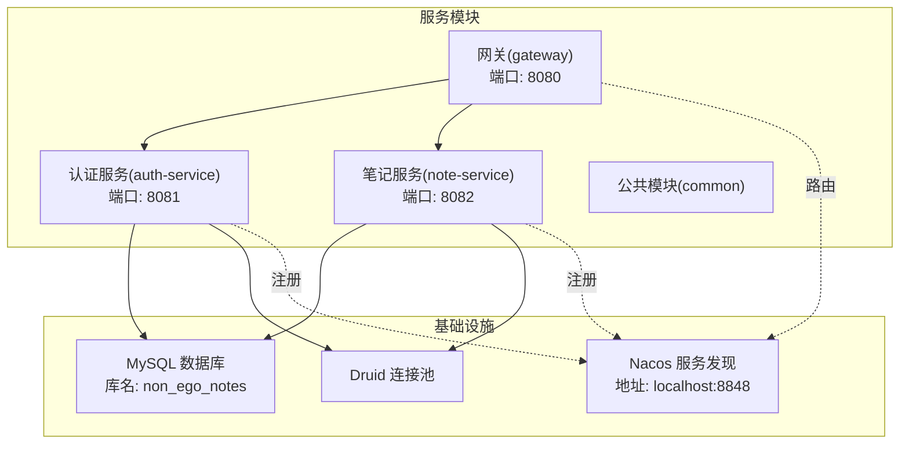
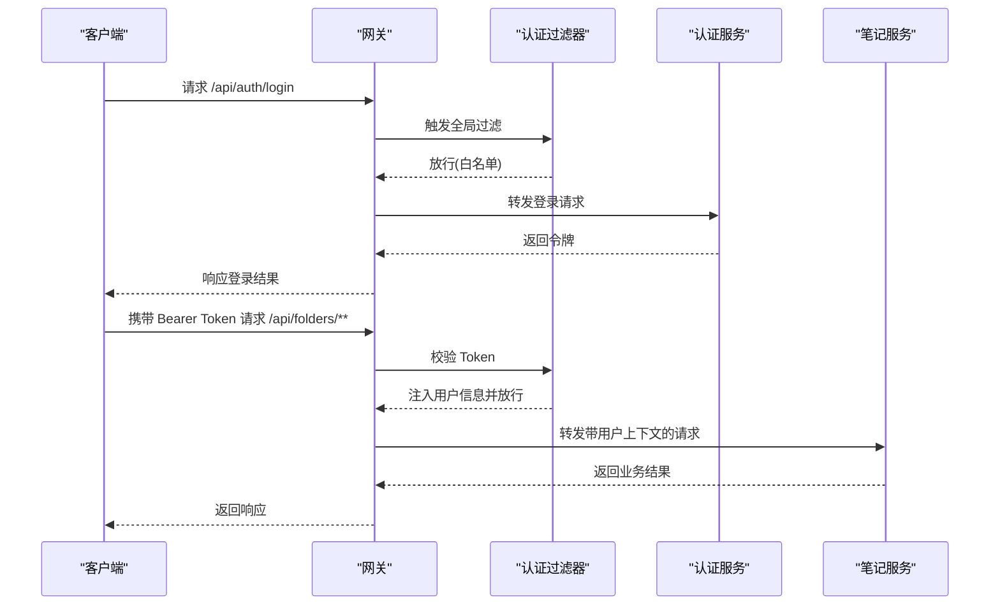
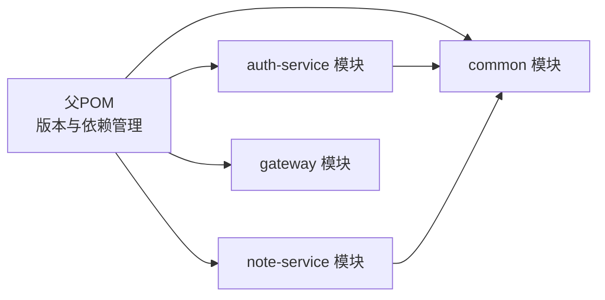

# 后端服务排查

<cite>
**本文引用的文件**
- [services/pom.xml](file://services/pom.xml)
- [auth-service/pom.xml](file://services/auth-service/pom.xml)
- [note-service/pom.xml](file://services/note-service/pom.xml)
- [gateway/pom.xml](file://services/gateway/pom.xml)
- [common/pom.xml](file://services/common/pom.xml)
- [auth-service/application.yml](file://services/auth-service/src/main/resources/application.yml)
- [note-service/application.yml](file://services/note-service/src/main/resources/application.yml)
- [gateway/application.yml](file://services/gateway/src/main/resources/application.yml)
- [AuthServiceApplication.java](file://services/auth-service/src/main/java/com/nonegonotes/auth/AuthServiceApplication.java)
- [NoteServiceApplication.java](file://services/note-service/src/main/java/com/nonegonotes/note/NoteServiceApplication.java)
- [GatewayApplication.java](file://services/gateway/src/main/java/com/nonegonotes/gateway/GatewayApplication.java)
- [AuthController.java](file://services/auth-service/src/main/java/com/nonegonotes/auth/controller/AuthController.java)
- [AuthFilter.java](file://services/gateway/src/main/java/com/nonegonotes/gateway/filter/AuthFilter.java)
- [JwtUtil.java](file://services/common/src/main/java/com/nonegonotes/common/util/JwtUtil.java)
- [GlobalExceptionHandler.java](file://services/common/src/main/java/com/nonegonotes/common/exception/GlobalExceptionHandler.java)
</cite>

## 目录
1. [简介](#简介)
2. [项目结构](#项目结构)
3. [核心组件](#核心组件)
4. [架构总览](#架构总览)
5. [详细组件分析](#详细组件分析)
6. [依赖分析](#依赖分析)
7. [性能考虑](#性能考虑)
8. [故障排除指南](#故障排除指南)
9. [结论](#结论)
10. [附录](#附录)

## 简介
本指南面向Woo项目的后端微服务，聚焦于以下典型问题的诊断与解决：Spring Boot应用启动失败、服务注册异常、API响应超时；Maven构建错误、依赖注入失败、配置文件解析错误；数据库连接池配置问题、事务处理异常、MyBatis Plus映射错误；JWT认证失败、权限验证异常、安全配置问题；微服务间通信故障、负载均衡配置、熔断器触发；以及日志分析技巧、性能监控指标与数据库查询优化建议。

## 项目结构
后端采用多模块Maven聚合工程，包含公共模块与三个微服务：
- 公共模块：共享实体、工具、全局异常处理与通用配置
- 认证服务：用户认证与授权，提供登录/注册接口
- 笔记服务：文件夹与文档元数据管理
- 网关：基于Spring Cloud Gateway的统一入口，集成JWT校验与路由

图表来源
- [services/pom.xml:15-20](file://services/pom.xml#L15-L20)
- [auth-service/application.yml:13-16](file://services/auth-service/src/main/resources/application.yml#L13-L16)
- [note-service/application.yml:13-16](file://services/note-service/src/main/resources/application.yml#L13-L16)
- [gateway/application.yml:12-22](file://services/gateway/src/main/resources/application.yml#L12-L22)

章节来源
- [services/pom.xml:15-20](file://services/pom.xml#L15-L20)
- [auth-service/application.yml:1-40](file://services/auth-service/src/main/resources/application.yml#L1-L40)
- [note-service/application.yml:1-35](file://services/note-service/src/main/resources/application.yml#L1-L35)
- [gateway/application.yml:1-27](file://services/gateway/src/main/resources/application.yml#L1-L27)

## 核心组件
- 应用入口与发现
  - 认证服务、笔记服务、网关均通过注解启用服务发现，并作为Spring Boot应用启动
- 配置中心与服务发现
  - 所有服务均配置Nacos服务发现地址，确保服务可被注册与发现
- 数据访问与连接池
  - 使用Druid连接池，MyBatis Plus配置逻辑删除字段与下划线转驼峰
- 安全与认证
  - 网关内置JWT校验过滤器，白名单放行登录/注册；公共模块提供JWT工具类
- 统一异常处理
  - 全局异常处理器捕获业务异常与未预期异常，返回标准化结果

章节来源
- [AuthServiceApplication.java:7-9](file://services/auth-service/src/main/java/com/nonegonotes/auth/AuthServiceApplication.java#L7-L9)
- [NoteServiceApplication.java:7-9](file://services/note-service/src/main/java/com/nonegonotes/note/NoteServiceApplication.java#L7-L9)
- [GatewayApplication.java:7-9](file://services/gateway/src/main/java/com/nonegonotes/gateway/GatewayApplication.java#L7-L9)
- [auth-service/application.yml:13-16](file://services/auth-service/src/main/resources/application.yml#L13-L16)
- [note-service/application.yml:13-16](file://services/note-service/src/main/resources/application.yml#L13-L16)
- [auth-service/application.yml:18-28](file://services/auth-service/src/main/resources/application.yml#L18-L28)
- [note-service/application.yml:18-28](file://services/note-service/src/main/resources/application.yml#L18-L28)
- [JwtUtil.java:15-56](file://services/common/src/main/java/com/nonegonotes/common/util/JwtUtil.java#L15-L56)
- [GlobalExceptionHandler.java:11-26](file://services/common/src/main/java/com/nonegonotes/common/exception/GlobalExceptionHandler.java#L11-L26)

## 架构总览
微服务通过网关统一接入，网关负责鉴权与路由，认证服务与笔记服务分别提供业务能力并通过Nacos完成服务治理。

图表来源
- [gateway/application.yml:12-22](file://services/gateway/src/main/resources/application.yml#L12-L22)
- [AuthFilter.java:34-37](file://services/gateway/src/main/java/com/nonegonotes/gateway/filter/AuthFilter.java#L34-L37)
- [AuthFilter.java:50-58](file://services/gateway/src/main/java/com/nonegonotes/gateway/filter/AuthFilter.java#L50-L58)
- [AuthFilter.java:68-77](file://services/gateway/src/main/java/com/nonegonotes/gateway/filter/AuthFilter.java#L68-L77)
- [AuthController.java:19-29](file://services/auth-service/src/main/java/com/nonegonotes/auth/controller/AuthController.java#L19-L29)

## 详细组件分析

### 认证服务（auth-service）
- 功能要点
  - 提供注册与登录接口，返回标准化结果
  - 依赖数据库与Druid连接池，启用MyBatis Plus逻辑删除
- 关键配置
  - 数据源URL、用户名、密码与Druid类型
  - Nacos服务发现地址
  - MyBatis Plus映射路径、下划线转驼峰、逻辑删除字段
  - JWT密钥与过期时间
  - Knife4j文档开关与语言

章节来源
- [auth-service/application.yml:1-40](file://services/auth-service/src/main/resources/application.yml#L1-L40)
- [AuthController.java:19-29](file://services/auth-service/src/main/java/com/nonegonotes/auth/controller/AuthController.java#L19-L29)

### 笔记服务（note-service）
- 功能要点
  - 文件夹与文档相关接口
  - 与认证服务一致的数据源与MyBatis Plus配置
- 关键配置
  - 数据源与Nacos服务发现
  - MyBatis Plus映射路径与逻辑删除配置
  - Knife4j文档开关与语言

章节来源
- [note-service/application.yml:1-35](file://services/note-service/src/main/resources/application.yml#L1-L35)

### 网关（gateway）
- 功能要点
  - 路由规则：/api/auth/** → 认证服务；/api/folders/**,/api/documents/** → 笔记服务
  - 全局JWT认证过滤器：校验Token并将用户信息注入请求头
- 关键配置
  - 端口、Nacos服务发现
  - 路由规则与负载均衡URI
  - JWT密钥

章节来源
- [gateway/application.yml:1-27](file://services/gateway/src/main/resources/application.yml#L1-L27)
- [AuthFilter.java:34-37](file://services/gateway/src/main/java/com/nonegonotes/gateway/filter/AuthFilter.java#L34-L37)
- [AuthFilter.java:50-58](file://services/gateway/src/main/java/com/nonegonotes/gateway/filter/AuthFilter.java#L50-L58)
- [AuthFilter.java:68-77](file://services/gateway/src/main/java/com/nonegonotes/gateway/filter/AuthFilter.java#L68-L77)

### 公共模块（common）
- 功能要点
  - 全局异常处理：区分业务异常与未预期异常，返回统一格式
  - JWT工具类：生成、解析与校验Token
- 关键点
  - 异常处理器在全局生效，保证各服务一致性
  - JWT工具类提供静态方法，便于跨模块使用

章节来源
- [GlobalExceptionHandler.java:11-26](file://services/common/src/main/java/com/nonegonotes/common/exception/GlobalExceptionHandler.java#L11-L26)
- [JwtUtil.java:15-56](file://services/common/src/main/java/com/nonegonotes/common/util/JwtUtil.java#L15-L56)

## 依赖分析
- 版本与依赖管理
  - 父POM集中管理Spring Boot、Spring Cloud、MyBatis Plus、JWT、MySQL、Druid、Knife4j、Hutool等版本
  - 子模块按需引入starter与运行时依赖
- 模块间依赖
  - 认证服务、笔记服务依赖公共模块
  - 网关依赖Spring Cloud Gateway、LoadBalancer与JWT
- Maven构建
  - 统一使用Spring Boot Maven插件进行打包

图表来源
- [services/pom.xml:41-120](file://services/pom.xml#L41-L120)
- [auth-service/pom.xml:20-24](file://services/auth-service/pom.xml#L20-L24)
- [note-service/pom.xml:20-24](file://services/note-service/pom.xml#L20-L24)
- [gateway/pom.xml:19-31](file://services/gateway/pom.xml#L19-L31)

章节来源
- [services/pom.xml:22-39](file://services/pom.xml#L22-L39)
- [auth-service/pom.xml:19-98](file://services/auth-service/pom.xml#L19-L98)
- [note-service/pom.xml:19-82](file://services/note-service/pom.xml#L19-L82)
- [gateway/pom.xml:19-60](file://services/gateway/pom.xml#L19-L60)
- [common/pom.xml:19-57](file://services/common/pom.xml#L19-L57)

## 性能考虑
- 数据库层
  - 合理设置Druid连接池参数（初始大小、最小/最大空闲、最大等待时间），避免连接泄漏与超时
  - 开启SQL日志定位慢查询，结合索引优化与分页策略
- 缓存与异步
  - 对热点数据引入缓存（如Redis），减少数据库压力
  - 对非关键链路采用异步处理
- 网关与负载均衡
  - 合理配置路由与重试策略，避免单点过载
  - 监控上游服务健康状态，及时隔离故障节点
- 监控指标
  - 关键指标：请求延迟、错误率、连接池使用率、数据库QPS/TPS、GC频率
  - 建议使用Prometheus+Grafana或APM工具采集与可视化

## 故障排除指南

### 一、Spring Boot应用启动失败
- 症状
  - 应用无法启动或启动后立即退出
- 排查步骤
  - 确认JDK版本与Maven属性匹配（父POM要求Java 17）
  - 检查端口占用（默认端口见各服务application.yml）
  - 校验数据库连通性与凭证
  - 确认Nacos服务可用且地址正确
  - 查看控制台输出与日志，定位具体异常
- 常见原因
  - 端口冲突、数据库不可达、Nacos不可用、配置文件语法错误
- 处理建议
  - 修改端口或释放冲突端口
  - 使用数据库客户端验证连接
  - 检查Nacos服务状态与网络连通
  - 使用Knife4j在线文档验证接口可用性

章节来源
- [auth-service/application.yml:1-2](file://services/auth-service/src/main/resources/application.yml#L1-L2)
- [note-service/application.yml:1-2](file://services/note-service/src/main/resources/application.yml#L1-L2)
- [gateway/application.yml:1-2](file://services/gateway/src/main/resources/application.yml#L1-L2)
- [auth-service/application.yml:13-16](file://services/auth-service/src/main/resources/application.yml#L13-L16)
- [note-service/application.yml:13-16](file://services/note-service/src/main/resources/application.yml#L13-L16)
- [gateway/application.yml:8-10](file://services/gateway/src/main/resources/application.yml#L8-L10)

### 二、服务注册异常（Nacos）
- 症状
  - 服务启动成功但未出现在Nacos控制台
- 排查步骤
  - 检查nacos.discovery.server-addr是否正确
  - 确认服务名称与端口配置无误
  - 查看服务实例健康状态
- 处理建议
  - 修复Nacos地址或网络配置
  - 确保服务端口未被占用
  - 检查防火墙与安全组策略

章节来源
- [auth-service/application.yml:13-16](file://services/auth-service/src/main/resources/application.yml#L13-L16)
- [note-service/application.yml:13-16](file://services/note-service/src/main/resources/application.yml#L13-L16)
- [gateway/application.yml:8-10](file://services/gateway/src/main/resources/application.yml#L8-L10)

### 三、API响应超时
- 症状
  - 请求长时间无响应或超时
- 排查步骤
  - 检查网关路由与负载均衡是否正确转发
  - 校验下游服务是否正常注册与健康
  - 分析数据库慢查询与连接池瓶颈
- 处理建议
  - 优化路由规则与重试策略
  - 增加数据库索引与分页
  - 调整连接池参数与超时阈值

章节来源
- [gateway/application.yml:12-22](file://services/gateway/src/main/resources/application.yml#L12-L22)

### 四、Maven构建错误
- 症状
  - mvn clean install 失败
- 排查步骤
  - 确认本地仓库与镜像配置
  - 清理并重新下载依赖
  - 检查子模块依赖声明是否完整
- 处理建议
  - 更新依赖至父POM管理版本
  - 检查网络代理与防火墙

章节来源
- [services/pom.xml:41-120](file://services/pom.xml#L41-L120)
- [auth-service/pom.xml:19-98](file://services/auth-service/pom.xml#L19-L98)
- [note-service/pom.xml:19-82](file://services/note-service/pom.xml#L19-L82)
- [gateway/pom.xml:19-60](file://services/gateway/pom.xml#L19-L60)
- [common/pom.xml:19-57](file://services/common/pom.xml#L19-L57)

### 五、依赖注入失败
- 症状
  - 启动时报错提示无法注入Bean
- 排查步骤
  - 确认@Component、@Service、@Repository等注解正确
  - 检查包扫描路径与@SpringBootApplication位置
- 处理建议
  - 在入口类所在包或其父包内放置组件
  - 明确构造器注入或字段注入的一致性

章节来源
- [AuthServiceApplication.java:7-9](file://services/auth-service/src/main/java/com/nonegonotes/auth/AuthServiceApplication.java#L7-L9)
- [NoteServiceApplication.java:7-9](file://services/note-service/src/main/java/com/nonegonotes/note/NoteServiceApplication.java#L7-L9)
- [GatewayApplication.java:7-9](file://services/gateway/src/main/java/com/nonegonotes/gateway/GatewayApplication.java#L7-L9)

### 六、配置文件解析错误
- 症状
  - 启动报错提示YAML语法或字段不存在
- 排查步骤
  - 使用在线YAML校验工具检查缩进与格式
  - 确认字段拼写与层级关系
- 处理建议
  - 参考示例配置逐项比对
  - 使用IDE的YAML插件辅助校验

章节来源
- [auth-service/application.yml:1-40](file://services/auth-service/src/main/resources/application.yml#L1-L40)
- [note-service/application.yml:1-35](file://services/note-service/src/main/resources/application.yml#L1-L35)
- [gateway/application.yml:1-27](file://services/gateway/src/main/resources/application.yml#L1-L27)

### 七、数据库连接池配置问题
- 症状
  - 连接池耗尽、获取连接超时、频繁创建/销毁连接
- 排查步骤
  - 检查Druid连接池参数（初始大小、最小/最大空闲、最大等待时间）
  - 查看连接池监控页面（可通过Druid StatViewServlet）
- 处理建议
  - 根据QPS调优连接池参数
  - 优化SQL与索引，降低锁竞争

章节来源
- [auth-service/application.yml:7-12](file://services/auth-service/src/main/resources/application.yml#L7-L12)
- [note-service/application.yml:7-12](file://services/note-service/src/main/resources/application.yml#L7-L12)

### 八、事务处理异常
- 症状
  - 事务未生效、回滚不正确、并发场景下数据不一致
- 排查步骤
  - 确认事务注解位置与传播行为
  - 检查异常被捕获导致未抛出
- 处理建议
  - 使用合适的事务注解与异常策略
  - 对外抛出受检异常或业务异常

章节来源
- [GlobalExceptionHandler.java:15-19](file://services/common/src/main/java/com/nonegonotes/common/exception/GlobalExceptionHandler.java#L15-L19)

### 九、MyBatis Plus映射错误
- 症状
  - SQL执行失败、字段映射异常、逻辑删除无效
- 排查步骤
  - 检查mapper.xml路径与命名空间
  - 确认实体字段与数据库列名映射关系
  - 校验逻辑删除字段配置
- 处理建议
  - 使用下划线转驼峰配置保持一致性
  - 为复杂SQL开启日志定位问题

章节来源
- [auth-service/application.yml:18-28](file://services/auth-service/src/main/resources/application.yml#L18-L28)
- [note-service/application.yml:18-28](file://services/note-service/src/main/resources/application.yml#L18-L28)

### 十、JWT认证失败
- 症状
  - 网关返回401，下游服务接收不到用户上下文
- 排查步骤
  - 校验Authorization头格式（Bearer Token）
  - 确认JWT密钥与签名算法一致
  - 检查Token是否过期
- 处理建议
  - 使用公共JWT工具类验证签名
  - 在网关过滤器中记录Token解析日志

章节来源
- [AuthFilter.java:50-58](file://services/gateway/src/main/java/com/nonegonotes/gateway/filter/AuthFilter.java#L50-L58)
- [AuthFilter.java:68-77](file://services/gateway/src/main/java/com/nonegonotes/gateway/filter/AuthFilter.java#L68-L77)
- [JwtUtil.java:36-43](file://services/common/src/main/java/com/nonegonotes/common/util/JwtUtil.java#L36-L43)

### 十一、权限验证异常
- 症状
  - 用户越权访问或权限不足
- 排查步骤
  - 确认网关注入的用户信息（X-User-Id、X-Username）是否正确
  - 检查下游服务的权限控制逻辑
- 处理建议
  - 在下游服务中严格校验请求头中的用户上下文
  - 对敏感操作增加细粒度权限校验

章节来源
- [AuthFilter.java:68-77](file://services/gateway/src/main/java/com/nonegonotes/gateway/filter/AuthFilter.java#L68-L77)

### 十二、安全配置问题
- 症状
  - CORS跨域失败、明文传输、弱密钥
- 排查步骤
  - 确认CORS配置与白名单域名
  - 检查HTTPS与强密钥
- 处理建议
  - 在网关或服务端统一配置CORS
  - 使用足够长度的随机密钥并定期轮换

章节来源
- [gateway/application.yml:1-27](file://services/gateway/src/main/resources/application.yml#L1-L27)

### 十三、微服务间通信故障
- 症状
  - 路由失败、负载均衡异常、熔断器触发
- 排查步骤
  - 检查路由规则与lb://服务名
  - 确认服务实例健康与权重
  - 查看熔断器状态与降级策略
- 处理建议
  - 修复路由配置与服务名
  - 调整重试与超时策略
  - 设置合理的熔断阈值与恢复时间

章节来源
- [gateway/application.yml:12-22](file://services/gateway/src/main/resources/application.yml#L12-L22)

### 十四、日志分析技巧
- 关键点
  - 使用统一的日志框架与级别
  - 记录请求ID、用户上下文与关键参数
  - 结合异常处理器输出结构化错误
- 建议
  - 为网关过滤器与业务方法添加必要的日志
  - 使用日志聚合平台集中检索与告警

章节来源
- [GlobalExceptionHandler.java:17-24](file://services/common/src/main/java/com/nonegonotes/common/exception/GlobalExceptionHandler.java#L17-L24)
- [AuthFilter.java:79-83](file://services/gateway/src/main/java/com/nonegonotes/gateway/filter/AuthFilter.java#L79-L83)

### 十五、性能监控指标
- 建议指标
  - QPS、P95/P99延迟、错误率、连接池活跃数、数据库慢查询数
- 建议工具
  - Prometheus+Grafana或APM平台
- 建议实践
  - 为每个服务暴露健康与指标端点
  - 针对慢查询建立告警阈值

## 结论
本指南从架构、配置、依赖与常见问题入手，提供了系统化的排查思路与处理建议。建议在生产环境实施统一的配置管理、完善的监控告警与安全加固策略，持续优化数据库与网关性能，确保微服务稳定运行。

## 附录
- 快速核对清单
  - JDK版本与Maven属性匹配
  - 端口未被占用
  - 数据库连通与凭证正确
  - Nacos服务可用且地址正确
  - YAML格式与字段拼写正确
  - Druid连接池参数合理
  - JWT密钥一致且强度足够
  - 路由规则与lb://服务名正确
  - 全局异常处理生效
  - 日志与指标监控到位