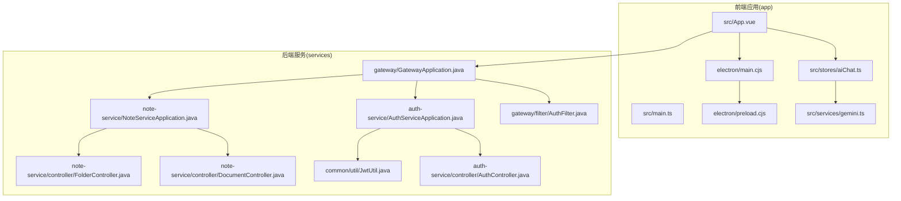
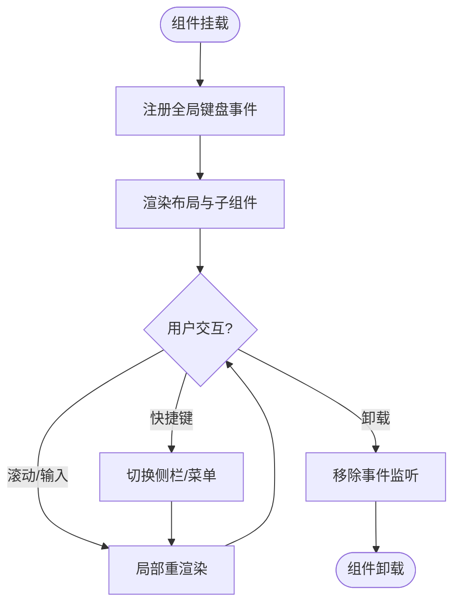
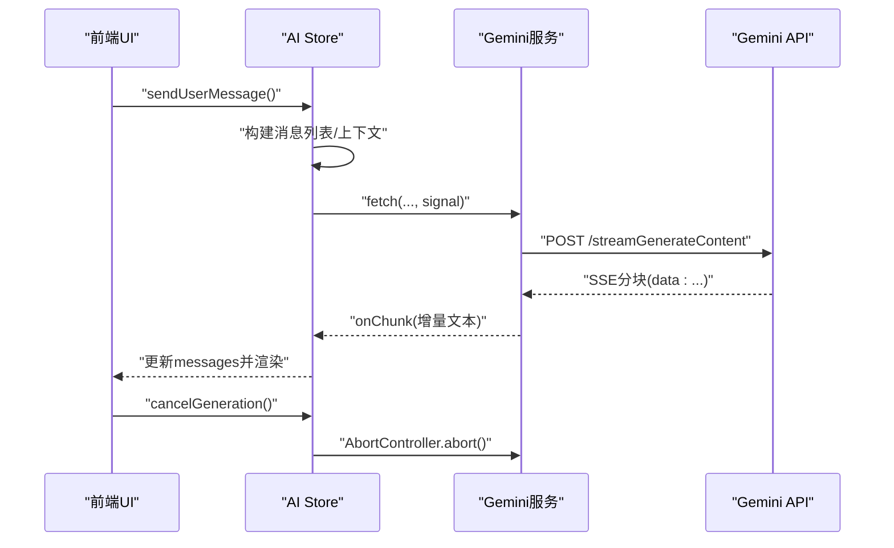
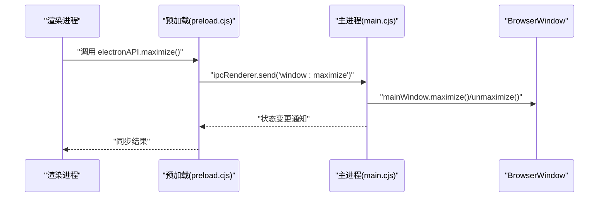
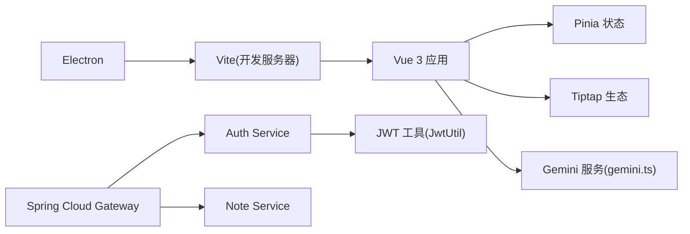

# 性能问题排查

<cite>
**本文引用的文件**
- [app/package.json](file://app/package.json)
- [app/vite.config.ts](file://app/vite.config.ts)
- [app/src/main.ts](file://app/src/main.ts)
- [app/electron/main.cjs](file://app/electron/main.cjs)
- [app/electron/preload.cjs](file://app/electron/preload.cjs)
- [app/src/App.vue](file://app/src/App.vue)
- [app/src/stores/aiChat.ts](file://app/src/stores/aiChat.ts)
- [app/src/services/gemini.ts](file://app/src/services/gemini.ts)
- [services/note-service/src/main/java/com/nonegonotes/note/NoteServiceApplication.java](file://services/note-service/src/main/java/com/nonegonotes/note/NoteServiceApplication.java)
- [services/note-service/src/main/java/com/nonegonotes/note/controller/DocumentController.java](file://services/note-service/src/main/java/com/nonegonotes/note/controller/DocumentController.java)
- [services/note-service/src/main/java/com/nonegonotes/note/controller/FolderController.java](file://services/note-service/src/main/java/com/nonegonotes/note/controller/FolderController.java)
- [services/auth-service/src/main/java/com/nonegonotes/auth/AuthServiceApplication.java](file://services/auth-service/src/main/java/com/nonegonotes/auth/AuthServiceApplication.java)
- [services/auth-service/src/main/java/com/nonegonotes/auth/controller/AuthController.java](file://services/auth-service/src/main/java/com/nonegonotes/auth/controller/AuthController.java)
- [services/gateway/src/main/java/com/nonegonotes/gateway/GatewayApplication.java](file://services/gateway/src/main/java/com/nonegonotes/gateway/GatewayApplication.java)
- [services/gateway/src/main/java/com/nonegonotes/gateway/filter/AuthFilter.java](file://services/gateway/src/main/java/com/nonegonotes/gateway/filter/AuthFilter.java)
- [services/common/src/main/java/com/nonegonotes/common/util/JwtUtil.java](file://services/common/src/main/java/com/nonegonotes/common/util/JwtUtil.java)
</cite>

## 目录
1. [简介](#简介)
2. [项目结构](#项目结构)
3. [核心组件](#核心组件)
4. [架构总览](#架构总览)
5. [详细组件分析](#详细组件分析)
6. [依赖分析](#依赖分析)
7. [性能考虑](#性能考虑)
8. [故障排除指南](#故障排除指南)
9. [结论](#结论)
10. [附录](#附录)

## 简介
本指南面向Woo项目的性能问题排查与优化，覆盖前端应用卡顿与内存泄漏、渲染性能、Electron应用响应慢、API调用超时以及数据库查询瓶颈等场景。文档提供基于仓库现有实现的定位方法、工具使用建议、优化策略与测试实施要点，并通过可视化图表帮助快速理解关键流程。

## 项目结构
Woo采用前后端分离架构：
- 前端为Vue 3 + Vite + Electron应用，位于 app/ 目录，负责UI渲染、状态管理、AI对话流式处理与窗口控制。
- 后端为多模块微服务，位于 services/ 目录，包含网关、鉴权、笔记服务与公共模块；网关负责统一鉴权与路由转发。



**图表来源**
- [app/src/main.ts:1-8](file://app/src/main.ts#L1-L8)
- [app/src/App.vue:1-131](file://app/src/App.vue#L1-L131)
- [app/src/stores/aiChat.ts:1-199](file://app/src/stores/aiChat.ts#L1-L199)
- [app/src/services/gemini.ts:1-103](file://app/src/services/gemini.ts#L1-L103)
- [app/electron/main.cjs:1-71](file://app/electron/main.cjs#L1-L71)
- [app/electron/preload.cjs:1-18](file://app/electron/preload.cjs#L1-L18)
- [services/gateway/src/main/java/com/nonegonotes/gateway/GatewayApplication.java:1-15](file://services/gateway/src/main/java/com/nonegonotes/gateway/GatewayApplication.java#L1-L15)
- [services/gateway/src/main/java/com/nonegonotes/gateway/filter/AuthFilter.java:1-91](file://services/gateway/src/main/java/com/nonegonotes/gateway/filter/AuthFilter.java#L1-L91)
- [services/auth-service/src/main/java/com/nonegonotes/auth/AuthServiceApplication.java:1-15](file://services/auth-service/src/main/java/com/nonegonotes/auth/AuthServiceApplication.java#L1-L15)
- [services/auth-service/src/main/java/com/nonegonotes/auth/controller/AuthController.java:1-31](file://services/auth-service/src/main/java/com/nonegonotes/auth/controller/AuthController.java#L1-L31)
- [services/note-service/src/main/java/com/nonegonotes/note/NoteServiceApplication.java:1-15](file://services/note-service/src/main/java/com/nonegonotes/note/NoteServiceApplication.java#L1-L15)
- [services/note-service/src/main/java/com/nonegonotes/note/controller/DocumentController.java:1-49](file://services/note-service/src/main/java/com/nonegonotes/note/controller/DocumentController.java#L1-L49)
- [services/note-service/src/main/java/com/nonegonotes/note/controller/FolderController.java:1-48](file://services/note-service/src/main/java/com/nonegonotes/note/controller/FolderController.java#L1-L48)
- [services/common/src/main/java/com/nonegonotes/common/util/JwtUtil.java:1-57](file://services/common/src/main/java/com/nonegonotes/common/util/JwtUtil.java#L1-L57)

**章节来源**
- [app/package.json:1-38](file://app/package.json#L1-L38)
- [app/vite.config.ts:1-19](file://app/vite.config.ts#L1-L19)
- [app/src/main.ts:1-8](file://app/src/main.ts#L1-L8)
- [app/electron/main.cjs:1-71](file://app/electron/main.cjs#L1-L71)

## 核心组件
- 前端应用入口与状态管理：应用在入口处初始化Vue与Pinia，根组件负责布局与快捷键绑定，卸载时清理事件监听，避免内存泄漏。
- AI聊天与流式响应：AI Store负责消息队列、模型选择、流式回调与中断控制；服务层封装Gemini流式接口，按SSE分块解析并回推增量文本。
- Electron窗口与IPC：主进程创建窗口、加载开发或生产页面、注册窗口控制与外部链接打开；预加载脚本暴露安全的Electron API给渲染进程。
- 网关与鉴权：网关全局过滤器校验JWT，将用户标识注入下游请求头；鉴权服务提供登录/注册接口；公共模块提供JWT工具。

**章节来源**
- [app/src/main.ts:1-8](file://app/src/main.ts#L1-L8)
- [app/src/App.vue:37-115](file://app/src/App.vue#L37-L115)
- [app/src/stores/aiChat.ts:1-199](file://app/src/stores/aiChat.ts#L1-L199)
- [app/src/services/gemini.ts:1-103](file://app/src/services/gemini.ts#L1-L103)
- [app/electron/main.cjs:1-71](file://app/electron/main.cjs#L1-L71)
- [app/electron/preload.cjs:1-18](file://app/electron/preload.cjs#L1-L18)
- [services/gateway/src/main/java/com/nonegonotes/gateway/filter/AuthFilter.java:1-91](file://services/gateway/src/main/java/com/nonegonotes/gateway/filter/AuthFilter.java#L1-L91)
- [services/auth-service/src/main/java/com/nonegonotes/auth/controller/AuthController.java:1-31](file://services/auth-service/src/main/java/com/nonegonotes/auth/controller/AuthController.java#L1-L31)
- [services/common/src/main/java/com/nonegonotes/common/util/JwtUtil.java:1-57](file://services/common/src/main/java/com/nonegonotes/common/util/JwtUtil.java#L1-L57)

## 架构总览
下图展示从前端到后端的关键交互链路，包括窗口控制、AI流式对话与鉴权网关。

```mermaid
sequenceDiagram
participant UI as "前端UI(App.vue)"
participant Store as "AI Store(aiChat.ts)"
participant Service as "AI服务(gemini.ts)"
participant GW as "网关(AuthFilter)"
participant Auth as "鉴权服务(AuthController)"
participant Note as "笔记服务(Document/Folder 控制器)"
UI->>Store : "发送用户消息"
Store->>Service : "发起流式请求"
Service->>Service : "解析SSE分块"
Service-->>Store : "增量文本回调"
Store-->>UI : "实时渲染"
UI->>GW : "HTTP请求(带Authorization)"
GW->>GW : "校验JWT并注入X-User-Id"
GW-->>Auth : "转发到鉴权服务"
GW-->>Note : "转发到笔记服务"
```

**图表来源**
- [app/src/App.vue:1-131](file://app/src/App.vue#L1-L131)
- [app/src/stores/aiChat.ts:73-169](file://app/src/stores/aiChat.ts#L73-L169)
- [app/src/services/gemini.ts:29-102](file://app/src/services/gemini.ts#L29-L102)
- [services/gateway/src/main/java/com/nonegonotes/gateway/filter/AuthFilter.java:39-84](file://services/gateway/src/main/java/com/nonegonotes/gateway/filter/AuthFilter.java#L39-L84)
- [services/auth-service/src/main/java/com/nonegonotes/auth/controller/AuthController.java:19-30](file://services/auth-service/src/main/java/com/nonegonotes/auth/controller/AuthController.java#L19-L30)
- [services/note-service/src/main/java/com/nonegonotes/note/controller/DocumentController.java:20-25](file://services/note-service/src/main/java/com/nonegonotes/note/controller/DocumentController.java#L20-L25)
- [services/note-service/src/main/java/com/nonegonotes/note/controller/FolderController.java:20-24](file://services/note-service/src/main/java/com/nonegonotes/note/controller/FolderController.java#L20-L24)

## 详细组件分析

### 前端渲染与交互性能
- 快捷键与事件监听：根组件在挂载时注册键盘事件，在卸载时移除，避免事件累积导致内存泄漏。
- 布局容器：应用容器与主内容区使用flex布局与固定尺寸，减少重排范围；滚动与溢出控制有助于降低渲染成本。
- 组件拆分：顶部菜单、左右侧栏、缩略图列与编辑区独立组件，便于按需渲染与懒加载。



**图表来源**
- [app/src/App.vue:79-114](file://app/src/App.vue#L79-L114)

**章节来源**
- [app/src/App.vue:37-115](file://app/src/App.vue#L37-L115)

### AI流式对话与渲染性能
- 流式回调：服务层按SSE分块读取并解析JSON候选文本，逐段推送至Store；Store增量拼接并触发响应式更新。
- 中断机制：AbortController支持取消生成，释放未完成的流式请求，避免无意义的渲染与网络消耗。
- 文档上下文：首次消息注入HTML上下文并剥离标签，限制长度，减少API负载与渲染压力。



**图表来源**
- [app/src/stores/aiChat.ts:73-169](file://app/src/stores/aiChat.ts#L73-L169)
- [app/src/services/gemini.ts:29-102](file://app/src/services/gemini.ts#L29-L102)

**章节来源**
- [app/src/stores/aiChat.ts:1-199](file://app/src/stores/aiChat.ts#L1-L199)
- [app/src/services/gemini.ts:1-103](file://app/src/services/gemini.ts#L1-L103)

### Electron窗口与IPC性能
- 开发/生产模式：开发模式加载本地Vite地址并自动打开DevTools；生产模式加载打包后的index.html。
- 窗口控制：最小化、最大化/还原、关闭通过IPC在主进程执行，避免渲染进程直接操作系统资源。
- 安全桥接：预加载脚本通过contextBridge暴露有限API，仅允许必要功能，降低攻击面与资源占用。



**图表来源**
- [app/electron/preload.cjs:4-13](file://app/electron/preload.cjs#L4-L13)
- [app/electron/main.cjs:34-58](file://app/electron/main.cjs#L34-L58)

**章节来源**
- [app/electron/main.cjs:1-71](file://app/electron/main.cjs#L1-L71)
- [app/electron/preload.cjs:1-18](file://app/electron/preload.cjs#L1-L18)

### 网关鉴权与下游服务
- 鉴权过滤：网关对白名单路径放行，其余请求校验Bearer Token，解析后注入X-User-Id与X-Username头，再转发至下游服务。
- 微服务职责：鉴权服务处理登录/注册；笔记服务提供文档与文件夹的增删改查接口；公共模块提供JWT工具。

```mermaid
sequenceDiagram
participant Client as "客户端"
participant GW as "网关"
participant AF as "AuthFilter"
participant AUTH as "AuthController"
participant NOTE as "Document/Folder 控制器"
Client->>GW : "HTTP请求(含Authorization)"
GW->>AF : "进入全局过滤"
AF->>AF : "校验JWT并解析claims"
AF-->>GW : "注入X-User-Id/X-Username"
GW-->>AUTH : "转发到鉴权服务"
GW-->>NOTE : "转发到笔记服务"
AUTH-->>Client : "返回登录/注册结果"
NOTE-->>Client : "返回文档/文件夹数据"
```

**图表来源**
- [services/gateway/src/main/java/com/nonegonotes/gateway/filter/AuthFilter.java:39-84](file://services/gateway/src/main/java/com/nonegonotes/gateway/filter/AuthFilter.java#L39-L84)
- [services/auth-service/src/main/java/com/nonegonotes/auth/controller/AuthController.java:19-30](file://services/auth-service/src/main/java/com/nonegonotes/auth/controller/AuthController.java#L19-L30)
- [services/note-service/src/main/java/com/nonegonotes/note/controller/DocumentController.java:20-25](file://services/note-service/src/main/java/com/nonegonotes/note/controller/DocumentController.java#L20-L25)
- [services/note-service/src/main/java/com/nonegonotes/note/controller/FolderController.java:20-24](file://services/note-service/src/main/java/com/nonegonotes/note/controller/FolderController.java#L20-L24)

**章节来源**
- [services/gateway/src/main/java/com/nonegonotes/gateway/filter/AuthFilter.java:1-91](file://services/gateway/src/main/java/com/nonegonotes/gateway/filter/AuthFilter.java#L1-L91)
- [services/auth-service/src/main/java/com/nonegonotes/auth/controller/AuthController.java:1-31](file://services/auth-service/src/main/java/com/nonegonotes/auth/controller/AuthController.java#L1-L31)
- [services/note-service/src/main/java/com/nonegonotes/note/controller/DocumentController.java:1-49](file://services/note-service/src/main/java/com/nonegonotes/note/controller/DocumentController.java#L1-L49)
- [services/note-service/src/main/java/com/nonegonotes/note/controller/FolderController.java:1-48](file://services/note-service/src/main/java/com/nonegonotes/note/controller/FolderController.java#L1-L48)
- [services/common/src/main/java/com/nonegonotes/common/util/JwtUtil.java:1-57](file://services/common/src/main/java/com/nonegonotes/common/util/JwtUtil.java#L1-L57)

## 依赖分析
- 前端依赖：Vue 3、Pinia、Tiptap生态、marked、Electron与vite插件；构建由Vite驱动，开发服务器端口可配置。
- 后端依赖：Spring Boot、Spring Cloud、JWT库；网关使用Spring Cloud Gateway，鉴权服务与笔记服务分别提供REST接口。



**图表来源**
- [app/package.json:13-37](file://app/package.json#L13-L37)
- [app/vite.config.ts:6-19](file://app/vite.config.ts#L6-L19)
- [services/gateway/src/main/java/com/nonegonotes/gateway/GatewayApplication.java:1-15](file://services/gateway/src/main/java/com/nonegonotes/gateway/GatewayApplication.java#L1-L15)
- [services/auth-service/src/main/java/com/nonegonotes/auth/AuthServiceApplication.java:1-15](file://services/auth-service/src/main/java/com/nonegonotes/auth/AuthServiceApplication.java#L1-L15)
- [services/note-service/src/main/java/com/nonegonotes/note/NoteServiceApplication.java:1-15](file://services/note-service/src/main/java/com/nonegonotes/note/NoteServiceApplication.java#L1-L15)
- [services/common/src/main/java/com/nonegonotes/common/util/JwtUtil.java:1-57](file://services/common/src/main/java/com/nonegonotes/common/util/JwtUtil.java#L1-L57)

**章节来源**
- [app/package.json:1-38](file://app/package.json#L1-L38)
- [app/vite.config.ts:1-19](file://app/vite.config.ts#L1-L19)

## 性能考虑
- 渲染性能
  - 减少不必要的响应式更新：在AI Store中仅对增量文本进行拼接与更新，避免大对象深拷贝。
  - 控制消息列表规模：限制历史消息长度或按会话归档，降低渲染与序列化成本。
  - 使用虚拟滚动：对长列表（如文件夹树、文档列表）采用虚拟化方案，仅渲染可视区域。
- 内存与资源
  - 事件监听清理：确保在组件卸载时移除全局事件，避免泄漏。
  - 流式请求中断：及时调用AbortController.abort()，释放底层资源。
  - 缓存策略：对静态资源与API结果进行合理缓存，减少重复请求。
- 网络与API
  - 超时与重试：为fetch设置合理timeout与指数退避重试；对429限流进行等待与退避。
  - 分页与批量：后端接口支持分页与批量查询，前端按需加载。
- 数据库
  - 查询优化：为常用查询字段建立索引；避免N+1查询；使用连接池与只读事务。
  - 连接管理：复用数据库连接，避免频繁创建销毁。
- Electron
  - 关闭DevTools：生产环境禁用DevTools以减少内存与CPU占用。
  - 窗口复用：避免频繁创建/销毁BrowserWindow实例。

[本节为通用指导，不直接分析具体文件]

## 故障排除指南

### 前端卡顿与内存泄漏
- 症状
  - 页面滚动卡顿、组件切换延迟、长时间使用后内存持续增长。
- 排查步骤
  - 使用Chrome DevTools Performance面板录制渲染与主线程活动，观察长任务与重排次数。
  - 在组件卸载钩子检查事件监听是否正确移除（参考根组件的挂载/卸载逻辑）。
  - 检查AI Store的消息队列增长情况，确认是否因未消费或未清理导致内存堆积。
  - 对长列表启用虚拟滚动，减少DOM节点数量。
- 工具与方法
  - Chrome DevTools Memory：快照对比，定位泄漏对象类型与来源。
  - Vue DevTools：检查组件渲染次数与响应式依赖变化频率。
- 优化策略
  - 将昂贵计算放入计算属性并利用缓存。
  - 拆分大组件，使用动态导入与懒加载。
  - 控制事件冒泡与防抖/节流高频事件。

**章节来源**
- [app/src/App.vue:107-114](file://app/src/App.vue#L107-L114)
- [app/src/stores/aiChat.ts:171-178](file://app/src/stores/aiChat.ts#L171-L178)

### 渲染性能问题
- 症状
  - 输入/滚动掉帧、布局抖动、闪烁。
- 排查步骤
  - 使用Performance面板的FPS计数器与自定义标记，定位渲染热点。
  - 检查CSS动画与transform属性使用，避免强制同步布局。
  - 确认Flex/Grid布局层级不过深，减少重排范围。
- 优化策略
  - 使用will-change或transform3d触发GPU加速。
  - 合理使用ResizeObserver/IntersectionObserver，避免频繁测量。
  - 对频繁更新的状态进行批处理与去抖。

**章节来源**
- [app/src/App.vue:117-131](file://app/src/App.vue#L117-L131)

### Electron应用响应缓慢
- 症状
  - 窗口拖动卡顿、菜单点击无响应、IPC通信延迟。
- 排查步骤
  - 开发模式下开启DevTools，查看主进程与渲染进程线程占用。
  - 检查主进程窗口创建参数与preload配置，确认contextIsolation与nodeIntegration设置。
  - 验证IPC消息是否阻塞主线程，避免在主进程中执行耗时操作。
- 优化策略
  - 生产环境关闭DevTools，减少额外开销。
  - 将耗时任务迁移到子进程或Web Workers。
  - 合理使用webview与多窗口策略，避免过多窗口同时渲染。

**章节来源**
- [app/electron/main.cjs:10-31](file://app/electron/main.cjs#L10-L31)
- [app/electron/preload.cjs:1-18](file://app/electron/preload.cjs#L1-L18)

### API调用超时与限流
- 症状
  - 请求长时间无响应、返回429/401/403等错误码。
- 排查步骤
  - 检查网关AuthFilter对Authorization头的处理与注入X-User-Id/X-Username的逻辑。
  - 在AI服务层捕获并区分不同HTTP状态码，给出明确提示。
  - 使用网络面板查看请求耗时分布与重试次数。
- 优化策略
  - 为fetch设置合理timeout与重试策略；对429进行指数退避。
  - 合理缓存API结果，避免重复请求。
  - 对上游服务进行限流降级与熔断保护。

**章节来源**
- [services/gateway/src/main/java/com/nonegonotes/gateway/filter/AuthFilter.java:50-77](file://services/gateway/src/main/java/com/nonegonotes/gateway/filter/AuthFilter.java#L50-L77)
- [app/src/services/gemini.ts:57-65](file://app/src/services/gemini.ts#L57-L65)

### 数据库查询性能瓶颈
- 症状
  - 文件夹树加载缓慢、文档列表分页卡顿、写入延迟高。
- 排查步骤
  - 检查笔记服务控制器的查询接口是否携带用户标识头（X-User-Id）。
  - 使用数据库慢查询日志与执行计划分析，定位未命中索引或全表扫描。
  - 确认连接池大小与事务隔离级别，避免锁竞争。
- 优化策略
  - 为常用查询字段建立复合索引；对树形结构使用物化路径或邻接列表优化。
  - 使用分页查询与游标分页，避免一次性加载大量数据。
  - 引入Redis等缓存层，缓存热点数据与中间结果。

**章节来源**
- [services/note-service/src/main/java/com/nonegonotes/note/controller/DocumentController.java:20-25](file://services/note-service/src/main/java/com/nonegonotes/note/controller/DocumentController.java#L20-L25)
- [services/note-service/src/main/java/com/nonegonotes/note/controller/FolderController.java:20-24](file://services/note-service/src/main/java/com/nonegonotes/note/controller/FolderController.java#L20-L24)

### 性能分析工具使用指南
- Chrome DevTools
  - Performance：录制CPU与JS调用栈，识别长任务与热函数。
  - Memory：Heap Snapshot对比，定位泄漏对象与调用链。
  - Network：分析请求耗时、重试与缓存命中。
- Node.js性能分析器
  - 使用--inspect标志运行后端服务，配合Chrome DevTools Profiles分析V8堆与CPU。
- 数据库性能监控
  - MySQL/PostgreSQL慢查询日志与EXPLAIN ANALYZE。
  - Redis/Memcached命中率与内存使用监控。

[本节为通用指导，不直接分析具体文件]

### 缓存策略优化
- 前端缓存
  - localStorage缓存API Key与用户设置；对静态资源与小体积数据使用内存缓存。
  - 对AI对话上下文进行短期缓存，避免重复注入。
- 后端缓存
  - Redis缓存热点文档/文件夹树；设置合理TTL与失效策略。
  - 对鉴权令牌进行本地缓存与刷新，减少JWT解析开销。

**章节来源**
- [app/src/stores/aiChat.ts:39-59](file://app/src/stores/aiChat.ts#L39-L59)

### 异步操作与资源加载优化
- 异步
  - 使用AbortController管理流式请求生命周期，及时取消未完成任务。
  - 对高频异步操作进行节流/防抖，合并请求。
- 资源
  - 图片与富文本内容按需加载；对Markdown渲染结果进行缓存。
  - Electron预加载脚本仅暴露必要API，减少跨上下文通信成本。

**章节来源**
- [app/src/stores/aiChat.ts:130-133](file://app/src/stores/aiChat.ts#L130-L133)
- [app/electron/preload.cjs:4-13](file://app/electron/preload.cjs#L4-L13)

### 性能基准测试、负载测试与压力测试
- 基准测试
  - 使用Lighthouse或WebPageTest评估首屏时间、交互延迟与内存占用。
- 负载测试
  - 使用Artillery/JMeter模拟并发请求，观察吞吐量与P95/P99延迟。
- 压力测试
  - 逐步提升并发与数据规模，定位系统瓶颈点（CPU/内存/数据库连接池）。
- 结果分析
  - 结合各组件Profile与日志，定位热点函数与慢查询，制定针对性优化方案。

[本节为通用指导，不直接分析具体文件]

## 结论
Woo项目的性能问题排查应围绕前端渲染与事件管理、Electron主进程与IPC、网关鉴权与下游服务、以及数据库查询优化展开。通过合理的缓存策略、异步操作管理与资源加载优化，结合系统化的性能分析与测试，可显著提升用户体验与系统稳定性。

[本节为总结性内容，不直接分析具体文件]

## 附录
- 关键实现位置参考
  - 应用入口与状态：[app/src/main.ts:1-8](file://app/src/main.ts#L1-L8)
  - 根组件与事件：[app/src/App.vue:37-115](file://app/src/App.vue#L37-L115)
  - AI Store与流式处理：[app/src/stores/aiChat.ts:1-199](file://app/src/stores/aiChat.ts#L1-L199)
  - Gemini服务：[app/src/services/gemini.ts:1-103](file://app/src/services/gemini.ts#L1-L103)
  - Electron主进程：[app/electron/main.cjs:1-71](file://app/electron/main.cjs#L1-L71)
  - Electron预加载：[app/electron/preload.cjs:1-18](file://app/electron/preload.cjs#L1-L18)
  - 网关与鉴权：[services/gateway/src/main/java/com/nonegonotes/gateway/filter/AuthFilter.java:1-91](file://services/gateway/src/main/java/com/nonegonotes/gateway/filter/AuthFilter.java#L1-L91)
  - 鉴权服务：[services/auth-service/src/main/java/com/nonegonotes/auth/controller/AuthController.java:1-31](file://services/auth-service/src/main/java/com/nonegonotes/auth/controller/AuthController.java#L1-L31)
  - 笔记服务接口：[services/note-service/src/main/java/com/nonegonotes/note/controller/DocumentController.java:1-49](file://services/note-service/src/main/java/com/nonegonotes/note/controller/DocumentController.java#L1-L49), [services/note-service/src/main/java/com/nonegonotes/note/controller/FolderController.java:1-48](file://services/note-service/src/main/java/com/nonegonotes/note/controller/FolderController.java#L1-L48)
  - JWT工具：[services/common/src/main/java/com/nonegonotes/common/util/JwtUtil.java:1-57](file://services/common/src/main/java/com/nonegonotes/common/util/JwtUtil.java#L1-L57)

[本节为参考清单，不直接分析具体文件]