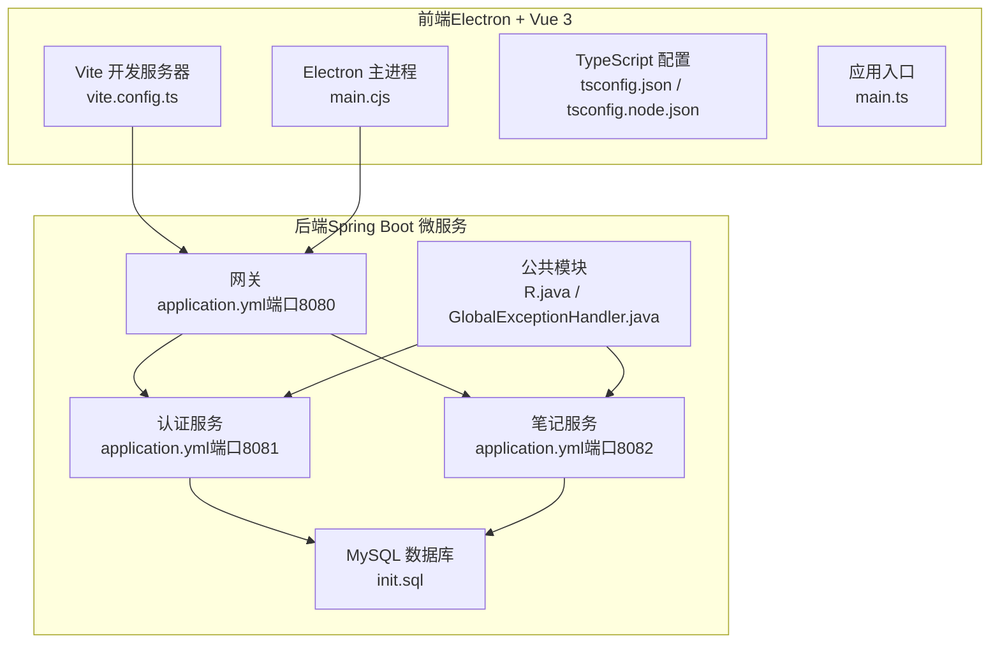
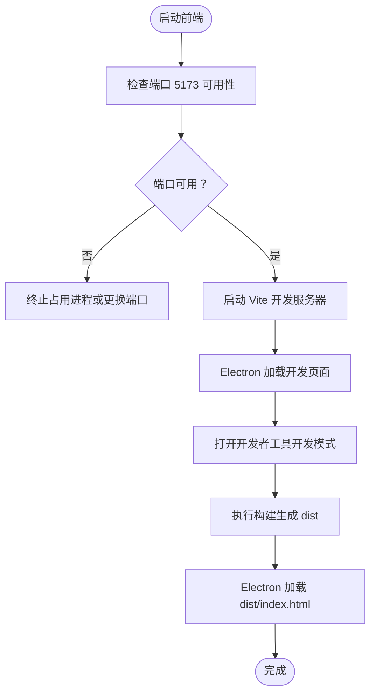
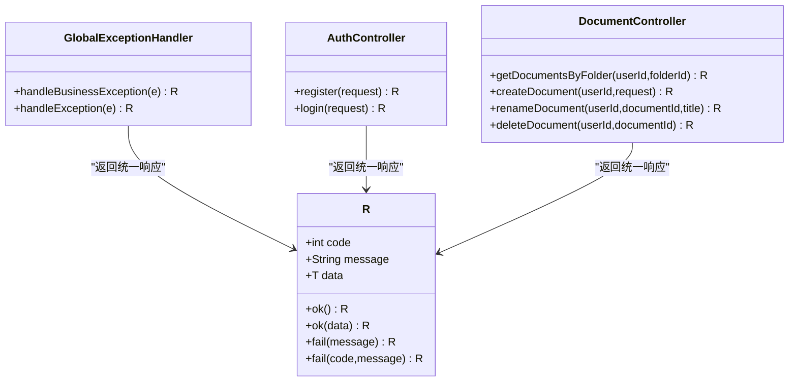
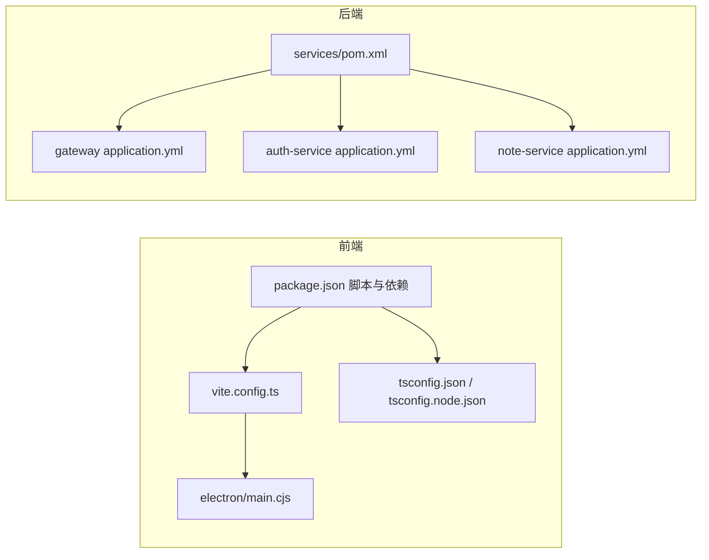

# 故障排除

<cite>
**本文引用的文件**
- [README.md](file://README.md)
- [package.json](file://app/package.json)
- [vite.config.ts](file://app/vite.config.ts)
- [tsconfig.json](file://app/tsconfig.json)
- [tsconfig.node.json](file://app/tsconfig.node.json)
- [main.cjs](file://app/electron/main.cjs)
- [gemini.ts](file://app/src/services/gemini.ts)
- [main.ts](file://app/src/main.ts)
- [pom.xml](file://services/pom.xml)
- [application.yml（网关）](file://services/gateway/src/main/resources/application.yml)
- [application.yml（认证服务）](file://services/auth-service/src/main/resources/application.yml)
- [application.yml（笔记服务）](file://services/note-service/src/main/resources/application.yml)
- [R.java](file://services/common/src/main/java/com/nonegonotes/common/result/R.java)
- [GlobalExceptionHandler.java](file://services/common/src/main/java/com/nonegonotes/common/exception/GlobalExceptionHandler.java)
- [AuthController.java](file://services/auth-service/src/main/java/com/nonegonotes/auth/controller/AuthController.java)
- [DocumentController.java](file://services/note-service/src/main/java/com/nonegonotes/note/controller/DocumentController.java)
- [init.sql](file://services/sql/init.sql)
</cite>

## 目录
1. [简介](#简介)
2. [项目结构](#项目结构)
3. [核心组件](#核心组件)
4. [架构总览](#架构总览)
5. [详细组件分析](#详细组件分析)
6. [依赖关系分析](#依赖关系分析)
7. [性能考虑](#性能考虑)
8. [故障排除指南](#故障排除指南)
9. [结论](#结论)
10. [附录](#附录)

## 简介
本指南面向Woo项目的开发者与运维人员，聚焦于常见问题的系统化诊断与解决路径，覆盖前端构建失败、后端服务启动异常、数据库连接问题、API调用错误、开发环境问题（Node.js版本、npm包安装、TypeScript编译）、运行时问题（Electron崩溃、API响应超时、数据库查询异常）、性能问题（内存泄漏、CPU占用、查询优化），以及调试工具使用与社区支持渠道。

## 项目结构
Woo采用前后端分离架构：
- 前端（app）：基于Vue 3 + TypeScript + Vite + Electron，通过Vite插件集成Electron主进程，开发时默认监听5173端口。
- 后端（services）：Spring Boot 3 + Spring Cloud Gateway微服务，包含认证服务、笔记服务与公共模块；统一返回体与全局异常处理；数据库使用MySQL，MyBatis Plus + Druid连接池；Knife4j用于接口文档。



图表来源
- [main.cjs:1-71](file://app/electron/main.cjs#L1-L71)
- [vite.config.ts:1-19](file://app/vite.config.ts#L1-L19)
- [tsconfig.json:1-25](file://app/tsconfig.json#L1-L25)
- [application.yml（网关）:1-27](file://services/gateway/src/main/resources/application.yml#L1-L27)
- [application.yml（认证服务）:1-40](file://services/auth-service/src/main/resources/application.yml#L1-L40)
- [application.yml（笔记服务）:1-35](file://services/note-service/src/main/resources/application.yml#L1-L35)
- [R.java:1-42](file://services/common/src/main/java/com/nonegonotes/common/result/R.java#L1-L42)
- [GlobalExceptionHandler.java:1-27](file://services/common/src/main/java/com/nonegonotes/common/exception/GlobalExceptionHandler.java#L1-L27)
- [init.sql:1-55](file://services/sql/init.sql#L1-L55)

章节来源
- [README.md:1-72](file://README.md#L1-L72)
- [pom.xml:1-141](file://services/pom.xml#L1-L141)

## 核心组件
- 前端开发与打包
  - 开发服务器端口：5173
  - 构建产物输出目录：dist
  - Electron主进程入口：electron/main.cjs
  - TypeScript配置：tsconfig.json、tsconfig.node.json
- 后端微服务
  - 网关：端口8080，路由到认证与笔记服务
  - 认证服务：端口8081，数据源与JWT配置
  - 笔记服务：端口8082，数据源与MyBatis Plus配置
  - 公共模块：统一响应体R与全局异常处理
- 数据库
  - 初始化脚本：services/sql/init.sql
  - 默认数据库名：non_ego_notes
  - 连接参数：驱动、URL、用户名、密码、时区

章节来源
- [vite.config.ts:1-19](file://app/vite.config.ts#L1-L19)
- [main.cjs:1-71](file://app/electron/main.cjs#L1-L71)
- [tsconfig.json:1-25](file://app/tsconfig.json#L1-L25)
- [application.yml（网关）:1-27](file://services/gateway/src/main/resources/application.yml#L1-L27)
- [application.yml（认证服务）:1-40](file://services/auth-service/src/main/resources/application.yml#L1-L40)
- [application.yml（笔记服务）:1-35](file://services/note-service/src/main/resources/application.yml#L1-L35)
- [R.java:1-42](file://services/common/src/main/java/com/nonegonotes/common/result/R.java#L1-L42)
- [GlobalExceptionHandler.java:1-27](file://services/common/src/main/java/com/nonegonotes/common/exception/GlobalExceptionHandler.java#L1-L27)
- [init.sql:1-55](file://services/sql/init.sql#L1-L55)

## 架构总览
下图展示从Electron前端到后端网关与微服务的典型交互路径，以及数据库层：

```mermaid
sequenceDiagram
participant FE as "Electron 前端"
participant GW as "Spring Cloud Gateway"
participant AUTH as "认证服务"
participant NOTE as "笔记服务"
participant DB as "MySQL"
FE->>GW : "HTTP 请求示例：登录/获取文档"
GW->>AUTH : "路由到 /api/auth/**"
GW->>NOTE : "路由到 /api/folders/**,/api/documents/**"
AUTH->>DB : "读写用户数据MyBatis Plus + Druid"
NOTE->>DB : "读写目录/文稿数据MyBatis Plus + Druid"
DB-->>AUTH : "SQL 执行结果"
DB-->>NOTE : "SQL 执行结果"
AUTH-->>GW : "统一响应体 R"
NOTE-->>GW : "统一响应体 R"
GW-->>FE : "统一响应体 R"
```

图表来源
- [application.yml（网关）:11-22](file://services/gateway/src/main/resources/application.yml#L11-L22)
- [AuthController.java:1-31](file://services/auth-service/src/main/java/com/nonegonotes/auth/controller/AuthController.java#L1-L31)
- [DocumentController.java:1-49](file://services/note-service/src/main/java/com/nonegonotes/note/controller/DocumentController.java#L1-L49)
- [R.java:1-42](file://services/common/src/main/java/com/nonegonotes/common/result/R.java#L1-L42)

## 详细组件分析

### 前端构建与运行时（Vite + Electron）
- 开发服务器端口与热更新：默认5173，开发模式下Electron主进程直接加载本地开发页面。
- 构建产物：Vite输出至dist目录，生产模式下Electron加载该静态页面。
- TypeScript与模块解析：严格类型检查、bundler模式、禁止发射JS等配置确保构建稳定性。
- Electron主进程：自定义窗口尺寸、隐藏标题栏、上下文隔离、IPC通信（最小化、最大化、关闭、版本查询、外部链接打开）。



图表来源
- [vite.config.ts:13-15](file://app/vite.config.ts#L13-L15)
- [main.cjs:26-31](file://app/electron/main.cjs#L26-L31)

章节来源
- [vite.config.ts:1-19](file://app/vite.config.ts#L1-L19)
- [main.cjs:1-71](file://app/electron/main.cjs#L1-L71)
- [tsconfig.json:1-25](file://app/tsconfig.json#L1-L25)
- [main.ts:1-8](file://app/src/main.ts#L1-L8)

### 后端微服务与统一响应
- 统一响应体：R封装code/message/data，成功/失败的静态工厂方法。
- 全局异常处理：业务异常与未知异常分别记录日志并返回标准化响应。
- 控制器示例：认证控制器提供注册/登录接口；笔记控制器提供文档列表、创建、重命名、删除接口，并要求携带用户标识头。



图表来源
- [R.java:1-42](file://services/common/src/main/java/com/nonegonotes/common/result/R.java#L1-L42)
- [GlobalExceptionHandler.java:1-27](file://services/common/src/main/java/com/nonegonotes/common/exception/GlobalExceptionHandler.java#L1-L27)
- [AuthController.java:1-31](file://services/auth-service/src/main/java/com/nonegonotes/auth/controller/AuthController.java#L1-L31)
- [DocumentController.java:1-49](file://services/note-service/src/main/java/com/nonegonotes/note/controller/DocumentController.java#L1-L49)

章节来源
- [R.java:1-42](file://services/common/src/main/java/com/nonegonotes/common/result/R.java#L1-L42)
- [GlobalExceptionHandler.java:1-27](file://services/common/src/main/java/com/nonegonotes/common/exception/GlobalExceptionHandler.java#L1-L27)
- [AuthController.java:1-31](file://services/auth-service/src/main/java/com/nonegonotes/auth/controller/AuthController.java#L1-L31)
- [DocumentController.java:1-49](file://services/note-service/src/main/java/com/nonegonotes/note/controller/DocumentController.java#L1-L49)

### 数据库与初始化
- 默认数据库：non_ego_notes
- 表结构：sys_user、note_folder、note_document，含索引与逻辑删除字段
- 连接参数：驱动类、URL、用户名、密码、时区、字符集

章节来源
- [init.sql:1-55](file://services/sql/init.sql#L1-L55)
- [application.yml（认证服务）:7-12](file://services/auth-service/src/main/resources/application.yml#L7-L12)
- [application.yml（笔记服务）:7-12](file://services/note-service/src/main/resources/application.yml#L7-L12)

## 依赖关系分析
- 前端依赖
  - Vue 3、TypeScript、Vite、Electron、Electron Builder、vue-tsc等
  - 构建脚本：dev、build、preview、electron:dev、electron:build
- 后端依赖
  - Spring Boot 3、Spring Cloud、MyBatis Plus、MySQL Connector/J、Druid、JWT、Knife4j、Hutool
  - Maven聚合工程，模块化管理



图表来源
- [package.json:1-38](file://app/package.json#L1-L38)
- [tsconfig.json:1-25](file://app/tsconfig.json#L1-L25)
- [vite.config.ts:1-19](file://app/vite.config.ts#L1-L19)
- [main.cjs:1-71](file://app/electron/main.cjs#L1-L71)
- [pom.xml:1-141](file://services/pom.xml#L1-L141)
- [application.yml（网关）:1-27](file://services/gateway/src/main/resources/application.yml#L1-L27)
- [application.yml（认证服务）:1-40](file://services/auth-service/src/main/resources/application.yml#L1-L40)
- [application.yml（笔记服务）:1-35](file://services/note-service/src/main/resources/application.yml#L1-L35)

章节来源
- [package.json:1-38](file://app/package.json#L1-L38)
- [pom.xml:1-141](file://services/pom.xml#L1-L141)

## 性能考虑
- 内存泄漏检测
  - 前端：利用Chrome DevTools Memory面板进行快照对比，关注未释放的事件监听器、定时器、闭包引用。
  - 后端：使用JVM堆转储与GC日志分析，结合线程转储定位阻塞点。
- CPU使用率分析
  - 前端：Performance面板记录长任务与渲染瓶颈；避免在主线程执行重计算。
  - 后端：Profiler采样热点方法，排查循环、递归、阻塞I/O。
- 数据库查询优化
  - 使用索引：对常用过滤列（如用户ID、父目录ID）建立索引。
  - 分页与限制：避免一次性加载大量数据；合理设置分页大小。
  - SQL剖析：开启慢查询日志与执行计划分析。

## 故障排除指南

### 一、前端构建与运行时问题

1. 前端构建失败
- 症状：npm run build报错，提示TypeScript或Vite相关错误。
- 排查步骤：
  - 清理缓存与依赖：删除node_modules与package-lock.json后重装。
  - 核对TypeScript版本与配置：确保tsconfig.json严格模式与bundler解析符合Vite要求。
  - 检查Vite插件：确认electron插件与vue插件版本兼容。
- 解决方案：
  - 升级/降级依赖至稳定版本组合。
  - 将TS严格检查项临时放宽以定位根因，再逐步收紧。

章节来源
- [package.json:6-12](file://app/package.json#L6-L12)
- [tsconfig.json:18-22](file://app/tsconfig.json#L18-L22)
- [vite.config.ts:7-12](file://app/vite.config.ts#L7-L12)

2. 开发服务器端口冲突
- 症状：启动Vite时报端口5173被占用。
- 排查步骤：
  - 查找占用进程并结束，或修改vite.config.ts中的server.port。
- 解决方案：
  - 更换端口或释放占用进程。

章节来源
- [vite.config.ts:13-15](file://app/vite.config.ts#L13-L15)

3. Electron应用崩溃或白屏
- 症状：应用启动后立即退出或显示空白。
- 排查步骤：
  - 开启开发者工具（开发模式自动打开），查看Console与Network面板。
  - 检查preload与主进程IPC通信是否正确，确认上下文隔离与Node集成配置。
  - 核对生产模式加载路径是否指向dist/index.html。
- 解决方案：
  - 修复IPC事件处理与资源路径；确保构建产物存在且完整。

章节来源
- [main.cjs:18-31](file://app/electron/main.cjs#L18-L31)

4. TypeScript编译错误
- 症状：vue-tsc或Vite构建阶段出现类型错误。
- 排查步骤：
  - 检查tsconfig.json与tsconfig.node.json的moduleResolution与noEmit设置。
  - 关注严格模式下的未使用变量、参数与switch穷举。
- 解决方案：
  - 逐项修复类型问题；必要时在局部放宽规则以定位问题。

章节来源
- [tsconfig.json:10-14](file://app/tsconfig.json#L10-L14)
- [tsconfig.json:18-21](file://app/tsconfig.json#L18-L21)

5. npm包安装失败
- 症状：npm install卡住或报权限/网络错误。
- 排查步骤：
  - 切换可靠镜像源或使用yarn/pnpm替代。
  - 清理npm缓存与全局缓存。
- 解决方案：
  - 使用稳定网络与镜像源；必要时离线缓存依赖。

章节来源
- [package.json:13-35](file://app/package.json#L13-L35)

6. Node.js版本不兼容
- 症状：某些依赖需要特定Node版本范围。
- 排查步骤：
  - 检查package.json与依赖声明的最低/最高版本。
  - 使用nvm切换到推荐版本。
- 解决方案：
  - 安装匹配版本的Node.js并重装依赖。

章节来源
- [pom.xml:22-26](file://services/pom.xml#L22-L26)
- [package.json:13-35](file://app/package.json#L13-L35)

### 二、后端服务启动异常

1. 端口占用
- 症状：服务启动时报端口8080/8081/8082被占用。
- 排查步骤：
  - 终止占用进程或修改application.yml中的server.port。
- 解决方案：
  - 更改端口或释放占用。

章节来源
- [application.yml（网关）:1-2](file://services/gateway/src/main/resources/application.yml#L1-L2)
- [application.yml（认证服务）:1-2](file://services/auth-service/src/main/resources/application.yml#L1-L2)
- [application.yml（笔记服务）:1-2](file://services/note-service/src/main/resources/application.yml#L1-L2)

2. Nacos注册中心不可用
- 症状：服务启动失败，提示无法连接Nacos。
- 排查步骤：
  - 确认Nacos服务地址与端口可达。
  - 检查服务名与路由配置。
- 解决方案：
  - 启动Nacos或修正server-addr。

章节来源
- [application.yml（网关）:8-10](file://services/gateway/src/main/resources/application.yml#L8-L10)
- [application.yml（认证服务）:14-16](file://services/auth-service/src/main/resources/application.yml#L14-L16)
- [application.yml（笔记服务）:14-16](file://services/note-service/src/main/resources/application.yml#L14-L16)

3. 数据库连接失败
- 症状：启动时报无法连接MySQL或找不到数据库。
- 排查步骤：
  - 确认MySQL服务运行、账号密码正确、时区与字符集设置。
  - 使用init.sql初始化数据库与表结构。
- 解决方案：
  - 启动MySQL并执行初始化脚本；修正application.yml中的连接参数。

章节来源
- [application.yml（认证服务）:7-12](file://services/auth-service/src/main/resources/application.yml#L7-L12)
- [application.yml（笔记服务）:7-12](file://services/note-service/src/main/resources/application.yml#L7-L12)
- [init.sql:1-55](file://services/sql/init.sql#L1-L55)

4. MyBatis Plus映射或逻辑删除异常
- 症状：查询/更新报错或逻辑删除字段不生效。
- 排查步骤：
  - 检查mapper XML路径与驼峰映射配置。
  - 确认逻辑删除字段与值配置一致。
- 解决方案：
  - 修正mapper位置与配置；保持实体字段与数据库一致。

章节来源
- [application.yml（认证服务）:19-28](file://services/auth-service/src/main/resources/application.yml#L19-L28)
- [application.yml（笔记服务）:19-28](file://services/note-service/src/main/resources/application.yml#L19-L28)

5. JWT校验失败
- 症状：登录/鉴权接口返回鉴权失败。
- 排查步骤：
  - 核对JWT密钥与过期时间配置。
  - 检查客户端请求头是否携带正确的令牌。
- 解决方案：
  - 统一密钥与过期策略；确保请求头格式正确。

章节来源
- [application.yml（网关）:24-26](file://services/gateway/src/main/resources/application.yml#L24-L26)
- [application.yml（认证服务）:31-33](file://services/auth-service/src/main/resources/application.yml#L31-L33)

### 三、API调用错误

1. 统一响应与异常处理
- 症状：接口返回code/message，业务异常与系统异常区分不明显。
- 排查步骤：
  - 查看GlobalExceptionHandler对BusinessException与Exception的处理。
  - 检查控制器返回的R对象。
- 解决方案：
  - 明确业务异常抛出与捕获；保证错误信息可读。

章节来源
- [GlobalExceptionHandler.java:15-25](file://services/common/src/main/java/com/nonegonotes/common/exception/GlobalExceptionHandler.java#L15-L25)
- [R.java:19-40](file://services/common/src/main/java/com/nonegonotes/common/result/R.java#L19-L40)

2. 控制器请求头缺失
- 症状：笔记接口返回未授权或空指针。
- 排查步骤：
  - 确认请求头X-User-Id是否正确传递。
- 解决方案：
  - 在调用前设置用户标识头。

章节来源
- [DocumentController.java:21-22](file://services/note-service/src/main/java/com/nonegonotes/note/controller/DocumentController.java#L21-L22)

3. 网关路由不匹配
- 症状：访问/api/auth或/api/documents返回404。
- 排查步骤：
  - 检查网关路由配置与服务名lb://auth-service/lb://note-service。
- 解决方案：
  - 修正路由规则或确保服务已注册到Nacos。

章节来源
- [application.yml（网关）:11-22](file://services/gateway/src/main/resources/application.yml#L11-L22)

### 四、运行时问题

1. Electron应用崩溃
- 症状：应用启动即退出或窗口无法创建。
- 排查步骤：
  - 检查主进程日志与异常堆栈。
  - 确认preload脚本与webPreferences配置。
- 解决方案：
  - 修复主进程逻辑与IPC事件；确保preload安全加载。

章节来源
- [main.cjs:1-71](file://app/electron/main.cjs#L1-L71)

2. API响应超时
- 症状：调用后长时间无响应。
- 排查步骤：
  - 检查后端线程池与数据库连接池配置。
  - 使用压测工具定位瓶颈。
- 解决方案：
  - 增加连接池容量或优化SQL；引入异步与缓存。

章节来源
- [application.yml（认证服务）:12-12](file://services/auth-service/src/main/resources/application.yml#L12-L12)
- [application.yml（笔记服务）:12-12](file://services/note-service/src/main/resources/application.yml#L12-L12)

3. 数据库查询异常
- 症状：查询报错或结果为空。
- 排查步骤：
  - 检查SQL执行计划与索引使用。
  - 核对mapper与实体字段映射。
- 解决方案：
  - 添加必要索引；优化复杂查询。

章节来源
- [init.sql:26-54](file://services/sql/init.sql#L26-L54)

### 五、性能问题排查

1. 内存泄漏
- 前端：使用Memory面板对比快照，定位未释放的监听器与闭包。
- 后端：JVM堆转储与GC日志分析，排查大对象与长生命周期集合。

2. CPU使用率高
- 前端：Performance面板识别长任务，减少主线程阻塞。
- 后端：Profiler定位热点方法，优化算法与I/O。

3. 数据库查询优化
- 建立索引：用户ID、父目录ID等高频过滤字段。
- 分页与限制：避免全量加载。
- 慢查询分析：开启慢查询日志与执行计划。

### 六、调试工具使用指南

- Chrome DevTools
  - 打开方式：开发模式下Electron自动打开；也可手动打开。
  - 功能：Elements、Console、Sources、Network、Performance、Memory。
- Postman
  - 用途：构造请求（含X-User-Id头）、查看响应体与状态码、保存集合。
  - 建议：为不同环境准备环境变量（基础URL、JWT令牌）。
- 数据库管理工具
  - 如DBeaver/Navicat：连接MySQL，执行init.sql，查看表结构与索引，执行慢查询分析。

### 七、日志分析、网络连接检查与依赖版本验证

- 日志分析
  - 前端：Electron主进程日志与开发者工具Console。
  - 后端：Spring Boot控制台日志、全局异常处理器日志、Druid监控台。
- 网络连接检查
  - 端口连通性：telnet或nc检查8080/8081/8082、3306、8848。
  - 路由连通性：curl测试网关路由与后端接口。
- 依赖版本验证
  - 前端：package.json中Electron、Vite、TypeScript版本与官方兼容矩阵。
  - 后端：pom.xml中Java版本、Spring Boot与Cloud版本、MyBatis Plus与MySQL驱动版本。

### 八、社区支持与问题报告流程

- 提交Issue
  - 描述：问题现象、期望行为、复现步骤。
  - 环境：操作系统、Node.js与依赖版本、后端JDK版本、数据库版本。
  - 日志：前后端关键日志片段与截图。
  - 附加：最小可复现步骤或简化后的配置。

章节来源
- [README.md:65-71](file://README.md#L65-L71)

## 结论
通过系统化的诊断流程（端口与网络、依赖版本、数据库初始化、统一响应与异常处理、Electron主进程与Vite配置）与调试工具配合，大多数问题可在较短时间内定位并解决。建议团队建立标准化的环境配置与问题报告模板，持续优化性能与稳定性。

## 附录

### A. 常见命令速查
- 前端
  - 安装依赖：npm install
  - 启动开发：npm run dev
  - 构建生产：npm run build
  - Electron开发：npm run electron:dev
  - Electron打包：npm run electron:build
- 后端
  - 安装依赖：mvn clean install
  - 启动服务：分别启动gateway、auth-service、note-service

章节来源
- [README.md:20-45](file://README.md#L20-L45)
- [package.json:6-12](file://app/package.json#L6-L12)
- [pom.xml:122-138](file://services/pom.xml#L122-L138)