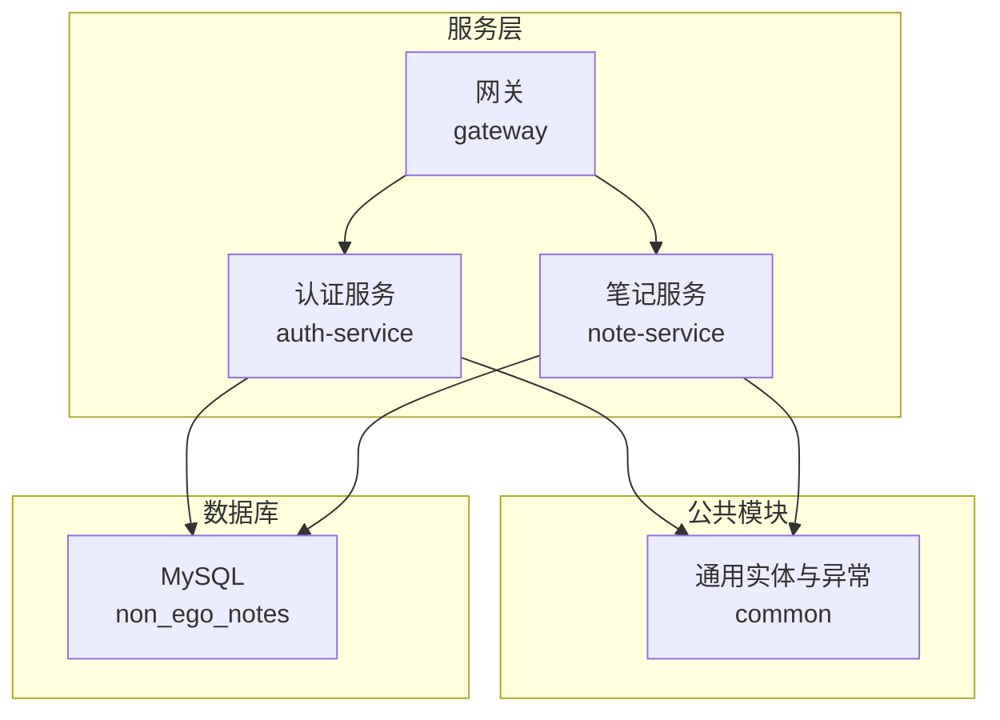
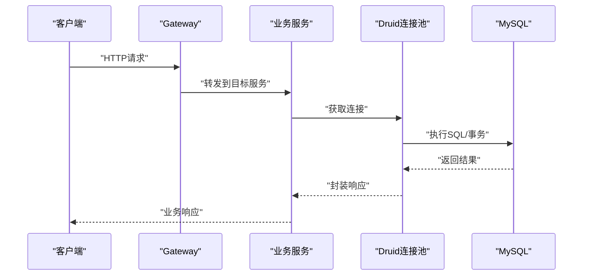
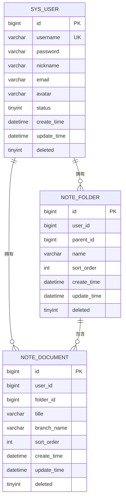
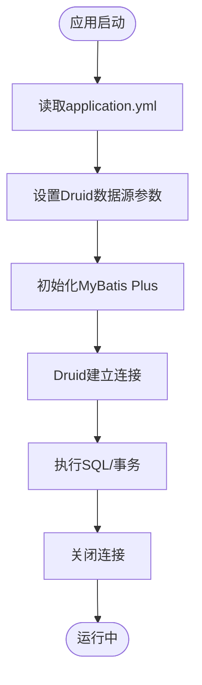
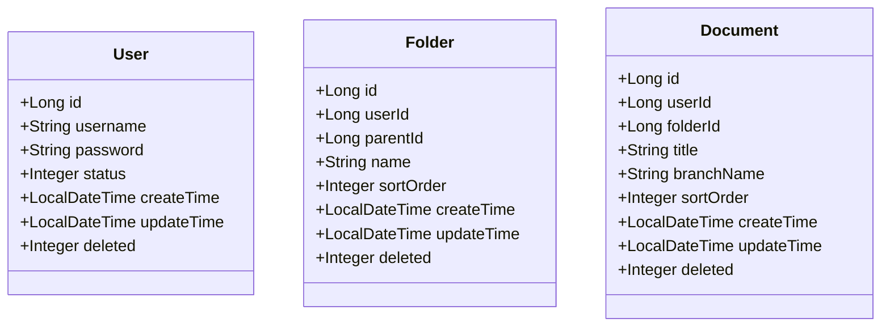
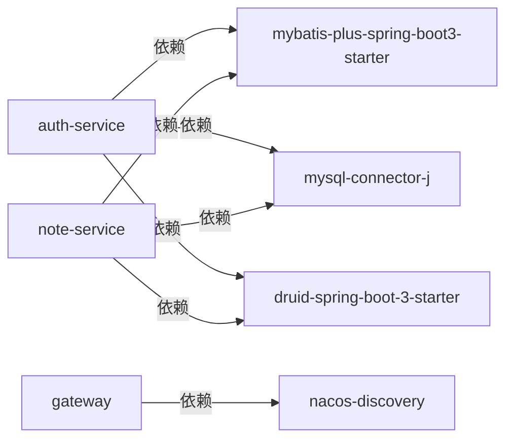

# 数据库问题排查

<cite>
**本文引用的文件**
- [init.sql](file://services/sql/init.sql)
- [application.yml（认证服务）](file://services/auth-service/src/main/resources/application.yml)
- [application.yml（笔记服务）](file://services/note-service/src/main/resources/application.yml)
- [application.yml（网关）](file://services/gateway/src/main/resources/application.yml)
- [pom.xml（认证服务）](file://services/auth-service/pom.xml)
- [pom.xml（笔记服务）](file://services/note-service/pom.xml)
- [User.java](file://services/common/src/main/java/com/nonegonotes/common/entity/User.java)
- [Folder.java](file://services/common/src/main/java/com/nonegonotes/common/entity/Folder.java)
- [Document.java](file://services/common/src/main/java/com/nonegonotes/common/entity/Document.java)
- [GlobalExceptionHandler.java](file://services/common/src/main/java/com/nonegonotes/common/exception/GlobalExceptionHandler.java)
</cite>

## 目录
1. [简介](#简介)
2. [项目结构](#项目结构)
3. [核心组件](#核心组件)
4. [架构总览](#架构总览)
5. [详细组件分析](#详细组件分析)
6. [依赖分析](#依赖分析)
7. [性能考虑](#性能考虑)
8. [故障排除指南](#故障排除指南)
9. [结论](#结论)
10. [附录](#附录)

## 简介
本指南面向Woo项目的数据库问题排查与运维，聚焦以下主题：
- MySQL连接失败、数据库权限不足、表结构不匹配的诊断与修复
- 初始化脚本执行失败、数据迁移错误、约束冲突的处理流程
- SQL查询性能优化：索引设计、查询计划分析、慢查询日志
- 数据一致性、事务回滚异常、并发访问冲突的解决方案
- 备份恢复、连接池配置、死锁检测与定位
- 监控指标、容量规划与性能调优最佳实践

## 项目结构
后端采用多模块微服务架构，数据库位于MySQL，使用Spring Boot + MyBatis Plus + Druid连接池，服务通过Nacos注册发现与Gateway路由。

图表来源
- [application.yml（网关）:1-27](file://services/gateway/src/main/resources/application.yml#L1-L27)
- [application.yml（认证服务）:1-40](file://services/auth-service/src/main/resources/application.yml#L1-L40)
- [application.yml（笔记服务）:1-35](file://services/note-service/src/main/resources/application.yml#L1-L35)

章节来源
- [application.yml（网关）:1-27](file://services/gateway/src/main/resources/application.yml#L1-L27)
- [application.yml（认证服务）:1-40](file://services/auth-service/src/main/resources/application.yml#L1-L40)
- [application.yml（笔记服务）:1-35](file://services/note-service/src/main/resources/application.yml#L1-L35)

## 核心组件
- 数据库初始化脚本：定义数据库、字符集、三张核心表及索引
- 连接配置：Druid连接池、MyBatis Plus逻辑删除字段、驼峰映射
- 实体模型：User、Folder、Document，映射到sys_user、note_folder、note_document
- 异常处理：统一业务异常与系统异常返回

章节来源
- [init.sql:1-55](file://services/sql/init.sql#L1-L55)
- [application.yml（认证服务）:7-28](file://services/auth-service/src/main/resources/application.yml#L7-L28)
- [application.yml（笔记服务）:7-28](file://services/note-service/src/main/resources/application.yml#L7-L28)
- [User.java:11-39](file://services/common/src/main/java/com/nonegonotes/common/entity/User.java#L11-L39)
- [Folder.java:11-38](file://services/common/src/main/java/com/nonegonotes/common/entity/Folder.java#L11-L38)
- [Document.java:11-41](file://services/common/src/main/java/com/nonegonotes/common/entity/Document.java#L11-L41)
- [GlobalExceptionHandler.java:11-26](file://services/common/src/main/java/com/nonegonotes/common/exception/GlobalExceptionHandler.java#L11-L26)

## 架构总览
下图展示数据库交互的关键路径：客户端经Gateway路由至具体服务，服务通过Druid连接池访问MySQL，MyBatis Plus执行SQL与逻辑删除。

图表来源
- [application.yml（网关）:11-22](file://services/gateway/src/main/resources/application.yml#L11-L22)
- [application.yml（认证服务）:7-12](file://services/auth-service/src/main/resources/application.yml#L7-L12)
- [application.yml（笔记服务）:7-12](file://services/note-service/src/main/resources/application.yml#L7-L12)

## 详细组件分析

### 数据库初始化与表结构
- 数据库：non_ego_notes，字符集utf8mb4
- 表一：sys_user（用户），主键id，唯一索引username
- 表二：note_folder（目录），主键id，索引user_id、parent_id
- 表三：note_document（文稿），主键id，索引user_id、folder_id
- 逻辑删除字段：deleted（MyBatis Plus全局配置）

图表来源
- [init.sql:5-54](file://services/sql/init.sql#L5-L54)
- [User.java:12-39](file://services/common/src/main/java/com/nonegonotes/common/entity/User.java#L12-L39)
- [Folder.java:12-38](file://services/common/src/main/java/com/nonegonotes/common/entity/Folder.java#L12-L38)
- [Document.java:12-41](file://services/common/src/main/java/com/nonegonotes/common/entity/Document.java#L12-L41)

章节来源
- [init.sql:1-55](file://services/sql/init.sql#L1-L55)
- [User.java:11-39](file://services/common/src/main/java/com/nonegonotes/common/entity/User.java#L11-L39)
- [Folder.java:11-38](file://services/common/src/main/java/com/nonegonotes/common/entity/Folder.java#L11-L38)
- [Document.java:11-41](file://services/common/src/main/java/com/nonegonotes/common/entity/Document.java#L11-L41)

### 连接配置与连接池
- JDBC驱动：com.mysql.cj.jdbc.Driver
- 数据源类型：com.alibaba.druid.pool.DruidDataSource
- MyBatis Plus：驼峰映射、逻辑删除字段配置
- 日志：StdOutImpl输出SQL日志（便于排查）

图表来源
- [application.yml（认证服务）:7-28](file://services/auth-service/src/main/resources/application.yml#L7-L28)
- [application.yml（笔记服务）:7-28](file://services/note-service/src/main/resources/application.yml#L7-L28)

章节来源
- [application.yml（认证服务）:7-28](file://services/auth-service/src/main/resources/application.yml#L7-L28)
- [application.yml（笔记服务）:7-28](file://services/note-service/src/main/resources/application.yml#L7-L28)

### 实体模型与映射
- 实体注解：@TableName、@TableId、@TableLogic、字段填充策略
- 字段命名：数据库下划线风格 vs Java驼峰风格由MyBatis Plus自动映射
- 逻辑删除：deleted字段参与查询过滤

图表来源
- [User.java:11-39](file://services/common/src/main/java/com/nonegonotes/common/entity/User.java#L11-L39)
- [Folder.java:11-38](file://services/common/src/main/java/com/nonegonotes/common/entity/Folder.java#L11-L38)
- [Document.java:11-41](file://services/common/src/main/java/com/nonegonotes/common/entity/Document.java#L11-L41)

章节来源
- [User.java:11-39](file://services/common/src/main/java/com/nonegonotes/common/entity/User.java#L11-L39)
- [Folder.java:11-38](file://services/common/src/main/java/com/nonegonotes/common/entity/Folder.java#L11-L38)
- [Document.java:11-41](file://services/common/src/main/java/com/nonegonotes/common/entity/Document.java#L11-L41)

### 异常处理与统一返回
- 全局异常：BusinessException按业务码返回；其他异常统一返回“服务器内部错误”
- 建议：在数据库相关异常处补充更细粒度的捕获与提示

章节来源
- [GlobalExceptionHandler.java:11-26](file://services/common/src/main/java/com/nonegonotes/common/exception/GlobalExceptionHandler.java#L11-L26)

## 依赖分析
- 认证服务与笔记服务均引入：
  - MyBatis Plus Starter
  - MySQL Connector/J
  - Druid Spring Boot Starter
- 网关负责路由与鉴权（JWT密钥配置）

图表来源
- [pom.xml（认证服务）:45-62](file://services/auth-service/pom.xml#L45-L62)
- [pom.xml（笔记服务）:45-62](file://services/note-service/pom.xml#L45-L62)

章节来源
- [pom.xml（认证服务）:19-98](file://services/auth-service/pom.xml#L19-L98)
- [pom.xml（笔记服务）:19-82](file://services/note-service/pom.xml#L19-L82)

## 性能考虑
- 索引设计
  - sys_user：username唯一索引，适合登录与去重
  - note_folder：user_id、parent_id索引，支持用户目录树查询
  - note_document：user_id、folder_id索引，支持用户与目录维度检索
- 查询计划分析
  - 使用EXPLAIN分析关键查询，确保命中预期索引
  - 避免SELECT *，仅取必要列
- 慢查询日志
  - 启用慢查询日志，阈值建议≥1秒，结合EXPLAIN定位热点
- 事务与并发
  - 控制单事务时长，避免长时间持有行锁
  - 使用合适的隔离级别，减少锁竞争
- 连接池
  - 根据QPS与并发连接数调整Druid连接池参数（最小空闲、最大活跃、超时）
- 监控指标
  - QPS、P95/P99延迟、连接池活跃数、慢查询数量、锁等待与死锁次数

## 故障排除指南

### 一、MySQL连接失败
- 现象
  - 应用启动报连接超时或拒绝
- 诊断步骤
  - 检查MySQL服务状态与端口连通性
  - 校验JDBC URL、用户名、密码是否正确
  - 确认字符集与时区参数与数据库一致
  - 查看Druid连接池健康状态与连接数上限
- 解决方案
  - 修正application.yml中的数据源配置
  - 在防火墙开放3306端口
  - 调整Druid连接池大小与超时参数
  - 如需远程访问，检查MySQL用户主机权限

章节来源
- [application.yml（认证服务）:7-12](file://services/auth-service/src/main/resources/application.yml#L7-L12)
- [application.yml（笔记服务）:7-12](file://services/note-service/src/main/resources/application.yml#L7-L12)

### 二、数据库权限不足
- 现象
  - 登录成功但无法执行DDL/DML或读取表数据
- 诊断步骤
  - 使用当前账号执行SHOW GRANTS确认权限
  - 检查是否存在对non_ego_notes库与三张表的SELECT/INSERT/UPDATE/DELETE权限
- 解决方案
  - 授权对应库与表的完整权限，或按最小权限原则分配
  - 若使用只读账号，确保具备所需查询权限

章节来源
- [init.sql:5-54](file://services/sql/init.sql#L5-L54)

### 三、表结构不匹配
- 现象
  - 启动时报字段缺失、类型不兼容或找不到表
- 诊断步骤
  - 对照init.sql核对表结构与索引
  - 检查实体类字段与数据库字段映射是否一致
  - 确认逻辑删除字段deleted存在且类型匹配
- 解决方案
  - 执行init.sql初始化数据库
  - 修改实体类或数据库以保持一致
  - 若已有历史数据，谨慎进行结构变更并做好备份

章节来源
- [init.sql:5-54](file://services/sql/init.sql#L5-L54)
- [User.java:12-39](file://services/common/src/main/java/com/nonegonotes/common/entity/User.java#L12-L39)
- [Folder.java:12-38](file://services/common/src/main/java/com/nonegonotes/common/entity/Folder.java#L12-L38)
- [Document.java:12-41](file://services/common/src/main/java/com/nonegonotes/common/entity/Document.java#L12-L41)

### 四、初始化脚本执行失败
- 现象
  - 执行init.sql报语法错误或重复执行失败
- 诊断步骤
  - 检查MySQL版本与SQL语法兼容性
  - 确认字符集设置与数据库默认字符集一致
  - 查看是否已存在同名数据库/表
- 解决方案
  - 使用“IF NOT EXISTS”语句重试
  - 先DROP再CREATE，或逐条修正语法
  - 将脚本拆分为多步执行并记录日志

章节来源
- [init.sql:1-55](file://services/sql/init.sql#L1-L55)

### 五、数据迁移错误与约束冲突
- 现象
  - 导入历史数据时报唯一键冲突、外键约束失败
- 诊断步骤
  - 使用INSERT IGNORE或ON DUPLICATE KEY UPDATE处理重复
  - 检查逻辑删除字段deleted是否被正确赋值
  - 校验时间字段默认值与时区设置
- 解决方案
  - 迁移前清理重复数据或调整主键策略
  - 统一逻辑删除值，避免误删
  - 严格控制时区与默认时间，避免跨时区问题

章节来源
- [init.sql:10-54](file://services/sql/init.sql#L10-L54)
- [User.java:37-39](file://services/common/src/main/java/com/nonegonotes/common/entity/User.java#L37-L39)
- [Folder.java:36-38](file://services/common/src/main/java/com/nonegonotes/common/entity/Folder.java#L36-L38)
- [Document.java:39-41](file://services/common/src/main/java/com/nonegonotes/common/entity/Document.java#L39-L41)

### 六、SQL查询性能优化
- 索引设计
  - 为常用过滤/连接字段建立合适索引（如user_id、parent_id、folder_id）
  - 避免冗余索引，定期分析索引使用率
- 查询计划分析
  - 使用EXPLAIN查看执行计划，关注全表扫描与回表
  - 优化WHERE、JOIN、ORDER BY子句，确保索引被利用
- 慢查询日志
  - 开启慢查询日志，设定合理阈值
  - 结合慢查询与EXPLAIN定位热点SQL

章节来源
- [init.sql:26-54](file://services/sql/init.sql#L26-L54)

### 七、数据一致性、事务回滚异常与并发冲突
- 数据一致性
  - 使用逻辑删除替代物理删除，配合软删除字段保证可恢复
- 事务回滚异常
  - 捕获数据库异常并记录上下文信息，避免静默失败
  - 对幂等接口设计补偿机制
- 并发冲突
  - 使用乐观锁或悲观锁控制写冲突
  - 缩短事务时长，降低锁持有时间

章节来源
- [application.yml（认证服务）:24-28](file://services/auth-service/src/main/resources/application.yml#L24-L28)
- [application.yml（笔记服务）:24-28](file://services/note-service/src/main/resources/application.yml#L24-L28)
- [GlobalExceptionHandler.java:15-25](file://services/common/src/main/java/com/nonegonotes/common/exception/GlobalExceptionHandler.java#L15-L25)

### 八、备份恢复、连接池配置与死锁检测
- 备份恢复
  - 定期全量+增量备份，验证恢复流程
  - 重要操作前先备份，保留回滚点
- 连接池配置
  - 根据QPS与并发连接数调整Druid参数（最小空闲、最大活跃、超时）
  - 监控连接池状态，及时发现连接泄漏
- 死锁检测
  - 开启死锁日志，记录死锁发生时间与涉及SQL
  - 分析死锁原因，优化事务顺序与加锁粒度

章节来源
- [application.yml（认证服务）:7-12](file://services/auth-service/src/main/resources/application.yml#L7-L12)
- [application.yml（笔记服务）:7-12](file://services/note-service/src/main/resources/application.yml#L7-L12)

### 九、监控指标、容量规划与性能调优
- 监控指标
  - 关键指标：QPS、P95/P99延迟、连接池活跃数、慢查询数、锁等待、死锁次数
- 容量规划
  - 基于峰值QPS与响应时间估算CPU/内存/磁盘IO
  - 评估索引与缓存命中率，平衡存储与性能
- 性能调优
  - 优化热点SQL与索引，分库分表扩展
  - 使用连接池复用与异步化非关键路径

## 结论
本指南基于现有配置与脚本，提供了从连接、权限、结构到性能与运维的全流程排查思路。建议在生产环境严格执行备份与变更审批流程，并持续监控关键指标，以保障系统的稳定性与可维护性。

## 附录
- 快速检查清单
  - 数据库可达性与端口连通
  - 用户权限与字符集设置
  - 初始化脚本执行成功
  - 实体与表结构一致
  - 连接池参数与慢查询日志
  - 事务与并发控制策略
  - 备份与恢复演练