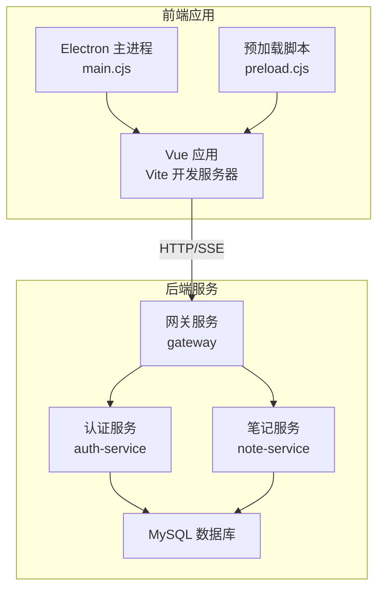
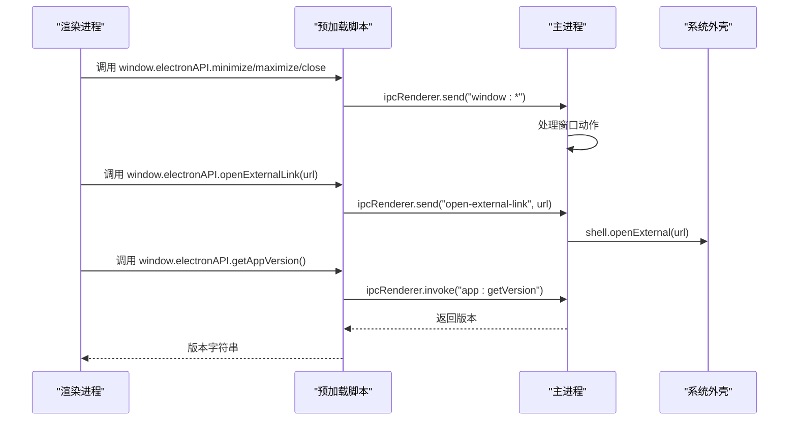
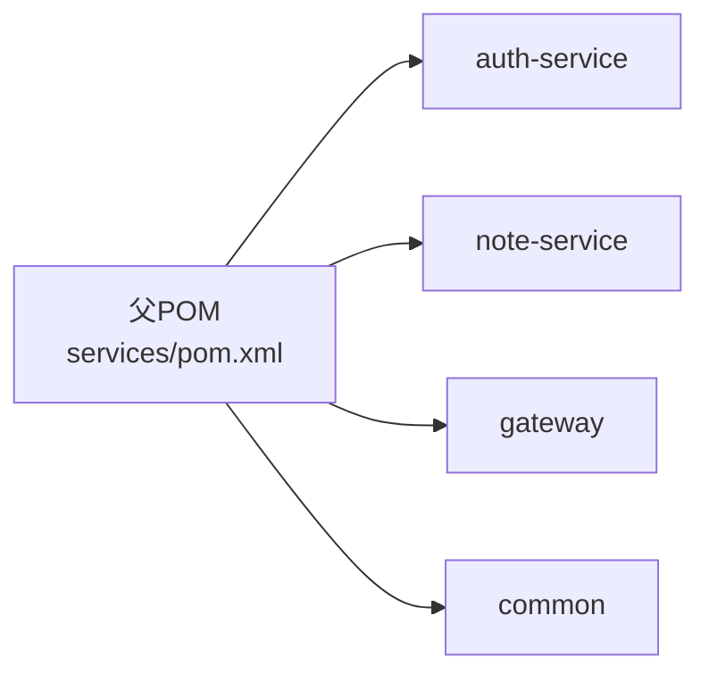

# 调试工具使用

<cite>
**本文引用的文件**
- [app/package.json](file://app/package.json)
- [app/vite.config.ts](file://app/vite.config.ts)
- [app/src/main.ts](file://app/src/main.ts)
- [app/src/App.vue](file://app/src/App.vue)
- [app/src/stores/aiChat.ts](file://app/src/stores/aiChat.ts)
- [app/src/services/gemini.ts](file://app/src/services/gemini.ts)
- [app/src/types/ai.ts](file://app/src/types/ai.ts)
- [app/electron/main.cjs](file://app/electron/main.cjs)
- [app/electron/preload.cjs](file://app/electron/preload.cjs)
- [services/pom.xml](file://services/pom.xml)
- [services/auth-service/src/main/resources/application.yml](file://services/auth-service/src/main/resources/application.yml)
- [services/note-service/src/main/resources/application.yml](file://services/note-service/src/main/resources/application.yml)
- [services/gateway/src/main/resources/application.yml](file://services/gateway/src/main/resources/application.yml)
- [services/auth-service/src/main/java/com/nonegonotes/auth/AuthServiceApplication.java](file://services/auth-service/src/main/java/com/nonegonotes/auth/AuthServiceApplication.java)
- [services/note-service/src/main/java/com/nonegonotes/note/NoteServiceApplication.java](file://services/note-service/src/main/java/com/nonegonotes/note/NoteServiceApplication.java)
- [services/gateway/src/main/java/com/nonegonotes/gateway/GatewayApplication.java](file://services/gateway/src/main/java/com/nonegonotes/gateway/GatewayApplication.java)
- [app/tsconfig.json](file://app/tsconfig.json)
- [app/tsconfig.node.json](file://app/tsconfig.node.json)
</cite>

## 目录
1. [简介](#简介)
2. [项目结构](#项目结构)
3. [核心组件](#核心组件)
4. [架构总览](#架构总览)
5. [详细组件分析](#详细组件分析)
6. [依赖分析](#依赖分析)
7. [性能考虑](#性能考虑)
8. [故障排查指南](#故障排查指南)
9. [结论](#结论)
10. [附录](#附录)

## 简介
本指南面向Woo项目的开发者与测试人员，系统性介绍如何在不同技术栈与运行环境中进行高效调试。内容覆盖：
- Vue应用在Chrome DevTools中的组件检查、状态监控与网络请求分析
- Electron应用的主进程与渲染进程调试、IPC通信监控与窗口管理调试
- 后端Spring Boot微服务的本地联调、日志与性能观测
- 数据库连接与查询优化（基于项目配置）
- API测试与自动化（Postman思路与脚本编写要点）
- 命令行调试与远程调试配置

## 项目结构
Woo采用前后端分离架构：
- 前端为Vue 3 + Vite + Electron应用，开发时通过Vite热更新，打包后由Electron承载
- 后端为多模块Spring Boot微服务，通过网关统一暴露REST接口，并集成MyBatis Plus、Druid、Knife4j等



图表来源
- [app/vite.config.ts:1-19](file://app/vite.config.ts#L1-L19)
- [app/electron/main.cjs:1-71](file://app/electron/main.cjs#L1-L71)
- [app/electron/preload.cjs:1-18](file://app/electron/preload.cjs#L1-L18)
- [services/gateway/src/main/resources/application.yml:1-27](file://services/gateway/src/main/resources/application.yml#L1-L27)
- [services/auth-service/src/main/resources/application.yml:1-40](file://services/auth-service/src/main/resources/application.yml#L1-L40)
- [services/note-service/src/main/resources/application.yml:1-35](file://services/note-service/src/main/resources/application.yml#L1-L35)

章节来源
- [app/package.json:1-38](file://app/package.json#L1-L38)
- [app/vite.config.ts:1-19](file://app/vite.config.ts#L1-L19)
- [services/pom.xml:1-141](file://services/pom.xml#L1-L141)

## 核心组件
- 前端入口与状态管理
  - 应用入口初始化了Vue实例与Pinia，并挂载根组件
  - AI聊天Store负责消息流式处理、模型选择与API Key管理
  - Gemini服务封装了SSE流式请求与错误处理
- Electron运行时
  - 主进程负责创建窗口、加载开发/生产页面、注册IPC处理与窗口控制
  - 预加载脚本通过contextBridge向渲染进程暴露安全API
- 后端微服务
  - 网关服务统一路由与鉴权
  - 认证/笔记服务分别提供用户认证与文档/文件夹能力
  - 数据源使用MySQL与Druid连接池，MyBatis Plus开启SQL日志输出

章节来源
- [app/src/main.ts:1-8](file://app/src/main.ts#L1-L8)
- [app/src/stores/aiChat.ts:1-199](file://app/src/stores/aiChat.ts#L1-L199)
- [app/src/services/gemini.ts:1-103](file://app/src/services/gemini.ts#L1-L103)
- [app/electron/main.cjs:1-71](file://app/electron/main.cjs#L1-L71)
- [app/electron/preload.cjs:1-18](file://app/electron/preload.cjs#L1-L18)
- [services/gateway/src/main/resources/application.yml:1-27](file://services/gateway/src/main/resources/application.yml#L1-L27)
- [services/auth-service/src/main/resources/application.yml:1-40](file://services/auth-service/src/main/resources/application.yml#L1-L40)
- [services/note-service/src/main/resources/application.yml:1-35](file://services/note-service/src/main/resources/application.yml#L1-L35)

## 架构总览
下图展示从浏览器到后端服务的典型交互路径，以及Electron环境下的窗口与IPC通信。

```mermaid
sequenceDiagram
participant Browser as "浏览器/渲染进程"
participant FE as "Vue 应用"
participant Store as "Pinia Store(AI)"
participant Gemini as "Gemini 服务"
participant GW as "网关服务"
participant AUTH as "认证服务"
participant NOTE as "笔记服务"
participant DB as "MySQL"
Browser->>FE : 打开页面
FE->>Store : 初始化与交互
Store->>Gemini : 发送流式请求(SSE)
Gemini->>GW : HTTP 请求
GW->>AUTH : 鉴权/路由
GW->>NOTE : 文档/文件夹接口
NOTE->>DB : 查询/写入
DB-->>NOTE : 结果集
NOTE-->>GW : 响应
GW-->>Gemini : 响应
Gemini-->>Store : 流式分片
Store-->>FE : 更新UI
```

图表来源
- [app/src/App.vue:1-131](file://app/src/App.vue#L1-L131)
- [app/src/stores/aiChat.ts:1-199](file://app/src/stores/aiChat.ts#L1-L199)
- [app/src/services/gemini.ts:1-103](file://app/src/services/gemini.ts#L1-L103)
- [services/gateway/src/main/resources/application.yml:1-27](file://services/gateway/src/main/resources/application.yml#L1-L27)
- [services/auth-service/src/main/resources/application.yml:1-40](file://services/auth-service/src/main/resources/application.yml#L1-L40)
- [services/note-service/src/main/resources/application.yml:1-35](file://services/note-service/src/main/resources/application.yml#L1-L35)

## 详细组件分析

### Vue 应用调试（Chrome DevTools）
- 组件检查
  - 使用Elements面板查看组件树与DOM结构；利用组件面板定位App.vue及其子组件（如TopMenu、EditArea、RightSidebar等）
  - 使用Components面板观察响应式状态变化，关注store中的messages、isStreaming、error等字段
- 状态监控
  - 在Sources面板启用“Pause on exceptions”捕获未处理异常
  - 使用Vuex/Pinia调试器（若集成）观察Pinia store的变更轨迹
  - 关注AI聊天Store的流式生成过程与错误分支
- 网络请求分析
  - 打开Network面板，过滤XHR/Fetch/SSE，观察Gemini流式请求的建立与断开
  - 关注请求头、响应状态码与SSE事件流的数据格式
- 性能分析
  - 使用Performance面板录制交互，分析主线程卡顿点
  - 使用Memory面板监控内存增长，排查事件监听未清理导致的泄漏

章节来源
- [app/src/App.vue:1-131](file://app/src/App.vue#L1-L131)
- [app/src/stores/aiChat.ts:1-199](file://app/src/stores/aiChat.ts#L1-L199)
- [app/src/services/gemini.ts:1-103](file://app/src/services/gemini.ts#L1-L103)

### Electron 应用调试
- 主进程调试
  - 开发模式下，主进程会自动打开DevTools，可在Console中查看日志与错误
  - 关注窗口生命周期事件与IPC处理逻辑（最小化、最大化、关闭、外部链接打开）
- 渲染进程调试
  - 渲染进程可直接使用Chrome DevTools，通过菜单或快捷键打开
  - 预加载脚本通过contextBridge暴露API，渲染进程可通过window.electronAPI访问
- IPC通信监控
  - 在主进程监听通道：window:minimize、window:maximize、window:close、open-external-link、app:getVersion
  - 在预加载脚本中监听主进程消息，便于记录与回溯
- 窗口管理调试
  - 检查webPreferences配置（contextIsolation、nodeIntegration）与自定义标题栏样式
  - 验证开发/生产模式下页面加载路径差异



图表来源
- [app/electron/main.cjs:1-71](file://app/electron/main.cjs#L1-L71)
- [app/electron/preload.cjs:1-18](file://app/electron/preload.cjs#L1-L18)

章节来源
- [app/electron/main.cjs:1-71](file://app/electron/main.cjs#L1-L71)
- [app/electron/preload.cjs:1-18](file://app/electron/preload.cjs#L1-L18)

### 后端微服务调试（Spring Boot）
- 启动与端口
  - 网关：8080
  - 认证服务：8081
  - 笔记服务：8082
- 数据源与日志
  - 数据源指向本地MySQL，Druid连接池，MyBatis Plus开启标准输出日志
  - 可通过日志快速定位SQL执行情况与参数绑定
- 接口文档
  - Knife4j启用，支持在线浏览与调试接口
- 远程调试
  - 可通过JVM参数开启远程调试端口，配合IDE附加进程进行断点调试

章节来源
- [services/gateway/src/main/resources/application.yml:1-27](file://services/gateway/src/main/resources/application.yml#L1-L27)
- [services/auth-service/src/main/resources/application.yml:1-40](file://services/auth-service/src/main/resources/application.yml#L1-L40)
- [services/note-service/src/main/resources/application.yml:1-35](file://services/note-service/src/main/resources/application.yml#L1-L35)
- [services/pom.xml:1-141](file://services/pom.xml#L1-L141)

### 数据库管理与查询优化
- 连接配置
  - 驱动类名：com.mysql.cj.jdbc.Driver
  - 数据库：non_ego_notes
  - 用户名/密码：root/root
  - 时区：Asia/Shanghai
- 查询优化建议
  - 基于MyBatis Plus的逻辑删除字段配置，避免全表扫描
  - 使用Druid监控SQL执行耗时与慢查询
  - 对高频查询建立必要索引，结合执行计划分析

章节来源
- [services/auth-service/src/main/resources/application.yml:1-40](file://services/auth-service/src/main/resources/application.yml#L1-L40)
- [services/note-service/src/main/resources/application.yml:1-35](file://services/note-service/src/main/resources/application.yml#L1-L35)

### API测试与自动化（Postman）
- 请求构造
  - 网关地址：http://localhost:8080
  - 认证服务路由：/api/auth/**
  - 笔记服务路由：/api/folders/**,/api/documents/**
  - 使用环境变量管理基础URL与令牌
- 响应验证
  - 断言状态码与JSON结构
  - 验证鉴权头与返回字段一致性
- 自动化脚本
  - Pre-request Script：生成/刷新JWT令牌
  - Tests：断言响应时间、状态码、业务字段
  - Collection Runner：批量执行用例并生成报告

（本节为通用实践说明，无需特定文件引用）

### 日志分析与性能监控
- 前端
  - 使用Console面板与Performance/Memory面板定位问题
  - 在AI聊天流程中关注流式回调与错误分支
- 后端
  - 启用标准输出日志，结合Druid监控SQL
  - 使用Knife4j快速验证接口可用性与响应格式
- 错误追踪
  - 前端：捕获全局异常并上报
  - 后端：统一异常处理器与业务异常封装

章节来源
- [app/src/stores/aiChat.ts:1-199](file://app/src/stores/aiChat.ts#L1-L199)
- [services/auth-service/src/main/resources/application.yml:1-40](file://services/auth-service/src/main/resources/application.yml#L1-L40)
- [services/note-service/src/main/resources/application.yml:1-35](file://services/note-service/src/main/resources/application.yml#L1-L35)

### 命令行调试与远程调试
- 前端
  - 使用npm/yarn脚本启动开发服务器与Electron
  - TypeScript严格模式配置有助于早期发现类型问题
- 后端
  - Maven构建与Spring Boot插件打包
  - JVM远程调试参数示例（需在IDE中配置）
- Electron
  - 开发模式自动打开主进程DevTools
  - 生产模式加载打包后的index.html

章节来源
- [app/package.json:1-38](file://app/package.json#L1-L38)
- [app/tsconfig.json:1-25](file://app/tsconfig.json#L1-L25)
- [app/tsconfig.node.json:1-11](file://app/tsconfig.node.json#L1-L11)
- [services/pom.xml:1-141](file://services/pom.xml#L1-L141)

## 依赖分析
- 前端依赖
  - Vue 3、Pinia、Tiptap、Marked等，支撑富文本与状态管理
  - Vite与Electron插件，提供开发体验与打包能力
- 后端依赖
  - Spring Boot、Spring Cloud、MyBatis Plus、Druid、JWT、Knife4j
  - Maven聚合工程组织多模块服务



图表来源
- [services/pom.xml:1-141](file://services/pom.xml#L1-L141)

章节来源
- [services/pom.xml:1-141](file://services/pom.xml#L1-L141)

## 性能考虑
- 前端
  - 控制流式消息长度与频率，避免UI过度重绘
  - 合理使用computed与响应式引用，减少不必要计算
- 后端
  - SQL日志与Druid监控辅助定位慢查询
  - 适度缓存热点数据，降低数据库压力
- Electron
  - 避免在渲染进程中直接调用高开销Node API
  - 合理使用preload桥接，保持上下文隔离

（本节为通用指导，无需特定文件引用）

## 故障排查指南
- Vue应用常见问题
  - 事件监听未清理导致内存泄漏：确认在组件卸载时移除监听
  - 流式请求中断：检查AbortController使用与错误分支处理
- Electron常见问题
  - DevTools未打开：确认开发模式与主进程加载URL逻辑
  - IPC无响应：核对通道名称与预加载脚本暴露的API
- 后端常见问题
  - 数据源连接失败：核对URL、用户名、密码与时区配置
  - SQL异常：查看标准输出日志与Druid监控
- API测试
  - 401/403：检查令牌有效性与网关路由规则
  - 429：检查限流策略与重试逻辑

章节来源
- [app/src/App.vue:106-114](file://app/src/App.vue#L106-L114)
- [app/src/stores/aiChat.ts:148-168](file://app/src/stores/aiChat.ts#L148-L168)
- [app/electron/main.cjs:26-31](file://app/electron/main.cjs#L26-L31)
- [app/electron/preload.cjs:15-18](file://app/electron/preload.cjs#L15-L18)
- [services/auth-service/src/main/resources/application.yml:1-40](file://services/auth-service/src/main/resources/application.yml#L1-L40)
- [services/note-service/src/main/resources/application.yml:1-35](file://services/note-service/src/main/resources/application.yml#L1-L35)

## 结论
通过合理运用Chrome DevTools、Electron调试工具、Spring Boot日志与Knife4j、Postman接口测试与数据库监控，可以高效定位并解决Woo项目在开发与运维阶段遇到的问题。建议在团队内形成标准化的调试流程与问题复现模板，以提升协作效率与质量稳定性。

## 附录
- 启动顺序建议
  - 后端：先启动网关，再启动认证/笔记服务
  - 前端：先启动Vite开发服务器，再启动Electron
- 常用端口
  - 网关：8080
  - 认证服务：8081
  - 笔记服务：8082
  - Vite开发服务器：5173