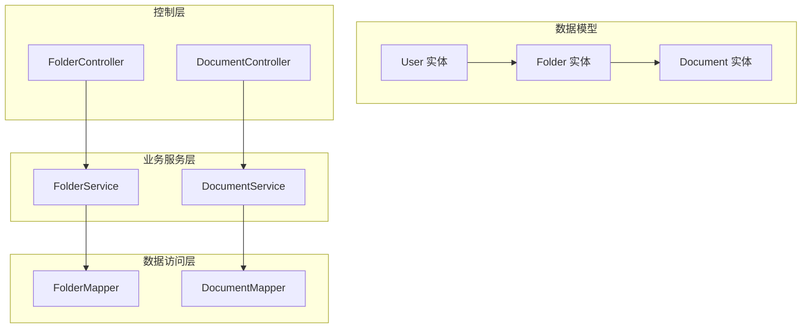
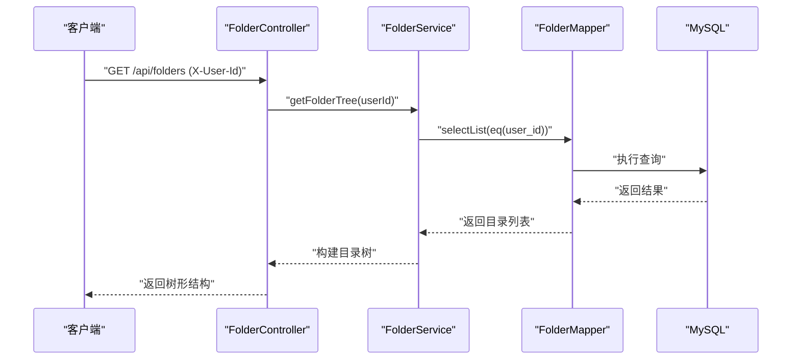
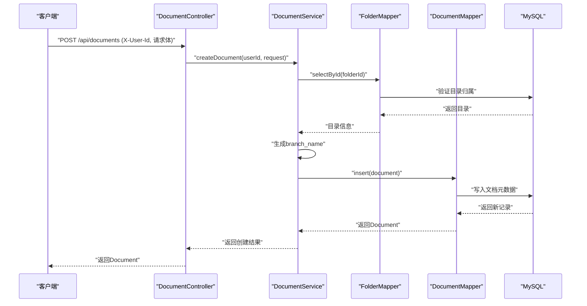
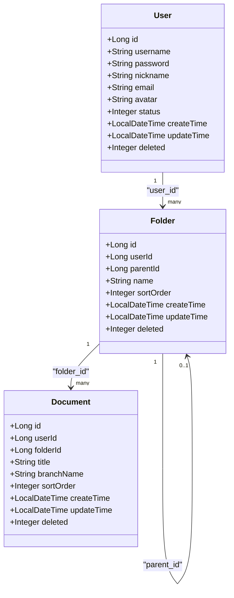
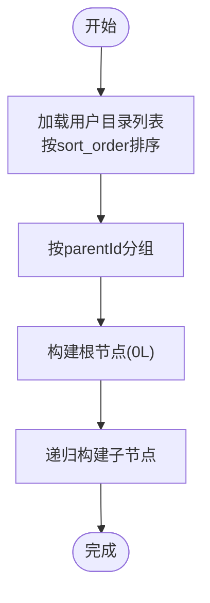
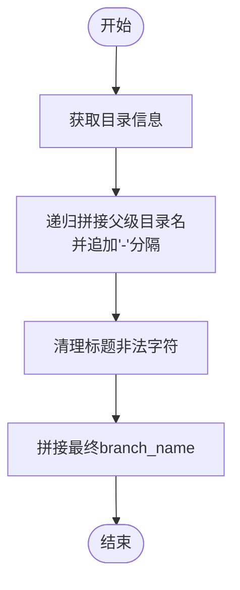
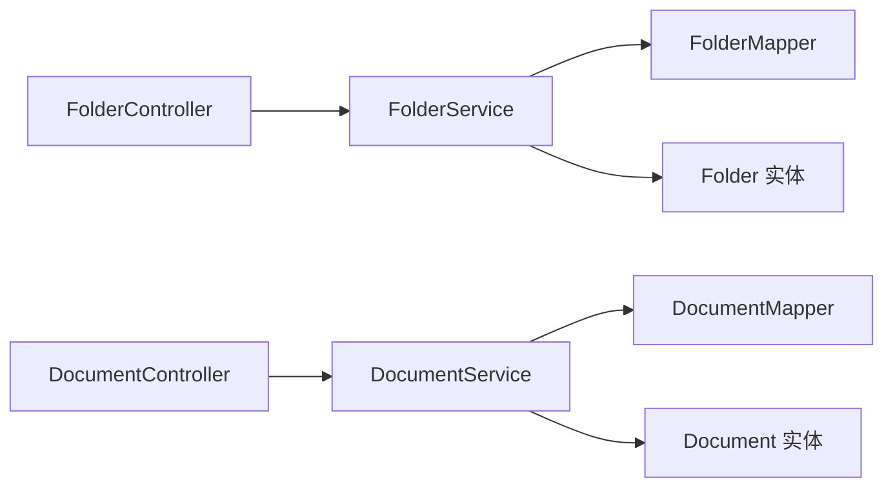

# 数据模型设计

<cite>
**本文引用的文件**
- [User.java](file://services/common/src/main/java/com/nonegonotes/common/entity/User.java)
- [Folder.java](file://services/common/src/main/java/com/nonegonotes/common/entity/Folder.java)
- [Document.java](file://services/common/src/main/java/com/nonegonotes/common/entity/Document.java)
- [init.sql](file://services/sql/init.sql)
- [FolderMapper.java](file://services/note-service/src/main/java/com/nonegonotes/note/mapper/FolderMapper.java)
- [DocumentMapper.java](file://services/note-service/src/main/java/com/nonegonotes/note/mapper/DocumentMapper.java)
- [FolderService.java](file://services/note-service/src/main/java/com/nonegonotes/note/service/FolderService.java)
- [DocumentService.java](file://services/note-service/src/main/java/com/nonegonotes/note/service/DocumentService.java)
- [FolderController.java](file://services/note-service/src/main/java/com/nonegonotes/note/controller/FolderController.java)
- [DocumentController.java](file://services/note-service/src/main/java/com/nonegonotes/note/controller/DocumentController.java)
- [FolderRequest.java](file://services/note-service/src/main/java/com/nonegonotes/note/dto/FolderRequest.java)
- [DocumentRequest.java](file://services/note-service/src/main/java/com/nonegonotes/note/dto/DocumentRequest.java)
- [FolderTreeNode.java](file://services/note-service/src/main/java/com/nonegonotes/note/dto/FolderTreeNode.java)
- [application.yml](file://services/note-service/src/main/resources/application.yml)
</cite>

## 目录
1. [简介](#简介)
2. [项目结构](#项目结构)
3. [核心组件](#核心组件)
4. [架构总览](#架构总览)
5. [详细组件分析](#详细组件分析)
6. [依赖分析](#依赖分析)
7. [性能考量](#性能考量)
8. [故障排查指南](#故障排查指南)
9. [结论](#结论)
10. [附录](#附录)

## 简介
本文件面向Woo项目的数据库与数据访问层，系统化梳理并设计数据模型，重点覆盖以下目标：
- 明确User（用户）、Folder（目录）、Document（文档）三实体的ER关系与字段定义
- 解释主键、外键、索引与参照完整性规则
- 阐述业务规则：用户与目录的一对多、目录与文档的父子层级、文档内容存储策略
- 提供数据库初始化脚本的使用说明与注释
- 说明基于MyBatis Plus的数据访问模式（CRUD、分页、条件查询）
- 给出数据安全、备份与性能优化建议
- 提供实际SQL示例与数据迁移路径

## 项目结构
围绕数据模型与访问层的关键文件组织如下：
- 实体层：User、Folder、Document（位于公共模块）
- 访问层：FolderMapper、DocumentMapper（MyBatis Plus Mapper）
- 服务层：FolderService、DocumentService（业务逻辑与校验）
- 控制器层：FolderController、DocumentController（REST接口）
- 配置与初始化：application.yml（数据源与MyBatis Plus配置）、init.sql（数据库初始化脚本）

图表来源
- [User.java:11-39](file://services/common/src/main/java/com/nonegonotes/common/entity/User.java#L11-L39)
- [Folder.java:12-38](file://services/common/src/main/java/com/nonegonotes/common/entity/Folder.java#L12-L38)
- [Document.java:12-41](file://services/common/src/main/java/com/nonegonotes/common/entity/Document.java#L12-L41)
- [FolderMapper.java:7-9](file://services/note-service/src/main/java/com/nonegonotes/note/mapper/FolderMapper.java#L7-L9)
- [DocumentMapper.java:7-9](file://services/note-service/src/main/java/com/nonegonotes/note/mapper/DocumentMapper.java#L7-L9)
- [FolderService.java:17-111](file://services/note-service/src/main/java/com/nonegonotes/note/service/FolderService.java#L17-L111)
- [DocumentService.java:15-115](file://services/note-service/src/main/java/com/nonegonotes/note/service/DocumentService.java#L15-L115)
- [FolderController.java:13-47](file://services/note-service/src/main/java/com/nonegonotes/note/controller/FolderController.java#L13-L47)
- [DocumentController.java:13-48](file://services/note-service/src/main/java/com/nonegonotes/note/controller/DocumentController.java#L13-L48)

章节来源
- [User.java:11-39](file://services/common/src/main/java/com/nonegonotes/common/entity/User.java#L11-L39)
- [Folder.java:12-38](file://services/common/src/main/java/com/nonegonotes/common/entity/Folder.java#L12-L38)
- [Document.java:12-41](file://services/common/src/main/java/com/nonegonotes/common/entity/Document.java#L12-L41)
- [FolderMapper.java:7-9](file://services/note-service/src/main/java/com/nonegonotes/note/mapper/FolderMapper.java#L7-L9)
- [DocumentMapper.java:7-9](file://services/note-service/src/main/java/com/nonegonotes/note/mapper/DocumentMapper.java#L7-L9)
- [FolderService.java:17-111](file://services/note-service/src/main/java/com/nonegonotes/note/service/FolderService.java#L17-L111)
- [DocumentService.java:15-115](file://services/note-service/src/main/java/com/nonegonotes/note/service/DocumentService.java#L15-L115)
- [FolderController.java:13-47](file://services/note-service/src/main/java/com/nonegonotes/note/controller/FolderController.java#L13-L47)
- [DocumentController.java:13-48](file://services/note-service/src/main/java/com/nonegonotes/note/controller/DocumentController.java#L13-L48)

## 核心组件
本节聚焦三实体的字段、类型、约束与索引，并解释其在业务上的角色。

- 用户表（sys_user）
  - 字段与类型：id（主键，BIGINT）、username（唯一，VARCHAR）、password（VARCHAR）、nickname（VARCHAR）、email（VARCHAR）、avatar（VARCHAR）、status（TINYINT）、create_time、update_time、deleted（逻辑删除）
  - 约束与索引：主键id；唯一索引uk_username(username)
  - 业务含义：标识系统用户，支持逻辑删除与状态管理

- 目录表（note_folder）
  - 字段与类型：id（主键，BIGINT）、user_id（外键，BIGINT）、parent_id（自引用外键，可空）、name（VARCHAR）、sort_order（INT）、create_time、update_time、deleted（逻辑删除）
  - 约束与索引：主键id；索引idx_user_id(user_id)；索引idx_parent_id(parent_id)
  - 业务含义：用户下的一棵目录树，支持父子层级与排序

- 文稿表（note_document）
  - 字段与类型：id（主键，BIGINT）、user_id（外键，BIGINT）、folder_id（外键，BIGINT）、title（VARCHAR）、branch_name（VARCHAR，用于Git分支名）、sort_order（INT）、create_time、update_time、deleted（逻辑删除）
  - 约引与索引：主键id；索引idx_user_id(user_id)；索引idx_folder_id(folder_id)
  - 业务含义：文档元数据，按目录组织，支持按更新时间倒序展示

章节来源
- [init.sql:9-23](file://services/sql/init.sql#L9-L23)
- [init.sql:25-38](file://services/sql/init.sql#L25-L38)
- [init.sql:40-54](file://services/sql/init.sql#L40-L54)

## 架构总览
数据模型与访问层的交互流程如下：

图表来源
- [FolderController.java:20-24](file://services/note-service/src/main/java/com/nonegonotes/note/controller/FolderController.java#L20-L24)
- [FolderService.java:26-33](file://services/note-service/src/main/java/com/nonegonotes/note/service/FolderService.java#L26-L33)
- [FolderMapper.java:7-9](file://services/note-service/src/main/java/com/nonegonotes/note/mapper/FolderMapper.java#L7-L9)

图表来源
- [DocumentController.java:27-31](file://services/note-service/src/main/java/com/nonegonotes/note/controller/DocumentController.java#L27-L31)
- [DocumentService.java:37-57](file://services/note-service/src/main/java/com/nonegonotes/note/service/DocumentService.java#L37-L57)
- [FolderMapper.java:7-9](file://services/note-service/src/main/java/com/nonegonotes/note/mapper/FolderMapper.java#L7-L9)
- [DocumentMapper.java:7-9](file://services/note-service/src/main/java/com/nonegonotes/note/mapper/DocumentMapper.java#L7-L9)

## 详细组件分析

### 实体类与字段定义
- User（用户）
  - 主键：id（ASSIGN_ID）
  - 关键字段：username（唯一）、password、nickname、email、avatar、status
  - 时间戳：createTime、updateTime（自动填充）
  - 逻辑删除：deleted（全局逻辑删除配置）

- Folder（目录）
  - 主键：id（ASSIGN_ID）
  - 外键：userId（指向sys_user.id）
  - 自引用：parentId（指向note_folder.id，顶级为空）
  - 元数据：name、sortOrder
  - 时间戳与逻辑删除同上

- Document（文档）
  - 主键：id（ASSIGN_ID）
  - 外键：userId（指向sys_user.id）、folderId（指向note_folder.id）
  - 元数据：title、branchName（用于Git分支名）、sortOrder
  - 时间戳与逻辑删除同上

章节来源
- [User.java:15-39](file://services/common/src/main/java/com/nonegonotes/common/entity/User.java#L15-L39)
- [Folder.java:15-38](file://services/common/src/main/java/com/nonegonotes/common/entity/Folder.java#L15-L38)
- [Document.java:15-41](file://services/common/src/main/java/com/nonegonotes/common/entity/Document.java#L15-L41)

### ER关系与参照完整性
- User → Folder：一对多（一个用户拥有多个目录），外键user_id引用sys_user.id
- Folder → Folder：自引用父子关系（parent_id → id），顶级目录parent_id为空
- Folder → Document：一对多（一个目录包含多个文档），外键folder_id引用note_folder.id
- Document → User：通过folder.user_id间接关联，确保文档归属一致性

章节来源
- [Folder.java:18-22](file://services/common/src/main/java/com/nonegonotes/common/entity/Folder.java#L18-L22)
- [Document.java:18-22](file://services/common/src/main/java/com/nonegonotes/common/entity/Document.java#L18-L22)
- [init.sql:26-38](file://services/sql/init.sql#L26-L38)
- [init.sql:40-54](file://services/sql/init.sql#L40-L54)

### 数据访问模式（MyBatis Plus）
- CRUD基础
  - FolderMapper/DocumentMapper继承BaseMapper，天然具备基本CRUD能力
  - FolderService/DocumentService通过LambdaQueryWrapper进行条件查询
- 条件查询
  - 目录树：按user_id过滤并按sort_order排序
  - 文档列表：按user_id与folder_id过滤并按update_time倒序
- 逻辑删除
  - 全局配置logic-delete-field=deleted，未删除值为0，删除值为1
- 分页查询
  - 可通过MyBatis Plus Page对象实现分页（需在Service层构造IPage并传入Mapper）

章节来源
- [FolderMapper.java:7-9](file://services/note-service/src/main/java/com/nonegonotes/note/mapper/FolderMapper.java#L7-L9)
- [DocumentMapper.java:7-9](file://services/note-service/src/main/java/com/nonegonotes/note/mapper/DocumentMapper.java#L7-L9)
- [FolderService.java:26-33](file://services/note-service/src/main/java/com/nonegonotes/note/service/FolderService.java#L26-L33)
- [DocumentService.java:25-32](file://services/note-service/src/main/java/com/nonegonotes/note/service/DocumentService.java#L25-L32)
- [application.yml:24-28](file://services/note-service/src/main/resources/application.yml#L24-L28)

### 业务规则与存储策略
- 用户与目录：一对一或多对一（由Folder.userId决定），通过user_id保证隔离
- 目录与文档：父子层级通过parent_id实现，文档通过folder_id归类
- 文档内容存储策略：当前实体仅保存元数据（title、branch_name等），内容通常以Git分支/仓库方式存储，branch_name由目录路径与标题组合生成并清洗非法字符

章节来源
- [DocumentService.java:76-106](file://services/note-service/src/main/java/com/nonegonotes/note/service/DocumentService.java#L76-L106)
- [Folder.java:21-22](file://services/common/src/main/java/com/nonegonotes/common/entity/Folder.java#L21-L22)
- [Document.java:21-22](file://services/common/src/main/java/com/nonegonotes/common/entity/Document.java#L21-L22)

### 初始化脚本与使用说明
- 脚本位置：services/sql/init.sql
- 步骤概要
  - 创建数据库non_ego_notes（utf8mb4字符集）
  - 使用该数据库
  - 依次创建sys_user、note_folder、note_document三张表
  - 建立必要索引（如idx_user_id、idx_parent_id、idx_folder_id）
- 注意事项
  - 字符集与排序规则：utf8mb4与utf8mb4_general_ci
  - 逻辑删除字段deleted默认0，全局配置中deleted=1表示已删除
  - 时间戳字段create_time/update_time使用CURRENT_TIMESTAMP与ON UPDATE CURRENT_TIMESTAMP

章节来源
- [init.sql:1-55](file://services/sql/init.sql#L1-L55)
- [application.yml:8-12](file://services/note-service/src/main/resources/application.yml#L8-L12)
- [application.yml:24-28](file://services/note-service/src/main/resources/application.yml#L24-L28)

### 数据库初始化脚本（逐段解析）
- 数据库创建与选择
  - 创建non_ego_notes数据库，设置字符集与排序规则
  - USE切换到该数据库
- sys_user表
  - 主键id；唯一索引uk_username(username)
  - 字段包含状态与逻辑删除
- note_folder表
  - 主键id；索引idx_user_id(user_id)；索引idx_parent_id(parent_id)
  - 支持顶级目录parent_id为NULL
- note_document表
  - 主键id；索引idx_user_id(user_id)；索引idx_folder_id(folder_id)
  - 包含branch_name用于Git分支命名

章节来源
- [init.sql:5-7](file://services/sql/init.sql#L5-L7)
- [init.sql:9-23](file://services/sql/init.sql#L9-L23)
- [init.sql:25-38](file://services/sql/init.sql#L25-L38)
- [init.sql:40-54](file://services/sql/init.sql#L40-L54)

### 类关系图（代码级）

图表来源
- [User.java:11-39](file://services/common/src/main/java/com/nonegonotes/common/entity/User.java#L11-L39)
- [Folder.java:12-38](file://services/common/src/main/java/com/nonegonotes/common/entity/Folder.java#L12-L38)
- [Document.java:12-41](file://services/common/src/main/java/com/nonegonotes/common/entity/Document.java#L12-L41)

### 目录树构建算法（流程图）

图表来源
- [FolderService.java:92-110](file://services/note-service/src/main/java/com/nonegonotes/note/service/FolderService.java#L92-L110)

### 文档分支名生成（流程图）

图表来源
- [DocumentService.java:79-106](file://services/note-service/src/main/java/com/nonegonotes/note/service/DocumentService.java#L79-L106)

## 依赖分析
- 控制器依赖服务：FolderController与DocumentController分别注入FolderService与DocumentService
- 服务依赖映射：FolderService与DocumentService分别注入FolderMapper与DocumentMapper
- 实体依赖：三实体均标注MyBatis Plus注解，映射至对应表

图表来源
- [FolderController.java:18-18](file://services/note-service/src/main/java/com/nonegonotes/note/controller/FolderController.java#L18-L18)
- [DocumentController.java:18-18](file://services/note-service/src/main/java/com/nonegonotes/note/controller/DocumentController.java#L18-L18)
- [FolderService.java:21-21](file://services/note-service/src/main/java/com/nonegonotes/note/service/FolderService.java#L21-L21)
- [DocumentService.java:19-20](file://services/note-service/src/main/java/com/nonegonotes/note/service/DocumentService.java#L19-L20)

章节来源
- [FolderController.java:18-18](file://services/note-service/src/main/java/com/nonegonotes/note/controller/FolderController.java#L18-L18)
- [DocumentController.java:18-18](file://services/note-service/src/main/java/com/nonegonotes/note/controller/DocumentController.java#L18-L18)
- [FolderService.java:21-21](file://services/note-service/src/main/java/com/nonegonotes/note/service/FolderService.java#L21-L21)
- [DocumentService.java:19-20](file://services/note-service/src/main/java/com/nonegonotes/note/service/DocumentService.java#L19-L20)

## 性能考量
- 索引策略
  - 目录表：idx_user_id、idx_parent_id，支撑按用户查询与父子遍历
  - 文档表：idx_user_id、idx_folder_id，支撑按用户与目录查询
- 查询优化
  - 使用LambdaQueryWrapper精准过滤，避免全表扫描
  - 目录树构建采用分组+递归，减少多次数据库往返
- 逻辑删除
  - 利用deleted字段避免物理删除，降低维护成本
- 连接池与日志
  - application.yml中配置Druid连接池与MyBatis日志输出，便于监控与调优

章节来源
- [init.sql:36-37](file://services/sql/init.sql#L36-L37)
- [init.sql:52-53](file://services/sql/init.sql#L52-L53)
- [application.yml:8-12](file://services/note-service/src/main/resources/application.yml#L8-L12)
- [application.yml:23-23](file://services/note-service/src/main/resources/application.yml#L23-L23)

## 故障排查指南
- 常见异常与定位
  - 目录/文档不存在：服务层在读取时校验归属，抛出业务异常
  - 用户名重复：注册时检查唯一索引uk_username
  - 密码错误/账号禁用：认证服务中进行密码校验与状态检查
- 日志与监控
  - 开启MyBatis日志StdOutImpl，便于观察SQL执行
  - Druid连接池监控可辅助排查连接与慢查询
- 修复建议
  - 对于重复用户名：提示用户更换用户名
  - 对于权限问题：确认请求头X-User-Id与资源归属一致
  - 对于性能问题：检查索引使用情况与查询条件是否命中索引

章节来源
- [DocumentService.java:108-114](file://services/note-service/src/main/java/com/nonegonotes/note/service/DocumentService.java#L108-L114)
- [FolderService.java:81-87](file://services/note-service/src/main/java/com/nonegonotes/note/service/FolderService.java#L81-L87)
- [AuthService.java:38-42](file://services/auth-service/src/main/java/com/nonegonotes/auth/service/AuthService.java#L38-L42)
- [AuthService.java:59-77](file://services/auth-service/src/main/java/com/nonegonotes/auth/service/AuthService.java#L59-L77)
- [application.yml:23-23](file://services/note-service/src/main/resources/application.yml#L23-L23)

## 结论
本设计文档基于现有实体与访问层代码，明确了User、Folder、Document三实体的ER关系、字段与索引设计，并结合MyBatis Plus的CRUD与条件查询能力，给出了目录树构建与文档分支名生成的业务实现路径。配合初始化脚本与配置文件，可快速搭建开发与生产环境。后续可在分页查询、复杂条件查询与缓存策略方面进一步优化。

## 附录

### 实际SQL示例（路径引用）
- 创建用户（插入sys_user）
  - 示例路径：[init.sql:10-23](file://services/sql/init.sql#L10-L23)
- 查询用户目录树（按user_id过滤并排序）
  - 示例路径：[FolderService.java:26-33](file://services/note-service/src/main/java/com/nonegonotes/note/service/FolderService.java#L26-L33)
- 查询目录下文档列表（按folder_id过滤并按更新时间倒序）
  - 示例路径：[DocumentService.java:25-32](file://services/note-service/src/main/java/com/nonegonotes/note/service/DocumentService.java#L25-L32)
- 生成Git分支名（目录路径+标题，非法字符替换）
  - 示例路径：[DocumentService.java:79-106](file://services/note-service/src/main/java/com/nonegonotes/note/service/DocumentService.java#L79-L106)

### 数据迁移路径建议
- 版本升级
  - 新增字段：先添加列并补全默认值，再建立索引，最后启用业务使用
  - 删除字段：先迁移数据至新结构，再删除旧列
- 索引变更
  - 大表新增索引：评估锁表与性能影响，选择低峰时段执行
- 逻辑删除
  - 启用逻辑删除后，查询需忽略deleted=1的记录，保持业务一致性