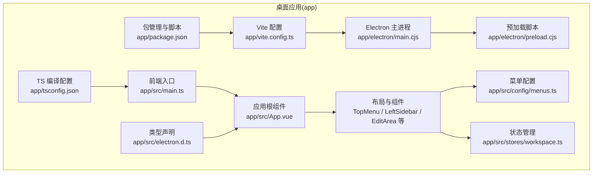
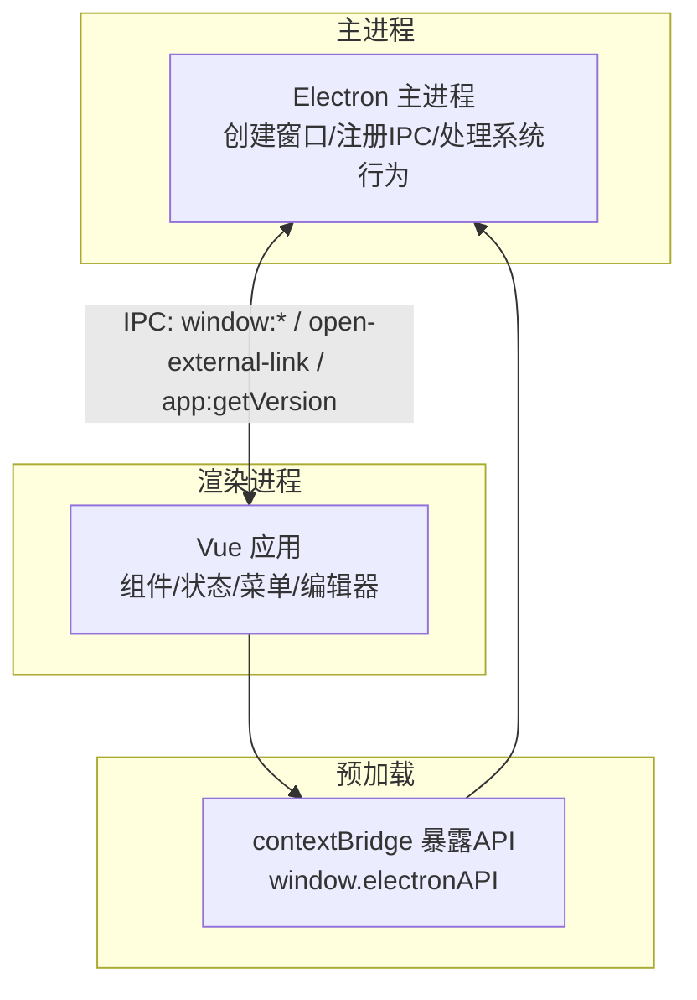
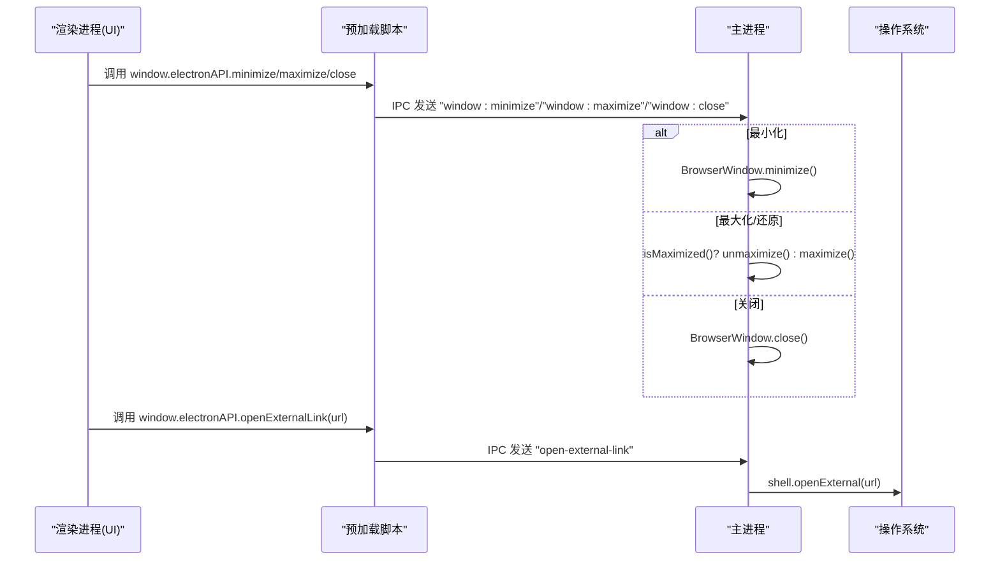
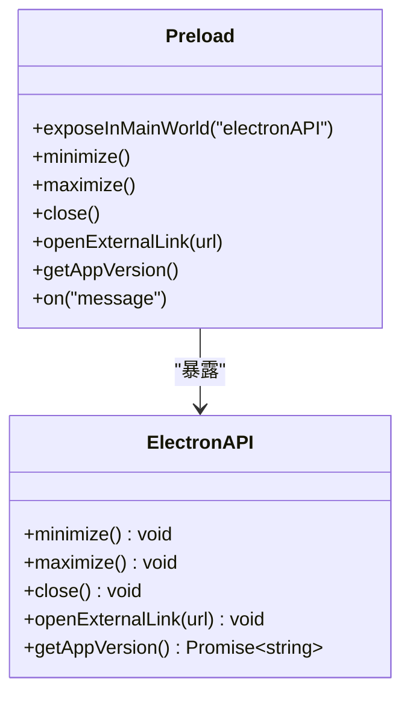
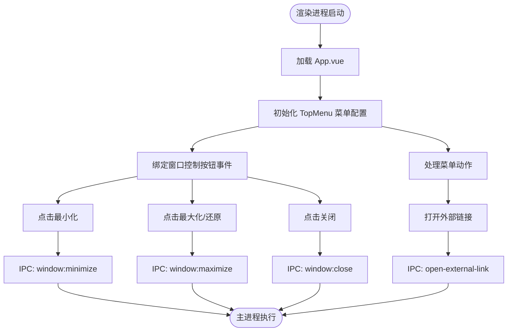
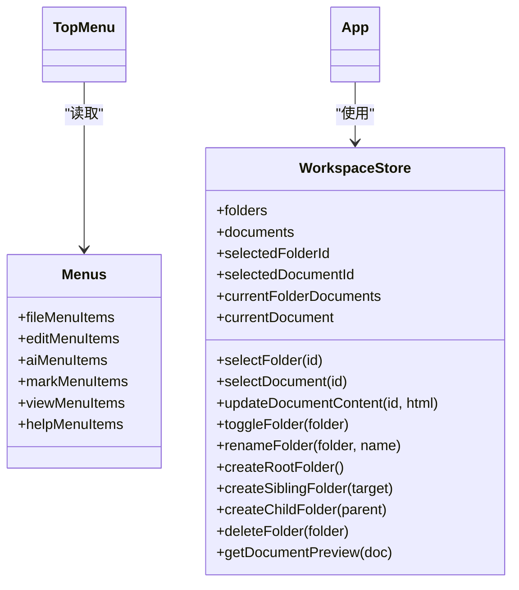
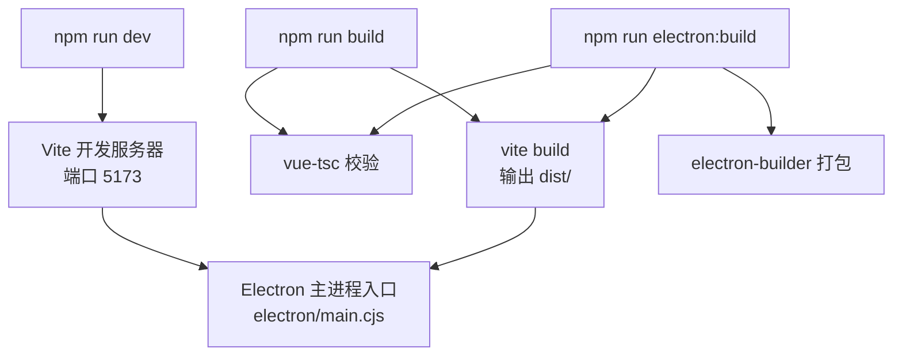
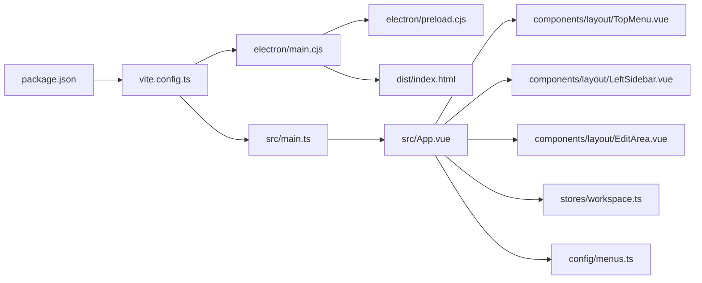

# 桌面应用功能

<cite>
**本文引用的文件**
- [app/electron/main.cjs](file://app/electron/main.cjs)
- [app/electron/preload.cjs](file://app/electron/preload.cjs)
- [app/src/electron.d.ts](file://app/src/electron.d.ts)
- [app/vite.config.ts](file://app/vite.config.ts)
- [app/package.json](file://app/package.json)
- [app/src/main.ts](file://app/src/main.ts)
- [app/src/App.vue](file://app/src/App.vue)
- [app/src/components/layout/TopMenu.vue](file://app/src/components/layout/TopMenu.vue)
- [app/src/components/layout/LeftSidebar.vue](file://app/src/components/layout/LeftSidebar.vue)
- [app/src/components/layout/EditArea.vue](file://app/src/components/layout/EditArea.vue)
- [app/src/stores/workspace.ts](file://app/src/stores/workspace.ts)
- [app/src/config/menus.ts](file://app/src/config/menus.ts)
- [app/tsconfig.json](file://app/tsconfig.json)
- [README.md](file://README.md)
</cite>

## 目录
1. [简介](#简介)
2. [项目结构](#项目结构)
3. [核心组件](#核心组件)
4. [架构总览](#架构总览)
5. [详细组件分析](#详细组件分析)
6. [依赖关系分析](#依赖关系分析)
7. [性能考量](#性能考量)
8. [故障排查指南](#故障排查指南)
9. [结论](#结论)
10. [附录](#附录)

## 简介
本文件面向Woo桌面应用的功能与实现，围绕Electron集成方案进行系统化说明，涵盖主进程配置、窗口管理与IPC通信机制；解释preload脚本的安全作用与API暴露策略；阐述窗口尺寸、最小化/最大化、全屏模式与多窗口支持现状；说明原生菜单集成、系统托盘与文件系统访问权限的现状与建议；梳理构建与打包流程（Vite配置、Electron插件与跨平台兼容性）；给出用户体验设计要点（拖拽、文件关联与系统集成）；并提供安全考虑（资源加载限制、权限控制与恶意文件防护）、调试技巧与性能优化建议。

## 项目结构
Woo桌面应用采用“前端（Vue 3 + Electron）+ 后端（Spring Boot 微服务）”分层架构。桌面应用位于 app/ 目录，核心由以下部分组成：
- Electron主进程与预加载脚本：app/electron/main.cjs、app/electron/preload.cjs
- 前端应用入口与UI组件：app/src/main.ts、app/src/App.vue、各业务组件与布局组件
- 菜单配置与状态管理：app/src/config/menus.ts、app/src/stores/workspace.ts
- 构建与打包配置：app/vite.config.ts、app/package.json
- 类型声明：app/src/electron.d.ts
- TypeScript编译配置：app/tsconfig.json
- 项目说明：README.md

图表来源
- [app/electron/main.cjs:1-71](file://app/electron/main.cjs#L1-L71)
- [app/electron/preload.cjs:1-18](file://app/electron/preload.cjs#L1-L18)
- [app/src/main.ts:1-8](file://app/src/main.ts#L1-L8)
- [app/src/App.vue:1-111](file://app/src/App.vue#L1-L111)
- [app/src/config/menus.ts:1-103](file://app/src/config/menus.ts#L1-L103)
- [app/src/stores/workspace.ts:1-321](file://app/src/stores/workspace.ts#L1-L321)
- [app/vite.config.ts:1-19](file://app/vite.config.ts#L1-L19)
- [app/package.json:1-38](file://app/package.json#L1-L38)
- [app/src/electron.d.ts:1-9](file://app/src/electron.d.ts#L1-L9)
- [app/tsconfig.json:1-25](file://app/tsconfig.json#L1-L25)

章节来源
- [README.md:1-72](file://README.md#L1-L72)
- [app/package.json:1-38](file://app/package.json#L1-L38)
- [app/vite.config.ts:1-19](file://app/vite.config.ts#L1-L19)
- [app/tsconfig.json:1-25](file://app/tsconfig.json#L1-L25)

## 核心组件
- Electron主进程：负责创建BrowserWindow、加载开发或生产页面、注册窗口控制与外部链接打开的IPC处理、应用生命周期管理。
- 预加载脚本：通过contextBridge安全地向渲染进程暴露有限API，屏蔽Node.js能力，仅暴露必要的窗口控制、外部链接与版本查询接口。
- 前端应用：基于Vue 3 + TypeScript，使用Pinia进行状态管理，组件化实现菜单、侧边栏、编辑区与设置对话框。
- 菜单系统：集中定义文件、编辑、AI、标记、查看、帮助等菜单项，供TopMenu组件使用。
- 状态管理：workspace store维护目录树、文稿列表与当前选中项，支撑编辑区内容同步与UI交互。
- 构建与打包：Vite + vite-plugin-electron 插件，结合electron-builder进行跨平台打包。

章节来源
- [app/electron/main.cjs:1-71](file://app/electron/main.cjs#L1-L71)
- [app/electron/preload.cjs:1-18](file://app/electron/preload.cjs#L1-L18)
- [app/src/App.vue:1-111](file://app/src/App.vue#L1-L111)
- [app/src/config/menus.ts:1-103](file://app/src/config/menus.ts#L1-L103)
- [app/src/stores/workspace.ts:1-321](file://app/src/stores/workspace.ts#L1-L321)
- [app/vite.config.ts:1-19](file://app/vite.config.ts#L1-L19)
- [app/package.json:1-38](file://app/package.json#L1-L38)

## 架构总览
桌面应用采用经典的“主进程 + 渲染进程 + 预加载桥接”的架构。主进程负责窗口生命周期与系统级能力（如打开外部链接），渲染进程承载UI与业务逻辑，预加载脚本作为安全边界，仅暴露受控API。

图表来源
- [app/electron/main.cjs:1-71](file://app/electron/main.cjs#L1-L71)
- [app/electron/preload.cjs:1-18](file://app/electron/preload.cjs#L1-L18)
- [app/src/App.vue:1-111](file://app/src/App.vue#L1-L111)

## 详细组件分析

### Electron主进程与窗口管理
- 窗口创建：设置窗口初始尺寸、最小宽高、无边框与隐藏标题栏、背景色，并启用预加载脚本与上下文隔离，禁用Node集成。
- 开发与生产加载：开发环境从本地Vite服务器加载，自动打开开发者工具；生产环境加载dist/index.html。
- 窗口控制IPC：接收渲染进程发送的最小化、最大化/还原、关闭指令；在主进程中执行对应操作。
- 外部链接：通过shell.openExternal在系统默认浏览器打开指定URL。
- 应用生命周期：应用就绪后创建窗口；macOS激活时若无窗口则重建；非macOS平台关闭所有窗口时退出应用。

图表来源
- [app/electron/main.cjs:33-58](file://app/electron/main.cjs#L33-L58)
- [app/electron/preload.cjs:6-12](file://app/electron/preload.cjs#L6-L12)

章节来源
- [app/electron/main.cjs:1-71](file://app/electron/main.cjs#L1-L71)

### 预加载脚本与安全边界
- 通过contextBridge.exposeInMainWorld在window对象上暴露受限API集合，包括窗口控制、外部链接打开与应用版本查询。
- 使用ipcRenderer.send与ipcRenderer.invoke分别进行单向通知与请求-响应式调用。
- 监听主进程消息用于调试与日志输出。

图表来源
- [app/electron/preload.cjs:4-13](file://app/electron/preload.cjs#L4-L13)
- [app/src/electron.d.ts:2-8](file://app/src/electron.d.ts#L2-L8)

章节来源
- [app/electron/preload.cjs:1-18](file://app/electron/preload.cjs#L1-L18)
- [app/src/electron.d.ts:1-9](file://app/src/electron.d.ts#L1-L9)

### 前端应用与窗口控制集成
- App.vue组织顶部菜单、左右侧边栏、缩略图列与编辑区的整体布局。
- TopMenu组件：
  - 集成原生菜单配置（文件/编辑/AI/标记/查看/帮助），通过Dropdown与DropdownMenu展示。
  - 提供窗口控制按钮（最小化、最大化、关闭），调用window.electronAPI执行。
  - 处理菜单动作，如打开外部链接、打开设置、切换右侧AI侧栏等。
- 左侧边栏与编辑区：
  - LeftSidebar提供目录树与右键菜单，支持新建/删除/重命名目录等操作。
  - EditArea集成Tiptap编辑器，实现Markdown编辑、快捷键、字数统计与状态栏显示。

图表来源
- [app/src/App.vue:1-111](file://app/src/App.vue#L1-L111)
- [app/src/components/layout/TopMenu.vue:111-147](file://app/src/components/layout/TopMenu.vue#L111-L147)
- [app/electron/main.cjs:33-58](file://app/electron/main.cjs#L33-L58)

章节来源
- [app/src/App.vue:1-111](file://app/src/App.vue#L1-L111)
- [app/src/components/layout/TopMenu.vue:1-223](file://app/src/components/layout/TopMenu.vue#L1-L223)
- [app/src/components/layout/LeftSidebar.vue:1-204](file://app/src/components/layout/LeftSidebar.vue#L1-L204)
- [app/src/components/layout/EditArea.vue:1-463](file://app/src/components/layout/EditArea.vue#L1-L463)

### 菜单系统与状态管理
- 菜单配置：menus.ts集中定义各类菜单项（含子菜单、分隔符与HTML内容支持），TopMenu组件读取并渲染。
- 状态管理：workspace.ts维护目录树、文稿列表与当前选中项，计算属性提供当前目录文稿列表与当前文稿；提供目录操作与文稿内容更新方法。

图表来源
- [app/src/config/menus.ts:1-103](file://app/src/config/menus.ts#L1-L103)
- [app/src/stores/workspace.ts:1-321](file://app/src/stores/workspace.ts#L1-L321)
- [app/src/components/layout/TopMenu.vue:63-76](file://app/src/components/layout/TopMenu.vue#L63-L76)

章节来源
- [app/src/config/menus.ts:1-103](file://app/src/config/menus.ts#L1-L103)
- [app/src/stores/workspace.ts:1-321](file://app/src/stores/workspace.ts#L1-L321)

### 构建与打包流程
- Vite配置：启用@vitejs/plugin-vue与vite-plugin-electron，指定Electron入口为electron/main.cjs；开发服务器端口5173；输出目录dist。
- 包管理脚本：dev/build/preview/electron:dev/electron:build；electron:build组合TypeScript校验、Vite构建与electron-builder打包。
- TypeScript配置：严格模式、模块解析bundler、允许TS扩展名、禁用输出以交由Vite处理。

图表来源
- [app/vite.config.ts:7-12](file://app/vite.config.ts#L7-L12)
- [app/package.json:6-12](file://app/package.json#L6-L12)
- [app/tsconfig.json:10-15](file://app/tsconfig.json#L10-L15)

章节来源
- [app/vite.config.ts:1-19](file://app/vite.config.ts#L1-L19)
- [app/package.json:1-38](file://app/package.json#L1-L38)
- [app/tsconfig.json:1-25](file://app/tsconfig.json#L1-L25)

## 依赖关系分析
- 主进程依赖：electron（app、BrowserWindow、ipcMain、shell）、路径解析、应用数据目录重定向。
- 预加载脚本依赖：electron（contextBridge、ipcRenderer）。
- 前端应用依赖：Vue 3、Pinia、Tiptap扩展集、自定义图标与UI组件。
- 构建依赖：Vite、@vitejs/plugin-vue、vite-plugin-electron、electron、electron-builder、TypeScript。

图表来源
- [app/package.json:27-37](file://app/package.json#L27-L37)
- [app/vite.config.ts:7-12](file://app/vite.config.ts#L7-L12)
- [app/electron/main.cjs:1-71](file://app/electron/main.cjs#L1-L71)
- [app/electron/preload.cjs:1-18](file://app/electron/preload.cjs#L1-L18)
- [app/src/main.ts:1-8](file://app/src/main.ts#L1-L8)
- [app/src/App.vue:1-111](file://app/src/App.vue#L1-L111)
- [app/src/components/layout/TopMenu.vue:1-223](file://app/src/components/layout/TopMenu.vue#L1-L223)
- [app/src/components/layout/LeftSidebar.vue:1-204](file://app/src/components/layout/LeftSidebar.vue#L1-L204)
- [app/src/components/layout/EditArea.vue:1-463](file://app/src/components/layout/EditArea.vue#L1-L463)
- [app/src/stores/workspace.ts:1-321](file://app/src/stores/workspace.ts#L1-L321)
- [app/src/config/menus.ts:1-103](file://app/src/config/menus.ts#L1-L103)

章节来源
- [app/package.json:1-38](file://app/package.json#L1-L38)
- [app/vite.config.ts:1-19](file://app/vite.config.ts#L1-L19)

## 性能考量
- 渲染进程资源：避免在渲染进程中直接执行重型计算，必要时通过Web Workers或主进程IPC分担。
- 编辑器性能：Tiptap编辑器扩展较多，注意在大型文档场景下减少不必要的扩展或延迟初始化。
- 状态同步：编辑器内容变更写回store需防抖，避免双向写入导致的性能抖动。
- 图标与样式：SVG图标按需加载，CSS变量减少重复计算；滚动条与主题切换尽量使用CSS过渡。
- 构建优化：利用Vite的按需加载与Tree Shaking；生产构建开启压缩与分包策略。

## 故障排查指南
- 开发调试
  - 开发环境自动打开开发者工具，可在控制台与网络面板检查IPC消息与资源加载。
  - 若窗口无法最大化/还原，检查主进程对BrowserWindow状态的判断逻辑。
- 外部链接
  - 若无法打开外部链接，确认主进程已注册“open-external-link”处理并调用shell.openExternal。
- 预加载API不可用
  - 检查预加载脚本是否正确暴露window.electronAPI，类型声明是否匹配。
- 构建失败
  - electron:build失败时先执行vue-tsc校验，再运行vite build，最后electron-builder。
- 生命周期问题
  - macOS激活无窗口时应重建；非macOS平台关闭所有窗口需退出应用。

章节来源
- [app/electron/main.cjs:26-31](file://app/electron/main.cjs#L26-L31)
- [app/electron/preload.cjs:16-18](file://app/electron/preload.cjs#L16-L18)
- [app/package.json:10-11](file://app/package.json#L10-L11)

## 结论
Woo桌面应用以Electron为核心，结合Vue 3与Tiptap实现了简洁而强大的Markdown编辑体验。主进程与预加载脚本共同构建了安全可控的IPC通道，前端通过菜单与编辑器组件提供高效的工作流。当前实现聚焦于窗口控制、菜单系统与编辑器集成，后续可在系统托盘、文件系统访问、多窗口支持与跨平台打包细节方面进一步完善。

## 附录

### 窗口管理现状与建议
- 现状：支持自定义边框、隐藏标题栏、最小化/最大化/关闭、外部链接打开、应用版本查询。
- 建议：增加全屏模式切换、多窗口支持（如新窗口打开文档）、窗口尺寸记忆与恢复、拖拽标题栏移动窗口。

章节来源
- [app/electron/main.cjs:10-23](file://app/electron/main.cjs#L10-L23)
- [app/electron/main.cjs:33-58](file://app/electron/main.cjs#L33-L58)

### 原生菜单、系统托盘与文件系统
- 原生菜单：已通过配置文件定义菜单项，渲染进程通过Dropdown组件展示；建议在主进程注册系统级菜单以提升一致性。
- 系统托盘：当前未实现；可参考Electron托盘API在主进程创建托盘并绑定菜单。
- 文件系统：当前未暴露文件系统API；如需访问文件系统，应在主进程实现受控IPC接口并通过预加载脚本暴露。

章节来源
- [app/src/config/menus.ts:1-103](file://app/src/config/menus.ts#L1-L103)
- [app/electron/main.cjs:55-58](file://app/electron/main.cjs#L55-L58)

### 安全考虑
- 上下文隔离：主进程webPreferences启用contextIsolation与禁用Node集成，预加载脚本通过contextBridge暴露受控API。
- 资源加载限制：生产环境加载本地dist/index.html，开发环境限定本地Vite地址。
- 权限控制：仅暴露必要IPC接口，避免在渲染进程直接访问系统能力。
- 恶意文件防护：对外部链接与文件操作进行白名单校验与沙箱策略。

章节来源
- [app/electron/main.cjs:18-22](file://app/electron/main.cjs#L18-L22)
- [app/electron/preload.cjs:4-13](file://app/electron/preload.cjs#L4-L13)

### 用户体验设计要点
- 拖拽支持：顶部菜单栏使用-webkit-app-region: drag实现拖拽，菜单区域禁用拖拽。
- 文件关联：当前未实现；可通过主进程监听协议或文件打开事件实现。
- 系统集成：建议在主进程注册Dock/任务栏菜单与快捷键，增强系统一致性。

章节来源
- [app/src/components/layout/TopMenu.vue:159-161](file://app/src/components/layout/TopMenu.vue#L159-L161)