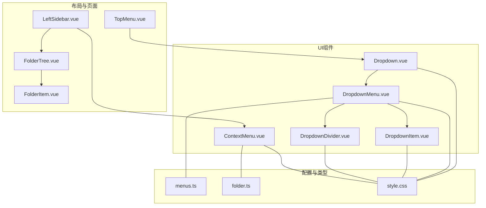
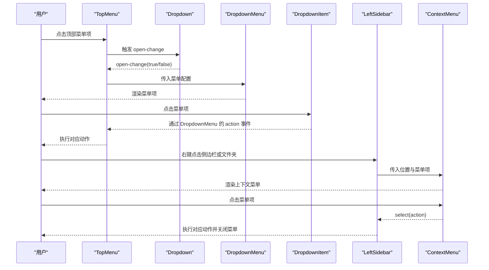
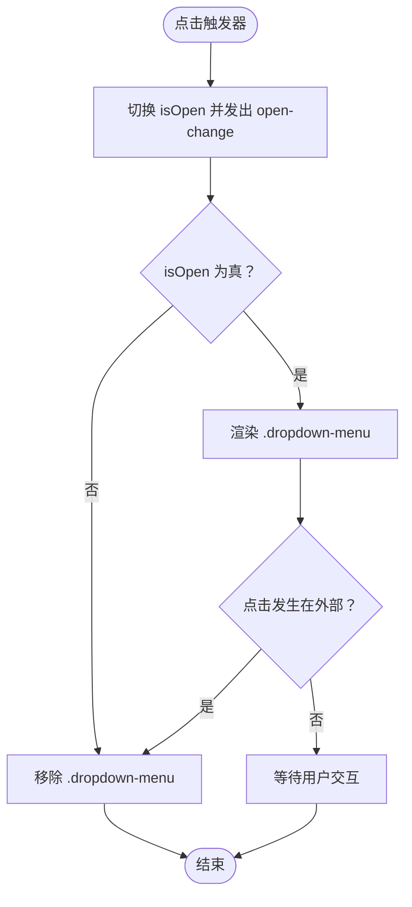
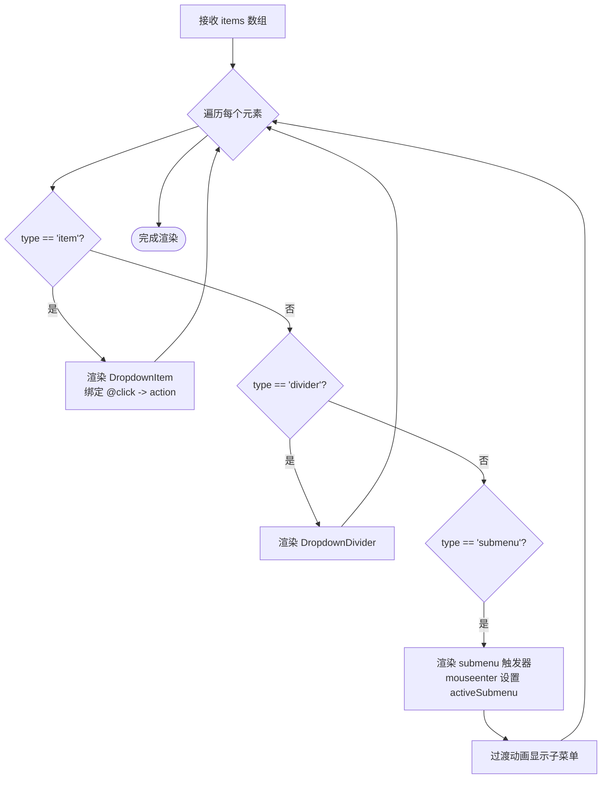
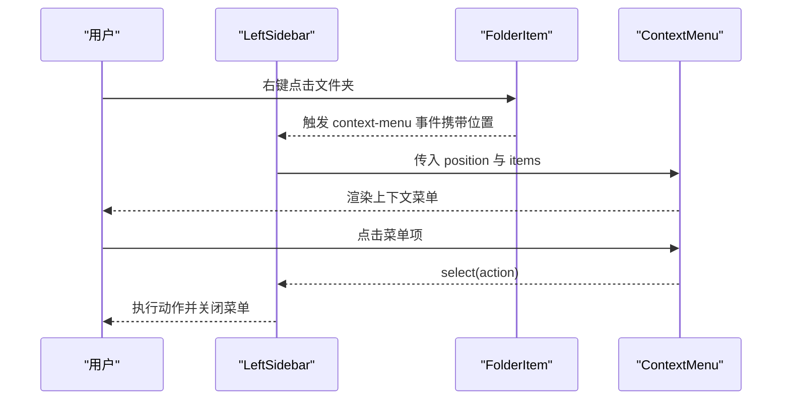
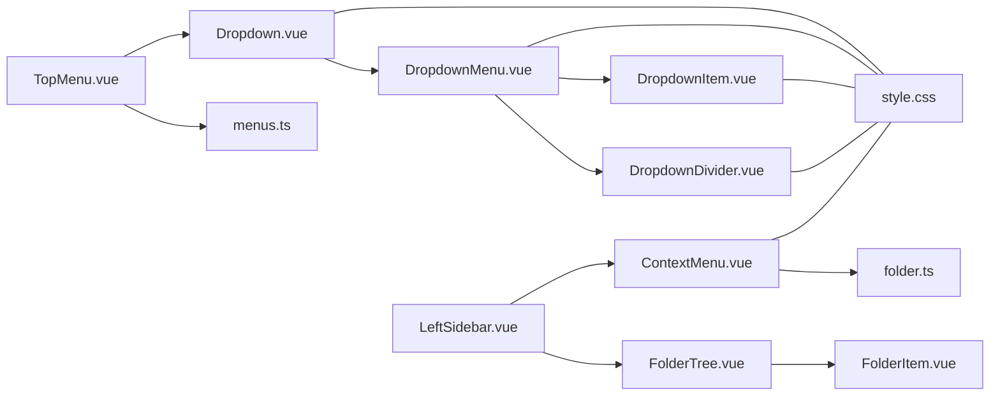

# UI组件库

<cite>
**本文档引用的文件**
- [Dropdown.vue](file://app/src/components/ui/Dropdown.vue)
- [DropdownMenu.vue](file://app/src/components/ui/DropdownMenu.vue)
- [DropdownItem.vue](file://app/src/components/ui/DropdownItem.vue)
- [DropdownDivider.vue](file://app/src/components/ui/DropdownDivider.vue)
- [ContextMenu.vue](file://app/src/components/ui/ContextMenu.vue)
- [TopMenu.vue](file://app/src/components/layout/TopMenu.vue)
- [LeftSidebar.vue](file://app/src/components/layout/LeftSidebar.vue)
- [FolderTree.vue](file://app/src/components/layout/FolderTree.vue)
- [FolderItem.vue](file://app/src/components/layout/FolderItem.vue)
- [menus.ts](file://app/src/config/menus.ts)
- [folder.ts](file://app/src/types/folder.ts)
- [style.css](file://app/src/style.css)
</cite>

## 目录
1. [简介](#简介)
2. [项目结构](#项目结构)
3. [核心组件](#核心组件)
4. [架构总览](#架构总览)
5. [详细组件分析](#详细组件分析)
6. [依赖关系分析](#依赖关系分析)
7. [性能考量](#性能考量)
8. [故障排查指南](#故障排查指南)
9. [结论](#结论)
10. [附录：使用示例与最佳实践](#附录使用示例与最佳实践)

## 简介
本文件面向Woo UI组件库中的下拉菜单与上下文菜单系统，系统性阐述以下内容：
- Dropdown主组件的触发机制、位置计算与状态管理
- DropdownMenu菜单容器的项目渲染、点击处理与键盘导航
- DropdownItem单项菜单的样式定制、禁用状态与图标集成
- DropdownDivider分割线的视觉设计与间距控制
- 上下文菜单ContextMenu的右键触发、动态定位与事件处理机制
- 组件的可访问性设计（ARIA标签、键盘快捷键支持与焦点管理）
- 样式定制方案、主题适配与响应式设计
- 使用示例、事件监听与状态同步的最佳实践
- 组件间的组合模式与扩展机制

## 项目结构
下拉与上下文菜单相关的核心文件位于 app/src/components/ui 与 app/src/components/layout 中，配合 app/src/config/menus.ts 的菜单配置与 app/src/types/folder.ts 的类型定义，形成完整的菜单体系。

图表来源
- [Dropdown.vue:1-88](file://app/src/components/ui/Dropdown.vue#L1-L88)
- [DropdownMenu.vue:1-115](file://app/src/components/ui/DropdownMenu.vue#L1-L115)
- [DropdownItem.vue:1-26](file://app/src/components/ui/DropdownItem.vue#L1-L26)
- [DropdownDivider.vue:1-12](file://app/src/components/ui/DropdownDivider.vue#L1-L12)
- [ContextMenu.vue:1-111](file://app/src/components/ui/ContextMenu.vue#L1-L111)
- [TopMenu.vue:1-262](file://app/src/components/layout/TopMenu.vue#L1-L262)
- [LeftSidebar.vue:1-204](file://app/src/components/layout/LeftSidebar.vue#L1-L204)
- [FolderTree.vue:1-49](file://app/src/components/layout/FolderTree.vue#L1-L49)
- [FolderItem.vue:1-85](file://app/src/components/layout/FolderItem.vue#L1-L85)
- [menus.ts:1-103](file://app/src/config/menus.ts#L1-L103)
- [folder.ts:1-19](file://app/src/types/folder.ts#L1-L19)
- [style.css:1-286](file://app/src/style.css#L1-L286)

章节来源
- [Dropdown.vue:1-88](file://app/src/components/ui/Dropdown.vue#L1-L88)
- [DropdownMenu.vue:1-115](file://app/src/components/ui/DropdownMenu.vue#L1-L115)
- [DropdownItem.vue:1-26](file://app/src/components/ui/DropdownItem.vue#L1-L26)
- [DropdownDivider.vue:1-12](file://app/src/components/ui/DropdownDivider.vue#L1-L12)
- [ContextMenu.vue:1-111](file://app/src/components/ui/ContextMenu.vue#L1-L111)
- [TopMenu.vue:1-262](file://app/src/components/layout/TopMenu.vue#L1-L262)
- [LeftSidebar.vue:1-204](file://app/src/components/layout/LeftSidebar.vue#L1-L204)
- [FolderTree.vue:1-49](file://app/src/components/layout/FolderTree.vue#L1-L49)
- [FolderItem.vue:1-85](file://app/src/components/layout/FolderItem.vue#L1-L85)
- [menus.ts:1-103](file://app/src/config/menus.ts#L1-L103)
- [folder.ts:1-19](file://app/src/types/folder.ts#L1-L19)
- [style.css:1-286](file://app/src/style.css#L1-L286)

## 核心组件
- Dropdown：提供触发器与下拉容器，负责开关状态、外部点击关闭与暴露方法（如 close、toggle），并发出 open-change 事件。
- DropdownMenu：根据菜单配置渲染菜单项、分隔线与子菜单，处理点击事件冒泡与子菜单展开。
- DropdownItem：单个菜单项，提供点击事件与基础样式。
- DropdownDivider：菜单分隔线，统一视觉与间距。
- ContextMenu：上下文菜单，基于鼠标右键触发，动态计算位置并确保不越界，支持禁用项与点击关闭。

章节来源
- [Dropdown.vue:1-88](file://app/src/components/ui/Dropdown.vue#L1-L88)
- [DropdownMenu.vue:1-115](file://app/src/components/ui/DropdownMenu.vue#L1-L115)
- [DropdownItem.vue:1-26](file://app/src/components/ui/DropdownItem.vue#L1-L26)
- [DropdownDivider.vue:1-12](file://app/src/components/ui/DropdownDivider.vue#L1-L12)
- [ContextMenu.vue:1-111](file://app/src/components/ui/ContextMenu.vue#L1-L111)

## 架构总览
下拉菜单与上下文菜单在应用中的典型交互路径如下：

图表来源
- [TopMenu.vue:1-262](file://app/src/components/layout/TopMenu.vue#L1-L262)
- [Dropdown.vue:1-88](file://app/src/components/ui/Dropdown.vue#L1-L88)
- [DropdownMenu.vue:1-115](file://app/src/components/ui/DropdownMenu.vue#L1-L115)
- [DropdownItem.vue:1-26](file://app/src/components/ui/DropdownItem.vue#L1-L26)
- [LeftSidebar.vue:1-204](file://app/src/components/layout/LeftSidebar.vue#L1-L204)
- [ContextMenu.vue:1-111](file://app/src/components/ui/ContextMenu.vue#L1-L111)

## 详细组件分析

### Dropdown 主组件
- 触发机制：提供 .dropdown-trigger 区域，点击后切换内部 isOpen 状态并通过 open-change 事件向外广播。
- 状态管理：内部使用 ref 控制 isOpen，暴露 close 与 toggle 方法供父组件调用。
- 外部点击关闭：在 mounted 时注册 document 点击事件，若点击目标不在 .dropdown 内则关闭菜单。
- 定位与样式：容器为相对定位，菜单为绝对定位，顶部紧贴触发器下方，具备圆角、阴影与主题变量支持。

图表来源
- [Dropdown.vue:1-88](file://app/src/components/ui/Dropdown.vue#L1-L88)

章节来源
- [Dropdown.vue:1-88](file://app/src/components/ui/Dropdown.vue#L1-L88)

### DropdownMenu 菜单容器
- 渲染逻辑：遍历传入的菜单配置数组，根据 type 渲染普通项、分隔线或子菜单。
- 子菜单展开：通过 mouseenter/mouseleave 管理 activeSubmenu，结合过渡动画实现展开/收起。
- 事件传播：子菜单项点击通过 action 事件向上冒泡，父组件统一处理。
- 定位策略：作为子菜单时，使用绝对定位在右侧展开，层级高于主菜单。

图表来源
- [DropdownMenu.vue:1-115](file://app/src/components/ui/DropdownMenu.vue#L1-L115)
- [menus.ts:1-103](file://app/src/config/menus.ts#L1-L103)

章节来源
- [DropdownMenu.vue:1-115](file://app/src/components/ui/DropdownMenu.vue#L1-L115)
- [menus.ts:1-103](file://app/src/config/menus.ts#L1-L103)

### DropdownItem 单项菜单
- 基础行为：提供点击事件，内部使用插槽承载内容。
- 样式特性：统一的内边距、字号、颜色与悬停背景色，使用主题变量保证一致性。
- 禁用状态：当前组件未内置禁用属性，可在上层容器通过条件渲染或样式类实现禁用态。

章节来源
- [DropdownItem.vue:1-26](file://app/src/components/ui/DropdownItem.vue#L1-L26)

### DropdownDivider 分割线
- 视觉设计：固定高度与背景色，左右留白，使用主题变量实现高对比度。
- 间距控制：上下留白统一，便于与菜单项间距一致。

章节来源
- [DropdownDivider.vue:1-12](file://app/src/components/ui/DropdownDivider.vue#L1-L12)

### ContextMenu 上下文菜单
- 右键触发：在目标元素上监听 contextmenu 事件，阻止默认行为并传递位置信息。
- 动态定位：根据菜单项数量计算高度，检测窗口边界，自动调整 x/y 以确保可见性。
- 事件处理：支持 select 与 close 事件，父组件据此执行业务逻辑并关闭菜单。
- 禁用项：支持 disabled 字段，禁用项不可点击且呈现不同视觉状态。

图表来源
- [LeftSidebar.vue:1-204](file://app/src/components/layout/LeftSidebar.vue#L1-L204)
- [FolderItem.vue:1-85](file://app/src/components/layout/FolderItem.vue#L1-L85)
- [ContextMenu.vue:1-111](file://app/src/components/ui/ContextMenu.vue#L1-L111)
- [folder.ts:1-19](file://app/src/types/folder.ts#L1-L19)

章节来源
- [ContextMenu.vue:1-111](file://app/src/components/ui/ContextMenu.vue#L1-L111)
- [LeftSidebar.vue:1-204](file://app/src/components/layout/LeftSidebar.vue#L1-L204)
- [FolderItem.vue:1-85](file://app/src/components/layout/FolderItem.vue#L1-L85)
- [folder.ts:1-19](file://app/src/types/folder.ts#L1-L19)

## 依赖关系分析
- 组件耦合
  - TopMenu 依赖 Dropdown 与 DropdownMenu，负责菜单配置与动作分发。
  - LeftSidebar 依赖 ContextMenu、FolderTree 与 FolderItem，负责右键菜单状态与动作执行。
  - DropdownMenu 依赖 DropdownItem 与 DropdownDivider，以及 menus.ts 的菜单配置。
  - ContextMenu 依赖 folder.ts 的位置与菜单项类型定义。
- 主题与样式
  - 所有组件均使用 CSS 变量（如 --bg-elevated、--text-primary、--shadow-dropdown），由 style.css 提供日/夜两套主题。
- 外部依赖
  - Vue 生态（setup、ref、computed、onMounted、onBeforeUnmount 等）

图表来源
- [TopMenu.vue:1-262](file://app/src/components/layout/TopMenu.vue#L1-L262)
- [Dropdown.vue:1-88](file://app/src/components/ui/Dropdown.vue#L1-L88)
- [DropdownMenu.vue:1-115](file://app/src/components/ui/DropdownMenu.vue#L1-L115)
- [DropdownItem.vue:1-26](file://app/src/components/ui/DropdownItem.vue#L1-L26)
- [DropdownDivider.vue:1-12](file://app/src/components/ui/DropdownDivider.vue#L1-L12)
- [LeftSidebar.vue:1-204](file://app/src/components/layout/LeftSidebar.vue#L1-L204)
- [ContextMenu.vue:1-111](file://app/src/components/ui/ContextMenu.vue#L1-L111)
- [FolderTree.vue:1-49](file://app/src/components/layout/FolderTree.vue#L1-L49)
- [FolderItem.vue:1-85](file://app/src/components/layout/FolderItem.vue#L1-L85)
- [menus.ts:1-103](file://app/src/config/menus.ts#L1-L103)
- [folder.ts:1-19](file://app/src/types/folder.ts#L1-L19)
- [style.css:1-286](file://app/src/style.css#L1-L286)

章节来源
- [TopMenu.vue:1-262](file://app/src/components/layout/TopMenu.vue#L1-L262)
- [Dropdown.vue:1-88](file://app/src/components/ui/Dropdown.vue#L1-L88)
- [DropdownMenu.vue:1-115](file://app/src/components/ui/DropdownMenu.vue#L1-L115)
- [DropdownItem.vue:1-26](file://app/src/components/ui/DropdownItem.vue#L1-L26)
- [DropdownDivider.vue:1-12](file://app/src/components/ui/DropdownDivider.vue#L1-L12)
- [LeftSidebar.vue:1-204](file://app/src/components/layout/LeftSidebar.vue#L1-L204)
- [ContextMenu.vue:1-111](file://app/src/components/ui/ContextMenu.vue#L1-L111)
- [FolderTree.vue:1-49](file://app/src/components/layout/FolderTree.vue#L1-L49)
- [FolderItem.vue:1-85](file://app/src/components/layout/FolderItem.vue#L1-L85)
- [menus.ts:1-103](file://app/src/config/menus.ts#L1-L103)
- [folder.ts:1-19](file://app/src/types/folder.ts#L1-L19)
- [style.css:1-286](file://app/src/style.css#L1-L286)

## 性能考量
- DOM 事件绑定
  - Dropdown 在 mounted 时仅绑定一次 document 点击事件，卸载时解绑，避免内存泄漏。
  - ContextMenu 在挂载后延迟绑定点击事件，减少初始渲染压力。
- 渲染优化
  - DropdownMenu 使用 v-for 遍历菜单项，key 为索引；建议在实际使用中为每个菜单项提供稳定唯一 key，提升重排效率。
  - 子菜单展开使用过渡动画，建议保持动画时长与缓动函数简洁，避免复杂滤镜或大尺寸阴影导致掉帧。
- 主题切换
  - style.css 使用 CSS 变量，主题切换只需修改根节点属性，对组件性能影响极小。

[本节为通用指导，无需列出章节来源]

## 故障排查指南
- 下拉菜单无法关闭
  - 检查是否正确阻止了事件冒泡（Dropdown.vue 中 @click.stop 与 handleClickOutside 的判断）。
  - 确认父组件未拦截 open-change 事件导致状态不同步。
- 子菜单不显示
  - 确认 mouseenter/mouseleave 事件是否被覆盖，activeSubmenu 是否被正确设置。
  - 检查 is-submenu 类名与子菜单容器的绝对定位是否生效。
- 上下文菜单越界
  - 检查 ContextMenu 的 menuStyle 计算逻辑，确认菜单宽度与高度估算是否准确。
  - 确认 window.innerWidth/InnerHeight 是否可用（在某些 iframe 或特殊环境下可能受限）。
- 禁用项仍可点击
  - 确认 ContextMenu 对 disabled 的判断与样式类应用是否正确。
- 样式异常
  - 检查 style.css 中的主题变量是否正确设置，组件是否正确使用了 CSS 变量。

章节来源
- [Dropdown.vue:1-88](file://app/src/components/ui/Dropdown.vue#L1-L88)
- [DropdownMenu.vue:1-115](file://app/src/components/ui/DropdownMenu.vue#L1-L115)
- [ContextMenu.vue:1-111](file://app/src/components/ui/ContextMenu.vue#L1-L111)
- [style.css:1-286](file://app/src/style.css#L1-L286)

## 结论
Woo UI 的下拉与上下文菜单组件通过清晰的职责划分与主题变量驱动，实现了良好的可维护性与可扩展性。Dropdown 与 DropdownMenu 提供了灵活的菜单渲染与事件传播机制，ContextMenu 则针对右键场景提供了边界感知与禁用项支持。结合 menus.ts 的配置与 TopMenu/LeftSidebar 的使用示例，开发者可以快速构建复杂的菜单系统，并通过主题变量与样式定制满足不同设计需求。

[本节为总结性内容，无需列出章节来源]

## 附录：使用示例与最佳实践

### 使用示例
- 顶部菜单（下拉菜单）
  - 在 TopMenu 中通过 v-for 渲染多个 Dropdown，每个 Dropdown 内部嵌套 DropdownMenu，并监听 action 事件进行业务处理。
  - 参考路径：[TopMenu.vue:1-262](file://app/src/components/layout/TopMenu.vue#L1-L262)，[Dropdown.vue:1-88](file://app/src/components/ui/Dropdown.vue#L1-L88)，[DropdownMenu.vue:1-115](file://app/src/components/ui/DropdownMenu.vue#L1-L115)，[menus.ts:1-103](file://app/src/config/menus.ts#L1-L103)
- 右键菜单（上下文菜单）
  - 在 LeftSidebar 中监听空白区域与文件夹的右键事件，构造 ContextMenu 的 position 与 items，处理 select 事件并关闭菜单。
  - 参考路径：[LeftSidebar.vue:1-204](file://app/src/components/layout/LeftSidebar.vue#L1-L204)，[ContextMenu.vue:1-111](file://app/src/components/ui/ContextMenu.vue#L1-L111)，[FolderItem.vue:1-85](file://app/src/components/layout/FolderItem.vue#L1-L85)，[folder.ts:1-19](file://app/src/types/folder.ts#L1-L19)

### 事件监听与状态同步
- 下拉菜单
  - 监听 open-change 事件，确保同一时间仅有一个菜单处于打开状态（TopMenu 中的 activeMenuIndex 与 dropdownRefs 管理）。
  - 参考路径：[TopMenu.vue:105-122](file://app/src/components/layout/TopMenu.vue#L105-L122)，[Dropdown.vue:18-34](file://app/src/components/ui/Dropdown.vue#L18-L34)
- 上下文菜单
  - 监听 select 与 close 事件，执行业务逻辑并及时关闭菜单，避免状态残留。
  - 参考路径：[LeftSidebar.vue:104-127](file://app/src/components/layout/LeftSidebar.vue#L104-L127)，[ContextMenu.vue:28-79](file://app/src/components/ui/ContextMenu.vue#L28-L79)

### 样式定制与主题适配
- 主题变量
  - 使用 style.css 中的 CSS 变量（如 --bg-elevated、--text-primary、--shadow-dropdown）统一控制背景、文字与阴影。
  - 参考路径：[style.css:1-286](file://app/src/style.css#L1-L286)
- 自定义尺寸与间距
  - 通过修改 .dropdown-menu、.dropdown-item、.dropdown-divider 的内边距与字号，适配不同设计规范。
  - 参考路径：[Dropdown.vue:64-86](file://app/src/components/ui/Dropdown.vue#L64-L86)，[DropdownMenu.vue:64-114](file://app/src/components/ui/DropdownMenu.vue#L64-L114)，[DropdownItem.vue:13-25](file://app/src/components/ui/DropdownItem.vue#L13-L25)，[DropdownDivider.vue:5-11](file://app/src/components/ui/DropdownDivider.vue#L5-L11)，[ContextMenu.vue:82-110](file://app/src/components/ui/ContextMenu.vue#L82-L110)
- 图标集成
  - 在 DropdownItem 插槽中放置图标组件，保持与文本的对齐与间距一致。
  - 参考路径：[TopMenu.vue:5-8](file://app/src/components/layout/TopMenu.vue#L5-L8)

### 键盘导航与可访问性
- 当前实现
  - DropdownMenu 未内置键盘导航与焦点管理；ContextMenu 未内置键盘快捷键。
- 建议增强
  - 为 DropdownMenu 添加键盘事件（如 Tab、Enter、ArrowUp/Down）以支持键盘操作。
  - 为 ContextMenu 添加 ARIA 属性（role="menu"、role="menuitem"）与 aria-disabled，提升屏幕阅读器支持。
  - 为菜单容器添加 tabindex 与 focus/blur 事件，确保首次聚焦到首个菜单项。

[本节为通用指导，无需列出章节来源]