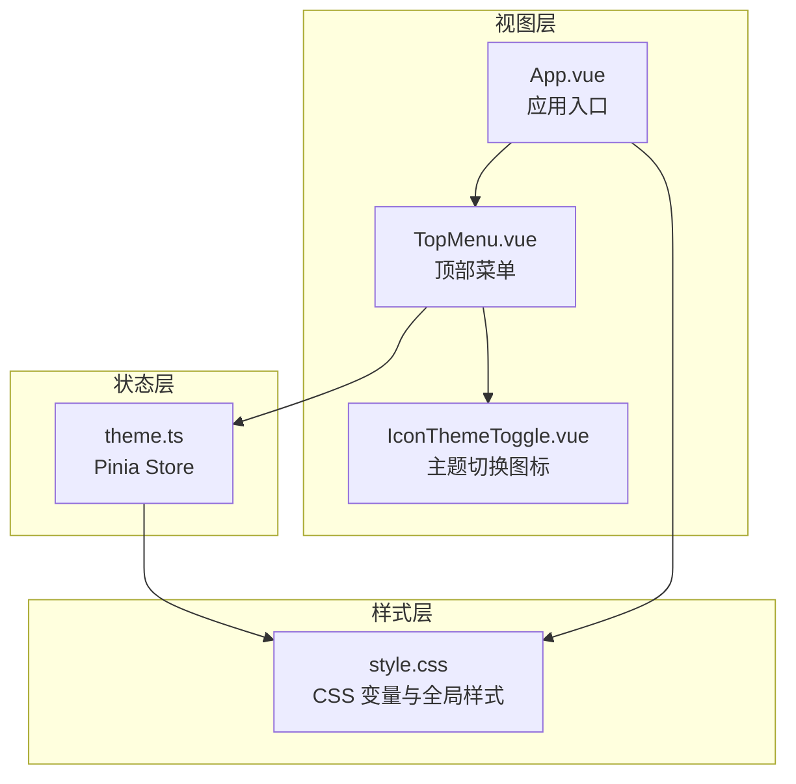
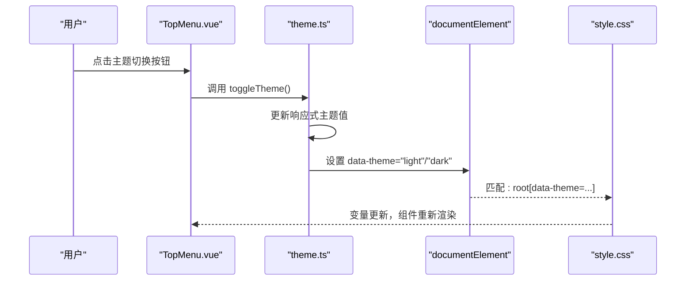
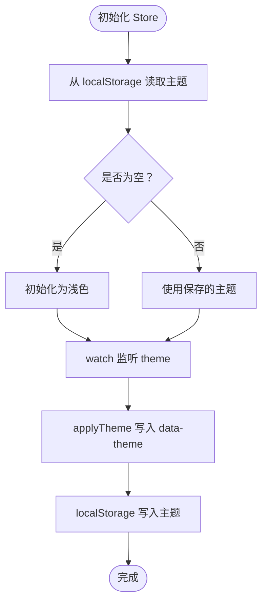
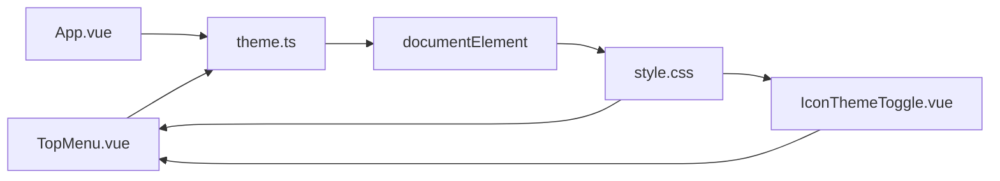

# 主题系统

<cite>
**本文引用的文件**
- [theme.ts](file://app/src/stores/theme.ts)
- [style.css](file://app/src/style.css)
- [App.vue](file://app/src/App.vue)
- [TopMenu.vue](file://app/src/components/layout/TopMenu.vue)
- [IconThemeToggle.vue](file://app/src/components/icons/IconThemeToggle.vue)
- [SettingsDialog.vue](file://app/src/components/layout/SettingsDialog.vue)
</cite>

## 目录
1. [简介](#简介)
2. [项目结构](#项目结构)
3. [核心组件](#核心组件)
4. [架构总览](#架构总览)
5. [详细组件分析](#详细组件分析)
6. [依赖关系分析](#依赖关系分析)
7. [性能考量](#性能考量)
8. [故障排除指南](#故障排除指南)
9. [结论](#结论)
10. [附录](#附录)

## 简介
本文件系统性梳理并说明 Woo 应用的主题系统，重点覆盖以下方面：
- 深色/浅色主题切换机制：主题状态管理、CSS 变量系统与动态样式更新
- 主题存储（theme.ts）的状态结构、切换逻辑与持久化机制
- CSS 变量的设计规范：颜色、字体、间距、阴影等命名约定
- 主题切换实现原理：CSS 变量动态更新、过渡动画与浏览器兼容性
- 主题系统的扩展机制：自定义主题添加、颜色方案定制与品牌色彩集成
- 使用示例、性能优化策略与用户体验设计原则
- 调试方法、故障排除与最佳实践建议

## 项目结构
主题系统由三层组成：
- 状态层：Pinia Store 管理主题状态与持久化
- 视图层：Vue 组件通过响应式绑定读取状态并触发切换
- 样式层：CSS 变量在根节点根据主题属性动态生效



图表来源
- [theme.ts:1-31](file://app/src/stores/theme.ts#L1-L31)
- [App.vue:37-49](file://app/src/App.vue#L37-L49)
- [TopMenu.vue:30-32](file://app/src/components/layout/TopMenu.vue#L30-L32)
- [IconThemeToggle.vue:32-41](file://app/src/components/icons/IconThemeToggle.vue#L32-L41)
- [style.css:6-142](file://app/src/style.css#L6-L142)

章节来源
- [theme.ts:1-31](file://app/src/stores/theme.ts#L1-L31)
- [style.css:6-142](file://app/src/style.css#L6-L142)
- [App.vue:37-49](file://app/src/App.vue#L37-L49)
- [TopMenu.vue:30-32](file://app/src/components/layout/TopMenu.vue#L30-L32)
- [IconThemeToggle.vue:32-41](file://app/src/components/icons/IconThemeToggle.vue#L32-L41)

## 核心组件
- 主题 Store（theme.ts）
  - 类型：ThemeMode（'light' | 'dark'）
  - 状态：响应式 ref，初始值从本地存储读取，若未设置则默认浅色
  - 方法：toggleTheme 切换主题；applyTheme 将 data-theme 属性写入 documentElement
  - 持久化：通过 watch 监听主题变化，同步更新 data-theme 并写入 localStorage
- 全局样式（style.css）
  - 在 :root 与 :root[data-theme="light"/"dark"] 下分别定义两套 CSS 变量
  - body 与大量组件样式使用 var(--xxx) 引用变量，实现主题驱动
  - 定义过渡变量以统一动画时长与缓动
- 应用入口（App.vue）
  - 在挂载时初始化主题 Store，确保 data-theme 属性在应用启动时就绪
- 顶部菜单（TopMenu.vue）
  - 通过按钮点击触发 themeStore.toggleTheme()
  - 图标根据当前主题模式渲染太阳或月亮
- 主题切换图标（IconThemeToggle.vue）
  - 接收 mode 属性，按模式渲染不同 SVG

章节来源
- [theme.ts:8-30](file://app/src/stores/theme.ts#L8-L30)
- [style.css:6-142](file://app/src/style.css#L6-L142)
- [App.vue:48-49](file://app/src/App.vue#L48-L49)
- [TopMenu.vue:30-32](file://app/src/components/layout/TopMenu.vue#L30-L32)
- [IconThemeToggle.vue:12-27](file://app/src/components/icons/IconThemeToggle.vue#L12-L27)

## 架构总览
主题系统采用“状态驱动样式”的架构，核心流程如下：
- 初始化阶段：应用启动即读取本地存储并设置 documentElement 的 data-theme
- 用户交互：点击顶部菜单的主题切换按钮
- 状态变更：Store 内部切换主题值
- 样式更新：watch 自动将新主题写入 data-theme，CSS 变量随之生效
- 视觉反馈：所有组件基于 CSS 变量渲染，自动呈现对应主题



图表来源
- [TopMenu.vue:30-32](file://app/src/components/layout/TopMenu.vue#L30-L32)
- [theme.ts:16-24](file://app/src/stores/theme.ts#L16-L24)
- [style.css:6-142](file://app/src/style.css#L6-L142)

## 详细组件分析

### 主题存储（theme.ts）
- 状态结构
  - ThemeMode：'light' | 'dark'
  - 响应式 ref：theme
  - 存储键名：STORAGE_KEY（localStorage 中的主题键）
- 初始值策略
  - 从 localStorage 读取上次选择；若为 'dark' 则深色，否则浅色
- 切换逻辑
  - toggleTheme：在 'light' 与 'dark' 之间互换
  - applyTheme：向 document.documentElement 写入 data-theme
- 持久化机制
  - watch 监听 theme，立即执行（immediate: true），保证首次也写入
  - 每次变更均同步写入 localStorage，确保刷新后仍保持



图表来源
- [theme.ts:9-24](file://app/src/stores/theme.ts#L9-L24)

章节来源
- [theme.ts:8-30](file://app/src/stores/theme.ts#L8-L30)

### CSS 变量系统与命名规范
- 变量分组与命名
  - 背景类：--bg-primary/--bg-secondary/--bg-tertiary/--bg-surface/--bg-elevated/--bg-hover/--bg-active/--bg-selected/--bg-selected-hover/--bg-toolbar
  - 边框类：--border-primary/--border-secondary
  - 文字类：--text-primary/--text-secondary/--text-muted/--text-disabled/--text-on-selected
  - 强调色：--accent/--accent-hover/--accent-light
  - 编辑器：--editor-bg/--editor-text 等系列
  - 关闭按钮悬停：--close-hover-bg/--close-hover-color
  - 滚动条：--scrollbar-track/--scrollbar-thumb/--scrollbar-thumb-hover
  - 阴影：--shadow-dropdown/--shadow-card/--shadow-card-hover
  - 过渡：--theme-transition
- 设计原则
  - 语义化命名：如 bg/surface/toolbar 等，便于理解用途
  - 分层组织：背景/文字/强调/编辑器/滚动条/阴影等分类清晰
  - 一致性：同类型变量在 light/dark 两套中一一对应
- 使用方式
  - 在 body、组件容器与交互元素中统一使用 var(--xxx) 引用
  - 通过 :root 与 :root[data-theme="light"/"dark"] 定义两套变量集

章节来源
- [style.css:6-142](file://app/src/style.css#L6-L142)

### 主题切换实现原理
- 动态更新 CSS 变量
  - 通过设置 documentElement 的 data-theme 属性，匹配 :root[data-theme="..."] 选择器
  - 所有组件样式基于 CSS 变量，无需 JS 逐元素修改
- 过渡动画
  - 在 CSS 中定义统一过渡变量 --theme-transition
  - body 与多个组件容器显式声明 transition: var(--theme-transition)
  - 实现背景、文字、边框等属性的平滑过渡
- 浏览器兼容性
  - CSS 变量具备良好现代浏览器支持
  - 降级策略：未支持 CSS 变量的环境会回退到默认值或不生效，需在构建阶段检测与提示

章节来源
- [style.css:72-73](file://app/src/style.css#L72-L73)
- [style.css:158](file://app/src/style.css#L158)
- [style.css:182](file://app/src/style.css#L182)
- [style.css:76-142](file://app/src/style.css#L76-L142)

### 主题切换的用户界面
- 顶部菜单按钮
  - 绑定 themeStore.toggleTheme()，点击即切换
  - 图标根据当前模式渲染太阳或月亮，直观表达当前主题
- 图标组件
  - 接收 mode 属性，内部根据模式渲染不同的 SVG 路径
- 应用入口
  - 在 mounted 前即初始化主题 Store，确保 data-theme 在页面早期就绪

```mermaid
classDiagram
class ThemeStore {
+theme : Ref<ThemeMode>
+toggleTheme() void
-applyTheme(mode) void
}
class TopMenu {
+themeStore : ThemeStore
+toggleTheme() void
}
class IconThemeToggle {
+mode : "light"|"dark"
}
TopMenu --> ThemeStore : "使用"
TopMenu --> IconThemeToggle : "展示"
ThemeStore --> "documentElement" : "设置 data-theme"
```

图表来源
- [theme.ts:26-29](file://app/src/stores/theme.ts#L26-L29)
- [TopMenu.vue:30-32](file://app/src/components/layout/TopMenu.vue#L30-L32)
- [IconThemeToggle.vue:32-36](file://app/src/components/icons/IconThemeToggle.vue#L32-L36)

章节来源
- [TopMenu.vue:30-32](file://app/src/components/layout/TopMenu.vue#L30-L32)
- [IconThemeToggle.vue:12-27](file://app/src/components/icons/IconThemeToggle.vue#L12-L27)
- [App.vue:48-49](file://app/src/App.vue#L48-L49)

### 扩展机制
- 添加自定义主题
  - 在 :root 与 :root[data-theme="..."] 中新增一套变量集
  - 在 theme.ts 中扩展 ThemeMode 并在切换逻辑中纳入新主题
  - 在 UI 中增加对应按钮或设置项，调用 toggleTheme 或新增方法
- 颜色方案定制
  - 依据现有命名规范扩展或替换变量，确保与组件样式一致
  - 通过过渡变量统一动画节奏，避免视觉割裂
- 品牌色彩集成
  - 将品牌主色映射到 --accent 系列变量
  - 在编辑器与高亮场景中复用强调色，提升品牌一致性

章节来源
- [style.css:6-142](file://app/src/style.css#L6-L142)
- [theme.ts:4](file://app/src/stores/theme.ts#L4)

## 依赖关系分析
- 组件耦合
  - TopMenu 依赖 ThemeStore 提供的切换能力
  - IconThemeToggle 仅负责展示，依赖外部传入的 mode
  - App.vue 作为入口负责初始化 Store，确保主题在应用早期可用
- 样式依赖
  - 所有组件样式依赖 style.css 中的 CSS 变量
  - data-theme 属性是连接 Store 与 CSS 的桥梁
- 数据流
  - 单向数据流：UI -> Store -> DOM 属性 -> CSS 变量 -> 视觉更新



图表来源
- [TopMenu.vue:30-32](file://app/src/components/layout/TopMenu.vue#L30-L32)
- [IconThemeToggle.vue:32-36](file://app/src/components/icons/IconThemeToggle.vue#L32-L36)
- [App.vue:48-49](file://app/src/App.vue#L48-L49)
- [theme.ts:12-24](file://app/src/stores/theme.ts#L12-L24)
- [style.css:6-142](file://app/src/style.css#L6-L142)

章节来源
- [TopMenu.vue:30-32](file://app/src/components/layout/TopMenu.vue#L30-L32)
- [IconThemeToggle.vue:32-36](file://app/src/components/icons/IconThemeToggle.vue#L32-L36)
- [App.vue:48-49](file://app/src/App.vue#L48-L49)
- [theme.ts:12-24](file://app/src/stores/theme.ts#L12-L24)
- [style.css:6-142](file://app/src/style.css#L6-L142)

## 性能考量
- CSS 变量的优势
  - 一次更新，全站生效；无需逐元素遍历与重绘
  - 结合 transition 实现流畅动画，减少卡顿
- 最佳实践
  - 将主题切换置于用户可感知的交互路径（如菜单按钮），避免频繁切换
  - 控制过渡时长与缓动，兼顾性能与体验
  - 对于复杂组件，尽量使用语义化变量，减少重复计算
- 可观测性
  - 在开发工具中观察 :root[data-theme="..."] 是否正确切换
  - 检查 transition 属性是否在目标元素上生效

## 故障排除指南
- 切换后样式未更新
  - 检查 documentElement 是否存在 data-theme 属性
  - 确认 CSS 变量是否在对应 :root[data-theme="..."] 中定义
- 切换后未持久化
  - 检查 localStorage 中是否存在主题键
  - 确认 watch 回调是否执行（immediate: true）
- 动画不生效
  - 检查目标元素是否声明 transition: var(--theme-transition)
  - 确认 CSS 变量值确实发生变化（开发者工具断点）

章节来源
- [theme.ts:9-24](file://app/src/stores/theme.ts#L9-L24)
- [style.css:72-73](file://app/src/style.css#L72-L73)
- [style.css:158](file://app/src/style.css#L158)
- [style.css:182](file://app/src/style.css#L182)

## 结论
Woo 主题系统以 Pinia Store 管理主题状态，以 CSS 变量驱动全局样式，结合 Vue 响应式与 watch 持久化，形成简洁高效的“状态-样式”联动机制。通过统一的变量命名与过渡规范，系统在视觉一致性、性能与可扩展性方面均表现良好。后续可在保持现有架构的前提下，按需扩展主题种类与品牌色彩。

## 附录

### 使用示例
- 在任意组件中切换主题
  - 调用 themeStore.toggleTheme()
- 在设置对话框中集成主题开关（参考 SettingsDialog.vue 的结构与样式变量使用）
  - 可仿照其输入框与按钮样式，使用 var(--xxx) 变量保持一致风格

章节来源
- [TopMenu.vue:30-32](file://app/src/components/layout/TopMenu.vue#L30-L32)
- [SettingsDialog.vue:188-202](file://app/src/components/layout/SettingsDialog.vue#L188-L202)

### 用户体验设计原则
- 明确反馈：切换按钮图标与标题提示当前主题
- 顺滑过渡：统一使用 --theme-transition，避免突变
- 无障碍：确保高对比度与可读性在深色/浅色下均满足

### 调试方法
- 浏览器开发者工具
  - Elements 面板检查 :root 与 :root[data-theme="..."] 的变量
  - Network 面板确认 localStorage 中的主题键值
- 控制台断点
  - 在 theme.ts 的 watch 回调处设置断点，观察数据流