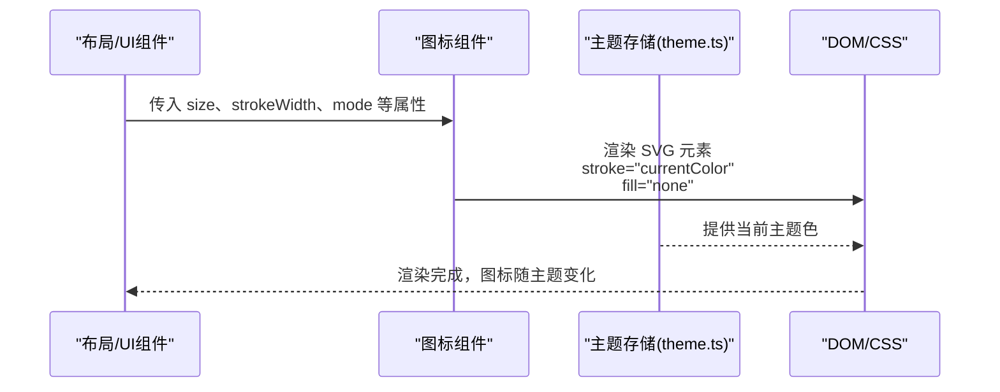
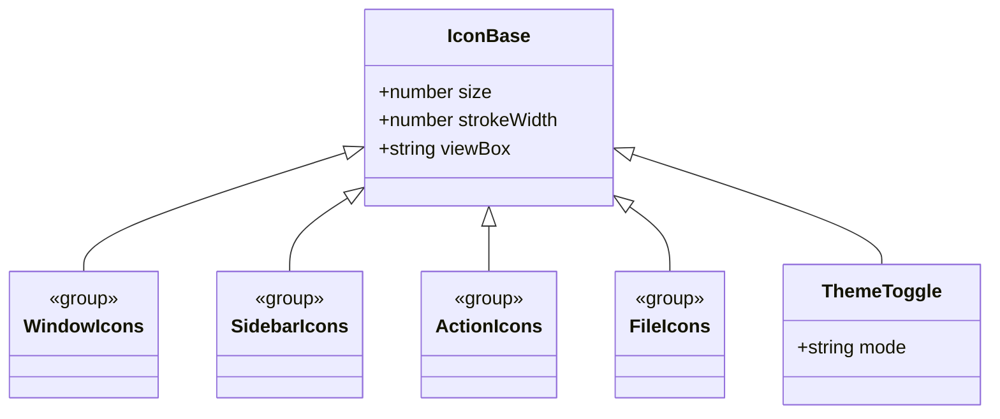

# 图标组件系统

<cite>
**本文引用的文件**
- [IconClose.vue](file://app/src/components/icons/IconClose.vue)
- [IconMinimize.vue](file://app/src/components/icons/IconMinimize.vue)
- [IconMaximize.vue](file://app/src/components/icons/IconMaximize.vue)
- [IconLeftSidebar.vue](file://app/src/components/icons/IconLeftSidebar.vue)
- [IconRightSidebar.vue](file://app/src/components/icons/IconRightSidebar.vue)
- [IconThumbnailSidebar.vue](file://app/src/components/icons/IconThumbnailSidebar.vue)
- [IconNewDocument.vue](file://app/src/components/icons/IconNewDocument.vue)
- [IconSearch.vue](file://app/src/components/icons/IconSearch.vue)
- [IconSend.vue](file://app/src/components/icons/IconSend.vue)
- [IconSettings.vue](file://app/src/components/icons/IconSettings.vue)
- [IconFolderClosed.vue](file://app/src/components/icons/IconFolderClosed.vue)
- [IconFolderOpen.vue](file://app/src/components/icons/IconFolderOpen.vue)
- [IconFile.vue](file://app/src/components/icons/IconFile.vue)
- [IconDraft.vue](file://app/src/components/icons/IconDraft.vue)
- [IconThemeToggle.vue](file://app/src/components/icons/IconThemeToggle.vue)
- [IconTrash.vue](file://app/src/components/icons/IconTrash.vue)
- [theme.ts](file://app/src/stores/theme.ts)
- [TopMenu.vue](file://app/src/components/layout/TopMenu.vue)
- [LeftSidebar.vue](file://app/src/components/layout/LeftSidebar.vue)
- [RightSidebar.vue](file://app/src/components/layout/RightSidebar.vue)
- [ContextMenu.vue](file://app/src/components/ui/ContextMenu.vue)
- [Dropdown.vue](file://app/src/components/ui/Dropdown.vue)
- [style.css](file://app/src/style.css)
</cite>

## 目录
1. [简介](#简介)
2. [项目结构](#项目结构)
3. [核心组件](#核心组件)
4. [架构总览](#架构总览)
5. [详细组件分析](#详细组件分析)
6. [依赖关系分析](#依赖关系分析)
7. [性能考虑](#性能考虑)
8. [可访问性与键盘导航](#可访问性与键盘导航)
9. [使用示例与自定义方法](#使用示例与自定义方法)
10. [维护与更新流程](#维护与更新流程)
11. [结论](#结论)

## 简介
本文件系统性梳理 Woo 应用中的图标组件体系，覆盖窗口控制、侧边栏切换、功能操作、文件系统等类别的 SVG 图标，并统一说明其设计规范、尺寸与颜色系统、主题适配机制、可访问性与键盘导航支持、使用示例、自定义方法以及维护更新流程。所有内容均基于仓库中现有源码进行归纳总结。

## 项目结构
图标组件集中位于前端应用的组件目录下，采用按功能分组的组织方式：icons 子目录存放所有 SVG 图标组件，layout 子目录包含使用这些图标的界面模块，ui 子目录包含上下文菜单与下拉菜单等交互容器，stores 子目录包含主题状态管理，style.css 提供全局样式与主题变量。

```mermaid
graph TB
subgraph "图标组件"
I1["IconClose.vue"]
I2["IconMinimize.vue"]
I3["IconMaximize.vue"]
I4["IconLeftSidebar.vue"]
I5["IconRightSidebar.vue"]
I6["IconThumbnailSidebar.vue"]
I7["IconNewDocument.vue"]
I8["IconSearch.vue"]
I9["IconSend.vue"]
I10["IconSettings.vue"]
I11["IconFolderClosed.vue"]
I12["IconFolderOpen.vue"]
I13["IconFile.vue"]
I14["IconDraft.vue"]
I15["IconThemeToggle.vue"]
I16["IconTrash.vue"]
end
subgraph "布局与UI"
L1["TopMenu.vue"]
L2["LeftSidebar.vue"]
L3["RightSidebar.vue"]
U1["ContextMenu.vue"]
U2["Dropdown.vue"]
end
subgraph "主题与样式"
S1["theme.ts"]
S2["style.css"]
end
L1 --> I15
L2 --> I4
L2 --> I6
L3 --> I5
U1 --> I16
U2 --> I7
U2 --> I8
U2 --> I9
U2 --> I10
U2 --> I11
U2 --> I12
U2 --> I13
U2 --> I14
S1 --> I15
S2 --> I1..I16
```

图表来源
- [IconClose.vue:1-28](file://app/src/components/icons/IconClose.vue#L1-L28)
- [IconMinimize.vue:1-27](file://app/src/components/icons/IconMinimize.vue#L1-L27)
- [IconMaximize.vue:1-27](file://app/src/components/icons/IconMaximize.vue#L1-L27)
- [IconLeftSidebar.vue:1-28](file://app/src/components/icons/IconLeftSidebar.vue#L1-L28)
- [IconRightSidebar.vue:1-28](file://app/src/components/icons/IconRightSidebar.vue#L1-L28)
- [IconThumbnailSidebar.vue:1-29](file://app/src/components/icons/IconThumbnailSidebar.vue#L1-L29)
- [IconNewDocument.vue:1-24](file://app/src/components/icons/IconNewDocument.vue#L1-L24)
- [IconSearch.vue:1-24](file://app/src/components/icons/IconSearch.vue#L1-L24)
- [IconSend.vue:1-17](file://app/src/components/icons/IconSend.vue#L1-L17)
- [IconSettings.vue:1-17](file://app/src/components/icons/IconSettings.vue#L1-L17)
- [IconFolderClosed.vue:1-23](file://app/src/components/icons/IconFolderClosed.vue#L1-L23)
- [IconFolderOpen.vue:1-24](file://app/src/components/icons/IconFolderOpen.vue#L1-L24)
- [IconFile.vue:1-24](file://app/src/components/icons/IconFile.vue#L1-L24)
- [IconDraft.vue:1-27](file://app/src/components/icons/IconDraft.vue#L1-L27)
- [IconThemeToggle.vue:1-45](file://app/src/components/icons/IconThemeToggle.vue#L1-L45)
- [IconTrash.vue:1-26](file://app/src/components/icons/IconTrash.vue#L1-L26)
- [theme.ts](file://app/src/stores/theme.ts)
- [TopMenu.vue](file://app/src/components/layout/TopMenu.vue)
- [LeftSidebar.vue](file://app/src/components/layout/LeftSidebar.vue)
- [RightSidebar.vue](file://app/src/components/layout/RightSidebar.vue)
- [ContextMenu.vue](file://app/src/components/ui/ContextMenu.vue)
- [Dropdown.vue](file://app/src/components/ui/Dropdown.vue)
- [style.css](file://app/src/style.css)

章节来源
- [IconClose.vue:1-28](file://app/src/components/icons/IconClose.vue#L1-L28)
- [IconMinimize.vue:1-27](file://app/src/components/icons/IconMinimize.vue#L1-L27)
- [IconMaximize.vue:1-27](file://app/src/components/icons/IconMaximize.vue#L1-L27)
- [IconLeftSidebar.vue:1-28](file://app/src/components/icons/IconLeftSidebar.vue#L1-L28)
- [IconRightSidebar.vue:1-28](file://app/src/components/icons/IconRightSidebar.vue#L1-L28)
- [IconThumbnailSidebar.vue:1-29](file://app/src/components/icons/IconThumbnailSidebar.vue#L1-L29)
- [IconNewDocument.vue:1-24](file://app/src/components/icons/IconNewDocument.vue#L1-L24)
- [IconSearch.vue:1-24](file://app/src/components/icons/IconSearch.vue#L1-L24)
- [IconSend.vue:1-17](file://app/src/components/icons/IconSend.vue#L1-L17)
- [IconSettings.vue:1-17](file://app/src/components/icons/IconSettings.vue#L1-L17)
- [IconFolderClosed.vue:1-23](file://app/src/components/icons/IconFolderClosed.vue#L1-L23)
- [IconFolderOpen.vue:1-24](file://app/src/components/icons/IconFolderOpen.vue#L1-L24)
- [IconFile.vue:1-24](file://app/src/components/icons/IconFile.vue#L1-L24)
- [IconDraft.vue:1-27](file://app/src/components/icons/IconDraft.vue#L1-L27)
- [IconThemeToggle.vue:1-45](file://app/src/components/icons/IconThemeToggle.vue#L1-L45)
- [IconTrash.vue:1-26](file://app/src/components/icons/IconTrash.vue#L1-L26)

## 核心组件
- 窗口控制图标：IconClose、IconMinimize、IconMaximize
- 侧边栏切换图标：IconLeftSidebar、IconRightSidebar、IconThumbnailSidebar
- 功能操作图标：IconNewDocument、IconSearch、IconSend、IconSettings
- 文件系统图标：IconFolderClosed、IconFolderOpen、IconFile、IconDraft、IconTrash
- 主题切换图标：IconThemeToggle

所有图标组件均采用相同的设计范式：
- 使用 SVG 原生元素绘制，通过属性绑定实现尺寸与描边宽度的动态化
- 默认 viewBox 固定为“0 0 24 24”，确保在不同尺寸下保持一致的视觉比例
- 颜色系统统一使用当前主题色，通过 stroke="currentColor" 与 fill="none" 实现主题适配
- 尺寸与描边宽度通过 props 控制，默认值保证在常规场景下的可读性与清晰度

章节来源
- [IconClose.vue:15-27](file://app/src/components/icons/IconClose.vue#L15-L27)
- [IconMinimize.vue:14-26](file://app/src/components/icons/IconMinimize.vue#L14-L26)
- [IconMaximize.vue:14-26](file://app/src/components/icons/IconMaximize.vue#L14-L26)
- [IconLeftSidebar.vue:15-27](file://app/src/components/icons/IconLeftSidebar.vue#L15-L27)
- [IconRightSidebar.vue:15-27](file://app/src/components/icons/IconRightSidebar.vue#L15-L27)
- [IconThumbnailSidebar.vue:16-28](file://app/src/components/icons/IconThumbnailSidebar.vue#L16-L28)
- [IconNewDocument.vue:1-24](file://app/src/components/icons/IconNewDocument.vue#L1-L24)
- [IconSearch.vue:1-24](file://app/src/components/icons/IconSearch.vue#L1-L24)
- [IconSend.vue:1-17](file://app/src/components/icons/IconSend.vue#L1-L17)
- [IconSettings.vue:1-17](file://app/src/components/icons/IconSettings.vue#L1-L17)
- [IconFolderClosed.vue:1-23](file://app/src/components/icons/IconFolderClosed.vue#L1-L23)
- [IconFolderOpen.vue:1-24](file://app/src/components/icons/IconFolderOpen.vue#L1-L24)
- [IconFile.vue:1-24](file://app/src/components/icons/IconFile.vue#L1-L24)
- [IconDraft.vue:1-27](file://app/src/components/icons/IconDraft.vue#L1-L27)
- [IconThemeToggle.vue:31-45](file://app/src/components/icons/IconThemeToggle.vue#L31-L45)
- [IconTrash.vue:1-26](file://app/src/components/icons/IconTrash.vue#L1-L26)

## 架构总览
图标组件在应用中的使用路径如下：布局组件（如 TopMenu、LeftSidebar、RightSidebar）与 UI 组件（如 ContextMenu、Dropdown）直接引入图标组件并在模板中渲染。主题状态由 theme.ts 管理，通过 CSS 变量或运行时样式影响图标的颜色表现。

图表来源
- [TopMenu.vue](file://app/src/components/layout/TopMenu.vue)
- [LeftSidebar.vue](file://app/src/components/layout/LeftSidebar.vue)
- [RightSidebar.vue](file://app/src/components/layout/RightSidebar.vue)
- [ContextMenu.vue](file://app/src/components/ui/ContextMenu.vue)
- [Dropdown.vue](file://app/src/components/ui/Dropdown.vue)
- [IconThemeToggle.vue:1-45](file://app/src/components/icons/IconThemeToggle.vue#L1-L45)
- [theme.ts](file://app/src/stores/theme.ts)

## 详细组件分析

### 窗口控制图标
- IconClose：两条对角线交叉，用于关闭窗口或面板
- IconMinimize：水平线段，表示最小化
- IconMaximize：外框矩形，表示最大化

设计要点
- 三者均使用相同的 viewBox 与默认尺寸/描边，确保在工具栏中的一致性
- 通过 stroke="currentColor" 自动继承主题色，无需硬编码颜色

章节来源
- [IconClose.vue:1-28](file://app/src/components/icons/IconClose.vue#L1-L28)
- [IconMinimize.vue:1-27](file://app/src/components/icons/IconMinimize.vue#L1-L27)
- [IconMaximize.vue:1-27](file://app/src/components/icons/IconMaximize.vue#L1-L27)

### 侧边栏切换图标
- IconLeftSidebar：左侧可见矩形较窄，右侧半透明矩形表示隐藏区域
- IconRightSidebar：右侧可见矩形较宽，左侧半透明矩形表示隐藏区域
- IconThumbnailSidebar：双列等宽矩形叠加，突出缩略图视图

设计要点
- 通过 opacity 差异表达“可见/隐藏”的层次关系
- 同步的 viewBox 与尺寸，便于在切换按钮中组合使用

章节来源
- [IconLeftSidebar.vue:1-28](file://app/src/components/icons/IconLeftSidebar.vue#L1-L28)
- [IconRightSidebar.vue:1-28](file://app/src/components/icons/IconRightSidebar.vue#L1-L28)
- [IconThumbnailSidebar.vue:1-29](file://app/src/components/icons/IconThumbnailSidebar.vue#L1-L29)

### 功能操作图标
- IconNewDocument：带边框矩形与铅笔路径，强调新建文档
- IconSearch：圆形与线条组合，表达搜索意图
- IconSend：箭头与多边形组合，传达发送动作
- IconSettings：齿轮内圆与小圆点，代表设置入口

设计要点
- 部分图标显式设置了 stroke-linecap 与 stroke-linejoin，以提升线条末端的视觉效果
- 通过 class 样式限定图标尺寸收缩行为，避免在 Flex 布局中被压缩

章节来源
- [IconNewDocument.vue:1-24](file://app/src/components/icons/IconNewDocument.vue#L1-L24)
- [IconSearch.vue:1-24](file://app/src/components/icons/IconSearch.vue#L1-L24)
- [IconSend.vue:1-17](file://app/src/components/icons/IconSend.vue#L1-L17)
- [IconSettings.vue:1-17](file://app/src/components/icons/IconSettings.vue#L1-L17)

### 文件系统图标
- IconFolderClosed：闭合文件夹轮廓
- IconFolderOpen：打开文件夹并带分割线
- IconFile：纸片形状，简洁表达文件
- IconDraft：文档与多条横线，表达草稿

设计要点
- 与功能图标类似，使用 stroke-linecap 与 stroke-linejoin 提升线条品质
- 通过 class 样式限制图标在布局中的弹性收缩

章节来源
- [IconFolderClosed.vue:1-23](file://app/src/components/icons/IconFolderClosed.vue#L1-L23)
- [IconFolderOpen.vue:1-24](file://app/src/components/icons/IconFolderOpen.vue#L1-L24)
- [IconFile.vue:1-24](file://app/src/components/icons/IconFile.vue#L1-L24)
- [IconDraft.vue:1-27](file://app/src/components/icons/IconDraft.vue#L1-L27)

### 主题切换图标
- IconThemeToggle：根据 mode 属性切换太阳（亮色）或月亮（暗色）图标

设计要点
- 通过 v-if/v-else 在同一组件内渲染两套图形，减少额外组件
- 保持与其它图标一致的 viewBox、尺寸与描边策略

章节来源
- [IconThemeToggle.vue:1-45](file://app/src/components/icons/IconThemeToggle.vue#L1-L45)

### 垃圾桶图标
- IconTrash：垃圾桶主体与两条竖线，表达删除/清空

设计要点
- 与文件系统图标风格一致，使用 stroke-linecap 与 stroke-linejoin

章节来源
- [IconTrash.vue:1-26](file://app/src/components/icons/IconTrash.vue#L1-L26)

## 依赖关系分析
图标组件之间的耦合度低，主要依赖于：
- 共同的属性接口（size、strokeWidth）
- 共同的主题颜色系统（stroke="currentColor"）
- 共同的 viewBox 规范（0 0 24 24）

图表来源
- [IconClose.vue:15-27](file://app/src/components/icons/IconClose.vue#L15-L27)
- [IconLeftSidebar.vue:15-27](file://app/src/components/icons/IconLeftSidebar.vue#L15-L27)
- [IconNewDocument.vue:1-24](file://app/src/components/icons/IconNewDocument.vue#L1-L24)
- [IconFolderClosed.vue:1-23](file://app/src/components/icons/IconFolderClosed.vue#L1-L23)
- [IconThemeToggle.vue:31-45](file://app/src/components/icons/IconThemeToggle.vue#L31-L45)

## 性能考虑
- SVG 内联渲染：图标均为轻量 SVG，避免额外网络请求，适合高频使用场景
- 单一颜色策略：通过 currentColor 减少重复样式的开销，同时利于主题切换
- 尺寸与描边默认值：减少调用方参数传递，降低误配置带来的重绘成本
- 建议
  - 在大量列表中复用图标时，优先使用统一 size 与 strokeWidth，避免频繁变更导致的重排
  - 对于高频交互（如主题切换），保持 IconThemeToggle 的单一渲染分支，减少条件渲染开销

## 可访问性与键盘导航
- 可访问性设计
  - 所有图标均为装饰性元素，未设置 aria-label 或 role，符合无障碍最佳实践（仅装饰性图标不需语义标签）
  - 若图标承载交互语义，应在父级元素（按钮、菜单项）上提供明确的文本标签
- 键盘导航支持
  - 图标所在按钮应具备可聚焦性与键盘激活能力（Tab 聚焦、Enter/Space 激活）
  - 建议在按钮层添加 aria-label 或 title，提升屏幕阅读器可用性
- 屏幕阅读器兼容性
  - 当图标作为独立元素时，建议通过父级容器提供文本描述
  - 对于纯装饰图标，保持无语义标签，避免冗余信息

## 使用示例与自定义方法
- 基本使用
  - 在布局组件（如 TopMenu、LeftSidebar、RightSidebar）中直接引入图标组件并传入 size 与 strokeWidth
  - 在 UI 组件（如 ContextMenu、Dropdown）中使用文件系统图标与操作图标
- 自定义方法
  - 尺寸与描边：通过 props 覆盖默认值，满足不同布局密度需求
  - 主题适配：依赖 currentColor，无需手动传色；若需特殊强调，可在父级容器临时覆盖颜色
  - 类名扩展：部分图标提供 scoped class，可按需扩展样式（如限制收缩、对齐等）
- 推荐实践
  - 在工具栏中统一使用 18px 默认尺寸与 2px 描边，确保可读性
  - 在菜单中使用 16px 小图标，注意与文字行高的对齐

章节来源
- [TopMenu.vue](file://app/src/components/layout/TopMenu.vue)
- [LeftSidebar.vue](file://app/src/components/layout/LeftSidebar.vue)
- [RightSidebar.vue](file://app/src/components/layout/RightSidebar.vue)
- [ContextMenu.vue](file://app/src/components/ui/ContextMenu.vue)
- [Dropdown.vue](file://app/src/components/ui/Dropdown.vue)
- [IconNewDocument.vue:1-24](file://app/src/components/icons/IconNewDocument.vue#L1-L24)
- [IconSearch.vue:1-24](file://app/src/components/icons/IconSearch.vue#L1-L24)
- [IconSend.vue:1-17](file://app/src/components/icons/IconSend.vue#L1-L17)
- [IconSettings.vue:1-17](file://app/src/components/icons/IconSettings.vue#L1-L17)
- [IconFolderClosed.vue:1-23](file://app/src/components/icons/IconFolderClosed.vue#L1-L23)
- [IconFolderOpen.vue:1-24](file://app/src/components/icons/IconFolderOpen.vue#L1-L24)
- [IconFile.vue:1-24](file://app/src/components/icons/IconFile.vue#L1-L24)
- [IconDraft.vue:1-27](file://app/src/components/icons/IconDraft.vue#L1-L27)
- [IconThemeToggle.vue:31-45](file://app/src/components/icons/IconThemeToggle.vue#L31-L45)

## 维护与更新流程
- 设计规范
  - 统一使用 viewBox="0 0 24 24"，确保缩放一致性
  - 采用 stroke="currentColor" 与 fill="none"，保持主题一致性
  - 默认 size=18、strokeWidth=2，必要时在具体组件中微调
  - 对需要强调的图标可增加 stroke-linecap 与 stroke-linejoin
- 更新流程
  - 新增图标：在 icons 目录新增 .vue 文件，遵循现有属性与样式约定
  - 修改既有图标：保持属性签名与默认值不变，避免破坏调用方
  - 主题适配：通过主题存储与 CSS 变量驱动颜色，避免硬编码颜色
  - 文档同步：在使用处补充必要的 aria-label 或标题，确保可访问性
- 版本与兼容
  - 保持向后兼容的属性命名与默认值
  - 对于新增功能（如 IconThemeToggle 的 mode），提供明确的类型约束与默认值

## 结论
Woo 图标组件系统以统一的 SVG 规范与主题适配机制为基础，实现了窗口控制、侧边栏切换、功能操作与文件系统等多类别图标的高内聚、低耦合封装。通过 currentColor 与默认尺寸策略，既保证了视觉一致性，又兼顾了性能与可维护性。建议在后续迭代中持续完善可访问性标注与主题变量体系，确保跨平台与无障碍体验的稳定性。