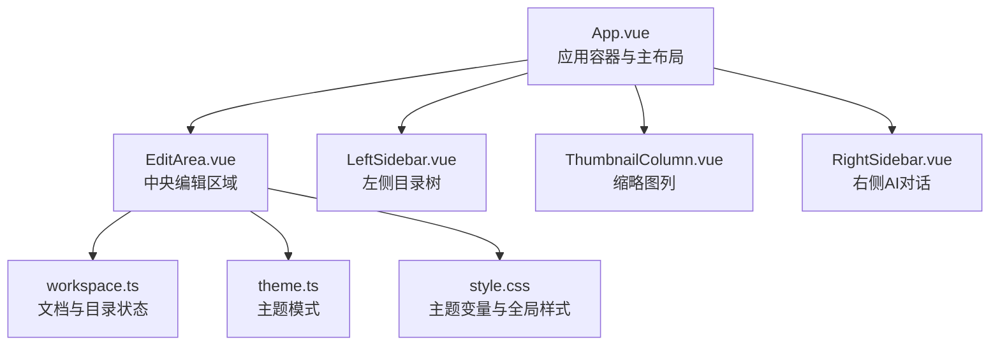
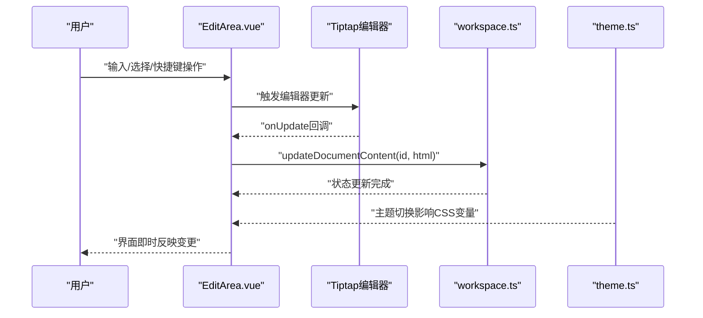
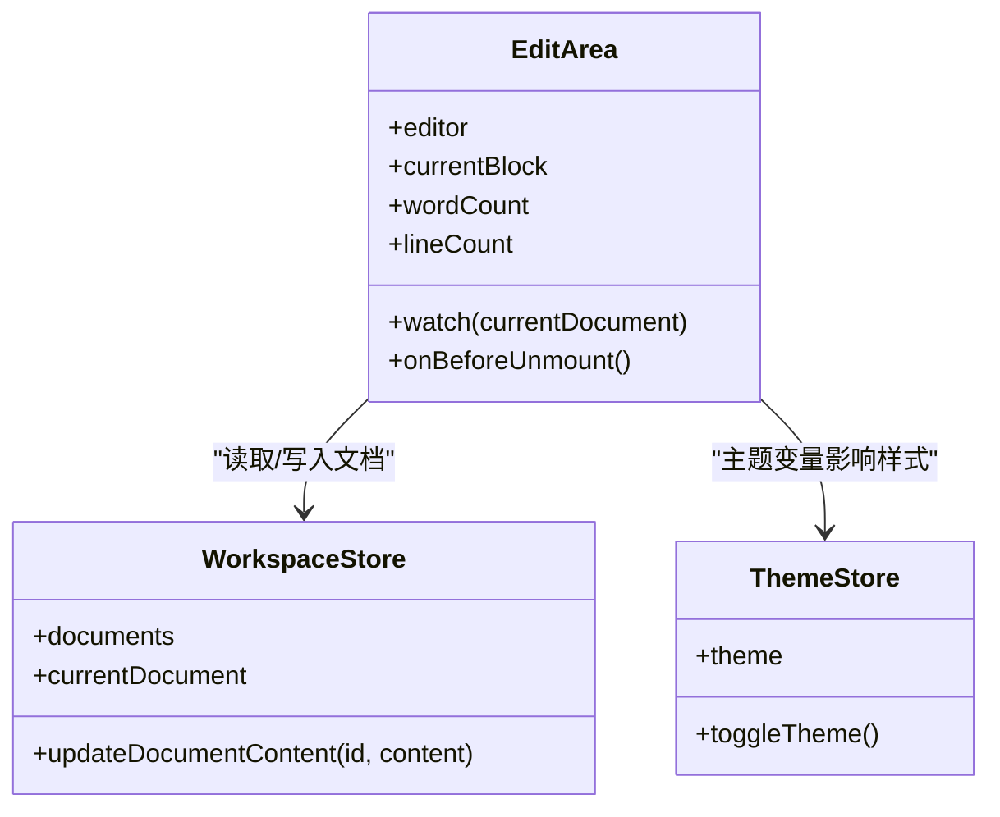
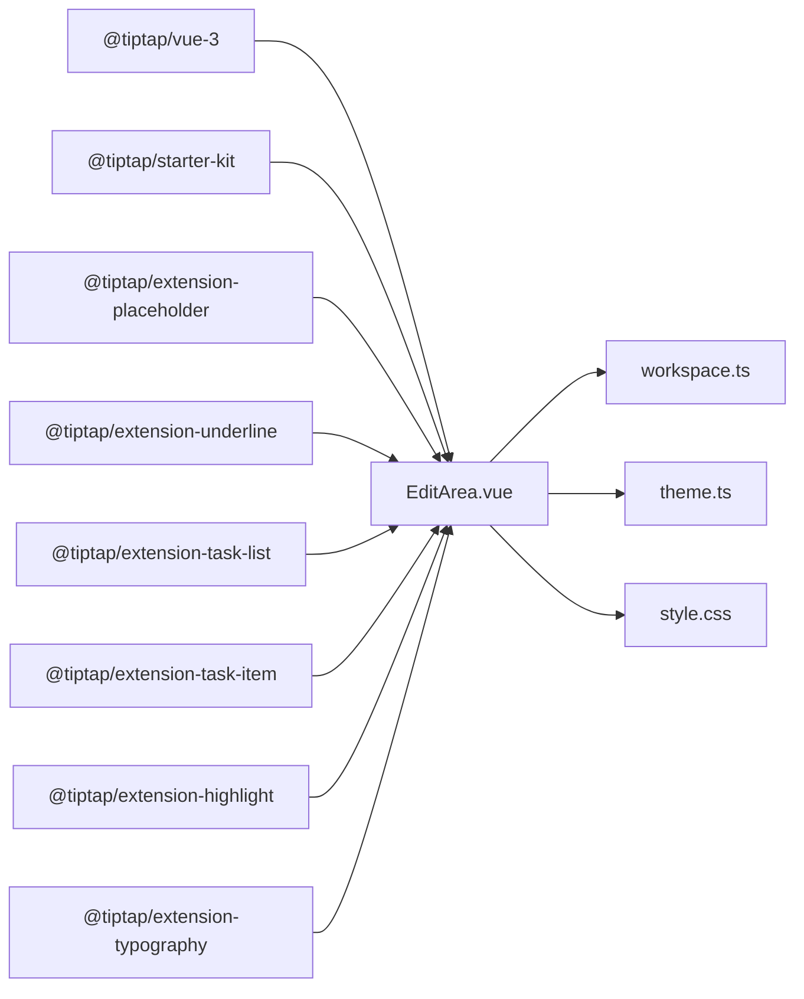

# 中央编辑区域

<cite>
**本文档引用的文件**
- [EditArea.vue](file://app/src/components/layout/EditArea.vue)
- [workspace.ts](file://app/src/stores/workspace.ts)
- [App.vue](file://app/src/App.vue)
- [style.css](file://app/src/style.css)
- [theme.ts](file://app/src/stores/theme.ts)
</cite>

## 目录
1. [简介](#简介)
2. [项目结构](#项目结构)
3. [核心组件](#核心组件)
4. [架构总览](#架构总览)
5. [详细组件分析](#详细组件分析)
6. [依赖关系分析](#依赖关系分析)
7. [性能考虑](#性能考虑)
8. [故障排查指南](#故障排查指南)
9. [结论](#结论)
10. [附录](#附录)

## 简介
本文件聚焦于Woo应用的中央编辑区域组件——EditArea。它基于Tiptap富文本编辑器实现，提供Markdown风格的所见即所得编辑体验，并与Pinia状态管理、主题系统和全局样式深度集成。本文将从以下维度展开：
- 编辑器初始化与扩展：StarterKit、占位符、下划线、任务列表、高亮、排版增强与自定义快捷键扩展
- 实时预览与状态栏：内容变更同步、字数/行数统计、当前块类型提示
- 文档状态管理：内容变更检测、撤销重做机制、持久化策略
- 扩展能力：插件系统、自定义命令、第三方集成建议
- 性能优化：内容节流、内存管理、渲染优化
- 定制指南：主题、样式、快捷键与扩展

## 项目结构
EditArea位于应用前端的布局层，作为主内容区的核心组件之一，与App容器、左右侧边栏、缩略图列共同构成完整的界面布局。

**图表来源**
- [App.vue:1-131](file://app/src/App.vue#L1-L131)
- [EditArea.vue:1-463](file://app/src/components/layout/EditArea.vue#L1-L463)
- [workspace.ts:1-321](file://app/src/stores/workspace.ts#L1-L321)
- [style.css:1-286](file://app/src/style.css#L1-L286)
- [theme.ts:1-31](file://app/src/stores/theme.ts#L1-L31)

**章节来源**
- [App.vue:1-131](file://app/src/App.vue#L1-L131)
- [EditArea.vue:1-463](file://app/src/components/layout/EditArea.vue#L1-L463)

## 核心组件
- 组件职责
  - 提供Markdown风格的编辑体验，支持标题、列表、任务列表、高亮、引用、代码块、分割线等常用格式
  - 将编辑器内容变更实时同步至Pinia状态，驱动UI与数据一致性
  - 在状态栏展示当前块类型、字数统计与行数统计
  - 支持自定义快捷键，提升编辑效率
  - 与主题系统联动，适配日间/夜间模式

- 关键特性
  - 基于Tiptap的可扩展编辑器
  - 内置占位符与Typography增强
  - 自定义快捷键扩展
  - 状态栏信息与编辑器样式解耦（scoped与全局样式分离）

**章节来源**
- [EditArea.vue:28-174](file://app/src/components/layout/EditArea.vue#L28-L174)
- [EditArea.vue:119-149](file://app/src/components/layout/EditArea.vue#L119-L149)

## 架构总览
EditArea通过useEditor初始化编辑器实例，注册StarterKit与若干扩展，并在onUpdate钩子中将HTML内容写回Pinia状态。状态由workspace.ts集中管理，主题由theme.ts控制，全局样式定义在style.css中。

**图表来源**
- [EditArea.vue:82-116](file://app/src/components/layout/EditArea.vue#L82-L116)
- [workspace.ts:176-183](file://app/src/stores/workspace.ts#L176-L183)
- [theme.ts:20-24](file://app/src/stores/theme.ts#L20-L24)

## 详细组件分析

### 编辑器初始化与扩展
- 初始化配置
  - 使用useEditor创建实例，设置content为空字符串，绑定DOM属性类名与拼写检查关闭
  - 注册StarterKit并启用多级标题（1~6级）
  - 添加占位符扩展，提示“开始写作...”
  - 启用下划线、任务列表、任务项（嵌套）、高亮（单色）、排版增强
  - 注入自定义快捷键扩展CustomKeymap
  - 设置editorProps属性类名，便于全局样式覆盖

- 自定义快捷键扩展
  - 支持标题层级切换（Shift+Alt+1~6）
  - 支持正文、高亮、无序/有序/任务列表、引用、代码块、删除线、分割线等常用命令
  - 使用chain()链式调用保证焦点与命令顺序正确

- 样式与主题
  - 编辑器容器使用wysiwyg-editor类名，配合全局样式定义段落、标题、列表、代码块、引用等视觉规范
  - 主题通过CSS变量控制编辑器文本、背景、边框、高亮、链接等颜色，随data-theme切换而动态生效

**章节来源**
- [EditArea.vue:82-116](file://app/src/components/layout/EditArea.vue#L82-L116)
- [EditArea.vue:47-79](file://app/src/components/layout/EditArea.vue#L47-L79)
- [EditArea.vue:257-462](file://app/src/components/layout/EditArea.vue#L257-L462)
- [style.css:36-142](file://app/src/style.css#L36-L142)

### 实时预览与状态栏
- 内容同步
  - onUpdate钩子中，当非setContent写入时，将编辑器HTML内容写入Pinia状态，避免循环写回
  - 通过isSettingContent防抖标记，防止watch加载文档内容时触发反向写回

- 状态栏信息
  - 当前块类型：根据编辑器激活状态判断标题级别、列表类型、引用、代码块等
  - 字数统计：中文字符与英文单词计数之和
  - 行数统计：基于编辑器JSON结构计算内容节点数量

- 预览思路
  - 当前实现以HTML形式存储，编辑器直接渲染HTML；若需“Markdown解析→HTML渲染”，可在服务端或本地解析器中实现，再将结果注入编辑器

**章节来源**
- [EditArea.vue:110-115](file://app/src/components/layout/EditArea.vue#L110-L115)
- [EditArea.vue:43-44](file://app/src/components/layout/EditArea.vue#L43-L44)
- [EditArea.vue:151-164](file://app/src/components/layout/EditArea.vue#L151-L164)
- [EditArea.vue:119-149](file://app/src/components/layout/EditArea.vue#L119-L149)

### 文档状态管理
- 状态模型
  - documents数组存储文档对象，包含id、title、content、folderId、createdAt、updatedAt
  - currentDocument基于selectedDocumentId计算，用于驱动编辑器内容加载与保存

- 变更检测与持久化
  - onUpdate中将HTML写回documents.content，并更新updatedAt
  - 通过Pinia响应式更新，驱动UI与状态一致

- 撤销/重做机制
  - 当前未实现专用撤销/重做栈；可基于Tiptap history扩展或自定义命令队列实现

- 保存策略
  - 建议采用防抖/节流策略（见性能章节）与离线缓存，结合服务端持久化

**章节来源**
- [workspace.ts:64-129](file://app/src/stores/workspace.ts#L64-L129)
- [workspace.ts:148-151](file://app/src/stores/workspace.ts#L148-L151)
- [workspace.ts:176-183](file://app/src/stores/workspace.ts#L176-L183)

### 扩展能力与定制
- 插件系统
  - 可通过Extension.create新增自定义扩展，例如语法高亮、自动补全、图片上传、表格、公式等
  - 与StarterKit组合使用，保持功能边界清晰

- 自定义命令
  - 可在CustomKeymap中扩展更多快捷键，或通过addCommand注册独立命令
  - 建议统一管理命令映射，便于维护与国际化

- 第三方集成
  - 图片/附件：集成上传服务与拖拽/粘贴插入
  - 导出：HTML/Markdown/PDF导出
  - AI辅助：与右侧AI对话区域联动，提供智能补全与润色

**章节来源**
- [EditArea.vue:47-79](file://app/src/components/layout/EditArea.vue#L47-L79)

### 类图：编辑器与状态交互

**图表来源**
- [EditArea.vue:28-174](file://app/src/components/layout/EditArea.vue#L28-L174)
- [workspace.ts:148-183](file://app/src/stores/workspace.ts#L148-L183)
- [theme.ts:8-30](file://app/src/stores/theme.ts#L8-L30)

## 依赖关系分析
- 组件依赖
  - EditArea依赖@tiptap/vue-3、StarterKit、Placeholder、Underline、TaskList、TaskItem、Highlight、Typography
  - 依赖Pinia状态管理（workspace.ts）
  - 依赖主题状态（theme.ts）与全局样式（style.css）

- 数据流向
  - 用户输入 → Tiptap编辑器 → onUpdate → Pinia状态 → UI更新
  - 主题切换 → CSS变量更新 → 编辑器样式更新

**图表来源**
- [EditArea.vue:30-102](file://app/src/components/layout/EditArea.vue#L30-L102)
- [workspace.ts:1-321](file://app/src/stores/workspace.ts#L1-L321)
- [theme.ts:1-31](file://app/src/stores/theme.ts#L1-L31)
- [style.css:1-286](file://app/src/style.css#L1-L286)

**章节来源**
- [EditArea.vue:30-102](file://app/src/components/layout/EditArea.vue#L30-L102)

## 性能考虑
- 内容节流
  - 在onUpdate中进行防抖/节流，减少频繁写入Pinia与服务端的压力
  - 对大文档建议分段渲染或虚拟滚动（如引入ProseMirror视图优化）

- 内存管理
  - 组件卸载时销毁编辑器实例，避免内存泄漏
  - 避免在onUpdate中创建大量临时对象

- 渲染优化
  - 将编辑器样式设为全局（已通过非scoped样式实现），减少作用域样式带来的重绘
  - 使用CSS变量统一主题，降低样式切换成本

- 存储与网络
  - 采用防抖写入与批量提交策略，结合本地缓存与增量更新

**章节来源**
- [EditArea.vue:171-173](file://app/src/components/layout/EditArea.vue#L171-L173)
- [EditArea.vue:110-115](file://app/src/components/layout/EditArea.vue#L110-L115)

## 故障排查指南
- 编辑器无法输入或内容不更新
  - 检查isSettingContent防抖逻辑是否被错误置位
  - 确认watch对currentDocument的监听是否正确加载新内容

- 主题切换后样式异常
  - 确认data-theme属性是否正确写入<html>元素
  - 检查style.css中CSS变量是否完整覆盖编辑器相关变量

- 快捷键无效
  - 确认CustomKeymap扩展已正确注册
  - 检查浏览器快捷键冲突（如Ctrl+Shift+X等）

- 内存占用过高
  - 确保组件卸载时调用destroy
  - 对超长文档考虑懒加载与分页

**章节来源**
- [EditArea.vue:43-44](file://app/src/components/layout/EditArea.vue#L43-L44)
- [EditArea.vue:151-164](file://app/src/components/layout/EditArea.vue#L151-L164)
- [theme.ts:20-24](file://app/src/stores/theme.ts#L20-L24)
- [style.css:36-142](file://app/src/style.css#L36-L142)

## 结论
EditArea以Tiptap为核心，构建了功能完备且可扩展的编辑体验。通过Pinia集中管理文档状态、主题系统提供跨组件的主题一致性，以及完善的样式体系，实现了良好的可用性与可维护性。后续可在撤销重做、解析渲染、扩展生态与性能优化方面持续演进。

## 附录

### 快捷键一览（来自自定义扩展）
- 标题：Shift+Alt+1~6
- 正文：Mod+0
- 高亮：Mod+Shift+h
- 无序列表：Mod+Shift+l
- 有序列表：Mod+Shift+o
- 任务列表：Mod+Shift+t
- 引用：Mod+Shift+q
- 代码块：Mod+Shift+c
- 删除线：Mod+Shift+x
- 分割线：Mod+Enter

**章节来源**
- [EditArea.vue:50-77](file://app/src/components/layout/EditArea.vue#L50-L77)

### 主题变量（编辑器相关）
- 编辑器背景、文本、标题、边框、代码块、引用、高亮、链接、选区、占位符、光标等
- 支持日间/夜间两套变量，通过data-theme切换

**章节来源**
- [style.css:36-142](file://app/src/style.css#L36-L142)

### 定制指南
- 自定义扩展
  - 新增Extension，注册命令与快捷键，接入StarterKit生态
- 样式定制
  - 修改style.css中的CSS变量，或新增scoped样式覆盖特定组件
- 主题联动
  - 通过theme.ts的watch与localStorage实现主题持久化与DOM同步

**章节来源**
- [EditArea.vue:82-116](file://app/src/components/layout/EditArea.vue#L82-L116)
- [style.css:36-142](file://app/src/style.css#L36-L142)
- [theme.ts:20-24](file://app/src/stores/theme.ts#L20-L24)