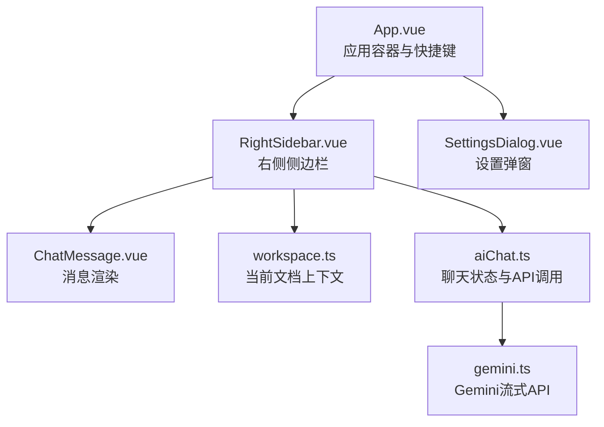
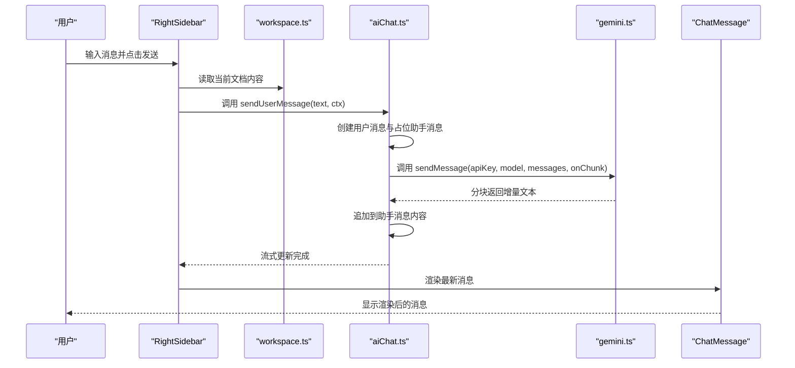
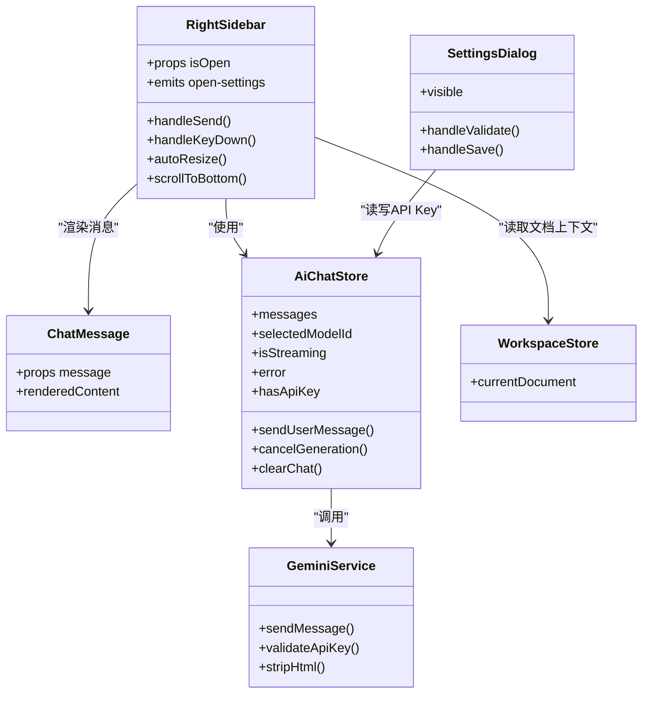

# 右侧侧边栏

<cite>
**本文引用的文件**
- [App.vue](file://app/src/App.vue)
- [RightSidebar.vue](file://app/src/components/layout/RightSidebar.vue)
- [ChatMessage.vue](file://app/src/components/layout/ChatMessage.vue)
- [aiChat.ts](file://app/src/stores/aiChat.ts)
- [gemini.ts](file://app/src/services/gemini.ts)
- [ai.ts](file://app/src/types/ai.ts)
- [workspace.ts](file://app/src/stores/workspace.ts)
- [SettingsDialog.vue](file://app/src/components/layout/SettingsDialog.vue)
</cite>

## 目录
1. [简介](#简介)
2. [项目结构](#项目结构)
3. [核心组件](#核心组件)
4. [架构总览](#架构总览)
5. [详细组件分析](#详细组件分析)
6. [依赖关系分析](#依赖关系分析)
7. [性能考量](#性能考量)
8. [故障排查指南](#故障排查指南)
9. [结论](#结论)
10. [附录](#附录)

## 简介
本文件面向Woo应用的右侧侧边栏组件（RightSidebar），系统性地说明其整体设计与实现要点，涵盖：
- AI聊天界面的布局结构与交互控制
- ChatMessage组件的消息渲染机制（用户消息与AI回复的样式区分、Markdown渲染、流式光标）
- AI聊天状态管理（对话历史、消息流处理、错误状态）
- 侧边栏显示控制（展开/折叠动画、宽度调整、响应式适配）
- AI助手集成（Gemini API调用、流式响应处理、会话管理）
- 用户体验优化（消息滚动、输入框自动聚焦、快捷键支持）
- 自定义聊天界面的开发指南与最佳实践

## 项目结构
右侧侧边栏位于应用的布局层，作为主界面的一部分，与顶部菜单、左侧边栏、缩略图列、中央编辑区共同构成三栏布局。其与全局状态管理（Pinia）和外部服务（Gemini）紧密耦合。

图表来源
- [App.vue:25-26](file://app/src/App.vue#L25-L26)
- [RightSidebar.vue:1-82](file://app/src/components/layout/RightSidebar.vue#L1-L82)
- [ChatMessage.vue:1-93](file://app/src/components/layout/ChatMessage.vue#L1-L93)
- [workspace.ts:148-151](file://app/src/stores/workspace.ts#L148-L151)
- [aiChat.ts:1-199](file://app/src/stores/aiChat.ts#L1-L199)
- [gemini.ts:1-103](file://app/src/services/gemini.ts#L1-L103)
- [SettingsDialog.vue:1-47](file://app/src/components/layout/SettingsDialog.vue#L1-L47)

章节来源
- [App.vue:25-26](file://app/src/App.vue#L25-L26)
- [RightSidebar.vue:1-82](file://app/src/components/layout/RightSidebar.vue#L1-L82)

## 核心组件
- RightSidebar：负责侧边栏的布局、输入区、消息区、快捷操作、错误提示与API Key提示；协调AI聊天状态与工作区上下文。
- ChatMessage：负责单条消息的渲染，区分用户与助手角色，渲染Markdown并显示流式光标。
- aiChat Store：集中管理聊天状态（消息列表、模型选择、流式状态、错误）、API Key持久化、消息发送与取消。
- Gemini Service：封装Gemini流式API调用，解析SSE分块，回调增量文本。
- workspace Store：提供当前文档内容，作为首次消息的上下文注入。
- SettingsDialog：提供API Key配置、校验与保存入口。

章节来源
- [RightSidebar.vue:1-185](file://app/src/components/layout/RightSidebar.vue#L1-L185)
- [ChatMessage.vue:1-93](file://app/src/components/layout/ChatMessage.vue#L1-L93)
- [aiChat.ts:1-199](file://app/src/stores/aiChat.ts#L1-L199)
- [gemini.ts:1-103](file://app/src/services/gemini.ts#L1-L103)
- [workspace.ts:148-151](file://app/src/stores/workspace.ts#L148-L151)
- [SettingsDialog.vue:1-103](file://app/src/components/layout/SettingsDialog.vue#L1-L103)

## 架构总览
右侧侧边栏采用“视图组件 + 状态仓库 + 服务层”的分层架构：
- 视图层：RightSidebar负责UI与交互；ChatMessage负责单条消息渲染。
- 状态层：aiChat Store维护消息、模型、流式状态、错误与API Key；workspace Store提供文档上下文。
- 服务层：gemini.ts封装Gemini流式API，解析SSE分块，回调增量文本。
- 应用层：App.vue提供快捷键与全局开关；SettingsDialog提供配置入口。

图表来源
- [RightSidebar.vue:120-129](file://app/src/components/layout/RightSidebar.vue#L120-L129)
- [workspace.ts:148-151](file://app/src/stores/workspace.ts#L148-L151)
- [aiChat.ts:73-169](file://app/src/stores/aiChat.ts#L73-L169)
- [gemini.ts:29-102](file://app/src/services/gemini.ts#L29-L102)
- [ChatMessage.vue:1-93](file://app/src/components/layout/ChatMessage.vue#L1-L93)

## 详细组件分析

### RightSidebar 组件
- 布局结构
  - 头部：模型选择下拉框与清空按钮，绑定aiChat Store的状态与方法。
  - 消息区域：空状态欢迎语与快捷按钮；消息列表通过ChatMessage逐条渲染。
  - 错误提示：展示错误信息并可关闭。
  - API Key提示：当未配置时显示提示与“去设置”按钮，触发父组件打开设置弹窗。
  - 输入区域：自动高度的多行文本框，支持Enter发送与Shift+Enter换行；流式生成时显示“停止”按钮。
- 交互控制
  - 快速操作：点击快捷按钮自动填充输入并发送。
  - 发送流程：清理输入、读取当前文档内容（若存在），调用aiChat Store发送消息。
  - 键盘事件：Enter发送，Shift+Enter换行；输入变化自动调整高度。
  - 滚动策略：新消息进入时强制滚到底部；流式更新时智能滚动，仅在接近底部时滚动。
- 显示控制
  - 通过props接收isOpen，内部使用CSS类名切换控制宽度与透明度，实现展开/折叠动画。
  - 宽度固定为320px，折叠时宽度与透明度归零，过渡时间为0.3秒。
- 与状态与服务的协作
  - 使用aiChat Store进行消息管理、模型选择、流式状态与错误处理。
  - 使用workspace Store获取当前文档内容，作为首次消息的上下文注入。
  - 通过事件向父组件传递“打开设置”信号。

章节来源
- [RightSidebar.vue:1-185](file://app/src/components/layout/RightSidebar.vue#L1-L185)
- [App.vue:74-77](file://app/src/App.vue#L74-L77)

### ChatMessage 组件
- 角色区分
  - user：右对齐，使用强调色气泡，内容进行HTML安全转义并保留换行。
  - assistant：左对齐，使用浅色气泡，内容渲染Markdown。
- 渲染机制
  - 使用marked库渲染Markdown，启用硬换行与GitHub风格。
  - 用户消息直接输出转义后的文本，助手消息输出HTML片段。
- 流式光标
  - 当消息处于isStreaming状态时，显示闪烁光标，增强实时感。
- 样式设计
  - 最大宽度85%，圆角气泡，左右底角半径差异形成对话气泡视觉连贯。
  - 支持暗色主题下的颜色适配。

章节来源
- [ChatMessage.vue:1-93](file://app/src/components/layout/ChatMessage.vue#L1-L93)
- [ai.ts:1-7](file://app/src/types/ai.ts#L1-L7)

### aiChat Store（聊天状态管理）
- 状态与计算属性
  - messages：聊天历史数组，包含用户与助手消息，助手消息可标记为isStreaming。
  - selectedModelId/currentModel：模型选择与当前模型配置。
  - isStreaming：流式生成状态。
  - hasApiKey：基于本地存储的API Key存在性。
  - availableModels：可用模型列表（含自动选择策略）。
- API Key管理
  - 从localStorage读取/保存API Key，变更后触发hasApiKey响应式更新。
- 发送消息流程
  - 校验API Key；创建用户消息与占位助手消息；构建API消息列表（首次消息注入文档上下文）。
  - 创建AbortController用于取消；调用gemini.sendMessage并注册增量回调；捕获AbortError与其它错误；最终收尾isStreaming与占位消息状态。
- 取消与清空
  - cancelGeneration：调用AbortController.abort。
  - clearChat：清空消息与错误。

章节来源
- [aiChat.ts:1-199](file://app/src/stores/aiChat.ts#L1-L199)
- [gemini.ts:29-102](file://app/src/services/gemini.ts#L29-L102)
- [ai.ts:1-19](file://app/src/types/ai.ts#L1-L19)

### Gemini 服务（流式API）
- 请求构建
  - 将messages映射为Gemini的contents，assistant映射为model，user映射为user。
  - 使用streamGenerateContent接口，开启alt=sse，携带temperature与maxOutputTokens等参数。
- 响应解析
  - 使用ReadableStream Reader与TextDecoder解析SSE分块；提取candidates.parts.text作为增量文本。
  - 对异常状态码进行分类处理（401/403、429等）。
- 回调与返回
  - 通过onChunk回调逐段推送增量文本；最终返回完整文本。

章节来源
- [gemini.ts:1-103](file://app/src/services/gemini.ts#L1-L103)

### workspace Store（文档上下文）
- 提供currentDocument，用于首次消息时注入文档内容摘要，提升AI回复的相关性。
- 在aiChat.store中，若首次用户消息且文档内容非空，则将文档纯文本截断后拼接为上下文消息，随后发送给Gemini。

章节来源
- [workspace.ts:148-151](file://app/src/stores/workspace.ts#L148-L151)
- [aiChat.ts:107-128](file://app/src/stores/aiChat.ts#L107-L128)

### SettingsDialog（设置弹窗）
- 提供Gemini API Key的输入、显示/隐藏切换、验证与保存。
- 与aiChat.store配合，读取/写入localStorage中的AI设置。
- 通过事件通知父组件关闭弹窗。

章节来源
- [SettingsDialog.vue:1-103](file://app/src/components/layout/SettingsDialog.vue#L1-L103)
- [aiChat.ts:39-59](file://app/src/stores/aiChat.ts#L39-L59)

## 依赖关系分析

图表来源
- [RightSidebar.vue:85-185](file://app/src/components/layout/RightSidebar.vue#L85-L185)
- [ChatMessage.vue:10-39](file://app/src/components/layout/ChatMessage.vue#L10-L39)
- [aiChat.ts:8-199](file://app/src/stores/aiChat.ts#L8-L199)
- [gemini.ts:1-103](file://app/src/services/gemini.ts#L1-L103)
- [workspace.ts:148-151](file://app/src/stores/workspace.ts#L148-L151)
- [SettingsDialog.vue:50-103](file://app/src/components/layout/SettingsDialog.vue#L50-L103)

## 性能考量
- 流式渲染
  - 使用onChunk增量更新助手消息内容，避免一次性渲染大文本导致卡顿。
  - 智能滚动仅在接近底部时滚动，减少不必要的DOM操作。
- DOM最小化
  - 消息列表通过虚拟滚动或有限渲染即可满足需求；当前实现为全量渲染，建议在消息量较大时引入虚拟列表。
- 网络与资源
  - SSE分块解析需注意内存累积，确保在finally中清理isStreaming与AbortController。
  - API Key读取与验证使用localStorage，避免频繁网络请求。
- 输入优化
  - textarea高度自适应，限制最大高度，减少重排。
- 主题与样式
  - 使用CSS变量统一主题色，减少样式切换成本。

[本节为通用性能建议，无需特定文件引用]

## 故障排查指南
- 无API Key
  - 现象：输入区域禁用，显示“请先配置 API Key”横幅。
  - 处理：打开设置弹窗配置并保存，或点击“去设置”按钮。
- 请求失败
  - 现象：出现错误提示，助手消息为空则自动移除。
  - 处理：检查网络、API Key有效性与配额；必要时重试。
- 流式中断
  - 现象：点击“停止”按钮，AbortError不会显示为错误。
  - 处理：重新发送消息；若仍失败，检查网络与配额。
- 滚动异常
  - 现象：消息过多时滚动位置不正确。
  - 处理：确保watch对messages.length与最后一条content的监听生效；避免在滚动过程中强制覆盖scrollTop。

章节来源
- [RightSidebar.vue:39-48](file://app/src/components/layout/RightSidebar.vue#L39-L48)
- [aiChat.ts:148-168](file://app/src/stores/aiChat.ts#L148-L168)
- [SettingsDialog.vue:91-94](file://app/src/components/layout/SettingsDialog.vue#L91-L94)

## 结论
右侧侧边栏组件通过清晰的分层设计与完善的交互逻辑，实现了流畅的AI聊天体验。其关键优势包括：
- 基于Pinia的状态管理与服务层解耦，便于扩展与维护。
- 流式响应与智能滚动优化，显著提升用户体验。
- 与工作区上下文的自然融合，使AI回复更具针对性。
- 完整的错误处理与快捷键支持，降低使用门槛。

[本节为总结性内容，无需特定文件引用]

## 附录

### 侧边栏显示控制与动画
- 折叠/展开：通过isOpen prop与CSS类名切换实现宽度与透明度的平滑过渡。
- 响应式适配：当前宽度固定为320px，折叠时宽度与透明度归零；建议在更复杂的布局中考虑媒体查询与动态宽度。

章节来源
- [RightSidebar.vue:188-201](file://app/src/components/layout/RightSidebar.vue#L188-L201)

### 快捷键支持
- 全局快捷键：Ctrl+数字键切换不同侧边栏与顶部菜单。
- 组件内快捷键：Enter发送消息，Shift+Enter换行。

章节来源
- [App.vue:79-104](file://app/src/App.vue#L79-L104)
- [RightSidebar.vue:131-136](file://app/src/components/layout/RightSidebar.vue#L131-L136)

### 自定义聊天界面开发指南
- 消息样式定制
  - 修改ChatMessage的scoped样式，调整气泡圆角、最大宽度与边框。
  - 区分user与assistant的CSS类名，分别设置背景色与文本色。
- Markdown渲染
  - 如需自定义渲染规则，可在ChatMessage中调整marked选项或替换渲染器。
- 流式光标
  - 保持isStreaming字段与光标动画一致，确保实时反馈。
- 上下文注入
  - 在aiChat.store中扩展上下文注入逻辑，支持更多文档类型或元数据。
- 错误与取消
  - 保持AbortController的正确创建与清理，确保错误分支的幂等性。
- 设置与验证
  - 通过SettingsDialog与aiChat.store的API Key持久化机制，保证配置一致性。

章节来源
- [ChatMessage.vue:42-92](file://app/src/components/layout/ChatMessage.vue#L42-L92)
- [aiChat.ts:134-168](file://app/src/stores/aiChat.ts#L134-L168)
- [SettingsDialog.vue:78-94](file://app/src/components/layout/SettingsDialog.vue#L78-L94)