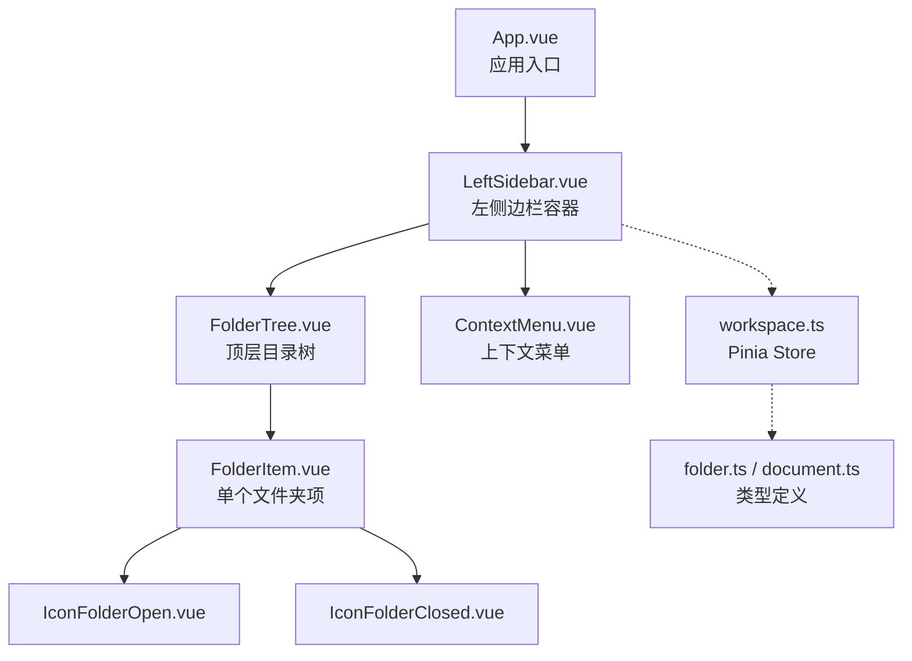
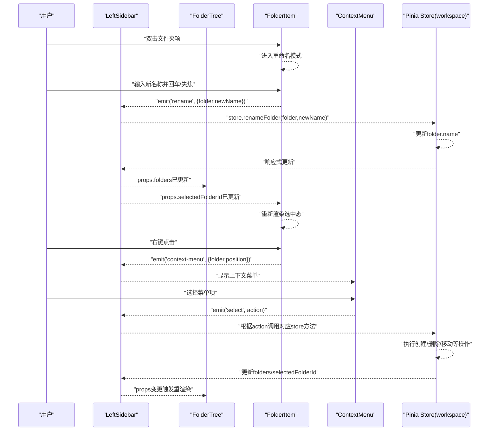
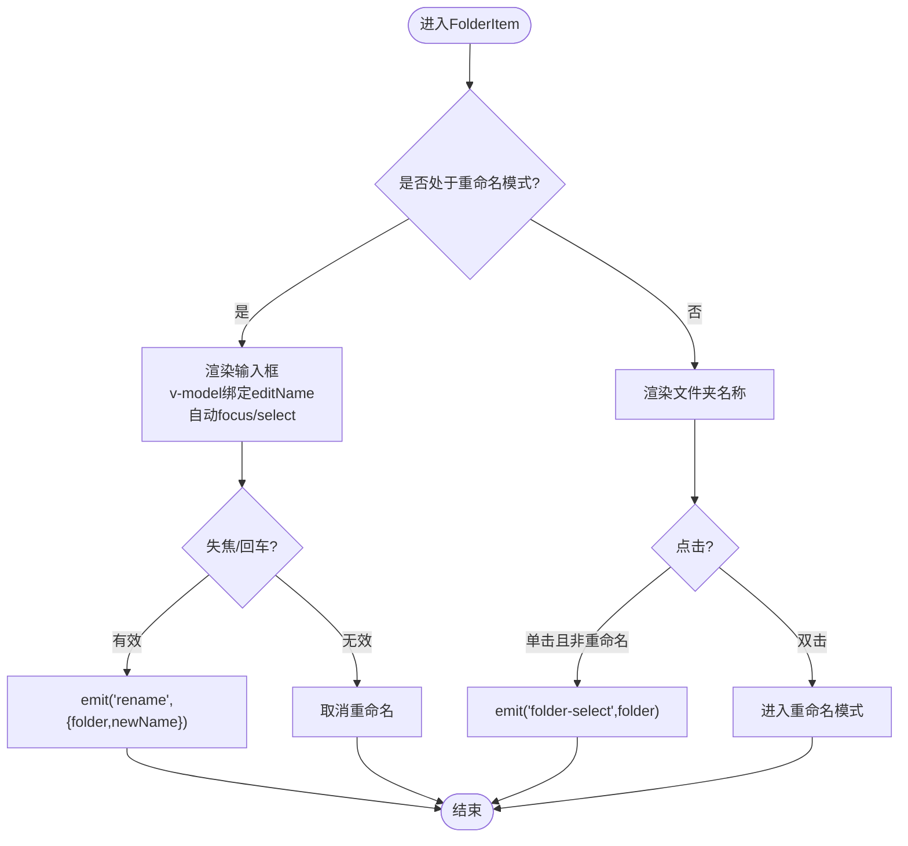
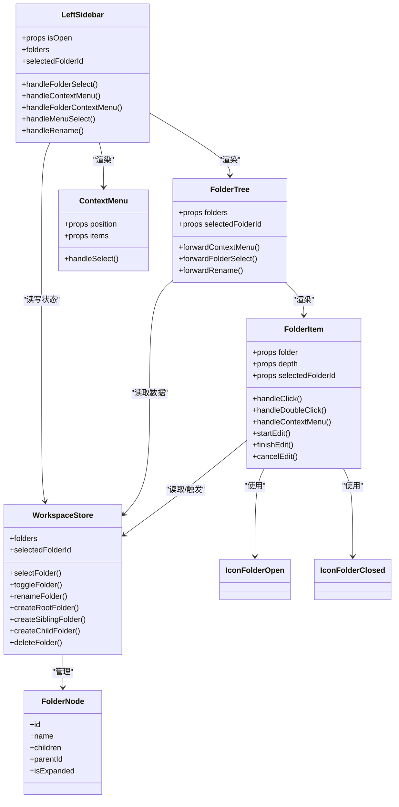

# 左侧目录树

<cite>
**本文引用的文件**
- [LeftSidebar.vue](file://app/src/components/layout/LeftSidebar.vue)
- [FolderTree.vue](file://app/src/components/layout/FolderTree.vue)
- [FolderItem.vue](file://app/src/components/layout/FolderItem.vue)
- [ContextMenu.vue](file://app/src/components/ui/ContextMenu.vue)
- [workspace.ts](file://app/src/stores/workspace.ts)
- [folder.ts](file://app/src/types/folder.ts)
- [document.ts](file://app/src/types/document.ts)
- [IconFolderOpen.vue](file://app/src/components/icons/IconFolderOpen.vue)
- [IconFolderClosed.vue](file://app/src/components/icons/IconFolderClosed.vue)
- [App.vue](file://app/src/App.vue)
- [main.ts](file://app/src/main.ts)
</cite>

## 目录
1. [简介](#简介)
2. [项目结构](#项目结构)
3. [核心组件](#核心组件)
4. [架构总览](#架构总览)
5. [详细组件分析](#详细组件分析)
6. [依赖关系分析](#依赖关系分析)
7. [性能考量](#性能考量)
8. [故障排查指南](#故障排查指南)
9. [结论](#结论)
10. [附录](#附录)

## 简介
本文件针对Woo应用的左侧目录树组件进行系统化文档化说明，涵盖LeftSidebar、FolderTree与FolderItem三大核心组件的整体架构、渲染机制、节点管理与用户交互；深入解析FolderTree的递归渲染、层级展示、展开折叠逻辑与异步数据加载；阐述FolderItem的单个文件夹项实现，包括点击选择、右键菜单、重命名与拖拽支持现状；说明目录树的状态管理（选中、展开、焦点）；给出完整的目录操作流程（创建、重命名、删除、移动）实现细节；最后提供性能优化策略与扩展开发指南。

## 项目结构
左侧目录树位于前端应用的布局层，采用分层设计：
- 布局层：LeftSidebar作为容器，承载工具区与目录树区，并负责右键菜单转发与目录操作派发。
- 目录树层：FolderTree负责顶层目录节点的渲染与事件透传；FolderItem负责单个文件夹节点的渲染、交互与递归子节点渲染。
- UI层：ContextMenu提供上下文菜单，支持边界自适应定位与点击外部关闭。
- 状态层：Pinia Store（workspace.ts）集中管理目录树数据、选中状态与目录操作。
- 类型层：folder.ts定义FolderNode与上下文菜单项接口；document.ts定义文档类型。
- 图标层：IconFolderOpen/IconFolderClosed用于展示展开/折叠状态。

图表来源
- [App.vue:1-131](file://app/src/App.vue#L1-L131)
- [LeftSidebar.vue:1-204](file://app/src/components/layout/LeftSidebar.vue#L1-L204)
- [FolderTree.vue:1-49](file://app/src/components/layout/FolderTree.vue#L1-L49)
- [FolderItem.vue:1-195](file://app/src/components/layout/FolderItem.vue#L1-L195)
- [ContextMenu.vue:1-111](file://app/src/components/ui/ContextMenu.vue#L1-L111)
- [workspace.ts:1-321](file://app/src/stores/workspace.ts#L1-L321)
- [folder.ts:1-19](file://app/src/types/folder.ts#L1-L19)
- [document.ts:1-9](file://app/src/types/document.ts#L1-L9)

章节来源
- [App.vue:1-131](file://app/src/App.vue#L1-L131)
- [main.ts:1-8](file://app/src/main.ts#L1-L8)

## 核心组件
- LeftSidebar：左侧边栏容器，负责目录树渲染、空白区域右键菜单、目录选中与重命名事件转发、以及目录操作（创建、删除、移动）的派发。
- FolderTree：顶层目录树渲染器，接收顶层FolderNode数组，逐个渲染FolderItem，并透传上下文菜单、选中与重命名事件。
- FolderItem：单个文件夹项渲染器，负责渲染文件夹图标、名称、缩进、选中态样式；支持双击进入重命名、右键菜单、点击选中；当节点展开且存在子节点时，递归渲染子FolderItem。
- ContextMenu：通用上下文菜单，根据传入位置计算菜单位置，避免越界，并支持点击外部关闭。
- Pinia Store（workspace.ts）：集中管理目录树数据（folders）、当前选中目录（selectedFolderId）、当前选中文档（selectedDocumentId）、目录操作方法（创建、重命名、删除、展开/折叠）等。

章节来源
- [LeftSidebar.vue:1-204](file://app/src/components/layout/LeftSidebar.vue#L1-L204)
- [FolderTree.vue:1-49](file://app/src/components/layout/FolderTree.vue#L1-L49)
- [FolderItem.vue:1-195](file://app/src/components/layout/FolderItem.vue#L1-L195)
- [ContextMenu.vue:1-111](file://app/src/components/ui/ContextMenu.vue#L1-L111)
- [workspace.ts:1-321](file://app/src/stores/workspace.ts#L1-L321)

## 架构总览
左侧目录树采用“容器-渲染器-项”的分层架构，配合Pinia状态管理与通用UI组件，形成清晰的职责划分与事件流。

图表来源
- [LeftSidebar.vue:69-132](file://app/src/components/layout/LeftSidebar.vue#L69-L132)
- [FolderTree.vue:25-44](file://app/src/components/layout/FolderTree.vue#L25-L44)
- [FolderItem.vue:66-121](file://app/src/components/layout/FolderItem.vue#L66-L121)
- [ContextMenu.vue:36-79](file://app/src/components/ui/ContextMenu.vue#L36-L79)
- [workspace.ts:190-253](file://app/src/stores/workspace.ts#L190-L253)

## 详细组件分析

### LeftSidebar 组件
- 职责
  - 渲染工具区（新建文档、搜索、草稿箱、废纸篓）。
  - 渲染目录树区域，绑定FolderTree并透传folders与selectedFolderId。
  - 处理空白区域右键菜单（新建根级目录）。
  - 接收来自FolderTree的上下文菜单、选中与重命名事件，转发至Pinia Store执行业务操作。
- 事件流
  - 目录选中：FolderTree -> LeftSidebar -> Store.selectFolder + Store.toggleFolder。
  - 重命名：FolderTree -> LeftSidebar -> Store.renameFolder。
  - 上下文菜单：FolderTree -> LeftSidebar -> ContextMenu -> 用户选择 -> Store对应操作。
- 状态与样式
  - 支持折叠状态（isOpen），通过CSS类控制宽度、内边距与透明度。
  - 使用scoped样式保证组件隔离。

章节来源
- [LeftSidebar.vue:1-204](file://app/src/components/layout/LeftSidebar.vue#L1-L204)

### FolderTree 组件
- 职责
  - 接收顶层FolderNode数组，逐个渲染FolderItem。
  - 透传上下文菜单、选中与重命名事件，保持事件链路清晰。
- 渲染机制
  - v-for遍历folders，每个folder作为FolderItem的props传入。
  - 通过depth=0标识顶层，便于FolderItem内部计算缩进。
- 事件透传
  - forwardContextMenu/forwardFolderSelect/forwardRename将子组件事件原样上抛。

章节来源
- [FolderTree.vue:1-49](file://app/src/components/layout/FolderTree.vue#L1-L49)

### FolderItem 组件
- 职责
  - 渲染单个文件夹项：图标（展开/折叠）、名称或输入框（重命名）、递归子项。
  - 处理点击选中、双击重命名、右键菜单。
  - 通过props.selectedFolderId与CSS类实现选中态高亮。
- 渲染与缩进
  - 通过style.paddingLeft动态计算缩进：depth * 16 + 8。
  - 选中态通过selected类名切换背景色与文字颜色。
- 交互逻辑
  - 单击：若非重命名模式则触发folder-select事件。
  - 双击：进入重命名模式，聚焦并全选输入框。
  - 重命名完成：回车或失焦时触发rename事件，仅当名称非空时生效。
  - 右键：阻止默认菜单，触发context-menu事件并传递坐标。
- 递归渲染
  - 当folder.isExpanded为true且存在children时，递归渲染子FolderItem，depth+1。
- 图标
  - 展开使用IconFolderOpen，折叠使用IconFolderClosed。

图表来源
- [FolderItem.vue:66-121](file://app/src/components/layout/FolderItem.vue#L66-L121)

章节来源
- [FolderItem.vue:1-195](file://app/src/components/layout/FolderItem.vue#L1-L195)
- [IconFolderOpen.vue:1-24](file://app/src/components/icons/IconFolderOpen.vue#L1-L24)
- [IconFolderClosed.vue:1-23](file://app/src/components/icons/IconFolderClosed.vue#L1-L23)

### ContextMenu 组件
- 职责
  - 渲染上下文菜单项，支持禁用态。
  - 计算菜单位置，避免超出窗口边界。
  - 点击外部关闭菜单。
- 事件与样式
  - 通过select/close事件与父组件通信。
  - scoped样式保证外观与主题变量兼容。

章节来源
- [ContextMenu.vue:1-111](file://app/src/components/ui/ContextMenu.vue#L1-L111)

### Pinia Store（workspace.ts）
- 数据模型
  - folders：顶层FolderNode数组，初始包含多个示例目录。
  - documents：模拟文档集合，用于演示选中目录下的文档列表。
  - selectedFolderId / selectedDocumentId：当前选中目录与文档ID。
- 计算属性
  - currentFolderDocuments：按更新时间倒序返回当前目录下的文档列表。
  - currentDocument：根据选中ID返回当前文档。
- 目录操作
  - selectFolder：设置选中目录并尝试选中该目录下最新文档。
  - toggleFolder：切换目录展开/折叠。
  - renameFolder：重命名指定目录。
  - createRootFolder / createSiblingFolder / createChildFolder：创建根级/同级/子级目录。
  - deleteFolder：删除目录（根级直接从folders移除，子级从父节点children移除），并清理选中状态。
- 辅助函数
  - addFolderToParent / removeFolderFromParent：在树结构中插入或移除节点。

章节来源
- [workspace.ts:1-321](file://app/src/stores/workspace.ts#L1-L321)

### 类型定义（folder.ts / document.ts）
- FolderNode：目录节点，包含id、name、children、parentId、可选isExpanded。
- ContextMenuPosition / ContextMenuItem：上下文菜单位置与菜单项。
- Document：文档实体，包含id、title、content（HTML）、folderId、createdAt、updatedAt。

章节来源
- [folder.ts:1-19](file://app/src/types/folder.ts#L1-L19)
- [document.ts:1-9](file://app/src/types/document.ts#L1-L9)

## 依赖关系分析
- 组件依赖
  - LeftSidebar依赖FolderTree、ContextMenu、图标组件与workspace store。
  - FolderTree依赖FolderItem。
  - FolderItem依赖IconFolderOpen/IconFolderClosed。
  - ContextMenu依赖folder.ts类型。
- 状态依赖
  - LeftSidebar通过store.folders与store.selectedFolderId驱动渲染。
  - FolderItem通过selectedFolderId与folder.isExpanded控制UI状态。
- 事件依赖
  - FolderItem向上传递context-menu、folder-select、rename事件，由LeftSidebar统一处理并调用store方法。

图表来源
- [LeftSidebar.vue:1-204](file://app/src/components/layout/LeftSidebar.vue#L1-L204)
- [FolderTree.vue:1-49](file://app/src/components/layout/FolderTree.vue#L1-L49)
- [FolderItem.vue:1-195](file://app/src/components/layout/FolderItem.vue#L1-L195)
- [ContextMenu.vue:1-111](file://app/src/components/ui/ContextMenu.vue#L1-L111)
- [workspace.ts:1-321](file://app/src/stores/workspace.ts#L1-L321)
- [folder.ts:1-19](file://app/src/types/folder.ts#L1-L19)

## 性能考量
- 当前实现特性
  - 递归渲染：FolderItem在展开时递归渲染子节点，适合中小规模目录树。
  - 响应式更新：Pinia store变更会触发组件重渲染，无需手动缓存。
  - 输入重命名：使用v-model与失焦/回车事件，避免频繁触发。
- 可选优化方向（建议）
  - 虚拟滚动：当目录树节点数量较大时，可考虑使用虚拟列表组件（如vue-virtual-scroller）仅渲染可视区域节点。
  - 懒加载：对深层子节点采用懒加载，仅在首次展开时请求/渲染子节点，减少初始渲染压力。
  - 节点缓存：对已展开的节点树进行缓存，避免重复渲染；结合key稳定化策略。
  - 事件节流：对高频事件（如滚动、鼠标移动）进行节流/防抖。
  - 计算属性优化：将复杂过滤/排序逻辑放入计算属性，利用依赖追踪避免重复计算。
- 注意事项
  - 由于当前目录树为小规模示例数据，上述优化为未来扩展预留方案。
  - 任何优化需确保与Pinia状态同步，避免UI与数据不同步。

[本节为通用性能指导，不直接分析具体文件，故无章节来源]

## 故障排查指南
- 无法选中目录
  - 检查LeftSidebar是否正确接收selectedFolderId并传给FolderTree/FolderItem。
  - 确认FolderItem的点击事件未被阻止（click事件未被stop）。
- 重命名无效
  - 确认FolderItem在finishEdit中仅在名称非空时触发rename事件。
  - 检查LeftSidebar是否正确接收rename事件并调用store.renameFolder。
- 右键菜单不显示
  - 确认FolderItem的右键事件未被冒泡覆盖，且LeftSidebar正确转发context-menu事件。
  - 检查ContextMenu的位置计算是否被window尺寸限制导致不可见。
- 删除后选中状态异常
  - 确认store.deleteFolder在删除根级/子级目录后正确清理selectedFolderId与selectedDocumentId。
- 折叠/展开异常
  - 确认store.toggleFolder正确切换folder.isExpanded。
  - 检查FolderItem的递归渲染条件（isExpanded且children长度>0）。

章节来源
- [LeftSidebar.vue:69-132](file://app/src/components/layout/LeftSidebar.vue#L69-L132)
- [FolderItem.vue:66-121](file://app/src/components/layout/FolderItem.vue#L66-L121)
- [ContextMenu.vue:36-79](file://app/src/components/ui/ContextMenu.vue#L36-L79)
- [workspace.ts:185-253](file://app/src/stores/workspace.ts#L185-L253)

## 结论
左侧目录树组件通过清晰的分层设计与Pinia状态管理，实现了目录树的渲染、交互与操作闭环。FolderTree的递归渲染与FolderItem的单节点交互共同构成完整的目录浏览体验。当前实现简洁可靠，适合中小规模场景；对于大规模目录树，建议引入虚拟滚动、懒加载与缓存策略以提升性能。

[本节为总结性内容，不直接分析具体文件，故无章节来源]

## 附录

### 目录操作流程详解
- 创建目录
  - 根级创建：LeftSidebar空白区域右键 -> 新建根级目录 -> store.createRootFolder。
  - 同级创建：FolderItem右键 -> 创建同级目录 -> store.createSiblingFolder。
  - 子级创建：FolderItem右键 -> 创建子目录 -> store.createChildFolder。
- 重命名目录
  - FolderItem双击进入重命名 -> 输入新名称 -> 回车/失焦 -> store.renameFolder。
- 删除目录
  - FolderItem右键 -> 删除当前目录 -> store.deleteFolder（同时清理选中状态）。
- 移动目录
  - 当前代码未实现拖拽移动功能。若需实现，可在FolderItem中接入Draggable/Dropzone等库，通过dragstart/dragover/drop事件与store方法协作完成移动。

章节来源
- [LeftSidebar.vue:75-121](file://app/src/components/layout/LeftSidebar.vue#L75-L121)
- [FolderItem.vue:82-109](file://app/src/components/layout/FolderItem.vue#L82-L109)
- [workspace.ts:195-253](file://app/src/stores/workspace.ts#L195-L253)

### 扩展开发指南
- 添加拖拽支持
  - 在FolderItem中启用draggable属性，监听dragstart/dragover/drop事件。
  - 在drop事件中调用store.moveFolder（需要新增方法：根据源节点与目标位置计算移动逻辑）。
  - 注意：移动涉及父子关系变更，需确保isExpanded与children结构一致性。
- 异步加载
  - 将folders初始化为loading态，首次展开时触发API请求，成功后再更新folder.isExpanded与children。
  - 对于深层节点，采用懒加载策略，仅在首次展开时请求数据。
- 多语言与主题
  - 菜单项label与提示文案可从i18n注入；主题变量通过CSS自定义属性统一管理。
- 键盘导航
  - 可在FolderItem中增加键盘事件（上下移动、Enter选中、F2重命名），提升无障碍体验。

[本节为扩展建议，不直接分析具体文件，故无章节来源]