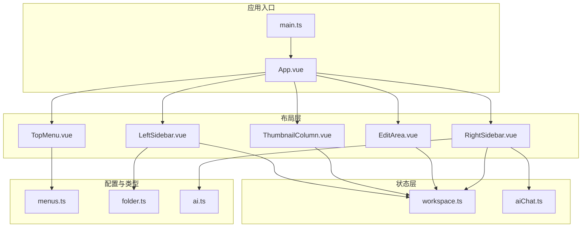
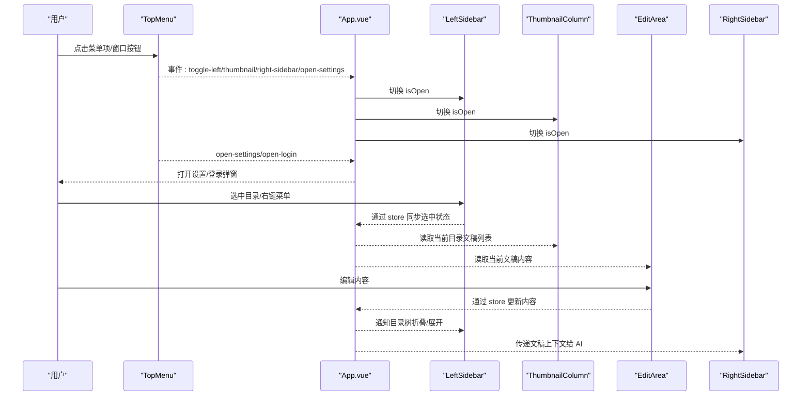
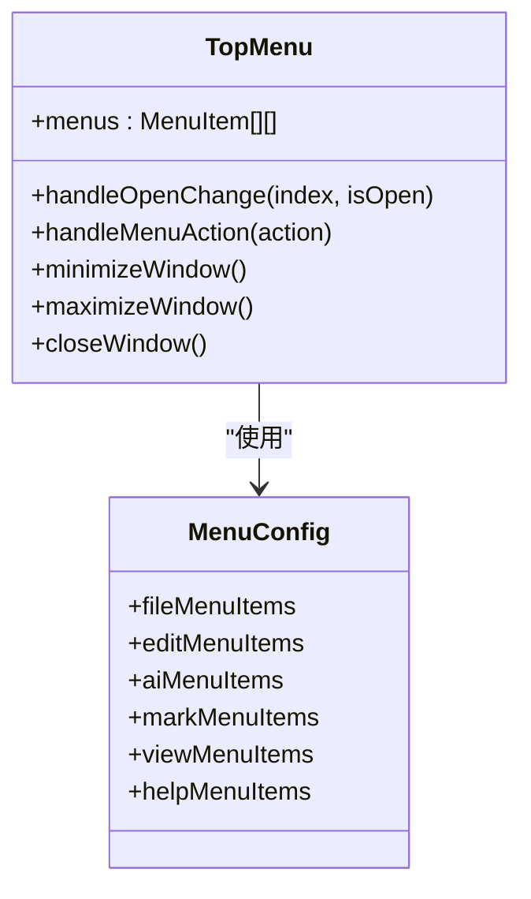
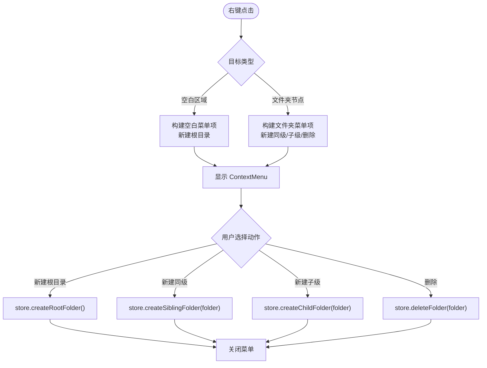
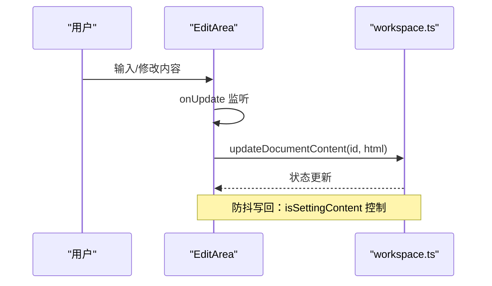
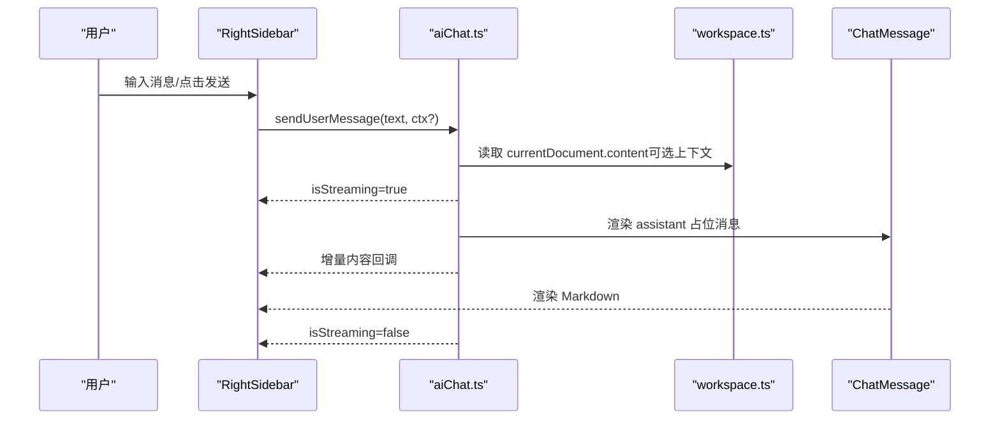
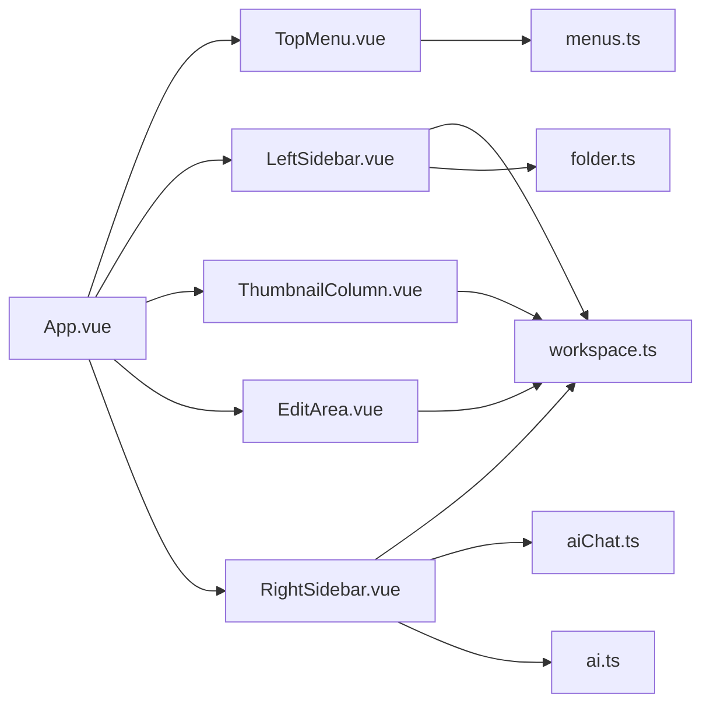

# 布局组件系统

<cite>
**本文档引用的文件**
- [App.vue](file://app/src/App.vue)
- [TopMenu.vue](file://app/src/components/layout/TopMenu.vue)
- [LeftSidebar.vue](file://app/src/components/layout/LeftSidebar.vue)
- [FolderTree.vue](file://app/src/components/layout/FolderTree.vue)
- [FolderItem.vue](file://app/src/components/layout/FolderItem.vue)
- [EditArea.vue](file://app/src/components/layout/EditArea.vue)
- [ThumbnailColumn.vue](file://app/src/components/layout/ThumbnailColumn.vue)
- [RightSidebar.vue](file://app/src/components/layout/RightSidebar.vue)
- [ChatMessage.vue](file://app/src/components/layout/ChatMessage.vue)
- [workspace.ts](file://app/src/stores/workspace.ts)
- [aiChat.ts](file://app/src/stores/aiChat.ts)
- [menus.ts](file://app/src/config/menus.ts)
- [folder.ts](file://app/src/types/folder.ts)
- [ai.ts](file://app/src/types/ai.ts)
- [main.ts](file://app/src/main.ts)
</cite>

## 目录
1. [简介](#简介)
2. [项目结构](#项目结构)
3. [核心组件](#核心组件)
4. [架构总览](#架构总览)
5. [详细组件分析](#详细组件分析)
6. [依赖关系分析](#依赖关系分析)
7. [性能考虑](#性能考虑)
8. [故障排查指南](#故障排查指南)
9. [结论](#结论)
10. [附录](#附录)

## 简介
本文件系统性地解析Woo的三栏布局组件体系，覆盖顶部菜单栏、左侧目录树、中央编辑区与右侧AI聊天区的职责边界、交互流程、状态共享与数据绑定机制。文档还阐述响应式布局、组件生命周期管理、性能优化策略与用户体验设计原则，并提供可直接定位到源码位置的参考路径，便于开发者快速定位实现细节。

## 项目结构
Woo采用基于功能域的组件组织方式，布局相关组件集中在 app/src/components/layout 目录，状态管理使用 Pinia，类型定义位于 app/src/types，菜单配置位于 app/src/config。

**图表来源**
- [main.ts:1-8](file://app/src/main.ts#L1-L8)
- [App.vue:1-117](file://app/src/App.vue#L1-L117)
- [TopMenu.vue:1-228](file://app/src/components/layout/TopMenu.vue#L1-L228)
- [LeftSidebar.vue:1-204](file://app/src/components/layout/LeftSidebar.vue#L1-L204)
- [ThumbnailColumn.vue:1-128](file://app/src/components/layout/ThumbnailColumn.vue#L1-L128)
- [EditArea.vue:1-463](file://app/src/components/layout/EditArea.vue#L1-L463)
- [RightSidebar.vue:1-432](file://app/src/components/layout/RightSidebar.vue#L1-L432)
- [workspace.ts:1-321](file://app/src/stores/workspace.ts#L1-L321)
- [aiChat.ts:1-199](file://app/src/stores/aiChat.ts#L1-L199)
- [menus.ts:1-103](file://app/src/config/menus.ts#L1-L103)
- [folder.ts:1-19](file://app/src/types/folder.ts#L1-L19)
- [ai.ts:1-20](file://app/src/types/ai.ts#L1-L20)

**章节来源**
- [main.ts:1-8](file://app/src/main.ts#L1-L8)
- [App.vue:1-117](file://app/src/App.vue#L1-L117)

## 核心组件
- 顶部菜单栏 TopMenu：负责应用级菜单项配置、窗口控制按钮与主题切换，向下派发事件以控制侧边栏显隐与打开设置/登录。
- 左侧目录树 LeftSidebar：提供目录导航、折叠展开、右键菜单（新建/删除/重命名）与选中状态同步。
- 中央编辑区 EditArea：集成 Tiptap Markdown 编辑器，支持自定义快捷键、内容变更同步与字数/行数统计。
- 右侧侧边栏 RightSidebar：集成 AI 聊天界面，支持模型选择、消息流式渲染、输入自动增高与滚动行为优化。
- 缩略图列 ThumbnailColumn：展示当前目录下文稿的预览卡片，支持选中切换。
- 状态存储：workspace.ts 提供目录/文稿/选中状态；aiChat.ts 提供聊天消息、模型与 API Key 管理。

**章节来源**
- [TopMenu.vue:1-228](file://app/src/components/layout/TopMenu.vue#L1-L228)
- [LeftSidebar.vue:1-204](file://app/src/components/layout/LeftSidebar.vue#L1-L204)
- [EditArea.vue:1-463](file://app/src/components/layout/EditArea.vue#L1-L463)
- [RightSidebar.vue:1-432](file://app/src/components/layout/RightSidebar.vue#L1-L432)
- [ThumbnailColumn.vue:1-128](file://app/src/components/layout/ThumbnailColumn.vue#L1-L128)
- [workspace.ts:1-321](file://app/src/stores/workspace.ts#L1-L321)
- [aiChat.ts:1-199](file://app/src/stores/aiChat.ts#L1-L199)

## 架构总览
三栏布局通过 App.vue 统一编排，TopMenu 控制侧边栏开关与设置入口，LeftSidebar/ThumbnailColumn/RightSidebar 与 EditArea 通过 Pinia 状态共享实现松耦合协作。

**图表来源**
- [App.vue:35-101](file://app/src/App.vue#L35-L101)
- [TopMenu.vue:108-153](file://app/src/components/layout/TopMenu.vue#L108-L153)
- [LeftSidebar.vue:69-132](file://app/src/components/layout/LeftSidebar.vue#L69-L132)
- [EditArea.vue:151-173](file://app/src/components/layout/EditArea.vue#L151-L173)
- [RightSidebar.vue:120-129](file://app/src/components/layout/RightSidebar.vue#L120-L129)

## 详细组件分析

### 顶部菜单栏 TopMenu
- 菜单配置：通过 menus.ts 定义文件/编辑/AI/标记/查看/帮助菜单项，TopMenu 将其映射为下拉菜单。
- 事件分发：提供 toggle-left-sidebar、toggle-thumbnail-sidebar、toggle-right-sidebar、open-settings、open-login 等事件，供 App.vue 统一处理。
- 窗口控制：最小化/最大化/关闭按钮通过 window.electronAPI 调用原生能力。
- 主题切换：调用 themeStore.toggleTheme() 切换 light/dark 模式。

**图表来源**
- [TopMenu.vue:67-76](file://app/src/components/layout/TopMenu.vue#L67-L76)
- [menus.ts:12-103](file://app/src/config/menus.ts#L12-L103)

**章节来源**
- [TopMenu.vue:1-228](file://app/src/components/layout/TopMenu.vue#L1-L228)
- [menus.ts:1-103](file://app/src/config/menus.ts#L1-L103)

### 左侧目录树 LeftSidebar
- 目录树渲染：FolderTree 递归渲染 FolderItem，支持深度缩进与选中态高亮。
- 折叠展开：通过 store.toggleFolder(folder) 切换 isExpanded。
- 右键菜单：支持空白区域与文件夹节点两种上下文，提供新建同级/子级/删除等动作。
- 重命名：双击进入编辑模式，失焦或回车提交新名称。
- 选中同步：点击目录触发 store.selectFolder(folderId)，自动选中该目录下最新文稿。

**图表来源**
- [LeftSidebar.vue:75-127](file://app/src/components/layout/LeftSidebar.vue#L75-L127)
- [FolderTree.vue:34-44](file://app/src/components/layout/FolderTree.vue#L34-L44)
- [FolderItem.vue:66-121](file://app/src/components/layout/FolderItem.vue#L66-L121)
- [workspace.ts:185-253](file://app/src/stores/workspace.ts#L185-L253)

**章节来源**
- [LeftSidebar.vue:1-204](file://app/src/components/layout/LeftSidebar.vue#L1-L204)
- [FolderTree.vue:1-49](file://app/src/components/layout/FolderTree.vue#L1-L49)
- [FolderItem.vue:1-195](file://app/src/components/layout/FolderItem.vue#L1-L195)
- [workspace.ts:1-321](file://app/src/stores/workspace.ts#L1-L321)

### 中央编辑区 EditArea
- 编辑器初始化：使用 Tiptap StarterKit、Placeholder、Underline、TaskList、Highlight、Typography 等扩展，自定义快捷键扩展。
- 内容同步：onUpdate 钩子在 isSettingContent 标志为 false 时，将 HTML 内容写回 store.updateDocumentContent。
- 防抖写回：通过 isSettingContent 标志避免 setContent -> onUpdate 循环写回。
- 统计信息：计算当前块类型、字数（中英混合）、行数。
- 生命周期：组件卸载时销毁编辑器实例。

**图表来源**
- [EditArea.vue:46-116](file://app/src/components/layout/EditArea.vue#L46-L116)
- [EditArea.vue:151-164](file://app/src/components/layout/EditArea.vue#L151-L164)
- [workspace.ts:176-183](file://app/src/stores/workspace.ts#L176-L183)

**章节来源**
- [EditArea.vue:1-463](file://app/src/components/layout/EditArea.vue#L1-L463)
- [workspace.ts:1-321](file://app/src/stores/workspace.ts#L1-L321)

### 右侧侧边栏 RightSidebar
- 模型选择：从 aiChat.store.availableModels 中读取，支持切换与持久化。
- 聊天交互：输入框支持多行自适应高度，Enter 发送，Shift+Enter 换行。
- 流式渲染：aiChat.store.sendUserMessage 使用回调增量更新 assistant 消息，ChatMessage 渲染 Markdown。
- 滚动行为：新增消息与流式更新时智能滚动到底部。
- 空状态与快捷操作：首次进入时展示引导文案与快捷按钮。
- 错误处理：统一错误提示与 dismiss 按钮。

**图表来源**
- [RightSidebar.vue:120-129](file://app/src/components/layout/RightSidebar.vue#L120-L129)
- [aiChat.ts:73-169](file://app/src/stores/aiChat.ts#L73-L169)
- [workspace.ts:147-151](file://app/src/stores/workspace.ts#L147-L151)
- [ChatMessage.vue:21-39](file://app/src/components/layout/ChatMessage.vue#L21-L39)

**章节来源**
- [RightSidebar.vue:1-432](file://app/src/components/layout/RightSidebar.vue#L1-L432)
- [ChatMessage.vue:1-93](file://app/src/components/layout/ChatMessage.vue#L1-L93)
- [aiChat.ts:1-199](file://app/src/stores/aiChat.ts#L1-L199)
- [workspace.ts:1-321](file://app/src/stores/workspace.ts#L1-L321)

### 缩略图列 ThumbnailColumn
- 数据来源：根据当前选中目录，从 workspace.store.currentFolderDocuments 获取文稿列表。
- 交互：点击卡片触发 store.selectDocument，实现文稿切换。
- 预览：通过 DOM 解析提取纯文本，跳过首行标题，截取正文片段作为预览。

**章节来源**
- [ThumbnailColumn.vue:1-128](file://app/src/components/layout/ThumbnailColumn.vue#L1-L128)
- [workspace.ts:139-151](file://app/src/stores/workspace.ts#L139-L151)

## 依赖关系分析
- 组件间依赖：App.vue 作为容器协调 TopMenu、LeftSidebar、ThumbnailColumn、EditArea、RightSidebar。
- 状态依赖：LeftSidebar/ThumbnailColumn/RightSidebar/编辑器均依赖 workspace.ts；RightSidebar 还依赖 aiChat.ts。
- 配置与类型：TopMenu 依赖 menus.ts；目录树依赖 folder.ts；AI 聊天依赖 ai.ts。

**图表来源**
- [App.vue:1-117](file://app/src/App.vue#L1-L117)
- [TopMenu.vue:62-62](file://app/src/components/layout/TopMenu.vue#L62-L62)
- [LeftSidebar.vue:51-51](file://app/src/components/layout/LeftSidebar.vue#L51-L51)
- [RightSidebar.vue:89-90](file://app/src/components/layout/RightSidebar.vue#L89-L90)
- [workspace.ts:1-321](file://app/src/stores/workspace.ts#L1-L321)
- [aiChat.ts:1-199](file://app/src/stores/aiChat.ts#L1-L199)
- [menus.ts:1-103](file://app/src/config/menus.ts#L1-L103)
- [folder.ts:1-19](file://app/src/types/folder.ts#L1-L19)
- [ai.ts:1-20](file://app/src/types/ai.ts#L1-L20)

**章节来源**
- [App.vue:1-117](file://app/src/App.vue#L1-L117)
- [workspace.ts:1-321](file://app/src/stores/workspace.ts#L1-L321)
- [aiChat.ts:1-199](file://app/src/stores/aiChat.ts#L1-L199)

## 性能考虑
- 编辑器防抖写回：在 EditArea 中通过 isSettingContent 标志避免 setContent 触发 onUpdate 导致的反向写回，降低写入频率与渲染抖动。
- 滚动优化：RightSidebar 在新增消息与流式更新时仅在接近底部时滚动到底部，减少不必要的滚动计算。
- 列表渲染：LeftSidebar/FolderTree 采用递归组件渲染，注意在大数据量时可引入虚拟滚动或懒加载策略（建议）。
- 状态粒度：Pinia store 将目录/文稿/聊天状态分离，避免无关组件重渲染。
- 图片与长文本：ThumbnailColumn 的预览截断与省略，减少 DOM 节点数量与重排成本。

[本节为通用性能建议，无需特定文件引用]

## 故障排查指南
- 编辑器内容不同步：检查 EditArea 是否处于 isSettingContent 防抖期间，确认 onUpdate 条件判断与 store.updateDocumentContent 调用链。
- 右侧侧边栏无法发送消息：确认 aiChat.store.hasApiKey 为真，检查 API Key 是否正确保存在本地存储；查看 error 字段提示。
- 目录右键菜单无效：检查 LeftSidebar.handleContextMenu 与 FolderItem.handleContextMenu 的事件冒泡与坐标传递是否正确。
- 主题切换不生效：确认 TopMenu 调用 themeStore.toggleTheme()，并检查 CSS 变量与 data-theme 属性是否更新。
- 窗口按钮无响应：确认 window.electronAPI 注入与 TopMenu 中的 minimize/maximize/close 调用路径。

**章节来源**
- [EditArea.vue:43-44](file://app/src/components/layout/EditArea.vue#L43-L44)
- [EditArea.vue:110-115](file://app/src/components/layout/EditArea.vue#L110-L115)
- [RightSidebar.vue:120-129](file://app/src/components/layout/RightSidebar.vue#L120-L129)
- [aiChat.ts:33-35](file://app/src/stores/aiChat.ts#L33-L35)
- [LeftSidebar.vue:75-102](file://app/src/components/layout/LeftSidebar.vue#L75-L102)
- [TopMenu.vue:22-133](file://app/src/components/layout/TopMenu.vue#L22-L133)

## 结论
Woo的三栏布局通过清晰的组件边界与 Pinia 状态共享实现了高内聚低耦合的架构。TopMenu 提供统一入口与窗口控制，LeftSidebar/ThumbnailColumn/RightSidebar/ EditArea 各司其职并通过 store 实现数据联动。通过防抖写回、智能滚动与预览截断等策略，系统在可用性与性能之间取得平衡。后续可在大数据场景引入虚拟滚动与缓存策略，进一步提升体验。

## 附录
- 快捷键建议：可在 EditArea 的自定义快捷键扩展中继续扩展常用 Markdown 操作，保持与菜单项一致的交互语义。
- 主题一致性：确保所有组件使用 CSS 变量，避免硬编码颜色，便于主题切换与无障碍访问。
- 可访问性：为按钮与菜单项提供 aria-label 与键盘导航支持，增强可访问性。