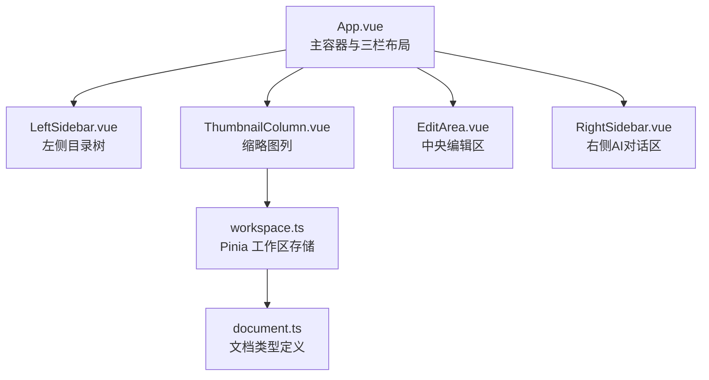
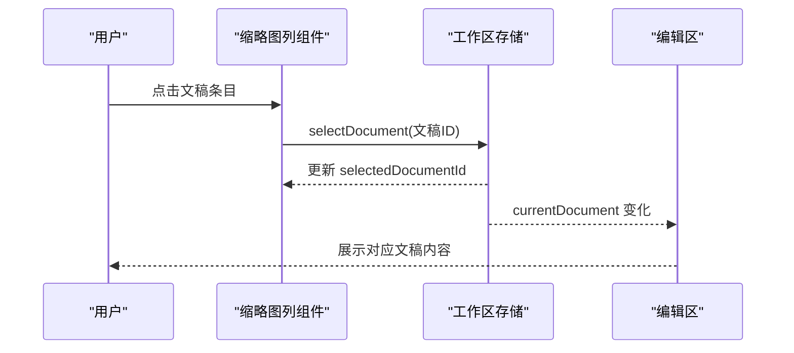
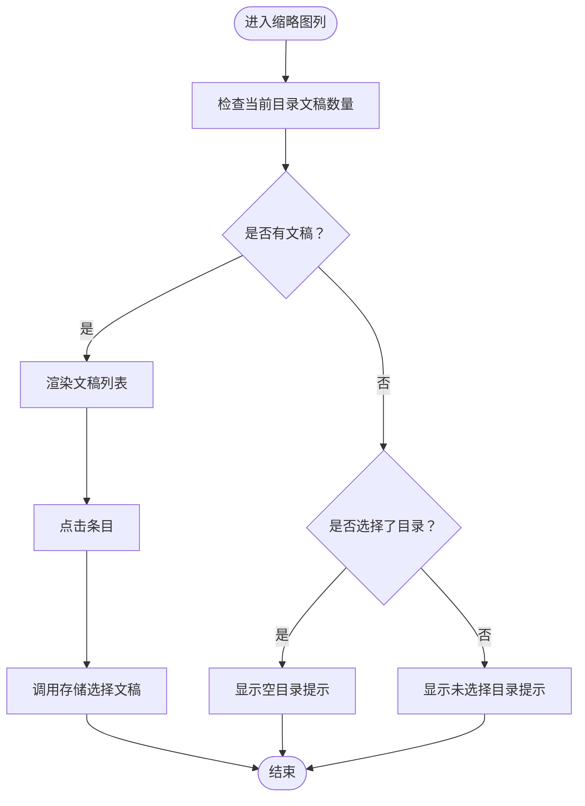
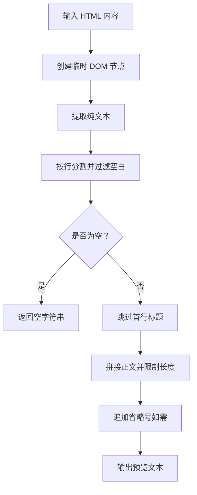
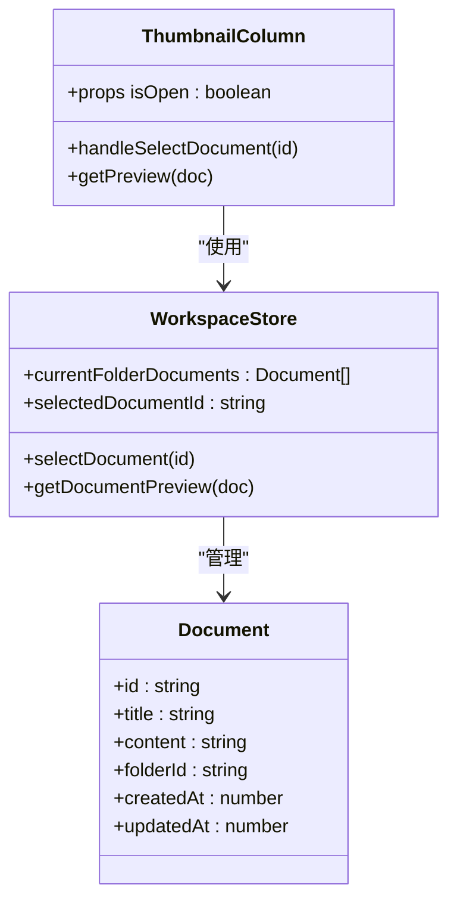
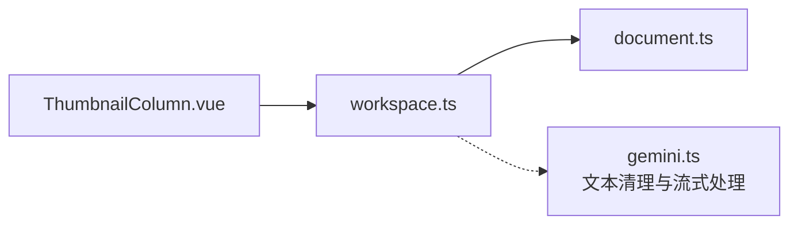

# 缩略图列

<cite>
**本文引用的文件**
- [ThumbnailColumn.vue](file://app/src/components/layout/ThumbnailColumn.vue)
- [workspace.ts](file://app/src/stores/workspace.ts)
- [document.ts](file://app/src/types/document.ts)
- [LeftSidebar.vue](file://app/src/components/layout/LeftSidebar.vue)
- [App.vue](file://app/src/App.vue)
- [style.css](file://app/src/style.css)
- [gemini.ts](file://app/src/services/gemini.ts)
</cite>

## 目录
1. [简介](#简介)
2. [项目结构](#项目结构)
3. [核心组件](#核心组件)
4. [架构总览](#架构总览)
5. [详细组件分析](#详细组件分析)
6. [依赖关系分析](#依赖关系分析)
7. [性能考量](#性能考量)
8. [故障排查指南](#故障排查指南)
9. [结论](#结论)
10. [附录](#附录)

## 简介
缩略图列组件用于在应用主界面中展示当前目录下的文稿列表，提供快速浏览与导航能力。它通过读取工作区存储中的文稿集合，渲染每个文稿的标题与正文预览，并支持点击选中以驱动中央编辑区域的展示。组件还具备折叠/展开的交互能力，配合主题系统与响应式布局，为用户提供一致的视觉与操作体验。

## 项目结构
缩略图列位于布局组件层，与左侧目录树、中央编辑区、右侧AI对话区共同构成主界面的三栏布局。其与工作区存储紧密耦合，从存储中获取当前目录下的文稿列表，并将用户的选择动作委托给存储进行状态更新。

图表来源
- [App.vue:14-27](file://app/src/App.vue#L14-L27)
- [ThumbnailColumn.vue:1-27](file://app/src/components/layout/ThumbnailColumn.vue#L1-L27)
- [workspace.ts:1-321](file://app/src/stores/workspace.ts#L1-L321)
- [document.ts:1-9](file://app/src/types/document.ts#L1-L9)

章节来源
- [App.vue:14-27](file://app/src/App.vue#L14-L27)
- [ThumbnailColumn.vue:1-27](file://app/src/components/layout/ThumbnailColumn.vue#L1-L27)

## 核心组件
- 缩略图列组件负责渲染当前目录下的文稿列表，提供点击选中、悬停高亮、活动态样式等交互反馈。
- 文档预览生成逻辑从HTML内容中提取纯文本，跳过首行标题，截取正文片段，限制长度并追加省略号。
- 工作区存储提供当前目录文稿集合、当前选中文稿、目录选择与文稿选择等状态与方法。

章节来源
- [ThumbnailColumn.vue:29-55](file://app/src/components/layout/ThumbnailColumn.vue#L29-L55)
- [workspace.ts:139-151](file://app/src/stores/workspace.ts#L139-L151)
- [workspace.ts:288-297](file://app/src/stores/workspace.ts#L288-L297)

## 架构总览
缩略图列的渲染流程围绕“状态-视图-交互”展开：
- 状态：工作区存储维护当前目录ID、当前文稿ID、文稿列表等。
- 视图：缩略图列根据当前文稿列表渲染每个条目，显示标题与预览文本。
- 交互：用户点击条目触发存储选择文稿，从而联动中央编辑区更新。

图表来源
- [ThumbnailColumn.vue:41-43](file://app/src/components/layout/ThumbnailColumn.vue#L41-L43)
- [workspace.ts:171-174](file://app/src/stores/workspace.ts#L171-L174)
- [workspace.ts:147-151](file://app/src/stores/workspace.ts#L147-L151)

## 详细组件分析

### 缩略图列组件设计与实现
- 设计目的
  - 提供当前目录下文稿的快速浏览入口，便于用户在众多文稿中定位目标文档。
  - 通过标题与正文预览帮助用户识别文档内容，减少打开编辑区的成本。
  - 作为导航辅助，与左侧目录树形成“目录筛选 + 文稿列表”的双层导航体系。
- 实现要点
  - 使用计算属性获取当前目录下的文稿列表，并按更新时间倒序排列。
  - 渲染每个文稿的标题与预览文本，点击后通过存储更新选中文稿。
  - 支持折叠/展开，宽度与透明度过渡动画提升交互体验。
  - 在无目录、无文稿等状态下显示占位提示，增强可用性。

图表来源
- [ThumbnailColumn.vue:4-26](file://app/src/components/layout/ThumbnailColumn.vue#L4-L26)
- [workspace.ts:139-145](file://app/src/stores/workspace.ts#L139-L145)

章节来源
- [ThumbnailColumn.vue:1-128](file://app/src/components/layout/ThumbnailColumn.vue#L1-L128)
- [workspace.ts:139-145](file://app/src/stores/workspace.ts#L139-L145)

### 文档预览生成机制
- 输入：文稿的HTML内容（来自Tiptap编辑器）。
- 处理步骤：
  - 将HTML内容写入临时DOM节点，提取纯文本。
  - 按行分割并过滤空白行，跳过首行（标题）。
  - 将剩余正文拼接为单行文本，限制长度并在末尾追加省略号。
- 输出：适合在缩略图列中展示的简短预览文本。

图表来源
- [ThumbnailColumn.vue:46-54](file://app/src/components/layout/ThumbnailColumn.vue#L46-L54)
- [workspace.ts:288-297](file://app/src/stores/workspace.ts#L288-L297)

章节来源
- [ThumbnailColumn.vue:46-54](file://app/src/components/layout/ThumbnailColumn.vue#L46-L54)
- [workspace.ts:288-297](file://app/src/stores/workspace.ts#L288-L297)

### 缩略图列渲染逻辑
- 数据来源：工作区存储的当前目录文稿列表（按更新时间倒序）。
- 渲染元素：每个条目包含标题与预览段落，使用CSS实现多行省略与阴影效果。
- 交互状态：活动态条目具有强调边框与阴影，悬停时边框与阴影变化。
- 折叠行为：通过类名切换实现宽度、内边距与透明度的平滑过渡。

图表来源
- [ThumbnailColumn.vue:29-55](file://app/src/components/layout/ThumbnailColumn.vue#L29-L55)
- [workspace.ts:139-151](file://app/src/stores/workspace.ts#L139-L151)
- [document.ts:1-9](file://app/src/types/document.ts#L1-L9)

章节来源
- [ThumbnailColumn.vue:74-113](file://app/src/components/layout/ThumbnailColumn.vue#L74-L113)
- [workspace.ts:139-151](file://app/src/stores/workspace.ts#L139-L151)

### 交互功能
- 点击跳转：点击任意条目触发存储选择文稿，联动编辑区展示对应内容。
- 悬停预览：悬停时条目边框与阴影变化，提供即时反馈。
- 活动感：当前选中条目具有强调边框与阴影，清晰指示当前位置。
- 折叠同步：通过父组件传递的isOpen属性控制缩略图列的显示/隐藏。

章节来源
- [ThumbnailColumn.vue:84-92](file://app/src/components/layout/ThumbnailColumn.vue#L84-L92)
- [ThumbnailColumn.vue:41-43](file://app/src/components/layout/ThumbnailColumn.vue#L41-L43)
- [App.vue:69-72](file://app/src/App.vue#L69-L72)

### 性能优化
- 列表渲染：使用虚拟滚动或分页可进一步优化大量文稿场景下的渲染性能（建议在后续版本引入）。
- 预览生成：预览文本生成在组件内部执行，避免重复计算；可在存储层增加缓存以复用结果（建议在后续版本引入）。
- DOM操作：预览生成仅使用一次性临时DOM节点，避免对页面DOM造成持久影响。
- 动画与过渡：折叠/展开采用CSS过渡，保证流畅体验且不阻塞主线程。

章节来源
- [ThumbnailColumn.vue:46-54](file://app/src/components/layout/ThumbnailColumn.vue#L46-L54)
- [workspace.ts:288-297](file://app/src/stores/workspace.ts#L288-L297)

### 缩略图自定义选项
- 尺寸设置：可通过调整组件宽度与内边距实现不同密度的展示效果。
- 格式选择：当前预览基于纯文本生成；若需富文本摘要，可在存储层扩展生成逻辑。
- 质量控制：预览长度限制与省略号策略可按需调整，以平衡信息密度与可读性。
- 主题适配：组件使用CSS变量，自动跟随主题切换，无需额外配置。

章节来源
- [ThumbnailColumn.vue:58-72](file://app/src/components/layout/ThumbnailColumn.vue#L58-L72)
- [style.css:5-73](file://app/src/style.css#L5-L73)

### 响应式设计考虑
- 布局：主容器采用flex布局，三栏自适应分配空间；缩略图列支持折叠，释放编辑区空间。
- 交互：在小屏设备上，用户可通过快捷键或菜单切换各侧栏的显示状态。
- 文本截断：标题与预览均采用CSS多行省略，避免长文本溢出影响布局。

章节来源
- [App.vue:117-131](file://app/src/App.vue#L117-L131)
- [ThumbnailColumn.vue:94-113](file://app/src/components/layout/ThumbnailColumn.vue#L94-L113)

### 代码示例与扩展开发指南
- 示例路径
  - 缩略图列组件：[ThumbnailColumn.vue](file://app/src/components/layout/ThumbnailColumn.vue)
  - 工作区存储（含预览生成与计算属性）：[workspace.ts](file://app/src/stores/workspace.ts)
  - 文档类型定义：[document.ts](file://app/src/types/document.ts)
  - 主布局容器（三栏布局与快捷键）：[App.vue](file://app/src/App.vue)
  - 主题变量与全局样式：[style.css](file://app/src/style.css)
- 扩展建议
  - 引入虚拟滚动：在大量文稿场景下显著降低渲染开销。
  - 预览缓存：在存储层缓存预览文本，避免重复解析HTML。
  - 富文本摘要：在存储层扩展生成逻辑，支持更丰富的摘要形式。
  - 悬停预览：为条目添加悬停时的轻量预览气泡，提升识别效率。
  - 搜索与筛选：在缩略图列顶部增加搜索框，支持按标题/内容筛选文稿。

章节来源
- [ThumbnailColumn.vue:1-128](file://app/src/components/layout/ThumbnailColumn.vue#L1-L128)
- [workspace.ts:139-151](file://app/src/stores/workspace.ts#L139-L151)
- [App.vue:69-72](file://app/src/App.vue#L69-L72)

## 依赖关系分析
- 组件依赖
  - 缩略图列依赖工作区存储提供的计算属性与方法。
  - 工作区存储依赖文档类型定义，确保数据结构一致性。
- 外部服务
  - AI服务模块提供HTML文本清理与流式响应能力，虽与缩略图列无直接耦合，但展示了项目中统一的文本处理模式。

图表来源
- [ThumbnailColumn.vue:30-39](file://app/src/components/layout/ThumbnailColumn.vue#L30-L39)
- [workspace.ts:1-321](file://app/src/stores/workspace.ts#L1-L321)
- [gemini.ts:17-24](file://app/src/services/gemini.ts#L17-L24)

章节来源
- [ThumbnailColumn.vue:30-39](file://app/src/components/layout/ThumbnailColumn.vue#L30-L39)
- [workspace.ts:1-321](file://app/src/stores/workspace.ts#L1-L321)
- [gemini.ts:17-24](file://app/src/services/gemini.ts#L17-L24)

## 性能考量
- 渲染复杂度：列表渲染为O(n)，预览生成为O(m)（m为文本长度），整体近似O(n+m)。
- 内存占用：临时DOM节点仅在生成预览时存在，生命周期短，内存压力可控。
- 动画与过渡：CSS过渡不阻塞主线程，保持UI流畅。
- 建议优化：
  - 对于超大文稿库，引入虚拟滚动或分页加载。
  - 在存储层缓存预览文本，减少重复解析。
  - 将预览生成逻辑迁移至Web Worker，避免阻塞UI线程（高级场景）。

章节来源
- [ThumbnailColumn.vue:46-54](file://app/src/components/layout/ThumbnailColumn.vue#L46-L54)
- [workspace.ts:288-297](file://app/src/stores/workspace.ts#L288-L297)

## 故障排查指南
- 问题：点击条目无反应
  - 排查：确认工作区存储的selectDocument方法被正确调用，且selectedDocumentId已更新。
  - 参考：[ThumbnailColumn.vue:41-43](file://app/src/components/layout/ThumbnailColumn.vue#L41-L43)、[workspace.ts:171-174](file://app/src/stores/workspace.ts#L171-L174)
- 问题：预览文本异常或为空
  - 排查：检查文稿content是否为合法HTML；确认预览生成逻辑未被外部修改。
  - 参考：[ThumbnailColumn.vue:46-54](file://app/src/components/layout/ThumbnailColumn.vue#L46-L54)
- 问题：缩略图列不显示或不可见
  - 排查：检查isOpen属性是否为true；确认CSS过渡类名未被覆盖。
  - 参考：[ThumbnailColumn.vue:2](file://app/src/components/layout/ThumbnailColumn.vue#L2)、[ThumbnailColumn.vue:67-72](file://app/src/components/layout/ThumbnailColumn.vue#L67-L72)
- 问题：主题切换后样式异常
  - 排查：确认CSS变量定义完整，组件使用了正确的变量名。
  - 参考：[style.css:5-73](file://app/src/style.css#L5-L73)

章节来源
- [ThumbnailColumn.vue:41-43](file://app/src/components/layout/ThumbnailColumn.vue#L41-L43)
- [workspace.ts:171-174](file://app/src/stores/workspace.ts#L171-L174)
- [ThumbnailColumn.vue:46-54](file://app/src/components/layout/ThumbnailColumn.vue#L46-L54)
- [ThumbnailColumn.vue:2](file://app/src/components/layout/ThumbnailColumn.vue#L2)
- [ThumbnailColumn.vue:67-72](file://app/src/components/layout/ThumbnailColumn.vue#L67-L72)
- [style.css:5-73](file://app/src/style.css#L5-L73)

## 结论
缩略图列组件以简洁的结构实现了目录文稿的快速浏览与导航，结合工作区存储的状态管理与主题系统的无缝适配，提供了良好的用户体验。通过合理的预览生成与交互反馈，用户可以高效地在众多文稿中定位目标文档。未来可在虚拟滚动、预览缓存与富文本摘要等方面进一步优化，以满足更大规模数据集的性能与体验需求。

## 附录
- 相关文件路径
  - 缩略图列组件：[ThumbnailColumn.vue](file://app/src/components/layout/ThumbnailColumn.vue)
  - 工作区存储：[workspace.ts](file://app/src/stores/workspace.ts)
  - 文档类型定义：[document.ts](file://app/src/types/document.ts)
  - 主布局容器：[App.vue](file://app/src/App.vue)
  - 主题样式：[style.css](file://app/src/style.css)
  - 文本处理服务：[gemini.ts](file://app/src/services/gemini.ts)