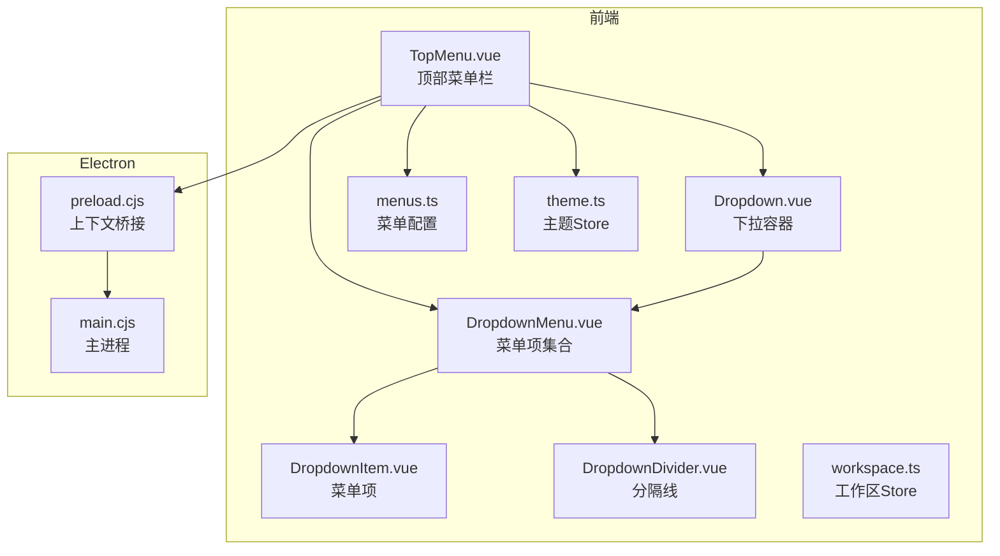
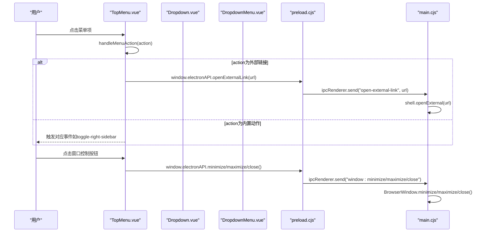
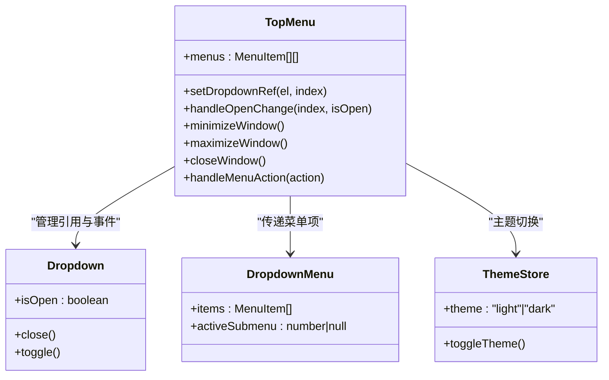
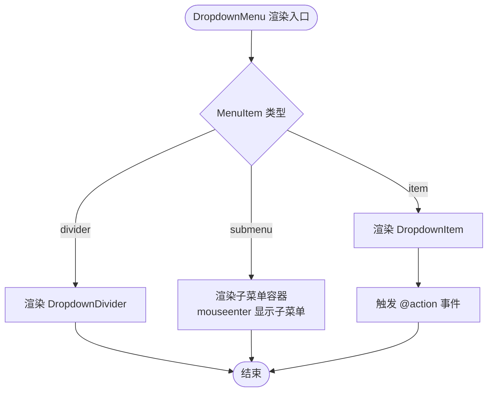
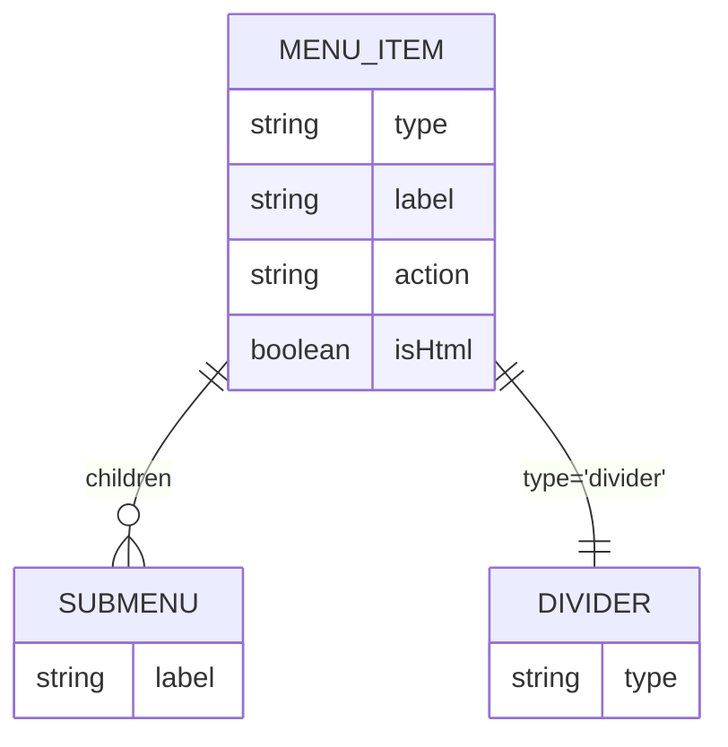
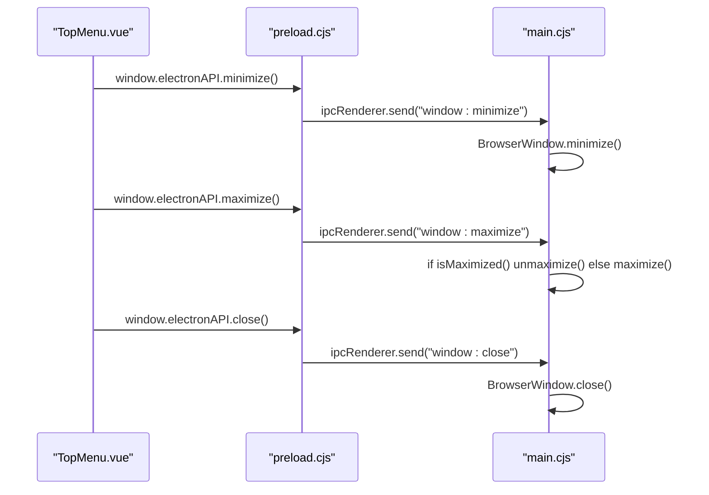
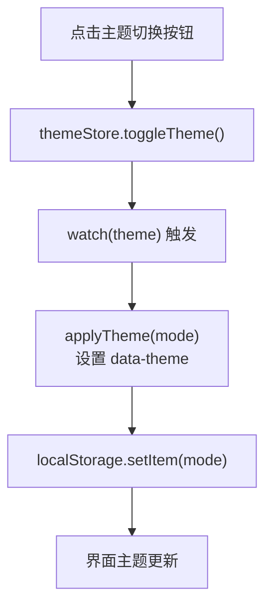
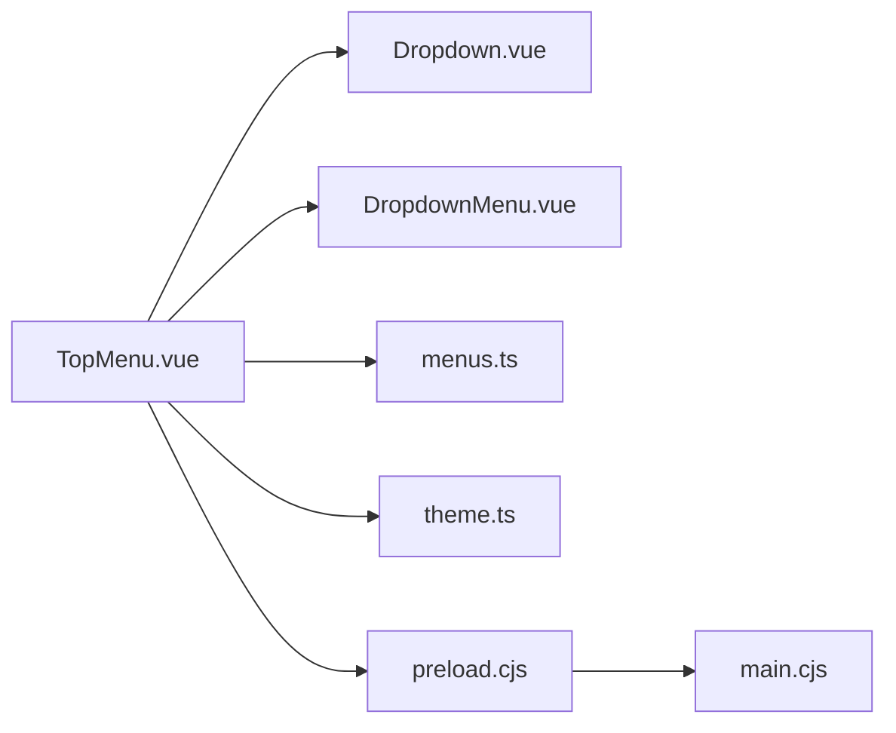

# 顶部菜单栏

<cite>
**本文档引用的文件**
- [TopMenu.vue](file://app/src/components/layout/TopMenu.vue)
- [menus.ts](file://app/src/config/menus.ts)
- [Dropdown.vue](file://app/src/components/ui/Dropdown.vue)
- [DropdownMenu.vue](file://app/src/components/ui/DropdownMenu.vue)
- [DropdownItem.vue](file://app/src/components/ui/DropdownItem.vue)
- [DropdownDivider.vue](file://app/src/components/ui/DropdownDivider.vue)
- [theme.ts](file://app/src/stores/theme.ts)
- [workspace.ts](file://app/src/stores/workspace.ts)
- [main.cjs](file://app/electron/main.cjs)
- [preload.cjs](file://app/electron/preload.cjs)
</cite>

## 目录
1. [简介](#简介)
2. [项目结构](#项目结构)
3. [核心组件](#核心组件)
4. [架构总览](#架构总览)
5. [详细组件分析](#详细组件分析)
6. [依赖关系分析](#依赖关系分析)
7. [性能考虑](#性能考虑)
8. [故障排除指南](#故障排除指南)
9. [结论](#结论)
10. [附录](#附录)

## 简介
本文件为Woo顶部菜单栏组件的详细技术文档，聚焦于TopMenu组件的实现架构与使用说明。内容涵盖：
- 菜单配置系统（fileMenuItems、editMenuItems、aiMenuItems等）
- 下拉菜单组件集成（Dropdown及其子组件）
- 窗口控制按钮功能（最小化、最大化、关闭）与Electron API对接
- 主题切换机制（Pinia Store + 本地存储）
- 菜单项数据结构设计（标签、子菜单、动作处理）
- Dropdown组件的复用机制（组件引用管理、事件传播、状态同步）
- 最佳实践（动态菜单生成、图标集成、响应式设计）
- 具体代码示例路径与自定义菜单项添加方法

## 项目结构
顶部菜单栏位于应用前端的布局层，采用Vue 3 Composition API与TypeScript实现，并通过Electron桥接实现原生窗口控制能力。整体结构如下：

图表来源
- [TopMenu.vue:1-262](file://app/src/components/layout/TopMenu.vue#L1-L262)
- [Dropdown.vue:1-88](file://app/src/components/ui/Dropdown.vue#L1-L88)
- [DropdownMenu.vue:1-115](file://app/src/components/ui/DropdownMenu.vue#L1-L115)
- [DropdownItem.vue:1-26](file://app/src/components/ui/DropdownItem.vue#L1-L26)
- [DropdownDivider.vue:1-12](file://app/src/components/ui/DropdownDivider.vue#L1-L12)
- [menus.ts:1-103](file://app/src/config/menus.ts#L1-L103)
- [theme.ts:1-31](file://app/src/stores/theme.ts#L1-L31)
- [workspace.ts:1-321](file://app/src/stores/workspace.ts#L1-L321)
- [preload.cjs:1-18](file://app/electron/preload.cjs#L1-L18)
- [main.cjs:1-71](file://app/electron/main.cjs#L1-L71)

章节来源
- [TopMenu.vue:1-262](file://app/src/components/layout/TopMenu.vue#L1-L262)
- [menus.ts:1-103](file://app/src/config/menus.ts#L1-L103)

## 核心组件
- TopMenu.vue：顶部菜单栏容器，负责组织菜单项、窗口控制按钮、主题切换与事件转发。
- Dropdown系列组件：Dropdown.vue（容器）、DropdownMenu.vue（菜单项集合）、DropdownItem.vue（菜单项）、DropdownDivider.vue（分隔线）。
- menus.ts：集中定义所有菜单项的数据结构与配置。
- theme.ts：主题状态管理（Pinia），支持持久化与DOM同步。
- workspace.ts：工作区状态（用于演示菜单项与工作流的关联）。
- Electron侧：preload.cjs暴露window.electronAPI；main.cjs处理窗口控制IPC。

章节来源
- [TopMenu.vue:50-170](file://app/src/components/layout/TopMenu.vue#L50-L170)
- [menus.ts:1-103](file://app/src/config/menus.ts#L1-L103)
- [Dropdown.vue:14-53](file://app/src/components/ui/Dropdown.vue#L14-L53)
- [DropdownMenu.vue:42-62](file://app/src/components/ui/DropdownMenu.vue#L42-L62)
- [DropdownItem.vue:7-11](file://app/src/components/ui/DropdownItem.vue#L7-L11)
- [DropdownDivider.vue:1-12](file://app/src/components/ui/DropdownDivider.vue#L1-L12)
- [theme.ts:8-30](file://app/src/stores/theme.ts#L8-L30)
- [workspace.ts:6-320](file://app/src/stores/workspace.ts#L6-L320)
- [preload.cjs:4-13](file://app/electron/preload.cjs#L4-L13)
- [main.cjs:33-58](file://app/electron/main.cjs#L33-L58)

## 架构总览
TopMenu通过组合Dropdown组件实现多级菜单，菜单项来源于menus.ts的配置数组。Dropdown内部维护isOpen状态并通过事件向上抛出open-change，TopMenu统一管理多个Dropdown的互斥打开。窗口控制按钮通过window.electronAPI调用Electron主进程提供的IPC接口，实现最小化、最大化/还原、关闭等操作。主题切换由theme.ts的Pinia Store驱动，自动写入localStorage并在DOM上应用data-theme属性。

图表来源
- [TopMenu.vue:134-169](file://app/src/components/layout/TopMenu.vue#L134-L169)
- [preload.cjs:6-12](file://app/electron/preload.cjs#L6-L12)
- [main.cjs:34-48](file://app/electron/main.cjs#L34-L48)

## 详细组件分析

### TopMenu组件分析
- 菜单配置系统
  - 使用类TopMenu.menus聚合多个菜单配置数组（文件、编辑、AI、标记、查看、帮助）。
  - 通过v-for渲染每个菜单，Dropdown组件接收items并传递给DropdownMenu。
- Dropdown复用机制
  - setDropdownRef收集每个Dropdown实例，用于统一控制其open状态。
  - handleOpenChange确保同一时刻仅有一个下拉菜单处于打开状态，避免视觉冲突。
- 窗口控制按钮
  - minimizeWindow/maximizeWindow/closeWindow通过window.electronAPI调用Electron IPC。
  - 仅在window.electronAPI存在时执行，保证在非Electron环境下不报错。
- 主题切换
  - 通过useThemeStore().toggleTheme()切换主题模式，配合CSS变量实现全局主题切换。
- 事件传播
  - DropdownMenu通过@action向上传递具体action字符串，TopMenu统一处理并触发相应事件或外部动作。

图表来源
- [TopMenu.vue:76-169](file://app/src/components/layout/TopMenu.vue#L76-L169)
- [Dropdown.vue:17-52](file://app/src/components/ui/Dropdown.vue#L17-L52)
- [DropdownMenu.vue:48-57](file://app/src/components/ui/DropdownMenu.vue#L48-L57)
- [theme.ts:8-30](file://app/src/stores/theme.ts#L8-L30)

章节来源
- [TopMenu.vue:75-169](file://app/src/components/layout/TopMenu.vue#L75-L169)

### Dropdown组件体系
- Dropdown.vue
  - 维护isOpen状态，提供close/toggle方法供父组件调用。
  - 监听document点击以实现点击外部关闭。
  - 通过插槽暴露触发区域与下拉菜单内容。
- DropdownMenu.vue
  - 根据MenuItem类型渲染DropdownItem或DropdownDivider。
  - 对于submenu类型，使用嵌套DropdownMenu实现多级菜单，并通过mouseenter/mouseleave控制显示。
  - 将子菜单的action事件冒泡至父组件。
- DropdownItem.vue/DropdownDivider.vue
  - 提供基础交互样式与hover效果。

图表来源
- [DropdownMenu.vue:3-38](file://app/src/components/ui/DropdownMenu.vue#L3-L38)
- [DropdownItem.vue:1-26](file://app/src/components/ui/DropdownItem.vue#L1-L26)
- [DropdownDivider.vue:1-12](file://app/src/components/ui/DropdownDivider.vue#L1-L12)

章节来源
- [Dropdown.vue:14-53](file://app/src/components/ui/Dropdown.vue#L14-L53)
- [DropdownMenu.vue:42-62](file://app/src/components/ui/DropdownMenu.vue#L42-L62)
- [DropdownItem.vue:7-11](file://app/src/components/ui/DropdownItem.vue#L7-L11)
- [DropdownDivider.vue:1-12](file://app/src/components/ui/DropdownDivider.vue#L1-L12)

### 菜单项数据结构设计
- MenuItem接口
  - type: 'item' | 'divider' | 'submenu'
  - label: 显示文本或HTML（当isHtml为true时）
  - action: 动作标识符，用于TopMenu统一处理
  - children: 子菜单数组（仅submenu有效）
- 菜单配置
  - fileMenuItems：文件操作、导入/导出、设置、更新、退出等
  - editMenuItems：撤销、反撤销、查找与替换
  - aiMenuItems：AI相关入口（如打开聊天）
  - markMenuItems：Markdown语法快速插入
  - viewMenuItems：侧栏开关、外观、主题、语言
  - helpMenuItems：文档与外部链接

图表来源
- [menus.ts:4-10](file://app/src/config/menus.ts#L4-L10)

章节来源
- [menus.ts:1-103](file://app/src/config/menus.ts#L1-L103)

### 窗口控制按钮功能
- 实现方式
  - TopMenu通过window.electronAPI调用IPC：minimize、maximize、close。
  - Electron主进程main.cjs监听对应IPC并调用BrowserWindow方法。
  - preload.cjs通过contextBridge.exposeInMainWorld暴露electronAPI给渲染进程。
- 注意事项
  - 仅在window.electronAPI可用时才执行，避免在Web环境报错。
  - maximize逻辑区分最大化与还原状态，由主进程判断并切换。

图表来源
- [TopMenu.vue:134-150](file://app/src/components/layout/TopMenu.vue#L134-L150)
- [preload.cjs:6-8](file://app/electron/preload.cjs#L6-L8)
- [main.cjs:34-48](file://app/electron/main.cjs#L34-L48)

章节来源
- [TopMenu.vue:134-150](file://app/src/components/layout/TopMenu.vue#L134-L150)
- [preload.cjs:4-13](file://app/electron/preload.cjs#L4-L13)
- [main.cjs:33-58](file://app/electron/main.cjs#L33-L58)

### 主题切换机制
- 数据流
  - theme.ts使用Pinia Store保存当前主题模式（light/dark），默认从localStorage读取。
  - watch监听主题变化，立即应用到documentElement的data-theme属性，并持久化到localStorage。
- UI表现
  - TopMenu右上角按钮根据当前主题模式显示不同图标，并在点击时切换主题。
  - CSS变量基于data-theme生效，实现全局主题切换。

图表来源
- [theme.ts:16-24](file://app/src/stores/theme.ts#L16-L24)

章节来源
- [theme.ts:8-30](file://app/src/stores/theme.ts#L8-L30)
- [TopMenu.vue:30-32](file://app/src/components/layout/TopMenu.vue#L30-L32)

## 依赖关系分析
- 组件耦合
  - TopMenu对Dropdown系列组件强依赖，通过事件与引用管理实现互斥打开。
  - TopMenu依赖menus.ts的配置数据，实现菜单的声明式构建。
  - TopMenu依赖theme.ts进行主题切换，依赖window.electronAPI进行窗口控制。
- 外部依赖
  - Electron IPC：通过preload.cjs暴露API，main.cjs处理窗口控制。
- 可能的循环依赖
  - 当前结构未发现循环依赖，DropdownMenu对自身递归使用不会导致循环导入。

图表来源
- [TopMenu.vue:61-71](file://app/src/components/layout/TopMenu.vue#L61-L71)
- [Dropdown.vue:14-53](file://app/src/components/ui/Dropdown.vue#L14-L53)
- [DropdownMenu.vue:42-46](file://app/src/components/ui/DropdownMenu.vue#L42-L46)
- [menus.ts:64-71](file://app/src/config/menus.ts#L64-L71)
- [theme.ts:63](file://app/src/stores/theme.ts#L63)
- [preload.cjs:4-13](file://app/electron/preload.cjs#L4-L13)
- [main.cjs:33-58](file://app/electron/main.cjs#L33-L58)

章节来源
- [TopMenu.vue:61-71](file://app/src/components/layout/TopMenu.vue#L61-L71)
- [Dropdown.vue:14-53](file://app/src/components/ui/Dropdown.vue#L14-L53)
- [DropdownMenu.vue:42-46](file://app/src/components/ui/DropdownMenu.vue#L42-L46)
- [menus.ts:64-71](file://app/src/config/menus.ts#L64-L71)
- [theme.ts:63](file://app/src/stores/theme.ts#L63)
- [preload.cjs:4-13](file://app/electron/preload.cjs#L4-L13)
- [main.cjs:33-58](file://app/electron/main.cjs#L33-L58)

## 性能考虑
- 渲染优化
  - DropdownMenu使用v-for渲染，建议为每个菜单项提供稳定key（当前已使用index），避免不必要的重排。
  - 子菜单显示使用mouseenter/mouseleave控制，注意在移动端可能需要额外的触摸支持。
- 事件处理
  - handleOpenChange在每次打开时关闭其他菜单，复杂场景下可考虑节流或防抖以减少频繁DOM操作。
- 主题切换
  - theme.ts使用watch即时应用，建议在大量主题切换时避免频繁重绘，可通过requestAnimationFrame优化。
- 窗口控制
  - window.electronAPI调用为轻量IPC，无需额外优化；但需确保在非Electron环境不执行。

## 故障排除指南
- 窗口控制按钮无效
  - 检查window.electronAPI是否存在，确认preload.cjs是否正确暴露API。
  - 确认main.cjs是否注册了对应IPC监听器。
- 下拉菜单无法关闭
  - 检查Dropdown.vue的点击外部关闭逻辑是否正常绑定与解绑。
  - 确认TopMenu.handleOpenChange是否正确调用dropdownRefs的close方法。
- 主题切换不生效
  - 检查theme.ts的watch是否触发，data-theme是否正确设置到documentElement。
  - 确认CSS变量是否正确引用data-theme。
- 子菜单不显示
  - 检查DropdownMenu.vue的mouseenter/mouseleave逻辑与activeSubmenu状态。
  - 确认子菜单items传入正确且children配置完整。

章节来源
- [TopMenu.vue:106-122](file://app/src/components/layout/TopMenu.vue#L106-L122)
- [Dropdown.vue:37-50](file://app/src/components/ui/Dropdown.vue#L37-L50)
- [DropdownMenu.vue:22-36](file://app/src/components/ui/DropdownMenu.vue#L22-L36)
- [theme.ts:21-24](file://app/src/stores/theme.ts#L21-L24)
- [preload.cjs:4-13](file://app/electron/preload.cjs#L4-L13)
- [main.cjs:33-58](file://app/electron/main.cjs#L33-L58)

## 结论
TopMenu组件通过清晰的配置驱动与组件化设计，实现了灵活的菜单系统与良好的用户体验。Dropdown系列组件提供了强大的可复用性，结合menus.ts的声明式配置，使得新增菜单项与子菜单变得简单直观。窗口控制与主题切换通过Electron与Pinia Store分别实现，既满足桌面应用特性，又保持前端状态管理的一致性。建议在后续迭代中进一步增强移动端交互体验与菜单项的动态生成能力。

## 附录

### 菜单配置最佳实践
- 动态菜单生成
  - 通过menus.ts的MenuItem接口扩展children字段，实现任意层级子菜单。
  - 在运行时根据用户权限或上下文动态过滤/拼接菜单项。
- 图标集成
  - 使用IconXxx.vue组件作为菜单项图标，保持视觉一致性。
  - 对于HTML富文本标签（如粗体、斜体），启用isHtml以支持富文本显示。
- 响应式设计
  - 菜单项宽度与间距通过CSS变量统一管理，便于主题适配。
  - 子菜单定位使用绝对定位，避免破坏主菜单布局。

章节来源
- [menus.ts:4-10](file://app/src/config/menus.ts#L4-L10)
- [DropdownMenu.vue:64-79](file://app/src/components/ui/DropdownMenu.vue#L64-L79)

### 自定义菜单项添加方法
- 新增菜单项
  - 在menus.ts中选择目标菜单数组（如fileMenuItems），添加新的MenuItem对象。
  - 若需要子菜单，设置type为'submenu'并提供children数组。
- 绑定动作处理
  - 在TopMenu.handleMenuAction中添加对新action的分支处理。
  - 对于窗口控制或外部链接，直接调用window.electronAPI或触发对应事件。
- 示例参考路径
  - [menus.ts:13-42](file://app/src/config/menus.ts#L13-L42)
  - [TopMenu.vue:153-169](file://app/src/components/layout/TopMenu.vue#L153-L169)