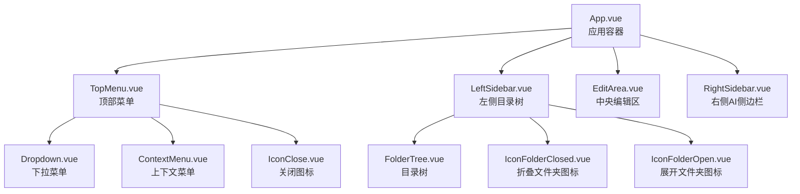
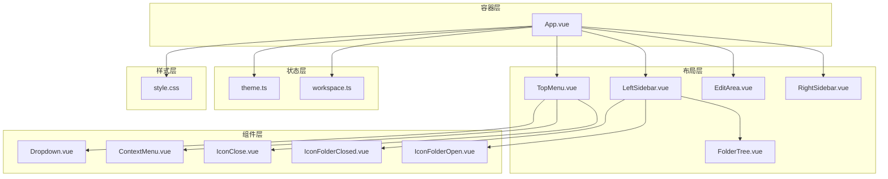
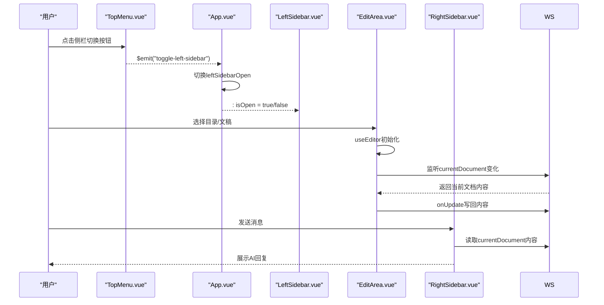
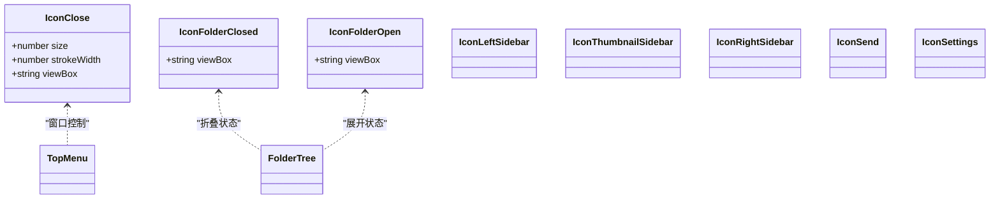
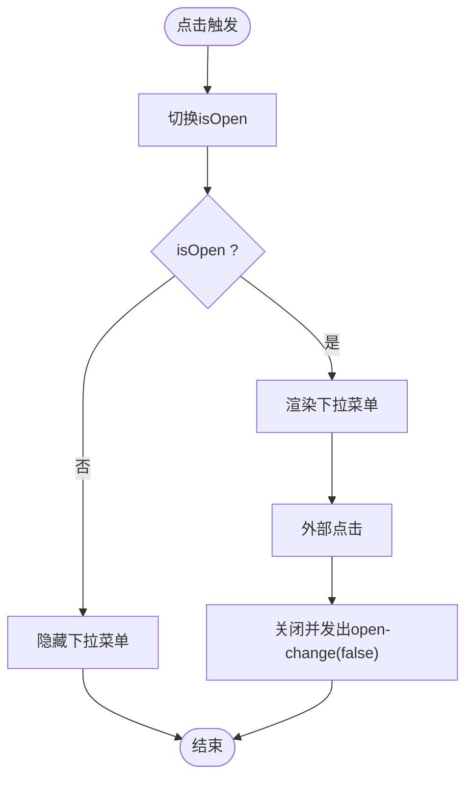
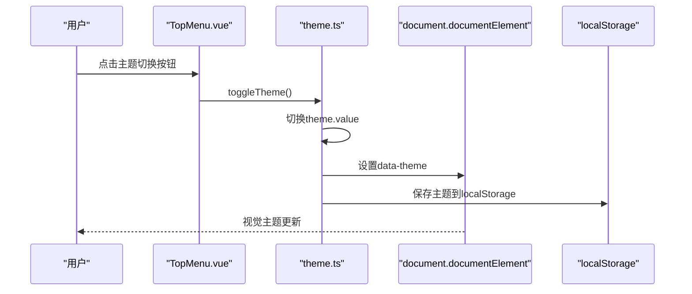
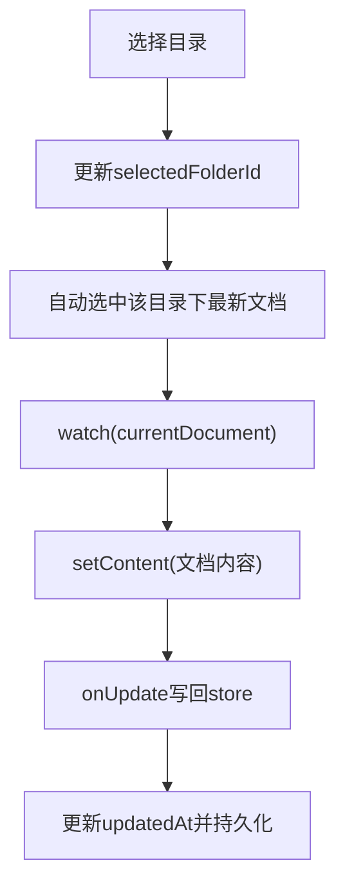
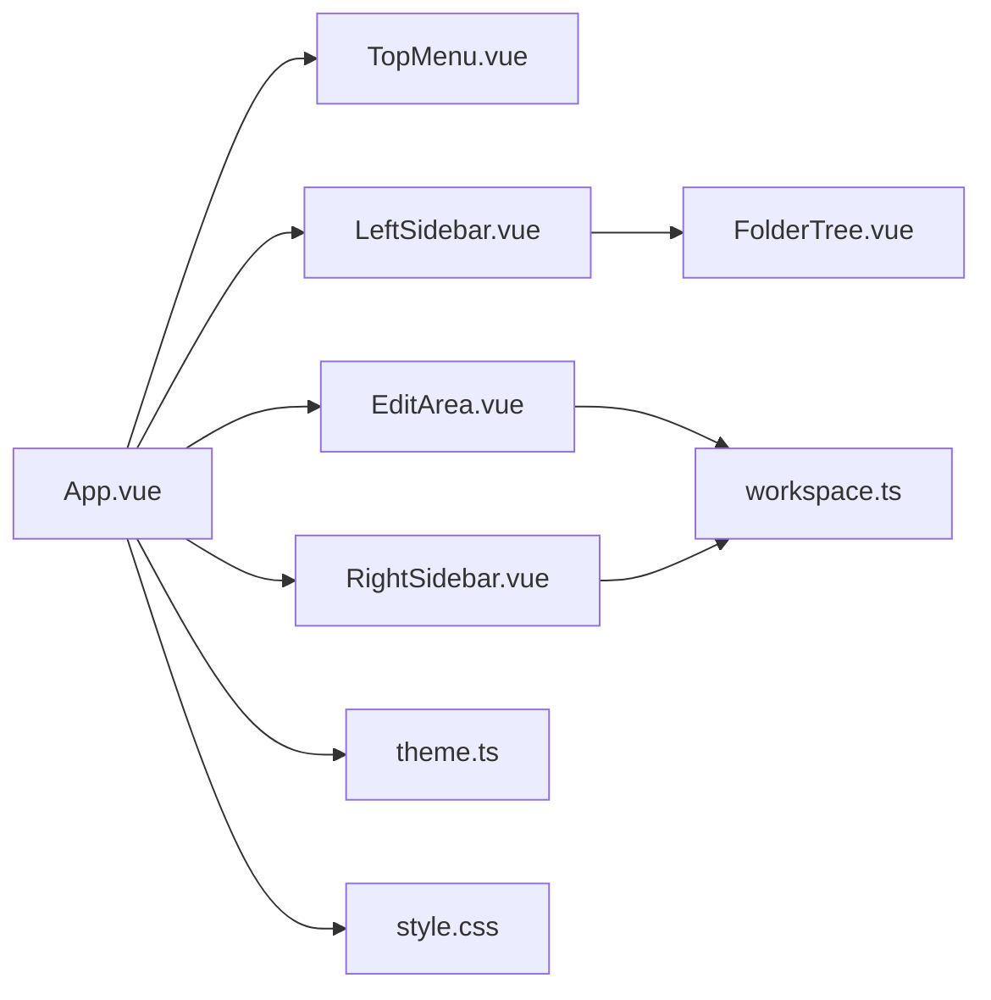

# 用户界面组件

<cite>
**本文档引用的文件**
- [App.vue](file://app/src/App.vue)
- [TopMenu.vue](file://app/src/components/layout/TopMenu.vue)
- [LeftSidebar.vue](file://app/src/components/layout/LeftSidebar.vue)
- [EditArea.vue](file://app/src/components/layout/EditArea.vue)
- [RightSidebar.vue](file://app/src/components/layout/RightSidebar.vue)
- [FolderTree.vue](file://app/src/components/layout/FolderTree.vue)
- [Dropdown.vue](file://app/src/components/ui/Dropdown.vue)
- [ContextMenu.vue](file://app/src/components/ui/ContextMenu.vue)
- [IconClose.vue](file://app/src/components/icons/IconClose.vue)
- [IconFolderClosed.vue](file://app/src/components/icons/IconFolderClosed.vue)
- [IconFolderOpen.vue](file://app/src/components/icons/IconFolderOpen.vue)
- [style.css](file://app/src/style.css)
- [theme.ts](file://app/src/stores/theme.ts)
- [workspace.ts](file://app/src/stores/workspace.ts)
- [main.ts](file://app/src/main.ts)
</cite>

## 目录
1. [简介](#简介)
2. [项目结构](#项目结构)
3. [核心组件](#核心组件)
4. [架构总览](#架构总览)
5. [详细组件分析](#详细组件分析)
6. [依赖关系分析](#依赖关系分析)
7. [性能考量](#性能考量)
8. [故障排查指南](#故障排查指南)
9. [结论](#结论)
10. [附录](#附录)

## 简介
本文件面向Woo的用户界面组件系统，围绕三栏布局（TopMenu顶部菜单、LeftSidebar左侧目录树、EditArea中央编辑区、RightSidebar右侧AI侧边栏）进行深入解析，并补充图标组件系统、UI交互组件（下拉菜单、上下文菜单）、主题系统与状态管理、响应式与无障碍优化、以及使用示例与最佳实践。

## 项目结构
- 应用入口通过Vue应用挂载于#app，初始化Pinia状态管理与全局样式。
- 布局容器负责组织四个主要区域：顶部菜单、左侧边栏、中间编辑区、右侧AI侧边栏。
- 图标组件以SVG形式提供，统一尺寸与描边规范，便于主题切换时保持视觉一致性。
- UI组件（Dropdown、ContextMenu）提供可复用的交互能力，支持键盘与鼠标操作。
- 主题系统通过CSS变量与Pinia store实现深浅主题切换与持久化。

**图表来源**
- [App.vue:1-111](file://app/src/App.vue#L1-L111)
- [TopMenu.vue:1-223](file://app/src/components/layout/TopMenu.vue#L1-L223)
- [LeftSidebar.vue:1-204](file://app/src/components/layout/LeftSidebar.vue#L1-L204)
- [EditArea.vue:1-463](file://app/src/components/layout/EditArea.vue#L1-L463)
- [RightSidebar.vue:1-432](file://app/src/components/layout/RightSidebar.vue#L1-L432)
- [FolderTree.vue:1-49](file://app/src/components/layout/FolderTree.vue#L1-L49)
- [Dropdown.vue:1-88](file://app/src/components/ui/Dropdown.vue#L1-L88)
- [ContextMenu.vue:1-111](file://app/src/components/ui/ContextMenu.vue#L1-L111)
- [IconClose.vue:1-28](file://app/src/components/icons/IconClose.vue#L1-L28)
- [IconFolderClosed.vue:1-23](file://app/src/components/icons/IconFolderClosed.vue#L1-L23)
- [IconFolderOpen.vue:1-24](file://app/src/components/icons/IconFolderOpen.vue#L1-L24)

**章节来源**
- [main.ts:1-8](file://app/src/main.ts#L1-L8)
- [App.vue:1-111](file://app/src/App.vue#L1-L111)

## 核心组件
- 三栏布局职责
  - TopMenu：提供应用级菜单、窗口控制按钮、主题切换入口与设置入口；内部嵌套Dropdown与DropdownMenu。
  - LeftSidebar：左侧工具区与目录树，支持右键菜单、目录选择、重命名与创建/删除目录。
  - EditArea：基于Tiptap的富文本编辑器，支持Markdown扩展、快捷键、状态栏统计与内容同步。
  - RightSidebar：AI聊天侧边栏，支持模型选择、消息流式渲染、快速提示、API Key配置与错误提示。
- 图标组件系统
  - 统一采用SVG，支持size与strokeWidth参数，默认尺寸18×18，描边宽度2。
  - 文件夹图标区分折叠/展开状态，保证视觉层级清晰。
- UI组件库
  - Dropdown：可触发下拉菜单，支持外部点击关闭与open-change事件。
  - ContextMenu：固定定位上下文菜单，自动避屏边界，支持禁用项与点击外部关闭。
- 主题系统
  - CSS变量集中于style.css，通过data-theme属性在<html>上切换。
  - Pinia store持久化主题偏好，初始化即应用到DOM，保证首屏一致性。
- 状态管理
  - workspace.ts：目录树、文档集合、当前选中项、计算属性与增删改查操作。
  - theme.ts：主题模式切换与持久化。
- 响应式与无障碍
  - 使用CSS变量与过渡动画提升主题切换体验。
  - 编辑器与侧边栏均提供滚动条自定义样式，避免平台默认滚动条影响。
  - 键盘快捷键支持（如Ctrl+1/2/3切换侧栏、编辑器快捷键）。

**章节来源**
- [TopMenu.vue:1-223](file://app/src/components/layout/TopMenu.vue#L1-L223)
- [LeftSidebar.vue:1-204](file://app/src/components/layout/LeftSidebar.vue#L1-L204)
- [EditArea.vue:1-463](file://app/src/components/layout/EditArea.vue#L1-L463)
- [RightSidebar.vue:1-432](file://app/src/components/layout/RightSidebar.vue#L1-L432)
- [Dropdown.vue:1-88](file://app/src/components/ui/Dropdown.vue#L1-L88)
- [ContextMenu.vue:1-111](file://app/src/components/ui/ContextMenu.vue#L1-L111)
- [IconClose.vue:1-28](file://app/src/components/icons/IconClose.vue#L1-L28)
- [IconFolderClosed.vue:1-23](file://app/src/components/icons/IconFolderClosed.vue#L1-L23)
- [IconFolderOpen.vue:1-24](file://app/src/components/icons/IconFolderOpen.vue#L1-L24)
- [style.css:1-286](file://app/src/style.css#L1-L286)
- [theme.ts:1-31](file://app/src/stores/theme.ts#L1-L31)
- [workspace.ts:1-321](file://app/src/stores/workspace.ts#L1-L321)

## 架构总览
整体采用“容器-布局-组件”分层：
- 容器层：App.vue负责布局与事件桥接。
- 布局层：TopMenu、LeftSidebar、EditArea、RightSidebar承担各自职责。
- 组件层：Dropdown、ContextMenu、各类图标组件提供通用交互与视觉元素。
- 状态层：Pinia store集中管理主题与工作区数据。

**图表来源**
- [App.vue:1-111](file://app/src/App.vue#L1-L111)
- [TopMenu.vue:1-223](file://app/src/components/layout/TopMenu.vue#L1-L223)
- [LeftSidebar.vue:1-204](file://app/src/components/layout/LeftSidebar.vue#L1-L204)
- [EditArea.vue:1-463](file://app/src/components/layout/EditArea.vue#L1-L463)
- [RightSidebar.vue:1-432](file://app/src/components/layout/RightSidebar.vue#L1-L432)
- [FolderTree.vue:1-49](file://app/src/components/layout/FolderTree.vue#L1-L49)
- [Dropdown.vue:1-88](file://app/src/components/ui/Dropdown.vue#L1-L88)
- [ContextMenu.vue:1-111](file://app/src/components/ui/ContextMenu.vue#L1-L111)
- [IconClose.vue:1-28](file://app/src/components/icons/IconClose.vue#L1-L28)
- [IconFolderClosed.vue:1-23](file://app/src/components/icons/IconFolderClosed.vue#L1-L23)
- [IconFolderOpen.vue:1-24](file://app/src/components/icons/IconFolderOpen.vue#L1-L24)
- [theme.ts:1-31](file://app/src/stores/theme.ts#L1-L31)
- [workspace.ts:1-321](file://app/src/stores/workspace.ts#L1-L321)
- [style.css:1-286](file://app/src/style.css#L1-L286)

## 详细组件分析

### 三栏布局与交互流程
- 顶部菜单与侧栏切换
  - TopMenu通过$emit向上抛出toggle事件，App.vue接收并切换对应侧栏的isOpen状态。
  - 支持键盘快捷键：Ctrl+1/2/3分别切换左侧菜单、缩略图栏、右侧AI侧边栏。
- 编辑区与工作区联动
  - EditArea根据workspace.store.currentDocument动态加载内容，编辑器变更通过onUpdate写回store。
  - LeftSidebar与FolderTree配合，实现目录选择、展开/折叠、右键菜单操作（创建同级/子级目录、删除）。
- AI侧边栏与编辑器协作
  - RightSidebar读取当前文档内容作为上下文，发送给AI服务；支持流式渲染与智能滚动至底部。

**图表来源**
- [TopMenu.vue:104-147](file://app/src/components/layout/TopMenu.vue#L104-L147)
- [App.vue:50-63](file://app/src/App.vue#L50-L63)
- [LeftSidebar.vue:69-73](file://app/src/components/layout/LeftSidebar.vue#L69-L73)
- [EditArea.vue:151-164](file://app/src/components/layout/EditArea.vue#L151-L164)
- [RightSidebar.vue:120-129](file://app/src/components/layout/RightSidebar.vue#L120-L129)

**章节来源**
- [App.vue:50-94](file://app/src/App.vue#L50-L94)
- [TopMenu.vue:104-147](file://app/src/components/layout/TopMenu.vue#L104-L147)
- [LeftSidebar.vue:69-132](file://app/src/components/layout/LeftSidebar.vue#L69-L132)
- [EditArea.vue:151-173](file://app/src/components/layout/EditArea.vue#L151-L173)
- [RightSidebar.vue:120-184](file://app/src/components/layout/RightSidebar.vue#L120-L184)

### 图标组件系统
- 设计规范
  - 统一使用SVG，支持size与strokeWidth参数，默认18×18，描边2。
  - 文件夹图标区分折叠/展开状态，路径语义明确，适配主题色。
- 使用场景
  - 关闭按钮：IconClose用于窗口控制与警告提示。
  - 目录树：IconFolderClosed/IconFolderOpen配合FolderTree展示层级状态。
  - 侧栏开关：IconLeftSidebar/IconThumbnailSidebar/IconRightSidebar用于TopMenu按钮。
  - 发送与设置：IconSend、IconSettings等。

**图表来源**
- [IconClose.vue:1-28](file://app/src/components/icons/IconClose.vue#L1-L28)
- [IconFolderClosed.vue:1-23](file://app/src/components/icons/IconFolderClosed.vue#L1-L23)
- [IconFolderOpen.vue:1-24](file://app/src/components/icons/IconFolderOpen.vue#L1-L24)
- [TopMenu.vue:41-47](file://app/src/components/layout/TopMenu.vue#L41-L47)
- [FolderTree.vue:17-18](file://app/src/components/layout/FolderTree.vue#L17-L18)

**章节来源**
- [IconClose.vue:15-27](file://app/src/components/icons/IconClose.vue#L15-L27)
- [IconFolderClosed.vue:14-15](file://app/src/components/icons/IconFolderClosed.vue#L14-L15)
- [IconFolderOpen.vue:14-16](file://app/src/components/icons/IconFolderOpen.vue#L14-L16)
- [TopMenu.vue:41-47](file://app/src/components/layout/TopMenu.vue#L41-L47)

### UI组件库：下拉菜单与上下文菜单
- Dropdown
  - 提供触发插槽与菜单插槽，内部维护isOpen状态并通过open-change事件向外通知。
  - 支持外部点击自动关闭，暴露close/toggle方法供父组件控制。
- ContextMenu
  - 接收位置与菜单项列表，计算定位并避免越界。
  - 支持禁用项与点击外部关闭，提供select/close事件。

**图表来源**
- [Dropdown.vue:17-52](file://app/src/components/ui/Dropdown.vue#L17-L52)

**章节来源**
- [Dropdown.vue:1-88](file://app/src/components/ui/Dropdown.vue#L1-L88)
- [ContextMenu.vue:1-111](file://app/src/components/ui/ContextMenu.vue#L1-L111)

### 主题系统：深浅模式切换与动态更新
- CSS变量驱动
  - style.css定义:root与[data-theme="dark"/"light"]两套变量，覆盖背景、文字、强调色、编辑器、滚动条等。
- 动态切换机制
  - theme.ts使用Pinia store保存主题模式，watch监听变化，立即应用到<html>的data-theme属性并持久化localStorage。
  - App.vue在入口即初始化主题store，确保DOM首次渲染即具备正确主题。
- 过渡与阴影
  - 通过--theme-transition统一主题切换过渡效果；阴影值随主题调整以匹配视觉层次。

**图表来源**
- [TopMenu.vue:22-24](file://app/src/components/layout/TopMenu.vue#L22-L24)
- [theme.ts:16-24](file://app/src/stores/theme.ts#L16-L24)
- [style.css:6-73](file://app/src/style.css#L6-L73)
- [style.css:76-142](file://app/src/style.css#L76-L142)

**章节来源**
- [theme.ts:1-31](file://app/src/stores/theme.ts#L1-31)
- [style.css:1-286](file://app/src/style.css#L1-L286)
- [App.vue:41-42](file://app/src/App.vue#L41-L42)

### 组件状态管理：组件间通信与数据绑定
- 工作区状态
  - workspace.ts提供目录树、文档集合、当前选中项与计算属性；支持目录展开/折叠、重命名、创建/删除目录、更新文档内容。
  - EditArea通过watch监听currentDocument，在isSettingContent防抖标记下安全地setContent，避免onUpdate反向写回。
- 事件传递
  - LeftSidebar通过emit向父组件传递context-menu、folder-select、rename事件；TopMenu通过emit向App.vue传递toggle事件。
- 数据绑定
  - 所有组件使用CSS变量与store状态驱动样式与行为，确保主题与业务状态一致。

**图表来源**
- [workspace.ts:155-174](file://app/src/stores/workspace.ts#L155-L174)
- [EditArea.vue:110-115](file://app/src/components/layout/EditArea.vue#L110-L115)
- [EditArea.vue:151-164](file://app/src/components/layout/EditArea.vue#L151-L164)

**章节来源**
- [workspace.ts:1-321](file://app/src/stores/workspace.ts#L1-L321)
- [LeftSidebar.vue:69-132](file://app/src/components/layout/LeftSidebar.vue#L69-L132)
- [EditArea.vue:110-173](file://app/src/components/layout/EditArea.vue#L110-L173)

### 响应式设计、键盘快捷键与无障碍优化
- 响应式
  - 侧栏宽度与透明度通过CSS transition平滑切换；滚动条样式统一，避免平台差异。
- 键盘快捷键
  - App.vue注册全局keydown监听，支持Ctrl+1/2/3切换侧栏。
  - EditArea内置自定义快捷键扩展，支持标题、列表、高亮、代码块等常用Markdown操作。
- 无障碍
  - 按钮提供title属性；编辑器禁用拼写检查；滚动区域提供自定义滚动条。

**章节来源**
- [App.vue:65-94](file://app/src/App.vue#L65-L94)
- [EditArea.vue:46-79](file://app/src/components/layout/EditArea.vue#L46-L79)
- [style.css:161-177](file://app/src/style.css#L161-L177)

## 依赖关系分析
- 组件耦合
  - App.vue作为顶层容器，仅负责状态与事件桥接，降低各布局组件间的耦合。
  - LeftSidebar与FolderTree通过事件向下传递，实现目录树与侧栏的解耦。
- 外部依赖
  - Tiptap编辑器与扩展用于富文本渲染与快捷键。
  - Electron API在TopMenu中用于窗口控制（最小化、最大化、关闭）。
- 状态依赖
  - EditArea与RightSidebar均依赖workspace.store提供的currentDocument。
  - 主题切换依赖style.css中的CSS变量与theme.ts的store。

**图表来源**
- [App.vue:1-111](file://app/src/App.vue#L1-L111)
- [workspace.ts:1-321](file://app/src/stores/workspace.ts#L1-L321)
- [theme.ts:1-31](file://app/src/stores/theme.ts#L1-L31)
- [style.css:1-286](file://app/src/style.css#L1-L286)

**章节来源**
- [App.vue:1-111](file://app/src/App.vue#L1-L111)
- [workspace.ts:1-321](file://app/src/stores/workspace.ts#L1-L321)
- [theme.ts:1-31](file://app/src/stores/theme.ts#L1-L31)
- [style.css:1-286](file://app/src/style.css#L1-L286)

## 性能考量
- 渲染优化
  - 侧栏折叠时使用width/padding/opacity过渡，减少重排成本。
  - 编辑器内容加载使用防抖标记isSettingContent，避免双向写回导致的性能问题。
- 主题切换
  - CSS变量切换比重绘组件更高效；过渡时间0.3s平衡流畅与性能。
- 滚动与虚拟化
  - 当前未引入虚拟滚动，若目录/文档数量增长，可考虑虚拟化策略以降低DOM节点数量。

## 故障排查指南
- 主题未生效
  - 检查<html>是否已设置data-theme；确认localStorage中主题键值是否存在。
  - 确认style.css中变量定义完整且未被覆盖。
- 编辑器内容不同步
  - 确认isSettingContent防抖逻辑未阻塞onUpdate写回；检查store.updateDocumentContent是否被调用。
- 右键菜单不显示或无法关闭
  - 检查ContextMenu的位置计算是否越界；确认点击外部关闭事件是否绑定。
- 键盘快捷键无效
  - 确认全局keydown监听是否在mounted中注册并在unmounted中移除；检查事件修饰符preventDefault是否按需使用。

**章节来源**
- [theme.ts:21-24](file://app/src/stores/theme.ts#L21-L24)
- [EditArea.vue:43-44](file://app/src/components/layout/EditArea.vue#L43-L44)
- [ContextMenu.vue:67-79](file://app/src/components/ui/ContextMenu.vue#L67-L79)
- [App.vue:86-94](file://app/src/App.vue#L86-L94)

## 结论
Woo的UI组件系统以清晰的三栏布局为核心，结合统一的图标与UI组件库、完善的主题系统与状态管理，实现了良好的可维护性与扩展性。通过CSS变量与Pinia store的协同，主题切换与数据流保持一致；通过键盘快捷键与上下文菜单提升了操作效率。未来可在大数据量场景下引入虚拟化与更细粒度的懒加载策略，进一步优化性能。

## 附录
- 组件使用示例与最佳实践
  - 在容器组件中仅做状态与事件桥接，避免在布局组件中直接访问store。
  - 图标组件统一通过props传入size与strokeWidth，确保主题切换时的一致性。
  - 下拉菜单与上下文菜单需注意外部点击关闭与禁用项的交互细节。
  - 编辑器内容同步务必使用防抖标记，避免onUpdate反向写回。
  - 主题切换优先使用CSS变量，必要时再考虑组件级样式覆盖。