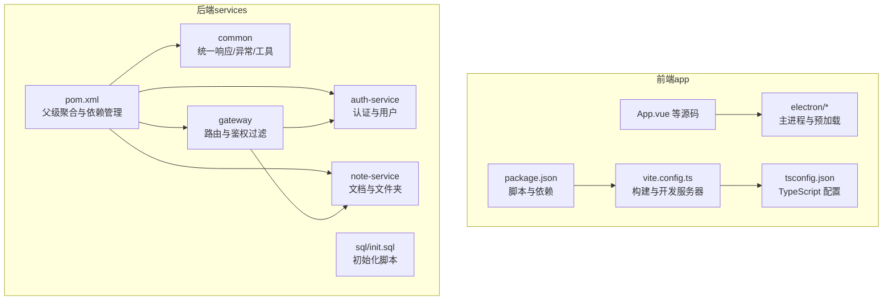
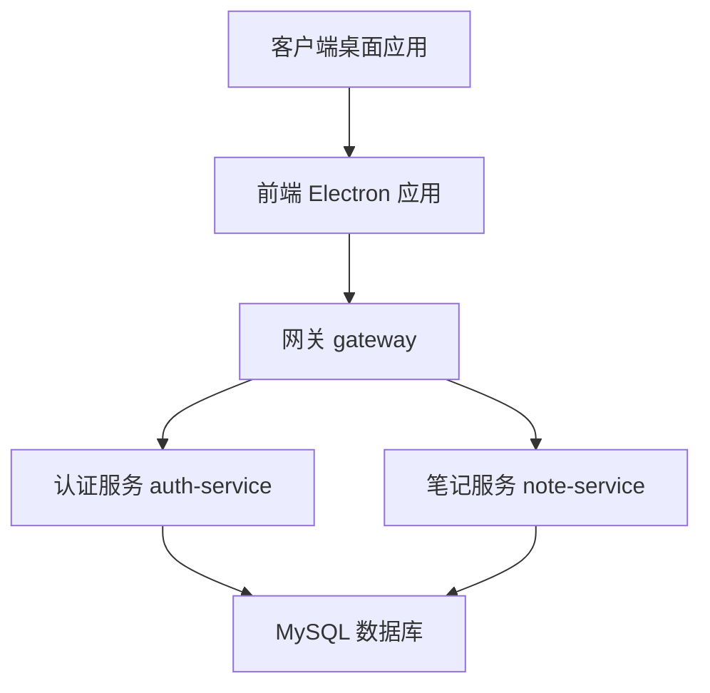
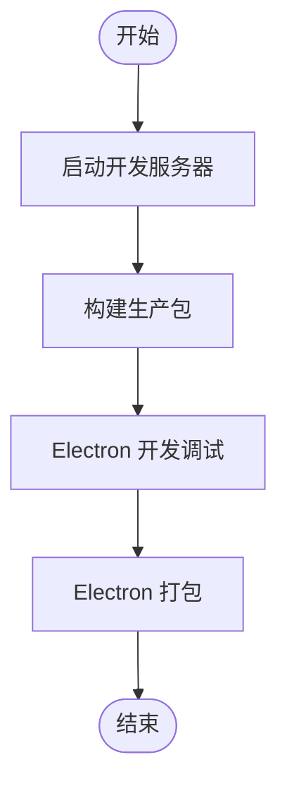
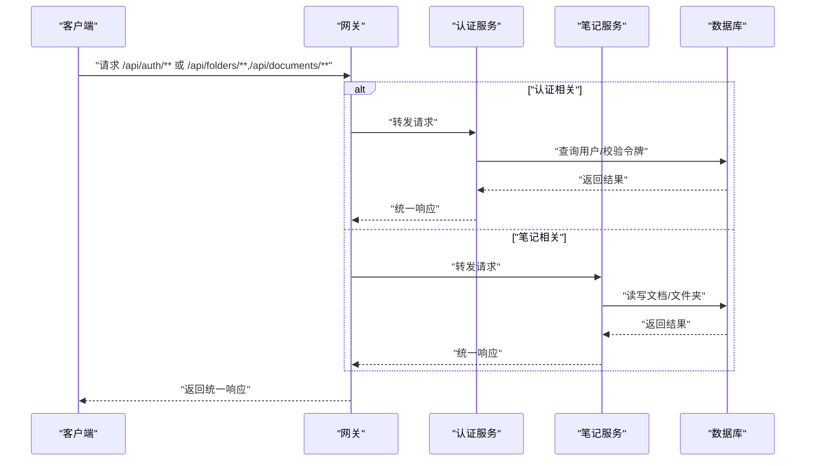
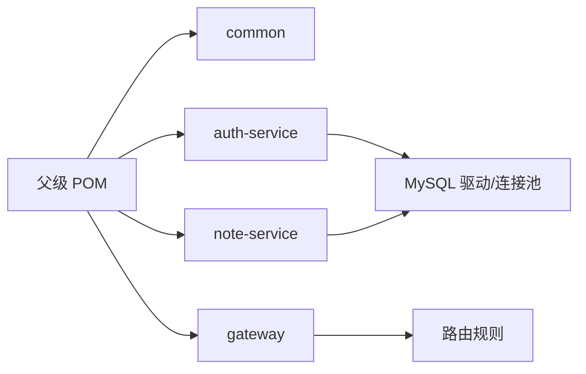

# 贡献指南

<cite>
**本文引用的文件**
- [README.md](file://README.md)
- [package.json](file://app/package.json)
- [vite.config.ts](file://app/vite.config.ts)
- [tsconfig.json](file://app/tsconfig.json)
- [pom.xml](file://services/pom.xml)
- [application.yml（网关）](file://services/gateway/src/main/resources/application.yml)
- [application.yml（认证服务）](file://services/auth-service/src/main/resources/application.yml)
- [application.yml（笔记服务）](file://services/note-service/src/main/resources/application.yml)
- [R.java（统一响应）](file://services/common/src/main/java/com/nonegonotes/common/result/R.java)
- [GlobalExceptionHandler.java（全局异常）](file://services/common/src/main/java/com/nonegonotes/common/exception/GlobalExceptionHandler.java)
- [AuthServiceApplication.java（认证应用入口）](file://services/auth-service/src/main/java/com/nonegonotes/auth/AuthServiceApplication.java)
</cite>

## 目录
1. [简介](#简介)
2. [项目结构](#项目结构)
3. [核心组件](#核心组件)
4. [架构总览](#架构总览)
5. [详细组件分析](#详细组件分析)
6. [依赖分析](#依赖分析)
7. [性能考虑](#性能考虑)
8. [故障排查指南](#故障排查指南)
9. [结论](#结论)
10. [附录](#附录)

## 简介
本指南面向所有希望为 Woo（无我笔记）项目做出贡献的开发者，涵盖从环境搭建、代码贡献流程、代码审查标准、提交信息规范、问题报告到版本发布与社区协作的全流程。Woo 是一款专注写作的 Markdown 桌面笔记软件，采用前后端分离架构：前端基于 Vue 3 + TypeScript + Pinia，桌面端通过 Electron + Vite 构建；后端采用 Spring Boot 3 + Spring Cloud 微服务架构，使用 MyBatis Plus + MySQL 进行数据持久化，并以 JWT 实现认证。

## 项目结构
仓库采用多模块组织方式：
- app：前端应用（Vue 3 + Electron），包含 Electron 主进程与预加载脚本、组件、状态管理、类型定义、构建配置等。
- services：后端微服务（Spring Boot），包含通用模块 common、认证服务 auth-service、笔记服务 note-service、网关 gateway，以及数据库初始化脚本。
- 根目录 README 提供了开发与运行指引、项目结构概览及贡献说明。

图表来源
- [README.md:47-63](file://README.md#L47-L63)
- [package.json:1-38](file://app/package.json#L1-L38)
- [vite.config.ts:1-19](file://app/vite.config.ts#L1-L19)
- [tsconfig.json:1-25](file://app/tsconfig.json#L1-L25)
- [pom.xml:15-20](file://services/pom.xml#L15-L20)

章节来源
- [README.md:47-63](file://README.md#L47-L63)
- [package.json:1-38](file://app/package.json#L1-L38)
- [vite.config.ts:1-19](file://app/vite.config.ts#L1-L19)
- [tsconfig.json:1-25](file://app/tsconfig.json#L1-L25)
- [pom.xml:15-20](file://services/pom.xml#L15-L20)

## 核心组件
- 前端构建与开发
  - 使用 Vite 作为构建工具，开发服务器默认端口为 5173；Electron 开发与打包脚本在 package.json 中定义。
  - TypeScript 严格模式开启，包含未使用变量/参数检查与 switch 穷举检查等。
- 后端微服务
  - 父级 POM 聚合 common、auth-service、note-service、gateway 四个模块，统一管理 Spring Boot 与 Spring Cloud 版本。
  - 网关负责路由转发至认证与笔记服务；认证与笔记服务各自提供独立的 application.yml 配置。
  - 通用模块提供统一响应体与全局异常处理，确保接口一致性与可观测性。

章节来源
- [package.json:6-12](file://app/package.json#L6-L12)
- [vite.config.ts:13-18](file://app/vite.config.ts#L13-L18)
- [tsconfig.json:17-21](file://app/tsconfig.json#L17-L21)
- [pom.xml:41-120](file://services/pom.xml#L41-L120)
- [application.yml（网关）:11-22](file://services/gateway/src/main/resources/application.yml#L11-L22)
- [application.yml（认证服务）:1-40](file://services/auth-service/src/main/resources/application.yml#L1-L40)
- [application.yml（笔记服务）:1-35](file://services/note-service/src/main/resources/application.yml#L1-L35)
- [R.java（统一响应）:10-41](file://services/common/src/main/java/com/nonegonotes/common/result/R.java#L10-L41)
- [GlobalExceptionHandler.java（全局异常）:11-26](file://services/common/src/main/java/com/nonegonotes/common/exception/GlobalExceptionHandler.java#L11-L26)

## 架构总览
Woo 的整体架构由前端 Electron 应用与后端微服务组成，通过网关进行统一入口与路由分发，认证服务提供鉴权能力，笔记服务承载文档与文件夹业务。

图表来源
- [application.yml（网关）:11-22](file://services/gateway/src/main/resources/application.yml#L11-L22)
- [application.yml（认证服务）:7-12](file://services/auth-service/src/main/resources/application.yml#L7-L12)
- [application.yml（笔记服务）:7-12](file://services/note-service/src/main/resources/application.yml#L7-L12)

## 详细组件分析

### 前端组件分析
- 构建与开发
  - 开发服务器端口固定，便于本地联调与跨端口资源访问。
  - Electron 开发与打包脚本集中于 package.json，便于一次性安装与构建。
- 类型系统
  - 严格的 TypeScript 配置有助于减少运行时错误，提升代码质量与可维护性。

图表来源
- [package.json:6-12](file://app/package.json#L6-L12)
- [vite.config.ts:13-18](file://app/vite.config.ts#L13-L18)

章节来源
- [package.json:6-12](file://app/package.json#L6-L12)
- [vite.config.ts:13-18](file://app/vite.config.ts#L13-L18)
- [tsconfig.json:17-21](file://app/tsconfig.json#L17-L21)

### 后端组件分析
- 统一响应与异常处理
  - 统一响应体 R 提供成功与失败两种返回形式，简化前端处理。
  - 全局异常处理器对业务异常与未知异常分别处理，保证接口稳定性与可观测性。
- 网关路由
  - 网关根据路径将请求转发至对应微服务，便于后续扩展其他服务。

图表来源
- [application.yml（网关）:11-22](file://services/gateway/src/main/resources/application.yml#L11-L22)
- [R.java（统一响应）:19-40](file://services/common/src/main/java/com/nonegonotes/common/result/R.java#L19-L40)
- [GlobalExceptionHandler.java（全局异常）:15-25](file://services/common/src/main/java/com/nonegonotes/common/exception/GlobalExceptionHandler.java#L15-L25)

章节来源
- [R.java（统一响应）:10-41](file://services/common/src/main/java/com/nonegonotes/common/result/R.java#L10-L41)
- [GlobalExceptionHandler.java（全局异常）:11-26](file://services/common/src/main/java/com/nonegonotes/common/exception/GlobalExceptionHandler.java#L11-L26)
- [application.yml（网关）:11-22](file://services/gateway/src/main/resources/application.yml#L11-L22)

### 代码审查要点
- 代码质量
  - 前端：遵循 TypeScript 严格模式，避免未使用变量与参数，保持 switch 穷举完整。
  - 后端：统一使用 R 响应体与全局异常处理，避免重复样板代码；新增接口需补充 Knife4j 文档配置。
- 测试覆盖率
  - 建议在新增功能或修复缺陷时补充单元测试与集成测试，确保关键路径覆盖。
- 文档更新
  - 新增接口或变更行为需同步更新 Knife4j 文档与 README 中的开发与贡献说明。

章节来源
- [tsconfig.json:17-21](file://app/tsconfig.json#L17-L21)
- [R.java（统一响应）:19-40](file://services/common/src/main/java/com/nonegonotes/common/result/R.java#L19-L40)
- [GlobalExceptionHandler.java（全局异常）:15-25](file://services/common/src/main/java/com/nonegonotes/common/exception/GlobalExceptionHandler.java#L15-L25)
- [application.yml（网关）:35-40](file://services/gateway/src/main/resources/application.yml#L35-L40)

### 提交信息规范
- 格式建议
  - 类型: 变更主题（简短描述）
  - 例如：feat(app): 添加主题切换功能；fix(auth): 修复登录失败日志缺失
- 变更类型
  - feat：新增功能
  - fix：修复缺陷
  - refactor：重构但不改变行为
  - docs：仅文档变更
  - perf：性能优化
  - test：新增或修改测试
  - chore：构建流程、依赖管理等变更
- 影响范围
  - 在提交信息中明确指出受影响模块（如 app、auth-service、note-service、gateway、common）。

章节来源
- [README.md:65-67](file://README.md#L65-L67)

### 问题报告流程
- Bug 报告
  - 描述：清晰复现步骤、期望结果与实际结果
  - 环境：操作系统、浏览器/桌面应用版本、Node.js/Maven 版本
  - 日志：必要时附带控制台日志或后端异常堆栈
- 功能请求
  - 场景：该功能解决的具体问题
  - 方案：建议的实现思路或参考
- 讨论参与
  - 在 GitHub Discussions 或 Issue 中提出，维护者会及时反馈

章节来源
- [README.md:65-67](file://README.md#L65-L67)

### 版本发布与里程碑规划
- 版本号
  - 建议遵循语义化版本（主.次.修订），主版本用于破坏性变更，次版本用于新增功能，修订用于缺陷修复
- 发布节奏
  - 建议按季度或功能完成度进行发布，每次发布前进行回归测试与文档校对
- 里程碑
  - 在 GitHub 项目中创建里程碑，将相关 Issue 关联至里程碑以便跟踪

章节来源
- [README.md:69-72](file://README.md#L69-L72)

### 社区沟通机制
- 反馈渠道
  - Issues：缺陷与功能请求
  - Discussions：设计讨论与使用经验分享
- 行为准则
  - 尊重与包容，禁止人身攻击与不当言论
  - 基于事实与数据进行技术讨论

章节来源
- [README.md:65-67](file://README.md#L65-L67)

### 新贡献者入门指导
- 开发环境搭建
  - 前端：安装 Node.js，进入 app 目录执行依赖安装与启动命令
  - 后端：安装 JDK 17+ 与 Maven，进入 services 目录执行安装命令
- 代码风格
  - 前端：遵循 TypeScript 严格模式与 ESLint 规则（如存在）
  - 后端：遵循 Spring Boot 与 Lombok 规范，保持统一响应与异常处理风格
- 第一次贡献建议
  - 从 Good First Issue 开始，选择文档完善、小而明确的任务
  - 提交前确保本地构建与测试通过

章节来源
- [README.md:20-45](file://README.md#L20-L45)
- [package.json:6-12](file://app/package.json#L6-L12)
- [pom.xml:22-39](file://services/pom.xml#L22-L39)

### 感谢与认可机制
- 贡献记录
  - 每位贡献者将在贡献列表中被记录，感谢信与致谢页面将定期更新
- 奖励与激励
  - 对关键贡献者可提供周边或定制礼品，具体以社区投票决定

章节来源
- [README.md:69-72](file://README.md#L69-L72)

## 依赖分析
- 前端依赖
  - Vue 3、Pinia、Vite、Electron、TypeScript 等，构建与打包链路清晰
- 后端依赖
  - Spring Boot 3 与 Spring Cloud，MyBatis Plus、JWT、Knife4j、Druid 等，版本集中在父级 POM 管理

图表来源
- [pom.xml:41-120](file://services/pom.xml#L41-L120)
- [application.yml（认证服务）:7-12](file://services/auth-service/src/main/resources/application.yml#L7-L12)
- [application.yml（笔记服务）:7-12](file://services/note-service/src/main/resources/application.yml#L7-L12)
- [application.yml（网关）:11-22](file://services/gateway/src/main/resources/application.yml#L11-L22)

章节来源
- [pom.xml:41-120](file://services/pom.xml#L41-L120)

## 性能考虑
- 前端
  - 合理拆分包体积，避免一次性加载过多依赖；利用 Vite 的按需编译特性
- 后端
  - 使用连接池与缓存策略降低数据库压力；对高频接口进行限流与熔断
- 构建与发布
  - 使用 CI/CD 自动化构建与打包，减少人工干预带来的性能损耗

## 故障排查指南
- 常见问题
  - 端口占用：调整开发服务器端口或关闭冲突进程
  - 依赖安装失败：清理缓存并重新安装，检查网络与镜像源
  - 数据库连接异常：核对 application.yml 中的数据库地址、账号与密码
- 排查步骤
  - 查看控制台输出与日志文件
  - 使用 Knife4j 文档验证接口可用性
  - 分模块启动服务，定位问题所在模块

章节来源
- [vite.config.ts:13-18](file://app/vite.config.ts#L13-L18)
- [application.yml（网关）:1-27](file://services/gateway/src/main/resources/application.yml#L1-L27)
- [application.yml（认证服务）:1-40](file://services/auth-service/src/main/resources/application.yml#L1-L40)
- [application.yml（笔记服务）:1-35](file://services/note-service/src/main/resources/application.yml#L1-L35)
- [R.java（统一响应）:19-40](file://services/common/src/main/java/com/nonegonotes/common/result/R.java#L19-L40)
- [GlobalExceptionHandler.java（全局异常）:15-25](file://services/common/src/main/java/com/nonegonotes/common/exception/GlobalExceptionHandler.java#L15-L25)

## 结论
本贡献指南提供了从环境搭建到代码审查、从问题报告到版本发布的完整流程，旨在帮助新老贡献者高效协作、提升代码质量与社区活力。请在提交前仔细阅读并遵循上述规范，共同建设更好的 Woo 项目。

## 附录
- 快速开始
  - 前端：进入 app 目录，安装依赖并启动开发服务器
  - 后端：进入 services 目录，执行安装命令并启动各微服务
- 参考文件
  - README 中的开发指南与项目结构说明
  - 各模块的配置文件与统一响应/异常处理规范

章节来源
- [README.md:20-45](file://README.md#L20-L45)
- [README.md:47-63](file://README.md#L47-L63)
- [R.java（统一响应）:10-41](file://services/common/src/main/java/com/nonegonotes/common/result/R.java#L10-L41)
- [GlobalExceptionHandler.java（全局异常）:11-26](file://services/common/src/main/java/com/nonegonotes/common/exception/GlobalExceptionHandler.java#L11-L26)