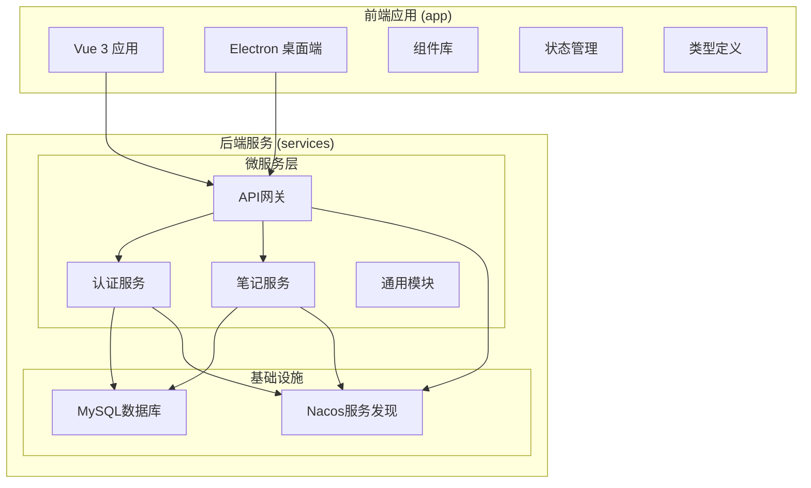
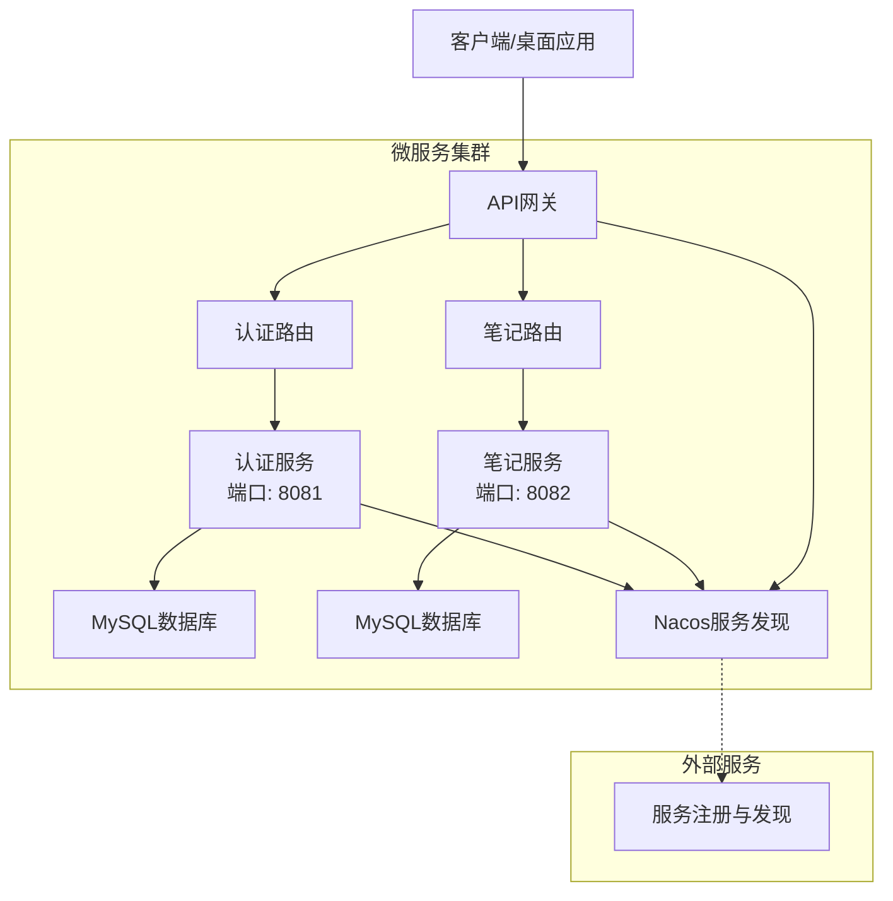
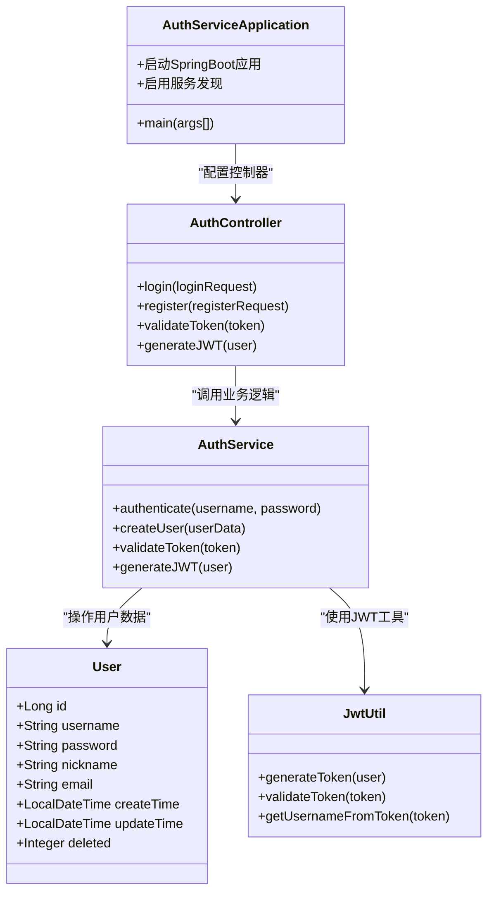
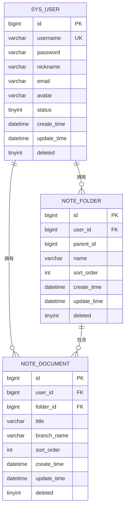
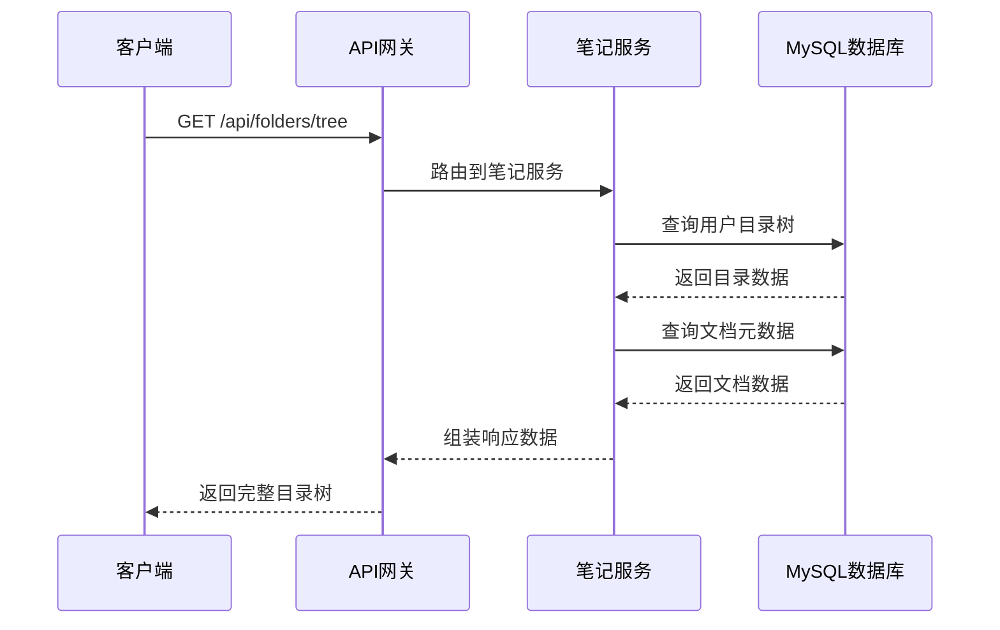
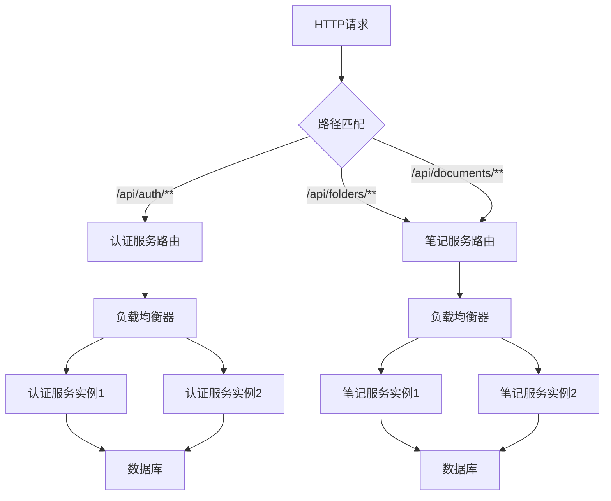
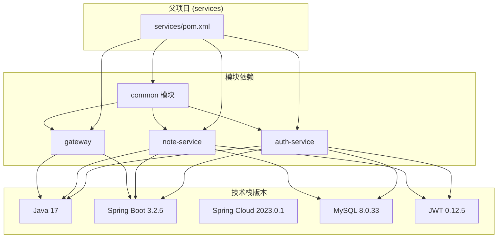
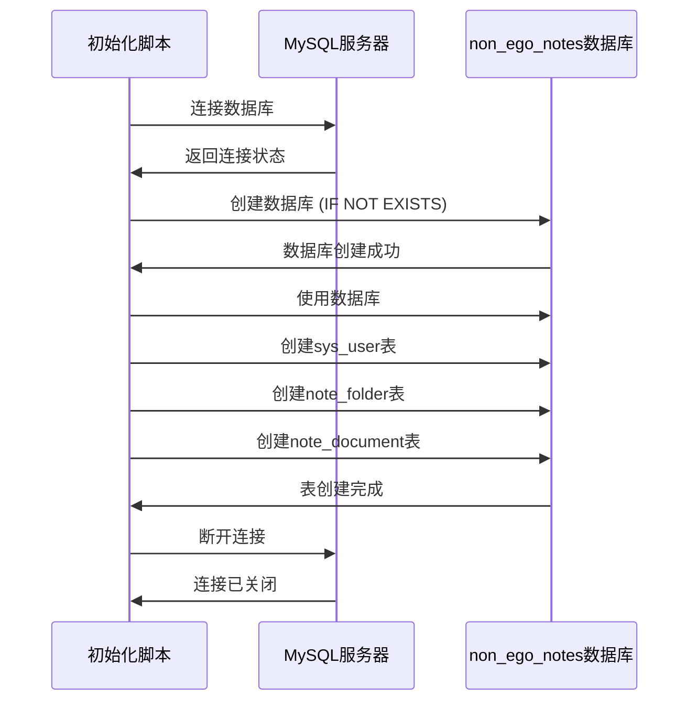

# Docker容器化部署

<cite>
**本文档引用的文件**
- [README.md](file://README.md)
- [app/package.json](file://app/package.json)
- [services/pom.xml](file://services/pom.xml)
- [services/auth-service/pom.xml](file://services/auth-service/pom.xml)
- [services/note-service/pom.xml](file://services/note-service/pom.xml)
- [services/gateway/pom.xml](file://services/gateway/pom.xml)
- [services/auth-service/src/main/resources/application.yml](file://services/auth-service/src/main/resources/application.yml)
- [services/note-service/src/main/resources/application.yml](file://services/note-service/src/main/resources/application.yml)
- [services/gateway/src/main/resources/application.yml](file://services/gateway/src/main/resources/application.yml)
- [services/auth-service/src/main/java/com/nonegonotes/auth/AuthServiceApplication.java](file://services/auth-service/src/main/java/com/nonegonotes/auth/AuthServiceApplication.java)
- [services/note-service/src/main/java/com/nonegonotes/note/NoteServiceApplication.java](file://services/note-service/src/main/java/com/nonegonotes/note/NoteServiceApplication.java)
- [services/gateway/src/main/java/com/nonegonotes/gateway/GatewayApplication.java](file://services/gateway/src/main/java/com/nonegonotes/gateway/GatewayApplication.java)
- [services/common/src/main/java/com/nonegonotes/common/entity/User.java](file://services/common/src/main/java/com/nonegonotes/common/entity/User.java)
- [services/common/src/main/java/com/nonegonotes/common/entity/Document.java](file://services/common/src/main/java/com/nonegonotes/common/entity/Document.java)
- [services/common/src/main/java/com/nonegonotes/common/entity/Folder.java](file://services/common/src/main/java/com/nonegonotes/common/entity/Folder.java)
- [services/sql/init.sql](file://services/sql/init.sql)
</cite>

## 目录
1. [简介](#简介)
2. [项目结构](#项目结构)
3. [核心组件](#核心组件)
4. [架构概览](#架构概览)
5. [详细组件分析](#详细组件分析)
6. [依赖关系分析](#依赖关系分析)
7. [性能考虑](#性能考虑)
8. [故障排除指南](#故障排除指南)
9. [结论](#结论)

## 简介

Woo（无我笔记）是一个专注于写作的Markdown桌面笔记软件，采用前后端分离的微服务架构。本项目包含Vue 3 + Electron前端应用和基于Spring Boot 3 + Spring Cloud的微服务后端系统。

该系统的核心特性包括：
- 简洁的Markdown编辑体验
- Git版本管理支持
- 思维导图与大纲视图
- AI辅助写作能力（规划中）

技术栈概述：
- **前端**: Vue 3 + TypeScript + Pinia + Electron + Vite
- **桌面端**: Electron + Vite
- **后端**: Spring Boot 3 + Spring Cloud Gateway
- **持久化**: MyBatis Plus + MySQL
- **认证**: JWT

## 项目结构

Woo项目采用模块化组织方式，主要分为两个核心部分：

**图表来源**
- [README.md:47-63](file://README.md#L47-L63)
- [services/pom.xml:15-20](file://services/pom.xml#L15-L20)

**章节来源**
- [README.md:12-18](file://README.md#L12-L18)
- [README.md:47-63](file://README.md#L47-L63)

## 核心组件

### 前端应用 (Vue 3 + Electron)

前端采用现代化的Vue 3技术栈，结合Electron实现桌面端应用。项目使用Vite作为构建工具，支持TypeScript和Pinia状态管理。

关键特性：
- **开发体验**: 支持热重载和快速开发迭代
- **构建优化**: 生产环境代码分割和压缩
- **桌面集成**: Electron原生功能集成
- **组件化**: 可复用的UI组件库

### 微服务后端架构

后端采用Spring Cloud微服务架构，包含三个核心服务：

1. **认证服务 (auth-service)**: 处理用户认证和授权
2. **笔记服务 (note-service)**: 管理目录和文档元数据
3. **API网关 (gateway)**: 统一入口点和路由分发

**章节来源**
- [app/package.json:13-35](file://app/package.json#L13-L35)
- [services/pom.xml:15-20](file://services/pom.xml#L15-L20)

## 架构概览

系统采用分布式微服务架构，通过API网关统一对外提供服务：

**图表来源**
- [services/gateway/src/main/resources/application.yml:11-22](file://services/gateway/src/main/resources/application.yml#L11-L22)
- [services/auth-service/src/main/resources/application.yml:1-2](file://services/auth-service/src/main/resources/application.yml#L1-L2)
- [services/note-service/src/main/resources/application.yml:1-2](file://services/note-service/src/main/resources/application.yml#L1-L2)

## 详细组件分析

### 认证服务 (Auth Service)

认证服务负责用户身份验证和授权管理，是整个系统的安全基石。

#### 核心功能模块

**图表来源**
- [services/auth-service/src/main/java/com/nonegonotes/auth/AuthServiceApplication.java:1-15](file://services/auth-service/src/main/java/com/nonegonotes/auth/AuthServiceApplication.java#L1-L15)
- [services/common/src/main/java/com/nonegonotes/common/entity/User.java:1-40](file://services/common/src/main/java/com/nonegonotes/common/entity/User.java#L1-L40)

#### 配置要点

认证服务的关键配置包括：
- **端口设置**: 8081
- **数据库连接**: MySQL (non_ego_notes数据库)
- **JWT配置**: 密钥长度至少32字节
- **服务发现**: Nacos注册地址

**章节来源**
- [services/auth-service/src/main/resources/application.yml:1-40](file://services/auth-service/src/main/resources/application.yml#L1-L40)
- [services/auth-service/src/main/java/com/nonegonotes/auth/AuthServiceApplication.java:1-15](file://services/auth-service/src/main/java/com/nonegonotes/auth/AuthServiceApplication.java#L1-L15)

### 笔记服务 (Note Service)

笔记服务专注于管理用户的目录和文档元数据，提供完整的笔记组织功能。

#### 数据模型设计

**图表来源**
- [services/common/src/main/java/com/nonegonotes/common/entity/User.java:11-39](file://services/common/src/main/java/com/nonegonotes/common/entity/User.java#L11-L39)
- [services/common/src/main/java/com/nonegonotes/common/entity/Document.java:11-41](file://services/common/src/main/java/com/nonegonotes/common/entity/Document.java#L11-L41)
- [services/common/src/main/java/com/nonegonotes/common/entity/Folder.java:11-38](file://services/common/src/main/java/com/nonegonotes/common/entity/Folder.java#L11-L38)

#### 核心业务流程

**图表来源**
- [services/gateway/src/main/resources/application.yml:18-22](file://services/gateway/src/main/resources/application.yml#L18-L22)
- [services/note-service/src/main/resources/application.yml:1-35](file://services/note-service/src/main/resources/application.yml#L1-L35)

**章节来源**
- [services/note-service/src/main/resources/application.yml:1-35](file://services/note-service/src/main/resources/application.yml#L1-L35)
- [services/common/src/main/java/com/nonegonotes/common/entity/Document.java:1-42](file://services/common/src/main/java/com/nonegonotes/common/entity/Document.java#L1-L42)
- [services/common/src/main/java/com/nonegonotes/common/entity/Folder.java:1-39](file://services/common/src/main/java/com/nonegonotes/common/entity/Folder.java#L1-L39)

### API网关 (Gateway)

API网关作为系统的统一入口点，负责请求路由、负载均衡和安全控制。

#### 路由配置策略

**图表来源**
- [services/gateway/src/main/resources/application.yml:12-22](file://services/gateway/src/main/resources/application.yml#L12-L22)

#### 安全过滤机制

网关集成了JWT令牌验证过滤器，确保所有请求的安全性：

**章节来源**
- [services/gateway/src/main/resources/application.yml:1-27](file://services/gateway/src/main/resources/application.yml#L1-L27)
- [services/gateway/src/main/java/com/nonegonotes/gateway/GatewayApplication.java:1-15](file://services/gateway/src/main/java/com/nonegonotes/gateway/GatewayApplication.java#L1-L15)

## 依赖关系分析

### Maven项目依赖结构

**图表来源**
- [services/pom.xml:22-39](file://services/pom.xml#L22-L39)
- [services/auth-service/pom.xml:19-98](file://services/auth-service/pom.xml#L19-L98)
- [services/note-service/pom.xml:19-82](file://services/note-service/pom.xml#L19-L82)
- [services/gateway/pom.xml:19-60](file://services/gateway/pom.xml#L19-L60)

### 数据库初始化流程

**图表来源**
- [services/sql/init.sql:1-55](file://services/sql/init.sql#L1-L55)

**章节来源**
- [services/pom.xml:122-139](file://services/pom.xml#L122-L139)
- [services/sql/init.sql:1-55](file://services/sql/init.sql#L1-L55)

## 性能考虑

### 微服务架构优势

1. **独立扩展**: 每个服务可以独立水平扩展
2. **技术多样性**: 不同服务可以使用最适合的技术栈
3. **故障隔离**: 单个服务故障不影响其他服务
4. **开发效率**: 团队可以并行开发不同服务

### 数据访问优化

- **连接池管理**: 使用Druid连接池优化数据库连接
- **查询优化**: MyBatis Plus提供高效的ORM映射
- **缓存策略**: 可在服务层添加适当的缓存机制
- **索引设计**: 数据库表已包含必要的索引优化

### 网络通信优化

- **负载均衡**: Spring Cloud LoadBalancer自动处理服务发现
- **熔断机制**: 可集成Hystrix或Resilience4j实现熔断保护
- **超时配置**: 合理设置请求超时和重试机制

## 故障排除指南

### 常见问题诊断

#### 1. 服务启动失败

**症状**: 服务无法启动或启动后立即退出

**排查步骤**:
1. 检查端口占用情况 (8080, 8081, 8082)
2. 验证数据库连接配置
3. 确认JWT密钥配置正确
4. 检查Nacos服务发现连接

#### 2. 数据库连接问题

**症状**: 服务启动时报数据库连接错误

**解决方案**:
1. 确认MySQL服务正在运行
2. 验证数据库凭据配置
3. 检查防火墙设置
4. 确认数据库初始化脚本执行成功

#### 3. JWT认证失败

**症状**: 用户登录成功但后续请求被拒绝

**排查方法**:
1. 验证JWT密钥长度至少32字节
2. 检查客户端存储的令牌有效性
3. 确认时间同步问题
4. 验证签名算法配置

#### 4. API网关路由问题

**症状**: 请求无法正确路由到目标服务

**解决步骤**:
1. 检查网关路由配置
2. 验证服务实例注册状态
3. 确认负载均衡器配置
4. 查看服务发现日志

### 监控和日志

#### 日志配置建议

1. **服务日志**: 每个微服务独立日志文件
2. **访问日志**: API网关统一访问记录
3. **错误日志**: 异常堆栈信息记录
4. **审计日志**: 关键操作审计跟踪

#### 性能监控指标

1. **响应时间**: 各服务接口平均响应时间
2. **吞吐量**: 每秒请求数
3. **错误率**: 5xx错误比例
4. **资源使用**: CPU、内存、数据库连接数

**章节来源**
- [services/auth-service/src/main/resources/application.yml:30-40](file://services/auth-service/src/main/resources/application.yml#L30-L40)
- [services/note-service/src/main/resources/application.yml:30-35](file://services/note-service/src/main/resources/application.yml#L30-L35)
- [services/gateway/src/main/resources/application.yml:24-27](file://services/gateway/src/main/resources/application.yml#L24-L27)

## 结论

Woo项目的微服务架构设计合理，前后端分离清晰，具备良好的扩展性和维护性。通过采用Spring Cloud技术栈，系统实现了服务间的松耦合和高内聚。

### 部署建议

1. **容器化优先**: 建议使用Docker进行容器化部署
2. **配置管理**: 使用环境变量和配置中心管理敏感信息
3. **监控完善**: 集成APM工具进行性能监控
4. **备份策略**: 制定数据库和配置文件的定期备份计划
5. **安全加固**: 实施网络隔离和服务间认证

该架构为未来的功能扩展和技术演进奠定了坚实基础，能够支持从个人使用到企业级应用的各种场景需求。